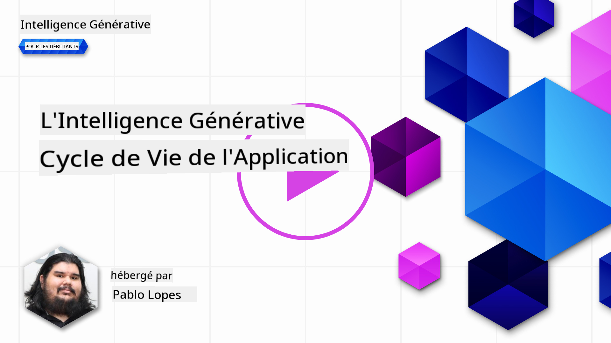
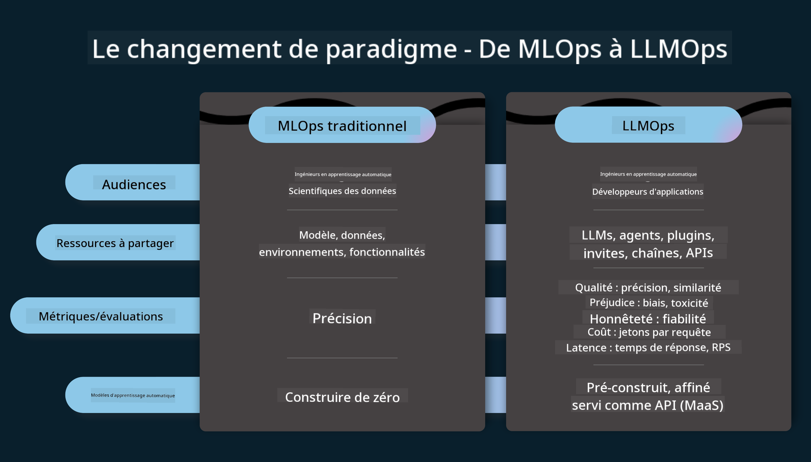
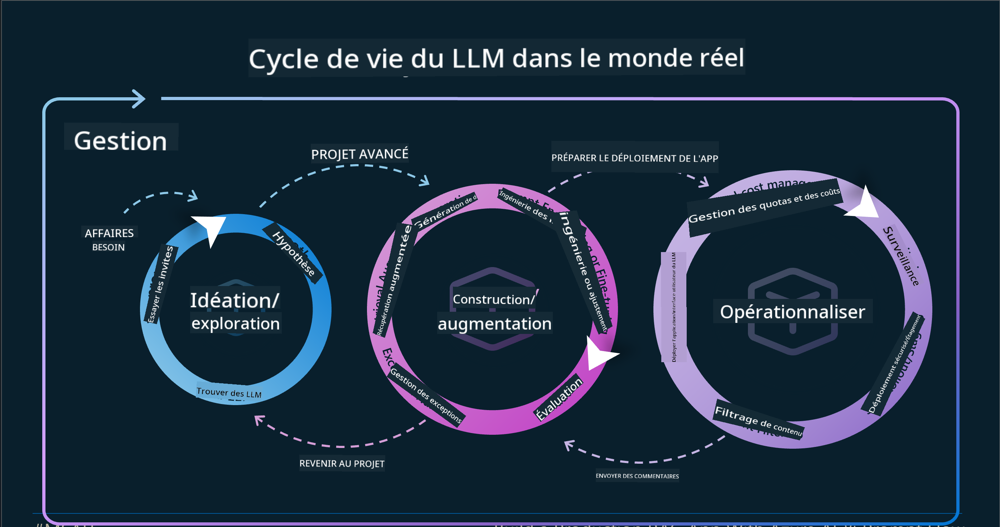
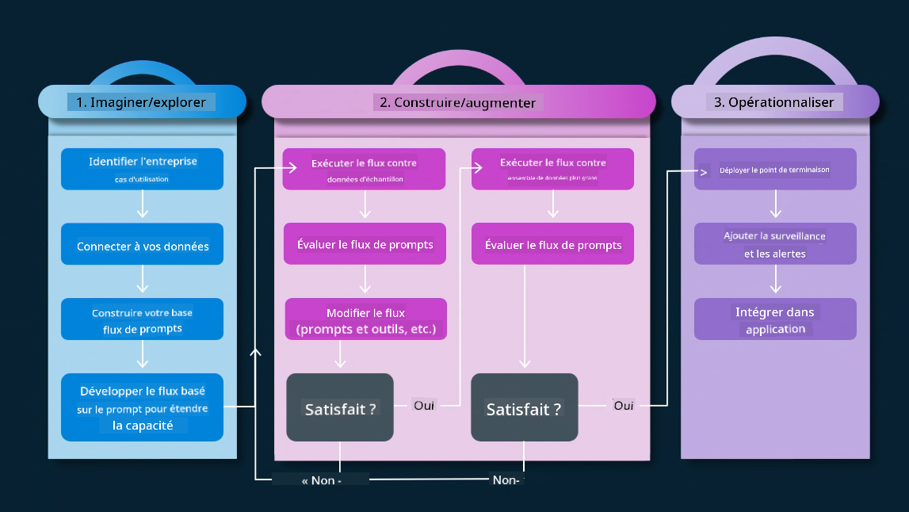
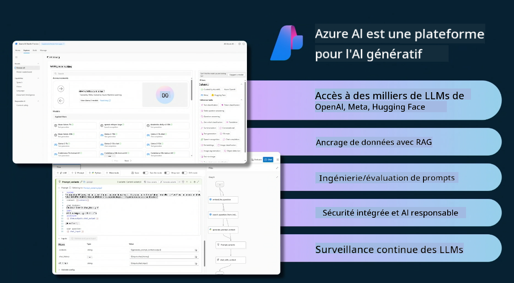
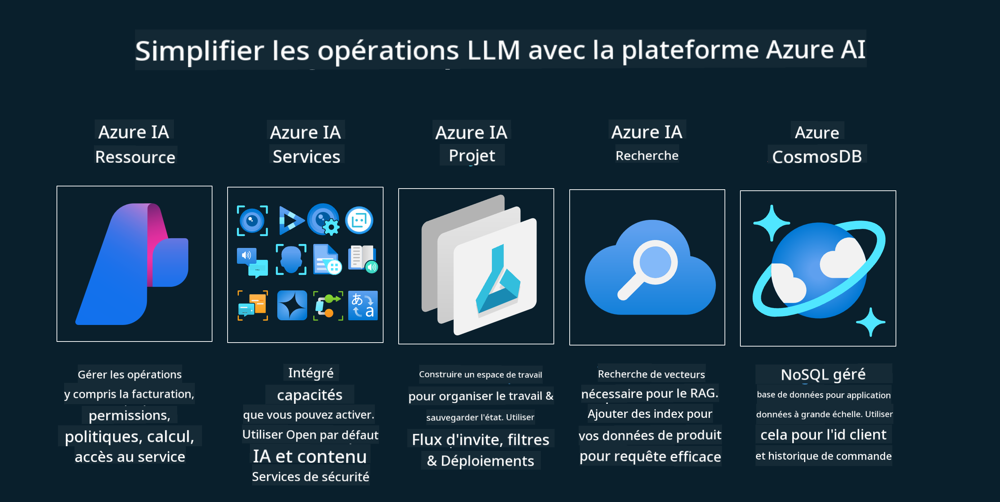
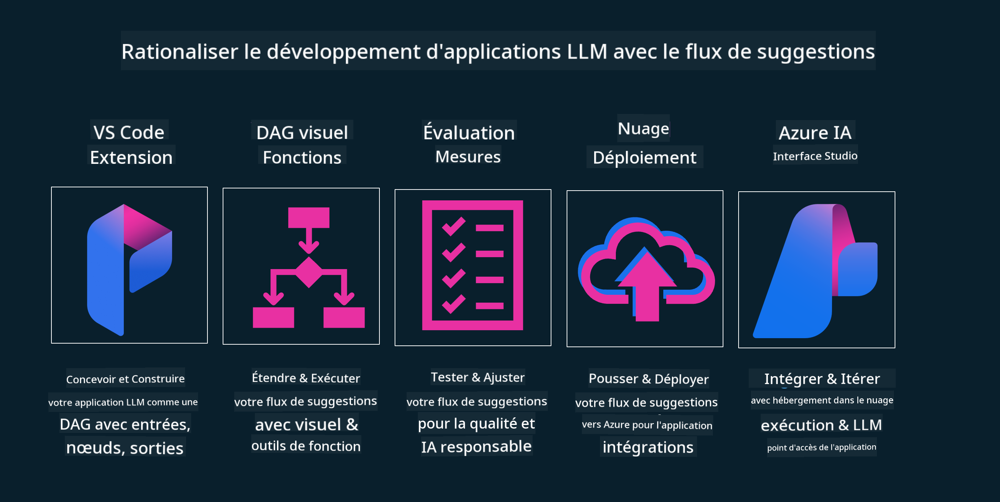

<!--
CO_OP_TRANSLATOR_METADATA:
{
  "original_hash": "27a5347a5022d5ef0a72ab029b03526a",
  "translation_date": "2025-06-25T21:53:21+00:00",
  "source_file": "14-the-generative-ai-application-lifecycle/README.md",
  "language_code": "fr"
}
-->

# Le cycle de vie des applications d'IA générative

Une question importante pour toutes les applications d'IA est la pertinence des fonctionnalités d'IA, car l'IA est un domaine en évolution rapide. Pour garantir que votre application reste pertinente, fiable et robuste, vous devez la surveiller, l'évaluer et l'améliorer en continu. C'est là qu'intervient le cycle de vie de l'IA générative.

Le cycle de vie de l'IA générative est un cadre qui vous guide à travers les étapes de développement, de déploiement et de maintenance d'une application d'IA générative. Il vous aide à définir vos objectifs, mesurer vos performances, identifier vos défis et mettre en œuvre vos solutions. Il vous aide également à aligner votre application avec les normes éthiques et légales de votre domaine et de vos parties prenantes. En suivant le cycle de vie de l'IA générative, vous pouvez vous assurer que votre application apporte toujours de la valeur et satisfait vos utilisateurs.

## Introduction

Dans ce chapitre, vous allez :

- Comprendre le changement de paradigme de MLOps à LLMOps
- Le cycle de vie de LLM
- Outils du cycle de vie
- Métrification et évaluation du cycle de vie

## Comprendre le changement de paradigme de MLOps à LLMOps

Les LLMs sont un nouvel outil dans l'arsenal de l'intelligence artificielle, ils sont incroyablement puissants pour les tâches d'analyse et de génération pour les applications. Cependant, cette puissance a des conséquences sur la façon dont nous rationalisons les tâches d'IA et d'apprentissage automatique classique.

Avec cela, nous avons besoin d'un nouveau paradigme pour adapter cet outil de manière dynamique, avec les incitations appropriées. Nous pouvons catégoriser les anciennes applications d'IA comme des "applications ML" et les nouvelles applications d'IA comme des "applications GenAI" ou simplement "applications IA", reflétant la technologie et les techniques grand public utilisées à l'époque. Cela modifie notre récit de plusieurs façons, regardez la comparaison suivante.

Remarquez que dans LLMOps, nous nous concentrons davantage sur les développeurs d'applications, en utilisant les intégrations comme point clé, en utilisant des "Modèles-en-tant-que-Service" et en pensant aux points suivants pour les métriques.

- Qualité : Qualité des réponses
- Préjudice : IA responsable
- Honnêteté : Ancrage des réponses (Cela a-t-il du sens ? Est-ce correct ?)
- Coût : Budget de la solution
- Latence : Temps moyen pour la réponse de jeton

## Le cycle de vie de LLM

Tout d'abord, pour comprendre le cycle de vie et les modifications, notons l'infographie suivante.

Comme vous pouvez le constater, cela diffère des cycles de vie habituels de MLOps. Les LLMs ont de nombreuses nouvelles exigences, comme le Prompting, différentes techniques pour améliorer la qualité (Fine-Tuning, RAG, Meta-Prompts), une évaluation et une responsabilité différentes avec l'IA responsable, enfin, de nouvelles métriques d'évaluation (Qualité, Préjudice, Honnêteté, Coût et Latence).

Par exemple, regardez comment nous idéons. Utiliser l'ingénierie de prompt pour expérimenter avec divers LLMs pour explorer les possibilités de tester si leur hypothèse pourrait être correcte.

Notez que ce n'est pas linéaire, mais des boucles intégrées, itératives et avec un cycle global.

Comment pourrions-nous explorer ces étapes ? Entrons dans les détails sur la façon dont nous pourrions construire un cycle de vie.

Cela peut sembler un peu compliqué, concentrons-nous d'abord sur les trois grandes étapes.

1. Idéation/Exploration : Exploration, ici nous pouvons explorer selon nos besoins commerciaux. Prototypage, création d'un [PromptFlow](https://microsoft.github.io/promptflow/index.html?WT.mc_id=academic-105485-koreyst) et tester s'il est suffisamment efficace pour notre hypothèse.
2. Construction/Augmentation : Mise en œuvre, maintenant, nous commençons à évaluer pour des ensembles de données plus importants, mettre en œuvre des techniques, comme le Fine-tuning et le RAG, pour vérifier la robustesse de notre solution. Si ce n'est pas le cas, le réimplémenter, ajouter de nouvelles étapes dans notre flux ou restructurer les données, pourrait aider. Après avoir testé notre flux et notre échelle, si cela fonctionne et vérifie nos métriques, il est prêt pour l'étape suivante.
3. Opérationnalisation : Intégration, maintenant ajouter des systèmes de surveillance et d'alertes à notre système, déploiement et intégration d'application à notre application.

Ensuite, nous avons le cycle global de gestion, axé sur la sécurité, la conformité et la gouvernance.

Félicitations, vous avez maintenant votre application IA prête à fonctionner et opérationnelle. Pour une expérience pratique, jetez un œil à la [démo Contoso Chat.](https://nitya.github.io/contoso-chat/?WT.mc_id=academic-105485-koreyst)

Maintenant, quels outils pourrions-nous utiliser ?

## Outils du cycle de vie

Pour les outils, Microsoft fournit la [plateforme Azure AI](https://azure.microsoft.com/solutions/ai/?WT.mc_id=academic-105485-koreys) et [PromptFlow](https://microsoft.github.io/promptflow/index.html?WT.mc_id=academic-105485-koreyst) pour faciliter et rendre votre cycle facile à mettre en œuvre et prêt à l'emploi.

La [plateforme Azure AI](https://azure.microsoft.com/solutions/ai/?WT.mc_id=academic-105485-koreys), vous permet d'utiliser [AI Studio](https://ai.azure.com/?WT.mc_id=academic-105485-koreys). AI Studio est un portail web qui vous permet d'explorer des modèles, des échantillons et des outils. Gérer vos ressources, flux de développement UI et options SDK/CLI pour le développement orienté code.

Azure AI, vous permet d'utiliser de multiples ressources, pour gérer vos opérations, services, projets, recherche vectorielle et besoins en bases de données.

Construire, du Proof-of-Concept (POC) jusqu'aux applications à grande échelle avec PromptFlow :

- Concevoir et construire des applications depuis VS Code, avec des outils visuels et fonctionnels
- Tester et peaufiner vos applications pour une IA de qualité, en toute simplicité.
- Utiliser Azure AI Studio pour intégrer et itérer avec le cloud, pousser et déployer pour une intégration rapide.

## Super ! Continuez votre apprentissage !

Génial, apprenez maintenant comment nous structurons une application pour utiliser les concepts avec l'[application Contoso Chat](https://nitya.github.io/contoso-chat/?WT.mc_id=academic-105485-koreyst), pour voir comment le plaidoyer en faveur du cloud ajoute ces concepts dans les démonstrations. Pour plus de contenu, consultez notre [session de décryptage Ignite !](https://www.youtube.com/watch?v=DdOylyrTOWg)

Maintenant, consultez la leçon 15, pour comprendre comment [la génération augmentée par récupération et les bases de données vectorielles](../15-rag-and-vector-databases/README.md?WT.mc_id=academic-105485-koreyst) impactent l'IA générative et permettent de créer des applications plus engageantes !

**Avertissement** :  
Ce document a été traduit à l'aide du service de traduction IA [Co-op Translator](https://github.com/Azure/co-op-translator). Bien que nous nous efforcions d'assurer l'exactitude, veuillez noter que les traductions automatisées peuvent contenir des erreurs ou des inexactitudes. Le document original dans sa langue d'origine doit être considéré comme la source faisant autorité. Pour des informations critiques, une traduction humaine professionnelle est recommandée. Nous ne sommes pas responsables des malentendus ou des interprétations erronées résultant de l'utilisation de cette traduction.