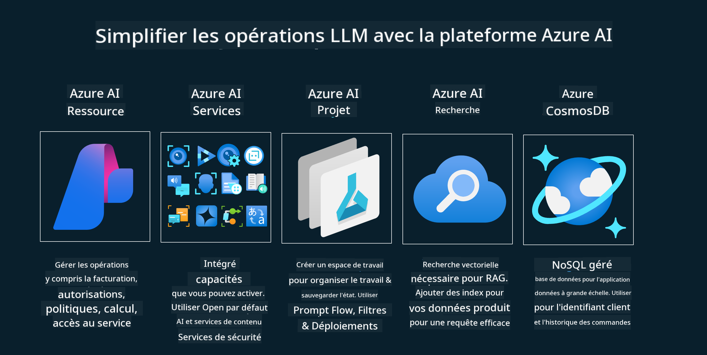

<!--
CO_OP_TRANSLATOR_METADATA:
{
  "original_hash": "b9d32511b27373a1b21b5789d4fda057",
  "translation_date": "2025-10-17T22:41:51+00:00",
  "source_file": "14-the-generative-ai-application-lifecycle/README.md",
  "language_code": "fr"
}
-->

# Le cycle de vie des applications d'IA générative

Une question importante pour toutes les applications d'IA est la pertinence des fonctionnalités d'IA, car l'IA est un domaine en évolution rapide. Pour garantir que votre application reste pertinente, fiable et robuste, vous devez la surveiller, l'évaluer et l'améliorer en continu. C'est là qu'intervient le cycle de vie de l'IA générative.

Le cycle de vie de l'IA générative est un cadre qui vous guide à travers les étapes de développement, de déploiement et de maintenance d'une application d'IA générative. Il vous aide à définir vos objectifs, mesurer vos performances, identifier vos défis et mettre en œuvre vos solutions. Il vous permet également d'aligner votre application sur les normes éthiques et juridiques de votre domaine et de vos parties prenantes. En suivant le cycle de vie de l'IA générative, vous pouvez vous assurer que votre application apporte toujours de la valeur et satisfait vos utilisateurs.

## Introduction

Dans ce chapitre, vous allez :

- Comprendre le changement de paradigme de MLOps à LLMOps
- Le cycle de vie des LLM
- Les outils du cycle de vie
- La métrification et l'évaluation du cycle de vie

## Comprendre le changement de paradigme de MLOps à LLMOps

Les LLM sont un nouvel outil dans l'arsenal de l'intelligence artificielle. Ils sont incroyablement puissants pour les tâches d'analyse et de génération dans les applications. Cependant, cette puissance a des conséquences sur la manière dont nous rationalisons les tâches d'IA et d'apprentissage automatique classique.

Pour cela, nous avons besoin d'un nouveau paradigme pour adapter cet outil de manière dynamique, avec les bons incitatifs. Nous pouvons catégoriser les anciennes applications d'IA comme des "applications ML" et les nouvelles applications d'IA comme des "applications GenAI" ou simplement "applications IA", reflétant la technologie et les techniques dominantes utilisées à l'époque. Cela modifie notre approche de plusieurs façons. Regardez la comparaison suivante.

Notez que dans LLMOps, nous nous concentrons davantage sur les développeurs d'applications, en utilisant les intégrations comme point clé, en utilisant des "modèles en tant que service" et en réfléchissant aux points suivants pour les métriques :

- Qualité : qualité des réponses
- Préjudice : IA responsable
- Honnêteté : fiabilité des réponses (Est-ce logique ? Est-ce correct ?)
- Coût : budget de la solution
- Latence : temps moyen de réponse par jeton

## Le cycle de vie des LLM

Tout d'abord, pour comprendre le cycle de vie et ses modifications, examinons l'infographie suivante.

Comme vous pouvez le constater, cela diffère des cycles de vie habituels de MLOps. Les LLM ont de nombreuses nouvelles exigences, comme le Prompting, différentes techniques pour améliorer la qualité (Fine-Tuning, RAG, Meta-Prompts), une évaluation et une responsabilité différentes avec l'IA responsable, et enfin, de nouvelles métriques d'évaluation (Qualité, Préjudice, Honnêteté, Coût et Latence).

Par exemple, regardez comment nous concevons. En utilisant l'ingénierie des prompts pour expérimenter avec divers LLM afin d'explorer les possibilités et de tester si leurs hypothèses pourraient être correctes.

Notez que ce processus n'est pas linéaire, mais constitué de boucles intégrées, itératives et avec un cycle global.

Comment pouvons-nous explorer ces étapes ? Entrons dans les détails pour comprendre comment construire un cycle de vie.

Cela peut sembler un peu compliqué, concentrons-nous d'abord sur les trois grandes étapes.

1. Idéation/Exploration : Exploration, ici nous pouvons explorer en fonction des besoins de notre entreprise. Prototypage, création d'un [PromptFlow](https://microsoft.github.io/promptflow/index.html?WT.mc_id=academic-105485-koreyst) et test de son efficacité par rapport à notre hypothèse.
2. Construction/Augmentation : Mise en œuvre, maintenant, nous commençons à évaluer pour des ensembles de données plus importants, en mettant en œuvre des techniques comme le Fine-tuning et le RAG, pour vérifier la robustesse de notre solution. Si ce n'est pas le cas, une réimplémentation, l'ajout de nouvelles étapes dans notre flux ou la restructuration des données peuvent aider. Après avoir testé notre flux et notre échelle, si cela fonctionne et que nos métriques sont satisfaisantes, nous passons à l'étape suivante.
3. Opérationnalisation : Intégration, maintenant, nous ajoutons des systèmes de surveillance et d'alertes à notre système, déployons et intégrons l'application à notre solution.

Ensuite, nous avons le cycle global de gestion, axé sur la sécurité, la conformité et la gouvernance.

Félicitations, votre application d'IA est maintenant prête à être opérationnelle. Pour une expérience pratique, consultez la [démo Contoso Chat.](https://nitya.github.io/contoso-chat/?WT.mc_id=academic-105485-koreys)

Maintenant, quels outils pouvons-nous utiliser ?

## Les outils du cycle de vie

Pour les outils, Microsoft propose la [plateforme Azure AI](https://azure.microsoft.com/solutions/ai/?WT.mc_id=academic-105485-koreys) et [PromptFlow](https://microsoft.github.io/promptflow/index.html?WT.mc_id=academic-105485-koreyst) pour faciliter et rendre votre cycle facile à mettre en œuvre et prêt à l'emploi.

La [plateforme Azure AI](https://azure.microsoft.com/solutions/ai/?WT.mc_id=academic-105485-koreys) vous permet d'utiliser [AI Studio](https://ai.azure.com/?WT.mc_id=academic-105485-koreys). AI Studio est un portail web qui vous permet d'explorer des modèles, des exemples et des outils. Il permet de gérer vos ressources, de développer des flux d'interface utilisateur et propose des options SDK/CLI pour le développement orienté code.

Azure AI vous permet d'utiliser plusieurs ressources pour gérer vos opérations, services, projets, recherches vectorielles et besoins en bases de données.

Construisez, depuis la preuve de concept (POC) jusqu'à des applications à grande échelle avec PromptFlow :

- Concevez et développez des applications depuis VS Code, avec des outils visuels et fonctionnels.
- Testez et ajustez vos applications pour une IA de qualité, en toute simplicité.
- Utilisez Azure AI Studio pour intégrer et itérer avec le cloud, déployer rapidement pour une intégration efficace.

## Super ! Continuez votre apprentissage !

Génial, apprenez maintenant comment structurer une application en utilisant les concepts avec l'[application Contoso Chat](https://nitya.github.io/contoso-chat/?WT.mc_id=academic-105485-koreyst), pour voir comment Cloud Advocacy intègre ces concepts dans des démonstrations. Pour plus de contenu, consultez notre [session de présentation Ignite !
](https://www.youtube.com/watch?v=DdOylyrTOWg)

Ensuite, consultez la leçon 15 pour comprendre comment [la génération augmentée par récupération et les bases de données vectorielles](../15-rag-and-vector-databases/README.md?WT.mc_id=academic-105485-koreyst) impactent l'IA générative et permettent de créer des applications plus engageantes !

---

**Avertissement** :  
Ce document a été traduit à l'aide du service de traduction automatique [Co-op Translator](https://github.com/Azure/co-op-translator). Bien que nous nous efforcions d'assurer l'exactitude, veuillez noter que les traductions automatisées peuvent contenir des erreurs ou des inexactitudes. Le document original dans sa langue d'origine doit être considéré comme la source faisant autorité. Pour des informations critiques, il est recommandé de recourir à une traduction humaine professionnelle. Nous ne sommes pas responsables des malentendus ou des interprétations erronées résultant de l'utilisation de cette traduction.