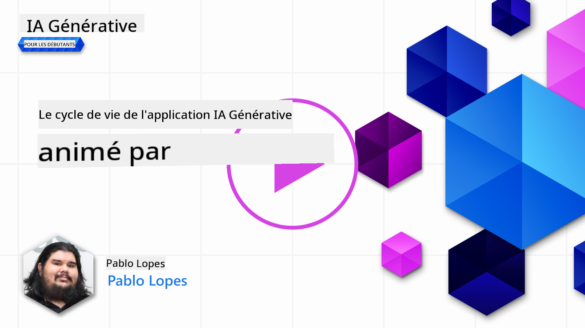
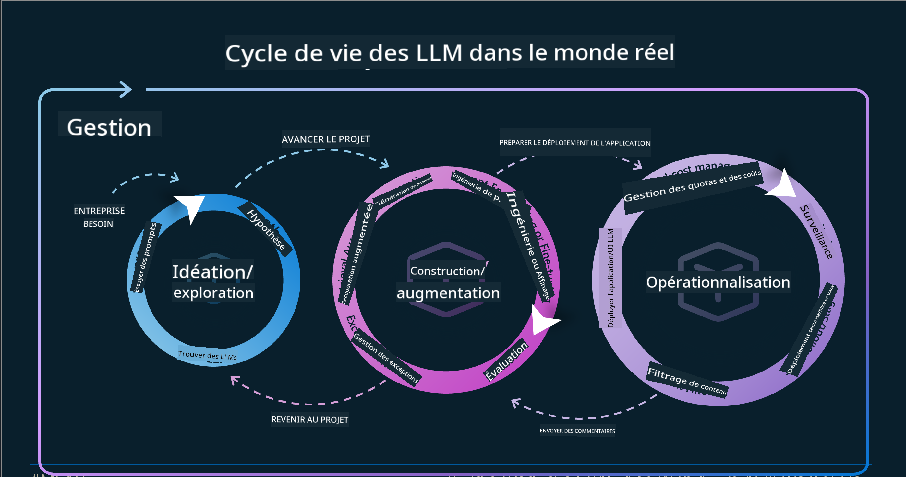

<!--
CO_OP_TRANSLATOR_METADATA:
{
  "original_hash": "27a5347a5022d5ef0a72ab029b03526a",
  "translation_date": "2025-07-09T15:46:23+00:00",
  "source_file": "14-the-generative-ai-application-lifecycle/README.md",
  "language_code": "fr"
}
-->

# Le cycle de vie des applications d’IA générative

Une question importante pour toutes les applications d’IA est la pertinence des fonctionnalités d’IA. Comme l’IA est un domaine en évolution rapide, pour garantir que votre application reste pertinente, fiable et robuste, vous devez la surveiller, l’évaluer et l’améliorer en continu. C’est là qu’intervient le cycle de vie de l’IA générative.

Le cycle de vie de l’IA générative est un cadre qui vous guide à travers les étapes de développement, de déploiement et de maintenance d’une application d’IA générative. Il vous aide à définir vos objectifs, mesurer vos performances, identifier vos défis et mettre en œuvre vos solutions. Il vous aide également à aligner votre application avec les normes éthiques et légales de votre domaine et de vos parties prenantes. En suivant ce cycle de vie, vous pouvez vous assurer que votre application apporte toujours de la valeur et satisfait vos utilisateurs.

## Introduction

Dans ce chapitre, vous allez :

- Comprendre le changement de paradigme de MLOps à LLMOps  
- Le cycle de vie des LLM  
- Les outils du cycle de vie  
- La métrification et l’évaluation du cycle de vie  

## Comprendre le changement de paradigme de MLOps à LLMOps

Les LLM sont un nouvel outil dans l’arsenal de l’intelligence artificielle, ils sont incroyablement puissants pour les tâches d’analyse et de génération dans les applications, cependant cette puissance a des conséquences sur la manière dont nous rationalisons les tâches d’IA et d’apprentissage automatique classique.

Dans ce contexte, nous avons besoin d’un nouveau paradigme pour adapter cet outil de manière dynamique, avec les bons incitatifs. On peut catégoriser les anciennes applications d’IA comme des « applications ML » et les nouvelles applications d’IA comme des « applications GenAI » ou simplement « applications IA », reflétant la technologie et les techniques grand public utilisées à l’époque. Cela modifie notre discours de plusieurs façons, regardez la comparaison suivante.

Notez que dans LLMOps, l’accent est davantage mis sur les développeurs d’applications, en utilisant les intégrations comme point clé, en adoptant le « Models-as-a-Service » et en réfléchissant aux points suivants pour les métriques.

- Qualité : qualité des réponses  
- Dommages : IA responsable  
- Honnêteté : fondement des réponses (Est-ce cohérent ? Est-ce correct ?)  
- Coût : budget de la solution  
- Latence : temps moyen de réponse par token  

## Le cycle de vie des LLM

Pour commencer à comprendre le cycle de vie et ses modifications, observons l’infographie suivante.

Comme vous pouvez le constater, cela diffère des cycles de vie habituels de MLOps. Les LLM ont de nombreuses nouvelles exigences, comme le prompting, différentes techniques pour améliorer la qualité (Fine-Tuning, RAG, Meta-Prompts), une évaluation et une responsabilité différentes avec l’IA responsable, enfin, de nouvelles métriques d’évaluation (Qualité, Dommages, Honnêteté, Coût et Latence).

Par exemple, regardez comment nous générons des idées. En utilisant l’ingénierie des prompts pour expérimenter avec différents LLM afin d’explorer les possibilités et tester si leur hypothèse pourrait être correcte.

Notez que ce processus n’est pas linéaire, mais constitué de boucles intégrées, itératives et avec un cycle global.

Comment pourrions-nous explorer ces étapes ? Entrons dans le détail pour voir comment construire un cycle de vie.

Cela peut sembler un peu compliqué, concentrons-nous d’abord sur les trois grandes étapes.

1. Génération d’idées / Exploration : Exploration, ici nous pouvons explorer selon nos besoins métier. Prototypage, création d’un [PromptFlow](https://microsoft.github.io/promptflow/index.html?WT.mc_id=academic-105485-koreyst) et test pour vérifier si c’est assez efficace pour notre hypothèse.  
1. Construction / Augmentation : Mise en œuvre, maintenant, nous commençons à évaluer sur des ensembles de données plus importants, à appliquer des techniques comme le fine-tuning et le RAG, pour vérifier la robustesse de notre solution. Si ce n’est pas le cas, la réimplémentation, l’ajout de nouvelles étapes dans notre flux ou la restructuration des données peuvent aider. Après avoir testé notre flux et notre montée en charge, si cela fonctionne et que nos métriques sont satisfaisantes, c’est prêt pour l’étape suivante.  
1. Mise en production : Intégration, maintenant en ajoutant des systèmes de surveillance et d’alerte à notre système, le déploiement et l’intégration de l’application à notre application principale.  

Ensuite, nous avons le cycle global de gestion, axé sur la sécurité, la conformité et la gouvernance.

Félicitations, votre application IA est maintenant prête et opérationnelle. Pour une expérience pratique, jetez un œil à la [démonstration Contoso Chat.](https://nitya.github.io/contoso-chat/?WT.mc_id=academic-105485-koreys)

Maintenant, quels outils pouvons-nous utiliser ?

## Outils du cycle de vie

Pour les outils, Microsoft propose la [plateforme Azure AI](https://azure.microsoft.com/solutions/ai/?WT.mc_id=academic-105485-koreys) et [PromptFlow](https://microsoft.github.io/promptflow/index.html?WT.mc_id=academic-105485-koreyst) qui facilitent et simplifient la mise en œuvre de votre cycle.

La [plateforme Azure AI](https://azure.microsoft.com/solutions/ai/?WT.mc_id=academic-105485-koreys) vous permet d’utiliser [AI Studio](https://ai.azure.com/?WT.mc_id=academic-105485-koreys). AI Studio est un portail web qui vous permet d’explorer des modèles, des exemples et des outils. Gérer vos ressources, les flux de développement UI et les options SDK/CLI pour un développement orienté code.

Azure AI vous permet d’utiliser plusieurs ressources pour gérer vos opérations, services, projets, recherches vectorielles et besoins en bases de données.

Construct, du Proof-of-Concept (POC) jusqu’aux applications à grande échelle avec PromptFlow :

- Concevez et développez des applications depuis VS Code, avec des outils visuels et fonctionnels  
- Testez et affinez vos applications pour une IA de qualité, facilement.  
- Utilisez Azure AI Studio pour intégrer et itérer avec le cloud, pousser et déployer pour une intégration rapide.  

## Super ! Continuez votre apprentissage !

Incroyable, apprenez maintenant comment structurer une application pour utiliser ces concepts avec l’[application Contoso Chat](https://nitya.github.io/contoso-chat/?WT.mc_id=academic-105485-koreyst), pour voir comment Cloud Advocacy intègre ces concepts dans des démonstrations. Pour plus de contenu, consultez notre [session Ignite !](https://www.youtube.com/watch?v=DdOylyrTOWg)

Maintenant, consultez la leçon 15, pour comprendre comment la [génération augmentée par récupération et les bases de données vectorielles](../15-rag-and-vector-databases/README.md?WT.mc_id=academic-105485-koreyst) impactent l’IA générative et permettent de créer des applications plus engageantes !

**Avertissement** :  
Ce document a été traduit à l’aide du service de traduction automatique [Co-op Translator](https://github.com/Azure/co-op-translator). Bien que nous nous efforcions d’assurer l’exactitude, veuillez noter que les traductions automatiques peuvent contenir des erreurs ou des inexactitudes. Le document original dans sa langue d’origine doit être considéré comme la source faisant foi. Pour les informations critiques, une traduction professionnelle réalisée par un humain est recommandée. Nous déclinons toute responsabilité en cas de malentendus ou de mauvaises interprétations résultant de l’utilisation de cette traduction.