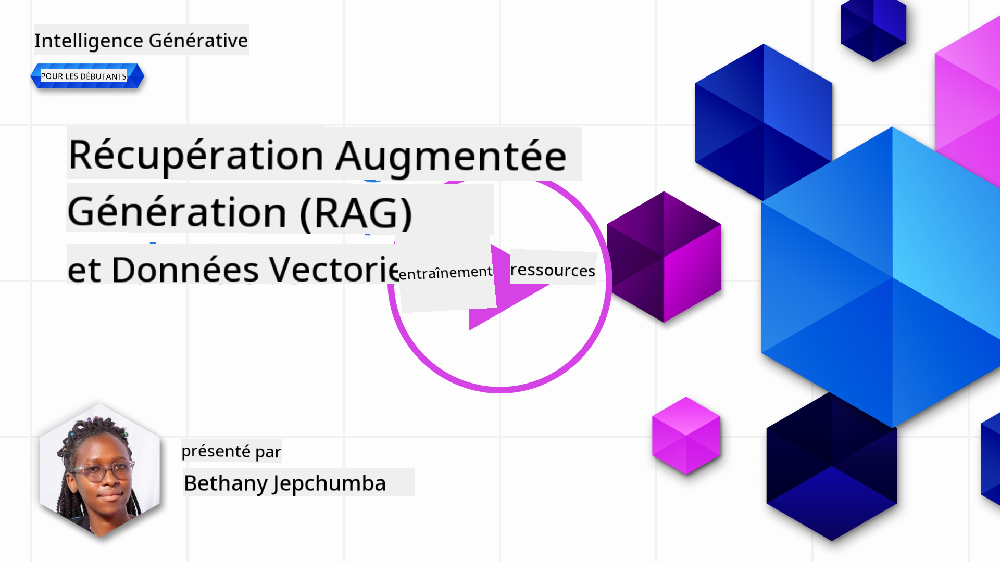
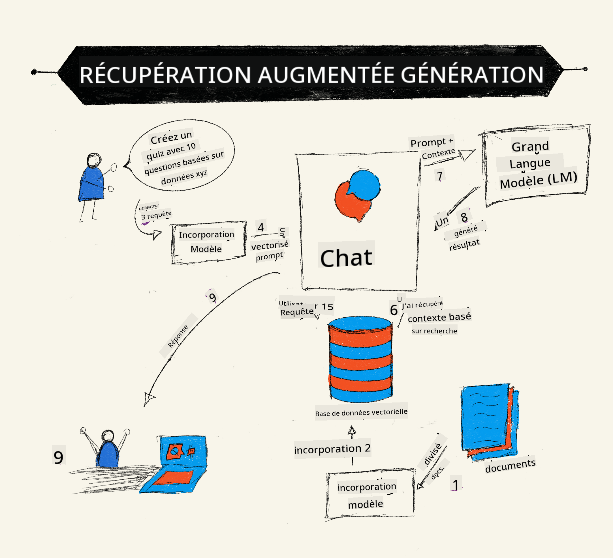

<!--
CO_OP_TRANSLATOR_METADATA:
{
  "original_hash": "e2861bbca91c0567ef32bc77fe054f9e",
  "translation_date": "2025-05-20T00:58:59+00:00",
  "source_file": "15-rag-and-vector-databases/README.md",
  "language_code": "fr"
}
-->
# Récupération Augmentée par Génération (RAG) et Bases de Données Vectorielles

[](https://aka.ms/gen-ai-lesson15-gh?WT.mc_id=academic-105485-koreyst)

Dans la leçon sur les applications de recherche, nous avons brièvement appris comment intégrer vos propres données dans les Modèles de Langage de Grande Taille (LLM). Dans cette leçon, nous allons approfondir les concepts de la fondation de vos données dans votre application LLM, les mécanismes du processus et les méthodes de stockage des données, y compris les embeddings et le texte.

> **Vidéo à venir**

## Introduction

Dans cette leçon, nous aborderons les points suivants :

- Une introduction à RAG, ce que c'est et pourquoi il est utilisé en intelligence artificielle (IA).

- Comprendre ce que sont les bases de données vectorielles et en créer une pour notre application.

- Un exemple pratique sur comment intégrer RAG dans une application.

## Objectifs d'apprentissage

Après avoir terminé cette leçon, vous serez capable de :

- Expliquer l'importance de RAG dans la récupération et le traitement des données.

- Configurer une application RAG et ancrer vos données à un LLM.

- Intégration efficace de RAG et des Bases de Données Vectorielles dans les applications LLM.

## Notre Scénario : améliorer nos LLMs avec nos propres données

Pour cette leçon, nous voulons ajouter nos propres notes dans la startup éducative, ce qui permet au chatbot d'obtenir plus d'informations sur les différents sujets. En utilisant les notes que nous avons, les apprenants pourront mieux étudier et comprendre les différents sujets, facilitant ainsi la révision pour leurs examens. Pour créer notre scénario, nous utiliserons :

- `Azure OpenAI:` le LLM que nous utiliserons pour créer notre chatbot

- `AI for beginners' lesson on Neural Networks` : ce sera les données sur lesquelles nous baserons notre LLM

- `Azure AI Search` et `Azure Cosmos DB:` base de données vectorielle pour stocker nos données et créer un index de recherche

Les utilisateurs pourront créer des quiz pratiques à partir de leurs notes, des cartes de révision et les résumer en aperçus concis. Pour commencer, voyons ce qu'est RAG et comment cela fonctionne :

## Récupération Augmentée par Génération (RAG)

Un chatbot alimenté par un LLM traite les invites des utilisateurs pour générer des réponses. Il est conçu pour être interactif et engage les utilisateurs sur un large éventail de sujets. Cependant, ses réponses sont limitées au contexte fourni et à ses données de formation de base. Par exemple, la limite de connaissance de GPT-4 est septembre 2021, ce qui signifie qu'il manque de connaissances sur les événements survenus après cette période. De plus, les données utilisées pour former les LLMs excluent les informations confidentielles telles que des notes personnelles ou le manuel produit d'une entreprise.

### Comment fonctionnent les RAGs (Récupération Augmentée par Génération)



Supposons que vous souhaitiez déployer un chatbot qui crée des quiz à partir de vos notes, vous aurez besoin d'une connexion à la base de connaissances. C'est là que RAG vient à la rescousse. Les RAGs fonctionnent comme suit :

- **Base de connaissances :** Avant la récupération, ces documents doivent être ingérés et prétraités, généralement en découpant de grands documents en morceaux plus petits, en les transformant en embeddings textuels et en les stockant dans une base de données.

- **Requête utilisateur :** l'utilisateur pose une question

- **Récupération :** Lorsqu'un utilisateur pose une question, le modèle d'embedding récupère des informations pertinentes de notre base de connaissances pour fournir plus de contexte qui sera intégré dans l'invite.

- **Génération augmentée :** le LLM améliore sa réponse en fonction des données récupérées. Cela permet à la réponse générée de ne pas seulement être basée sur des données pré-entraînées mais aussi sur des informations pertinentes du contexte ajouté. Les données récupérées sont utilisées pour augmenter les réponses du LLM. Le LLM retourne ensuite une réponse à la question de l'utilisateur.


L'architecture des RAGs est mise en œuvre à l'aide de transformateurs composés de deux parties : un encodeur et un décodeur. Par exemple, lorsqu'un utilisateur pose une question, le texte d'entrée est "encodé" en vecteurs capturant le sens des mots et les vecteurs sont "décodés" dans notre index de documents et génèrent un nouveau texte basé sur la requête de l'utilisateur. Le LLM utilise à la fois un modèle encodeur-décodeur pour générer la sortie.

Deux approches lors de l'implémentation de RAG selon le document proposé : [Récupération-Augmentée par Génération pour les tâches NLP intensives en connaissances](https://arxiv.org/pdf/2005.11401.pdf?WT.mc_id=academic-105485-koreyst) sont :

- **_RAG-Sequence_** utilisant des documents récupérés pour prédire la meilleure réponse possible à une requête utilisateur

- **RAG-Token** utilisant des documents pour générer le prochain jeton, puis les récupérer pour répondre à la requête de l'utilisateur

### Pourquoi utiliseriez-vous les RAGs ?

- **Richesse de l'information :** assure que les réponses textuelles sont à jour et actuelles. Il améliore donc les performances sur les tâches spécifiques au domaine en accédant à la base de connaissances interne.

- Réduit la fabrication en utilisant des **données vérifiables** dans la base de connaissances pour fournir un contexte aux requêtes des utilisateurs.

- Il est **rentable** car ils sont plus économiques par rapport au réglage fin d'un LLM

## Création d'une base de connaissances

Notre application est basée sur nos données personnelles, c'est-à-dire la leçon sur les réseaux neuronaux du programme AI For Beginners.

### Bases de Données Vectorielles

Une base de données vectorielle, contrairement aux bases de données traditionnelles, est une base de données spécialisée conçue pour stocker, gérer et rechercher des vecteurs intégrés. Elle stocke des représentations numériques de documents. La décomposition des données en embeddings numériques facilite la compréhension et le traitement des données par notre système d'IA.

Nous stockons nos embeddings dans des bases de données vectorielles car les LLMs ont une limite du nombre de tokens qu'ils acceptent en entrée. Comme vous ne pouvez pas transmettre l'ensemble des embeddings à un LLM, nous devrons les diviser en morceaux et lorsqu'un utilisateur pose une question, les embeddings les plus proches de la question seront retournés avec l'invite. La fragmentation réduit également les coûts liés au nombre de tokens transmis à travers un LLM.

Quelques bases de données vectorielles populaires incluent Azure Cosmos DB, Clarifyai, Pinecone, Chromadb, ScaNN, Qdrant et DeepLake. Vous pouvez créer un modèle Azure Cosmos DB en utilisant Azure CLI avec la commande suivante :

```bash
az login
az group create -n <resource-group-name> -l <location>
az cosmosdb create -n <cosmos-db-name> -r <resource-group-name>
az cosmosdb list-keys -n <cosmos-db-name> -g <resource-group-name>
```

### Du texte aux embeddings

Avant de stocker nos données, nous devrons les convertir en embeddings vectoriels avant de les stocker dans la base de données. Si vous travaillez avec de grands documents ou de longs textes, vous pouvez les découper en fonction des requêtes que vous attendez. La fragmentation peut être effectuée au niveau de la phrase ou au niveau du paragraphe. Comme la fragmentation dérive des significations des mots qui les entourent, vous pouvez ajouter un autre contexte à un morceau, par exemple, en ajoutant le titre du document ou en incluant un texte avant ou après le morceau. Vous pouvez découper les données comme suit :

```python
def split_text(text, max_length, min_length):
    words = text.split()
    chunks = []
    current_chunk = []

    for word in words:
        current_chunk.append(word)
        if len(' '.join(current_chunk)) < max_length and len(' '.join(current_chunk)) > min_length:
            chunks.append(' '.join(current_chunk))
            current_chunk = []

    # If the last chunk didn't reach the minimum length, add it anyway
    if current_chunk:
        chunks.append(' '.join(current_chunk))

    return chunks
```

Une fois découpé, nous pouvons ensuite intégrer notre texte en utilisant différents modèles d'embedding. Certains modèles que vous pouvez utiliser incluent : word2vec, ada-002 par OpenAI, Azure Computer Vision et bien d'autres. Le choix d'un modèle à utiliser dépendra des langues que vous utilisez, du type de contenu encodé (texte/images/audio), de la taille de l'entrée qu'il peut encoder et de la longueur de la sortie d'embedding.

Un exemple de texte intégré utilisant le modèle `text-embedding-ada-002` d'OpenAI est :


## Récupération et Recherche Vectorielle

Lorsqu'un utilisateur pose une question, le récupérateur la transforme en un vecteur à l'aide de l'encodeur de requête, il recherche ensuite dans notre index de recherche de documents les vecteurs pertinents dans le document qui sont liés à l'entrée. Une fois terminé, il convertit à la fois le vecteur d'entrée et les vecteurs de documents en texte et les passe à travers le LLM.

### Récupération

La récupération se produit lorsque le système tente de trouver rapidement les documents de l'index qui satisfont aux critères de recherche. L'objectif du récupérateur est d'obtenir des documents qui seront utilisés pour fournir un contexte et ancrer le LLM sur vos données.

Il existe plusieurs façons d'effectuer une recherche dans notre base de données, telles que :

- **Recherche par mots-clés** - utilisée pour les recherches textuelles

- **Recherche sémantique** - utilise le sens sémantique des mots

- **Recherche vectorielle** - convertit les documents de texte en représentations vectorielles à l'aide de modèles d'embedding. La récupération se fera en interrogeant les documents dont les représentations vectorielles sont les plus proches de la question de l'utilisateur.

- **Hybride** - une combinaison à la fois de la recherche par mots-clés et de la recherche vectorielle.

Un défi avec la récupération survient lorsqu'il n'y a pas de réponse similaire à la requête dans la base de données, le système renverra alors la meilleure information qu'il peut obtenir, cependant, vous pouvez utiliser des tactiques telles que définir la distance maximale pour la pertinence ou utiliser une recherche hybride qui combine à la fois les mots-clés et la recherche vectorielle. Dans cette leçon, nous utiliserons la recherche hybride, une combinaison à la fois de la recherche vectorielle et par mots-clés. Nous stockerons nos données dans un dataframe avec des colonnes contenant les morceaux ainsi que les embeddings.

### Similarité Vectorielle

Le récupérateur recherchera dans la base de connaissances des embeddings qui sont proches les uns des autres, le voisin le plus proche, car ce sont des textes similaires. Dans le scénario où un utilisateur pose une requête, elle est d'abord intégrée puis appariée avec des embeddings similaires. La mesure commune qui est utilisée pour trouver à quel point différents vecteurs sont similaires est la similarité cosinus qui est basée sur l'angle entre deux vecteurs.

Nous pouvons mesurer la similarité en utilisant d'autres alternatives telles que la distance Euclidienne qui est la ligne droite entre les points d'extrémité des vecteurs et le produit scalaire qui mesure la somme des produits des éléments correspondants de deux vecteurs.

### Index de Recherche

Lors de la récupération, nous devrons construire un index de recherche pour notre base de connaissances avant d'effectuer la recherche. Un index stockera nos embeddings et pourra rapidement récupérer les morceaux les plus similaires même dans une grande base de données. Nous pouvons créer notre index localement en utilisant :

```python
from sklearn.neighbors import NearestNeighbors

embeddings = flattened_df['embeddings'].to_list()

# Create the search index
nbrs = NearestNeighbors(n_neighbors=5, algorithm='ball_tree').fit(embeddings)

# To query the index, you can use the kneighbors method
distances, indices = nbrs.kneighbors(embeddings)
```

### Reclassement

Une fois que vous avez interrogé la base de données, vous pourriez avoir besoin de trier les résultats du plus pertinent. Un LLM de reclassement utilise l'apprentissage automatique pour améliorer la pertinence des résultats de recherche en les classant du plus pertinent. En utilisant Azure AI Search, le reclassement est effectué automatiquement pour vous à l'aide d'un reclasseur sémantique. Un exemple de fonctionnement du reclassement utilisant les plus proches voisins :

```python
# Find the most similar documents
distances, indices = nbrs.kneighbors([query_vector])

index = []
# Print the most similar documents
for i in range(3):
    index = indices[0][i]
    for index in indices[0]:
        print(flattened_df['chunks'].iloc[index])
        print(flattened_df['path'].iloc[index])
        print(flattened_df['distances'].iloc[index])
    else:
        print(f"Index {index} not found in DataFrame")
```

## Tout assembler

La dernière étape consiste à ajouter notre LLM dans le mélange pour pouvoir obtenir des réponses qui sont fondées sur nos données. Nous pouvons l'implémenter comme suit :

```python
user_input = "what is a perceptron?"

def chatbot(user_input):
    # Convert the question to a query vector
    query_vector = create_embeddings(user_input)

    # Find the most similar documents
    distances, indices = nbrs.kneighbors([query_vector])

    # add documents to query  to provide context
    history = []
    for index in indices[0]:
        history.append(flattened_df['chunks'].iloc[index])

    # combine the history and the user input
    history.append(user_input)

    # create a message object
    messages=[
        {"role": "system", "content": "You are an AI assistant that helps with AI questions."},
        {"role": "user", "content": history[-1]}
    ]

    # use chat completion to generate a response
    response = openai.chat.completions.create(
        model="gpt-4",
        temperature=0.7,
        max_tokens=800,
        messages=messages
    )

    return response.choices[0].message

chatbot(user_input)
```

## Évaluer notre application

### Métriques d'évaluation

- Qualité des réponses fournies en s'assurant qu'elles semblent naturelles, fluides et humaines

- Ancrage des données : évaluer si la réponse provient des documents fournis

- Pertinence : évaluer si la réponse correspond et est liée à la question posée

- Fluidité - si la réponse a du sens grammaticalement

## Cas d'utilisation pour l'utilisation de RAG (Récupération Augmentée par Génération) et des bases de données vectorielles

Il existe de nombreux cas d'utilisation différents où les appels de fonction peuvent améliorer votre application, tels que :

- Questions et Réponses : ancrer vos données d'entreprise à un chat qui peut être utilisé par les employés pour poser des questions.

- Systèmes de Recommandation : où vous pouvez créer un système qui correspond aux valeurs les plus similaires, par exemple, films, restaurants et bien plus.

- Services de Chatbot : vous pouvez stocker l'historique des discussions et personnaliser la conversation en fonction des données utilisateur.

- Recherche d'images basée sur des embeddings vectoriels, utile lors de la reconnaissance d'images et de la détection d'anomalies.

## Résumé

Nous avons couvert les domaines fondamentaux de RAG de l'ajout de nos données à l'application, de la requête utilisateur et de la sortie. Pour simplifier la création de RAG, vous pouvez utiliser des frameworks tels que Semanti Kernel, Langchain ou Autogen.

## Devoir

Pour poursuivre votre apprentissage de la Récupération Augmentée par Génération (RAG) vous pouvez construire :

- Construire une interface pour l'application en utilisant le framework de votre choix

- Utiliser un framework, soit LangChain ou Semantic Kernel, et recréer votre application.

Félicitations pour avoir terminé la leçon 👏.

## L'apprentissage ne s'arrête pas ici, continuez le voyage

Après avoir terminé cette leçon, consultez notre [collection d'apprentissage sur l'IA Générative](https://aka.ms/genai-collection?WT.mc_id=academic-105485-koreyst) pour continuer à approfondir vos connaissances en IA Générative !

**Avertissement** :  
Ce document a été traduit à l'aide du service de traduction IA [Co-op Translator](https://github.com/Azure/co-op-translator). Bien que nous nous efforcions d'assurer l'exactitude, veuillez noter que les traductions automatisées peuvent contenir des erreurs ou des inexactitudes. Le document original dans sa langue d'origine doit être considéré comme la source faisant autorité. Pour des informations critiques, une traduction humaine professionnelle est recommandée. Nous ne sommes pas responsables des malentendus ou des interprétations erronées résultant de l'utilisation de cette traduction.