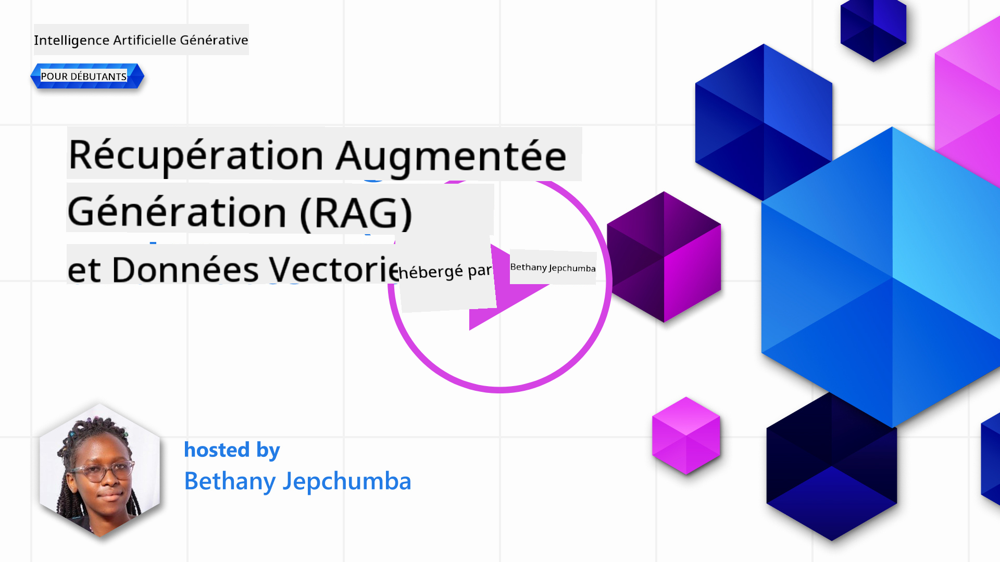
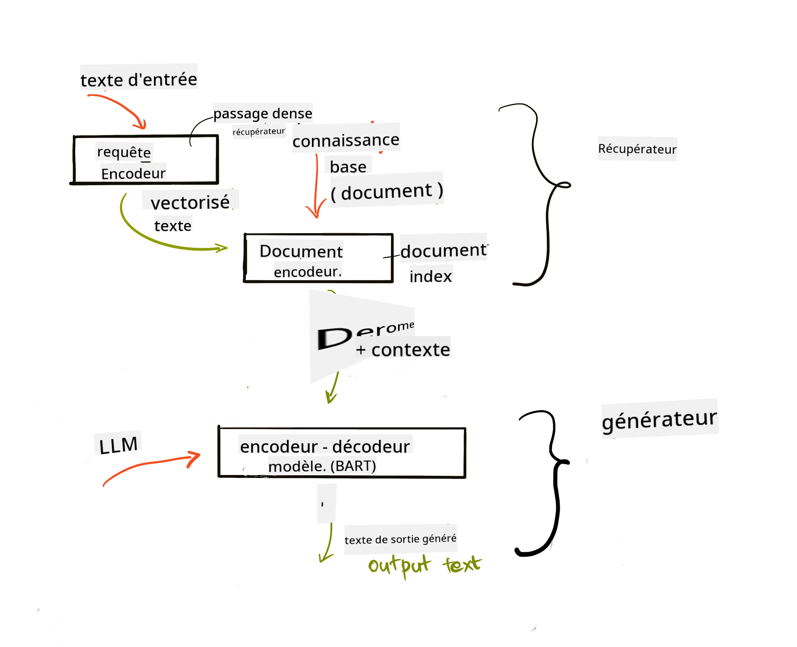
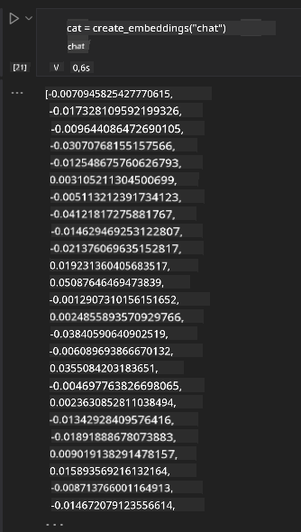

<!--
CO_OP_TRANSLATOR_METADATA:
{
  "original_hash": "e2861bbca91c0567ef32bc77fe054f9e",
  "translation_date": "2025-07-09T16:01:19+00:00",
  "source_file": "15-rag-and-vector-databases/README.md",
  "language_code": "fr"
}
-->
# Retrieval Augmented Generation (RAG) et bases de données vectorielles

[](https://aka.ms/gen-ai-lesson15-gh?WT.mc_id=academic-105485-koreyst)

Dans la leçon sur les applications de recherche, nous avons brièvement vu comment intégrer vos propres données dans les grands modèles de langage (LLM). Dans cette leçon, nous approfondirons les concepts d’ancrage de vos données dans votre application LLM, le fonctionnement du processus et les méthodes de stockage des données, incluant à la fois les embeddings et le texte.

> **Vidéo à venir bientôt**

## Introduction

Dans cette leçon, nous aborderons les points suivants :

- Une introduction à RAG, ce que c’est et pourquoi il est utilisé en IA (intelligence artificielle).

- Comprendre ce que sont les bases de données vectorielles et en créer une pour notre application.

- Un exemple pratique sur la façon d’intégrer RAG dans une application.

## Objectifs d’apprentissage

Après avoir terminé cette leçon, vous serez capable de :

- Expliquer l’importance de RAG dans la récupération et le traitement des données.

- Configurer une application RAG et ancrer vos données à un LLM.

- Intégrer efficacement RAG et les bases de données vectorielles dans des applications LLM.

## Notre scénario : enrichir nos LLM avec nos propres données

Pour cette leçon, nous souhaitons ajouter nos propres notes dans la startup éducative, ce qui permettra au chatbot d’obtenir plus d’informations sur les différents sujets. En utilisant les notes que nous avons, les apprenants pourront mieux étudier et comprendre les différents thèmes, facilitant ainsi la révision pour leurs examens. Pour créer notre scénario, nous utiliserons :

- `Azure OpenAI` : le LLM que nous utiliserons pour créer notre chatbot

- `Leçon AI for beginners sur les réseaux neuronaux` : ce sera la base de données sur laquelle nous ancrerons notre LLM

- `Azure AI Search` et `Azure Cosmos DB` : base de données vectorielle pour stocker nos données et créer un index de recherche

Les utilisateurs pourront créer des quiz d’entraînement à partir de leurs notes, des flashcards de révision et les résumer en synthèses concises. Pour commencer, voyons ce qu’est RAG et comment il fonctionne :

## Retrieval Augmented Generation (RAG)

Un chatbot alimenté par un LLM traite les requêtes des utilisateurs pour générer des réponses. Il est conçu pour être interactif et dialoguer avec les utilisateurs sur une large variété de sujets. Cependant, ses réponses sont limitées au contexte fourni et à ses données d’entraînement de base. Par exemple, la connaissance de GPT-4 s’arrête en septembre 2021, ce qui signifie qu’il ne connaît pas les événements survenus après cette date. De plus, les données utilisées pour entraîner les LLM excluent les informations confidentielles telles que les notes personnelles ou le manuel produit d’une entreprise.

### Comment fonctionnent les RAG (Retrieval Augmented Generation)


Supposons que vous souhaitiez déployer un chatbot qui crée des quiz à partir de vos notes, vous aurez besoin d’une connexion à la base de connaissances. C’est là que RAG intervient. Les RAG fonctionnent de la manière suivante :

- **Base de connaissances :** Avant la récupération, ces documents doivent être ingérés et prétraités, généralement en découpant les documents volumineux en morceaux plus petits, en les transformant en embeddings textuels et en les stockant dans une base de données.

- **Requête utilisateur :** l’utilisateur pose une question

- **Récupération :** Lorsque l’utilisateur pose une question, le modèle d’embedding récupère les informations pertinentes dans notre base de connaissances pour fournir un contexte supplémentaire qui sera intégré dans la requête.

- **Génération augmentée :** le LLM améliore sa réponse en se basant sur les données récupérées. Cela permet à la réponse générée de ne pas seulement s’appuyer sur les données pré-entraînées, mais aussi sur les informations pertinentes issues du contexte ajouté. Les données récupérées servent à enrichir les réponses du LLM. Le LLM renvoie ensuite une réponse à la question de l’utilisateur.



L’architecture des RAG est mise en œuvre à l’aide de transformers composés de deux parties : un encodeur et un décodeur. Par exemple, lorsqu’un utilisateur pose une question, le texte d’entrée est « encodé » en vecteurs capturant le sens des mots, puis ces vecteurs sont « décodés » dans notre index de documents et génèrent un nouveau texte basé sur la requête utilisateur. Le LLM utilise un modèle encodeur-décodeur pour générer la sortie.

Deux approches pour implémenter RAG selon l’article proposé : [Retrieval-Augmented Generation for Knowledge intensive NLP Tasks](https://arxiv.org/pdf/2005.11401.pdf?WT.mc_id=academic-105485-koreyst) sont :

- **_RAG-Sequence_** : utilise les documents récupérés pour prédire la meilleure réponse possible à une requête utilisateur

- **RAG-Token** : utilise les documents pour générer le token suivant, puis les récupère pour répondre à la requête de l’utilisateur

### Pourquoi utiliser les RAG ? 

- **Richesse d’information :** garantit que les réponses textuelles sont à jour et actuelles. Cela améliore donc les performances sur des tâches spécifiques à un domaine en accédant à la base de connaissances interne.

- Réduit les fabrications en utilisant des **données vérifiables** dans la base de connaissances pour fournir un contexte aux requêtes des utilisateurs.

- C’est **économique**, car ils sont plus abordables que le fine-tuning d’un LLM.

## Création d’une base de connaissances

Notre application est basée sur nos données personnelles, c’est-à-dire la leçon sur les réseaux neuronaux du programme AI For Beginners.

### Bases de données vectorielles

Une base de données vectorielle, contrairement aux bases de données traditionnelles, est une base spécialisée conçue pour stocker, gérer et rechercher des vecteurs encodés. Elle stocke des représentations numériques des documents. Décomposer les données en embeddings numériques facilite la compréhension et le traitement des données par notre système d’IA.

Nous stockons nos embeddings dans des bases de données vectorielles car les LLM ont une limite sur le nombre de tokens qu’ils acceptent en entrée. Comme il est impossible de passer l’intégralité des embeddings à un LLM, nous devons les découper en morceaux et, lorsqu’un utilisateur pose une question, les embeddings les plus proches de la question seront renvoyés avec la requête. Le découpage réduit également les coûts liés au nombre de tokens transmis à un LLM.

Parmi les bases de données vectorielles populaires, on trouve Azure Cosmos DB, Clarifyai, Pinecone, Chromadb, ScaNN, Qdrant et DeepLake. Vous pouvez créer un modèle Azure Cosmos DB avec Azure CLI en utilisant la commande suivante :

```bash
az login
az group create -n <resource-group-name> -l <location>
az cosmosdb create -n <cosmos-db-name> -r <resource-group-name>
az cosmosdb list-keys -n <cosmos-db-name> -g <resource-group-name>
```

### Du texte aux embeddings

Avant de stocker nos données, nous devons les convertir en embeddings vectoriels avant de les enregistrer dans la base. Si vous travaillez avec de longs documents ou textes, vous pouvez les découper en fonction des requêtes que vous attendez. Le découpage peut se faire au niveau des phrases ou des paragraphes. Comme le découpage tire son sens des mots qui l’entourent, vous pouvez ajouter un autre contexte à un morceau, par exemple en ajoutant le titre du document ou en incluant un texte avant ou après le morceau. Vous pouvez découper les données comme suit :

```python
def split_text(text, max_length, min_length):
    words = text.split()
    chunks = []
    current_chunk = []

    for word in words:
        current_chunk.append(word)
        if len(' '.join(current_chunk)) < max_length and len(' '.join(current_chunk)) > min_length:
            chunks.append(' '.join(current_chunk))
            current_chunk = []

    # If the last chunk didn't reach the minimum length, add it anyway
    if current_chunk:
        chunks.append(' '.join(current_chunk))

    return chunks
```

Une fois découpés, nous pouvons ensuite encoder notre texte en utilisant différents modèles d’embeddings. Parmi les modèles que vous pouvez utiliser : word2vec, ada-002 d’OpenAI, Azure Computer Vision et bien d’autres. Le choix du modèle dépendra des langues utilisées, du type de contenu encodé (texte/images/audio), de la taille d’entrée qu’il peut encoder et de la longueur de l’embedding produit.

Un exemple d’embedding de texte utilisant le modèle `text-embedding-ada-002` d’OpenAI est :


## Recherche et recherche vectorielle

Lorsqu’un utilisateur pose une question, le récupérateur la transforme en vecteur à l’aide de l’encodeur de requête, puis il recherche dans notre index de documents les vecteurs pertinents liés à la requête. Une fois cela fait, il convertit à la fois le vecteur d’entrée et les vecteurs des documents en texte et les transmet au LLM.

### Récupération

La récupération intervient lorsque le système tente de trouver rapidement les documents dans l’index qui répondent aux critères de recherche. L’objectif du récupérateur est d’obtenir des documents qui seront utilisés pour fournir un contexte et ancrer le LLM sur vos données.

Plusieurs méthodes existent pour effectuer une recherche dans notre base de données, telles que :

- **Recherche par mots-clés** - utilisée pour les recherches textuelles

- **Recherche sémantique** - utilise le sens sémantique des mots

- **Recherche vectorielle** - convertit les documents du texte en représentations vectorielles à l’aide de modèles d’embeddings. La récupération se fait en interrogeant les documents dont les vecteurs sont les plus proches de la question de l’utilisateur.

- **Hybride** - une combinaison de recherche par mots-clés et vectorielle.

Un défi de la récupération survient lorsqu’il n’y a pas de réponse similaire à la requête dans la base, le système renverra alors la meilleure information disponible. Cependant, vous pouvez utiliser des tactiques comme définir une distance maximale pour la pertinence ou utiliser une recherche hybride combinant mots-clés et recherche vectorielle. Dans cette leçon, nous utiliserons la recherche hybride, une combinaison des deux. Nous stockerons nos données dans un dataframe avec des colonnes contenant les morceaux ainsi que les embeddings.

### Similarité vectorielle

Le récupérateur cherchera dans la base de connaissances les embeddings proches les uns des autres, le plus proche voisin, car ce sont des textes similaires. Dans le scénario où un utilisateur pose une question, celle-ci est d’abord encodée puis mise en correspondance avec des embeddings similaires. La mesure la plus courante pour évaluer la similarité entre vecteurs est la similarité cosinus, basée sur l’angle entre deux vecteurs.

Nous pouvons aussi mesurer la similarité avec d’autres alternatives comme la distance euclidienne, qui est la ligne droite entre les extrémités des vecteurs, ou le produit scalaire qui mesure la somme des produits des éléments correspondants de deux vecteurs.

### Index de recherche

Lors de la récupération, il est nécessaire de construire un index de recherche pour notre base de connaissances avant d’effectuer la recherche. Un index stockera nos embeddings et pourra rapidement retrouver les morceaux les plus similaires même dans une base volumineuse. Nous pouvons créer notre index localement avec :

```python
from sklearn.neighbors import NearestNeighbors

embeddings = flattened_df['embeddings'].to_list()

# Create the search index
nbrs = NearestNeighbors(n_neighbors=5, algorithm='ball_tree').fit(embeddings)

# To query the index, you can use the kneighbors method
distances, indices = nbrs.kneighbors(embeddings)
```

### Reclassement

Une fois que vous avez interrogé la base de données, vous pourriez avoir besoin de trier les résultats du plus pertinent au moins pertinent. Un LLM de reclassement utilise le Machine Learning pour améliorer la pertinence des résultats de recherche en les ordonnant du plus pertinent au moins pertinent. Avec Azure AI Search, le reclassement est effectué automatiquement grâce à un reranker sémantique. Voici un exemple de reclassement utilisant les plus proches voisins :

```python
# Find the most similar documents
distances, indices = nbrs.kneighbors([query_vector])

index = []
# Print the most similar documents
for i in range(3):
    index = indices[0][i]
    for index in indices[0]:
        print(flattened_df['chunks'].iloc[index])
        print(flattened_df['path'].iloc[index])
        print(flattened_df['distances'].iloc[index])
    else:
        print(f"Index {index} not found in DataFrame")
```

## Mise en œuvre complète

La dernière étape consiste à intégrer notre LLM pour obtenir des réponses ancrées dans nos données. Nous pouvons l’implémenter comme suit :

```python
user_input = "what is a perceptron?"

def chatbot(user_input):
    # Convert the question to a query vector
    query_vector = create_embeddings(user_input)

    # Find the most similar documents
    distances, indices = nbrs.kneighbors([query_vector])

    # add documents to query  to provide context
    history = []
    for index in indices[0]:
        history.append(flattened_df['chunks'].iloc[index])

    # combine the history and the user input
    history.append(user_input)

    # create a message object
    messages=[
        {"role": "system", "content": "You are an AI assistant that helps with AI questions."},
        {"role": "user", "content": history[-1]}
    ]

    # use chat completion to generate a response
    response = openai.chat.completions.create(
        model="gpt-4",
        temperature=0.7,
        max_tokens=800,
        messages=messages
    )

    return response.choices[0].message

chatbot(user_input)
```

## Évaluation de notre application

### Métriques d’évaluation

- Qualité des réponses fournies, en s’assurant qu’elles sonnent naturelles, fluides et humaines

- Ancrage des données : évaluer si la réponse provient bien des documents fournis

- Pertinence : vérifier que la réponse correspond et est liée à la question posée

- Fluidité : vérifier que la réponse est grammaticalement correcte

## Cas d’usage pour RAG (Retrieval Augmented Generation) et bases de données vectorielles

Il existe de nombreux cas d’usage où les appels de fonction peuvent améliorer votre application, tels que :

- Questions-Réponses : ancrer les données de votre entreprise dans un chat utilisé par les employés pour poser des questions.

- Systèmes de recommandation : créer un système qui associe les valeurs les plus similaires, par exemple films, restaurants, etc.

- Services de chatbot : stocker l’historique des conversations et personnaliser les échanges en fonction des données utilisateur.

- Recherche d’images basée sur les embeddings vectoriels, utile pour la reconnaissance d’images et la détection d’anomalies.

## Résumé

Nous avons couvert les bases fondamentales de RAG, depuis l’ajout de nos données à l’application, la requête utilisateur jusqu’à la sortie. Pour simplifier la création de RAG, vous pouvez utiliser des frameworks tels que Semantic Kernel, Langchain ou Autogen.

## Exercice

Pour poursuivre votre apprentissage de Retrieval Augmented Generation (RAG), vous pouvez construire :

- Une interface front-end pour l’application en utilisant le framework de votre choix

- Utiliser un framework, soit LangChain soit Semantic Kernel, et recréer votre application.

Félicitations pour avoir terminé la leçon 👏.

## L’apprentissage ne s’arrête pas ici, continuez votre parcours

Après avoir terminé cette leçon, consultez notre [collection d’apprentissage sur l’IA générative](https://aka.ms/genai-collection?WT.mc_id=academic-105485-koreyst) pour continuer à approfondir vos connaissances en IA générative !

**Avertissement** :  
Ce document a été traduit à l’aide du service de traduction automatique [Co-op Translator](https://github.com/Azure/co-op-translator). Bien que nous nous efforcions d’assurer l’exactitude, veuillez noter que les traductions automatiques peuvent contenir des erreurs ou des inexactitudes. Le document original dans sa langue d’origine doit être considéré comme la source faisant foi. Pour les informations critiques, une traduction professionnelle réalisée par un humain est recommandée. Nous déclinons toute responsabilité en cas de malentendus ou de mauvaises interprétations résultant de l’utilisation de cette traduction.