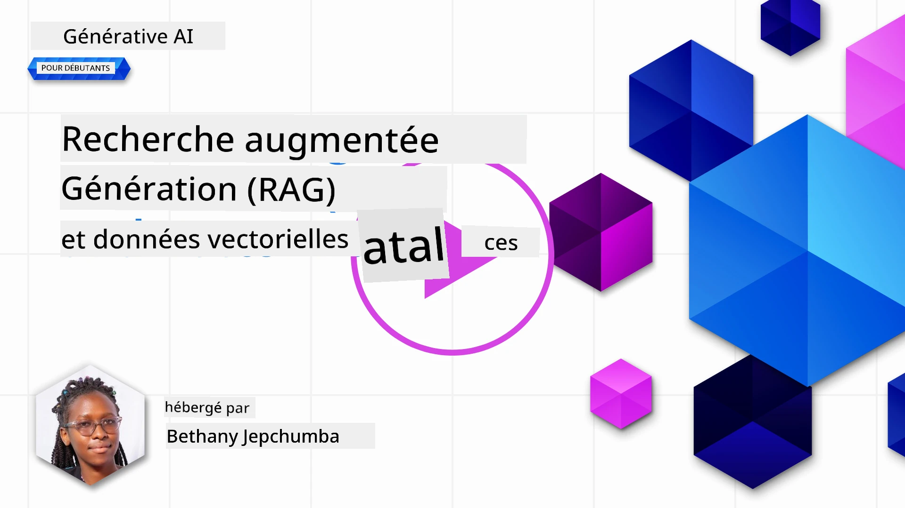
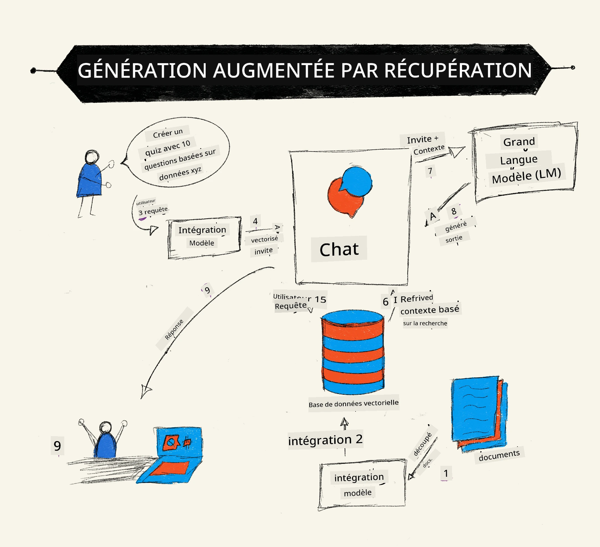
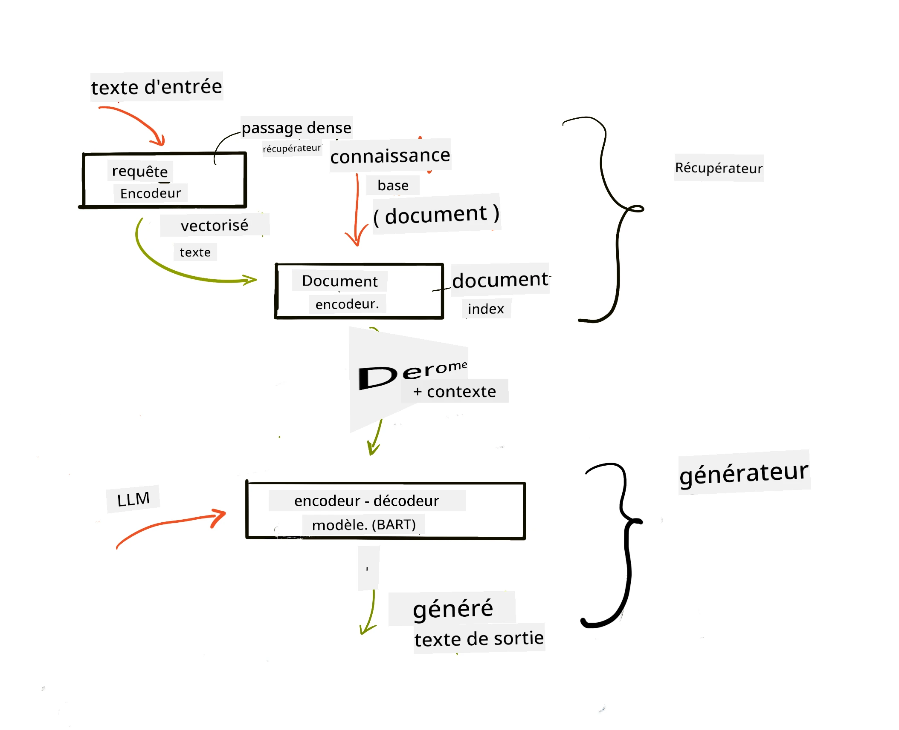
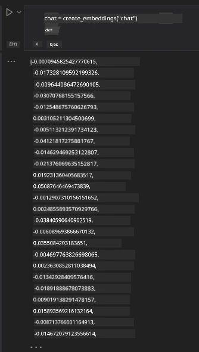

# Génération augmentée par récupération (RAG) et bases de données vectorielles

[](https://youtu.be/4l8zhHUBeyI?si=BmvDmL1fnHtgQYkL)

Dans la leçon sur les applications de recherche, nous avons brièvement appris comment intégrer vos propres données dans les grands modèles de langage (LLM). Dans cette leçon, nous approfondirons les concepts d'ancrage de vos données dans votre application LLM, les mécanismes du processus et les méthodes de stockage des données, incluant à la fois les embeddings et le texte.

> **Vidéo à venir bientôt**

## Introduction

Dans cette leçon, nous aborderons les points suivants :

- Une introduction à RAG, ce que c'est et pourquoi il est utilisé en IA (intelligence artificielle).

- Comprendre ce que sont les bases de données vectorielles et en créer une pour notre application.

- Un exemple pratique sur la façon d'intégrer RAG dans une application.

## Objectifs d'apprentissage

Après avoir terminé cette leçon, vous serez capable de :

- Expliquer l'importance de RAG dans la récupération et le traitement des données.

- Configurer une application RAG et ancrer vos données à un LLM

- Intégrer efficacement RAG et les bases de données vectorielles dans les applications LLM.

## Notre scénario : enrichir nos LLMs avec nos propres données

Pour cette leçon, nous souhaitons ajouter nos propres notes dans la startup éducative, ce qui permet au chatbot d'obtenir plus d'informations sur les différents sujets. En utilisant les notes que nous avons, les apprenants pourront mieux étudier et comprendre les différents thèmes, facilitant ainsi la révision pour leurs examens. Pour créer notre scénario, nous utiliserons :

- `Azure OpenAI :` le LLM que nous utiliserons pour créer notre chatbot

- `Leçon « IA pour débutants » sur les réseaux neuronaux` : ce sera la base de données sur laquelle nous ancrerons notre LLM

- `Azure AI Search` et `Azure Cosmos DB :` base de données vectorielle pour stocker nos données et créer un index de recherche

Les utilisateurs pourront créer des quiz pratiques à partir de leurs notes, des flashcards de révision et les résumer en synthèses concises. Pour commencer, regardons ce qu'est RAG et comment cela fonctionne :

## Génération augmentée par récupération (RAG)

Un chatbot alimenté par un LLM traite les prompts des utilisateurs pour générer des réponses. Il est conçu pour être interactif et engage les utilisateurs sur une large gamme de sujets. Cependant, ses réponses sont limitées au contexte fourni et aux données d'entraînement de base. Par exemple, la limite de connaissance de GPT-4 est septembre 2021, ce qui signifie qu'il ne connaît pas les événements survenus après cette période. De plus, les données utilisées pour entraîner les LLM excluent les informations confidentielles telles que les notes personnelles ou le manuel produit d'une entreprise.

### Comment fonctionnent les RAG (Génération augmentée par récupération)



Supposons que vous souhaitez déployer un chatbot qui crée des quiz à partir de vos notes, vous aurez besoin d'une connexion à la base de connaissances. C'est là que RAG intervient. Les RAG fonctionnent comme suit :

- **Base de connaissances :** Avant la récupération, ces documents doivent être ingérés et prétraités, typiquement en découpant les documents volumineux en morceaux plus petits, en les transformant en embeddings textuels et en les stockant dans une base de données.

- **Question utilisateur :** l'utilisateur pose une question

- **Récupération :** Lorsqu'un utilisateur pose une question, le modèle d'embedding récupère des informations pertinentes de notre base de connaissances pour fournir plus de contexte qui sera intégré dans le prompt.

- **Génération augmentée :** le LLM améliore sa réponse en fonction des données récupérées. Cela permet à la réponse générée de ne pas seulement être basée sur les données pré-entraînées, mais aussi sur les informations pertinentes du contexte ajouté. Les données récupérées sont utilisées pour augmenter les réponses du LLM. Le LLM renvoie alors une réponse à la question de l'utilisateur.



L'architecture des RAG est implémentée à l'aide de transformateurs composés de deux parties : un encodeur et un décodeur. Par exemple, lorsqu'un utilisateur pose une question, le texte d'entrée est « encodé » en vecteurs capturant le sens des mots, et les vecteurs sont « décodés » dans notre index de documents pour générer un nouveau texte basé sur la requête utilisateur. Le LLM utilise un modèle encodeur-décodeur pour générer la sortie.

Deux approches pour implémenter RAG selon l'article proposé : [Retrieval-Augmented Generation for Knowledge intensive NLP (natural language processing software) Tasks](https://arxiv.org/pdf/2005.11401.pdf?WT.mc_id=academic-105485-koreyst) sont :

- **_RAG-Sequence_** utilisant les documents récupérés pour prédire la meilleure réponse possible à une requête utilisateur

- **RAG-Token** utilisant les documents pour générer le prochain token, puis les récupérer pour répondre à la requête de l'utilisateur

### Pourquoi utiliser les RAG ? 

- **Richesse de l'information :** garantit que les réponses textuelles sont à jour et actuelles. Cela améliore donc les performances sur les tâches spécifiques au domaine en accédant à la base de connaissances interne.

- Réduit la fabrication en utilisant des **données vérifiables** dans la base de connaissances pour fournir un contexte aux requêtes des utilisateurs.

- C'est **rentable** car ils sont plus économiques comparés à un ajustement fin d'un LLM

## Création d'une base de connaissances

Notre application est basée sur nos données personnelles, c’est-à-dire la leçon sur les réseaux neuronaux dans le programme AI For Beginners.

### Bases de données vectorielles

Une base de données vectorielle, contrairement aux bases de données traditionnelles, est une base spécialisée conçue pour stocker, gérer et rechercher des vecteurs embarqués. Elle stocke des représentations numériques des documents. Décomposer les données en embeddings numériques facilite la compréhension et le traitement des données par notre système IA.

Nous stockons nos embeddings dans des bases de données vectorielles car les LLM ont une limite du nombre de tokens qu'ils acceptent en entrée. Comme vous ne pouvez pas passer tous les embeddings à un LLM, nous devons les diviser en morceaux, et lorsqu'un utilisateur pose une question, les embeddings les plus similaires à la question seront renvoyés avec le prompt. Le découpement réduit aussi les coûts du nombre de tokens passés dans un LLM.

Certaines bases de données vectorielles populaires incluent Azure Cosmos DB, Clarifyai, Pinecone, Chromadb, ScaNN, Qdrant et DeepLake. Vous pouvez créer un modèle Azure Cosmos DB en utilisant Azure CLI avec la commande suivante :

```bash
az login
az group create -n <resource-group-name> -l <location>
az cosmosdb create -n <cosmos-db-name> -r <resource-group-name>
az cosmosdb list-keys -n <cosmos-db-name> -g <resource-group-name>
```

### Du texte aux embeddings

Avant de stocker nos données, nous devons les convertir en embeddings vectoriels avant qu'elles ne soient stockées dans la base de données. Si vous travaillez avec de gros documents ou des textes longs, vous pouvez les découper selon les requêtes que vous prévoyez. Le découpage peut se faire au niveau de la phrase ou au niveau du paragraphe. Comme le découpage dérive le sens des mots qui l'entourent, vous pouvez ajouter un autre contexte à un morceau, par exemple en ajoutant le titre du document ou en incluant un peu de texte avant ou après le morceau. Vous pouvez découper les données comme suit :

```python
def split_text(text, max_length, min_length):
    words = text.split()
    chunks = []
    current_chunk = []

    for word in words:
        current_chunk.append(word)
        if len(' '.join(current_chunk)) < max_length and len(' '.join(current_chunk)) > min_length:
            chunks.append(' '.join(current_chunk))
            current_chunk = []

    # Si le dernier morceau n'a pas atteint la longueur minimale, ajoutez-le quand même
    if current_chunk:
        chunks.append(' '.join(current_chunk))

    return chunks
```

Une fois découpés, nous pouvons ensuite embarquer notre texte en utilisant différents modèles d'embedding. Certains modèles que vous pouvez utiliser incluent : word2vec, ada-002 d'OpenAI, Azure Computer Vision et bien d'autres. Le choix du modèle dépendra des langues utilisées, du type de contenu encodé (texte/images/audio), de la taille de l'entrée qu'il peut encoder et de la longueur de l'embedding produit.

Un exemple de texte embarqué utilisant le modèle `text-embedding-ada-002` d'OpenAI est :


## Récupération et recherche vectorielle

Lorsqu'un utilisateur pose une question, le récupérateur la transforme en vecteur à l'aide de l'encodeur de requête, puis il cherche dans notre index de recherche des documents les vecteurs pertinents liés à l'entrée. Une fois fait, il convertit à la fois le vecteur d'entrée et les vecteurs de documents en texte et les transmet au LLM.

### Récupération

La récupération se produit lorsque le système essaie de trouver rapidement les documents de l'index qui satisfont les critères de recherche. L'objectif du récupérateur est d'obtenir des documents qui seront utilisés pour fournir du contexte et ancrer le LLM sur vos données.

Il existe plusieurs façons d'effectuer la recherche dans notre base de données, telles que :

- **Recherche par mot-clé** - utilisée pour les recherches textuelles

- **Recherche vectorielle** - convertit les documents du texte aux représentations vectorielles à l'aide de modèles d'embedding, permettant une **recherche sémantique** basée sur le sens des mots. La récupération se fera en interrogeant les documents dont les représentations vectorielles sont les plus proches de la question utilisateur.

- **Hybride** - une combinaison des recherches par mot-clé et vectorielle.

Un défi avec la récupération survient quand il n'y a pas de réponse similaire à la requête dans la base de données, le système retournera alors les meilleures informations qu’il peut obtenir. Cependant, vous pouvez utiliser des tactiques comme définir la distance maximale pour la pertinence ou utiliser une recherche hybride qui combine la recherche par mots-clés et vectorielle. Dans cette leçon, nous utiliserons la recherche hybride, une combinaison des recherches vectorielle et par mots-clés. Nous stockerons nos données dans un dataframe avec des colonnes contenant les morceaux ainsi que leurs embeddings.

### Similarité vectorielle

Le récupérateur cherchera dans la base de connaissances les embeddings qui sont proches, le voisin le plus proche, car ce sont des textes similaires. Dans le scénario où un utilisateur pose une question, elle est d'abord embarquée puis associée à des embeddings similaires. La mesure courante utilisée pour trouver la similarité entre différents vecteurs est la similarité cosinus, basée sur l'angle entre deux vecteurs.

D'autres alternatives pour mesurer la similarité comprennent la distance euclidienne qui est la ligne droite entre les points finaux des vecteurs et le produit scalaire qui mesure la somme des produits des éléments correspondants de deux vecteurs.

### Index de recherche

Lors de la récupération, nous devrons construire un index de recherche pour notre base de connaissances avant d'effectuer la recherche. Un index stockera nos embeddings et pourra rapidement récupérer les morceaux les plus similaires même dans une base de données volumineuse. Nous pouvons créer notre index localement à l'aide de :

```python
from sklearn.neighbors import NearestNeighbors

embeddings = flattened_df['embeddings'].to_list()

# Créer l'index de recherche
nbrs = NearestNeighbors(n_neighbors=5, algorithm='ball_tree').fit(embeddings)

# Pour interroger l'index, vous pouvez utiliser la méthode kneighbors
distances, indices = nbrs.kneighbors(embeddings)
```

### Réordonnancement (Re-ranking)

Une fois que vous avez interrogé la base de données, vous pourriez avoir besoin de trier les résultats selon leur pertinence. Un LLM de réordonnancement utilise l'apprentissage automatique pour améliorer la pertinence des résultats de recherche en les ordonnant de la plus pertinente à la moins pertinente. Avec Azure AI Search, le réordonnancement est fait automatiquement pour vous à l'aide d'un reranker sémantique. Un exemple de fonctionnement du réordonnancement utilisant les plus proches voisins :

```python
# Trouver les documents les plus similaires
distances, indices = nbrs.kneighbors([query_vector])

index = []
# Imprimer les documents les plus similaires
for i in range(3):
    index = indices[0][i]
    for index in indices[0]:
        print(flattened_df['chunks'].iloc[index])
        print(flattened_df['path'].iloc[index])
        print(flattened_df['distances'].iloc[index])
    else:
        print(f"Index {index} not found in DataFrame")
```

## Tout assembler

La dernière étape est d'ajouter notre LLM dans le mix pour pouvoir obtenir des réponses ancrées dans nos données. Nous pouvons l'implémenter comme suit :

```python
user_input = "what is a perceptron?"

def chatbot(user_input):
    # Convertir la question en vecteur de requête
    query_vector = create_embeddings(user_input)

    # Trouver les documents les plus similaires
    distances, indices = nbrs.kneighbors([query_vector])

    # ajouter des documents à la requête pour fournir du contexte
    history = []
    for index in indices[0]:
        history.append(flattened_df['chunks'].iloc[index])

    # combiner l'historique et l'entrée de l'utilisateur
    history.append(user_input)

    # créer un objet message
    messages=[
        {"role": "system", "content": "You are an AI assistant that helps with AI questions."},
        {"role": "user", "content": "\n\n".join(history) }
    ]

    # utiliser l'API Responses pour générer une réponse
    response = client.responses.create(
        model="gpt-5-mini",
        max_output_tokens=800,
        input=messages,
        store=False,
    )

    return response.output_text

chatbot(user_input)
```

## Évaluation de notre application

### Métriques d'évaluation

- Qualité des réponses fournies, assurant qu'elles sonnent naturelles, fluides et humaines

- Ancrage des données : évaluer si la réponse provient bien des documents fournis

- Pertinence : évaluer que la réponse correspond et est liée à la question posée

- Fluidité - vérifier si la réponse est grammaticalement correcte

## Cas d'utilisation pour RAG (Génération augmentée par récupération) et bases de données vectorielles

Il existe de nombreux cas où les appels de fonction peuvent améliorer votre application, tels que :

- Questions-réponses : ancrer les données de votre entreprise dans un chat que les employés peuvent utiliser pour poser des questions.

- Systèmes de recommandation : vous pouvez créer un système qui fait correspondre les valeurs les plus similaires, par exemple des films, restaurants et bien plus.

- Services chatbot : vous pouvez stocker l'historique des conversations et personnaliser la discussion en fonction des données utilisateur.

- Recherche d'images basée sur les embeddings vectoriels, utile pour la reconnaissance d'images et la détection d'anomalies.

## Résumé

Nous avons couvert les zones fondamentales de RAG, depuis l'ajout de nos données à l'application, la requête utilisateur et la sortie. Pour simplifier la création de RAG, vous pouvez utiliser des frameworks tels que Semantic Kernel, Langchain ou Autogen.

## Exercice

Pour poursuivre votre apprentissage de la Génération augmentée par récupération (RAG), vous pouvez construire :

- Construire une interface frontale pour l'application en utilisant le framework de votre choix

- Utiliser un framework, soit LangChain ou Semantic Kernel, et recréer votre application.

Félicitations pour avoir terminé la leçon 👏.

## L'apprentissage ne s'arrête pas ici, continuez le voyage

Après avoir terminé cette leçon, consultez notre [collection d'apprentissage sur l'IA générative](https://aka.ms/genai-collection?WT.mc_id=academic-105485-koreyst) pour continuer à approfondir vos connaissances sur l'IA générative !

---

<!-- CO-OP TRANSLATOR DISCLAIMER START -->
**Avertissement** :
Ce document a été traduit à l'aide du service de traduction automatique [Co-op Translator](https://github.com/Azure/co-op-translator). Bien que nous nous efforçions d'assurer l'exactitude, veuillez noter que les traductions automatisées peuvent contenir des erreurs ou des inexactitudes. Le document original dans sa langue native doit être considéré comme la source faisant autorité. Pour les informations critiques, il est recommandé de recourir à une traduction professionnelle réalisée par un humain. Nous ne saurions être tenus responsables des malentendus ou erreurs d'interprétation découlant de l'utilisation de cette traduction.
<!-- CO-OP TRANSLATOR DISCLAIMER END -->