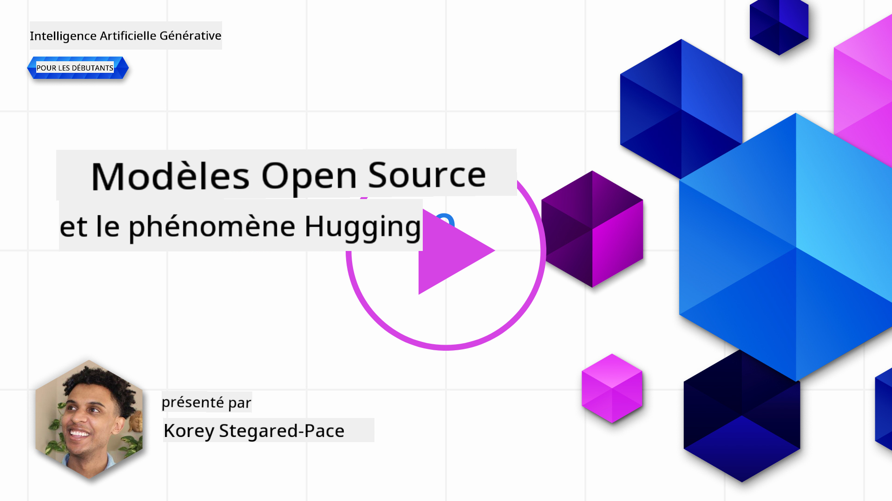
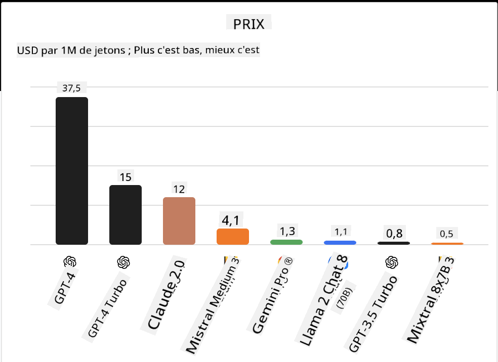
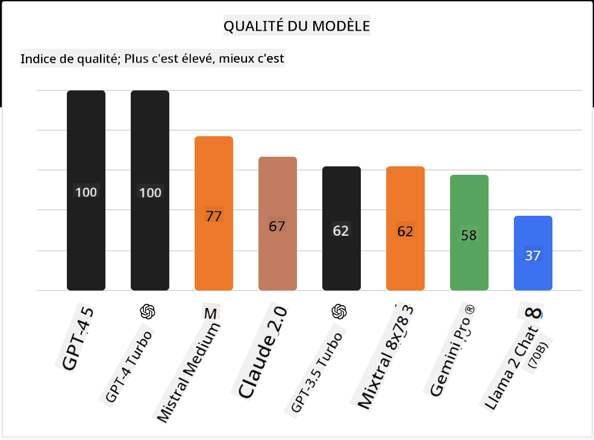

<!--
CO_OP_TRANSLATOR_METADATA:
{
  "original_hash": "0bba96e53ab841d99db731892a51fab8",
  "translation_date": "2025-07-09T17:02:49+00:00",
  "source_file": "16-open-source-models/README.md",
  "language_code": "fr"
}
-->

## Introduction

Le monde des LLM open source est passionnant et en constante évolution. Cette leçon vise à offrir un aperçu approfondi des modèles open source. Si vous cherchez des informations sur la comparaison entre modèles propriétaires et modèles open source, rendez-vous à la leçon ["Explorer et comparer différents LLM"](../02-exploring-and-comparing-different-llms/README.md?WT.mc_id=academic-105485-koreyst). Cette leçon abordera également le sujet de l’affinage, mais une explication plus détaillée se trouve dans la leçon ["Fine-Tuning LLMs"](../18-fine-tuning/README.md?WT.mc_id=academic-105485-koreyst).

## Objectifs d’apprentissage

- Comprendre les modèles open source  
- Appréhender les avantages de travailler avec des modèles open source  
- Explorer les modèles open disponibles sur Hugging Face et Azure AI Studio  

## Qu’est-ce que les modèles Open Source ?

Le logiciel open source a joué un rôle crucial dans le développement technologique dans de nombreux domaines. L’Open Source Initiative (OSI) a défini [10 critères pour qu’un logiciel](https://web.archive.org/web/20241126001143/https://opensource.org/osd?WT.mc_id=academic-105485-koreyst) soit considéré comme open source. Le code source doit être partagé ouvertement sous une licence approuvée par l’OSI.

Bien que le développement des LLM partage certains aspects avec le développement logiciel, le processus n’est pas exactement le même. Cela a suscité beaucoup de débats dans la communauté sur la définition de l’open source dans le contexte des LLM. Pour qu’un modèle corresponde à la définition traditionnelle de l’open source, les informations suivantes doivent être publiquement accessibles :

- Les jeux de données utilisés pour entraîner le modèle.  
- Les poids complets du modèle dans le cadre de l’entraînement.  
- Le code d’évaluation.  
- Le code d’affinage (fine-tuning).  
- Les poids complets du modèle et les métriques d’entraînement.  

Actuellement, seuls quelques modèles répondent à ces critères. Le [modèle OLMo créé par l’Allen Institute for Artificial Intelligence (AllenAI)](https://huggingface.co/allenai/OLMo-7B?WT.mc_id=academic-105485-koreyst) en fait partie.

Pour cette leçon, nous utiliserons le terme « modèles open » car ils ne correspondent pas forcément à tous ces critères au moment de la rédaction.

## Avantages des modèles Open

**Très personnalisables** – Comme les modèles open sont publiés avec des informations détaillées sur leur entraînement, chercheurs et développeurs peuvent modifier leur architecture interne. Cela permet de créer des modèles très spécialisés, affinés pour une tâche ou un domaine précis. Par exemple : génération de code, opérations mathématiques ou biologie.

**Coût** – Le coût par token pour utiliser et déployer ces modèles est inférieur à celui des modèles propriétaires. Lors de la création d’applications d’IA générative, il est important d’évaluer le rapport performance/prix en fonction de votre cas d’usage.

  
Source : Artificial Analysis

**Flexibilité** – Travailler avec des modèles open permet une grande flexibilité, que ce soit pour utiliser différents modèles ou les combiner. Un exemple est les [Assistants HuggingChat](https://huggingface.co/chat?WT.mc_id=academic-105485-koreyst) où l’utilisateur peut choisir le modèle directement dans l’interface :

## Explorer différents modèles Open

### Llama 2

[LLama2](https://huggingface.co/meta-llama?WT.mc_id=academic-105485-koreyst), développé par Meta, est un modèle open optimisé pour les applications de chat. Cela est dû à sa méthode d’affinage, qui inclut une grande quantité de dialogues et de retours humains. Grâce à cette méthode, le modèle produit des résultats plus en phase avec les attentes humaines, offrant une meilleure expérience utilisateur.

Parmi les versions affinées de Llama, on trouve [Japanese Llama](https://huggingface.co/elyza/ELYZA-japanese-Llama-2-7b?WT.mc_id=academic-105485-koreyst), spécialisé en japonais, et [Llama Pro](https://huggingface.co/TencentARC/LLaMA-Pro-8B?WT.mc_id=academic-105485-koreyst), une version améliorée du modèle de base.

### Mistral

[Mistral](https://huggingface.co/mistralai?WT.mc_id=academic-105485-koreyst) est un modèle open axé sur la haute performance et l’efficacité. Il utilise l’approche Mixture-of-Experts qui combine un groupe de modèles experts spécialisés en un seul système où, selon l’entrée, certains modèles sont sélectionnés. Cela rend le calcul plus efficace car chaque modèle traite uniquement les entrées pour lesquelles il est spécialisé.

Parmi les versions affinées de Mistral, on trouve [BioMistral](https://huggingface.co/BioMistral/BioMistral-7B?text=Mon+nom+est+Thomas+et+mon+principal?WT.mc_id=academic-105485-koreyst), axé sur le domaine médical, et [OpenMath Mistral](https://huggingface.co/nvidia/OpenMath-Mistral-7B-v0.1-hf?WT.mc_id=academic-105485-koreyst), spécialisé dans les calculs mathématiques.

### Falcon

[Falcon](https://huggingface.co/tiiuae?WT.mc_id=academic-105485-koreyst) est un LLM créé par le Technology Innovation Institute (**TII**). Le Falcon-40B a été entraîné sur 40 milliards de paramètres et a montré de meilleures performances que GPT-3 avec un budget de calcul moindre. Cela est dû à l’utilisation de l’algorithme FlashAttention et de l’attention multiquery, qui réduisent les besoins en mémoire lors de l’inférence. Grâce à ce temps d’inférence réduit, le Falcon-40B est adapté aux applications de chat.

Parmi les versions affinées de Falcon, on trouve [OpenAssistant](https://huggingface.co/OpenAssistant/falcon-40b-sft-top1-560?WT.mc_id=academic-105485-koreyst), un assistant basé sur des modèles open, et [GPT4ALL](https://huggingface.co/nomic-ai/gpt4all-falcon?WT.mc_id=academic-105485-koreyst), qui offre de meilleures performances que le modèle de base.

## Comment choisir

Il n’y a pas de réponse unique pour choisir un modèle open. Un bon point de départ est d’utiliser la fonction de filtrage par tâche d’Azure AI Studio. Cela vous aidera à comprendre les types de tâches pour lesquelles le modèle a été entraîné. Hugging Face maintient également un LLM Leaderboard qui présente les modèles les plus performants selon certains critères.

Pour comparer les LLM selon différents types, [Artificial Analysis](https://artificialanalysis.ai/?WT.mc_id=academic-105485-koreyst) est une autre ressource intéressante :

  
Source : Artificial Analysis

Si vous travaillez sur un cas d’usage spécifique, rechercher des versions affinées ciblant le même domaine peut être efficace. Tester plusieurs modèles open pour voir comment ils répondent à vos attentes et à celles de vos utilisateurs est également une bonne pratique.

## Prochaines étapes

Le meilleur avec les modèles open, c’est que vous pouvez commencer à les utiliser rapidement. Découvrez le [Catalogue de modèles Azure AI Studio](https://ai.azure.com?WT.mc_id=academic-105485-koreyst), qui propose une collection spécifique Hugging Face avec les modèles abordés ici.

## L’apprentissage ne s’arrête pas là, continuez votre parcours

Après avoir terminé cette leçon, consultez notre [collection d’apprentissage sur l’IA générative](https://aka.ms/genai-collection?WT.mc_id=academic-105485-koreyst) pour continuer à approfondir vos connaissances en IA générative !

**Avertissement** :  
Ce document a été traduit à l’aide du service de traduction automatique [Co-op Translator](https://github.com/Azure/co-op-translator). Bien que nous nous efforcions d’assurer l’exactitude, veuillez noter que les traductions automatiques peuvent contenir des erreurs ou des inexactitudes. Le document original dans sa langue d’origine doit être considéré comme la source faisant foi. Pour les informations critiques, une traduction professionnelle réalisée par un humain est recommandée. Nous déclinons toute responsabilité en cas de malentendus ou de mauvaises interprétations résultant de l’utilisation de cette traduction.