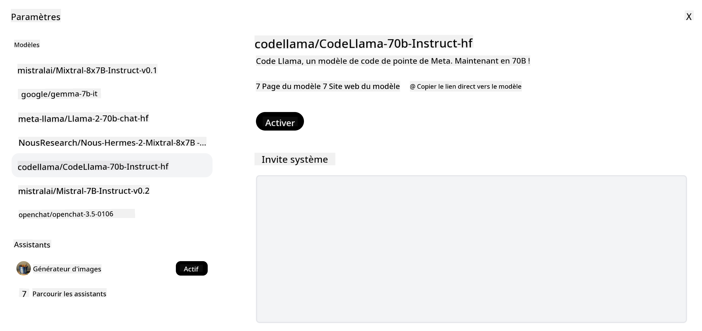

<!--
CO_OP_TRANSLATOR_METADATA:
{
  "original_hash": "85b754d4dc980f270f264d17116d9a5f",
  "translation_date": "2025-12-19T12:31:34+00:00",
  "source_file": "16-open-source-models/README.md",
  "language_code": "fr"
}
-->

## Introduction

Le monde des LLM open source est passionnant et en constante évolution. Cette leçon vise à fournir un aperçu approfondi des modèles open source. Si vous cherchez des informations sur la comparaison entre les modèles propriétaires et les modèles open source, rendez-vous à la leçon ["Explorer et comparer différents LLM"](../02-exploring-and-comparing-different-llms/README.md?WT.mc_id=academic-105485-koreyst). Cette leçon abordera également le sujet de l'affinage, mais une explication plus détaillée se trouve dans la leçon ["Affinage des LLM"](../18-fine-tuning/README.md?WT.mc_id=academic-105485-koreyst).

## Objectifs d'apprentissage

- Comprendre les modèles open source
- Comprendre les avantages de travailler avec des modèles open source
- Explorer les modèles open disponibles sur Hugging Face et Azure AI Studio

## Qu'est-ce que les modèles open source ?

Le logiciel open source a joué un rôle crucial dans la croissance de la technologie dans divers domaines. L'Open Source Initiative (OSI) a défini [10 critères pour les logiciels](https://web.archive.org/web/20241126001143/https://opensource.org/osd?WT.mc_id=academic-105485-koreyst) afin qu'ils soient classés comme open source. Le code source doit être partagé ouvertement sous une licence approuvée par l'OSI.

Bien que le développement des LLM présente des éléments similaires à celui des logiciels, le processus n'est pas exactement le même. Cela a suscité beaucoup de discussions dans la communauté sur la définition de l'open source dans le contexte des LLM. Pour qu'un modèle soit conforme à la définition traditionnelle de l'open source, les informations suivantes doivent être publiquement disponibles :

- Les ensembles de données utilisés pour entraîner le modèle.
- Les poids complets du modèle dans le cadre de l'entraînement.
- Le code d'évaluation.
- Le code d'affinage.
- Les poids complets du modèle et les métriques d'entraînement.

Actuellement, seuls quelques modèles répondent à ces critères. Le [modèle OLMo créé par l'Allen Institute for Artificial Intelligence (AllenAI)](https://huggingface.co/allenai/OLMo-7B?WT.mc_id=academic-105485-koreyst) en fait partie.

Pour cette leçon, nous nous référerons aux modèles comme "modèles open" car ils peuvent ne pas correspondre aux critères ci-dessus au moment de la rédaction.

## Avantages des modèles open

**Très personnalisables** - Puisque les modèles open sont publiés avec des informations détaillées sur l'entraînement, les chercheurs et développeurs peuvent modifier les composants internes du modèle. Cela permet de créer des modèles très spécialisés, affinés pour une tâche ou un domaine d'étude spécifique. Quelques exemples sont la génération de code, les opérations mathématiques et la biologie.

**Coût** - Le coût par token pour utiliser et déployer ces modèles est inférieur à celui des modèles propriétaires. Lors de la création d'applications d'IA générative, il est important d'évaluer le rapport performance/prix en travaillant avec ces modèles pour votre cas d'usage.

Source : Artificial Analysis

**Flexibilité** - Travailler avec des modèles open permet d'être flexible en termes d'utilisation de différents modèles ou de leur combinaison. Un exemple est les [Assistants HuggingChat](https://huggingface.co/chat?WT.mc_id=academic-105485-koreyst) où un utilisateur peut sélectionner le modèle utilisé directement dans l'interface utilisateur :

## Explorer différents modèles open

### Llama 2

[LLama2](https://huggingface.co/meta-llama?WT.mc_id=academic-105485-koreyst), développé par Meta, est un modèle open optimisé pour les applications basées sur le chat. Cela est dû à sa méthode d'affinage, qui a inclus une grande quantité de dialogues et de retours humains. Avec cette méthode, le modèle produit des résultats plus alignés avec les attentes humaines, offrant une meilleure expérience utilisateur.

Quelques exemples de versions affinées de Llama incluent [Japanese Llama](https://huggingface.co/elyza/ELYZA-japanese-Llama-2-7b?WT.mc_id=academic-105485-koreyst), spécialisé en japonais, et [Llama Pro](https://huggingface.co/TencentARC/LLaMA-Pro-8B?WT.mc_id=academic-105485-koreyst), une version améliorée du modèle de base.

### Mistral

[Mistral](https://huggingface.co/mistralai?WT.mc_id=academic-105485-koreyst) est un modèle open avec un fort accent sur la haute performance et l'efficacité. Il utilise l'approche Mixture-of-Experts qui combine un groupe de modèles experts spécialisés en un seul système où, selon l'entrée, certains modèles sont sélectionnés pour être utilisés. Cela rend le calcul plus efficace car les modèles ne traitent que les entrées pour lesquelles ils sont spécialisés.

Quelques exemples de versions affinées de Mistral incluent [BioMistral](https://huggingface.co/BioMistral/BioMistral-7B?text=Mon+nom+est+Thomas+et+mon+principal?WT.mc_id=academic-105485-koreyst), qui se concentre sur le domaine médical, et [OpenMath Mistral](https://huggingface.co/nvidia/OpenMath-Mistral-7B-v0.1-hf?WT.mc_id=academic-105485-koreyst), qui effectue des calculs mathématiques.

### Falcon

[Falcon](https://huggingface.co/tiiuae?WT.mc_id=academic-105485-koreyst) est un LLM créé par le Technology Innovation Institute (**TII**). Le Falcon-40B a été entraîné sur 40 milliards de paramètres et a montré de meilleures performances que GPT-3 avec un budget de calcul moindre. Cela est dû à son utilisation de l'algorithme FlashAttention et de l'attention multiquery qui lui permet de réduire les besoins en mémoire lors de l'inférence. Avec ce temps d'inférence réduit, le Falcon-40B est adapté aux applications de chat.

Quelques exemples de versions affinées de Falcon sont [OpenAssistant](https://huggingface.co/OpenAssistant/falcon-40b-sft-top1-560?WT.mc_id=academic-105485-koreyst), un assistant construit sur des modèles open, et [GPT4ALL](https://huggingface.co/nomic-ai/gpt4all-falcon?WT.mc_id=academic-105485-koreyst), qui offre de meilleures performances que le modèle de base.

## Comment choisir

Il n'y a pas de réponse unique pour choisir un modèle open. Un bon point de départ est d'utiliser la fonction de filtrage par tâche d'Azure AI Studio. Cela vous aidera à comprendre pour quels types de tâches le modèle a été entraîné. Hugging Face maintient également un tableau de classement des LLM qui montre les modèles les plus performants selon certains critères.

Pour comparer les LLM entre différents types, [Artificial Analysis](https://artificialanalysis.ai/?WT.mc_id=academic-105485-koreyst) est une autre excellente ressource :

Source : Artificial Analysis

Si vous travaillez sur un cas d'usage spécifique, rechercher des versions affinées axées sur le même domaine peut être efficace. Expérimenter avec plusieurs modèles open pour voir comment ils répondent à vos attentes et à celles de vos utilisateurs est une autre bonne pratique.

## Prochaines étapes

Le meilleur avec les modèles open est que vous pouvez commencer à travailler avec eux assez rapidement. Découvrez le [Catalogue de modèles Azure AI Foundry](https://ai.azure.com?WT.mc_id=academic-105485-koreyst), qui propose une collection spécifique Hugging Face avec ces modèles dont nous avons parlé ici.

## L'apprentissage ne s'arrête pas ici, continuez le voyage

Après avoir terminé cette leçon, consultez notre [collection d'apprentissage sur l'IA générative](https://aka.ms/genai-collection?WT.mc_id=academic-105485-koreyst) pour continuer à approfondir vos connaissances en IA générative !

---

<!-- CO-OP TRANSLATOR DISCLAIMER START -->
**Avertissement** :  
Ce document a été traduit à l’aide du service de traduction automatique [Co-op Translator](https://github.com/Azure/co-op-translator). Bien que nous nous efforcions d’assurer l’exactitude, veuillez noter que les traductions automatiques peuvent contenir des erreurs ou des inexactitudes. Le document original dans sa langue d’origine doit être considéré comme la source faisant foi. Pour les informations critiques, une traduction professionnelle réalisée par un humain est recommandée. Nous déclinons toute responsabilité en cas de malentendus ou de mauvaises interprétations résultant de l’utilisation de cette traduction.
<!-- CO-OP TRANSLATOR DISCLAIMER END -->