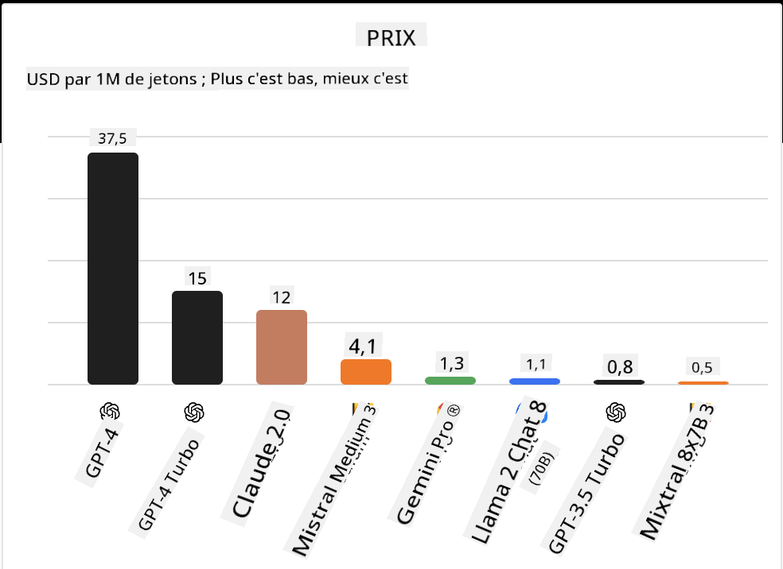
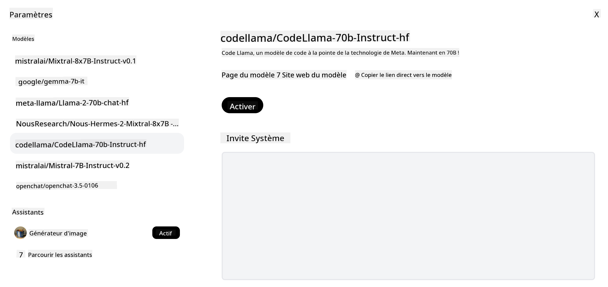
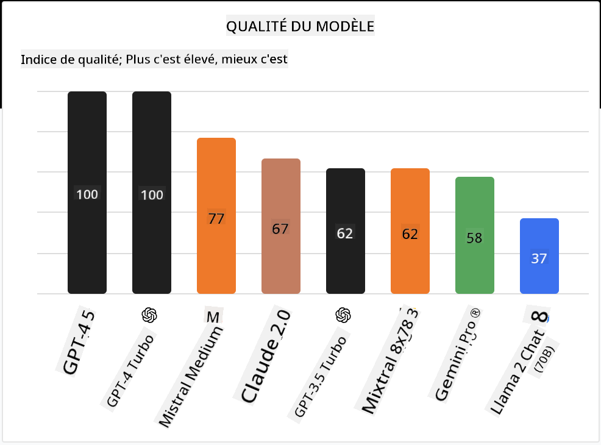

<!--
CO_OP_TRANSLATOR_METADATA:
{
  "original_hash": "0bba96e53ab841d99db731892a51fab8",
  "translation_date": "2025-06-25T23:47:10+00:00",
  "source_file": "16-open-source-models/README.md",
  "language_code": "fr"
}
-->

## Introduction

Le monde des LLMs open source est passionnant et en constante évolution. Cette leçon vise à fournir un regard approfondi sur les modèles open source. Si vous cherchez des informations sur la comparaison entre les modèles propriétaires et les modèles open source, consultez la leçon ["Explorer et comparer différents LLMs"](../02-exploring-and-comparing-different-llms/README.md?WT.mc_id=academic-105485-koreyst). Cette leçon abordera également le sujet du réglage fin, mais une explication plus détaillée peut être trouvée dans la leçon ["Réglage fin des LLMs"](../18-fine-tuning/README.md?WT.mc_id=academic-105485-koreyst).

## Objectifs d'apprentissage

- Acquérir une compréhension des modèles open source
- Comprendre les avantages de travailler avec des modèles open source
- Explorer les modèles ouverts disponibles sur Hugging Face et Azure AI Studio

## Qu'est-ce que les modèles Open Source ?

Le logiciel open source a joué un rôle crucial dans la croissance de la technologie dans divers domaines. L'Open Source Initiative (OSI) a défini [10 critères pour qu'un logiciel](https://web.archive.org/web/20241126001143/https://opensource.org/osd?WT.mc_id=academic-105485-koreyst) soit classé comme open source. Le code source doit être partagé ouvertement sous une licence approuvée par l'OSI.

Bien que le développement des LLMs présente des éléments similaires au développement de logiciels, le processus n'est pas exactement le même. Cela a suscité de nombreuses discussions dans la communauté sur la définition de l'open source dans le contexte des LLMs. Pour qu'un modèle soit conforme à la définition traditionnelle de l'open source, les informations suivantes devraient être publiquement disponibles :

- Jeux de données utilisés pour entraîner le modèle.
- Poids complets du modèle dans le cadre de la formation.
- Le code d'évaluation.
- Le code de réglage fin.
- Poids complets du modèle et métriques de formation.

Actuellement, il n'y a que quelques modèles qui correspondent à ces critères. Le [modèle OLMo créé par l'Allen Institute for Artificial Intelligence (AllenAI)](https://huggingface.co/allenai/OLMo-7B?WT.mc_id=academic-105485-koreyst) est l'un de ceux qui correspondent à cette catégorie.

Pour cette leçon, nous nous référerons aux modèles comme "modèles ouverts" à partir de maintenant, car ils peuvent ne pas correspondre aux critères ci-dessus au moment de la rédaction.

## Avantages des modèles ouverts

**Très personnalisable** - Étant donné que les modèles ouverts sont publiés avec des informations détaillées sur la formation, les chercheurs et les développeurs peuvent modifier les éléments internes du modèle. Cela permet la création de modèles hautement spécialisés qui sont ajustés pour une tâche ou un domaine d'étude spécifique. Quelques exemples de cela sont la génération de code, les opérations mathématiques et la biologie.

**Coût** - Le coût par jeton pour utiliser et déployer ces modèles est inférieur à celui des modèles propriétaires. Lors de la construction d'applications d'IA générative, il convient de comparer la performance par rapport au prix lorsque vous travaillez avec ces modèles pour votre cas d'utilisation.

Source : Analyse Artificielle

**Flexibilité** - Travailler avec des modèles ouverts vous permet d'être flexible en termes d'utilisation de différents modèles ou de les combiner. Un exemple de cela est les [Assistants HuggingChat](https://huggingface.co/chat?WT.mc_id=academic-105485-koreyst) où un utilisateur peut sélectionner le modèle utilisé directement dans l'interface utilisateur :

## Explorer différents modèles ouverts

### Llama 2

[LLama2](https://huggingface.co/meta-llama?WT.mc_id=academic-105485-koreyst), développé par Meta, est un modèle ouvert optimisé pour les applications basées sur le chat. Cela est dû à sa méthode de réglage fin, qui a inclus une grande quantité de dialogues et de retours humains. Avec cette méthode, le modèle produit plus de résultats alignés sur les attentes humaines, ce qui offre une meilleure expérience utilisateur.

Quelques exemples de versions ajustées de Llama incluent [Japanese Llama](https://huggingface.co/elyza/ELYZA-japanese-Llama-2-7b?WT.mc_id=academic-105485-koreyst), qui se spécialise dans le japonais, et [Llama Pro](https://huggingface.co/TencentARC/LLaMA-Pro-8B?WT.mc_id=academic-105485-koreyst), qui est une version améliorée du modèle de base.

### Mistral

[Mistral](https://huggingface.co/mistralai?WT.mc_id=academic-105485-koreyst) est un modèle ouvert avec un fort accent sur la haute performance et l'efficacité. Il utilise l'approche Mixture-of-Experts qui combine un groupe de modèles experts spécialisés en un seul système où, en fonction de l'entrée, certains modèles sont sélectionnés pour être utilisés. Cela rend le calcul plus efficace car les modèles ne traitent que les entrées dans lesquelles ils sont spécialisés.

Quelques exemples de versions ajustées de Mistral incluent [BioMistral](https://huggingface.co/BioMistral/BioMistral-7B?text=Mon+nom+est+Thomas+et+mon+principal?WT.mc_id=academic-105485-koreyst), qui se concentre sur le domaine médical, et [OpenMath Mistral](https://huggingface.co/nvidia/OpenMath-Mistral-7B-v0.1-hf?WT.mc_id=academic-105485-koreyst), qui effectue des calculs mathématiques.

### Falcon

[Falcon](https://huggingface.co/tiiuae?WT.mc_id=academic-105485-koreyst) est un LLM créé par le Technology Innovation Institute (**TII**). Le Falcon-40B a été entraîné sur 40 milliards de paramètres, ce qui a montré des performances supérieures à GPT-3 avec moins de budget de calcul. Cela est dû à son utilisation de l'algorithme FlashAttention et de l'attention multiquery qui lui permet de réduire les besoins en mémoire lors de l'inférence. Avec ce temps d'inférence réduit, le Falcon-40B est adapté aux applications de chat.

Quelques exemples de versions ajustées de Falcon sont l'[OpenAssistant](https://huggingface.co/OpenAssistant/falcon-40b-sft-top1-560?WT.mc_id=academic-105485-koreyst), un assistant construit sur des modèles ouverts, et [GPT4ALL](https://huggingface.co/nomic-ai/gpt4all-falcon?WT.mc_id=academic-105485-koreyst), qui offre des performances supérieures au modèle de base.

## Comment choisir

Il n'y a pas de réponse unique pour choisir un modèle ouvert. Un bon point de départ est d'utiliser la fonction de filtrage par tâche de l'Azure AI Studio. Cela vous aidera à comprendre quels types de tâches le modèle a été entraîné. Hugging Face maintient également un classement des LLMs qui vous montre les modèles les plus performants selon certains critères.

Lors de la comparaison des LLMs entre les différents types, [Artificial Analysis](https://artificialanalysis.ai/?WT.mc_id=academic-105485-koreyst) est une autre excellente ressource :

Source : Analyse Artificielle

Si vous travaillez sur un cas d'utilisation spécifique, chercher des versions ajustées qui se concentrent sur le même domaine peut être efficace. Expérimenter avec plusieurs modèles ouverts pour voir comment ils se comportent selon vos attentes et celles de vos utilisateurs est une autre bonne pratique.

## Prochaines étapes

La meilleure partie des modèles ouverts est que vous pouvez commencer à travailler avec eux assez rapidement. Consultez le [Catalogue de modèles Azure AI Studio](https://ai.azure.com?WT.mc_id=academic-105485-koreyst), qui propose une collection spécifique de Hugging Face avec les modèles discutés ici.

## L'apprentissage ne s'arrête pas ici, continuez le voyage

Après avoir terminé cette leçon, consultez notre [Collection d'apprentissage en IA générative](https://aka.ms/genai-collection?WT.mc_id=academic-105485-koreyst) pour continuer à améliorer vos connaissances en IA générative !

**Avertissement** :  
Ce document a été traduit à l'aide du service de traduction AI [Co-op Translator](https://github.com/Azure/co-op-translator). Bien que nous nous efforcions d'assurer l'exactitude, veuillez noter que les traductions automatiques peuvent contenir des erreurs ou des inexactitudes. Le document original dans sa langue d'origine doit être considéré comme la source faisant autorité. Pour des informations critiques, une traduction humaine professionnelle est recommandée. Nous ne sommes pas responsables des malentendus ou des interprétations erronées résultant de l'utilisation de cette traduction.