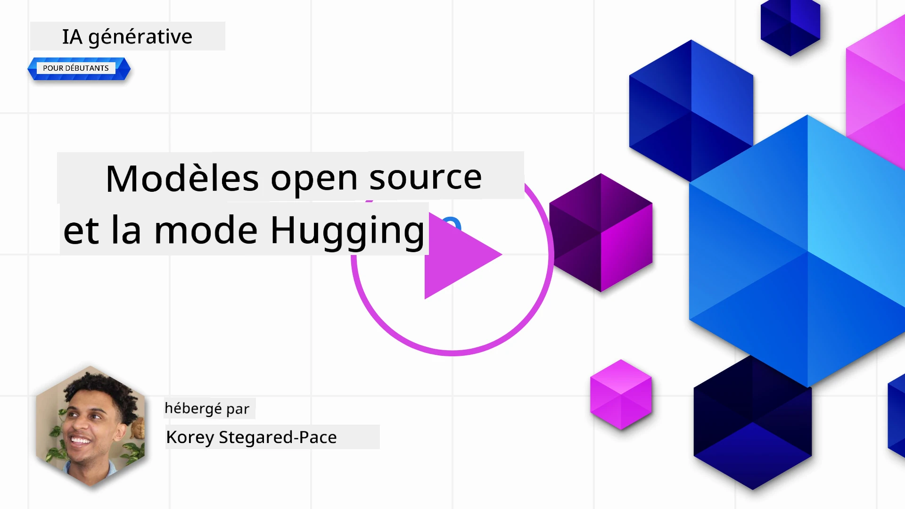
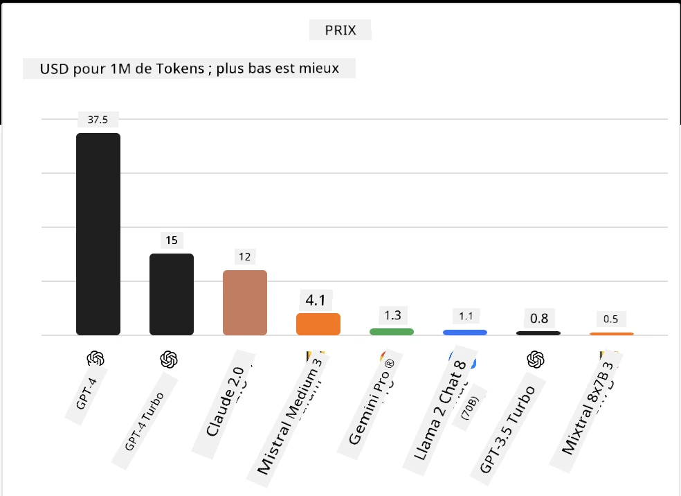
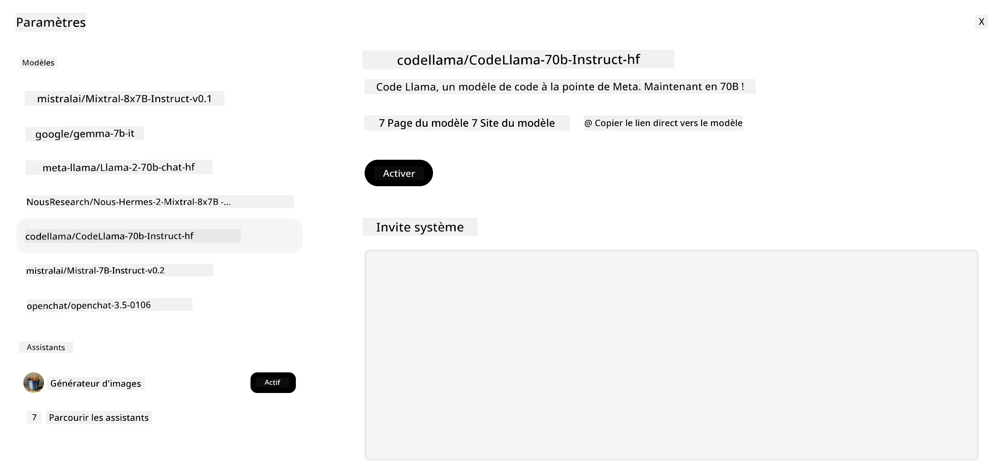

## Introduction

Le monde des LLM open source est passionnant et en constante évolution. Cette leçon vise à fournir un aperçu approfondi des modèles open source. Si vous recherchez des informations sur la comparaison entre modèles propriétaires et modèles open source, allez à la leçon ["Explorer et comparer différents LLMs"](../02-exploring-and-comparing-different-llms/README.md?WT.mc_id=academic-105485-koreyst). Cette leçon couvrira également le sujet du fine-tuning, mais une explication plus détaillée se trouve dans la leçon ["Fine-tuning des LLMs"](../18-fine-tuning/README.md?WT.mc_id=academic-105485-koreyst).

## Objectifs d'apprentissage

- Comprendre les modèles open source
- Comprendre les avantages de travailler avec des modèles open source
- Explorer les modèles open disponibles sur Hugging Face et le catalogue de modèles Microsoft Foundry

## Qu'est-ce que les modèles Open Source ?

Le logiciel open source a joué un rôle crucial dans la croissance de la technologie dans divers domaines. L'Open Source Initiative (OSI) a défini [10 critères pour qu'un logiciel](https://web.archive.org/web/20241126001143/https://opensource.org/osd?WT.mc_id=academic-105485-koreyst) soit classé comme open source. Le code source doit être partagé ouvertement sous une licence approuvée par l'OSI.

Bien que le développement des LLM ait des éléments similaires au développement logiciel, le processus n'est pas exactement le même. Cela a suscité beaucoup de discussions dans la communauté sur la définition de l'open source dans le contexte des LLM. Pour qu'un modèle soit conforme à la définition traditionnelle de l'open source, les informations suivantes devraient être publiquement disponibles :

- Les jeux de données utilisés pour entraîner le modèle.
- Les poids complets du modèle dans le cadre de l'entraînement.
- Le code d'évaluation.
- Le code de fine-tuning.
- Les poids complets du modèle et les métriques d'entraînement.

Actuellement, il n'y a que quelques modèles qui répondent à ces critères. Le [modèle OLMo créé par l'Allen Institute for Artificial Intelligence (AllenAI)](https://huggingface.co/allenai/OLMo-7B?WT.mc_id=academic-105485-koreyst) en est un qui correspond à cette catégorie.

Pour cette leçon, nous nous référerons aux modèles comme "modèles open" car ils peuvent ne pas correspondre aux critères ci-dessus au moment de la rédaction.

## Avantages des modèles Open

**Hautement personnalisables** - Puisque les modèles open sont publiés avec des informations détaillées sur l'entraînement, les chercheurs et développeurs peuvent modifier l'intérieur du modèle. Cela permet la création de modèles très spécialisés, finement ajustés pour une tâche ou un domaine spécifique. Quelques exemples incluent la génération de code, les opérations mathématiques et la biologie.

**Coût** - Le coût par token pour utiliser et déployer ces modèles est inférieur à celui des modèles propriétaires. Lors de la création d'applications d'IA générative, il faut considérer le rapport performance/prix lorsque vous travaillez avec ces modèles pour votre cas d'utilisation.

Source : Artificial Analysis

**Flexibilité** - Travailler avec des modèles open permet d'être flexible en termes d'utilisation de différents modèles ou de leur combinaison. Un exemple est celui des [Assistants HuggingChat](https://huggingface.co/chat?WT.mc_id=academic-105485-koreyst) où un utilisateur peut choisir le modèle utilisé directement dans l'interface utilisateur :

## Explorer différents modèles Open

### Llama 2

[Llama2](https://huggingface.co/meta-llama?WT.mc_id=academic-105485-koreyst), développé par Meta, est un modèle open optimisé pour des applications basées sur le dialogue. Cela est dû à sa méthode de fine-tuning, qui comprenait une grande quantité de dialogues et de retours humains. Avec cette méthode, le modèle produit des résultats plus alignés aux attentes humaines, offrant une meilleure expérience utilisateur.

Quelques exemples de versions fine-tunées de Llama incluent [Japanese Llama](https://huggingface.co/elyza/ELYZA-japanese-Llama-2-7b?WT.mc_id=academic-105485-koreyst), spécialisé en japonais, et [Llama Pro](https://huggingface.co/TencentARC/LLaMA-Pro-8B?WT.mc_id=academic-105485-koreyst), qui est une version améliorée du modèle de base.

### Mistral

[Mistral](https://huggingface.co/mistralai?WT.mc_id=academic-105485-koreyst) est un modèle open avec un fort accent sur la haute performance et l'efficacité. Il utilise l'approche Mixture-of-Experts qui combine un groupe de modèles experts spécialisés en un seul système où, selon l'entrée, certains modèles sont sélectionnés pour être utilisés. Cela rend le calcul plus efficace car les modèles ne traitent que les entrées pour lesquelles ils sont spécialisés.

Quelques exemples de versions fine-tunées de Mistral incluent [BioMistral](https://huggingface.co/BioMistral/BioMistral-7B?text=Mon+nom+est+Thomas+et+mon+principal?WT.mc_id=academic-105485-koreyst), qui est axé sur le domaine médical, et [OpenMath Mistral](https://huggingface.co/nvidia/OpenMath-Mistral-7B-v0.1-hf?WT.mc_id=academic-105485-koreyst), qui effectue des calculs mathématiques.

### Falcon

[Falcon](https://huggingface.co/tiiuae?WT.mc_id=academic-105485-koreyst) est un LLM créé par le Technology Innovation Institute (**TII**). Le Falcon-40B a été entraîné sur 40 milliards de paramètres et a montré une meilleure performance que GPT-3 avec un budget de calcul moindre. Cela est dû à son utilisation de l'algorithme FlashAttention et de l'attention multiquery qui permet de réduire les exigences mémoire lors du temps d'inférence. Avec ce temps d'inférence réduit, le Falcon-40B est adapté aux applications de chat.

Quelques exemples de versions fine-tunées de Falcon sont [OpenAssistant](https://huggingface.co/OpenAssistant/falcon-40b-sft-top1-560?WT.mc_id=academic-105485-koreyst), un assistant construit sur des modèles open, et [GPT4ALL](https://huggingface.co/nomic-ai/gpt4all-falcon?WT.mc_id=academic-105485-koreyst), qui offre de meilleures performances que le modèle de base.

## Comment choisir

Il n'y a pas de réponse unique pour choisir un modèle open. Un bon point de départ est d'utiliser la fonction filtre par tâche du catalogue de modèles Microsoft Foundry. Cela vous aidera à comprendre les types de tâches pour lesquelles le modèle a été entraîné. Hugging Face maintient également un classement des LLM qui montre les modèles les plus performants selon certains indicateurs.

Pour comparer les LLM entre différents types, [Artificial Analysis](https://artificialanalysis.ai/?WT.mc_id=academic-105485-koreyst) est une autre excellente ressource :

Source : Artificial Analysis

Si vous travaillez sur un cas d'utilisation spécifique, rechercher des versions fine-tunées axées sur le même domaine peut être efficace. Expérimenter avec plusieurs modèles open pour voir leurs performances en fonction de vos attentes et celles de vos utilisateurs est une autre bonne pratique.

## Prochaines étapes

Le meilleur avec les modèles open est que vous pouvez commencer à travailler avec très rapidement. Consultez le [catalogue de modèles Microsoft Foundry](https://ai.azure.com?WT.mc_id=academic-105485-koreyst), qui propose une collection spécifique Hugging Face avec ces modèles dont nous avons parlé ici.

## L'apprentissage ne s'arrête pas ici, continuez votre parcours

Après avoir terminé cette leçon, consultez notre [collection d'apprentissage sur l'IA générative](https://aka.ms/genai-collection?WT.mc_id=academic-105485-koreyst) pour continuer à améliorer vos connaissances en IA générative !

---

<!-- CO-OP TRANSLATOR DISCLAIMER START -->
**Avertissement** :
Ce document a été traduit à l'aide du service de traduction automatique [Co-op Translator](https://github.com/Azure/co-op-translator). Bien que nous nous efforçions d'assurer l'exactitude, veuillez noter que les traductions automatisées peuvent contenir des erreurs ou des inexactitudes. Le document original dans sa langue native doit être considéré comme la source faisant autorité. Pour les informations critiques, il est recommandé de recourir à une traduction professionnelle réalisée par un humain. Nous ne saurions être tenus responsables des malentendus ou erreurs d'interprétation découlant de l'utilisation de cette traduction.
<!-- CO-OP TRANSLATOR DISCLAIMER END -->