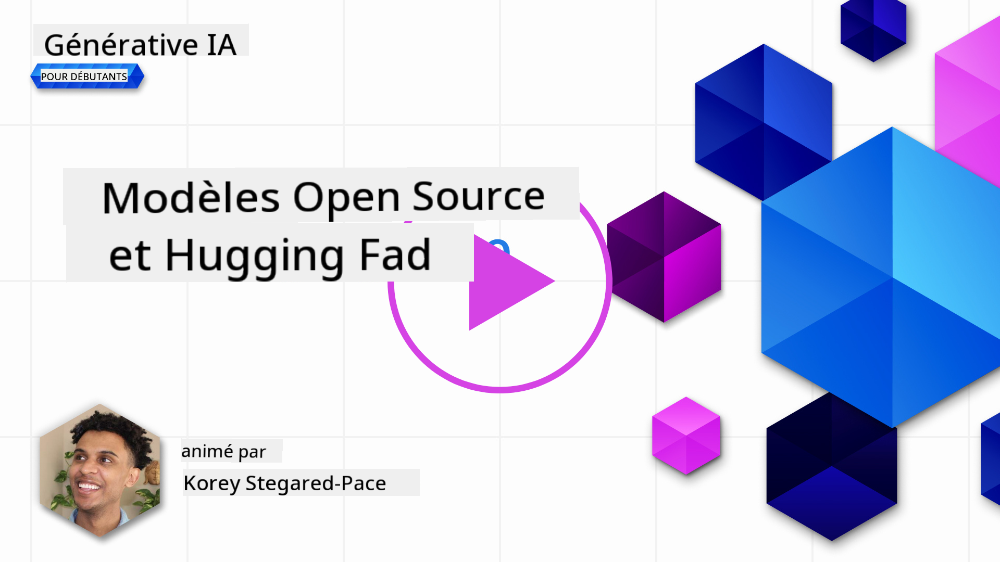

<!--
CO_OP_TRANSLATOR_METADATA:
{
  "original_hash": "a8b2d4bb727c877ebf9edff8623d16b9",
  "translation_date": "2025-09-06T10:09:33+00:00",
  "source_file": "16-open-source-models/README.md",
  "language_code": "fr"
}
-->

## Introduction

Le monde des LLMs open source est passionnant et en constante évolution. Cette leçon vise à offrir un aperçu approfondi des modèles open source. Si vous cherchez des informations sur la comparaison entre les modèles propriétaires et les modèles open source, consultez la leçon ["Explorer et Comparer Différents LLMs"](../02-exploring-and-comparing-different-llms/README.md?WT.mc_id=academic-105485-koreyst). Cette leçon abordera également le sujet du fine-tuning, mais une explication plus détaillée est disponible dans la leçon ["Fine-Tuning des LLMs"](../18-fine-tuning/README.md?WT.mc_id=academic-105485-koreyst).

## Objectifs d'apprentissage

- Comprendre les modèles open source
- Découvrir les avantages de travailler avec des modèles open source
- Explorer les modèles open disponibles sur Hugging Face et Azure AI Studio

## Qu'est-ce qu'un modèle Open Source ?

Les logiciels open source ont joué un rôle crucial dans le développement technologique dans divers domaines. L'Open Source Initiative (OSI) a défini [10 critères pour les logiciels](https://web.archive.org/web/20241126001143/https://opensource.org/osd?WT.mc_id=academic-105485-koreyst) pour être classés comme open source. Le code source doit être partagé publiquement sous une licence approuvée par l'OSI.

Bien que le développement des LLMs partage des éléments similaires avec le développement de logiciels, le processus n'est pas exactement le même. Cela a suscité de nombreuses discussions dans la communauté sur la définition de l'open source dans le contexte des LLMs. Pour qu'un modèle corresponde à la définition traditionnelle de l'open source, les informations suivantes doivent être publiquement disponibles :

- Les ensembles de données utilisés pour entraîner le modèle.
- Les poids complets du modèle dans le cadre de l'entraînement.
- Le code d'évaluation.
- Le code de fine-tuning.
- Les poids complets du modèle et les métriques d'entraînement.

Actuellement, seuls quelques modèles répondent à ces critères. Le [modèle OLMo créé par l'Allen Institute for Artificial Intelligence (AllenAI)](https://huggingface.co/allenai/OLMo-7B?WT.mc_id=academic-105485-koreyst) correspond à cette catégorie.

Pour cette leçon, nous nous référerons aux modèles comme "modèles open" à partir de maintenant, car ils peuvent ne pas correspondre aux critères ci-dessus au moment de la rédaction.

## Avantages des modèles Open

**Fortement personnalisables** - Étant donné que les modèles open sont publiés avec des informations détaillées sur l'entraînement, les chercheurs et développeurs peuvent modifier les éléments internes du modèle. Cela permet de créer des modèles hautement spécialisés adaptés à une tâche ou un domaine d'étude spécifique. Quelques exemples incluent la génération de code, les opérations mathématiques et la biologie.

**Coût** - Le coût par token pour utiliser et déployer ces modèles est inférieur à celui des modèles propriétaires. Lors de la création d'applications d'IA générative, il est important d'examiner la performance par rapport au prix en fonction de votre cas d'utilisation.

  
Source : Artificial Analysis

**Flexibilité** - Travailler avec des modèles open permet d'être flexible en termes d'utilisation de différents modèles ou de leur combinaison. Un exemple est les [Assistants HuggingChat](https://huggingface.co/chat?WT.mc_id=academic-105485-koreyst), où l'utilisateur peut sélectionner directement le modèle utilisé dans l'interface utilisateur :

## Explorer différents modèles Open

### Llama 2

[LLama2](https://huggingface.co/meta-llama?WT.mc_id=academic-105485-koreyst), développé par Meta, est un modèle open optimisé pour les applications basées sur le chat. Cela est dû à sa méthode de fine-tuning, qui inclut une grande quantité de dialogues et de retours humains. Grâce à cette méthode, le modèle produit des résultats plus alignés aux attentes humaines, offrant ainsi une meilleure expérience utilisateur.

Quelques exemples de versions fine-tunées de Llama incluent [Japanese Llama](https://huggingface.co/elyza/ELYZA-japanese-Llama-2-7b?WT.mc_id=academic-105485-koreyst), spécialisé en japonais, et [Llama Pro](https://huggingface.co/TencentARC/LLaMA-Pro-8B?WT.mc_id=academic-105485-koreyst), une version améliorée du modèle de base.

### Mistral

[Mistral](https://huggingface.co/mistralai?WT.mc_id=academic-105485-koreyst) est un modèle open axé sur la haute performance et l'efficacité. Il utilise l'approche Mixture-of-Experts, qui combine un groupe de modèles experts spécialisés en un seul système où, selon l'entrée, certains modèles sont sélectionnés pour être utilisés. Cela rend le calcul plus efficace, car les modèles ne traitent que les entrées pour lesquelles ils sont spécialisés.

Quelques exemples de versions fine-tunées de Mistral incluent [BioMistral](https://huggingface.co/BioMistral/BioMistral-7B?text=Mon+nom+est+Thomas+et+mon+principal?WT.mc_id=academic-105485-koreyst), axé sur le domaine médical, et [OpenMath Mistral](https://huggingface.co/nvidia/OpenMath-Mistral-7B-v0.1-hf?WT.mc_id=academic-105485-koreyst), qui réalise des calculs mathématiques.

### Falcon

[Falcon](https://huggingface.co/tiiuae?WT.mc_id=academic-105485-koreyst) est un LLM créé par le Technology Innovation Institute (**TII**). Le Falcon-40B a été entraîné sur 40 milliards de paramètres, ce qui a montré des performances supérieures à GPT-3 avec un budget de calcul moindre. Cela est dû à son utilisation de l'algorithme FlashAttention et de l'attention multiquery, qui lui permet de réduire les besoins en mémoire lors de l'inférence. Avec ce temps d'inférence réduit, le Falcon-40B est adapté aux applications de chat.

Quelques exemples de versions fine-tunées de Falcon incluent [OpenAssistant](https://huggingface.co/OpenAssistant/falcon-40b-sft-top1-560?WT.mc_id=academic-105485-koreyst), un assistant basé sur des modèles open, et [GPT4ALL](https://huggingface.co/nomic-ai/gpt4all-falcon?WT.mc_id=academic-105485-koreyst), qui offre des performances supérieures au modèle de base.

## Comment choisir

Il n'existe pas de réponse unique pour choisir un modèle open. Un bon point de départ est d'utiliser la fonctionnalité de filtrage par tâche de l'Azure AI Studio. Cela vous aidera à comprendre les types de tâches pour lesquels le modèle a été entraîné. Hugging Face maintient également un classement des LLMs qui montre les modèles les plus performants selon certains critères.

Pour comparer les LLMs entre différents types, [Artificial Analysis](https://artificialanalysis.ai/?WT.mc_id=academic-105485-koreyst) est une autre excellente ressource :

  
Source : Artificial Analysis

Si vous travaillez sur un cas d'utilisation spécifique, rechercher des versions fine-tunées axées sur le même domaine peut être efficace. Expérimenter avec plusieurs modèles open pour voir comment ils répondent à vos attentes et celles de vos utilisateurs est également une bonne pratique.

## Prochaines étapes

La meilleure partie des modèles open est que vous pouvez commencer à travailler avec eux rapidement. Consultez le [Catalogue de Modèles Azure AI Foundry](https://ai.azure.com?WT.mc_id=academic-105485-koreyst), qui propose une collection spécifique de Hugging Face avec les modèles discutés ici.

## L'apprentissage ne s'arrête pas ici, continuez votre parcours

Après avoir terminé cette leçon, consultez notre [collection d'apprentissage sur l'IA générative](https://aka.ms/genai-collection?WT.mc_id=academic-105485-koreyst) pour continuer à approfondir vos connaissances en IA générative !

---

**Avertissement** :  
Ce document a été traduit à l'aide du service de traduction automatique [Co-op Translator](https://github.com/Azure/co-op-translator). Bien que nous nous efforcions d'assurer l'exactitude, veuillez noter que les traductions automatisées peuvent contenir des erreurs ou des inexactitudes. Le document original dans sa langue d'origine doit être considéré comme la source faisant autorité. Pour des informations critiques, il est recommandé de faire appel à une traduction humaine professionnelle. Nous déclinons toute responsabilité en cas de malentendus ou d'interprétations erronées résultant de l'utilisation de cette traduction.