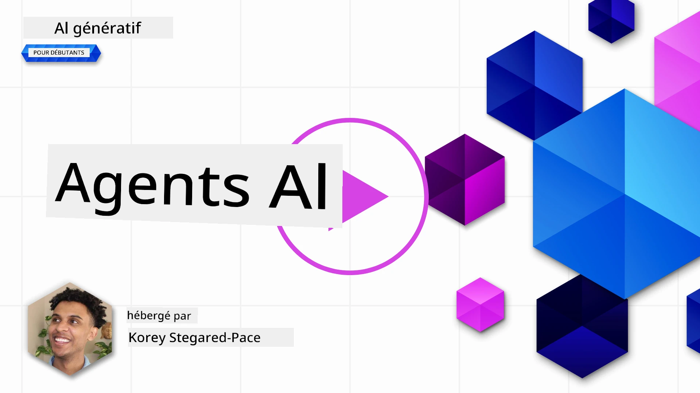
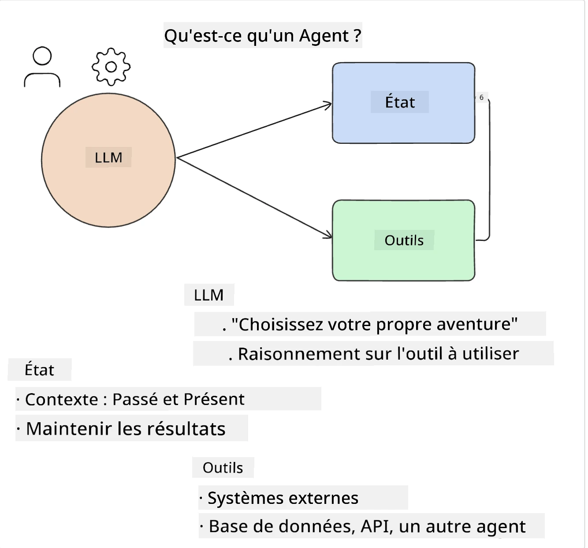
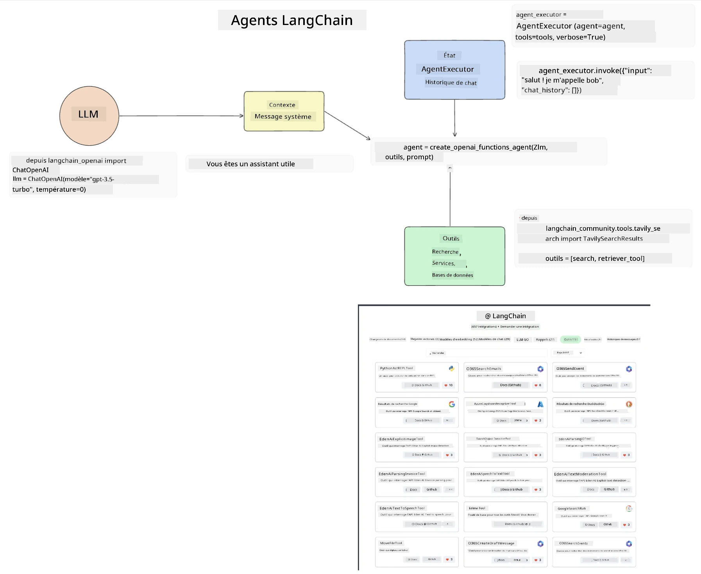
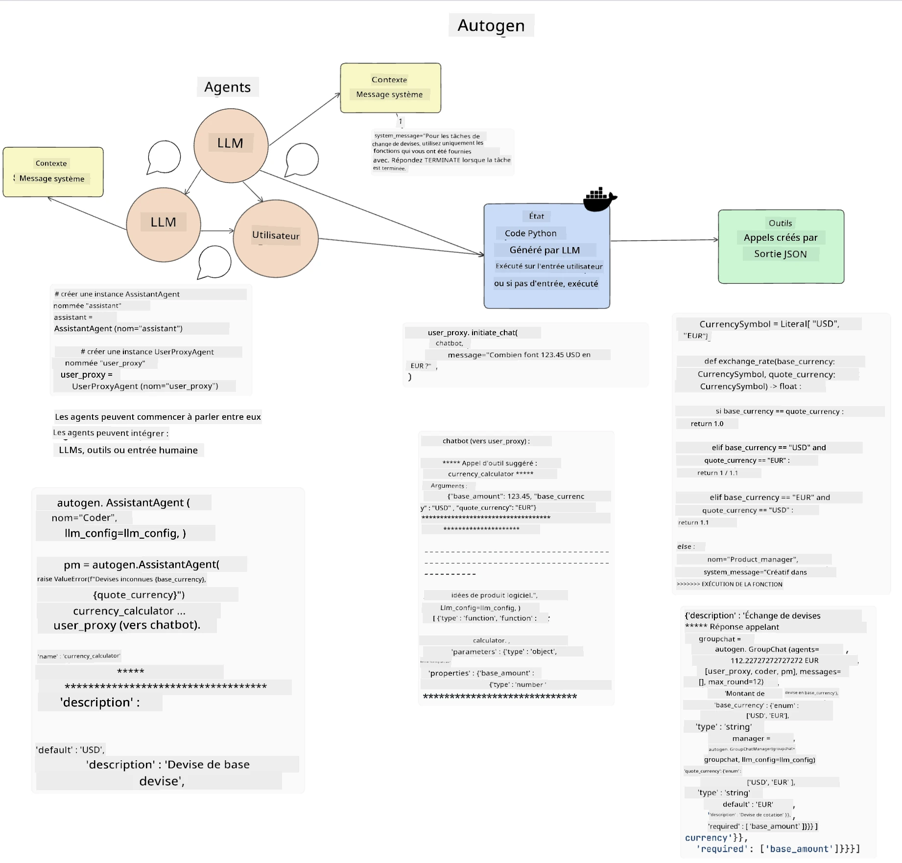
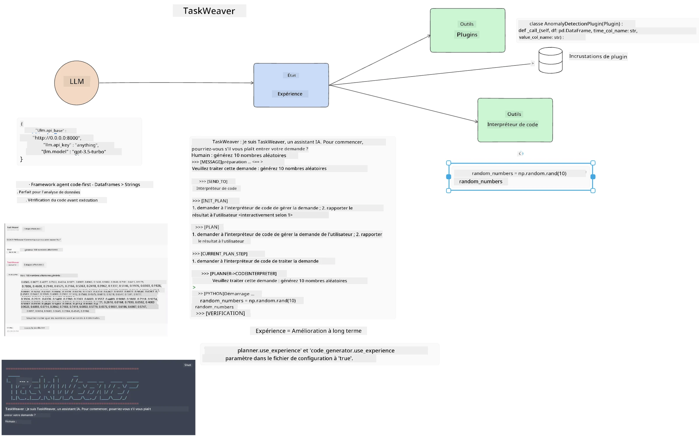
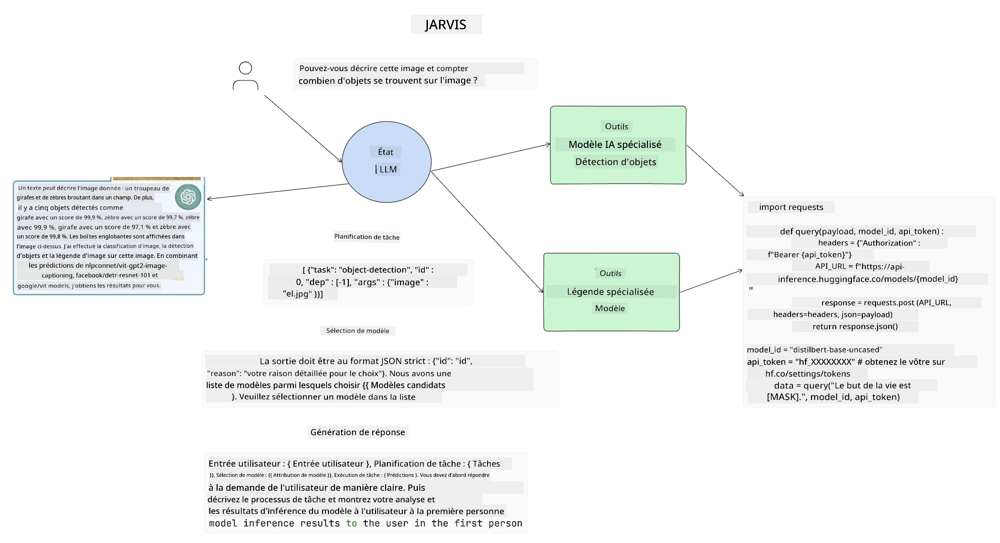

[](https://youtu.be/yAXVW-lUINc?si=bOtW9nL6jc3XJgOM)

## Introduction

Les agents IA représentent un développement passionnant dans l'IA générative, permettant aux grands modèles de langage (LLM) d'évoluer d'assistants à des agents capables d'exécuter des actions. Les frameworks d'agents IA permettent aux développeurs de créer des applications qui donnent aux LLM un accès à des outils et à la gestion d'état. Ces frameworks améliorent également la visibilité, permettant aux utilisateurs et aux développeurs de surveiller les actions planifiées par les LLM, améliorant ainsi la gestion de l'expérience.

La leçon couvrira les domaines suivants :

- Comprendre ce qu'est un agent IA - Qu'est-ce qu'un agent IA exactement ?
- Explorer quatre frameworks différents d'agents IA - Qu'est-ce qui les rend uniques ?
- Appliquer ces agents IA à différents cas d'usage - Quand devrions-nous utiliser des agents IA ?

## Objectifs d'apprentissage

Après avoir suivi cette leçon, vous serez capable de :

- Expliquer ce que sont les agents IA et comment ils peuvent être utilisés.
- Avoir une compréhension des différences entre certains des frameworks populaires d'agents IA, et comment ils diffèrent.
- Comprendre comment fonctionnent les agents IA afin de créer des applications avec eux.

## Qu'est-ce qu'un agent IA ?

Les agents IA constituent un domaine très excitant dans le monde de l'IA générative. Avec cet enthousiasme vient parfois une confusion des termes et de leur application. Pour simplifier et inclure la plupart des outils qui se réfèrent aux agents IA, nous allons utiliser cette définition :

Les agents IA permettent aux grands modèles de langage (LLM) d'exécuter des tâches en leur donnant accès à un **état** et des **outils**.



Définissons ces termes :

**Grands modèles de langage** - Il s'agit des modèles mentionnés tout au long de ce cours tels que GPT-3.5, GPT-4, Llama-2, etc.

**État** - Cela fait référence au contexte dans lequel le LLM travaille. Le LLM utilise le contexte de ses actions passées et le contexte actuel pour guider sa prise de décision pour les actions suivantes. Les frameworks d'agents IA permettent aux développeurs de maintenir ce contexte plus facilement.

**Outils** - Pour accomplir la tâche que l'utilisateur a demandée et que le LLM a planifiée, le LLM a besoin d'accéder à des outils. Quelques exemples d'outils peuvent être une base de données, une API, une application externe ou même un autre LLM !

Ces définitions devraient vous donner une bonne base pour la suite, alors que nous examinons comment ils sont mis en œuvre. Explorons quelques frameworks différents d'agents IA :

## LangChain Agents

[LangChain Agents](https://python.langchain.com/docs/how_to/#agents?WT.mc_id=academic-105485-koreyst) est une implémentation des définitions que nous avons fournies ci-dessus.

Pour gérer l'**état**, il utilise une fonction intégrée appelée `AgentExecutor`. Celle-ci accepte l'`agent` défini et les `outils` qui lui sont disponibles.

Le `Agent Executor` stocke également l'historique du chat pour fournir le contexte de la conversation.



LangChain offre un [catalogue d'outils](https://integrations.langchain.com/tools?WT.mc_id=academic-105485-koreyst) qui peuvent être importés dans votre application et auxquels le LLM peut accéder. Ces outils sont réalisés par la communauté et par l'équipe LangChain.

Vous pouvez alors définir ces outils et les passer au `Agent Executor`.

La visibilité est un autre aspect important lorsqu'on parle d'agents IA. Il est important que les développeurs d'applications comprennent quel outil le LLM utilise et pourquoi. Pour cela, l'équipe de LangChain a développé LangSmith.

## AutoGen

Le prochain framework d'agents IA dont nous parlerons est [AutoGen](https://microsoft.github.io/autogen/?WT.mc_id=academic-105485-koreyst). L'accent principal d'AutoGen est sur les conversations. Les agents sont à la fois **conversables** et **personnalisables**.

**Conversable -** Les LLM peuvent démarrer et poursuivre une conversation avec un autre LLM afin d'accomplir une tâche. Cela se fait en créant des `AssistantAgents` et en leur donnant un message système spécifique.

```python

autogen.AssistantAgent( name="Coder", llm_config=llm_config, ) pm = autogen.AssistantAgent( name="Product_manager", system_message="Creative in software product ideas.", llm_config=llm_config, )

```

**Personnalisable** - Les agents peuvent être définis non seulement comme des LLM mais aussi comme un utilisateur ou un outil. En tant que développeur, vous pouvez définir un `UserProxyAgent` qui est responsable d'interagir avec l'utilisateur pour obtenir des retours sur l'accomplissement d'une tâche. Ce retour peut soit continuer l'exécution de la tâche, soit la stopper.

```python
user_proxy = UserProxyAgent(name="user_proxy")
```

### État et outils

Pour changer et gérer l'état, un agent assistant génère du code Python pour compléter la tâche.

Voici un exemple du processus :



#### LLM défini avec un message système

```python
system_message="For weather related tasks, only use the functions you have been provided with. Reply TERMINATE when the task is done."
```

Ce message système dirige ce LLM spécifique vers les fonctions pertinentes pour sa tâche. Rappelez-vous, avec AutoGen vous pouvez avoir plusieurs AssistantAgents définis avec différents messages système.

#### Le chat est initié par l'utilisateur

```python
user_proxy.initiate_chat( chatbot, message="I am planning a trip to NYC next week, can you help me pick out what to wear? ", )

```

Ce message du user_proxy (humain) est ce qui va démarrer le processus de l'agent pour explorer les fonctions possibles qu'il devrait exécuter.

#### Fonction exécutée

```bash
chatbot (to user_proxy):

***** Suggested tool Call: get_weather ***** Arguments: {"location":"New York City, NY","time_periond:"7","temperature_unit":"Celsius"} ******************************************************** --------------------------------------------------------------------------------

>>>>>>>> EXECUTING FUNCTION get_weather... user_proxy (to chatbot): ***** Response from calling function "get_weather" ***** 112.22727272727272 EUR ****************************************************************

```

Une fois le chat initial traité, l'agent enverra l'outil suggéré à appeler. Dans ce cas, c'est une fonction appelée `get_weather`. Selon votre configuration, cette fonction peut être exécutée automatiquement et lue par l'agent ou exécutée sur demande de l'utilisateur.

Vous pouvez trouver une liste d'[exemples de code AutoGen](https://microsoft.github.io/autogen/docs/Examples/?WT.mc_id=academic-105485-koreyst) pour explorer davantage comment démarrer la construction.

## Taskweaver

Le prochain framework d’agents que nous allons explorer est [Taskweaver](https://microsoft.github.io/TaskWeaver/?WT.mc_id=academic-105485-koreyst). Il est connu comme un agent "code-first" car au lieu de travailler strictement avec des `strings`, il peut travailler avec des DataFrames en Python. Cela devient extrêmement utile pour les tâches d'analyse et de génération de données. Cela peut être des choses comme créer des graphiques ou générer des nombres aléatoires.

### État et outils

Pour gérer l'état de la conversation, TaskWeaver utilise le concept de `Planner`. Le `Planner` est un LLM qui prend la requête des utilisateurs et planifie les tâches nécessaires pour répondre à cette demande.

Pour accomplir les tâches, le `Planner` a accès à une collection d'outils appelée `Plugins`. Cela peut être des classes Python ou un interpréteur de code général. Ces plugins sont stockés sous forme d'embeddings afin que le LLM puisse mieux rechercher le plugin approprié.



Voici un exemple de plugin pour gérer la détection d'anomalies :

```python
class AnomalyDetectionPlugin(Plugin): def __call__(self, df: pd.DataFrame, time_col_name: str, value_col_name: str):
```

Le code est vérifié avant exécution. Une autre fonctionnalité pour gérer le contexte dans Taskweaver est l'`experience`. L'expérience permet que le contexte d'une conversation soit conservé sur le long terme dans un fichier YAML. Cela peut être configuré pour que le LLM s'améliore avec le temps sur certaines tâches, à condition qu'il soit exposé aux conversations antérieures.

## JARVIS

Le dernier framework d'agents que nous allons explorer est [JARVIS](https://github.com/microsoft/JARVIS?tab=readme-ov-file&WT.mc_id=academic-105485-koreyst). Ce qui rend JARVIS unique, c'est qu'il utilise un LLM pour gérer l'`état` de la conversation et que les `outils` sont d'autres modèles d'IA. Chacun des modèles d'IA est spécialisé dans certaines tâches telles que la détection d'objets, la transcription ou le sous-titrage d'images.



Le LLM, étant un modèle polyvalent, reçoit la requête de l'utilisateur et identifie la tâche spécifique ainsi que les arguments/données nécessaires pour accomplir la tâche.

```python
[{"task": "object-detection", "id": 0, "dep": [-1], "args": {"image": "e1.jpg" }}]
```

Le LLM formate alors la requête d'une manière que le modèle IA spécialisé peut interpréter, comme du JSON. Une fois que le modèle IA a renvoyé sa prédiction basée sur la tâche, le LLM reçoit la réponse.

Si plusieurs modèles sont nécessaires pour accomplir la tâche, il interprétera aussi les réponses de ces modèles avant de les assembler pour générer la réponse destinée à l'utilisateur.

L'exemple ci-dessous montre comment cela fonctionne lorsque l'utilisateur demande une description et le comptage des objets dans une image :

## Devoir

Pour continuer votre apprentissage des agents IA, vous pouvez construire avec AutoGen :

- Une application qui simule une réunion d'affaires avec différents départements d'une startup éducative.
- Créer des messages système qui guident les LLM à comprendre différentes personas et priorités, et permettre à l'utilisateur de présenter une nouvelle idée de produit.
- Le LLM devrait alors générer des questions de suivi de chaque département pour affiner et améliorer la présentation et l'idée de produit.

## L'apprentissage ne s'arrête pas ici, continuez le voyage

Après avoir terminé cette leçon, consultez notre [collection d'apprentissage sur l'IA générative](https://aka.ms/genai-collection?WT.mc_id=academic-105485-koreyst) pour continuer à développer vos connaissances en IA générative !

---

<!-- CO-OP TRANSLATOR DISCLAIMER START -->
**Avertissement** :  
Ce document a été traduit à l’aide du service de traduction automatique [Co-op Translator](https://github.com/Azure/co-op-translator). Bien que nous fassions tout notre possible pour assurer l’exactitude, veuillez noter que les traductions automatisées peuvent contenir des erreurs ou des inexactitudes. Le document original dans sa langue d’origine doit être considéré comme la source faisant foi. Pour les informations critiques, il est recommandé de recourir à une traduction professionnelle réalisée par un humain. Nous déclinons toute responsabilité en cas de malentendus ou de mauvaises interprétations résultant de l’utilisation de cette traduction.
<!-- CO-OP TRANSLATOR DISCLAIMER END -->