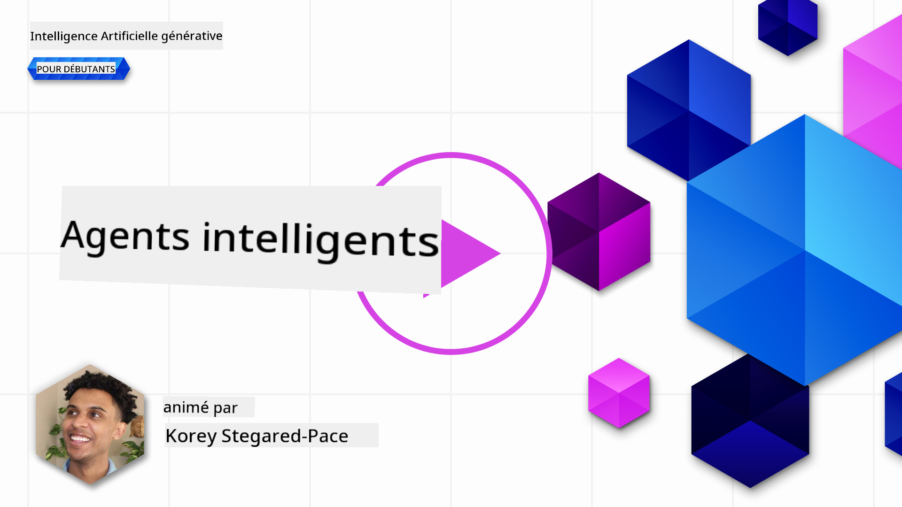
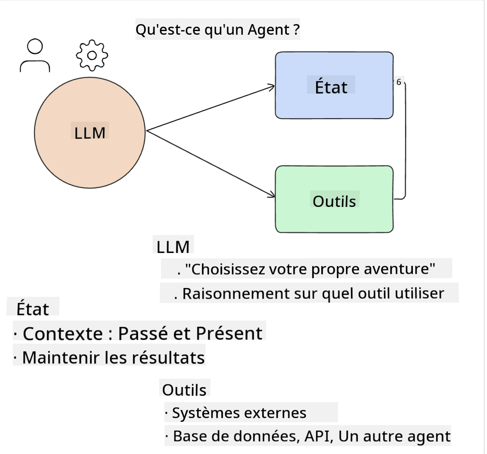
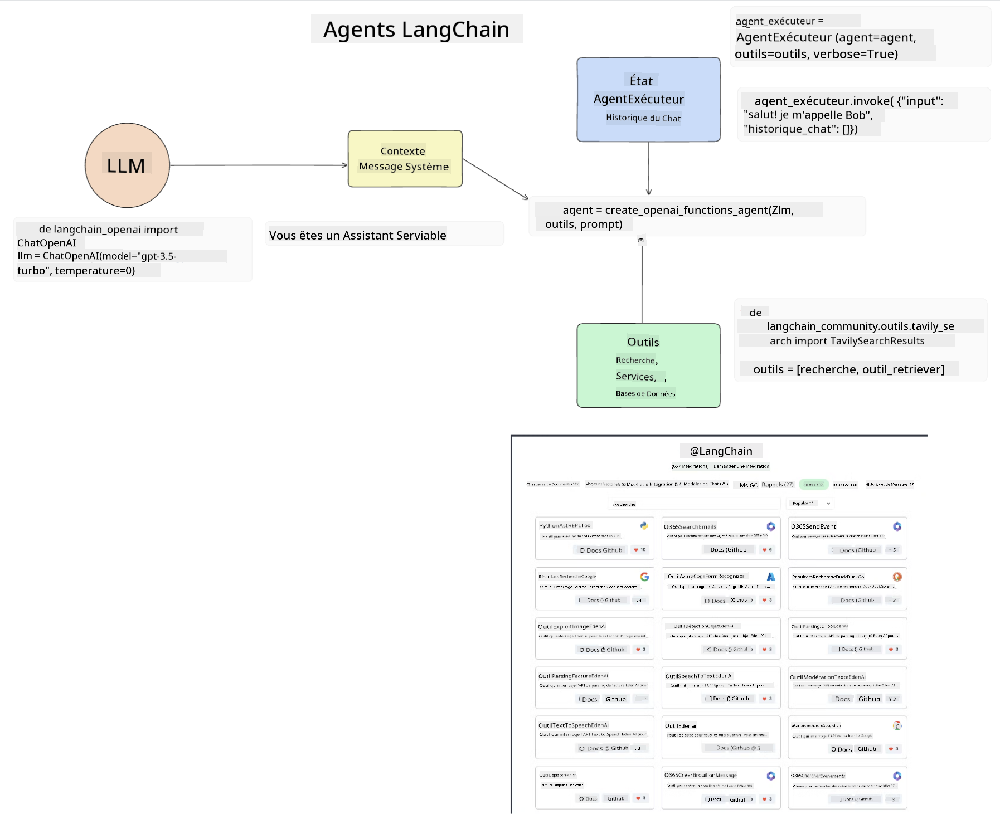
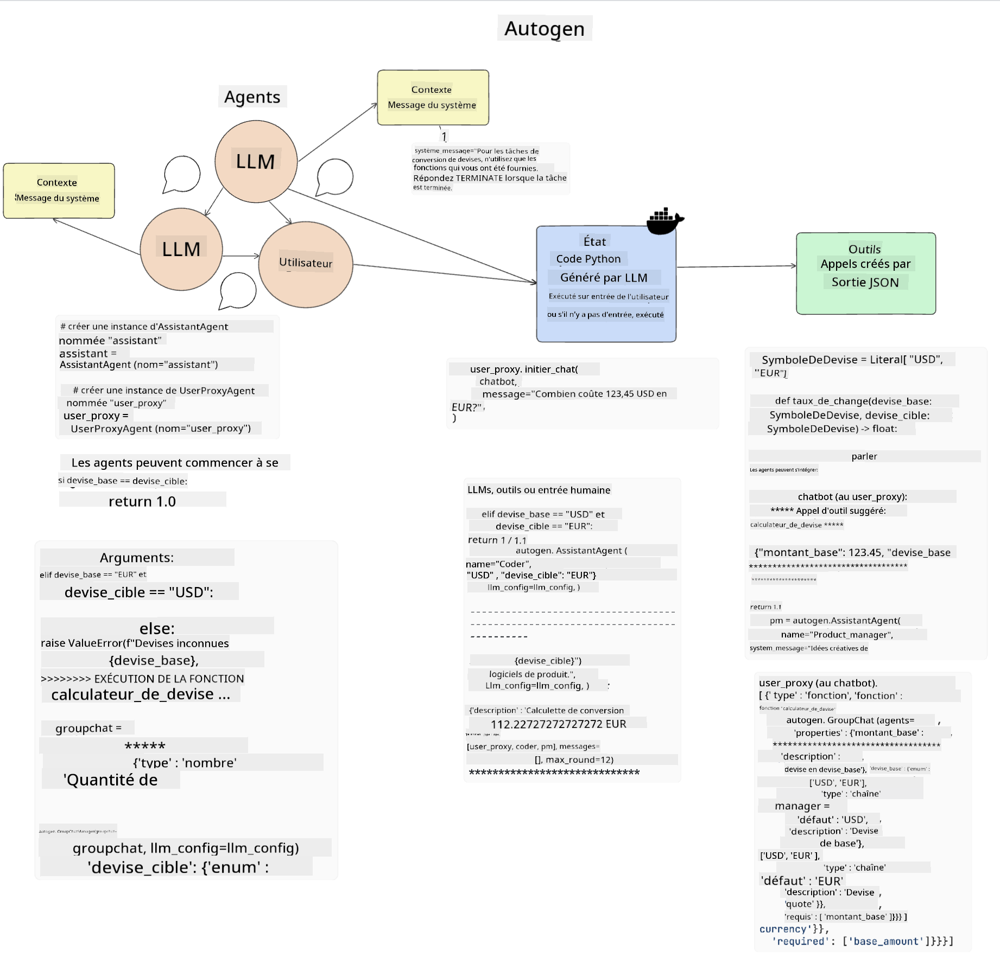
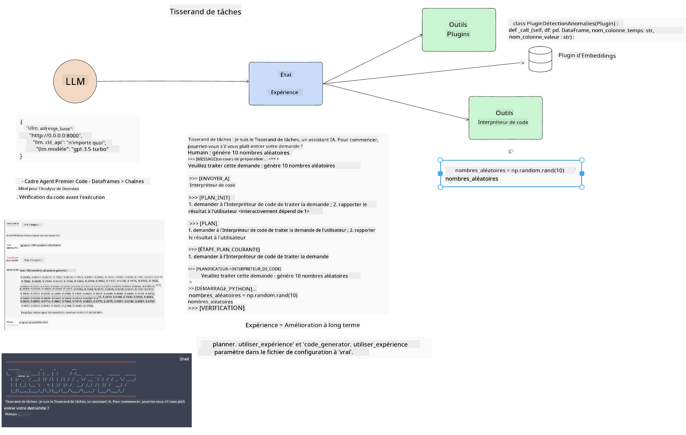

<!--
CO_OP_TRANSLATOR_METADATA:
{
  "original_hash": "11f03c81f190d9cbafd0f977dcbede6c",
  "translation_date": "2025-06-26T00:07:38+00:00",
  "source_file": "17-ai-agents/README.md",
  "language_code": "fr"
}
-->
[](https://aka.ms/gen-ai-lesson17-gh?WT.mc_id=academic-105485-koreyst)

## Introduction

Les agents IA représentent un développement passionnant dans l'IA générative, permettant aux grands modèles de langage (LLMs) d'évoluer d'assistants en agents capables d'agir. Les frameworks d'agents IA permettent aux développeurs de créer des applications qui donnent aux LLMs l'accès à des outils et à la gestion d'état. Ces frameworks améliorent également la visibilité, permettant aux utilisateurs et aux développeurs de surveiller les actions planifiées par les LLMs, améliorant ainsi la gestion de l'expérience.

La leçon couvrira les domaines suivants :

- Comprendre ce qu'est un agent IA - Qu'est-ce qu'un agent IA exactement ?
- Explorer quatre frameworks d'agents IA différents - Qu'est-ce qui les rend uniques ?
- Appliquer ces agents IA à différents cas d'utilisation - Quand devrions-nous utiliser des agents IA ?

## Objectifs d'apprentissage

Après avoir suivi cette leçon, vous serez capable de :

- Expliquer ce que sont les agents IA et comment ils peuvent être utilisés.
- Comprendre les différences entre certains des frameworks d'agents IA populaires et comment ils diffèrent.
- Comprendre comment fonctionnent les agents IA afin de construire des applications avec eux.

## Qu'est-ce que les agents IA ?

Les agents IA sont un domaine très excitant dans le monde de l'IA générative. Avec cette excitation vient parfois une confusion des termes et de leur application. Pour simplifier les choses et inclure la plupart des outils qui se réfèrent aux agents IA, nous allons utiliser cette définition :

Les agents IA permettent aux grands modèles de langage (LLMs) d'effectuer des tâches en leur donnant accès à un **état** et à des **outils**.



Définissons ces termes :

**Grands Modèles de Langage** - Ce sont les modèles mentionnés tout au long de ce cours, tels que GPT-3.5, GPT-4, Llama-2, etc.

**État** - Cela fait référence au contexte dans lequel le LLM travaille. Le LLM utilise le contexte de ses actions passées et le contexte actuel, guidant sa prise de décision pour les actions suivantes. Les frameworks d'agents IA permettent aux développeurs de maintenir ce contexte plus facilement.

**Outils** - Pour accomplir la tâche que l'utilisateur a demandée et que le LLM a planifiée, le LLM a besoin d'accéder à des outils. Quelques exemples d'outils peuvent être une base de données, une API, une application externe ou même un autre LLM !

Ces définitions vous donneront, espérons-le, une bonne base pour l'avenir alors que nous examinons comment elles sont mises en œuvre. Explorons quelques frameworks d'agents IA différents :

## Agents LangChain

[Agents LangChain](https://python.langchain.com/docs/how_to/#agents?WT.mc_id=academic-105485-koreyst) est une implémentation des définitions que nous avons fournies ci-dessus.

Pour gérer l'**état**, il utilise une fonction intégrée appelée le `AgentExecutor`. Cela accepte les `agent` définis et les `tools` qui lui sont disponibles.

Le `Agent Executor` stocke également l'historique des discussions pour fournir le contexte de la discussion.



LangChain offre un [catalogue d'outils](https://integrations.langchain.com/tools?WT.mc_id=academic-105485-koreyst) qui peuvent être importés dans votre application dans laquelle le LLM peut accéder. Ceux-ci sont créés par la communauté et par l'équipe LangChain.

Vous pouvez ensuite définir ces outils et les transmettre au `Agent Executor`.

La visibilité est un autre aspect important lorsqu'on parle des agents IA. Il est important pour les développeurs d'applications de comprendre quel outil le LLM utilise et pourquoi. Pour cela, l'équipe de LangChain a développé LangSmith.

## AutoGen

Le prochain framework d'agent IA dont nous allons discuter est [AutoGen](https://microsoft.github.io/autogen/?WT.mc_id=academic-105485-koreyst). L'objectif principal d'AutoGen est les conversations. Les agents sont à la fois **conversables** et **personnalisables**.

**Conversable -** Les LLMs peuvent démarrer et continuer une conversation avec un autre LLM afin de compléter une tâche. Cela se fait en créant `AssistantAgents` et en leur donnant un message système spécifique.

```python

autogen.AssistantAgent( name="Coder", llm_config=llm_config, ) pm = autogen.AssistantAgent( name="Product_manager", system_message="Creative in software product ideas.", llm_config=llm_config, )

```

**Personnalisable** - Les agents peuvent être définis non seulement comme des LLMs mais aussi comme un utilisateur ou un outil. En tant que développeur, vous pouvez définir un `UserProxyAgent` qui est responsable d'interagir avec l'utilisateur pour obtenir des retours dans l'accomplissement d'une tâche. Ce retour peut soit continuer l'exécution de la tâche, soit l'arrêter.

```python
user_proxy = UserProxyAgent(name="user_proxy")
```

### État et Outils

Pour changer et gérer l'état, un agent assistant génère du code Python pour accomplir la tâche.

Voici un exemple du processus :



#### LLM Défini avec un Message Système

```python
system_message="For weather related tasks, only use the functions you have been provided with. Reply TERMINATE when the task is done."
```

Ce message système dirige ce LLM spécifique vers les fonctions pertinentes pour sa tâche. Rappelez-vous, avec AutoGen, vous pouvez avoir plusieurs AssistantAgents définis avec différents messages système.

#### Discussion Initiée par l'Utilisateur

```python
user_proxy.initiate_chat( chatbot, message="I am planning a trip to NYC next week, can you help me pick out what to wear? ", )

```

Ce message de l'user_proxy (Humain) est ce qui va lancer le processus de l'Agent pour explorer les fonctions possibles qu'il devrait exécuter.

#### Fonction Exécutée

```bash
chatbot (to user_proxy):

***** Suggested tool Call: get_weather ***** Arguments: {"location":"New York City, NY","time_periond:"7","temperature_unit":"Celsius"} ******************************************************** --------------------------------------------------------------------------------

>>>>>>>> EXECUTING FUNCTION get_weather... user_proxy (to chatbot): ***** Response from calling function "get_weather" ***** 112.22727272727272 EUR ****************************************************************

```

Une fois la discussion initiale traitée, l'Agent enverra l'outil suggéré à appeler. Dans ce cas, il s'agit d'une fonction appelée `get_weather`. Depending on your configuration, this function can be automatically executed and read by the Agent or can be executed based on user input.

You can find a list of [AutoGen code samples](https://microsoft.github.io/autogen/docs/Examples/?WT.mc_id=academic-105485-koreyst) to further explore how to get started building.

## Taskweaver

The next agent framework we will explore is [Taskweaver](https://microsoft.github.io/TaskWeaver/?WT.mc_id=academic-105485-koreyst). It is known as a "code-first" agent because instead of working strictly with `strings` , it can work with DataFrames in Python. This becomes extremely useful for data analysis and generation tasks. This can be things like creating graphs and charts or generating random numbers.

### State and Tools

To manage the state of the conversation, TaskWeaver uses the concept of a `Planner`. The `Planner` is a LLM that takes the request from the users and maps out the tasks that need to be completed to fulfill this request.

To complete the tasks the `Planner` is exposed to the collection of tools called `Plugins`. Cela peut être des classes Python ou un interprète de code général. Ces plugins sont stockés sous forme d'embeddings pour que le LLM puisse mieux rechercher le plugin correct.



Voici un exemple de plugin pour gérer la détection d'anomalies :

```python
class AnomalyDetectionPlugin(Plugin): def __call__(self, df: pd.DataFrame, time_col_name: str, value_col_name: str):
```

Le code est vérifié avant l'exécution. Une autre fonctionnalité pour gérer le contexte dans Taskweaver est `experience`. Experience allows for the context of a conversation to be stored over to the long term in a YAML file. This can be configured so that the LLM improves over time on certain tasks given that it is exposed to prior conversations.

## JARVIS

The last agent framework we will explore is [JARVIS](https://github.com/microsoft/JARVIS?tab=readme-ov-file?WT.mc_id=academic-105485-koreyst). What makes JARVIS unique is that it uses an LLM to manage the `state` de la conversation et les `tools`sont d'autres modèles IA. Chacun des modèles IA est un modèle spécialisé qui effectue certaines tâches comme la détection d'objets, la transcription ou la légende d'images.


Le LLM, étant un modèle à usage général, reçoit la demande de l'utilisateur et identifie la tâche spécifique et tous les arguments/données nécessaires pour accomplir la tâche.

```python
[{"task": "object-detection", "id": 0, "dep": [-1], "args": {"image": "e1.jpg" }}]
```

Le LLM formate ensuite la demande d'une manière que le modèle IA spécialisé peut interpréter, comme le JSON. Une fois que le modèle IA a renvoyé sa prédiction basée sur la tâche, le LLM reçoit la réponse.

Si plusieurs modèles sont nécessaires pour accomplir la tâche, il interprétera également la réponse de ces modèles avant de les rassembler pour générer la réponse à l'utilisateur.

L'exemple ci-dessous montre comment cela fonctionnerait lorsqu'un utilisateur demande une description et un décompte des objets dans une image :

## Devoir

Pour continuer votre apprentissage des agents IA, vous pouvez construire avec AutoGen :

- Une application qui simule une réunion d'affaires avec différents départements d'une startup éducative.
- Créer des messages système qui guident les LLMs dans la compréhension de différentes personnalités et priorités, et permettre à l'utilisateur de présenter une nouvelle idée de produit.
- Le LLM devrait ensuite générer des questions de suivi de chaque département pour affiner et améliorer le pitch et l'idée de produit.

## L'apprentissage ne s'arrête pas ici, continuez le voyage

Après avoir terminé cette leçon, consultez notre [collection d'apprentissage IA générative](https://aka.ms/genai-collection?WT.mc_id=academic-105485-koreyst) pour continuer à perfectionner vos connaissances en IA générative !

**Avertissement** :  
Ce document a été traduit à l'aide du service de traduction IA [Co-op Translator](https://github.com/Azure/co-op-translator). Bien que nous nous efforcions d'assurer l'exactitude, veuillez noter que les traductions automatisées peuvent contenir des erreurs ou des inexactitudes. Le document original dans sa langue d'origine doit être considéré comme la source faisant autorité. Pour des informations critiques, une traduction humaine professionnelle est recommandée. Nous ne sommes pas responsables des malentendus ou des interprétations erronées résultant de l'utilisation de cette traduction.