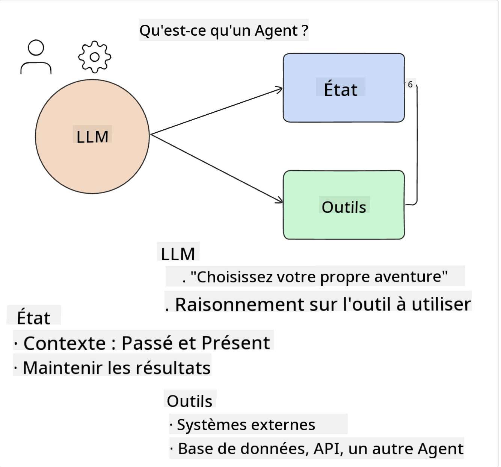

<!--
CO_OP_TRANSLATOR_METADATA:
{
  "original_hash": "8e8d1f6a63da606af7176a87ff8e92b6",
  "translation_date": "2025-10-17T22:44:20+00:00",
  "source_file": "17-ai-agents/README.md",
  "language_code": "fr"
}
-->
[](https://youtu.be/yAXVW-lUINc?si=bOtW9nL6jc3XJgOM)

## Introduction

Les agents IA représentent une avancée passionnante dans le domaine de l'IA générative, permettant aux modèles de langage étendus (LLMs) d'évoluer d'assistants à des agents capables de prendre des actions. Les frameworks d'agents IA permettent aux développeurs de créer des applications qui donnent aux LLMs accès à des outils et à la gestion d'état. Ces frameworks améliorent également la visibilité, permettant aux utilisateurs et aux développeurs de surveiller les actions planifiées par les LLMs, améliorant ainsi la gestion de l'expérience.

Cette leçon couvrira les domaines suivants :

- Comprendre ce qu'est un agent IA - Qu'est-ce qu'un agent IA exactement ?
- Explorer quatre différents frameworks d'agents IA - Qu'est-ce qui les rend uniques ?
- Appliquer ces agents IA à différents cas d'utilisation - Quand utiliser les agents IA ?

## Objectifs d'apprentissage

Après avoir suivi cette leçon, vous serez capable de :

- Expliquer ce que sont les agents IA et comment ils peuvent être utilisés.
- Comprendre les différences entre certains des frameworks d'agents IA populaires et ce qui les distingue.
- Comprendre comment fonctionnent les agents IA afin de créer des applications avec eux.

## Qu'est-ce qu'un agent IA ?

Les agents IA sont un domaine très excitant dans le monde de l'IA générative. Avec cet enthousiasme vient parfois une confusion autour des termes et de leur application. Pour simplifier les choses et inclure la plupart des outils qui se réfèrent aux agents IA, nous allons utiliser cette définition :

Les agents IA permettent aux modèles de langage étendus (LLMs) d'exécuter des tâches en leur donnant accès à un **état** et à des **outils**.



Définissons ces termes :

**Modèles de langage étendus** - Ce sont les modèles mentionnés tout au long de ce cours, tels que GPT-3.5, GPT-4, Llama-2, etc.

**État** - Cela fait référence au contexte dans lequel le LLM travaille. Le LLM utilise le contexte de ses actions passées et le contexte actuel pour guider sa prise de décision pour les actions suivantes. Les frameworks d'agents IA permettent aux développeurs de maintenir ce contexte plus facilement.

**Outils** - Pour accomplir la tâche demandée par l'utilisateur et planifiée par le LLM, ce dernier a besoin d'accéder à des outils. Quelques exemples d'outils peuvent être une base de données, une API, une application externe ou même un autre LLM !

Ces définitions devraient vous donner une bonne base pour aller de l'avant alors que nous examinons comment ils sont mis en œuvre. Explorons quelques différents frameworks d'agents IA :

## Agents LangChain

[LangChain Agents](https://python.langchain.com/docs/how_to/#agents?WT.mc_id=academic-105485-koreyst) est une implémentation des définitions que nous avons fournies ci-dessus.

Pour gérer l'**état**, il utilise une fonction intégrée appelée `AgentExecutor`. Celle-ci accepte l'`agent` défini et les `outils` qui lui sont disponibles.

Le `AgentExecutor` stocke également l'historique des conversations pour fournir le contexte de la discussion.


LangChain propose un [catalogue d'outils](https://integrations.langchain.com/tools?WT.mc_id=academic-105485-koreyst) qui peuvent être importés dans votre application, permettant ainsi au LLM d'y accéder. Ces outils sont créés par la communauté et par l'équipe de LangChain.

Vous pouvez ensuite définir ces outils et les transmettre au `AgentExecutor`.

La visibilité est un autre aspect important lorsqu'il s'agit des agents IA. Il est essentiel pour les développeurs d'applications de comprendre quel outil le LLM utilise et pourquoi. Pour cela, l'équipe de LangChain a développé LangSmith.

## AutoGen

Le prochain framework d'agent IA que nous allons aborder est [AutoGen](https://microsoft.github.io/autogen/?WT.mc_id=academic-105485-koreyst). L'objectif principal d'AutoGen est les conversations. Les agents sont à la fois **conversationnels** et **personnalisables**.

**Conversationnels -** Les LLMs peuvent initier et poursuivre une conversation avec un autre LLM afin de réaliser une tâche. Cela se fait en créant des `AssistantAgents` et en leur attribuant un message système spécifique.

```python

autogen.AssistantAgent( name="Coder", llm_config=llm_config, ) pm = autogen.AssistantAgent( name="Product_manager", system_message="Creative in software product ideas.", llm_config=llm_config, )

```

**Personnalisables** - Les agents peuvent être définis non seulement comme des LLMs, mais aussi comme un utilisateur ou un outil. En tant que développeur, vous pouvez définir un `UserProxyAgent` qui est chargé d'interagir avec l'utilisateur pour obtenir des retours dans l'exécution d'une tâche. Ces retours peuvent soit poursuivre l'exécution de la tâche, soit l'arrêter.

```python
user_proxy = UserProxyAgent(name="user_proxy")
```

### État et outils

Pour modifier et gérer l'état, un agent assistant génère du code Python pour accomplir la tâche.

Voici un exemple du processus :


#### LLM défini avec un message système

```python
system_message="For weather related tasks, only use the functions you have been provided with. Reply TERMINATE when the task is done."
```

Ce message système indique à ce LLM spécifique quelles fonctions sont pertinentes pour sa tâche. Rappelez-vous, avec AutoGen, vous pouvez avoir plusieurs AssistantAgents définis avec différents messages système.

#### La discussion est initiée par l'utilisateur

```python
user_proxy.initiate_chat( chatbot, message="I am planning a trip to NYC next week, can you help me pick out what to wear? ", )

```

Ce message du user_proxy (Humain) est ce qui va démarrer le processus de l'agent pour explorer les fonctions possibles qu'il devrait exécuter.

#### La fonction est exécutée

```bash
chatbot (to user_proxy):

***** Suggested tool Call: get_weather ***** Arguments: {"location":"New York City, NY","time_periond:"7","temperature_unit":"Celsius"} ******************************************************** --------------------------------------------------------------------------------

>>>>>>>> EXECUTING FUNCTION get_weather... user_proxy (to chatbot): ***** Response from calling function "get_weather" ***** 112.22727272727272 EUR ****************************************************************

```

Une fois la discussion initiale traitée, l'agent proposera l'outil à appeler. Dans ce cas, il s'agit d'une fonction appelée `get_weather`. Selon votre configuration, cette fonction peut être exécutée automatiquement et lue par l'agent ou exécutée en fonction de l'entrée de l'utilisateur.

Vous pouvez trouver une liste d'[exemples de code AutoGen](https://microsoft.github.io/autogen/docs/Examples/?WT.mc_id=academic-105485-koreyst) pour explorer davantage comment commencer à construire.

## Taskweaver

Le prochain framework d'agent que nous allons explorer est [Taskweaver](https://microsoft.github.io/TaskWeaver/?WT.mc_id=academic-105485-koreyst). Il est connu comme un agent "orienté code" car au lieu de travailler strictement avec des `chaînes de caractères`, il peut travailler avec des DataFrames en Python. Cela devient extrêmement utile pour les tâches d'analyse et de génération de données. Cela peut inclure la création de graphiques et de tableaux ou la génération de nombres aléatoires.

### État et outils

Pour gérer l'état de la conversation, Taskweaver utilise le concept de `Planner`. Le `Planner` est un LLM qui prend la demande des utilisateurs et cartographie les tâches nécessaires pour répondre à cette demande.

Pour accomplir les tâches, le `Planner` est exposé à une collection d'outils appelés `Plugins`. Cela peut être des classes Python ou un interpréteur de code général. Ces plugins sont stockés sous forme d'embeddings afin que le LLM puisse mieux rechercher le plugin approprié.


Voici un exemple de plugin pour gérer la détection d'anomalies :

```python
class AnomalyDetectionPlugin(Plugin): def __call__(self, df: pd.DataFrame, time_col_name: str, value_col_name: str):
```

Le code est vérifié avant d'être exécuté. Une autre fonctionnalité pour gérer le contexte dans Taskweaver est l'`expérience`. L'expérience permet de conserver le contexte d'une conversation sur le long terme dans un fichier YAML. Cela peut être configuré pour que le LLM s'améliore au fil du temps sur certaines tâches étant donné qu'il est exposé à des conversations antérieures.

## JARVIS

Le dernier framework d'agent que nous allons explorer est [JARVIS](https://github.com/microsoft/JARVIS?tab=readme-ov-file?WT.mc_id=academic-105485-koreyst). Ce qui rend JARVIS unique, c'est qu'il utilise un LLM pour gérer l'`état` de la conversation et les `outils` sont d'autres modèles d'IA. Chacun des modèles d'IA est spécialisé dans des tâches spécifiques telles que la détection d'objets, la transcription ou la description d'images.


Le LLM, étant un modèle à usage général, reçoit la demande de l'utilisateur et identifie la tâche spécifique ainsi que les arguments/données nécessaires pour accomplir cette tâche.

```python
[{"task": "object-detection", "id": 0, "dep": [-1], "args": {"image": "e1.jpg" }}]
```

Le LLM formate ensuite la demande de manière à ce que le modèle d'IA spécialisé puisse l'interpréter, comme en JSON. Une fois que le modèle d'IA a retourné sa prédiction basée sur la tâche, le LLM reçoit la réponse.

Si plusieurs modèles sont nécessaires pour accomplir la tâche, il interprétera également les réponses de ces modèles avant de les combiner pour générer la réponse à l'utilisateur.

L'exemple ci-dessous montre comment cela fonctionnerait lorsqu'un utilisateur demande une description et un décompte des objets dans une image :

## Exercice

Pour continuer votre apprentissage des agents IA, vous pouvez créer avec AutoGen :

- Une application qui simule une réunion d'affaires avec différents départements d'une startup éducative.
- Créez des messages système qui guident les LLMs dans la compréhension des différents rôles et priorités, et permettent à l'utilisateur de présenter une nouvelle idée de produit.
- Le LLM devrait ensuite générer des questions de suivi de chaque département pour affiner et améliorer l'idée de produit.

## L'apprentissage ne s'arrête pas ici, continuez votre parcours

Après avoir terminé cette leçon, consultez notre [collection d'apprentissage sur l'IA générative](https://aka.ms/genai-collection?WT.mc_id=academic-105485-koreyst) pour continuer à approfondir vos connaissances sur l'IA générative !

---

**Avertissement** :  
Ce document a été traduit à l'aide du service de traduction automatique [Co-op Translator](https://github.com/Azure/co-op-translator). Bien que nous nous efforcions d'assurer l'exactitude, veuillez noter que les traductions automatisées peuvent contenir des erreurs ou des inexactitudes. Le document original dans sa langue d'origine doit être considéré comme la source faisant autorité. Pour des informations critiques, il est recommandé de recourir à une traduction humaine professionnelle. Nous ne sommes pas responsables des malentendus ou des interprétations erronées résultant de l'utilisation de cette traduction.