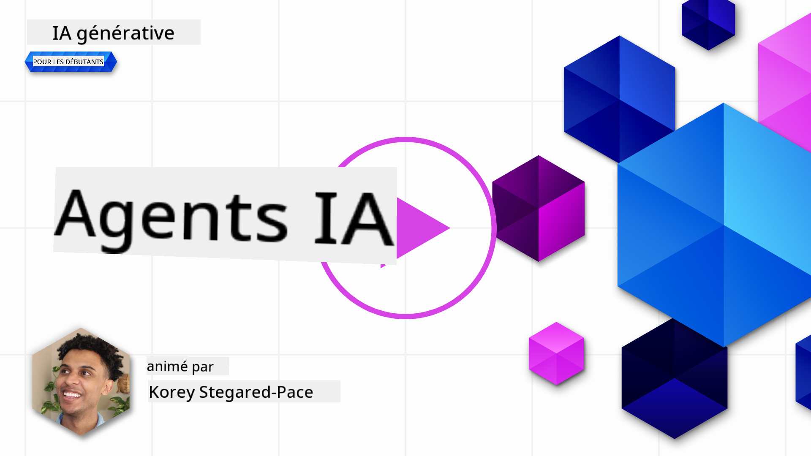
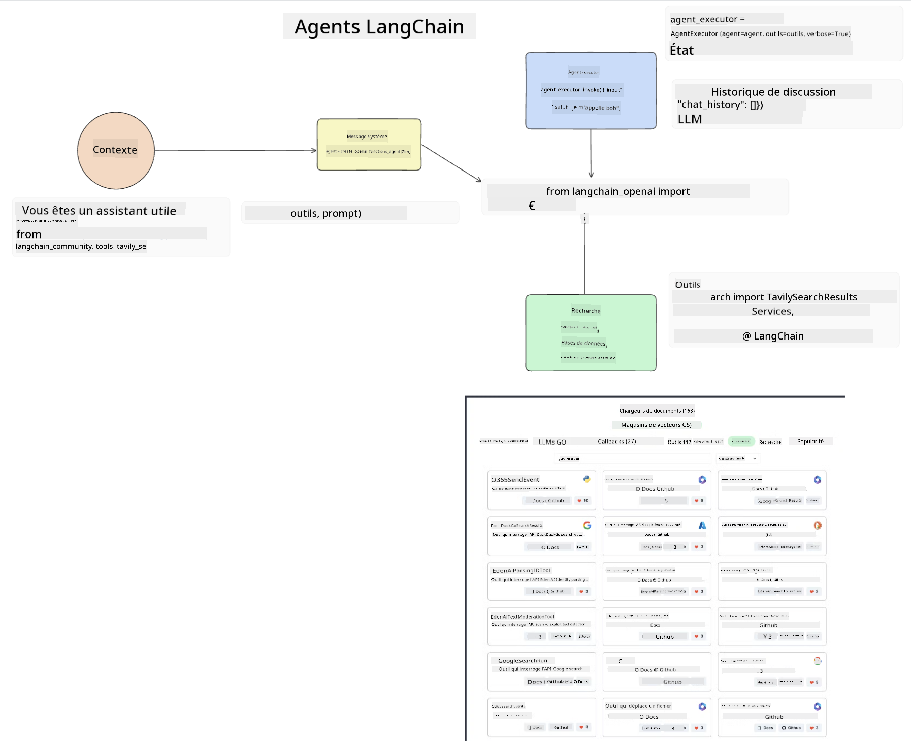
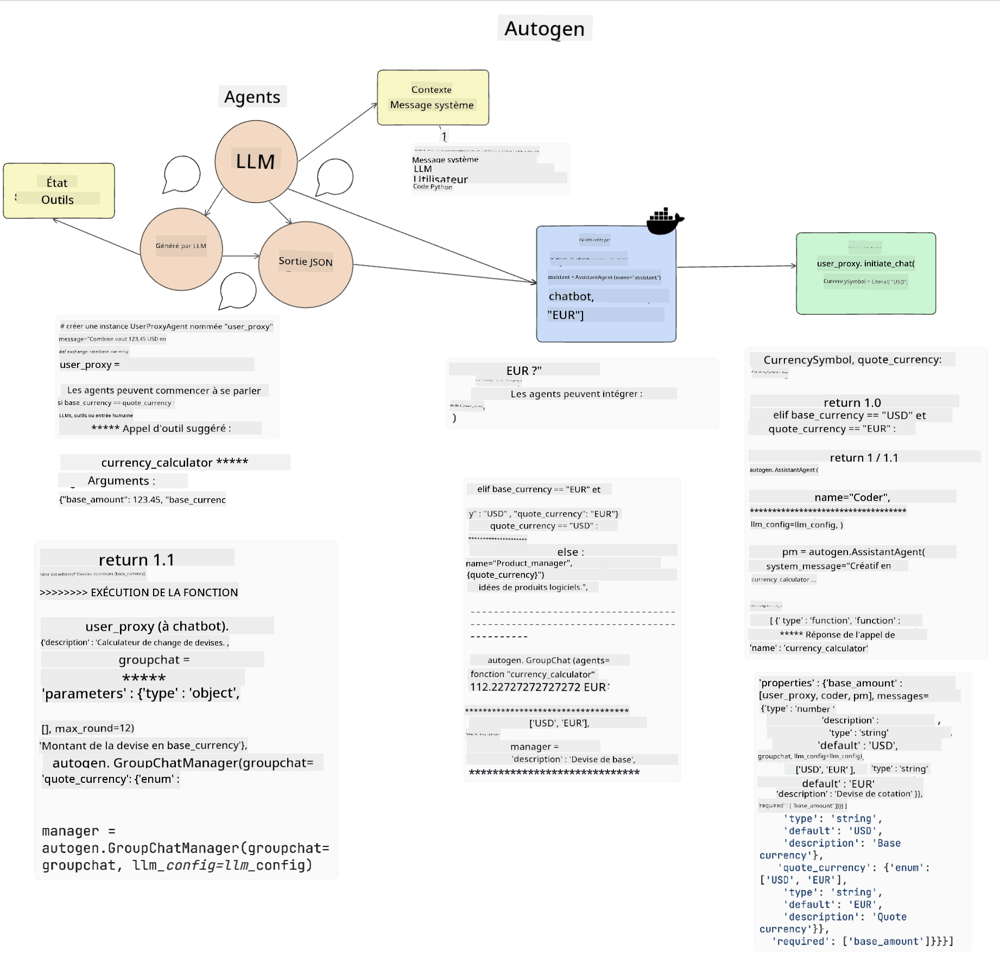
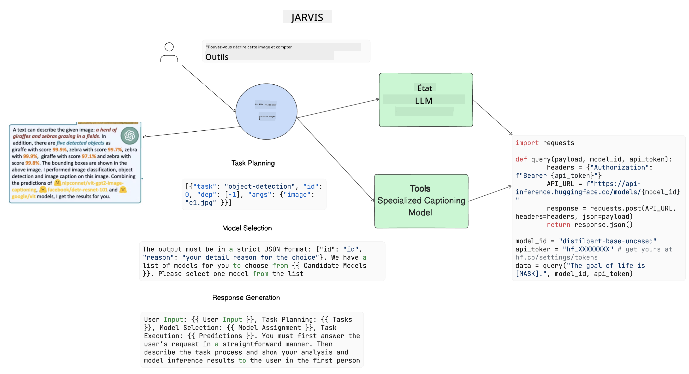

<!--
CO_OP_TRANSLATOR_METADATA:
{
  "original_hash": "11f03c81f190d9cbafd0f977dcbede6c",
  "translation_date": "2025-07-09T17:17:32+00:00",
  "source_file": "17-ai-agents/README.md",
  "language_code": "fr"
}
-->
[](https://aka.ms/gen-ai-lesson17-gh?WT.mc_id=academic-105485-koreyst)

## Introduction

Les agents IA représentent une avancée passionnante dans le domaine de l’IA générative, permettant aux grands modèles de langage (LLMs) d’évoluer d’assistants vers des agents capables d’agir. Les frameworks d’agents IA permettent aux développeurs de créer des applications donnant aux LLMs accès à des outils et à la gestion d’état. Ces frameworks améliorent également la visibilité, permettant aux utilisateurs et aux développeurs de suivre les actions planifiées par les LLMs, améliorant ainsi la gestion de l’expérience.

Cette leçon couvrira les points suivants :

- Comprendre ce qu’est un agent IA – Qu’est-ce qu’un agent IA exactement ?
- Explorer quatre frameworks différents d’agents IA – Qu’est-ce qui les rend uniques ?
- Appliquer ces agents IA à différents cas d’usage – Quand doit-on utiliser des agents IA ?

## Objectifs d’apprentissage

Après avoir suivi cette leçon, vous serez capable de :

- Expliquer ce que sont les agents IA et comment les utiliser.
- Comprendre les différences entre certains des frameworks d’agents IA populaires, et en quoi ils diffèrent.
- Comprendre le fonctionnement des agents IA afin de construire des applications avec eux.

## Qu’est-ce qu’un agent IA ?

Les agents IA représentent un domaine très prometteur dans le monde de l’IA générative. Avec cet engouement vient parfois une confusion autour des termes et de leur application. Pour simplifier et inclure la plupart des outils qui parlent d’agents IA, nous utiliserons cette définition :

Les agents IA permettent aux grands modèles de langage (LLMs) d’exécuter des tâches en leur donnant accès à un **état** et à des **outils**.


Définissons ces termes :

**Grands modèles de langage** – Ce sont les modèles mentionnés tout au long de ce cours, tels que GPT-3.5, GPT-4, Llama-2, etc.

**État** – Cela fait référence au contexte dans lequel le LLM travaille. Le LLM utilise le contexte de ses actions passées et le contexte actuel pour guider sa prise de décision pour les actions suivantes. Les frameworks d’agents IA facilitent la gestion de ce contexte pour les développeurs.

**Outils** – Pour accomplir la tâche demandée par l’utilisateur et planifiée par le LLM, ce dernier doit avoir accès à des outils. Par exemple, une base de données, une API, une application externe ou même un autre LLM !

Ces définitions vous donneront une bonne base pour la suite, lorsque nous verrons comment ils sont mis en œuvre. Explorons quelques frameworks d’agents IA différents :

## LangChain Agents

[LangChain Agents](https://python.langchain.com/docs/how_to/#agents?WT.mc_id=academic-105485-koreyst) est une implémentation des définitions que nous avons données ci-dessus.

Pour gérer l’**état**, il utilise une fonction intégrée appelée `AgentExecutor`. Celle-ci accepte l’`agent` défini ainsi que les `tools` disponibles.

L’`AgentExecutor` stocke également l’historique des échanges pour fournir le contexte de la conversation.



LangChain propose un [catalogue d’outils](https://integrations.langchain.com/tools?WT.mc_id=academic-105485-koreyst) pouvant être importés dans votre application et auxquels le LLM peut accéder. Ces outils sont créés par la communauté et par l’équipe LangChain.

Vous pouvez ensuite définir ces outils et les passer à l’`AgentExecutor`.

La visibilité est un autre aspect important lorsqu’on parle d’agents IA. Il est essentiel pour les développeurs d’applications de comprendre quel outil le LLM utilise et pourquoi. Pour cela, l’équipe LangChain a développé LangSmith.

## AutoGen

Le prochain framework d’agents IA que nous allons aborder est [AutoGen](https://microsoft.github.io/autogen/?WT.mc_id=academic-105485-koreyst). L’objectif principal d’AutoGen est la gestion des conversations. Les agents sont à la fois **conversables** et **personnalisables**.

**Conversable –** Les LLMs peuvent initier et poursuivre une conversation avec un autre LLM afin d’accomplir une tâche. Cela se fait en créant des `AssistantAgents` et en leur donnant un message système spécifique.

```python

autogen.AssistantAgent( name="Coder", llm_config=llm_config, ) pm = autogen.AssistantAgent( name="Product_manager", system_message="Creative in software product ideas.", llm_config=llm_config, )

```

**Personnalisable** – Les agents peuvent être définis non seulement comme des LLMs, mais aussi comme un utilisateur ou un outil. En tant que développeur, vous pouvez définir un `UserProxyAgent` qui est responsable d’interagir avec l’utilisateur pour obtenir des retours dans l’accomplissement d’une tâche. Ces retours peuvent soit poursuivre l’exécution de la tâche, soit l’arrêter.

```python
user_proxy = UserProxyAgent(name="user_proxy")
```

### État et outils

Pour modifier et gérer l’état, un agent assistant génère du code Python pour accomplir la tâche.

Voici un exemple du processus :



#### LLM défini avec un message système

```python
system_message="For weather related tasks, only use the functions you have been provided with. Reply TERMINATE when the task is done."
```

Ce message système indique à ce LLM spécifique quelles fonctions sont pertinentes pour sa tâche. Rappelez-vous, avec AutoGen, vous pouvez avoir plusieurs AssistantAgents définis avec différents messages système.

#### La conversation est initiée par l’utilisateur

```python
user_proxy.initiate_chat( chatbot, message="I am planning a trip to NYC next week, can you help me pick out what to wear? ", )

```

Ce message de user_proxy (humain) est ce qui va lancer le processus de l’agent pour explorer les fonctions possibles qu’il doit exécuter.

#### La fonction est exécutée

```bash
chatbot (to user_proxy):

***** Suggested tool Call: get_weather ***** Arguments: {"location":"New York City, NY","time_periond:"7","temperature_unit":"Celsius"} ******************************************************** --------------------------------------------------------------------------------

>>>>>>>> EXECUTING FUNCTION get_weather... user_proxy (to chatbot): ***** Response from calling function "get_weather" ***** 112.22727272727272 EUR ****************************************************************

```

Une fois la conversation initiale traitée, l’agent envoie l’outil suggéré à appeler. Dans ce cas, il s’agit d’une fonction appelée `get_weather`. Selon votre configuration, cette fonction peut être exécutée automatiquement et lue par l’agent, ou exécutée en fonction de l’entrée utilisateur.

Vous pouvez trouver une liste d’[exemples de code AutoGen](https://microsoft.github.io/autogen/docs/Examples/?WT.mc_id=academic-105485-koreyst) pour explorer davantage comment commencer à construire.

## Taskweaver

Le prochain framework d’agents que nous allons explorer est [Taskweaver](https://microsoft.github.io/TaskWeaver/?WT.mc_id=academic-105485-koreyst). Il est connu comme un agent « code-first » car au lieu de travailler strictement avec des `strings`, il peut travailler avec des DataFrames en Python. Cela devient extrêmement utile pour les tâches d’analyse et de génération de données, comme la création de graphiques ou la génération de nombres aléatoires.

### État et outils

Pour gérer l’état de la conversation, TaskWeaver utilise le concept de `Planner`. Le `Planner` est un LLM qui prend la demande des utilisateurs et planifie les tâches à accomplir pour répondre à cette demande.

Pour réaliser ces tâches, le `Planner` a accès à une collection d’outils appelés `Plugins`. Il peut s’agir de classes Python ou d’un interpréteur de code général. Ces plugins sont stockés sous forme d’embeddings afin que le LLM puisse mieux rechercher le plugin approprié.


Voici un exemple de plugin pour gérer la détection d’anomalies :

```python
class AnomalyDetectionPlugin(Plugin): def __call__(self, df: pd.DataFrame, time_col_name: str, value_col_name: str):
```

Le code est vérifié avant exécution. Une autre fonctionnalité pour gérer le contexte dans Taskweaver est l’`experience`. L’expérience permet de stocker le contexte d’une conversation sur le long terme dans un fichier YAML. Cela peut être configuré pour que le LLM s’améliore avec le temps sur certaines tâches, à condition d’être exposé aux conversations précédentes.

## JARVIS

Le dernier framework d’agents que nous allons explorer est [JARVIS](https://github.com/microsoft/JARVIS?tab=readme-ov-file?WT.mc_id=academic-105485-koreyst). Ce qui rend JARVIS unique, c’est qu’il utilise un LLM pour gérer l’`état` de la conversation, tandis que les `tools` sont d’autres modèles d’IA. Chacun de ces modèles spécialisés réalise des tâches spécifiques comme la détection d’objets, la transcription ou la description d’images.



Le LLM, en tant que modèle polyvalent, reçoit la demande de l’utilisateur et identifie la tâche spécifique ainsi que les arguments/données nécessaires pour l’accomplir.

```python
[{"task": "object-detection", "id": 0, "dep": [-1], "args": {"image": "e1.jpg" }}]
```

Le LLM formate ensuite la requête d’une manière que le modèle spécialisé peut interpréter, comme du JSON. Une fois que le modèle IA a retourné sa prédiction basée sur la tâche, le LLM reçoit la réponse.

Si plusieurs modèles sont nécessaires pour accomplir la tâche, il interprétera également les réponses de ces modèles avant de les combiner pour générer la réponse à l’utilisateur.

L’exemple ci-dessous montre comment cela fonctionne lorsqu’un utilisateur demande une description et un décompte des objets présents sur une image :

## Exercice

Pour poursuivre votre apprentissage des agents IA, vous pouvez construire avec AutoGen :

- Une application qui simule une réunion d’affaires avec différents départements d’une startup éducative.
- Créer des messages système qui guident les LLMs dans la compréhension de différentes personas et priorités, et permettre à l’utilisateur de présenter une nouvelle idée de produit.
- Le LLM doit ensuite générer des questions de suivi de chaque département pour affiner et améliorer la présentation et l’idée de produit.

## L’apprentissage ne s’arrête pas ici, continuez votre parcours

Après avoir terminé cette leçon, consultez notre [collection d’apprentissage sur l’IA générative](https://aka.ms/genai-collection?WT.mc_id=academic-105485-koreyst) pour continuer à approfondir vos connaissances en IA générative !

**Avertissement** :  
Ce document a été traduit à l’aide du service de traduction automatique [Co-op Translator](https://github.com/Azure/co-op-translator). Bien que nous nous efforcions d’assurer l’exactitude, veuillez noter que les traductions automatiques peuvent contenir des erreurs ou des inexactitudes. Le document original dans sa langue d’origine doit être considéré comme la source faisant foi. Pour les informations critiques, une traduction professionnelle réalisée par un humain est recommandée. Nous déclinons toute responsabilité en cas de malentendus ou de mauvaises interprétations résultant de l’utilisation de cette traduction.