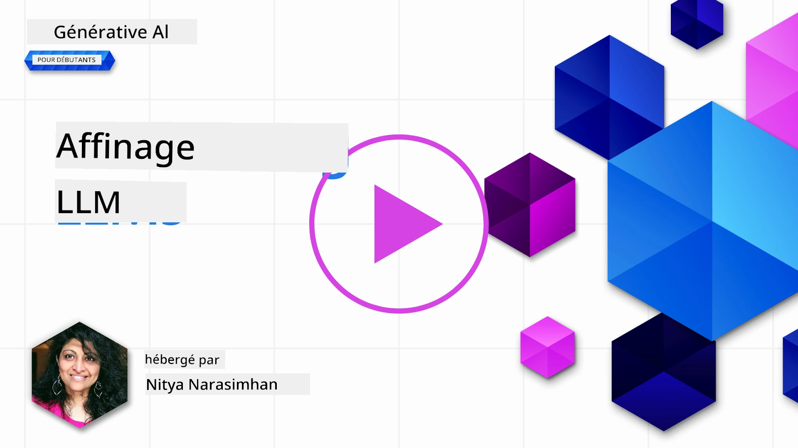
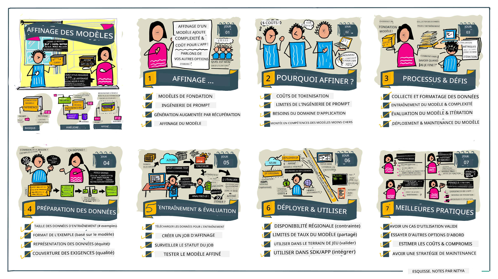

# Affiner Votre LLM

Utiliser de grands modèles de langage pour construire des applications d'IA générative implique de nouveaux défis. Un enjeu clé est garantir la qualité des réponses (précision et pertinence) dans le contenu généré par le modèle pour une requête utilisateur donnée. Dans les leçons précédentes, nous avons discuté des techniques comme l'ingénierie des invites et la génération augmentée par récupération qui tentent de résoudre le problème en _modifiant l'entrée de l'invite_ au modèle existant.

Dans la leçon d'aujourd'hui, nous abordons une troisième technique, **l'affinage**, qui tente de relever le défi en _réentraînant le modèle lui-même_ avec des données supplémentaires. Entrons dans les détails.

## Objectifs d'apprentissage

Cette leçon introduit le concept d'affinage pour les modèles de langage pré-entraînés, explore les avantages et les défis de cette approche, et fournit des conseils sur quand et comment utiliser l'affinage pour améliorer les performances de vos modèles d'IA générative.

À la fin de cette leçon, vous devriez être capable de répondre aux questions suivantes :

- Qu'est-ce que l'affinage des modèles de langage ?
- Quand et pourquoi l'affinage est-il utile ?
- Comment puis-je affiner un modèle pré-entraîné ?
- Quelles sont les limites de l'affinage ?

Prêt ? Commençons.

## Guide Illustré

Vous souhaitez avoir une vue d'ensemble de ce que nous allons couvrir avant de plonger ? Consultez ce guide illustré qui décrit le parcours d'apprentissage pour cette leçon - de l'apprentissage des concepts clés et de la motivation pour l'affinage, à la compréhension du processus et des meilleures pratiques pour exécuter la tâche d'affinage. C'est un sujet fascinant à explorer, n'oubliez pas de consulter la page [Ressources](./RESOURCES.md?WT.mc_id=academic-105485-koreyst) pour des liens supplémentaires afin de soutenir votre parcours d'apprentissage autonome !

## Qu'est-ce que l'affinage des modèles de langage ?

Par définition, les grands modèles de langage sont _pré-entraînés_ sur de grandes quantités de texte provenant de sources diverses, y compris Internet. Comme nous l'avons appris dans les leçons précédentes, nous avons besoin de techniques comme l'_ingénierie des invites_ et la _génération augmentée par récupération_ pour améliorer la qualité des réponses du modèle aux questions de l'utilisateur ("invites").

Une technique populaire d'ingénierie des invites consiste à fournir au modèle plus d'orientations sur ce qui est attendu dans la réponse, soit en donnant des _instructions_ (orientation explicite) soit en _fournissant quelques exemples_ (orientation implicite). Cela s'appelle l'_apprentissage par quelques exemples_ mais cela a deux limites :

- Les limites de tokens du modèle peuvent restreindre le nombre d'exemples que vous pouvez donner, et limiter l'efficacité.
- Le coût en tokens du modèle peut rendre onéreux l'ajout d'exemples à chaque invite, et limiter la flexibilité.

L'affinage est une pratique courante dans les systèmes d'apprentissage automatique où l'on prend un modèle pré-entraîné et on le réentraîne avec de nouvelles données pour améliorer ses performances sur une tâche spécifique. Dans le contexte des modèles de langage, on peut affiner le modèle pré-entraîné _avec un ensemble sélectionné d'exemples pour une tâche ou un domaine d'application donné_ pour créer un **modèle personnalisé** qui peut être plus précis et pertinent pour cette tâche ou ce domaine spécifique. Un avantage secondaire de l'affinage est qu'il peut également réduire le nombre d'exemples nécessaires pour l'apprentissage par quelques exemples - réduisant ainsi l'utilisation des tokens et les coûts associés.

## Quand et pourquoi devrions-nous affiner les modèles ?

Dans _ce_ contexte, lorsque nous parlons d'affinage, nous faisons référence à un affinage **supervisé** où le réentraînement est effectué en **ajoutant de nouvelles données** qui ne faisaient pas partie du jeu de données d'entraînement original. Cela diffère d'une approche d'affinage non supervisée où le modèle est réentraîné sur les données originales, mais avec des hyperparamètres différents.

L'essentiel à retenir est que l'affinage est une technique avancée qui nécessite un certain niveau d'expertise pour obtenir les résultats souhaités. S'il est mal effectué, il peut ne pas apporter les améliorations attendues, voire dégrader les performances du modèle pour votre domaine ciblé.

Donc, avant d'apprendre "comment" affiner les modèles de langage, vous devez savoir "pourquoi" vous devriez emprunter cette voie, et "quand" commencer le processus d'affinage. Commencez par vous poser ces questions :

- **Cas d'utilisation** : Quel est votre _cas d'utilisation_ pour l'affinage ? Quel aspect du modèle pré-entraîné actuel souhaitez-vous améliorer ?
- **Alternatives** : Avez-vous essayé _d'autres techniques_ pour atteindre les résultats souhaités ? Utilisez-les pour établir une base de comparaison.
  - Ingénierie des invites : Essayez des techniques comme les invites par quelques exemples avec des exemples de réponses pertinentes. Évaluez la qualité des réponses.
  - Génération augmentée par récupération : Essayez d'augmenter les invites avec les résultats de requêtes récupérés en recherchant dans vos données. Évaluez la qualité des réponses.
- **Coûts** : Avez-vous identifié les coûts liés à l'affinage ?
  - Possibilité d'affinage - le modèle pré-entraîné est-il disponible pour être affiné ?
  - Effort - pour préparer les données d'entraînement, évaluer et affiner le modèle.
  - Calcul - pour exécuter les travaux d'affinage et déployer le modèle affiné
  - Données - accès à des exemples de qualité suffisante pour un impact d'affinage
- **Avantages** : Avez-vous confirmé les avantages de l'affinage ?
  - Qualité - le modèle affiné a-t-il surpassé la base de référence ?
  - Coût - réduit-il l'utilisation des tokens en simplifiant les invites ?
  - Extensibilité - pouvez-vous réutiliser le modèle de base pour de nouveaux domaines ?

En répondant à ces questions, vous devriez être en mesure de décider si l'affinage est la bonne approche pour votre cas d'utilisation. Idéalement, l'approche est valable uniquement si les avantages l'emportent sur les coûts. Une fois que vous décidez de continuer, il est temps de réfléchir à _comment_ vous pouvez affiner le modèle pré-entraîné.

Vous souhaitez avoir plus d'informations sur le processus de décision ? Regardez [Affiner ou ne pas affiner](https://www.youtube.com/watch?v=0Jo-z-MFxJs)

## Comment pouvons-nous affiner un modèle pré-entraîné ?

Pour affiner un modèle pré-entraîné, vous devez disposer de :

- un modèle pré-entraîné à affiner
- un jeu de données à utiliser pour l'affinage
- un environnement d'entraînement pour exécuter le travail d'affinage
- un environnement d'hébergement pour déployer le modèle affiné

## Affinage en action

Les ressources suivantes fournissent des tutoriels étape par étape pour vous guider à travers un exemple réel utilisant un modèle sélectionné avec un jeu de données sélectionné. Pour suivre ces tutoriels, vous avez besoin d'un compte chez le fournisseur spécifique, ainsi que l'accès aux modèles et jeux de données pertinents.

| Fournisseur | Tutoriel                                                                                                                                                  | Description                                                                                                                                                                                                                                                                                                                                                                                                                           |
| ----------- | --------------------------------------------------------------------------------------------------------------------------------------------------------- | ------------------------------------------------------------------------------------------------------------------------------------------------------------------------------------------------------------------------------------------------------------------------------------------------------------------------------------------------------------------------------------------------------------------------------------- |
| OpenAI      | [Comment affiner des modèles de chat](https://github.com/openai/openai-cookbook/blob/main/examples/How_to_finetune_chat_models.ipynb?WT.mc_id=academic-105485-koreyst)                | Apprenez à affiner un `gpt-35-turbo` pour un domaine spécifique ("assistant de recettes") en préparant les données d'entraînement, en exécutant le travail d'affinage et en utilisant le modèle affiné pour l'inférence.                                                                                                                                                                                                               |
| Azure OpenAI | [Tutoriel d'affinage GPT 3.5 Turbo](https://learn.microsoft.com/azure/ai-services/openai/tutorials/fine-tune?tabs=python-new%2Ccommand-line?WT.mc_id=academic-105485-koreyst) | Apprenez à affiner un modèle `gpt-35-turbo-0613` **sur Azure** en créant et téléchargeant les données d'entraînement, en exécutant le travail d'affinage. Déployez et utilisez le nouveau modèle.                                                                                                                                                                                                                                    |
| Hugging Face | [Affiner les LLMs avec Hugging Face](https://www.philschmid.de/fine-tune-llms-in-2024-with-trl?WT.mc_id=academic-105485-koreyst)                          | Cet article de blog vous guide dans l'affinage d'un _LLM ouvert_ (ex : `CodeLlama 7B`) à l'aide de la bibliothèque [transformers](https://huggingface.co/docs/transformers/index?WT.mc_id=academic-105485-koreyst) et de [Transformer Reinforcement Learning (TRL)](https://huggingface.co/docs/trl/index?WT.mc_id=academic-105485-koreyst]) avec des [datasets](https://huggingface.co/docs/datasets/index?WT.mc_id=academic-105485-koreyst) ouverts sur Hugging Face. |
|             |                                                                                                                                                           |                                                                                                                                                                                                                                                                                                                                                                                                                                     |
| 🤗 AutoTrain | [Affiner les LLMs avec AutoTrain](https://github.com/huggingface/autotrain-advanced/?WT.mc_id=academic-105485-koreyst)                                   | AutoTrain (ou AutoTrain Advanced) est une bibliothèque python développée par Hugging Face qui permet l'affinage pour de nombreuses tâches différentes incluant l'affinage des LLM. AutoTrain est une solution sans code et l'affinage peut être fait dans votre propre cloud, sur Hugging Face Spaces ou localement. Il prend en charge une interface graphique web, CLI et la formation via des fichiers de configuration yaml.                                                                        |
|             |                                                                                                                                                           |                                                                                                                                                                                                                                                                                                                                                                                                                                     |
| 🦥 Unsloth  | [Affiner les LLMs avec Unsloth](https://github.com/unslothai/unsloth)                                                                                   | Unsloth est un cadre open-source qui prend en charge l'affinage des LLM et l'apprentissage par renforcement (RL). Unsloth simplifie l'entraînement, l'évaluation et le déploiement locaux avec des [notebooks](https://github.com/unslothai/notebooks) prêts à l'emploi. Il prend aussi en charge la synthèse vocale (TTS), BERT et les modèles multimodaux. Pour commencer, lisez leur guide pas à pas [Guide d'affinage des LLM](https://docs.unsloth.ai/get-started/fine-tuning-llms-guide).                                                                        |
|             |                                                                                                                                                           |                                                                                                                                                                                                                                                                                                                                                                                                                                     |
## Exercice

Sélectionnez un des tutoriels ci-dessus et suivez-le. _Nous pourrions reproduire une version de ces tutoriels dans des Jupyter Notebooks de ce dépôt à titre de référence uniquement. Veuillez utiliser les sources originales directement pour obtenir les dernières versions_.

## Très bon travail ! Continuez à apprendre.

Après avoir terminé cette leçon, consultez notre [collection d'apprentissage de l'IA générative](https://aka.ms/genai-collection?WT.mc_id=academic-105485-koreyst) pour continuer à monter en compétence sur l'IA générative !

Félicitations !! Vous avez terminé la dernière leçon de la série v2 de ce cours ! Ne vous arrêtez pas d'apprendre et de construire. \*\*Consultez la page [RESSOURCES](RESOURCES.md?WT.mc_id=academic-105485-koreyst) pour une liste de suggestions supplémentaires sur ce seul sujet.

Notre série de leçons v1 a également été mise à jour avec plus d'exercices et de concepts. Prenez donc une minute pour rafraîchir vos connaissances - et veuillez [partager vos questions et retours](https://github.com/microsoft/generative-ai-for-beginners/issues?WT.mc_id=academic-105485-koreyst) pour nous aider à améliorer ces leçons pour la communauté.

---

<!-- CO-OP TRANSLATOR DISCLAIMER START -->
**Avertissement** :  
Ce document a été traduit à l’aide du service de traduction automatique [Co-op Translator](https://github.com/Azure/co-op-translator). Bien que nous nous efforçions d’assurer l’exactitude, veuillez noter que les traductions automatisées peuvent contenir des erreurs ou des inexactitudes. Le document original dans sa langue d’origine doit être considéré comme la source faisant foi. Pour les informations critiques, une traduction professionnelle réalisée par un humain est recommandée. Nous déclinons toute responsabilité en cas de malentendus ou d’interprétations erronées résultant de l’utilisation de cette traduction.
<!-- CO-OP TRANSLATOR DISCLAIMER END -->