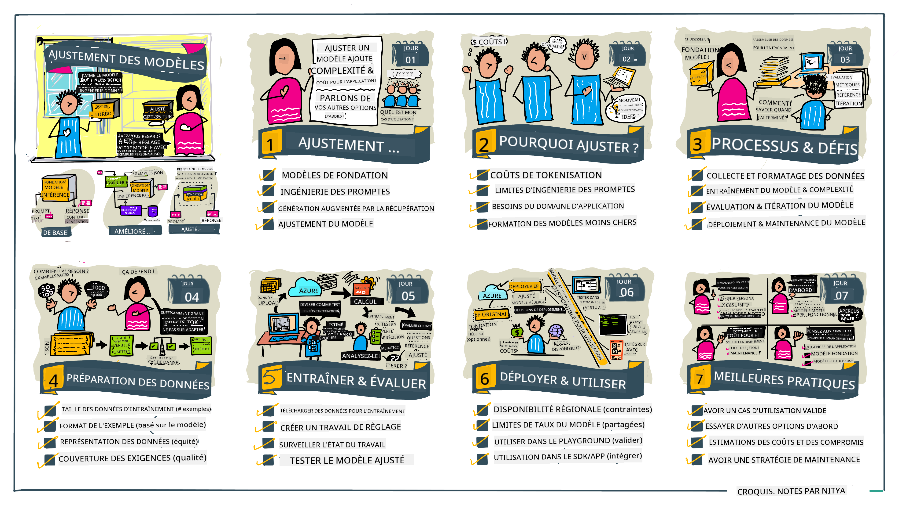

<!--
CO_OP_TRANSLATOR_METADATA:
{
  "original_hash": "68664f7e754a892ae1d8d5e2b7bd2081",
  "translation_date": "2025-07-09T17:34:11+00:00",
  "source_file": "18-fine-tuning/README.md",
  "language_code": "fr"
}
-->

# Affiner votre LLM

L’utilisation de grands modèles de langage pour créer des applications d’IA générative apporte de nouveaux défis. Un enjeu clé est d’assurer la qualité des réponses (précision et pertinence) générées par le modèle pour une requête utilisateur donnée. Dans les leçons précédentes, nous avons abordé des techniques comme l’ingénierie de prompt et la génération augmentée par récupération, qui tentent de résoudre ce problème en _modifiant l’entrée du prompt_ du modèle existant.

Dans la leçon d’aujourd’hui, nous discutons d’une troisième technique, le **fine-tuning**, qui cherche à relever ce défi en _réentraînant le modèle lui-même_ avec des données supplémentaires. Entrons dans les détails.

## Objectifs d’apprentissage

Cette leçon introduit le concept de fine-tuning pour les modèles de langage pré-entraînés, explore les avantages et les défis de cette approche, et fournit des conseils sur quand et comment utiliser le fine-tuning pour améliorer les performances de vos modèles d’IA générative.

À la fin de cette leçon, vous devriez être capable de répondre aux questions suivantes :

- Qu’est-ce que le fine-tuning pour les modèles de langage ?
- Quand et pourquoi le fine-tuning est-il utile ?
- Comment puis-je affiner un modèle pré-entraîné ?
- Quelles sont les limites du fine-tuning ?

Prêt ? Commençons.

## Guide illustré

Vous souhaitez avoir une vue d’ensemble de ce que nous allons couvrir avant de plonger dans le sujet ? Découvrez ce guide illustré qui décrit le parcours d’apprentissage de cette leçon – depuis la compréhension des concepts clés et de la motivation du fine-tuning, jusqu’à la maîtrise du processus et des bonnes pratiques pour réaliser cette tâche. C’est un sujet passionnant à explorer, alors n’oubliez pas de consulter la page [Ressources](./RESOURCES.md?WT.mc_id=academic-105485-koreyst) pour des liens supplémentaires qui soutiendront votre apprentissage autonome !

## Qu’est-ce que le fine-tuning pour les modèles de langage ?

Par définition, les grands modèles de langage sont _pré-entraînés_ sur de grandes quantités de textes provenant de sources diverses, y compris Internet. Comme nous l’avons vu dans les leçons précédentes, nous avons besoin de techniques comme l’_ingénierie de prompt_ et la _génération augmentée par récupération_ pour améliorer la qualité des réponses du modèle aux questions de l’utilisateur (« prompts »).

Une technique populaire d’ingénierie de prompt consiste à donner au modèle plus d’indications sur ce qui est attendu dans la réponse, soit en fournissant des _instructions_ (guidage explicite), soit en _donnant quelques exemples_ (guidage implicite). Cela s’appelle l’_apprentissage par quelques exemples_ (few-shot learning), mais cette méthode présente deux limites :

- Les limites de tokens du modèle peuvent restreindre le nombre d’exemples que vous pouvez fournir, ce qui limite son efficacité.
- Le coût en tokens peut rendre onéreux l’ajout d’exemples à chaque prompt, ce qui réduit la flexibilité.

Le fine-tuning est une pratique courante dans les systèmes d’apprentissage automatique où l’on prend un modèle pré-entraîné et on le réentraîne avec de nouvelles données pour améliorer ses performances sur une tâche spécifique. Dans le contexte des modèles de langage, on peut affiner le modèle pré-entraîné _avec un ensemble d’exemples sélectionnés pour une tâche ou un domaine d’application donné_ afin de créer un **modèle personnalisé** qui sera plus précis et pertinent pour cette tâche ou ce domaine spécifique. Un avantage secondaire du fine-tuning est qu’il peut aussi réduire le nombre d’exemples nécessaires pour l’apprentissage par quelques exemples, diminuant ainsi l’utilisation des tokens et les coûts associés.

## Quand et pourquoi faut-il affiner les modèles ?

Dans _ce_ contexte, lorsque nous parlons de fine-tuning, nous faisons référence au fine-tuning **supervisé**, où le réentraînement se fait en **ajoutant de nouvelles données** qui ne faisaient pas partie du jeu de données d’entraînement initial. Cela diffère d’une approche de fine-tuning non supervisé où le modèle est réentraîné sur les données originales, mais avec des hyperparamètres différents.

L’essentiel à retenir est que le fine-tuning est une technique avancée qui nécessite un certain niveau d’expertise pour obtenir les résultats souhaités. S’il est mal réalisé, il peut ne pas apporter les améliorations attendues, voire dégrader les performances du modèle pour le domaine ciblé.

Avant d’apprendre « comment » affiner les modèles de langage, vous devez savoir « pourquoi » vous devriez emprunter cette voie, et « quand » commencer le processus de fine-tuning. Commencez par vous poser ces questions :

- **Cas d’usage** : Quel est votre _cas d’usage_ pour le fine-tuning ? Quel aspect du modèle pré-entraîné actuel souhaitez-vous améliorer ?
- **Alternatives** : Avez-vous essayé _d’autres techniques_ pour atteindre les résultats souhaités ? Utilisez-les pour créer une base de comparaison.
  - Ingénierie de prompt : Essayez des techniques comme le few-shot prompting avec des exemples de réponses pertinentes. Évaluez la qualité des réponses.
  - Génération augmentée par récupération : Essayez d’augmenter les prompts avec des résultats de requêtes extraits de vos données. Évaluez la qualité des réponses.
- **Coûts** : Avez-vous identifié les coûts liés au fine-tuning ?
  - Possibilité d’ajustement – le modèle pré-entraîné est-il disponible pour le fine-tuning ?
  - Effort – pour préparer les données d’entraînement, évaluer et affiner le modèle.
  - Calcul – pour exécuter les tâches de fine-tuning et déployer le modèle affiné.
  - Données – accès à un nombre suffisant d’exemples de qualité pour un impact significatif.
- **Bénéfices** : Avez-vous confirmé les avantages du fine-tuning ?
  - Qualité – le modèle affiné a-t-il surpassé la base de référence ?
  - Coût – réduit-il l’utilisation des tokens en simplifiant les prompts ?
  - Extensibilité – pouvez-vous réutiliser le modèle de base pour de nouveaux domaines ?

En répondant à ces questions, vous devriez pouvoir décider si le fine-tuning est la bonne approche pour votre cas d’usage. Idéalement, cette approche est valable uniquement si les bénéfices l’emportent sur les coûts. Une fois la décision prise, il est temps de réfléchir à _comment_ affiner le modèle pré-entraîné.

Vous souhaitez approfondir le processus de prise de décision ? Regardez [To fine-tune or not to fine-tune](https://www.youtube.com/watch?v=0Jo-z-MFxJs)

## Comment affiner un modèle pré-entraîné ?

Pour affiner un modèle pré-entraîné, vous devez disposer de :

- un modèle pré-entraîné à affiner
- un jeu de données à utiliser pour le fine-tuning
- un environnement d’entraînement pour exécuter la tâche de fine-tuning
- un environnement d’hébergement pour déployer le modèle affiné

## Fine-tuning en pratique

Les ressources suivantes proposent des tutoriels pas à pas pour vous guider à travers un exemple concret utilisant un modèle sélectionné avec un jeu de données choisi. Pour suivre ces tutoriels, vous devez avoir un compte chez le fournisseur concerné, ainsi que l’accès au modèle et aux jeux de données correspondants.

| Fournisseur  | Tutoriel                                                                                                                                                                      | Description                                                                                                                                                                                                                                                                                                                                                                                                                       |
| ------------ | ----------------------------------------------------------------------------------------------------------------------------------------------------------------------------- | --------------------------------------------------------------------------------------------------------------------------------------------------------------------------------------------------------------------------------------------------------------------------------------------------------------------------------------------------------------------------------------------------------------------------------- |
| OpenAI       | [How to fine-tune chat models](https://github.com/openai/openai-cookbook/blob/main/examples/How_to_finetune_chat_models.ipynb?WT.mc_id=academic-105485-koreyst)               | Apprenez à affiner un `gpt-35-turbo` pour un domaine spécifique (« assistant recettes ») en préparant les données d’entraînement, en lançant la tâche de fine-tuning, et en utilisant le modèle affiné pour l’inférence.                                                                                                                                                                                                           |
| Azure OpenAI | [GPT 3.5 Turbo fine-tuning tutorial](https://learn.microsoft.com/azure/ai-services/openai/tutorials/fine-tune?tabs=python-new%2Ccommand-line?WT.mc_id=academic-105485-koreyst) | Apprenez à affiner un modèle `gpt-35-turbo-0613` **sur Azure** en suivant les étapes de création et d’upload des données d’entraînement, d’exécution de la tâche de fine-tuning, puis de déploiement et d’utilisation du nouveau modèle.                                                                                                                                                                                        |
| Hugging Face | [Fine-tuning LLMs with Hugging Face](https://www.philschmid.de/fine-tune-llms-in-2024-with-trl?WT.mc_id=academic-105485-koreyst)                                              | Ce billet de blog vous guide pour affiner un _LLM open source_ (ex : `CodeLlama 7B`) en utilisant la bibliothèque [transformers](https://huggingface.co/docs/transformers/index?WT.mc_id=academic-105485-koreyst) et [Transformer Reinforcement Learning (TRL)](https://huggingface.co/docs/trl/index?WT.mc_id=academic-105485-koreyst) avec des [datasets](https://huggingface.co/docs/datasets/index?WT.mc_id=academic-105485-koreyst) ouverts sur Hugging Face. |
|              |                                                                                                                                                                               |                                                                                                                                                                                                                                                                                                                                                                                                                                 |
| 🤗 AutoTrain | [Fine-tuning LLMs with AutoTrain](https://github.com/huggingface/autotrain-advanced/?WT.mc_id=academic-105485-koreyst)                                                        | AutoTrain (ou AutoTrain Advanced) est une bibliothèque Python développée par Hugging Face qui permet le fine-tuning pour de nombreuses tâches, y compris le fine-tuning de LLM. AutoTrain est une solution sans code et le fine-tuning peut être réalisé dans votre propre cloud, sur Hugging Face Spaces ou localement. Il supporte une interface web, une CLI et l’entraînement via des fichiers de configuration yaml.                              |
|              |                                                                                                                                                                               |                                                                                                                                                                                                                                                                                                                                                                                                                                 |

## Exercice

Choisissez un des tutoriels ci-dessus et suivez-le. _Nous pourrions reproduire une version de ces tutoriels dans des Jupyter Notebooks dans ce dépôt à titre de référence uniquement. Veuillez utiliser directement les sources originales pour obtenir les versions les plus récentes_.

## Excellent travail ! Continuez à apprendre.

Après avoir terminé cette leçon, consultez notre [collection d’apprentissage sur l’IA générative](https://aka.ms/genai-collection?WT.mc_id=academic-105485-koreyst) pour continuer à approfondir vos connaissances en IA générative !

Félicitations !! Vous avez terminé la dernière leçon de la série v2 de ce cours ! Ne vous arrêtez pas d’apprendre et de créer. \*\*Consultez la page [RESSOURCES](RESOURCES.md?WT.mc_id=academic-105485-koreyst) pour une liste de suggestions supplémentaires sur ce sujet.

Notre série v1 de leçons a également été mise à jour avec plus d’exercices et de concepts. Prenez donc un moment pour rafraîchir vos connaissances – et n’hésitez pas à [partager vos questions et retours](https://github.com/microsoft/generative-ai-for-beginners/issues?WT.mc_id=academic-105485-koreyst) pour nous aider à améliorer ces leçons pour la communauté.

**Avertissement** :  
Ce document a été traduit à l’aide du service de traduction automatique [Co-op Translator](https://github.com/Azure/co-op-translator). Bien que nous nous efforcions d’assurer l’exactitude, veuillez noter que les traductions automatiques peuvent contenir des erreurs ou des inexactitudes. Le document original dans sa langue d’origine doit être considéré comme la source faisant foi. Pour les informations critiques, une traduction professionnelle réalisée par un humain est recommandée. Nous déclinons toute responsabilité en cas de malentendus ou de mauvaises interprétations résultant de l’utilisation de cette traduction.