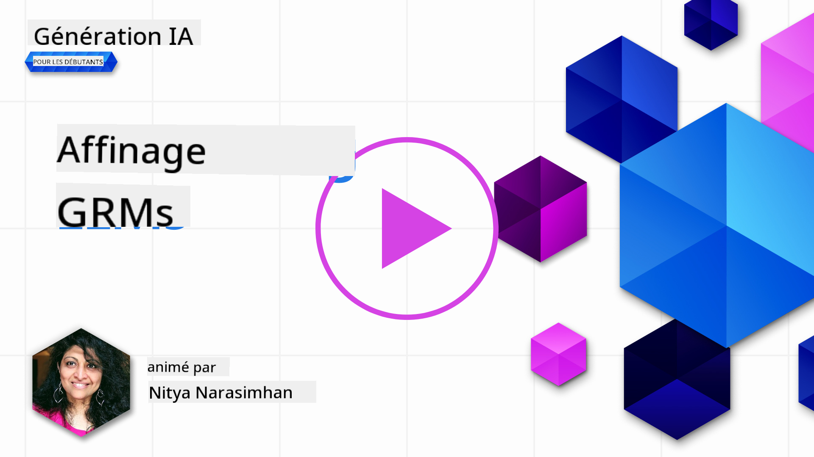

<!--
CO_OP_TRANSLATOR_METADATA:
{
  "original_hash": "68664f7e754a892ae1d8d5e2b7bd2081",
  "translation_date": "2025-05-20T07:34:24+00:00",
  "source_file": "18-fine-tuning/README.md",
  "language_code": "fr"
}
-->

# Ajustement de votre LLM

Utiliser des modèles de langage de grande taille pour créer des applications d'IA générative présente de nouveaux défis. Un problème clé est de garantir la qualité des réponses (précision et pertinence) dans le contenu généré par le modèle pour une demande utilisateur donnée. Dans les leçons précédentes, nous avons discuté de techniques telles que l'ingénierie de prompt et la génération augmentée par la récupération qui tentent de résoudre le problème en _modifiant l'entrée du prompt_ du modèle existant.

Dans la leçon d'aujourd'hui, nous discutons d'une troisième technique, **l'ajustement**, qui tente de relever le défi en _réentraînant le modèle lui-même_ avec des données supplémentaires. Plongeons dans les détails.

## Objectifs d'apprentissage

Cette leçon introduit le concept d'ajustement pour les modèles de langage pré-entraînés, explore les avantages et les défis de cette approche, et fournit des conseils sur quand et comment utiliser l'ajustement pour améliorer les performances de vos modèles d'IA générative.

À la fin de cette leçon, vous devriez être capable de répondre aux questions suivantes :

- Qu'est-ce que l'ajustement pour les modèles de langage ?
- Quand et pourquoi l'ajustement est-il utile ?
- Comment puis-je ajuster un modèle pré-entraîné ?
- Quelles sont les limitations de l'ajustement ?

Prêt ? Commençons.

## Guide illustré

Vous voulez avoir une vue d'ensemble de ce que nous allons couvrir avant de plonger ? Consultez ce guide illustré qui décrit le parcours d'apprentissage de cette leçon - de l'apprentissage des concepts de base et de la motivation pour l'ajustement, à la compréhension du processus et des meilleures pratiques pour exécuter la tâche d'ajustement. C'est un sujet fascinant à explorer, alors n'oubliez pas de consulter la page [Ressources](./RESOURCES.md?WT.mc_id=academic-105485-koreyst) pour des liens supplémentaires afin de soutenir votre parcours d'apprentissage autonome !

## Qu'est-ce que l'ajustement pour les modèles de langage ?

Par définition, les modèles de langage de grande taille sont _pré-entraînés_ sur de grandes quantités de texte provenant de diverses sources, y compris Internet. Comme nous l'avons appris dans les leçons précédentes, nous avons besoin de techniques comme _l'ingénierie de prompt_ et la _génération augmentée par la récupération_ pour améliorer la qualité des réponses du modèle aux questions des utilisateurs ("prompts").

Une technique populaire d'ingénierie de prompt consiste à donner au modèle plus de directives sur ce qui est attendu dans la réponse, soit en fournissant des _instructions_ (guidage explicite) ou en _lui donnant quelques exemples_ (guidage implicite). Cela est appelé _apprentissage à quelques coups_, mais cela présente deux limitations :

- Les limites de tokens du modèle peuvent restreindre le nombre d'exemples que vous pouvez donner et limiter l'efficacité.
- Les coûts de tokens du modèle peuvent rendre coûteux l'ajout d'exemples à chaque prompt et limiter la flexibilité.

L'ajustement est une pratique courante dans les systèmes d'apprentissage automatique où nous prenons un modèle pré-entraîné et le réentraînons avec de nouvelles données pour améliorer ses performances sur une tâche spécifique. Dans le contexte des modèles de langage, nous pouvons ajuster le modèle pré-entraîné _avec un ensemble d'exemples sélectionnés pour une tâche ou un domaine d'application donné_ afin de créer un **modèle personnalisé** qui peut être plus précis et pertinent pour cette tâche ou ce domaine spécifique. Un avantage secondaire de l'ajustement est qu'il peut également réduire le nombre d'exemples nécessaires pour l'apprentissage à quelques coups - réduisant l'utilisation de tokens et les coûts associés.

## Quand et pourquoi devrions-nous ajuster les modèles ?

Dans _ce_ contexte, lorsque nous parlons d'ajustement, nous faisons référence à l'ajustement **supervisé** où le réentraînement est effectué en **ajoutant de nouvelles données** qui ne faisaient pas partie du jeu de données d'entraînement original. Cela est différent d'une approche d'ajustement non supervisé où le modèle est réentraîné sur les données originales, mais avec des hyperparamètres différents.

La chose importante à retenir est que l'ajustement est une technique avancée qui nécessite un certain niveau d'expertise pour obtenir les résultats souhaités. Si cela est mal fait, cela peut ne pas fournir les améliorations attendues et peut même dégrader les performances du modèle pour votre domaine ciblé.

Ainsi, avant d'apprendre "comment" ajuster les modèles de langage, vous devez savoir "pourquoi" vous devriez emprunter cette voie et "quand" commencer le processus d'ajustement. Commencez par vous poser ces questions :

- **Cas d'utilisation** : Quel est votre _cas d'utilisation_ pour l'ajustement ? Quel aspect du modèle pré-entraîné actuel souhaitez-vous améliorer ?
- **Alternatives** : Avez-vous essayé _d'autres techniques_ pour atteindre les résultats souhaités ? Utilisez-les pour créer une base de comparaison.
  - Ingénierie de prompt : Essayez des techniques comme le prompt à quelques coups avec des exemples de réponses de prompt pertinentes. Évaluez la qualité des réponses.
  - Génération augmentée par la récupération : Essayez d'augmenter les prompts avec les résultats de requête récupérés en recherchant vos données. Évaluez la qualité des réponses.
- **Coûts** : Avez-vous identifié les coûts pour l'ajustement ?
  - Possibilité d'ajustement - le modèle pré-entraîné est-il disponible pour l'ajustement ?
  - Effort - pour préparer les données d'entraînement, évaluer et affiner le modèle.
  - Calcul - pour exécuter les tâches d'ajustement et déployer le modèle ajusté.
  - Données - accès à des exemples de qualité suffisante pour l'impact de l'ajustement.
- **Avantages** : Avez-vous confirmé les avantages de l'ajustement ?
  - Qualité - le modèle ajusté a-t-il surpassé la base de comparaison ?
  - Coût - cela réduit-il l'utilisation de tokens en simplifiant les prompts ?
  - Extensibilité - pouvez-vous réutiliser le modèle de base pour de nouveaux domaines ?

En répondant à ces questions, vous devriez être en mesure de décider si l'ajustement est la bonne approche pour votre cas d'utilisation. Idéalement, l'approche est valide uniquement si les avantages l'emportent sur les coûts. Une fois que vous avez décidé de procéder, il est temps de penser à _comment_ vous pouvez ajuster le modèle pré-entraîné.

Vous voulez obtenir plus d'informations sur le processus de prise de décision ? Regardez [Ajuster ou ne pas ajuster](https://www.youtube.com/watch?v=0Jo-z-MFxJs)

## Comment pouvons-nous ajuster un modèle pré-entraîné ?

Pour ajuster un modèle pré-entraîné, vous devez avoir :

- un modèle pré-entraîné à ajuster
- un jeu de données à utiliser pour l'ajustement
- un environnement d'entraînement pour exécuter la tâche d'ajustement
- un environnement d'hébergement pour déployer le modèle ajusté

## Ajustement en action

Les ressources suivantes fournissent des tutoriels étape par étape pour vous guider à travers un exemple réel en utilisant un modèle sélectionné avec un jeu de données sélectionné. Pour suivre ces tutoriels, vous avez besoin d'un compte chez le fournisseur spécifique, ainsi que d'un accès au modèle et aux jeux de données pertinents.

| Fournisseur   | Tutoriel                                                                                                                                                                       | Description                                                                                                                                                                                                                                                                                                                                                                                                                        |
| ------------- | ------------------------------------------------------------------------------------------------------------------------------------------------------------------------------ | ---------------------------------------------------------------------------------------------------------------------------------------------------------------------------------------------------------------------------------------------------------------------------------------------------------------------------------------------------------------------------------------------------------------------------------- |
| OpenAI        | [Comment ajuster les modèles de chat](https://github.com/openai/openai-cookbook/blob/main/examples/How_to_finetune_chat_models.ipynb?WT.mc_id=academic-105485-koreyst)          | Apprenez à ajuster un `gpt-35-turbo` pour un domaine spécifique ("assistant de recettes") en préparant des données d'entraînement, en exécutant la tâche d'ajustement et en utilisant le modèle ajusté pour l'inférence.                                                                                                                                                                                                                                                |
| Azure OpenAI  | [Tutoriel d'ajustement de GPT 3.5 Turbo](https://learn.microsoft.com/azure/ai-services/openai/tutorials/fine-tune?tabs=python-new%2Ccommand-line?WT.mc_id=academic-105485-koreyst) | Apprenez à ajuster un modèle `gpt-35-turbo-0613` **sur Azure** en suivant les étapes pour créer et télécharger des données d'entraînement, exécuter la tâche d'ajustement. Déployez et utilisez le nouveau modèle.                                                                                                                                                                                                                                                         |
| Hugging Face  | [Ajustement des LLMs avec Hugging Face](https://www.philschmid.de/fine-tune-llms-in-2024-with-trl?WT.mc_id=academic-105485-koreyst)                                           | Cet article de blog vous guide dans l'ajustement d'un _LLM ouvert_ (ex : `CodeLlama 7B`) en utilisant la bibliothèque [transformers](https://huggingface.co/docs/transformers/index?WT.mc_id=academic-105485-koreyst) et [l'apprentissage par renforcement des transformateurs (TRL)](https://huggingface.co/docs/trl/index?WT.mc_id=academic-105485-koreyst) avec des [jeux de données](https://huggingface.co/docs/datasets/index?WT.mc_id=academic-105485-koreyst) ouverts sur Hugging Face. |
|               |                                                                                                                                                                                |                                                                                                                                                                                                                                                                                                                                                                                                                                    |
| 🤗 AutoTrain  | [Ajustement des LLMs avec AutoTrain](https://github.com/huggingface/autotrain-advanced/?WT.mc_id=academic-105485-koreyst)                                                      | AutoTrain (ou AutoTrain Advanced) est une bibliothèque python développée par Hugging Face qui permet l'ajustement pour de nombreuses tâches différentes, y compris l'ajustement des LLM. AutoTrain est une solution sans code et l'ajustement peut être effectué dans votre propre cloud, sur Hugging Face Spaces ou localement. Il prend en charge une interface graphique web, CLI et l'entraînement via des fichiers de configuration yaml.                             |
|               |                                                                                                                                                                                |                                                                                                                                                                                                                                                                                                                                                                                                                                    |

## Devoir

Sélectionnez l'un des tutoriels ci-dessus et parcourez-le. _Nous pourrions reproduire une version de ces tutoriels dans des Jupyter Notebooks dans ce dépôt à titre de référence uniquement. Veuillez utiliser les sources originales directement pour obtenir les dernières versions_.

## Excellent travail ! Continuez votre apprentissage.

Après avoir terminé cette leçon, consultez notre [collection d'apprentissage sur l'IA générative](https://aka.ms/genai-collection?WT.mc_id=academic-105485-koreyst) pour continuer à développer vos connaissances en IA générative !

Félicitations !! Vous avez terminé la dernière leçon de la série v2 de ce cours ! Ne cessez pas d'apprendre et de construire. **Consultez la page [RESSOURCES](RESOURCES.md?WT.mc_id=academic-105485-koreyst) pour une liste de suggestions supplémentaires pour ce sujet.

Notre série de leçons v1 a également été mise à jour avec plus de devoirs et de concepts. Alors prenez une minute pour rafraîchir vos connaissances - et veuillez [partager vos questions et commentaires](https://github.com/microsoft/generative-ai-for-beginners/issues?WT.mc_id=academic-105485-koreyst) pour nous aider à améliorer ces leçons pour la communauté.

**Avertissement** :  
Ce document a été traduit à l'aide du service de traduction automatique [Co-op Translator](https://github.com/Azure/co-op-translator). Bien que nous nous efforcions d'assurer l'exactitude, veuillez noter que les traductions automatisées peuvent contenir des erreurs ou des inexactitudes. Le document original dans sa langue d'origine doit être considéré comme la source faisant autorité. Pour des informations critiques, il est recommandé de recourir à une traduction humaine professionnelle. Nous ne sommes pas responsables des malentendus ou des interprétations erronées résultant de l'utilisation de cette traduction.