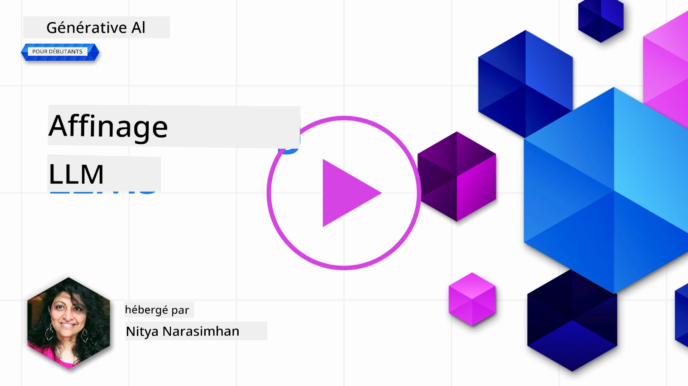
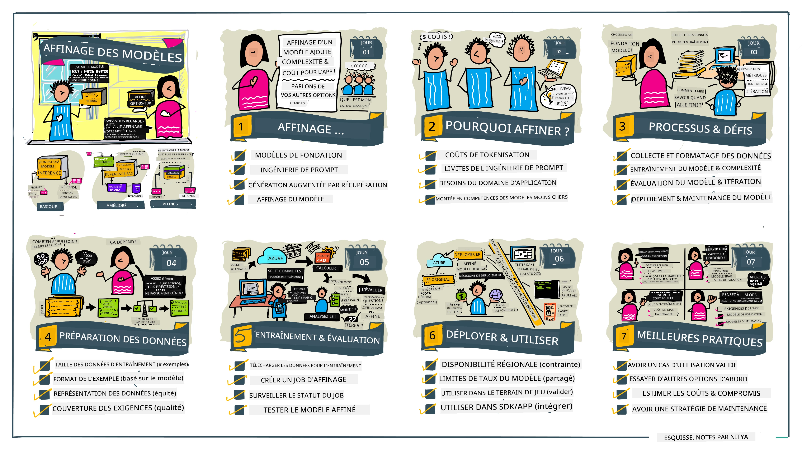

# Ajustement fin de votre LLM

L'utilisation de grands modèles de langage pour créer des applications d'IA générative présente de nouveaux défis. Un enjeu clé est d'assurer la qualité des réponses (précision et pertinence) dans le contenu généré par le modèle pour une requête utilisateur donnée. Dans les leçons précédentes, nous avons abordé des techniques comme l'ingénierie des prompts et la génération augmentée par récupération qui tentent de résoudre le problème en _modifiant l'entrée du prompt_ pour le modèle existant.

Dans la leçon d'aujourd'hui, nous discutons d'une troisième technique, le **fine-tuning**, qui tente de relever le défi en _réentraînant le modèle lui-même_ avec des données supplémentaires. Entrons dans les détails.

## Objectifs d'apprentissage

Cette leçon introduit le concept de fine-tuning pour les modèles de langage pré-entraînés, explore les avantages et les défis de cette approche, et fournit des conseils sur quand et comment utiliser le fine-tuning pour améliorer la performance de vos modèles d'IA générative.

À la fin de cette leçon, vous devriez être capable de répondre aux questions suivantes :

- Qu'est-ce que le fine-tuning pour les modèles de langage ?
- Quand et pourquoi le fine-tuning est-il utile ?
- Comment puis-je fine-tuner un modèle pré-entraîné ?
- Quelles sont les limites du fine-tuning ?

Prêt ? Commençons.

## Guide illustré

Vous voulez avoir une vue d'ensemble de ce que nous allons couvrir avant de commencer ? Consultez ce guide illustré qui décrit le parcours d'apprentissage pour cette leçon – de l'apprentissage des concepts clés et de la motivation du fine-tuning, à la compréhension du processus et des bonnes pratiques pour exécuter la tâche de fine-tuning. C'est un sujet fascinant à explorer, alors n'oubliez pas de visiter la page [Ressources](./RESOURCES.md?WT.mc_id=academic-105485-koreyst) pour des liens supplémentaires afin de soutenir votre parcours d'apprentissage autonome !

## Qu'est-ce que le fine-tuning pour les modèles de langage ?

Par définition, les grands modèles de langage sont _pré-entraînés_ sur de grandes quantités de textes provenant de sources diverses, dont internet. Comme nous l'avons appris dans les leçons précédentes, nous avons besoin de techniques telles que l'_ingénierie des prompts_ et la _génération augmentée par récupération_ pour améliorer la qualité des réponses du modèle aux questions ("prompts") de l'utilisateur.

Une technique courante d'ingénierie de prompts consiste à donner plus d'indications au modèle sur ce qui est attendu dans la réponse, soit en fournissant des _instructions_ (indications explicites) soit en _donnant quelques exemples_ (indications implicites). Cela s'appelle l'_apprentissage par quelques exemples_ (few-shot learning) mais cela présente deux limites :

- Les limites de tokens du modèle peuvent restreindre le nombre d’exemples que vous pouvez donner, limitant ainsi l’efficacité.
- Les coûts en tokens du modèle peuvent rendre coûteux l'ajout d'exemples à chaque prompt, limitant la flexibilité.

Le fine-tuning est une pratique courante dans les systèmes d’apprentissage automatique où l’on prend un modèle pré-entraîné et on le réentraîne avec de nouvelles données pour améliorer ses performances sur une tâche spécifique. Dans le contexte des modèles de langage, on peut fine-tuner le modèle pré-entraîné _avec un ensemble d'exemples sélectionnés pour une tâche ou un domaine d'application donné_ afin de créer un **modèle personnalisé** qui peut être plus précis et pertinent pour cette tâche ou ce domaine spécifique. Un avantage secondaire du fine-tuning est qu’il peut aussi réduire le nombre d'exemples nécessaires pour le few-shot learning – réduisant ainsi l’utilisation des tokens et les coûts associés.

## Quand et pourquoi devrions-nous fine-tuner les modèles ?

Dans _ce_ contexte, lorsque nous parlons de fine-tuning, nous parlons de fine-tuning **supervisé** où le réentraînement se fait en **ajoutant de nouvelles données** qui ne faisaient pas partie du jeu de données d’entraînement original. Cela diffère de l’approche de fine-tuning non supervisé où le modèle est réentraîné sur les données originales, mais avec des hyperparamètres différents.

La chose clé à retenir est que le fine-tuning est une technique avancée qui nécessite un certain niveau d’expertise pour obtenir les résultats souhaités. S'il est mal réalisé, il peut ne pas apporter les améliorations escomptées, voire dégrader les performances du modèle pour votre domaine ciblé.

Alors, avant d’apprendre "comment" fine-tuner les modèles de langage, vous devez savoir "pourquoi" vous devriez prendre cette voie, et "quand" commencer le processus de fine-tuning. Commencez par vous poser ces questions :

- **Cas d'utilisation** : Quel est votre _cas d'utilisation_ pour le fine-tuning ? Quel aspect du modèle pré-entraîné actuel voulez-vous améliorer ?
- **Alternatives** : Avez-vous essayé _d'autres techniques_ pour atteindre les résultats souhaités ? Utilisez-les pour créer une base de comparaison.
  - Ingénierie de prompt : Essayez des techniques comme le few-shot prompting avec des exemples de réponses pertinentes. Évaluez la qualité des réponses.
  - Génération augmentée par récupération : Essayez d’augmenter les prompts avec les résultats de requêtes récupérés en recherchant dans vos données. Évaluez la qualité des réponses.
- **Coûts** : Avez-vous identifié les coûts du fine-tuning ?
  - Capacité à être ajusté : Le modèle pré-entraîné est-il disponible pour le fine-tuning ?
  - Effort : Pour préparer les données d'entraînement, évaluer et affiner le modèle.
  - Calcul : Pour exécuter les tâches de fine-tuning et déployer le modèle ajusté.
  - Données : Accès à suffisamment d’exemples de qualité pour un impact du fine-tuning.
- **Avantages** : Avez-vous confirmé les bénéfices du fine-tuning ?
  - Qualité : Le modèle ajusté a-t-il dépassé la référence ?
  - Coût : Réduit-il l’usage des tokens en simplifiant les prompts ?
  - Extensibilité : Pouvez-vous réutiliser le modèle de base pour de nouveaux domaines ?

En répondant à ces questions, vous devriez pouvoir décider si le fine-tuning est la bonne approche pour votre cas d'utilisation. Idéalement, l'approche est valide seulement si les bénéfices l’emportent sur les coûts. Une fois que vous décidez de continuer, il est temps de réfléchir à _comment_ vous pouvez fine-tuner le modèle pré-entraîné.

Envie d’avoir plus d’éclairages sur le processus de décision ? Regardez [Fine-tuning or not fine-tuning](https://www.youtube.com/watch?v=0Jo-z-MFxJs)

## Comment peut-on fine-tuner un modèle pré-entraîné ?

Pour fine-tuner un modèle pré-entraîné, vous avez besoin de :

- un modèle pré-entraîné à fine-tuner
- un jeu de données à utiliser pour le fine-tuning
- un environnement d'entraînement pour exécuter la tâche de fine-tuning
- un environnement d’hébergement pour déployer le modèle ajusté

## Fine-Tuning en action

Les ressources suivantes fournissent des tutoriels pas-à-pas pour vous guider à travers un exemple concret utilisant un modèle sélectionné avec un jeu de données choisi. Pour suivre ces tutoriels, vous devez disposer d’un compte chez le fournisseur spécifique, ainsi que l’accès au modèle et aux jeux de données pertinents.

| Fournisseur  | Tutoriel                                                                                                                                                                      | Description                                                                                                                                                                                                                                                                                                                                                                                                                        |
| ------------ | ----------------------------------------------------------------------------------------------------------------------------------------------------------------------------- | -------------------------------------------------------------------------------------------------------------------------------------------------------------------------------------------------------------------------------------------------------------------------------------------------------------------------------------------------------------------------------------------------------------------------------- |
| OpenAI       | [How to fine-tune chat models](https://github.com/openai/openai-cookbook/blob/main/examples/How_to_finetune_chat_models.ipynb?WT.mc_id=academic-105485-koreyst)               | Apprenez à fine-tuner un `gpt-35-turbo` pour un domaine spécifique ("assistant recette") en préparant les données d'entraînement, en lançant la tâche de fine-tuning, et en utilisant le modèle ajusté pour l'inférence.                                                                                                                                                                                                           |
| Azure OpenAI | [GPT 3.5 Turbo fine-tuning tutorial](https://learn.microsoft.com/azure/ai-services/openai/tutorials/fine-tune?tabs=python-new%2Ccommand-line&WT.mc_id=academic-105485-koreyst) | Apprenez à fine-tuner un modèle `gpt-35-turbo-0613` **sur Azure** en suivant les étapes pour créer et uploader les données d'entraînement, exécuter la tâche de fine-tuning. Déployez et utilisez le nouveau modèle.                                                                                                                                                                                                                |
| Hugging Face | [Fine-tuning LLMs with Hugging Face](https://www.philschmid.de/fine-tune-llms-in-2024-with-trl?WT.mc_id=academic-105485-koreyst)                                              | Ce billet vous guide pour fine-tuner un _LLM open source_ (ex : `CodeLlama 7B`) en utilisant la bibliothèque [transformers](https://huggingface.co/docs/transformers/index?WT.mc_id=academic-105485-koreyst) & [Transformer Reinforcement Learning (TRL)](https://huggingface.co/docs/trl/index?WT.mc_id=academic-105485-koreyst) avec des [datasets](https://huggingface.co/docs/datasets/index?WT.mc_id=academic-105485-koreyst) ouverts sur Hugging Face.               |
|              |                                                                                                                                                                               |                                                                                                                                                                                                                                                                                                                                                                                                                                  |
| 🤗 AutoTrain | [Fine-tuning LLMs with AutoTrain](https://github.com/huggingface/autotrain-advanced/?WT.mc_id=academic-105485-koreyst)                                                        | AutoTrain (ou AutoTrain Advanced) est une bibliothèque python développée par Hugging Face qui permet le fine-tuning pour de nombreuses tâches différentes y compris le fine-tuning LLM. AutoTrain est une solution sans code et le fine-tuning peut être réalisé dans votre propre cloud, sur Hugging Face Spaces ou localement. Il supporte à la fois une interface web, une CLI et l’entraînement via des fichiers de configuration yaml.                                  |
|              |                                                                                                                                                                               |                                                                                                                                                                                                                                                                                                                                                                                                                                  |
| 🦥 Unsloth  | [Fine-tuning LLMs with Unsloth](https://github.com/unslothai/unsloth)                                                                  | Unsloth est un framework open source qui supporte le fine-tuning LLM et l'apprentissage par renforcement (RL). Unsloth facilite l’entraînement local, l’évaluation et le déploiement avec des [notebooks](https://github.com/unslothai/notebooks) prêts à l’emploi. Il supporte également la synthèse vocale (TTS), les modèles BERT et multimodaux. Pour commencer, lisez leur guide étape par étape [Fine-tuning LLMs Guide](https://docs.unsloth.ai/get-started/fine-tuning-llms-guide).                 |
|              |                                                                                                                                                                               |                                                                                                                                                                                                                                                                                                                                                                                                                                  |
## Devoir

Choisissez un des tutoriels ci-dessus et suivez-le. _Nous pourrions reproduire une version de ces tutoriels dans des Jupyter Notebooks dans ce dépôt à titre de référence uniquement. Veuillez utiliser directement les sources originales pour obtenir les versions les plus récentes_.

## Bon travail ! Continuez votre apprentissage.

Après avoir terminé cette leçon, consultez notre [collection d’apprentissage sur l’IA générative](https://aka.ms/genai-collection?WT.mc_id=academic-105485-koreyst) pour continuer à renforcer vos connaissances en IA générative !

Félicitations !! Vous avez complété la dernière leçon de la série v2 pour ce cours ! Ne vous arrêtez pas d’apprendre et de construire. \*\*Consultez la page [RESSOURCES](RESOURCES.md?WT.mc_id=academic-105485-koreyst) pour une liste de suggestions supplémentaires sur ce sujet.

Notre série v1 de leçons a aussi été mise à jour avec plus de devoirs et de concepts. Alors prenez une minute pour rafraîchir vos connaissances - et n’hésitez pas à [partager vos questions et retours](https://github.com/microsoft/generative-ai-for-beginners/issues?WT.mc_id=academic-105485-koreyst) pour nous aider à améliorer ces leçons pour la communauté.

---

<!-- CO-OP TRANSLATOR DISCLAIMER START -->
**Avertissement** :  
Ce document a été traduit à l’aide du service de traduction automatisée [Co-op Translator](https://github.com/Azure/co-op-translator). Bien que nous nous efforcions d’assurer l’exactitude, veuillez noter que les traductions automatiques peuvent contenir des erreurs ou des inexactitudes. Le document original dans sa langue d’origine doit être considéré comme la source faisant foi. Pour les informations critiques, une traduction professionnelle réalisée par un humain est recommandée. Nous déclinons toute responsabilité en cas de malentendus ou d’interprétations erronées résultant de l’utilisation de cette traduction.
<!-- CO-OP TRANSLATOR DISCLAIMER END -->