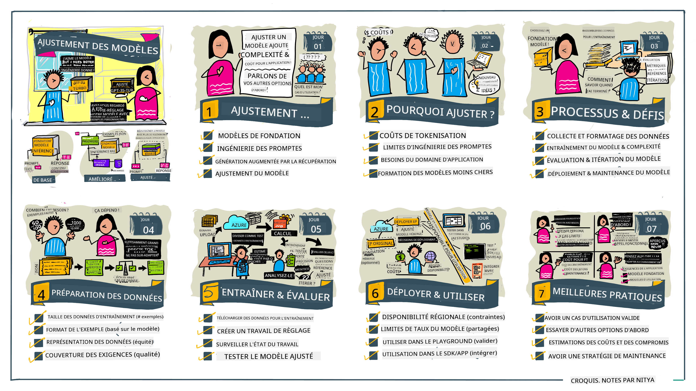

<!--
CO_OP_TRANSLATOR_METADATA:
{
  "original_hash": "68664f7e754a892ae1d8d5e2b7bd2081",
  "translation_date": "2025-06-26T00:29:05+00:00",
  "source_file": "18-fine-tuning/README.md",
  "language_code": "fr"
}
-->

# Affiner Votre LLM

Utiliser de grands modèles de langage pour construire des applications d'IA générative pose de nouveaux défis. Un problème clé est d'assurer la qualité des réponses (précision et pertinence) dans le contenu généré par le modèle pour une demande utilisateur donnée. Dans les leçons précédentes, nous avons discuté de techniques comme l'ingénierie des invites et la génération augmentée par récupération qui tentent de résoudre le problème en _modifiant l'entrée de l'invite_ au modèle existant.

Dans la leçon d'aujourd'hui, nous discutons d'une troisième technique, **l'affinement**, qui tente de relever le défi en _réentraînant le modèle lui-même_ avec des données supplémentaires. Plongeons dans les détails.

## Objectifs d'apprentissage

Cette leçon introduit le concept d'affinement pour les modèles de langage pré-entraînés, explore les avantages et les défis de cette approche, et fournit des conseils sur quand et comment utiliser l'affinement pour améliorer les performances de vos modèles d'IA générative.

À la fin de cette leçon, vous devriez être capable de répondre aux questions suivantes :

- Qu'est-ce que l'affinement pour les modèles de langage ?
- Quand, et pourquoi, l'affinement est-il utile ?
- Comment puis-je affiner un modèle pré-entraîné ?
- Quelles sont les limites de l'affinement ?

Prêt ? Commençons.

## Guide Illustré

Vous voulez avoir une vue d'ensemble de ce que nous allons couvrir avant de plonger ? Consultez ce guide illustré qui décrit le parcours d'apprentissage de cette leçon - depuis l'apprentissage des concepts de base et de la motivation pour l'affinement, jusqu'à la compréhension du processus et des meilleures pratiques pour exécuter la tâche d'affinement. C'est un sujet fascinant à explorer, alors n'oubliez pas de consulter la page [Ressources](./RESOURCES.md?WT.mc_id=academic-105485-koreyst) pour des liens supplémentaires pour soutenir votre parcours d'apprentissage autodirigé !

## Qu'est-ce que l'affinement pour les modèles de langage ?

Par définition, les grands modèles de langage sont _pré-entraînés_ sur de grandes quantités de texte provenant de diverses sources, y compris Internet. Comme nous l'avons appris dans les leçons précédentes, nous avons besoin de techniques comme _l'ingénierie des invites_ et la _génération augmentée par récupération_ pour améliorer la qualité des réponses du modèle aux questions de l'utilisateur ("invites").

Une technique populaire d'ingénierie des invites consiste à donner au modèle plus de directives sur ce qui est attendu dans la réponse, soit en fournissant des _instructions_ (guidage explicite), soit en _lui donnant quelques exemples_ (guidage implicite). Cela est appelé _apprentissage par quelques exemples_ mais cela présente deux limitations :

- Les limites de tokens du modèle peuvent restreindre le nombre d'exemples que vous pouvez donner, et limiter l'efficacité.
- Les coûts de tokens du modèle peuvent rendre coûteux l'ajout d'exemples à chaque invite, et limiter la flexibilité.

L'affinement est une pratique courante dans les systèmes d'apprentissage automatique où nous prenons un modèle pré-entraîné et le réentraînons avec de nouvelles données pour améliorer ses performances sur une tâche spécifique. Dans le contexte des modèles de langage, nous pouvons affiner le modèle pré-entraîné _avec un ensemble d'exemples sélectionnés pour une tâche ou un domaine d'application donné_ pour créer un **modèle personnalisé** qui peut être plus précis et pertinent pour cette tâche ou ce domaine spécifique. Un avantage secondaire de l'affinement est qu'il peut également réduire le nombre d'exemples nécessaires pour l'apprentissage par quelques exemples - réduisant l'utilisation de tokens et les coûts associés.

## Quand et pourquoi devrions-nous affiner les modèles ?

Dans _ce_ contexte, lorsque nous parlons d'affinement, nous faisons référence à l'affinement **supervisé** où le réentraînement est effectué en **ajoutant de nouvelles données** qui ne faisaient pas partie du jeu de données d'entraînement original. Cela est différent d'une approche d'affinement non supervisé où le modèle est réentraîné sur les données originales, mais avec des hyperparamètres différents.

La chose clé à retenir est que l'affinement est une technique avancée qui nécessite un certain niveau d'expertise pour obtenir les résultats souhaités. Si elle est mal exécutée, elle peut ne pas fournir les améliorations attendues, et peut même dégrader les performances du modèle pour votre domaine ciblé.

Donc, avant d'apprendre "comment" affiner les modèles de langage, vous devez savoir "pourquoi" vous devriez emprunter cette voie, et "quand" commencer le processus d'affinement. Commencez par vous poser ces questions :

- **Cas d'utilisation** : Quel est votre _cas d'utilisation_ pour l'affinement ? Quel aspect du modèle pré-entraîné actuel souhaitez-vous améliorer ?
- **Alternatives** : Avez-vous essayé _d'autres techniques_ pour atteindre les résultats souhaités ? Utilisez-les pour créer une base de comparaison.
  - Ingénierie des invites : Essayez des techniques comme l'invitation par quelques exemples avec des exemples de réponses pertinentes. Évaluez la qualité des réponses.
  - Génération Augmentée par Récupération : Essayez d'augmenter les invites avec les résultats de requêtes récupérés en recherchant vos données. Évaluez la qualité des réponses.
- **Coûts** : Avez-vous identifié les coûts pour l'affinement ?
  - Ajustabilité - le modèle pré-entraîné est-il disponible pour l'affinement ?
  - Effort - pour préparer les données d'entraînement, évaluer et affiner le modèle.
  - Calcul - pour exécuter les tâches d'affinement, et déployer le modèle affiné.
  - Données - accès à des exemples de qualité suffisante pour un impact d'affinement
- **Bénéfices** : Avez-vous confirmé les bénéfices de l'affinement ?
  - Qualité - le modèle affiné a-t-il surpassé la base de référence ?
  - Coût - réduit-il l'utilisation de tokens en simplifiant les invites ?
  - Extensibilité - pouvez-vous réutiliser le modèle de base pour de nouveaux domaines ?

En répondant à ces questions, vous devriez être en mesure de décider si l'affinement est la bonne approche pour votre cas d'utilisation. Idéalement, l'approche est valable uniquement si les bénéfices l'emportent sur les coûts. Une fois que vous décidez de procéder, il est temps de réfléchir à _comment_ vous pouvez affiner le modèle pré-entraîné.

Vous voulez obtenir plus d'informations sur le processus de prise de décision ? Regardez [To fine-tune or not to fine-tune](https://www.youtube.com/watch?v=0Jo-z-MFxJs)

## Comment pouvons-nous affiner un modèle pré-entraîné ?

Pour affiner un modèle pré-entraîné, vous devez avoir :

- un modèle pré-entraîné à affiner
- un jeu de données à utiliser pour l'affinement
- un environnement d'entraînement pour exécuter la tâche d'affinement
- un environnement d'hébergement pour déployer le modèle affiné

## Affinement en Action

Les ressources suivantes fournissent des tutoriels étape par étape pour vous guider à travers un exemple réel en utilisant un modèle sélectionné avec un jeu de données choisi. Pour suivre ces tutoriels, vous avez besoin d'un compte sur le fournisseur spécifique, ainsi que d'un accès au modèle et aux jeux de données pertinents.

| Fournisseur  | Tutoriel                                                                                                                                                                       | Description                                                                                                                                                                                                                                                                                                                                                                                                                        |
| ------------ | ------------------------------------------------------------------------------------------------------------------------------------------------------------------------------ | ---------------------------------------------------------------------------------------------------------------------------------------------------------------------------------------------------------------------------------------------------------------------------------------------------------------------------------------------------------------------------------------------------------------------------------- |
| OpenAI       | [Comment affiner les modèles de chat](https://github.com/openai/openai-cookbook/blob/main/examples/How_to_finetune_chat_models.ipynb?WT.mc_id=academic-105485-koreyst)         | Apprenez à affiner un `gpt-35-turbo` pour un domaine spécifique ("assistant de recettes") en préparant les données d'entraînement, en exécutant la tâche d'affinement et en utilisant le modèle affiné pour l'inférence.                                                                                                                                                                                                                                               |
| Azure OpenAI | [Tutoriel d'affinement de GPT 3.5 Turbo](https://learn.microsoft.com/azure/ai-services/openai/tutorials/fine-tune?tabs=python-new%2Ccommand-line?WT.mc_id=academic-105485-koreyst) | Apprenez à affiner un modèle `gpt-35-turbo-0613` **sur Azure** en prenant des mesures pour créer et télécharger les données d'entraînement, exécuter la tâche d'affinement. Déployez et utilisez le nouveau modèle.                                                                                                                                                                                                                                                          |
| Hugging Face | [Affiner les LLMs avec Hugging Face](https://www.philschmid.de/fine-tune-llms-in-2024-with-trl?WT.mc_id=academic-105485-koreyst)                                               | Cet article de blog vous guide dans l'affinement d'un _LLM ouvert_ (ex : `CodeLlama 7B`) en utilisant la bibliothèque [transformers](https://huggingface.co/docs/transformers/index?WT.mc_id=academic-105485-koreyst) & [Transformer Reinforcement Learning (TRL)](https://huggingface.co/docs/trl/index?WT.mc_id=academic-105485-koreyst]) avec des [jeux de données ouverts](https://huggingface.co/docs/datasets/index?WT.mc_id=academic-105485-koreyst) sur Hugging Face. |
|              |                                                                                                                                                                                |                                                                                                                                                                                                                                                                                                                                                                                                                                    |
| 🤗 AutoTrain | [Affiner les LLMs avec AutoTrain](https://github.com/huggingface/autotrain-advanced/?WT.mc_id=academic-105485-koreyst)                                                         | AutoTrain (ou AutoTrain Advanced) est une bibliothèque python développée par Hugging Face qui permet l'affinement pour de nombreuses tâches différentes, y compris l'affinement des LLM. AutoTrain est une solution sans code et l'affinement peut être effectué dans votre propre cloud, sur Hugging Face Spaces ou localement. Il prend en charge à la fois une interface graphique web, CLI et l'entraînement via des fichiers de configuration yaml.                                                                                 |
|              |                                                                                                                                                                                |                                                                                                                                                                                                                                                                                                                                                                                                                                    |

## Devoir

Sélectionnez l'un des tutoriels ci-dessus et parcourez-le. _Nous pouvons reproduire une version de ces tutoriels dans des Jupyter Notebooks dans ce dépôt à titre de référence uniquement. Veuillez utiliser les sources originales directement pour obtenir les dernières versions_.

## Excellent travail ! Continuez votre apprentissage.

Après avoir terminé cette leçon, consultez notre [collection d'apprentissage de l'IA générative](https://aka.ms/genai-collection?WT.mc_id=academic-105485-koreyst) pour continuer à perfectionner vos connaissances en IA générative !

Félicitations !! Vous avez complété la dernière leçon de la série v2 pour ce cours ! Ne cessez pas d'apprendre et de construire. **Consultez la page [RESSOURCES](RESOURCES.md?WT.mc_id=academic-105485-koreyst) pour une liste de suggestions supplémentaires pour ce sujet.

Notre série de leçons v1 a également été mise à jour avec plus de devoirs et de concepts. Prenez donc une minute pour rafraîchir vos connaissances - et veuillez [partager vos questions et commentaires](https://github.com/microsoft/generative-ai-for-beginners/issues?WT.mc_id=academic-105485-koreyst) pour nous aider à améliorer ces leçons pour la communauté.

**Avertissement** :  
Ce document a été traduit en utilisant le service de traduction IA [Co-op Translator](https://github.com/Azure/co-op-translator). Bien que nous nous efforcions d'assurer l'exactitude, veuillez noter que les traductions automatiques peuvent contenir des erreurs ou des inexactitudes. Le document original dans sa langue d'origine doit être considéré comme la source faisant autorité. Pour des informations critiques, une traduction humaine professionnelle est recommandée. Nous ne sommes pas responsables des malentendus ou des interprétations erronées résultant de l'utilisation de cette traduction.