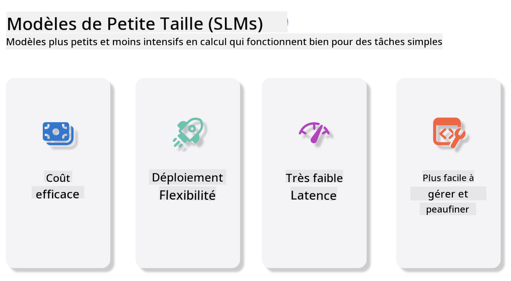
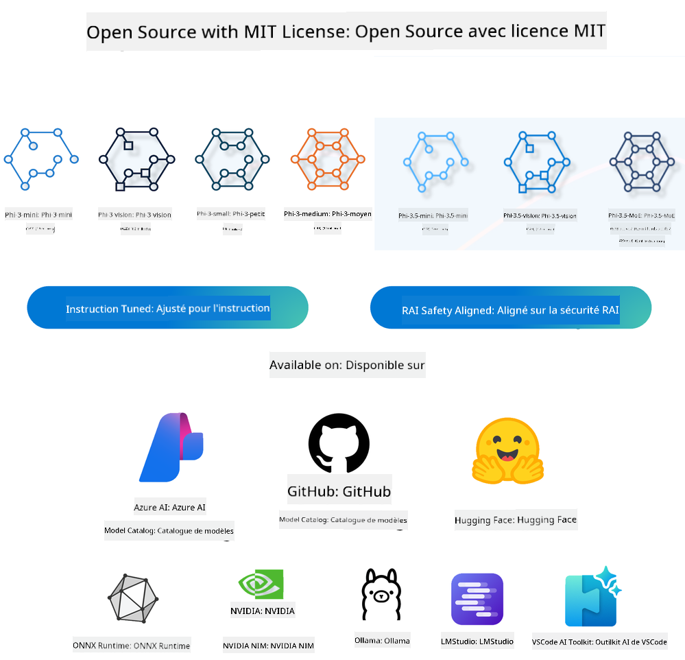
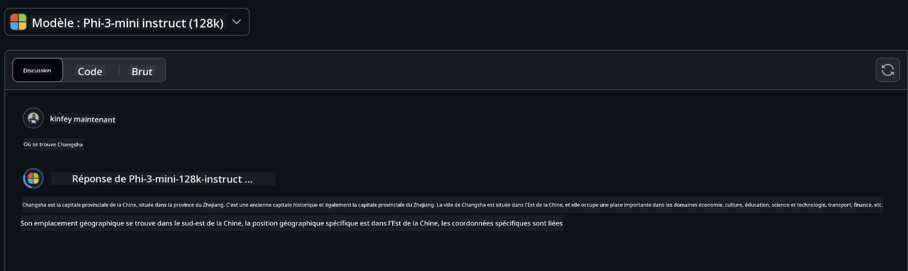
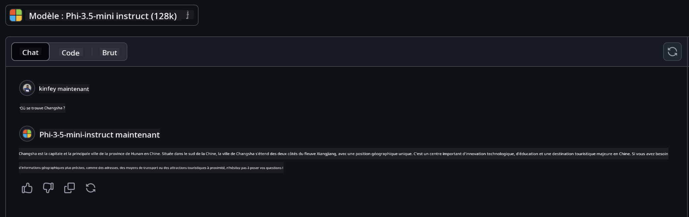

<!--
CO_OP_TRANSLATOR_METADATA:
{
  "original_hash": "124ad36cfe96f74038811b6e2bb93e9d",
  "translation_date": "2025-05-20T08:55:41+00:00",
  "source_file": "19-slm/README.md",
  "language_code": "fr"
}
-->
# Introduction aux petits modèles de langage pour l'IA générative pour les débutants

L'IA générative est un domaine fascinant de l'intelligence artificielle qui se concentre sur la création de systèmes capables de générer du nouveau contenu. Ce contenu peut aller du texte et des images à la musique et même à des environnements virtuels entiers. L'une des applications les plus passionnantes de l'IA générative se trouve dans le domaine des modèles de langage.

## Qu'est-ce que les petits modèles de langage ?

Un petit modèle de langage (SLM) représente une variante réduite d'un grand modèle de langage (LLM), tirant parti de nombreux principes architecturaux et techniques des LLMs, tout en affichant une empreinte computationnelle significativement réduite. Les SLMs sont un sous-ensemble de modèles de langage conçus pour générer du texte de type humain. Contrairement à leurs homologues plus grands, tels que GPT-4, les SLMs sont plus compacts et efficaces, ce qui les rend idéaux pour les applications où les ressources informatiques sont limitées. Malgré leur taille plus petite, ils peuvent encore accomplir une variété de tâches. Typiquement, les SLMs sont construits en compressant ou en distillant des LLMs, dans le but de conserver une partie substantielle de la fonctionnalité et des capacités linguistiques du modèle original. Cette réduction de la taille du modèle diminue la complexité globale, rendant les SLMs plus efficaces en termes d'utilisation de la mémoire et de besoins informatiques. Malgré ces optimisations, les SLMs peuvent encore accomplir une large gamme de tâches de traitement du langage naturel (NLP) :
- Génération de texte : Création de phrases ou de paragraphes cohérents et contextuellement pertinents.
- Complétion de texte : Prédire et compléter des phrases basées sur une invite donnée.
- Traduction : Conversion de texte d'une langue à une autre.
- Résumé : Condenser de longs textes en résumés plus courts et plus digestes.

Bien qu'avec certains compromis en termes de performance ou de profondeur de compréhension par rapport à leurs homologues plus grands.

## Comment fonctionnent les petits modèles de langage ?

Les SLMs sont entraînés sur de vastes quantités de données textuelles. Pendant l'entraînement, ils apprennent les motifs et structures du langage, leur permettant de générer du texte à la fois grammaticalement correct et contextuellement approprié. Le processus d'entraînement implique :
- Collecte de données : Rassembler de grands ensembles de données textuelles provenant de diverses sources.
- Prétraitement : Nettoyer et organiser les données pour les rendre adaptées à l'entraînement.
- Entraînement : Utiliser des algorithmes d'apprentissage machine pour enseigner au modèle comment comprendre et générer du texte.
- Affinage : Ajuster le modèle pour améliorer ses performances sur des tâches spécifiques.

Le développement des SLMs s'aligne avec le besoin croissant de modèles pouvant être déployés dans des environnements à ressources limitées, tels que les appareils mobiles ou les plateformes d'informatique de périphérie, où les LLMs à grande échelle peuvent être impraticables en raison de leurs fortes demandes en ressources. En se concentrant sur l'efficacité, les SLMs équilibrent performance et accessibilité, permettant une application plus large à travers divers domaines.



## Objectifs d'apprentissage

Dans cette leçon, nous espérons introduire la connaissance des SLM et la combiner avec Microsoft Phi-3 pour apprendre différents scénarios dans le contenu textuel, la vision et MoE. À la fin de cette leçon, vous devriez être capable de répondre aux questions suivantes :
- Qu'est-ce qu'un SLM
- Quelle est la différence entre un SLM et un LLM
- Qu'est-ce que la famille Microsoft Phi-3/3.5
- Comment faire l'inférence avec la famille Microsoft Phi-3/3.5

Prêt ? Commençons.

## Les distinctions entre les grands modèles de langage (LLMs) et les petits modèles de langage (SLMs)

Les LLMs et les SLMs sont tous deux construits sur des principes fondamentaux de l'apprentissage machine probabiliste, suivant des approches similaires dans leur conception architecturale, leurs méthodologies d'entraînement, leurs processus de génération de données et leurs techniques d'évaluation de modèle. Cependant, plusieurs facteurs clés différencient ces deux types de modèles.

## Applications des petits modèles de langage

Les SLMs ont une large gamme d'applications, y compris :
- Chatbots : Fournir un support client et interagir avec les utilisateurs de manière conversationnelle.
- Création de contenu : Aider les écrivains en générant des idées ou même en rédigeant des articles entiers.
- Éducation : Aider les étudiants avec des devoirs d'écriture ou l'apprentissage de nouvelles langues.
- Accessibilité : Créer des outils pour les personnes handicapées, tels que les systèmes de synthèse vocale.

**Taille**

Une distinction principale entre les LLMs et les SLMs réside dans l'échelle des modèles. Les LLMs, tels que ChatGPT (GPT-4), peuvent comprendre environ 1,76 trillion de paramètres, tandis que les SLMs open-source comme Mistral 7B sont conçus avec un nombre de paramètres significativement inférieur — environ 7 milliards. Cette disparité est principalement due à des différences dans l'architecture du modèle et les processus d'entraînement. Par exemple, ChatGPT utilise un mécanisme d'attention à l'intérieur d'un cadre encodeur-décodeur, tandis que Mistral 7B utilise l'attention par fenêtre coulissante, ce qui permet un entraînement plus efficace dans un modèle uniquement décodeur. Cette variance architecturale a des implications profondes sur la complexité et la performance de ces modèles.

**Compréhension**

Les SLMs sont typiquement optimisés pour la performance dans des domaines spécifiques, les rendant hautement spécialisés mais potentiellement limités dans leur capacité à fournir une compréhension contextuelle large à travers de multiples champs de connaissance. En revanche, les LLMs visent à simuler l'intelligence humaine de manière plus globale. Entraînés sur de vastes ensembles de données diversifiés, les LLMs sont conçus pour bien performer à travers une variété de domaines, offrant une plus grande polyvalence et adaptabilité. Par conséquent, les LLMs sont plus adaptés à une gamme plus large de tâches en aval, telles que le traitement du langage naturel et la programmation.

**Informatique**

L'entraînement et le déploiement des LLMs sont des processus gourmands en ressources, nécessitant souvent une infrastructure informatique significative, y compris de grands clusters de GPU. Par exemple, entraîner un modèle comme ChatGPT à partir de zéro peut nécessiter des milliers de GPUs sur de longues périodes. En revanche, les SLMs, avec leur nombre de paramètres plus petit, sont plus accessibles en termes de ressources informatiques. Des modèles comme Mistral 7B peuvent être entraînés et exécutés sur des machines locales équipées de capacités GPU modérées, bien que l'entraînement nécessite encore plusieurs heures sur plusieurs GPUs.

**Biais**

Le biais est un problème connu dans les LLMs, principalement en raison de la nature des données d'entraînement. Ces modèles s'appuient souvent sur des données brutes, librement disponibles sur Internet, qui peuvent sous-représenter ou mal représenter certains groupes, introduire un étiquetage erroné ou refléter des biais linguistiques influencés par le dialecte, les variations géographiques et les règles grammaticales. De plus, la complexité des architectures LLM peut involontairement exacerber le biais, qui peut passer inaperçu sans un affinage minutieux. D'autre part, les SLMs, étant entraînés sur des ensembles de données plus restreints et spécifiques à un domaine, sont intrinsèquement moins susceptibles à de tels biais, bien qu'ils n'en soient pas immunisés.

**Inférence**

La taille réduite des SLMs leur confère un avantage significatif en termes de vitesse d'inférence, leur permettant de générer des sorties efficacement sur du matériel local sans avoir besoin d'un traitement parallèle étendu. En revanche, les LLMs, en raison de leur taille et de leur complexité, nécessitent souvent des ressources informatiques parallèles substantielles pour atteindre des temps d'inférence acceptables. La présence de multiples utilisateurs simultanés ralentit encore plus les temps de réponse des LLMs, surtout lorsqu'ils sont déployés à grande échelle.

En résumé, bien que les LLMs et les SLMs partagent une base fondamentale dans l'apprentissage machine, ils diffèrent significativement en termes de taille de modèle, de besoins en ressources, de compréhension contextuelle, de susceptibilité au biais et de vitesse d'inférence. Ces distinctions reflètent leur aptitude respective pour différents cas d'utilisation, les LLMs étant plus polyvalents mais gourmands en ressources, et les SLMs offrant une efficacité plus spécifique au domaine avec des demandes computationnelles réduites.

***Remarque : Dans ce chapitre, nous introduirons les SLM en utilisant Microsoft Phi-3 / 3.5 comme exemple.***

## Introduction à la famille Phi-3 / Phi-3.5

La famille Phi-3 / 3.5 cible principalement les scénarios d'application de texte, de vision et d'agent (MoE) :

### Phi-3 / 3.5 Instruct

Principalement pour la génération de texte, la complétion de chat et l'extraction d'informations de contenu, etc.

**Phi-3-mini**

Le modèle de langage 3.8B est disponible sur Microsoft Azure AI Studio, Hugging Face et Ollama. Les modèles Phi-3 surpassent significativement les modèles de langage de tailles égales et plus grandes sur des benchmarks clés (voir les chiffres de benchmark ci-dessous, des chiffres plus élevés sont meilleurs). Phi-3-mini surpasse des modèles deux fois plus grands, tandis que Phi-3-small et Phi-3-medium surpassent des modèles plus grands, y compris GPT-3.5

**Phi-3-small & medium**

Avec seulement 7 milliards de paramètres, Phi-3-small bat GPT-3.5T sur une variété de benchmarks de langage, de raisonnement, de codage et de mathématiques. Le Phi-3-medium avec 14 milliards de paramètres poursuit cette tendance et surpasse le Gemini 1.0 Pro.

**Phi-3.5-mini**

On peut le considérer comme une mise à niveau de Phi-3-mini. Bien que les paramètres restent inchangés, il améliore la capacité à prendre en charge plusieurs langues (supporte 20+ langues : arabe, chinois, tchèque, danois, néerlandais, anglais, finnois, français, allemand, hébreu, hongrois, italien, japonais, coréen, norvégien, polonais, portugais, russe, espagnol, suédois, thaï, turc, ukrainien) et ajoute un support plus fort pour le contexte long. Phi-3.5-mini avec 3.8 milliards de paramètres surpasse les modèles de langage de même taille et est au niveau des modèles deux fois plus grands.

### Phi-3 / 3.5 Vision

On peut considérer le modèle Instruct de Phi-3/3.5 comme la capacité de Phi à comprendre, et Vision est ce qui donne à Phi des yeux pour comprendre le monde.

**Phi-3-Vision**

Phi-3-vision, avec seulement 4.2 milliards de paramètres, poursuit cette tendance et surpasse des modèles plus grands tels que Claude-3 Haiku et Gemini 1.0 Pro V sur des tâches de raisonnement visuel général, OCR, et de compréhension de tableaux et de diagrammes.

**Phi-3.5-Vision**

Phi-3.5-Vision est également une mise à niveau de Phi-3-Vision, ajoutant le support pour plusieurs images. Vous pouvez le considérer comme une amélioration de la vision, non seulement vous pouvez voir des images, mais aussi des vidéos. Phi-3.5-vision surpasse des modèles plus grands tels que Claude-3.5 Sonnet et Gemini 1.5 Flash à travers l'OCR, la compréhension de tableaux et de graphiques et à égalité sur des tâches de raisonnement de connaissances visuelles générales. Supporte l'entrée multi-cadres, c'est-à-dire effectue le raisonnement sur plusieurs images d'entrée.

### Phi-3.5-MoE

***Mixture of Experts (MoE)*** permet aux modèles d'être préentraînés avec beaucoup moins de calcul, ce qui signifie que vous pouvez augmenter considérablement la taille du modèle ou du jeu de données avec le même budget de calcul qu'un modèle dense. En particulier, un modèle MoE devrait atteindre la même qualité que son homologue dense beaucoup plus rapidement pendant le préentraînement. Phi-3.5-MoE comprend 16 modules experts de 3.8 milliards. Phi-3.5-MoE avec seulement 6.6 milliards de paramètres actifs atteint un niveau similaire de raisonnement, de compréhension du langage et de mathématiques que des modèles beaucoup plus grands.

Nous pouvons utiliser le modèle de la famille Phi-3/3.5 en fonction de différents scénarios. Contrairement au LLM, vous pouvez déployer Phi-3/3.5-mini ou Phi-3/3.5-Vision sur des appareils de périphérie.

## Comment utiliser les modèles de la famille Phi-3/3.5

Nous espérons utiliser Phi-3/3.5 dans différents scénarios. Ensuite, nous utiliserons Phi-3/3.5 en fonction de différents scénarios.



### Différence d'inférence

API du Cloud

**Modèles GitHub**

GitHub
Les modèles sont la manière la plus directe. Vous pouvez rapidement accéder au modèle Phi-3/3.5-Instruct via GitHub Models. Combiné avec le SDK Azure AI Inference / OpenAI SDK, vous pouvez accéder à l'API via du code pour effectuer l'appel Phi-3/3.5-Instruct. Vous pouvez également tester différents effets via Playground. - Démo : Comparaison des effets de Phi-3-mini et Phi-3.5-mini dans des scénarios chinois   **Azure AI Studio** Ou si nous voulons utiliser les modèles vision et MoE, vous pouvez utiliser Azure AI Studio pour effectuer l'appel. Si vous êtes intéressé, vous pouvez lire le Phi-3 Cookbook pour apprendre comment appeler Phi-3/3.5 Instruct, Vision, MoE via Azure AI Studio [Cliquez sur ce lien](https://github.com/microsoft/Phi-3CookBook/blob/main/md/02.QuickStart/AzureAIStudio_QuickStart.md?WT.mc_id=academic-105485-koreyst) **NVIDIA NIM** En plus des solutions de catalogue de modèles basées sur le cloud fournies par Azure et GitHub, vous pouvez également utiliser [Nivida NIM](https://developer.nvidia.com/nim?WT.mc_id=academic-105485-koreyst) pour effectuer les appels connexes. Vous pouvez visiter NIVIDA NIM pour effectuer les appels API de la famille Phi-3/3.5. NVIDIA NIM (NVIDIA Inference Microservices) est un ensemble de microservices d'inférence accélérée conçus pour aider les développeurs à déployer des modèles d'IA efficacement dans divers environnements, y compris les clouds, les centres de données et les stations de travail. Voici quelques caractéristiques clés de NVIDIA NIM : - **Facilité de déploiement :** NIM permet le déploiement de modèles d'IA avec une seule commande, ce qui le rend facile à intégrer dans les flux de travail existants. - **Performance optimisée :** Il utilise les moteurs d'inférence pré-optimisés de NVIDIA, tels que TensorRT et TensorRT-LLM, pour garantir une faible latence et un débit élevé. - **Évolutivité :** NIM prend en charge l'auto-scaling sur Kubernetes, lui permettant de gérer efficacement des charges de travail variables. - **Sécurité et contrôle :** Les organisations peuvent garder le contrôle sur leurs données et applications en hébergeant elles-mêmes les microservices NIM sur leur propre infrastructure gérée. - **APIs standard :** NIM fournit des APIs standard de l'industrie, facilitant la création et l'intégration d'applications d'IA telles que des chatbots, des assistants IA, et plus encore. NIM fait partie de NVIDIA AI Enterprise, qui vise à simplifier le déploiement et l'opérationnalisation des modèles d'IA, garantissant qu'ils fonctionnent efficacement sur les GPU NVIDIA. - Démo : Utilisation de Nividia NIM pour appeler Phi-3.5-Vision-API [[Cliquez sur ce lien](../../../19-slm/python/Phi-3-Vision-Nividia-NIM.ipynb)] ### Inférence Phi-3/3.5 en environnement local L'inférence en relation avec Phi-3, ou tout modèle de langage comme GPT-3, fait référence au processus de génération de réponses ou de prédictions basées sur l'entrée qu'il reçoit. Lorsque vous fournissez une invite ou une question à Phi-3, il utilise son réseau neuronal entraîné pour déduire la réponse la plus probable et pertinente en analysant les motifs et les relations dans les données sur lesquelles il a été formé. **Hugging Face Transformer** Hugging Face Transformers est une bibliothèque puissante conçue pour le traitement du langage naturel (NLP) et d'autres tâches d'apprentissage automatique. Voici quelques points clés à son sujet : 1. **Modèles pré-entraînés :** Elle fournit des milliers de modèles pré-entraînés qui peuvent être utilisés pour diverses tâches telles que la classification de texte, la reconnaissance d'entités nommées, la réponse aux questions, la summarisation, la traduction et la génération de texte. 2. **Interopérabilité des frameworks :** La bibliothèque prend en charge plusieurs frameworks d'apprentissage profond, y compris PyTorch, TensorFlow et JAX. Cela vous permet d'entraîner un modèle dans un framework et de l'utiliser dans un autre. 3. **Capacités multimodales :** En plus du NLP, Hugging Face Transformers prend également en charge les tâches de vision par ordinateur (par exemple, classification d'images, détection d'objets) et de traitement audio (par exemple, reconnaissance vocale, classification audio). 4. **Facilité d'utilisation :** La bibliothèque offre des APIs et des outils pour télécharger et affiner facilement les modèles, la rendant accessible tant aux débutants qu'aux experts. 5. **Communauté et ressources :** Hugging Face a une communauté dynamique et une documentation, des tutoriels et des guides étendus pour aider les utilisateurs à démarrer et à tirer le meilleur parti de la bibliothèque. [documentation officielle](https://huggingface.co/docs/transformers/index?WT.mc_id=academic-105485-koreyst) ou leur [répertoire GitHub](https://github.com/huggingface/transformers?WT.mc_id=academic-105485-koreyst). C'est la méthode la plus couramment utilisée, mais elle nécessite également une accélération GPU. Après tout, des scènes telles que Vision et MoE nécessitent beaucoup de calculs, ce qui sera très limité dans le CPU s'ils ne sont pas quantifiés. - Démo : Utilisation de Transformer pour appeler Phi-3.5-Instuct [Cliquez sur ce lien](../../../19-slm/python/phi35-instruct-demo.ipynb) - Démo : Utilisation de Transformer pour appeler Phi-3.5-Vision[Cliquez sur ce lien](../../../19-slm/python/phi35-vision-demo.ipynb) - Démo : Utilisation de Transformer pour appeler Phi-3.5-MoE[Cliquez sur ce lien](../../../19-slm/python/phi35_moe_demo.ipynb) **Ollama** [Ollama](https://ollama.com/?WT.mc_id=academic-105485-koreyst) est une plateforme conçue pour faciliter l'exécution de grands modèles de langage (LLMs) localement sur votre machine. Elle prend en charge divers modèles tels que Llama 3.1, Phi 3, Mistral, et Gemma 2, entre autres. La plateforme simplifie le processus en regroupant les poids du modèle, la configuration et les données en un seul package, la rendant plus accessible pour les utilisateurs souhaitant personnaliser et créer leurs propres modèles. Ollama est disponible pour macOS, Linux, et Windows. C'est un excellent outil si vous cherchez à expérimenter ou déployer des LLMs sans dépendre des services cloud. Ollama est la manière la plus directe, vous devez simplement exécuter la déclaration suivante. ```bash

ollama run phi3.5

``` **ONNX Runtime pour GenAI** [ONNX Runtime](https://github.com/microsoft/onnxruntime-genai?WT.mc_id=academic-105485-koreyst) est un accélérateur d'apprentissage automatique d'inférence et de formation multiplateforme. ONNX Runtime pour Generative AI (GENAI) est un outil puissant qui vous aide à exécuter des modèles d'IA générative efficacement sur diverses plateformes. ## Qu'est-ce que ONNX Runtime? ONNX Runtime est un projet open-source qui permet l'inférence haute performance des modèles d'apprentissage automatique. Il prend en charge les modèles au format Open Neural Network Exchange (ONNX), qui est un standard pour représenter les modèles d'apprentissage automatique. L'inférence ONNX Runtime peut permettre des expériences client plus rapides et des coûts réduits, prenant en charge les modèles des frameworks d'apprentissage profond tels que PyTorch et TensorFlow/Keras ainsi que des bibliothèques d'apprentissage automatique classiques telles que scikit-learn, LightGBM, XGBoost, etc. ONNX Runtime est compatible avec différents matériels, pilotes et systèmes d'exploitation, et offre des performances optimales en tirant parti des accélérateurs matériels lorsque cela est applicable aux côtés des optimisations et transformations graphiques ## Qu'est-ce que l'IA générative? L'IA générative fait référence aux systèmes d'IA capables de générer de nouveaux contenus, tels que du texte, des images ou de la musique, en fonction des données sur lesquelles ils ont été formés. Les exemples incluent des modèles de langage comme GPT-3 et des modèles de génération d'images comme Stable Diffusion. La bibliothèque ONNX Runtime pour GenAI fournit la boucle d'IA générative pour les modèles ONNX, y compris l'inférence avec ONNX Runtime, le traitement des logits, la recherche et l'échantillonnage, et la gestion du cache KV. ## ONNX Runtime pour GENAI ONNX Runtime pour GENAI étend les capacités de ONNX Runtime pour prendre en charge les modèles d'IA générative. Voici quelques caractéristiques clés : - **Support étendu des plateformes :** Il fonctionne sur diverses plateformes, y compris Windows, Linux, macOS, Android, et iOS. - **Support des modèles :** Il prend en charge de nombreux modèles d'IA générative populaires, tels que LLaMA, GPT-Neo, BLOOM, et plus encore. - **Optimisation des performances :** Il inclut des optimisations pour différents accélérateurs matériels comme les GPU NVIDIA, les GPU AMD, et plus encore. - **Facilité d'utilisation :** Il fournit des APIs pour une intégration facile dans les applications, vous permettant de générer du texte, des images, et d'autres contenus avec un code minimal - Les utilisateurs peuvent appeler une méthode generate() de haut niveau, ou exécuter chaque itération du modèle dans une boucle, générant un token à la fois, et éventuellement mettre à jour les paramètres de génération à l'intérieur de la boucle. - Le runtime ONNX a également un support pour la recherche gourmande/faisceau et l'échantillonnage TopP, TopK pour générer des séquences de tokens et le traitement intégré des logits comme les pénalités de répétition. Vous pouvez également facilement ajouter un scoring personnalisé. ## Pour commencer Pour commencer avec ONNX Runtime pour GENAI, vous pouvez suivre ces étapes : ### Installer ONNX Runtime : ```Python
pip install onnxruntime
``` ### Installer les extensions d'IA générative : ```Python
pip install onnxruntime-genai
``` ### Exécuter un modèle : Voici un exemple simple en Python : ```Python
import onnxruntime_genai as og

model = og.Model('path_to_your_model.onnx')

tokenizer = og.Tokenizer(model)

input_text = "Hello, how are you?"

input_tokens = tokenizer.encode(input_text)

output_tokens = model.generate(input_tokens)

output_text = tokenizer.decode(output_tokens)

print(output_text) 
``` ### Démo : Utilisation de ONNX Runtime GenAI pour appeler Phi-3.5-Vision ```python

import onnxruntime_genai as og

model_path = './Your Phi-3.5-vision-instruct ONNX Path'

img_path = './Your Image Path'

model = og.Model(model_path)

processor = model.create_multimodal_processor()

tokenizer_stream = processor.create_stream()

text = "Your Prompt"

prompt = "<|user|>\n"

prompt += "<|image_1|>\n"

prompt += f"{text}<|end|>\n"

prompt += "<|assistant|>\n"

image = og.Images.open(img_path)

inputs = processor(prompt, images=image)

params = og.GeneratorParams(model)

params.set_inputs(inputs)

params.set_search_options(max_length=3072)

generator = og.Generator(model, params)

while not generator.is_done():

    generator.compute_logits()
    
    generator.generate_next_token()

    new_token = generator.get_next_tokens()[0]
    
    code += tokenizer_stream.decode(new_token)
    
    print(tokenizer_stream.decode(new_token), end='', flush=True)

``` **Autres** En plus des méthodes de référence ONNX Runtime et Ollama, nous pouvons également compléter la référence des modèles quantitatifs basés sur les méthodes de référence de modèle fournies par différents fabricants. Comme le framework Apple MLX avec Apple Metal, Qualcomm QNN avec NPU, Intel OpenVINO avec CPU/GPU, etc. Vous pouvez également obtenir plus de contenu du [Phi-3 Cookbook](https://github.com/microsoft/phi-3cookbook?WT.mc_id=academic-105485-koreyst) ## Plus Nous avons appris les bases de la famille Phi-3/3.5, mais pour en savoir plus sur SLM, nous avons besoin de plus de connaissances. Vous pouvez trouver les réponses dans le Phi-3 Cookbook. Si vous souhaitez en savoir plus, veuillez visiter le [Phi-3 Cookbook](https://github.com/microsoft/phi-3cookbook?WT.mc_id=academic-105485-koreyst).

**Avertissement** :  
Ce document a été traduit en utilisant le service de traduction IA [Co-op Translator](https://github.com/Azure/co-op-translator). Bien que nous nous efforcions d'assurer l'exactitude, veuillez noter que les traductions automatisées peuvent contenir des erreurs ou des inexactitudes. Le document original dans sa langue native doit être considéré comme la source faisant autorité. Pour des informations critiques, une traduction professionnelle par un humain est recommandée. Nous ne sommes pas responsables des malentendus ou des interprétations erronées résultant de l'utilisation de cette traduction.