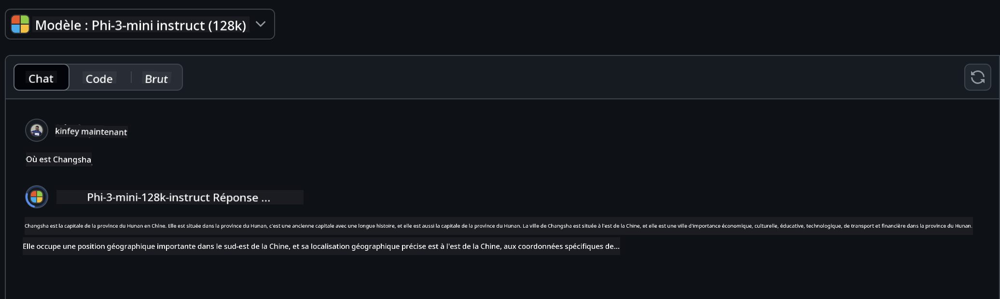
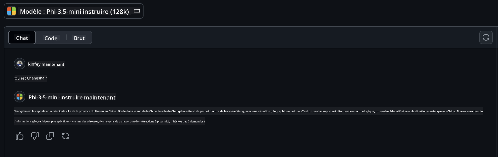

<!--
CO_OP_TRANSLATOR_METADATA:
{
  "original_hash": "124ad36cfe96f74038811b6e2bb93e9d",
  "translation_date": "2025-06-26T01:25:56+00:00",
  "source_file": "19-slm/README.md",
  "language_code": "fr"
}
-->

Models est le moyen le plus direct. Vous pouvez rapidement accéder au modèle Phi-3/3.5-Instruct via GitHub Models. Combiné avec le SDK Azure AI Inference / OpenAI SDK, vous pouvez accéder à l'API via le code pour effectuer l'appel Phi-3/3.5-Instruct. Vous pouvez également tester différents effets via Playground. - Démo : Comparaison des effets de Phi-3-mini et Phi-3.5-mini dans des scénarios chinois   **Azure AI Studio** Ou si nous voulons utiliser les modèles vision et MoE, vous pouvez utiliser Azure AI Studio pour effectuer l'appel. Si vous êtes intéressé, vous pouvez lire le Phi-3 Cookbook pour apprendre à appeler Phi-3/3.5 Instruct, Vision, MoE via Azure AI Studio [Cliquez sur ce lien](https://github.com/microsoft/Phi-3CookBook/blob/main/md/02.QuickStart/AzureAIStudio_QuickStart.md?WT.mc_id=academic-105485-koreyst) **NVIDIA NIM** En plus des solutions de catalogue de modèles basées sur le cloud fournies par Azure et GitHub, vous pouvez également utiliser [Nivida NIM](https://developer.nvidia.com/nim?WT.mc_id=academic-105485-koreyst) pour effectuer des appels associés. Vous pouvez visiter NIVIDA NIM pour effectuer les appels API de la famille Phi-3/3.5. NVIDIA NIM (NVIDIA Inference Microservices) est un ensemble de microservices d'inférence accélérés conçus pour aider les développeurs à déployer des modèles d'IA efficacement dans divers environnements, y compris les clouds, les centres de données et les stations de travail. Voici quelques caractéristiques clés de NVIDIA NIM : - **Facilité de déploiement :** NIM permet le déploiement de modèles d'IA avec une seule commande, ce qui le rend facile à intégrer dans les flux de travail existants. - **Performance optimisée :** Il utilise les moteurs d'inférence pré-optimisés de NVIDIA, tels que TensorRT et TensorRT-LLM, pour assurer une faible latence et un débit élevé. - **Scalabilité :** NIM prend en charge l'auto-scalabilité sur Kubernetes, lui permettant de gérer efficacement des charges de travail variées. - **Sécurité et contrôle :** Les organisations peuvent maintenir le contrôle sur leurs données et applications en hébergeant elles-mêmes les microservices NIM sur leur propre infrastructure gérée. - **APIs standard :** NIM fournit des APIs standard de l'industrie, facilitant la création et l'intégration d'applications d'IA telles que les chatbots, les assistants IA, et plus encore. NIM fait partie de NVIDIA AI Enterprise, qui vise à simplifier le déploiement et l'opérationnalisation des modèles d'IA, garantissant qu'ils fonctionnent efficacement sur les GPU NVIDIA. - Démo : Utilisation de Nividia NIM pour appeler Phi-3.5-Vision-API [[Cliquez sur ce lien](../../../19-slm/python/Phi-3-Vision-Nividia-NIM.ipynb)] ### Inférence Phi-3/3.5 dans l'environnement local L'inférence par rapport à Phi-3, ou tout modèle de langage comme GPT-3, fait référence au processus de génération de réponses ou de prédictions basées sur l'entrée qu'il reçoit. Lorsque vous fournissez un prompt ou une question à Phi-3, il utilise son réseau neuronal entraîné pour déduire la réponse la plus probable et pertinente en analysant les motifs et les relations dans les données sur lesquelles il a été entraîné. **Hugging Face Transformer** Hugging Face Transformers est une bibliothèque puissante conçue pour le traitement du langage naturel (NLP) et d'autres tâches d'apprentissage automatique. Voici quelques points clés à son sujet : 1. **Modèles préentraînés :** Elle fournit des milliers de modèles préentraînés qui peuvent être utilisés pour diverses tâches telles que la classification de texte, la reconnaissance d'entités nommées, la réponse aux questions, la synthèse, la traduction et la génération de texte. 2. **Interopérabilité des frameworks :** La bibliothèque prend en charge plusieurs frameworks d'apprentissage profond, notamment PyTorch, TensorFlow et JAX. Cela vous permet d'entraîner un modèle dans un framework et de l'utiliser dans un autre. 3. **Capacités multimodales :** En plus du NLP, Hugging Face Transformers prend également en charge les tâches de vision par ordinateur (par exemple, classification d'images, détection d'objets) et de traitement audio (par exemple, reconnaissance vocale, classification audio). 4. **Facilité d'utilisation :** La bibliothèque offre des APIs et des outils pour télécharger et affiner facilement les modèles, ce qui la rend accessible aux débutants et aux experts. 5. **Communauté et ressources :** Hugging Face a une communauté dynamique et une documentation, des tutoriels et des guides étendus pour aider les utilisateurs à démarrer et à tirer le meilleur parti de la bibliothèque. [documentation officielle](https://huggingface.co/docs/transformers/index?WT.mc_id=academic-105485-koreyst) ou leur [répertoire GitHub](https://github.com/huggingface/transformers?WT.mc_id=academic-105485-koreyst). C'est la méthode la plus couramment utilisée, mais elle nécessite également une accélération GPU. Après tout, des scènes telles que Vision et MoE nécessitent beaucoup de calculs, ce qui sera très limité sur le CPU s'ils ne sont pas quantifiés. - Démo : Utilisation de Transformer pour appeler Phi-3.5-Instruct [Cliquez sur ce lien](../../../19-slm/python/phi35-instruct-demo.ipynb) - Démo : Utilisation de Transformer pour appeler Phi-3.5-Vision [Cliquez sur ce lien](../../../19-slm/python/phi35-vision-demo.ipynb) - Démo : Utilisation de Transformer pour appeler Phi-3.5-MoE [Cliquez sur ce lien](../../../19-slm/python/phi35_moe_demo.ipynb) **Ollama** [Ollama](https://ollama.com/?WT.mc_id=academic-105485-koreyst) est une plateforme conçue pour faciliter l'exécution de grands modèles de langage (LLMs) localement sur votre machine. Elle prend en charge divers modèles tels que Llama 3.1, Phi 3, Mistral, et Gemma 2, entre autres. La plateforme simplifie le processus en regroupant les poids du modèle, la configuration et les données dans un seul package, le rendant plus accessible pour les utilisateurs afin de personnaliser et créer leurs propres modèles. Ollama est disponible pour macOS, Linux et Windows. C'est un excellent outil si vous cherchez à expérimenter ou déployer des LLMs sans dépendre des services cloud. Ollama est le moyen le plus direct, vous n'avez qu'à exécuter la déclaration suivante. ```bash

ollama run phi3.5

``` **ONNX Runtime pour GenAI** [ONNX Runtime](https://github.com/microsoft/onnxruntime-genai?WT.mc_id=academic-105485-koreyst) est un accélérateur d'apprentissage automatique pour l'inférence et l'entraînement multiplateforme. ONNX Runtime pour Generative AI (GENAI) est un outil puissant qui vous aide à exécuter des modèles d'IA générative efficacement sur diverses plateformes. ## Qu'est-ce que ONNX Runtime? ONNX Runtime est un projet open-source qui permet une inférence haute performance des modèles d'apprentissage automatique. Il prend en charge les modèles au format Open Neural Network Exchange (ONNX), qui est un standard pour représenter les modèles d'apprentissage automatique. L'inférence ONNX Runtime peut permettre des expériences client plus rapides et des coûts réduits, en prenant en charge des modèles provenant de frameworks d'apprentissage profond tels que PyTorch et TensorFlow/Keras ainsi que des bibliothèques d'apprentissage automatique classiques telles que scikit-learn, LightGBM, XGBoost, etc. ONNX Runtime est compatible avec différents matériels, pilotes et systèmes d'exploitation, et offre des performances optimales en tirant parti des accélérateurs matériels lorsque cela est applicable, ainsi que des optimisations et transformations de graphes ## Qu'est-ce que l'IA générative? L'IA générative fait référence aux systèmes d'IA qui peuvent générer du nouveau contenu, tel que du texte, des images ou de la musique, en fonction des données sur lesquelles ils ont été entraînés. Les exemples incluent les modèles de langage comme GPT-3 et les modèles de génération d'images comme Stable Diffusion. La bibliothèque ONNX Runtime pour GenAI fournit la boucle d'IA générative pour les modèles ONNX, y compris l'inférence avec ONNX Runtime, le traitement des logits, la recherche et l'échantillonnage, et la gestion du cache KV. ## ONNX Runtime pour GENAI ONNX Runtime pour GENAI étend les capacités de ONNX Runtime pour prendre en charge les modèles d'IA générative. Voici quelques caractéristiques clés : - **Large support de plateforme :** Il fonctionne sur diverses plateformes, y compris Windows, Linux, macOS, Android et iOS. - **Support de modèle :** Il prend en charge de nombreux modèles d'IA générative populaires, tels que LLaMA, GPT-Neo, BLOOM, et plus encore. - **Optimisation des performances :** Il inclut des optimisations pour différents accélérateurs matériels comme les GPU NVIDIA, les GPU AMD, et plus encore. - **Facilité d'utilisation :** Il fournit des APIs pour une intégration facile dans les applications, vous permettant de générer du texte, des images et d'autres contenus avec un minimum de code. - Les utilisateurs peuvent appeler une méthode generate() de haut niveau, ou exécuter chaque itération du modèle dans une boucle, générant un token à la fois, et éventuellement mettre à jour les paramètres de génération à l'intérieur de la boucle. - ONNX Runtime prend également en charge la recherche gloutonne/beam et l'échantillonnage TopP, TopK pour générer des séquences de tokens et le traitement intégré des logits comme les pénalités de répétition. Vous pouvez également facilement ajouter une notation personnalisée. ## Pour commencer Pour commencer avec ONNX Runtime pour GENAI, vous pouvez suivre ces étapes : ### Installer ONNX Runtime : ```Python
pip install onnxruntime
``` ### Installer les extensions d'IA générative : ```Python
pip install onnxruntime-genai
``` ### Exécuter un modèle : Voici un exemple simple en Python : ```Python
import onnxruntime_genai as og

model = og.Model('path_to_your_model.onnx')

tokenizer = og.Tokenizer(model)

input_text = "Hello, how are you?"

input_tokens = tokenizer.encode(input_text)

output_tokens = model.generate(input_tokens)

output_text = tokenizer.decode(output_tokens)

print(output_text) 
``` ### Démo : Utilisation de ONNX Runtime GenAI pour appeler Phi-3.5-Vision ```python

import onnxruntime_genai as og

model_path = './Your Phi-3.5-vision-instruct ONNX Path'

img_path = './Your Image Path'

model = og.Model(model_path)

processor = model.create_multimodal_processor()

tokenizer_stream = processor.create_stream()

text = "Your Prompt"

prompt = "<|user|>\n"

prompt += "<|image_1|>\n"

prompt += f"{text}<|end|>\n"

prompt += "<|assistant|>\n"

image = og.Images.open(img_path)

inputs = processor(prompt, images=image)

params = og.GeneratorParams(model)

params.set_inputs(inputs)

params.set_search_options(max_length=3072)

generator = og.Generator(model, params)

while not generator.is_done():

    generator.compute_logits()
    
    generator.generate_next_token()

    new_token = generator.get_next_tokens()[0]
    
    code += tokenizer_stream.decode(new_token)
    
    print(tokenizer_stream.decode(new_token), end='', flush=True)

``` **Autres** En plus des méthodes de référence ONNX Runtime et Ollama, nous pouvons également compléter la référence de modèles quantitatifs en fonction des méthodes de référence de modèles fournies par différents fabricants. Tels que le framework Apple MLX avec Apple Metal, Qualcomm QNN avec NPU, Intel OpenVINO avec CPU/GPU, etc. Vous pouvez également obtenir plus de contenu à partir de [Phi-3 Cookbook](https://github.com/microsoft/phi-3cookbook?WT.mc_id=academic-105485-koreyst) ## Plus Nous avons appris les bases de la famille Phi-3/3.5, mais pour en savoir plus sur SLM, nous avons besoin de plus de connaissances. Vous pouvez trouver les réponses dans le Phi-3 Cookbook. Si vous voulez en savoir plus, veuillez visiter le [Phi-3 Cookbook](https://github.com/microsoft/phi-3cookbook?WT.mc_id=academic-105485-koreyst).

**Avertissement** :  
Ce document a été traduit à l'aide du service de traduction IA [Co-op Translator](https://github.com/Azure/co-op-translator). Bien que nous nous efforcions d'assurer l'exactitude, veuillez noter que les traductions automatiques peuvent contenir des erreurs ou des inexactitudes. Le document original dans sa langue d'origine doit être considéré comme la source faisant autorité. Pour des informations critiques, une traduction humaine professionnelle est recommandée. Nous ne sommes pas responsables des malentendus ou des interprétations erronées résultant de l'utilisation de cette traduction.