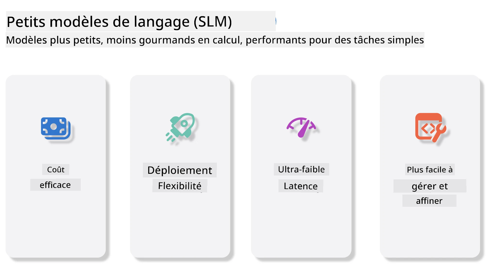
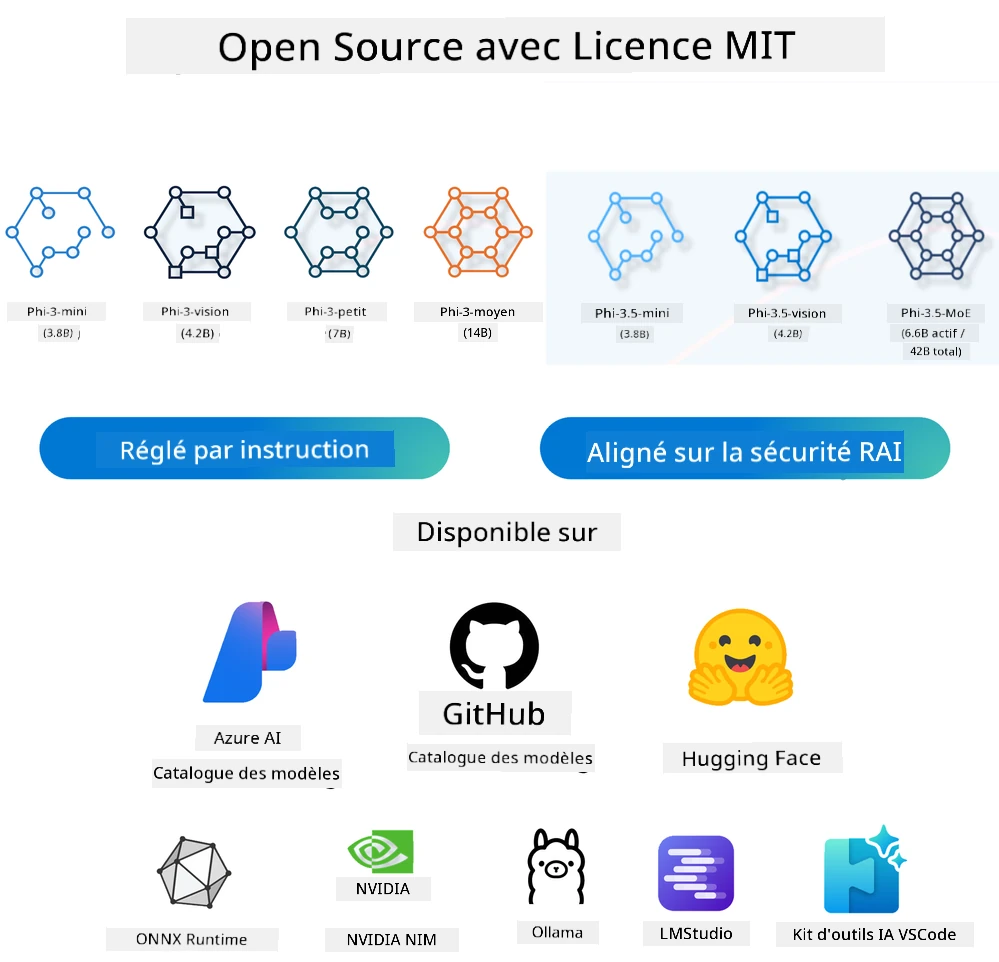
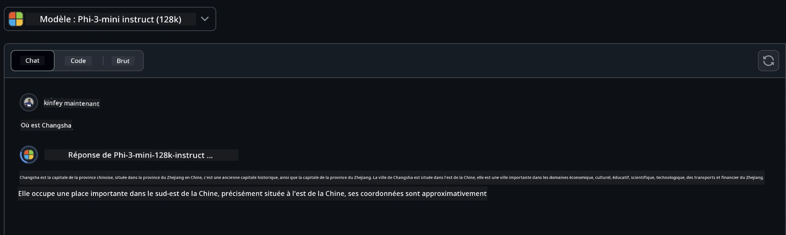
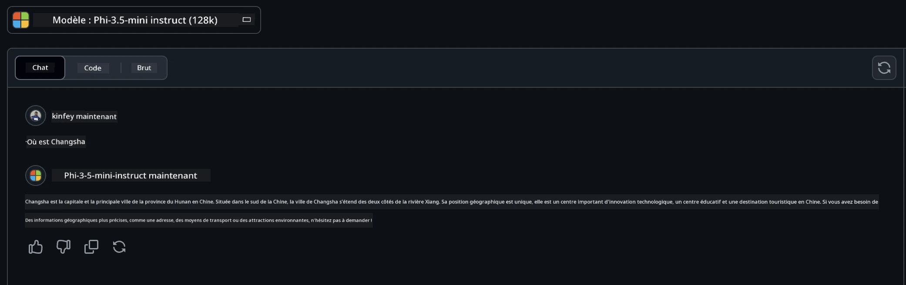

# Introduction aux petits modèles de langage pour l’IA générative pour débutants
L’IA générative est un domaine fascinant de l’intelligence artificielle qui se concentre sur la création de systèmes capables de générer du contenu nouveau. Ce contenu peut aller du texte et des images à la musique et même à des environnements virtuels entiers. L’une des applications les plus excitantes de l’IA générative se trouve dans le domaine des modèles de langage.

## Que sont les petits modèles de langage ?

Un petit modèle de langage (Small Language Model, SLM) représente une variante réduite d’un grand modèle de langage (LLM), utilisant bon nombre des principes architecturaux et des techniques des LLM, tout en affichant une empreinte computationnelle significativement réduite.

Les SLM sont un sous-ensemble de modèles de langage conçus pour générer un texte semblable à celui produit par un humain. Contrairement à leurs homologues plus grands, tels que GPT-4, les SLM sont plus compacts et efficaces, ce qui les rend idéaux pour des applications où les ressources informatiques sont limitées. Malgré leur petite taille, ils peuvent effectuer diverses tâches. En général, les SLM sont construits en compressant ou distillant des LLM, dans le but de conserver une grande partie des fonctionnalités et capacités linguistiques du modèle original. Cette réduction de la taille du modèle diminue la complexité globale, rendant les SLM plus efficaces en termes d’utilisation de mémoire et de besoins informatiques. Malgré ces optimisations, les SLM peuvent toujours réaliser un large éventail de tâches de traitement du langage naturel (NLP) :

- Génération de texte : création de phrases ou paragraphes cohérents et contextuellement pertinents.
- Complétion de texte : prédiction et complétion de phrases à partir d’un prompt donné.
- Traduction : conversion de texte d’une langue à une autre.
- Résumé : condensation de longs textes en résumés plus courts et digestes.

Cependant, cela implique certains compromis en termes de performance ou de profondeur de compréhension comparativement à leurs grands homologues.

## Comment fonctionnent les petits modèles de langage ?
Les SLM sont entraînés sur d’énormes quantités de données textuelles. Pendant l’entraînement, ils apprennent les motifs et structures du langage, leur permettant de générer du texte à la fois grammaticalement correct et contextuellement approprié. Le processus d’entraînement comprend :

- Collecte de données : rassemblement de larges ensembles de données textuelles provenant de diverses sources.
- Prétraitement : nettoyage et organisation des données pour les rendre adaptées à l’entraînement.
- Entraînement : utilisation d’algorithmes d’apprentissage automatique pour enseigner au modèle comment comprendre et générer du texte.
- Affinage : ajustement du modèle pour améliorer ses performances sur des tâches spécifiques.

Le développement des SLM répond au besoin croissant de modèles pouvant être déployés dans des environnements aux ressources limitées, comme les appareils mobiles ou les plateformes de calcul en périphérie, où les LLM à grande échelle peuvent être impraticables en raison de leurs lourdes exigences en ressources. En mettant l’accent sur l’efficacité, les SLM équilibrent performance et accessibilité, permettant une application plus large dans divers domaines.



## Objectifs d’apprentissage

Dans cette leçon, nous espérons introduire la connaissance des SLM et la combiner avec Microsoft Phi-3 pour apprendre différents scénarios dans le contenu textuel, la vision et MoE.

À la fin de cette leçon, vous devriez être capable de répondre aux questions suivantes :

- Qu’est-ce qu’un SLM ?
- Quelle est la différence entre un SLM et un LLM ?
- Qu’est-ce que la famille Microsoft Phi-3/3.5 ?
- Comment exécuter une inférence avec la famille Microsoft Phi-3/3.5 ?

Prêt ? Commençons.

## Les distinctions entre les grands modèles de langage (LLM) et les petits modèles de langage (SLM)

Les LLM et les SLM reposent tous deux sur des principes fondamentaux d’apprentissage machine probabiliste, suivant des approches similaires dans leur conception architecturale, leurs méthodologies d’entraînement, leurs processus de génération de données et leurs techniques d’évaluation des modèles. Cependant, plusieurs facteurs clés distinguent ces deux types de modèles.

## Applications des petits modèles de langage

Les SLM ont un large éventail d’applications, notamment :

- Chatbots : fournir un support client et interagir avec les utilisateurs de façon conversationnelle.
- Création de contenu : assister les écrivains en générant des idées ou même en rédigeant des articles entiers.
- Éducation : aider les étudiants dans leurs rédactions ou l’apprentissage de nouvelles langues.
- Accessibilité : créer des outils pour les personnes en situation de handicap, comme les systèmes de synthèse vocale.

**Taille**

Une distinction principale entre les LLM et les SLM réside dans l’échelle des modèles. Les LLM, tels que ChatGPT (GPT-4), peuvent contenir environ 1,76 trillion de paramètres, tandis que des SLM open source comme Mistral 7B sont conçus avec beaucoup moins de paramètres — environ 7 milliards. Cette disparité s’explique principalement par des différences dans l’architecture des modèles et leurs processus d’entraînement. Par exemple, ChatGPT utilise un mécanisme d’attention auto-référencé dans une architecture encodeur-décodeur, tandis que Mistral 7B emploie une attention par fenêtre glissante, ce qui permet un entraînement plus efficace dans un modèle uniquement décodeur. Cette différence architecturale a des implications importantes sur la complexité et la performance de ces modèles.

**Compréhension**

Les SLM sont généralement optimisés pour des performances dans des domaines spécifiques, ce qui les rend très spécialisés mais potentiellement limités dans leur capacité à fournir une compréhension contextuelle large à travers plusieurs domaines de connaissance. En revanche, les LLM visent à simuler une intelligence humaine sur un niveau plus complet. Entraînés sur des jeux de données vastes et variés, les LLM sont conçus pour bien performer dans divers domaines, offrant ainsi une plus grande polyvalence et adaptabilité. Par conséquent, les LLM conviennent mieux à une gamme plus étendue de tâches en aval, comme le traitement du langage naturel et la programmation.

**Calcul**

L’entraînement et le déploiement des LLM sont des processus très gourmands en ressources, nécessitant souvent une infrastructure informatique importante, incluant de grands clusters de GPU. Par exemple, entraîner un modèle comme ChatGPT à partir de zéro peut nécessiter des milliers de GPU sur de longues périodes. À l’inverse, les SLM, avec leur nombre réduit de paramètres, sont plus accessibles en termes de ressources informatiques. Des modèles comme Mistral 7B peuvent être entraînés et exécutés sur des machines locales équipées de GPU modérés, bien que l’entraînement nécessite toujours plusieurs heures et plusieurs GPU.

**Biais**

Le biais est un problème bien connu des LLM, principalement en raison de la nature des données d’entraînement. Ces modèles s’appuient souvent sur des données brutes, librement disponibles sur Internet, qui peuvent sous-représenter ou déformer certains groupes, introduire des étiquetages erronés ou refléter des biais linguistiques influencés par des dialectes, des variations géographiques et des règles grammaticales. De plus, la complexité des architectures LLM peut involontairement exacerber ces biais, qui peuvent passer inaperçus sans affinement attentif. En revanche, les SLM, étant entraînés sur des ensembles de données plus restreints et spécifiques à un domaine, sont intrinsèquement moins susceptibles à ces biais, même s’ils ne sont pas complètement immunisés.

**Inférence**

La taille réduite des SLM leur confère un avantage significatif en termes de vitesse d’inférence, leur permettant de générer des sorties efficacement sur du matériel local sans nécessité de traitements parallèles étendus. À l’inverse, les LLM, en raison de leur taille et de leur complexité, requièrent souvent d’importantes ressources de calcul parallèles pour obtenir des temps d’inférence acceptables. La présence de multiples utilisateurs simultanés ralentit encore davantage les temps de réponse des LLM, notamment lorsqu’ils sont déployés à grande échelle.

En résumé, bien que LLM et SLM partagent une base fondamentale en apprentissage machine, ils diffèrent significativement en termes de taille de modèle, besoins en ressources, compréhension contextuelle, susceptibilité aux biais et vitesse d’inférence. Ces différences reflètent leur adéquation respective à différents cas d’utilisation, les LLM étant plus polyvalents mais gourmands en ressources, tandis que les SLM offrent une efficacité spécifique à un domaine avec des besoins informatiques réduits.

***Note : Dans cette leçon, nous présenterons les SLM en utilisant Microsoft Phi-3 / 3.5 comme exemple.***

## Présentation de la famille Phi-3 / Phi-3.5

La famille Phi-3 / 3.5 cible principalement les scénarios d’application texte, vision et Agent (MoE) :

### Phi-3 / 3.5 Instruct

Principalement pour la génération de texte, la complétion de conversation et l’extraction d’informations de contenu, etc.

**Phi-3-mini**

Le modèle de langage 3.8B est disponible sur Microsoft Azure AI Studio, Hugging Face et Ollama. Les modèles Phi-3 surpassent significativement les modèles de taille égale ou supérieure sur les benchmarks clés (voir chiffres des benchmarks ci-dessous, plus les chiffres sont élevés mieux c’est). Phi-3-mini surpasse des modèles deux fois plus gros, tandis que Phi-3-small et Phi-3-medium surpassent des modèles plus volumineux, y compris GPT-3.5.

**Phi-3-small & medium**

Avec seulement 7 milliards de paramètres, Phi-3-small dépasse GPT-3.5T sur divers benchmarks de langage, raisonnement, codage et mathématiques.

Le Phi-3-medium avec 14 milliards de paramètres poursuit cette tendance et surpasse le Gemini 1.0 Pro.

**Phi-3.5-mini**

On peut le voir comme une mise à niveau de Phi-3-mini. Bien que le nombre de paramètres reste inchangé, il améliore la capacité à supporter plusieurs langues (plus de 20 langues : arabe, chinois, tchèque, danois, néerlandais, anglais, finnois, français, allemand, hébreu, hongrois, italien, japonais, coréen, norvégien, polonais, portugais, russe, espagnol, suédois, thaï, turc, ukrainien) et offre un support renforcé pour les longs contextes.

Phi-3.5-mini avec 3,8 milliards de paramètres surpasse les modèles de sa taille et est comparable aux modèles deux fois plus volumineux.

### Phi-3 / 3.5 Vision

On peut considérer le modèle Instruct de Phi-3/3.5 comme la capacité de Phi à comprendre, et Vision est ce qui donne à Phi des yeux pour comprendre le monde.

**Phi-3-Vision**

Phi-3-vision, avec seulement 4,2 milliards de paramètres, poursuit cette tendance et surpasse des modèles plus gros tels que Claude-3 Haiku et Gemini 1.0 Pro V sur des tâches générales de raisonnement visuel, OCR, ainsi que sur la compréhension de tableaux et diagrammes.

**Phi-3.5-Vision**

Phi-3.5-Vision est aussi une mise à niveau de Phi-3-Vision, ajoutant le support pour plusieurs images. Vous pouvez le voir comme une amélioration en vision : non seulement vous pouvez voir des images, mais aussi des vidéos.

Phi-3.5-vision surpasse des modèles plus grands tels que Claude-3.5 Sonnet et Gemini 1.5 Flash dans les tâches OCR, de compréhension de tableaux et graphiques, et est équivalent sur les tâches générales de raisonnement par connaissances visuelles. Supporte les entrées multi-images, c’est-à-dire effectue un raisonnement sur plusieurs images d’entrée.

### Phi-3.5-MoE

***Mixture of Experts (MoE)*** permet d’entraîner les modèles avec beaucoup moins de calcul, ce qui signifie que vous pouvez augmenter considérablement la taille du modèle ou du jeu de données avec le même budget de calcul qu’un modèle dense. En particulier, un modèle MoE devrait atteindre la même qualité que son homologue dense beaucoup plus rapidement lors de la pré-formation.

Phi-3.5-MoE comprend 16 modules experts de 3,8 milliards chacun. Phi-3.5-MoE, avec seulement 6,6 milliards de paramètres actifs, atteint un niveau comparable de raisonnement, compréhension linguistique et mathématiques que des modèles beaucoup plus gros.

Nous pouvons utiliser la famille de modèles Phi-3/3.5 selon différents scénarios. Contrairement aux LLM, vous pouvez déployer Phi-3/3.5-mini ou Phi-3/3.5-Vision sur des appareils en périphérie.

## Comment utiliser les modèles de la famille Phi-3/3.5

Nous espérons utiliser Phi-3/3.5 dans différents scénarios. Ensuite, nous utiliserons Phi-3/3.5 selon différents scénarios.



### Inférence via les API cloud

**GitHub Models**

GitHub Models est la manière la plus directe. Vous pouvez rapidement accéder au modèle Phi-3/3.5-Instruct via GitHub Models. Combiné avec le SDK Azure AI Inference / OpenAI SDK, vous pouvez accéder à l’API par code pour effectuer un appel Phi-3/3.5-Instruct. Vous pouvez aussi tester différents effets via Playground.

- Démo : Comparaison des effets de Phi-3-mini et Phi-3.5-mini dans des scénarios en chinois





**Azure AI Studio**

Ou si vous souhaitez utiliser les modèles vision et MoE, vous pouvez utiliser Azure AI Studio pour effectuer cet appel. Si vous êtes intéressé, vous pouvez lire le "Phi-3 Cookbook" pour apprendre comment appeler Phi-3/3.5 Instruct, Vision, MoE via Azure AI Studio [Cliquez sur ce lien](https://github.com/microsoft/Phi-3CookBook/blob/main/md/02.QuickStart/AzureAIStudio_QuickStart.md?WT.mc_id=academic-105485-koreyst)

**NVIDIA NIM**

En plus des solutions de catalogue de modèles basées sur le cloud fournies par Azure et GitHub, vous pouvez également utiliser [NVIDIA NIM](https://developer.nvidia.com/nim?WT.mc_id=academic-105485-koreyst) pour effectuer les appels liés. Vous pouvez visiter NVIDIA NIM pour effectuer les appels API de la famille Phi-3/3.5. NVIDIA NIM (NVIDIA Inference Microservices) est un ensemble de microservices d’inférence accélérés conçus pour aider les développeurs à déployer efficacement des modèles d’IA dans divers environnements, y compris clouds, centres de données et stations de travail.

Voici quelques fonctionnalités clés de NVIDIA NIM :
- **Facilité de déploiement :** NIM permet le déploiement de modèles d’IA avec une seule commande, ce qui facilite son intégration dans les flux de travail existants.  
- **Performance optimisée :** Il exploite les moteurs d’inférence pré-optimisés de NVIDIA, tels que TensorRT et TensorRT-LLM, pour garantir une faible latence et un débit élevé.  
- **Évolutivité :** NIM prend en charge l’autoscaling sur Kubernetes, lui permettant de gérer efficacement des charges de travail variables.  
- **Sécurité et contrôle :** Les organisations peuvent conserver le contrôle de leurs données et applications en auto-hébergeant les microservices NIM sur leur propre infrastructure gérée.  
- **API standard :** NIM fournit des API standards de l’industrie, facilitant la création et l’intégration d’applications IA telles que les chatbots, assistants IA, et plus encore.  

NIM fait partie de NVIDIA AI Enterprise, qui vise à simplifier le déploiement et l’opérationnalisation des modèles IA, en assurant leur exécution efficace sur les GPU NVIDIA.  

- Démo : Utilisation de NVIDIA NIM pour appeler Phi-3.5-Vision-API  [[Cliquez sur ce lien](./python/Phi-3-Vision-Nividia-NIM.ipynb?WT.mc_id=academic-105485-koreyst)]  


### Exécution locale de Phi-3/3.5  
L’inférence en relation avec Phi-3, ou tout modèle de langage comme GPT-3, fait référence au processus de génération de réponses ou de prédictions basées sur l’entrée reçue. Lorsque vous fournissez une invite ou une question à Phi-3, il utilise son réseau neuronal entraîné pour inférer la réponse la plus probable et pertinente en analysant les motifs et relations dans les données d’entraînement.  

**Hugging Face Transformer**  
Hugging Face Transformers est une bibliothèque puissante conçue pour le traitement du langage naturel (NLP) et d’autres tâches d’apprentissage automatique. Voici quelques points clés à son sujet :  

1. **Modèles préentraînés :** Elle propose des milliers de modèles préentraînés utilisables pour diverses tâches telles que la classification de texte, la reconnaissance d’entités nommées, la réponse aux questions, le résumé, la traduction et la génération de texte.  

2. **Interopérabilité des frameworks :** La bibliothèque supporte plusieurs frameworks d’apprentissage profond, y compris PyTorch, TensorFlow et JAX. Cela permet de former un modèle dans un framework et de l’utiliser dans un autre.  

3. **Capacités multimodales :** En plus du NLP, Hugging Face Transformers prend également en charge des tâches en vision par ordinateur (p. ex. classification d’image, détection d’objet) et en traitement audio (p. ex. reconnaissance vocale, classification audio).  

4. **Facilité d’utilisation :** La bibliothèque offre des API et des outils pour télécharger et affiner facilement les modèles, la rendant accessible aux débutants comme aux experts.  

5. **Communauté et ressources :** Hugging Face possède une communauté dynamique et une documentation étendue, des tutoriels, et des guides pour aider les utilisateurs à démarrer et exploiter pleinement la bibliothèque.  
[documentation officielle](https://huggingface.co/docs/transformers/index?WT.mc_id=academic-105485-koreyst) ou leur [dépôt GitHub](https://github.com/huggingface/transformers?WT.mc_id=academic-105485-koreyst).  

C’est la méthode la plus couramment utilisée, mais elle nécessite également une accélération GPU. Après tout, des scénarios tels que Vision et MoE nécessitent beaucoup de calculs, ce qui sera très lent sur CPU s’ils ne sont pas quantifiés.  

- Démo : Utilisation de Transformer pour appeler Phi-3.5-Instruct [Cliquez sur ce lien](./python/phi35-instruct-demo.ipynb?WT.mc_id=academic-105485-koreyst)  

- Démo : Utilisation de Transformer pour appeler Phi-3.5-Vision [Cliquez sur ce lien](./python/phi35-vision-demo.ipynb?WT.mc_id=academic-105485-koreyst)  

- Démo : Utilisation de Transformer pour appeler Phi-3.5-MoE [Cliquez sur ce lien](./python/phi35_moe_demo.ipynb?WT.mc_id=academic-105485-koreyst)  

**Ollama**  
[Ollama](https://ollama.com/?WT.mc_id=academic-105485-koreyst) est une plateforme conçue pour faciliter l’exécution locale de grands modèles de langage (LLM) sur votre machine. Elle prend en charge divers modèles comme Llama 3.1, Phi 3, Mistral et Gemma 2, entre autres. La plateforme simplifie le processus en regroupant les poids du modèle, la configuration et les données dans un seul paquet, ce qui la rend plus accessible pour les utilisateurs souhaitant personnaliser et créer leurs propres modèles. Ollama est disponible pour macOS, Linux et Windows. C’est un excellent outil si vous souhaitez expérimenter ou déployer des LLM sans dépendre de services cloud. Ollama est la méthode la plus directe, il suffit d’exécuter la commande suivante.  

```bash

ollama run phi3.5

```
  

**ONNX Runtime pour GenAI**  

[ONNX Runtime](https://github.com/microsoft/onnxruntime-genai?WT.mc_id=academic-105485-koreyst) est un accélérateur d’inférence et d’entraînement d’apprentissage automatique multiplateforme. ONNX Runtime pour Generative AI (GENAI) est un outil puissant qui vous aide à exécuter efficacement des modèles d’IA générative sur différentes plateformes.  

## Qu’est-ce que ONNX Runtime ?  
ONNX Runtime est un projet open source qui permet une inférence haute performance des modèles d’apprentissage automatique. Il prend en charge les modèles au format Open Neural Network Exchange (ONNX), qui est une norme pour représenter les modèles d’apprentissage automatique. L’inférence ONNX Runtime peut offrir des expériences client plus rapides et des coûts réduits, en supportant des modèles issus de frameworks d’apprentissage profond comme PyTorch et TensorFlow/Keras ainsi que des bibliothèques d’apprentissage automatique classiques telles que scikit-learn, LightGBM, XGBoost, etc. ONNX Runtime est compatible avec différents matériels, pilotes et systèmes d’exploitation, et fournit des performances optimales en tirant parti des accélérateurs matériels là où c’est applicable, ainsi que des optimisations et transformations du graphe.  

## Qu’est-ce que l’IA générative ?  
L’IA générative désigne les systèmes d’IA capables de générer du nouveau contenu, comme du texte, des images ou de la musique, à partir des données sur lesquelles ils ont été entraînés. Par exemples, les modèles de langage comme GPT-3 et les modèles de génération d’images comme Stable Diffusion. La bibliothèque ONNX Runtime pour GenAI fournit la boucle d’IA générative pour les modèles ONNX, incluant l’inférence avec ONNX Runtime, le traitement des logits, la recherche et l’échantillonnage, ainsi que la gestion du cache KV.  

## ONNX Runtime pour GENAI  
ONNX Runtime pour GENAI étend les capacités d’ONNX Runtime pour supporter les modèles IA générative. Voici quelques fonctionnalités clés :  

- **Support large des plateformes :** Il fonctionne sur diverses plateformes, y compris Windows, Linux, macOS, Android et iOS.  
- **Support des modèles :** Il prend en charge de nombreux modèles populaires d’IA générative, tels que LLaMA, GPT-Neo, BLOOM, et plus encore.  
- **Optimisation des performances :** Il inclut des optimisations pour différents accélérateurs matériels comme les GPU NVIDIA, les GPU AMD, et plus2.  
- **Facilité d’utilisation :** Il fournit des API pour une intégration facile dans les applications, vous permettant de générer texte, images et autres contenus avec un minimum de code.  
- Les utilisateurs peuvent appeler une méthode generate() de haut niveau, ou exécuter chaque itération du modèle dans une boucle, générant un token à la fois, et en mettant éventuellement à jour les paramètres de génération dans la boucle.  
- ONNX runtime supporte aussi la recherche gloutonne/de faisceaux et l’échantillonnage TopP, TopK pour générer des séquences de tokens et possède un traitement intégré des logits comme les pénalités de répétition. Vous pouvez aussi facilement ajouter un scoring personnalisé.  

## Pour commencer  
Pour débuter avec ONNX Runtime pour GENAI, vous pouvez suivre ces étapes :  

### Installer ONNX Runtime :  
```Python
pip install onnxruntime
```
  

### Installer les extensions de l’IA générative :  
```Python
pip install onnxruntime-genai
```
  

### Exécuter un modèle : Voici un exemple simple en Python :  
```Python
import onnxruntime_genai as og

model = og.Model('path_to_your_model.onnx')

tokenizer = og.Tokenizer(model)

input_text = "Hello, how are you?"

input_tokens = tokenizer.encode(input_text)

output_tokens = model.generate(input_tokens)

output_text = tokenizer.decode(output_tokens)

print(output_text) 
```
  

### Démo : Utilisation de ONNX Runtime GenAI pour appeler Phi-3.5-Vision  

```python

import onnxruntime_genai as og

model_path = './Your Phi-3.5-vision-instruct ONNX Path'

img_path = './Your Image Path'

model = og.Model(model_path)

processor = model.create_multimodal_processor()

tokenizer_stream = processor.create_stream()

text = "Your Prompt"

prompt = "<|user|>\n"

prompt += "<|image_1|>\n"

prompt += f"{text}<|end|>\n"

prompt += "<|assistant|>\n"

image = og.Images.open(img_path)

inputs = processor(prompt, images=image)

params = og.GeneratorParams(model)

params.set_inputs(inputs)

params.set_search_options(max_length=3072)

generator = og.Generator(model, params)

while not generator.is_done():

    generator.compute_logits()
    
    generator.generate_next_token()

    new_token = generator.get_next_tokens()[0]
    
    output = tokenizer_stream.decode(new_token)
    
    print(tokenizer_stream.decode(new_token), end='', flush=True)

```
  

**Autres**  

En plus d’ONNX Runtime et d’Ollama comme méthodes de référence, nous pouvons aussi compléter la référence des modèles quantitatifs basée sur les méthodes de référence des fabricants différents. Comme le framework Apple MLX avec Apple Metal, Qualcomm QNN avec NPU, Intel OpenVINO avec CPU/GPU, etc. Vous pouvez aussi obtenir plus de contenu sur le [Phi-3 Cookbook](https://github.com/microsoft/phi-3cookbook?WT.mc_id=academic-105485-koreyst).  


## Plus  

Nous avons appris les bases de la famille Phi-3/3.5, mais pour en savoir plus sur SLM, nous avons besoin de connaissances supplémentaires. Vous pouvez trouver les réponses dans le Phi-3 Cookbook. Si vous souhaitez en apprendre davantage, veuillez visiter le [Phi-3 Cookbook](https://github.com/microsoft/phi-3cookbook?WT.mc_id=academic-105485-koreyst).

---

<!-- CO-OP TRANSLATOR DISCLAIMER START -->
**Avis de non-responsabilité** :  
Ce document a été traduit à l’aide du service de traduction automatique [Co-op Translator](https://github.com/Azure/co-op-translator). Bien que nous nous efforcions d’assurer l’exactitude, veuillez noter que les traductions automatiques peuvent contenir des erreurs ou des inexactitudes. Le document original dans sa langue d’origine doit être considéré comme la source faisant foi. Pour les informations critiques, il est recommandé de recourir à une traduction professionnelle réalisée par un humain. Nous ne saurions être tenus responsables des malentendus ou interprétations erronées résultant de l’utilisation de cette traduction.
<!-- CO-OP TRANSLATOR DISCLAIMER END -->