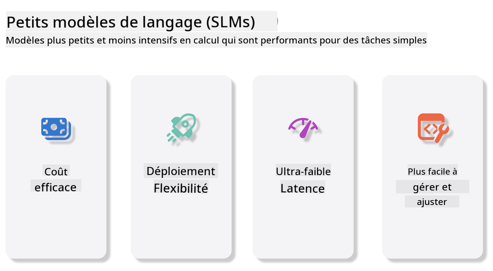
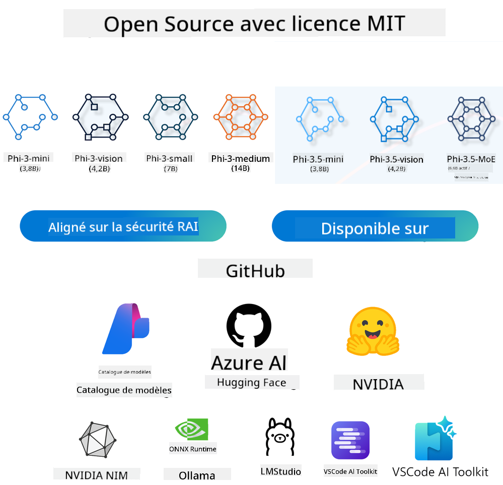
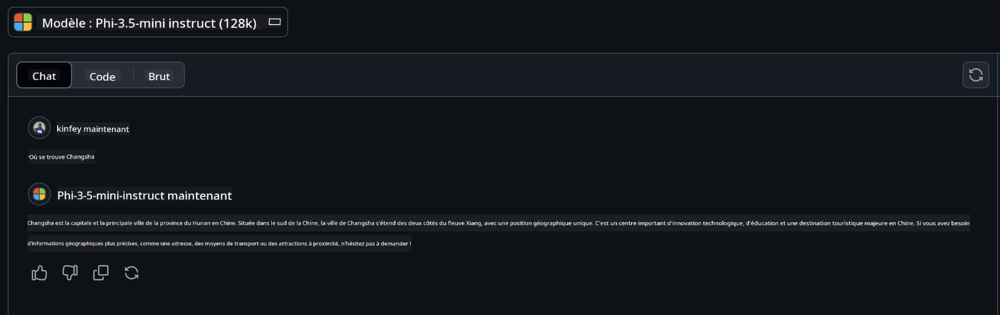

<!--
CO_OP_TRANSLATOR_METADATA:
{
  "original_hash": "124ad36cfe96f74038811b6e2bb93e9d",
  "translation_date": "2025-07-09T18:12:06+00:00",
  "source_file": "19-slm/README.md",
  "language_code": "fr"
}
-->
# Introduction aux petits modèles de langage pour l’IA générative pour débutants  
L’IA générative est un domaine fascinant de l’intelligence artificielle qui se concentre sur la création de systèmes capables de générer du contenu nouveau. Ce contenu peut aller du texte et des images à la musique, voire à des environnements virtuels entiers. L’une des applications les plus passionnantes de l’IA générative se trouve dans le domaine des modèles de langage.

## Qu’est-ce qu’un petit modèle de langage ?  

Un petit modèle de langage (SLM) est une version réduite d’un grand modèle de langage (LLM), qui utilise de nombreux principes architecturaux et techniques des LLM, tout en ayant une empreinte computationnelle nettement plus faible.

Les SLM sont une sous-catégorie de modèles de langage conçus pour générer du texte proche de celui produit par un humain. Contrairement à leurs homologues plus volumineux, comme GPT-4, les SLM sont plus compacts et efficaces, ce qui les rend idéaux pour des applications où les ressources informatiques sont limitées. Malgré leur taille réduite, ils peuvent accomplir une variété de tâches. En général, les SLM sont construits en compressant ou en distillant des LLM, dans le but de conserver une grande partie des fonctionnalités et des capacités linguistiques du modèle original. Cette réduction de la taille du modèle diminue la complexité globale, rendant les SLM plus efficaces en termes d’utilisation mémoire et de besoins en calcul. Malgré ces optimisations, les SLM peuvent toujours réaliser un large éventail de tâches en traitement du langage naturel (NLP) :

- Génération de texte : créer des phrases ou des paragraphes cohérents et contextuellement pertinents.  
- Complétion de texte : prédire et compléter des phrases à partir d’un prompt donné.  
- Traduction : convertir un texte d’une langue à une autre.  
- Résumé : condenser de longs textes en résumés plus courts et digestes.

Cela s’accompagne toutefois de certains compromis en termes de performance ou de profondeur de compréhension par rapport à leurs homologues plus grands.

## Comment fonctionnent les petits modèles de langage ?  
Les SLM sont entraînés sur d’énormes quantités de données textuelles. Pendant l’entraînement, ils apprennent les structures et les schémas du langage, ce qui leur permet de générer un texte à la fois grammaticalement correct et contextuellement approprié. Le processus d’entraînement comprend :

- Collecte de données : rassembler de larges ensembles de textes provenant de diverses sources.  
- Prétraitement : nettoyer et organiser les données pour les rendre adaptées à l’entraînement.  
- Entraînement : utiliser des algorithmes d’apprentissage automatique pour apprendre au modèle à comprendre et générer du texte.  
- Affinage : ajuster le modèle pour améliorer ses performances sur des tâches spécifiques.

Le développement des SLM répond au besoin croissant de modèles pouvant être déployés dans des environnements aux ressources limitées, comme les appareils mobiles ou les plateformes de calcul en périphérie, où les LLM à grande échelle peuvent être impraticables en raison de leurs lourdes exigences en ressources. En privilégiant l’efficacité, les SLM équilibrent performance et accessibilité, permettant une application plus large dans divers domaines.



## Objectifs d’apprentissage  

Dans cette leçon, nous espérons vous familiariser avec les SLM et les combiner avec Microsoft Phi-3 pour explorer différents scénarios dans le contenu textuel, la vision et MoE.

À la fin de cette leçon, vous devriez être capable de répondre aux questions suivantes :

- Qu’est-ce qu’un SLM  
- Quelle est la différence entre SLM et LLM  
- Qu’est-ce que la famille Microsoft Phi-3/3.5  
- Comment effectuer une inférence avec la famille Microsoft Phi-3/3.5

Prêt ? Commençons.

## Les différences entre les grands modèles de langage (LLM) et les petits modèles de langage (SLM)  

Les LLM et les SLM reposent tous deux sur des principes fondamentaux d’apprentissage automatique probabiliste, suivant des approches similaires dans leur conception architecturale, leurs méthodes d’entraînement, leurs processus de génération de données et leurs techniques d’évaluation. Cependant, plusieurs facteurs clés distinguent ces deux types de modèles.

## Applications des petits modèles de langage  

Les SLM ont un large éventail d’applications, notamment :

- Chatbots : fournir un support client et interagir avec les utilisateurs de manière conversationnelle.  
- Création de contenu : aider les rédacteurs en générant des idées ou même en rédigeant des articles entiers.  
- Éducation : assister les étudiants dans leurs devoirs ou l’apprentissage de nouvelles langues.  
- Accessibilité : créer des outils pour les personnes en situation de handicap, comme les systèmes de synthèse vocale.

**Taille**  

Une distinction majeure entre LLM et SLM réside dans l’échelle des modèles. Les LLM, comme ChatGPT (GPT-4), peuvent compter environ 1,76 trillion de paramètres, tandis que les SLM open source comme Mistral 7B sont conçus avec beaucoup moins de paramètres — environ 7 milliards. Cette différence s’explique principalement par les variations d’architecture et de processus d’entraînement. Par exemple, ChatGPT utilise un mécanisme d’attention auto-régressive dans une architecture encodeur-décodeur, alors que Mistral 7B emploie une attention à fenêtre glissante, ce qui permet un entraînement plus efficace dans un modèle uniquement décodeur. Cette différence architecturale a des implications importantes sur la complexité et les performances des modèles.

**Compréhension**  

Les SLM sont généralement optimisés pour des performances dans des domaines spécifiques, ce qui les rend très spécialisés mais potentiellement limités dans leur capacité à fournir une compréhension contextuelle large couvrant plusieurs domaines de connaissance. En revanche, les LLM visent à simuler une intelligence proche de celle de l’humain à un niveau plus global. Entraînés sur des ensembles de données vastes et diversifiés, les LLM sont conçus pour bien performer dans une variété de domaines, offrant plus de polyvalence et d’adaptabilité. Par conséquent, les LLM conviennent mieux à un large éventail de tâches en aval, comme le traitement du langage naturel et la programmation.

**Calcul**  

L’entraînement et le déploiement des LLM sont des processus gourmands en ressources, nécessitant souvent une infrastructure informatique importante, incluant de vastes grappes de GPU. Par exemple, entraîner un modèle comme ChatGPT depuis zéro peut nécessiter des milliers de GPU sur de longues périodes. En revanche, les SLM, avec leur nombre réduit de paramètres, sont plus accessibles en termes de ressources informatiques. Des modèles comme Mistral 7B peuvent être entraînés et exécutés sur des machines locales équipées de GPU modérés, bien que l’entraînement demande encore plusieurs heures sur plusieurs GPU.

**Biais**  

Le biais est un problème connu des LLM, principalement dû à la nature des données d’entraînement. Ces modèles s’appuient souvent sur des données brutes disponibles sur Internet, qui peuvent sous-représenter ou mal représenter certains groupes, introduire des erreurs d’étiquetage ou refléter des biais linguistiques liés aux dialectes, variations géographiques et règles grammaticales. De plus, la complexité des architectures LLM peut involontairement amplifier ces biais, qui peuvent passer inaperçus sans un affinage rigoureux. À l’inverse, les SLM, entraînés sur des ensembles de données plus restreints et spécifiques à un domaine, sont intrinsèquement moins exposés à ces biais, même s’ils n’en sont pas totalement exempts.

**Inférence**  

La taille réduite des SLM leur confère un avantage significatif en termes de vitesse d’inférence, leur permettant de générer des résultats efficacement sur du matériel local sans nécessiter de traitement parallèle intensif. En revanche, les LLM, en raison de leur taille et complexité, requièrent souvent des ressources parallèles importantes pour obtenir des temps d’inférence acceptables. La présence de nombreux utilisateurs simultanés ralentit encore les temps de réponse des LLM, surtout lorsqu’ils sont déployés à grande échelle.

En résumé, bien que LLM et SLM partagent une base commune en apprentissage automatique, ils diffèrent nettement en termes de taille de modèle, besoins en ressources, compréhension contextuelle, sensibilité aux biais et vitesse d’inférence. Ces différences reflètent leur adéquation respective à différents cas d’usage, les LLM étant plus polyvalents mais gourmands en ressources, tandis que les SLM offrent une efficacité plus ciblée avec des exigences computationnelles réduites.

***Note : Dans ce chapitre, nous présenterons les SLM en prenant Microsoft Phi-3 / 3.5 comme exemple.***

## Présentation de la famille Phi-3 / Phi-3.5  

La famille Phi-3 / 3.5 cible principalement les scénarios d’application en texte, vision et Agent (MoE) :

### Phi-3 / 3.5 Instruct  

Principalement destinée à la génération de texte, la complétion de conversations et l’extraction d’informations de contenu, etc.

**Phi-3-mini**  

Le modèle de langage 3,8 milliards de paramètres est disponible sur Microsoft Azure AI Studio, Hugging Face et Ollama. Les modèles Phi-3 surpassent nettement les modèles de taille égale ou supérieure sur des benchmarks clés (voir les chiffres ci-dessous, plus ils sont élevés, mieux c’est). Phi-3-mini dépasse des modèles deux fois plus grands, tandis que Phi-3-small et Phi-3-medium surpassent des modèles plus volumineux, y compris GPT-3.5.

**Phi-3-small & medium**  

Avec seulement 7 milliards de paramètres, Phi-3-small bat GPT-3.5T sur divers benchmarks de langage, raisonnement, codage et mathématiques.

Phi-3-medium, avec 14 milliards de paramètres, poursuit cette tendance et surpasse Gemini 1.0 Pro.

**Phi-3.5-mini**  

On peut le voir comme une évolution de Phi-3-mini. Bien que le nombre de paramètres reste inchangé, il améliore la prise en charge de plusieurs langues (plus de 20 langues supportées : arabe, chinois, tchèque, danois, néerlandais, anglais, finnois, français, allemand, hébreu, hongrois, italien, japonais, coréen, norvégien, polonais, portugais, russe, espagnol, suédois, thaï, turc, ukrainien) et renforce la gestion des contextes longs.

Phi-3.5-mini, avec 3,8 milliards de paramètres, dépasse les modèles de même taille et est comparable à des modèles deux fois plus grands.

### Phi-3 / 3.5 Vision  

On peut considérer le modèle Instruct de Phi-3/3.5 comme la capacité de Phi à comprendre, et Vision comme ce qui donne à Phi des « yeux » pour appréhender le monde.

**Phi-3-Vision**  

Phi-3-Vision, avec seulement 4,2 milliards de paramètres, poursuit cette tendance et surpasse des modèles plus grands tels que Claude-3 Haiku et Gemini 1.0 Pro V sur des tâches générales de raisonnement visuel, OCR, ainsi que la compréhension de tableaux et diagrammes.

**Phi-3.5-Vision**  

Phi-3.5-Vision est également une amélioration de Phi-3-Vision, ajoutant la prise en charge de plusieurs images. On peut le voir comme une amélioration de la vision : non seulement il peut voir des images, mais aussi des vidéos.

Phi-3.5-Vision surpasse des modèles plus grands comme Claude-3.5 Sonnet et Gemini 1.5 Flash sur les tâches d’OCR, de compréhension de tableaux et graphiques, et est équivalent sur les tâches générales de raisonnement visuel. Supporte l’entrée multi-images, c’est-à-dire le raisonnement sur plusieurs images en entrée.

### Phi-3.5-MoE  

***Mixture of Experts (MoE)*** permet aux modèles d’être pré-entraînés avec beaucoup moins de calcul, ce qui signifie que vous pouvez augmenter considérablement la taille du modèle ou du jeu de données avec le même budget de calcul qu’un modèle dense. En particulier, un modèle MoE devrait atteindre la même qualité que son homologue dense beaucoup plus rapidement lors du pré-entraînement.

Phi-3.5-MoE comprend 16 modules experts de 3,8 milliards de paramètres chacun. Phi-3.5-MoE, avec seulement 6,6 milliards de paramètres actifs, atteint un niveau similaire de raisonnement, compréhension du langage et mathématiques que des modèles beaucoup plus grands.

Nous pouvons utiliser les modèles de la famille Phi-3/3.5 selon différents scénarios. Contrairement aux LLM, vous pouvez déployer Phi-3/3.5-mini ou Phi-3/3.5-Vision sur des appareils en périphérie.

## Comment utiliser les modèles de la famille Phi-3/3.5  

Nous souhaitons utiliser Phi-3/3.5 dans différents scénarios. Ensuite, nous verrons comment utiliser Phi-3/3.5 selon ces différents cas.



### Différences d’inférence avec l’API Cloud  

**GitHub Models**  

GitHub Models est la méthode la plus directe. Vous pouvez rapidement accéder au modèle Phi-3/3.5-Instruct via GitHub Models. Combiné avec le SDK Azure AI Inference / OpenAI SDK, vous pouvez accéder à l’API par code pour effectuer des appels à Phi-3/3.5-Instruct. Vous pouvez également tester différents résultats via Playground.

- Démo : comparaison des performances de Phi-3-mini et Phi-3.5-mini dans des scénarios en chinois




**Azure AI Studio**  

Ou si vous souhaitez utiliser les modèles vision et MoE, vous pouvez utiliser Azure AI Studio pour effectuer les appels. Si cela vous intéresse, vous pouvez consulter le Phi-3 Cookbook pour apprendre à appeler Phi-3/3.5 Instruct, Vision, MoE via Azure AI Studio [Cliquez sur ce lien](https://github.com/microsoft/Phi-3CookBook/blob/main/md/02.QuickStart/AzureAIStudio_QuickStart.md?WT.mc_id=academic-105485-koreyst)

**NVIDIA NIM**  

En plus des solutions de catalogue de modèles basées sur le cloud proposées par Azure et GitHub, vous pouvez également utiliser [NVIDIA NIM](https://developer.nvidia.com/nim?WT.mc_id=academic-105485-koreyst) pour effectuer les appels correspondants. Vous pouvez visiter NVIDIA NIM pour réaliser les appels API de la famille Phi-3/3.5. NVIDIA NIM (NVIDIA Inference Microservices) est un ensemble de microservices d’inférence accélérés conçus pour aider les développeurs à déployer efficacement des modèles d’IA dans divers environnements, y compris les clouds, centres de données et stations de travail.

Voici quelques fonctionnalités clés de NVIDIA NIM :

- **Facilité de déploiement :** NIM permet de déployer des modèles d’IA avec une seule commande, facilitant ainsi l’intégration dans les flux de travail existants.  
- **Performance optimisée :** Il exploite les moteurs d’inférence pré-optimisés de NVIDIA, tels que TensorRT et TensorRT-LLM, pour garantir une faible latence et un débit élevé.  
- **Scalabilité :** NIM supporte l’auto-scalabilité sur Kubernetes, lui permettant de gérer efficacement des charges de travail variables.
- **Sécurité et Contrôle :** Les organisations peuvent garder le contrôle de leurs données et applications en hébergeant elles-mêmes les microservices NIM sur leur propre infrastructure gérée.
- **APIs Standard :** NIM propose des APIs conformes aux standards de l’industrie, facilitant la création et l’intégration d’applications d’IA telles que les chatbots, assistants IA, et bien plus.

NIM fait partie de NVIDIA AI Enterprise, qui vise à simplifier le déploiement et l’opérationnalisation des modèles d’IA, en garantissant leur efficacité sur les GPU NVIDIA.

- Démo : Utilisation de Nvidia NIM pour appeler Phi-3.5-Vision-API  [[Cliquez sur ce lien](../../../19-slm/python/Phi-3-Vision-Nividia-NIM.ipynb)]


### Inférence Phi-3/3.5 en environnement local
L’inférence concernant Phi-3, ou tout modèle de langage comme GPT-3, désigne le processus de génération de réponses ou de prédictions à partir des données d’entrée reçues. Lorsque vous fournissez une requête ou une question à Phi-3, il utilise son réseau neuronal entraîné pour déduire la réponse la plus probable et pertinente en analysant les motifs et relations dans les données sur lesquelles il a été formé.

**Hugging Face Transformer**  
Hugging Face Transformers est une bibliothèque puissante conçue pour le traitement du langage naturel (NLP) et d’autres tâches d’apprentissage automatique. Voici quelques points clés à son sujet :

1. **Modèles pré-entraînés** : Elle propose des milliers de modèles pré-entraînés utilisables pour diverses tâches telles que la classification de texte, la reconnaissance d’entités nommées, la réponse à des questions, le résumé, la traduction et la génération de texte.

2. **Interopérabilité des frameworks** : La bibliothèque supporte plusieurs frameworks de deep learning, notamment PyTorch, TensorFlow et JAX. Cela permet d’entraîner un modèle dans un framework et de l’utiliser dans un autre.

3. **Capacités multimodales** : En plus du NLP, Hugging Face Transformers prend en charge des tâches en vision par ordinateur (par exemple classification d’images, détection d’objets) et en traitement audio (par exemple reconnaissance vocale, classification audio).

4. **Facilité d’utilisation** : La bibliothèque offre des APIs et outils pour télécharger et affiner facilement les modèles, la rendant accessible aussi bien aux débutants qu’aux experts.

5. **Communauté et ressources** : Hugging Face dispose d’une communauté dynamique ainsi que d’une documentation, tutoriels et guides complets pour aider les utilisateurs à démarrer et exploiter pleinement la bibliothèque.  
[documentation officielle](https://huggingface.co/docs/transformers/index?WT.mc_id=academic-105485-koreyst) ou leur [dépôt GitHub](https://github.com/huggingface/transformers?WT.mc_id=academic-105485-koreyst).

C’est la méthode la plus couramment utilisée, mais elle nécessite aussi une accélération GPU. En effet, des scénarios comme Vision et MoE demandent beaucoup de calculs, ce qui sera très limité sur CPU s’ils ne sont pas quantifiés.


- Démo : Utilisation de Transformer pour appeler Phi-3.5-Instuct [Cliquez sur ce lien](../../../19-slm/python/phi35-instruct-demo.ipynb)

- Démo : Utilisation de Transformer pour appeler Phi-3.5-Vision [Cliquez sur ce lien](../../../19-slm/python/phi35-vision-demo.ipynb)

- Démo : Utilisation de Transformer pour appeler Phi-3.5-MoE [Cliquez sur ce lien](../../../19-slm/python/phi35_moe_demo.ipynb)

**Ollama**  
[Ollama](https://ollama.com/?WT.mc_id=academic-105485-koreyst) est une plateforme conçue pour faciliter l’exécution locale de grands modèles de langage (LLM) sur votre machine. Elle supporte divers modèles comme Llama 3.1, Phi 3, Mistral, et Gemma 2, entre autres. La plateforme simplifie le processus en regroupant les poids du modèle, la configuration et les données dans un seul package, rendant plus accessible la personnalisation et la création de modèles. Ollama est disponible pour macOS, Linux et Windows. C’est un excellent outil si vous souhaitez expérimenter ou déployer des LLM sans dépendre des services cloud. Ollama est la méthode la plus directe, il suffit d’exécuter la commande suivante.


```bash

ollama run phi3.5

```


**ONNX Runtime pour GenAI**

[ONNX Runtime](https://github.com/microsoft/onnxruntime-genai?WT.mc_id=academic-105485-koreyst) est un accélérateur multiplateforme pour l’inférence et l’entraînement en apprentissage automatique. ONNX Runtime pour Generative AI (GENAI) est un outil puissant qui vous aide à exécuter efficacement des modèles d’IA générative sur différentes plateformes.

## Qu’est-ce que ONNX Runtime ?  
ONNX Runtime est un projet open source qui permet une inférence haute performance des modèles d’apprentissage automatique. Il supporte les modèles au format Open Neural Network Exchange (ONNX), un standard pour représenter les modèles ML. L’inférence ONNX Runtime peut offrir une expérience client plus rapide et réduire les coûts, en supportant des modèles issus de frameworks de deep learning comme PyTorch et TensorFlow/Keras ainsi que des bibliothèques classiques comme scikit-learn, LightGBM, XGBoost, etc. ONNX Runtime est compatible avec différents matériels, pilotes et systèmes d’exploitation, et offre des performances optimales en tirant parti des accélérateurs matériels lorsque c’est possible, ainsi que des optimisations et transformations de graphes.

## Qu’est-ce que l’IA générative ?  
L’IA générative désigne des systèmes d’IA capables de créer du contenu nouveau, comme du texte, des images ou de la musique, à partir des données sur lesquelles ils ont été entraînés. Parmi les exemples, on trouve des modèles de langage comme GPT-3 et des modèles de génération d’images comme Stable Diffusion. La bibliothèque ONNX Runtime pour GenAI fournit la boucle d’IA générative pour les modèles ONNX, incluant l’inférence avec ONNX Runtime, le traitement des logits, la recherche et l’échantillonnage, ainsi que la gestion du cache KV.

## ONNX Runtime pour GENAI  
ONNX Runtime pour GENAI étend les capacités d’ONNX Runtime pour supporter les modèles d’IA générative. Voici quelques fonctionnalités clés :

- **Support étendu des plateformes :** Fonctionne sur diverses plateformes, y compris Windows, Linux, macOS, Android et iOS.
- **Support des modèles :** Compatible avec de nombreux modèles populaires d’IA générative, tels que LLaMA, GPT-Neo, BLOOM, et d’autres.
- **Optimisation des performances :** Inclut des optimisations pour différents accélérateurs matériels comme les GPU NVIDIA, GPU AMD, etc.
- **Facilité d’utilisation :** Fournit des APIs pour une intégration simple dans les applications, permettant de générer du texte, des images et d’autres contenus avec peu de code.
- Les utilisateurs peuvent appeler une méthode generate() de haut niveau, ou exécuter chaque itération du modèle dans une boucle, générant un token à la fois, avec la possibilité de modifier les paramètres de génération à l’intérieur de la boucle.
- ONNX Runtime supporte également la recherche gloutonne/beam search et l’échantillonnage TopP, TopK pour générer des séquences de tokens, ainsi que le traitement intégré des logits comme les pénalités de répétition. Il est aussi facile d’ajouter un scoring personnalisé.

## Pour commencer  
Pour débuter avec ONNX Runtime pour GENAI, vous pouvez suivre ces étapes :

### Installer ONNX Runtime :  
```Python
pip install onnxruntime
```  
### Installer les extensions Generative AI :  
```Python
pip install onnxruntime-genai
```

### Exécuter un modèle : Voici un exemple simple en Python :  
```Python
import onnxruntime_genai as og

model = og.Model('path_to_your_model.onnx')

tokenizer = og.Tokenizer(model)

input_text = "Hello, how are you?"

input_tokens = tokenizer.encode(input_text)

output_tokens = model.generate(input_tokens)

output_text = tokenizer.decode(output_tokens)

print(output_text) 
```  
### Démo : Utilisation de ONNX Runtime GenAI pour appeler Phi-3.5-Vision


```python

import onnxruntime_genai as og

model_path = './Your Phi-3.5-vision-instruct ONNX Path'

img_path = './Your Image Path'

model = og.Model(model_path)

processor = model.create_multimodal_processor()

tokenizer_stream = processor.create_stream()

text = "Your Prompt"

prompt = "<|user|>\n"

prompt += "<|image_1|>\n"

prompt += f"{text}<|end|>\n"

prompt += "<|assistant|>\n"

image = og.Images.open(img_path)

inputs = processor(prompt, images=image)

params = og.GeneratorParams(model)

params.set_inputs(inputs)

params.set_search_options(max_length=3072)

generator = og.Generator(model, params)

while not generator.is_done():

    generator.compute_logits()
    
    generator.generate_next_token()

    new_token = generator.get_next_tokens()[0]
    
    code += tokenizer_stream.decode(new_token)
    
    print(tokenizer_stream.decode(new_token), end='', flush=True)

```


**Autres**

En plus des méthodes de référence ONNX Runtime et Ollama, nous pouvons aussi compléter la référence des modèles quantitatifs basés sur les méthodes de référence fournies par différents fabricants. Par exemple, le framework Apple MLX avec Apple Metal, Qualcomm QNN avec NPU, Intel OpenVINO avec CPU/GPU, etc. Vous pouvez également trouver plus de contenu dans le [Phi-3 Cookbook](https://github.com/microsoft/phi-3cookbook?WT.mc_id=academic-105485-koreyst).


## Plus

Nous avons appris les bases de la famille Phi-3/3.5, mais pour en savoir plus sur SLM, il faut approfondir ses connaissances. Vous trouverez les réponses dans le Phi-3 Cookbook. Pour en savoir davantage, veuillez visiter le [Phi-3 Cookbook](https://github.com/microsoft/phi-3cookbook?WT.mc_id=academic-105485-koreyst).

**Avertissement** :  
Ce document a été traduit à l’aide du service de traduction automatique [Co-op Translator](https://github.com/Azure/co-op-translator). Bien que nous nous efforcions d’assurer l’exactitude, veuillez noter que les traductions automatiques peuvent contenir des erreurs ou des inexactitudes. Le document original dans sa langue d’origine doit être considéré comme la source faisant foi. Pour les informations critiques, une traduction professionnelle réalisée par un humain est recommandée. Nous déclinons toute responsabilité en cas de malentendus ou de mauvaises interprétations résultant de l’utilisation de cette traduction.