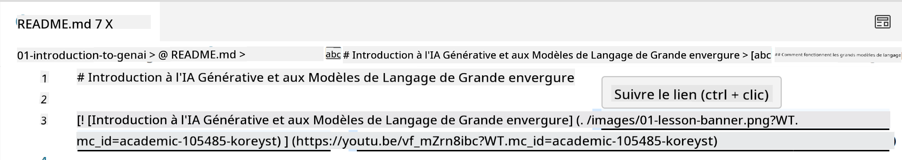
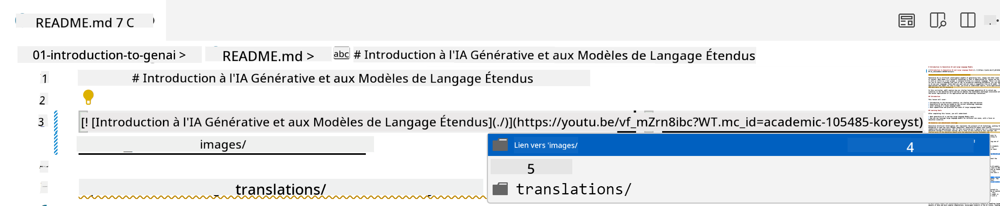
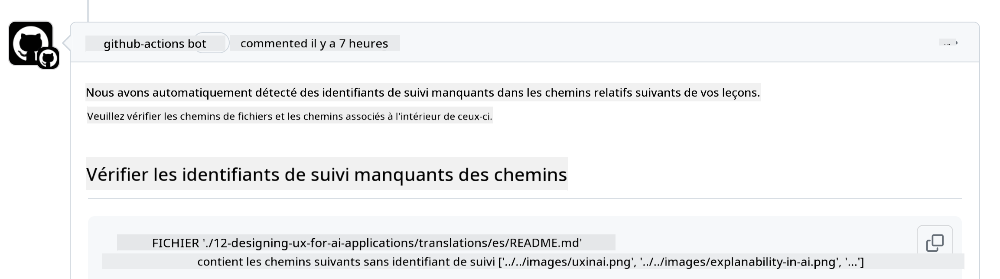
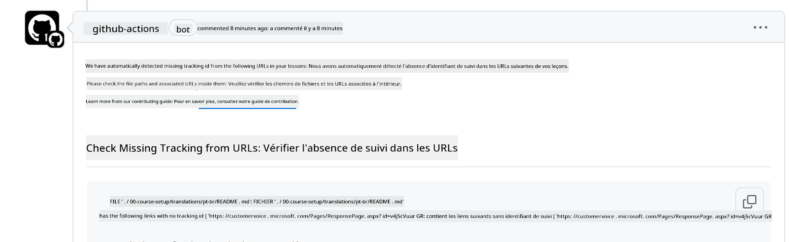
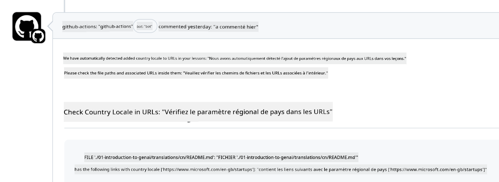

<!--
CO_OP_TRANSLATOR_METADATA:
{
  "original_hash": "57c41f2af71001a2cff9d8eb797cb843",
  "translation_date": "2025-05-19T08:38:36+00:00",
  "source_file": "CONTRIBUTING.md",
  "language_code": "fr"
}
-->
# Contribuer

Ce projet accueille les contributions et suggestions. La plupart des contributions nécessitent que vous acceptiez un accord de licence de contributeur (CLA) déclarant que vous avez le droit de nous accorder les droits d'utiliser votre contribution. Pour plus de détails, visitez <https://cla.microsoft.com>.

> Important : lorsque vous traduisez du texte dans ce dépôt, assurez-vous de ne pas utiliser la traduction automatique. Nous vérifierons les traductions via la communauté, alors veuillez vous porter volontaire uniquement pour les traductions dans les langues où vous êtes compétent.

Lorsque vous soumettez une demande de tirage, un CLA-bot déterminera automatiquement si vous devez fournir un CLA et décorera la PR en conséquence (par exemple, étiquette, commentaire). Suivez simplement les instructions fournies par le bot. Vous n'aurez à le faire qu'une seule fois pour tous les dépôts utilisant notre CLA.

## Code de conduite

Ce projet a adopté le [Code de conduite Open Source de Microsoft](https://opensource.microsoft.com/codeofconduct/?WT.mc_id=academic-105485-koreyst). Pour plus d'informations, lisez la [FAQ sur le Code de conduite](https://opensource.microsoft.com/codeofconduct/faq/?WT.mc_id=academic-105485-koreyst) ou contactez [opencode@microsoft.com](mailto:opencode@microsoft.com) pour toute question ou commentaire supplémentaire.

## Question ou problème ?

Veuillez ne pas ouvrir de problèmes GitHub pour des questions de support général car la liste GitHub doit être utilisée pour les demandes de fonctionnalités et les rapports de bugs. De cette façon, nous pouvons plus facilement suivre les problèmes ou les bugs réels du code et séparer la discussion générale du code réel.

## Fautes de frappe, problèmes, bugs et contributions

Chaque fois que vous soumettez des modifications au dépôt Generative AI for Beginners, veuillez suivre ces recommandations.

* Forkez toujours le dépôt sur votre propre compte avant de faire vos modifications
* Ne combinez pas plusieurs modifications en une seule demande de tirage. Par exemple, soumettez toute correction de bug et mise à jour de documentation en utilisant des PR séparées
* Si votre demande de tirage montre des conflits de fusion, assurez-vous de mettre à jour votre branche principale locale pour qu'elle soit un miroir de ce qui est dans le dépôt principal avant de faire vos modifications
* Si vous soumettez une traduction, veuillez créer une PR pour tous les fichiers traduits car nous n'acceptons pas de traductions partielles pour le contenu
* Si vous soumettez une correction de faute de frappe ou de documentation, vous pouvez combiner les modifications en une seule PR où cela est approprié

## Conseils généraux pour l'écriture

- Assurez-vous que toutes vos URL sont entourées de crochets suivis d'une parenthèse sans espaces supplémentaires autour ou à l'intérieur ``.
- Assurez-vous que tout lien relatif (c'est-à-dire des liens vers d'autres fichiers et dossiers dans le dépôt) commence par un `./` se référant à un fichier ou un dossier situé dans le répertoire de travail actuel ou un `../` se référant à un fichier ou un dossier situé dans un répertoire parent.
- Assurez-vous que tout lien relatif (c'est-à-dire des liens vers d'autres fichiers et dossiers dans le dépôt) a un ID de suivi (c'est-à-dire `?` ou `&` puis `wt.mc_id=` ou `WT.mc_id=`) à la fin.
- Assurez-vous que toute URL des domaines suivants _github.com, microsoft.com, visualstudio.com, aka.ms, et azure.com_ a un ID de suivi (c'est-à-dire `?` ou `&` puis `wt.mc_id=` ou `WT.mc_id=`) à la fin.
- Assurez-vous que vos liens n'ont pas de locale spécifique au pays (c'est-à-dire `/en-us/` ou `/en/`).
- Assurez-vous que toutes les images sont stockées dans le dossier `./images`.
- Assurez-vous que les images ont des noms descriptifs utilisant des caractères anglais, des chiffres et des tirets dans le nom de votre image.

## Flux de travail GitHub

Lorsque vous soumettez une demande de tirage, quatre flux de travail différents seront déclenchés pour valider les règles précédentes. Suivez simplement les instructions listées ici pour passer les vérifications du flux de travail.

- [Vérifier les chemins relatifs cassés](../..)
- [Vérifier que les chemins ont un suivi](../..)
- [Vérifier que les URL ont un suivi](../..)
- [Vérifier que les URL n'ont pas de locale](../..)

### Vérifier les chemins relatifs cassés

Ce flux de travail garantit que tout chemin relatif dans vos fichiers fonctionne. Ce dépôt est déployé sur les pages GitHub, vous devez donc être très prudent lorsque vous tapez les liens qui relient tout ensemble pour ne pas diriger quelqu'un vers le mauvais endroit.

Pour vous assurer que vos liens fonctionnent correctement, utilisez simplement VS code pour vérifier cela.

Par exemple, lorsque vous survolez un lien dans vos fichiers, vous serez invité à suivre le lien en appuyant sur **ctrl + clic**

Si vous cliquez sur un lien et qu'il ne fonctionne pas localement, alors, il déclenchera sûrement le flux de travail et ne fonctionnera pas sur GitHub.

Pour résoudre ce problème, essayez de taper le lien avec l'aide de VS code.

Lorsque vous tapez `./` ou `../`, VS code vous invite à choisir parmi les options disponibles selon ce que vous avez tapé.

Suivez le chemin en cliquant sur le fichier ou dossier souhaité et vous serez sûr que votre chemin n'est pas cassé.

Une fois que vous avez ajouté le chemin relatif correct, enregistrez et poussez vos modifications, le flux de travail sera à nouveau déclenché pour vérifier vos modifications. Si vous passez la vérification, alors vous êtes prêt à partir.

### Vérifier que les chemins ont un suivi

Ce flux de travail garantit que tout chemin relatif a un suivi. Ce dépôt est déployé sur les pages GitHub, nous devons donc suivre le mouvement entre les différents fichiers et dossiers.

Pour vous assurer que vos chemins relatifs ont un suivi, vérifiez simplement le texte suivant `?wt.mc_id=` à la fin du chemin. Si cela est ajouté à vos chemins relatifs, vous passerez cette vérification.

Sinon, vous pouvez obtenir l'erreur suivante.

Pour résoudre ce problème, essayez d'ouvrir le chemin de fichier que le flux de travail a mis en évidence et ajoutez l'ID de suivi à la fin des chemins relatifs.

Une fois que vous avez ajouté l'ID de suivi, enregistrez et poussez vos modifications, le flux de travail sera à nouveau déclenché pour vérifier vos modifications. Si vous passez la vérification, alors vous êtes prêt à partir.

### Vérifier que les URL ont un suivi

Ce flux de travail garantit que toute URL Web a un suivi. Ce dépôt est accessible à tous, vous devez donc vous assurer de suivre l'accès pour savoir d'où vient le trafic.

Pour vous assurer que vos URL ont un suivi, vérifiez simplement le texte suivant `?wt.mc_id=` à la fin de l'URL. Si cela est ajouté à vos URL, vous passerez cette vérification.

Sinon, vous pouvez obtenir l'erreur suivante.

Pour résoudre ce problème, essayez d'ouvrir le chemin de fichier que le flux de travail a mis en évidence et ajoutez l'ID de suivi à la fin des URL.

Une fois que vous avez ajouté l'ID de suivi, enregistrez et poussez vos modifications, le flux de travail sera à nouveau déclenché pour vérifier vos modifications. Si vous passez la vérification, alors vous êtes prêt à partir.

### Vérifier que les URL n'ont pas de locale

Ce flux de travail garantit que toute URL Web n'a pas de locale spécifique au pays. Ce dépôt est accessible à tous dans le monde entier, vous devez donc vous assurer de ne pas inclure la locale de votre pays dans les URL.

Pour vous assurer que vos URL n'ont pas de locale de pays, vérifiez simplement le texte suivant `/en-us/` ou `/en/` ou toute autre locale de langue n'importe où dans l'URL. Si cela n'est pas présent dans vos URL, vous passerez cette vérification.

Sinon, vous pouvez obtenir l'erreur suivante.

Pour résoudre ce problème, essayez d'ouvrir le chemin de fichier que le flux de travail a mis en évidence et retirez la locale de pays des URL.

Une fois que vous avez retiré la locale de pays, enregistrez et poussez vos modifications, le flux de travail sera à nouveau déclenché pour vérifier vos modifications. Si vous passez la vérification, alors vous êtes prêt à partir.

Félicitations ! Nous vous recontacterons dès que possible avec des commentaires sur votre contribution.

**Clause de non-responsabilité** :  
Ce document a été traduit à l'aide du service de traduction IA [Co-op Translator](https://github.com/Azure/co-op-translator). Bien que nous nous efforcions d'assurer l'exactitude, veuillez noter que les traductions automatisées peuvent contenir des erreurs ou des inexactitudes. Le document original dans sa langue maternelle doit être considéré comme la source faisant autorité. Pour des informations critiques, une traduction humaine professionnelle est recommandée. Nous ne sommes pas responsables des malentendus ou des interprétations erronées résultant de l'utilisation de cette traduction.