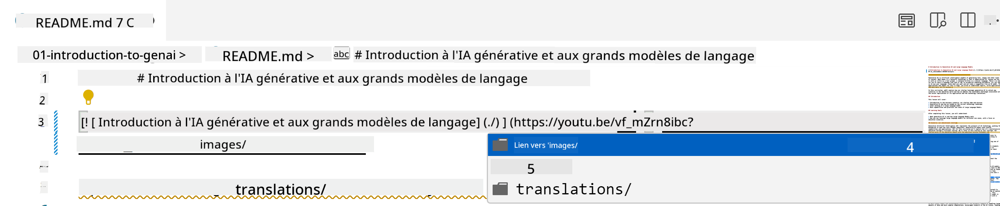
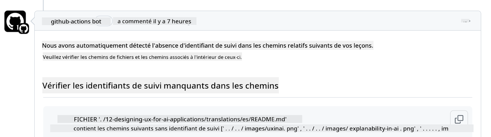
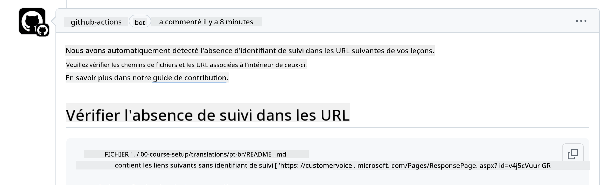

<!--
CO_OP_TRANSLATOR_METADATA:
{
  "original_hash": "57c41f2af71001a2cff9d8eb797cb843",
  "translation_date": "2025-07-09T05:47:19+00:00",
  "source_file": "CONTRIBUTING.md",
  "language_code": "fr"
}
-->
# Contribution

Ce projet accueille les contributions et suggestions. La plupart des contributions nécessitent que vous acceptiez un Accord de Licence de Contributeur (CLA) déclarant que vous avez le droit, et que vous accordez effectivement, les droits d’utilisation de votre contribution. Pour plus de détails, consultez <https://cla.microsoft.com>.

> Important : lors de la traduction des textes dans ce dépôt, veuillez vous assurer de ne pas utiliser de traduction automatique. Nous vérifierons les traductions via la communauté, donc merci de ne proposer vos services de traduction que pour les langues que vous maîtrisez.

Lorsque vous soumettez une pull request, un CLA-bot déterminera automatiquement si vous devez fournir un CLA et annotera la PR en conséquence (par exemple, étiquette, commentaire). Il vous suffit de suivre les instructions fournies par le bot. Vous n’aurez à le faire qu’une seule fois pour tous les dépôts utilisant notre CLA.

## Code de conduite

Ce projet a adopté le [Microsoft Open Source Code of Conduct](https://opensource.microsoft.com/codeofconduct/?WT.mc_id=academic-105485-koreyst).  
Pour plus d’informations, lisez la [FAQ sur le Code de conduite](https://opensource.microsoft.com/codeofconduct/faq/?WT.mc_id=academic-105485-koreyst) ou contactez [opencode@microsoft.com](mailto:opencode@microsoft.com) pour toute question ou remarque supplémentaire.

## Question ou problème ?

Merci de ne pas ouvrir de issues GitHub pour des questions de support général, car la liste GitHub doit être utilisée pour les demandes de fonctionnalités et les rapports de bugs. Cela nous permet de mieux suivre les problèmes ou bugs réels liés au code et de séparer la discussion générale du code lui-même.

## Fautes de frappe, problèmes, bugs et contributions

Chaque fois que vous soumettez des modifications au dépôt Generative AI for Beginners, veuillez suivre ces recommandations.

* Forkez toujours le dépôt sur votre propre compte avant de faire vos modifications  
* Ne regroupez pas plusieurs modifications dans une seule pull request. Par exemple, soumettez les corrections de bugs et les mises à jour de documentation dans des PR séparées  
* Si votre pull request présente des conflits de fusion, assurez-vous de mettre à jour votre branche main locale pour qu’elle reflète celle du dépôt principal avant de faire vos modifications  
* Si vous soumettez une traduction, créez une seule PR pour tous les fichiers traduits car nous n’acceptons pas les traductions partielles du contenu  
* Si vous soumettez une correction de faute de frappe ou de documentation, vous pouvez regrouper les modifications dans une seule PR lorsque cela est approprié

## Directives générales pour la rédaction

- Assurez-vous que toutes vos URLs sont encadrées par des crochets suivis de parenthèses sans espaces supplémentaires autour ou à l’intérieur ``.  
- Assurez-vous que tout lien relatif (c’est-à-dire les liens vers d’autres fichiers et dossiers dans le dépôt) commence par `./` pour un fichier ou dossier situé dans le répertoire courant, ou par `../` pour un fichier ou dossier situé dans un répertoire parent.  
- Assurez-vous que tout lien relatif (c’est-à-dire les liens vers d’autres fichiers et dossiers dans le dépôt) comporte un identifiant de suivi (c’est-à-dire `?` ou `&` suivi de `wt.mc_id=` ou `WT.mc_id=`) à la fin.  
- Assurez-vous que toute URL provenant des domaines _github.com, microsoft.com, visualstudio.com, aka.ms, et azure.com_ comporte un identifiant de suivi (c’est-à-dire `?` ou `&` suivi de `wt.mc_id=` ou `WT.mc_id=`) à la fin.  
- Assurez-vous que vos liens ne contiennent pas de locale spécifique à un pays (par exemple `/en-us/` ou `/en/`).  
- Assurez-vous que toutes les images sont stockées dans le dossier `./images`.  
- Assurez-vous que les images ont des noms descriptifs utilisant des caractères anglais, des chiffres et des tirets dans le nom de l’image.

## Workflows GitHub

Lorsque vous soumettez une pull request, quatre workflows différents seront déclenchés pour valider les règles précédentes.  
Suivez simplement les instructions listées ici pour réussir les vérifications des workflows.

- [Check Broken Relative Paths](../..)  
- [Check Paths Have Tracking](../..)  
- [Check URLs Have Tracking](../..)  
- [Check URLs Don't Have Locale](../..)

### Check Broken Relative Paths

Ce workflow vérifie que tous les chemins relatifs dans vos fichiers fonctionnent correctement.  
Ce dépôt est déployé sur GitHub pages, vous devez donc être très vigilant lorsque vous saisissez les liens qui relient tout pour ne pas diriger quelqu’un vers un mauvais emplacement.

Pour vous assurer que vos liens fonctionnent correctement, utilisez simplement VS Code pour vérifier cela.

Par exemple, lorsque vous survolez un lien dans vos fichiers, vous pouvez suivre le lien en appuyant sur **ctrl + clic**

Si vous cliquez sur un lien et qu’il ne fonctionne pas localement, il déclenchera sûrement le workflow et ne fonctionnera pas sur GitHub.

Pour corriger ce problème, essayez de taper le lien avec l’aide de VS Code.

Lorsque vous tapez `./` ou `../`, VS Code vous propose de choisir parmi les options disponibles selon ce que vous avez saisi.

Suivez le chemin en cliquant sur le fichier ou dossier souhaité et vous serez sûr que votre chemin n’est pas cassé.

Une fois que vous avez ajouté le chemin relatif correct, enregistrez et poussez vos modifications, le workflow sera déclenché à nouveau pour vérifier vos changements.  
Si vous réussissez la vérification, vous êtes prêt à continuer.

### Check Paths Have Tracking

Ce workflow vérifie que tous les chemins relatifs contiennent un identifiant de suivi.  
Ce dépôt est déployé sur GitHub pages, nous devons donc suivre les déplacements entre les différents fichiers et dossiers.

Pour vous assurer que vos chemins relatifs contiennent un identifiant de suivi, vérifiez simplement la présence du texte `?wt.mc_id=` à la fin du chemin.  
S’il est ajouté à vos chemins relatifs, vous passerez cette vérification.

Sinon, vous pourriez recevoir l’erreur suivante.

Pour corriger ce problème, ouvrez le chemin de fichier mis en évidence par le workflow et ajoutez l’identifiant de suivi à la fin des chemins relatifs.

Une fois que vous avez ajouté l’identifiant de suivi, enregistrez et poussez vos modifications, le workflow sera déclenché à nouveau pour vérifier vos changements.  
Si vous réussissez la vérification, vous êtes prêt à continuer.

### Check URLs Have Tracking

Ce workflow vérifie que toutes les URLs web contiennent un identifiant de suivi.  
Ce dépôt est accessible à tous, vous devez donc vous assurer de suivre les accès pour savoir d’où provient le trafic.

Pour vous assurer que vos URLs contiennent un identifiant de suivi, vérifiez simplement la présence du texte `?wt.mc_id=` à la fin de l’URL.  
S’il est ajouté à vos URLs, vous passerez cette vérification.

Sinon, vous pourriez recevoir l’erreur suivante.

Pour corriger ce problème, ouvrez le chemin de fichier mis en évidence par le workflow et ajoutez l’identifiant de suivi à la fin des URLs.

Une fois que vous avez ajouté l’identifiant de suivi, enregistrez et poussez vos modifications, le workflow sera déclenché à nouveau pour vérifier vos changements.  
Si vous réussissez la vérification, vous êtes prêt à continuer.

### Check URLs Don't Have Locale

Ce workflow vérifie que les URLs web ne contiennent pas de locale spécifique à un pays.  
Ce dépôt est accessible à tous dans le monde, vous devez donc vous assurer de ne pas inclure la locale de votre pays dans les URLs.

Pour vous assurer que vos URLs ne contiennent pas de locale pays, vérifiez simplement la présence du texte `/en-us/` ou `/en/` ou toute autre locale linguistique n’importe où dans l’URL.  
Si ce n’est pas présent dans vos URLs, vous passerez cette vérification.

Sinon, vous pourriez recevoir l’erreur suivante.

Pour corriger ce problème, ouvrez le chemin de fichier mis en évidence par le workflow et supprimez la locale pays des URLs.

Une fois que vous avez supprimé la locale pays, enregistrez et poussez vos modifications, le workflow sera déclenché à nouveau pour vérifier vos changements.  
Si vous réussissez la vérification, vous êtes prêt à continuer.

Félicitations ! Nous reviendrons vers vous dès que possible avec un retour sur votre contribution.

**Avertissement** :  
Ce document a été traduit à l’aide du service de traduction automatique [Co-op Translator](https://github.com/Azure/co-op-translator). Bien que nous nous efforcions d’assurer l’exactitude, veuillez noter que les traductions automatiques peuvent contenir des erreurs ou des inexactitudes. Le document original dans sa langue d’origine doit être considéré comme la source faisant foi. Pour les informations critiques, une traduction professionnelle réalisée par un humain est recommandée. Nous déclinons toute responsabilité en cas de malentendus ou de mauvaises interprétations résultant de l’utilisation de cette traduction.