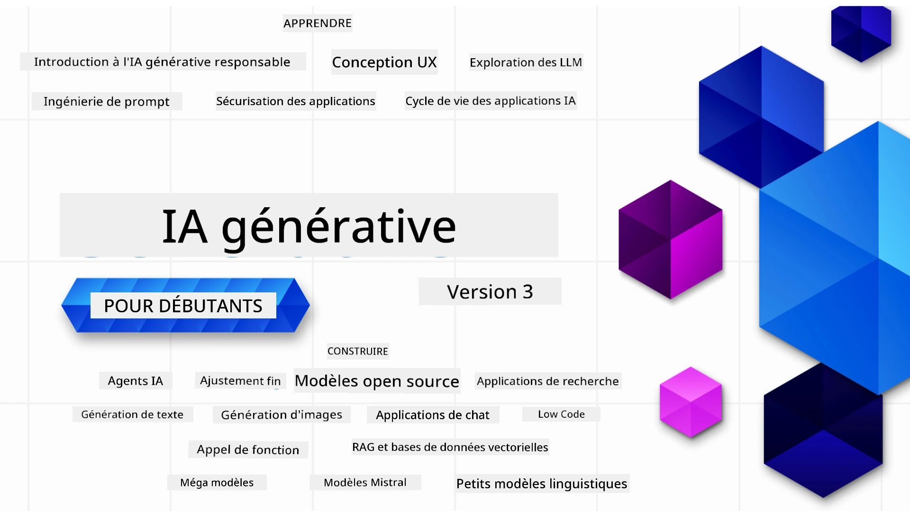

### 21 leçons enseignant tout ce que vous devez savoir pour commencer à développer des applications d'IA générative

[](https://github.com/microsoft/Generative-AI-For-Beginners/blob/master/LICENSE?WT.mc_id=academic-105485-koreyst)
[](https://GitHub.com/microsoft/Generative-AI-For-Beginners/graphs/contributors/?WT.mc_id=academic-105485-koreyst)
[](https://GitHub.com/microsoft/Generative-AI-For-Beginners/issues/?WT.mc_id=academic-105485-koreyst)
[](https://GitHub.com/microsoft/Generative-AI-For-Beginners/pulls/?WT.mc_id=academic-105485-koreyst)
[](http://makeapullrequest.com?WT.mc_id=academic-105485-koreyst)

[](https://GitHub.com/microsoft/Generative-AI-For-Beginners/watchers/?WT.mc_id=academic-105485-koreyst)
[](https://GitHub.com/microsoft/Generative-AI-For-Beginners/network/?WT.mc_id=academic-105485-koreyst)
[](https://GitHub.com/microsoft/Generative-AI-For-Beginners/stargazers/?WT.mc_id=academic-105485-koreyst)

[](https://discord.gg/nTYy5BXMWG)

### 🌐 Support multilingue

#### Pris en charge via GitHub Action (Automatisé & toujours à jour)

<!-- CO-OP TRANSLATOR LANGUAGES TABLE START -->
[Arabe](../ar/README.md) | [Bengali](../bn/README.md) | [Bulgare](../bg/README.md) | [Birman (Myanmar)](../my/README.md) | [Chinois (simplifié)](../zh-CN/README.md) | [Chinois (traditionnel, Hong Kong)](../zh-HK/README.md) | [Chinois (traditionnel, Macao)](../zh-MO/README.md) | [Chinois (traditionnel, Taïwan)](../zh-TW/README.md) | [Croate](../hr/README.md) | [Tchèque](../cs/README.md) | [Danois](../da/README.md) | [Néerlandais](../nl/README.md) | [Estonien](../et/README.md) | [Finnois](../fi/README.md) | [Français](./README.md) | [Allemand](../de/README.md) | [Grec](../el/README.md) | [Hébreu](../he/README.md) | [Hindi](../hi/README.md) | [Hongrois](../hu/README.md) | [Indonésien](../id/README.md) | [Italien](../it/README.md) | [Japonais](../ja/README.md) | [Kannada](../kn/README.md) | [Coréen](../ko/README.md) | [Lituanien](../lt/README.md) | [Malais](../ms/README.md) | [Malayalam](../ml/README.md) | [Marathi](../mr/README.md) | [Népalais](../ne/README.md) | [Pidgin nigérian](../pcm/README.md) | [Norvégien](../no/README.md) | [Persan (Farsi)](../fa/README.md) | [Polonais](../pl/README.md) | [Portugais (Brésil)](../pt-BR/README.md) | [Portugais (Portugal)](../pt-PT/README.md) | [Pendjabi (Gurmukhi)](../pa/README.md) | [Roumain](../ro/README.md) | [Russe](../ru/README.md) | [Serbe (cyrillique)](../sr/README.md) | [Slovaque](../sk/README.md) | [Slovène](../sl/README.md) | [Espagnol](../es/README.md) | [Swahili](../sw/README.md) | [Suédois](../sv/README.md) | [Tagalog (Filipino)](../tl/README.md) | [Tamoul](../ta/README.md) | [Telugu](../te/README.md) | [Thaï](../th/README.md) | [Turc](../tr/README.md) | [Ukrainien](../uk/README.md) | [Ourdou](../ur/README.md) | [Vietnamien](../vi/README.md)

> **Vous préférez cloner localement ?**
>
> Ce dépôt inclut plus de 50 traductions de langues, ce qui augmente considérablement la taille du téléchargement. Pour cloner sans les traductions, utilisez le sparse checkout :
>
> **Bash / macOS / Linux :**
> ```bash
> git clone --filter=blob:none --sparse https://github.com/microsoft/generative-ai-for-beginners.git
> cd generative-ai-for-beginners
> git sparse-checkout set --no-cone '/*' '!translations' '!translated_images'
> ```
>
> **CMD (Windows) :**
> ```cmd
> git clone --filter=blob:none --sparse https://github.com/microsoft/generative-ai-for-beginners.git
> cd generative-ai-for-beginners
> git sparse-checkout set --no-cone "/*" "!translations" "!translated_images"
> ```
>
> Cela vous donne tout ce dont vous avez besoin pour suivre le cours avec un téléchargement beaucoup plus rapide.
<!-- CO-OP TRANSLATOR LANGUAGES TABLE END -->

# IA générative pour débutants (Version 3) - Un cours

Apprenez les fondamentaux pour construire des applications d'IA générative avec notre cours complet de 21 leçons par les Microsoft Cloud Advocates.

## 🌱 Commencer

Ce cours comprend 21 leçons. Chaque leçon traite d’un sujet spécifique, commencez où vous voulez !

Les leçons sont soit des leçons "Learn" expliquant un concept d’IA générative, soit des leçons "Build" expliquant un concept avec des exemples de code en **Python** et **TypeScript** quand c’est possible.

Pour les développeurs .NET, consultez [Generative AI for Beginners (.NET Edition)](https://github.com/microsoft/Generative-AI-for-beginners-dotnet?WT.mc_id=academic-105485-koreyst) !

Chaque leçon comprend aussi une section "Keep Learning" avec des outils d’apprentissage supplémentaires.

## Ce dont vous avez besoin
### Pour exécuter le code de ce cours, vous pouvez utiliser :
 - [Azure OpenAI Service](https://aka.ms/genai-beginners/azure-open-ai?WT.mc_id=academic-105485-koreyst) - **Leçons :** "aoai-assignment"
 - [GitHub Marketplace Model Catalog](https://aka.ms/genai-beginners/gh-models?WT.mc_id=academic-105485-koreyst) - **Leçons :** "githubmodels"
 - [OpenAI API](https://aka.ms/genai-beginners/open-ai?WT.mc_id=academic-105485-koreyst) - **Leçons :** "oai-assignment" 
   
- Des connaissances de base en Python ou TypeScript sont utiles - \*Pour les débutants complets, consultez ces cours [Python](https://aka.ms/genai-beginners/python?WT.mc_id=academic-105485-koreyst) et [TypeScript](https://aka.ms/genai-beginners/typescript?WT.mc_id=academic-105485-koreyst)
- Un compte GitHub pour [forker ce dépôt complet](https://aka.ms/genai-beginners/github?WT.mc_id=academic-105485-koreyst) vers votre propre compte GitHub

Nous avons créé une leçon **[Configuration du cours](./00-course-setup/README.md?WT.mc_id=academic-105485-koreyst)** pour vous aider à configurer votre environnement de développement.

N’oubliez pas de [étoiler (🌟) ce dépôt](https://docs.github.com/en/get-started/exploring-projects-on-github/saving-repositories-with-stars?WT.mc_id=academic-105485-koreyst) pour le retrouver plus facilement plus tard.

## 🧠 Prêt à déployer ?

Si vous cherchez des exemples de code plus avancés, consultez notre [collection d'exemples de code d'IA générative](https://aka.ms/genai-beg-code?WT.mc_id=academic-105485-koreyst) en **Python** et **TypeScript**.

## 🗣️ Rencontrez d’autres apprenants, obtenez du support

Rejoignez notre [serveur Discord officiel Azure AI Foundry](https://aka.ms/genai-discord?WT.mc_id=academic-105485-koreyst) pour rencontrer et réseauter avec d’autres apprenants suivant ce cours et obtenir de l’aide.

Posez des questions ou partagez vos retours produits dans notre [forum développeur Azure AI Foundry](https://aka.ms/azureaifoundry/forum) sur Github.

## 🚀 Construisez une startup ?

Visitez [Microsoft for Startups](https://www.microsoft.com/startups) pour savoir comment commencer à développer avec des crédits Azure dès aujourd’hui.

## 🙏 Vous voulez aider ?

Avez-vous des suggestions ou avez-vous trouvé des erreurs d’orthographe ou de code ? [Ouvrez une issue](https://github.com/microsoft/generative-ai-for-beginners/issues?WT.mc_id=academic-105485-koreyst) ou [créez une pull request](https://github.com/microsoft/generative-ai-for-beginners/pulls?WT.mc_id=academic-105485-koreyst)

## 📂 Chaque leçon comprend :

- Une courte introduction vidéo au sujet
- Une leçon écrite située dans le README
- Des exemples de code Python et TypeScript supportant Azure OpenAI et l’API OpenAI
- Des liens vers des ressources supplémentaires pour continuer votre apprentissage

## 🗃️ Leçons

| #   | **Lien de la leçon**                                                                                                                      | **Description**                                                                                 | **Vidéo**                                                                   | **Apprentissage supplémentaire**                                               |
| --- | ------------------------------------------------------------------------------------------------------------------------------------------ | ----------------------------------------------------------------------------------------------- | --------------------------------------------------------------------------- | ------------------------------------------------------------------------------ |
| 00  | [Configuration du cours](./00-course-setup/README.md?WT.mc_id=academic-105485-koreyst)                                                     | **Apprenez :** Comment configurer votre environnement de développement                          | Vidéo à venir                                                               | [En savoir plus](https://aka.ms/genai-collection?WT.mc_id=academic-105485-koreyst) |
| 01  | [Introduction à l’IA générative et aux MLM (modèles de langage de grande taille)](./01-introduction-to-genai/README.md?WT.mc_id=academic-105485-koreyst) | **Apprenez :** Comprendre ce qu’est l’IA générative et comment fonctionnent les grands modèles de langage (LLMs). | [Vidéo](https://aka.ms/gen-ai-lesson-1-gh?WT.mc_id=academic-105485-koreyst) | [En savoir plus](https://aka.ms/genai-collection?WT.mc_id=academic-105485-koreyst) |
| 02  | [Explorer et comparer différents LLM](./02-exploring-and-comparing-different-llms/README.md?WT.mc_id=academic-105485-koreyst)              | **Apprenez :** Comment choisir le bon modèle pour votre cas d’usage                           | [Vidéo](https://aka.ms/gen-ai-lesson2-gh?WT.mc_id=academic-105485-koreyst)  | [En savoir plus](https://aka.ms/genai-collection?WT.mc_id=academic-105485-koreyst) |
| 03  | [Utiliser l’IA générative de manière responsable](./03-using-generative-ai-responsibly/README.md?WT.mc_id=academic-105485-koreyst)          | **Apprenez :** Comment créer des applications d’IA générative de manière responsable           | [Vidéo](https://aka.ms/gen-ai-lesson3-gh?WT.mc_id=academic-105485-koreyst)  | [En savoir plus](https://aka.ms/genai-collection?WT.mc_id=academic-105485-koreyst) |
| 04  | [Comprendre les Fondamentaux du Prompt Engineering](./04-prompt-engineering-fundamentals/README.md?WT.mc_id=academic-105485-koreyst)             | **Apprenez :** Les meilleures pratiques pratiques du Prompt Engineering                                           | [Vidéo](https://aka.ms/gen-ai-lesson4-gh?WT.mc_id=academic-105485-koreyst)  | [En savoir plus](https://aka.ms/genai-collection?WT.mc_id=academic-105485-koreyst) |
| 05  | [Création de Prompts Avancés](./05-advanced-prompts/README.md?WT.mc_id=academic-105485-koreyst)                                                | **Apprenez :** Comment appliquer des techniques de prompt engineering qui améliorent le résultat de vos prompts. | [Vidéo](https://aka.ms/gen-ai-lesson5-gh?WT.mc_id=academic-105485-koreyst)  | [En savoir plus](https://aka.ms/genai-collection?WT.mc_id=academic-105485-koreyst) |
| 06  | [Créer des Applications de Génération de Texte](./06-text-generation-apps/README.md?WT.mc_id=academic-105485-koreyst)                                | **Construisez :** Une application de génération de texte utilisant Azure OpenAI / OpenAI API                                | [Vidéo](https://aka.ms/gen-ai-lesson6-gh?WT.mc_id=academic-105485-koreyst)  | [En savoir plus](https://aka.ms/genai-collection?WT.mc_id=academic-105485-koreyst) |
| 07  | [Créer des Applications de Chat](./07-building-chat-applications/README.md?WT.mc_id=academic-105485-koreyst)                                     | **Construisez :** Des techniques pour construire et intégrer efficacement des applications de chat.               | [Vidéo](https://aka.ms/gen-ai-lessons7-gh?WT.mc_id=academic-105485-koreyst) | [En savoir plus](https://aka.ms/genai-collection?WT.mc_id=academic-105485-koreyst) |
| 08  | [Créer des Applications de Recherche avec Bases de Données Vectorielles](./08-building-search-applications/README.md?WT.mc_id=academic-105485-koreyst)                        | **Construisez :** Une application de recherche qui utilise les embeddings pour rechercher des données.                        | [Vidéo](https://aka.ms/gen-ai-lesson8-gh?WT.mc_id=academic-105485-koreyst)  | [En savoir plus](https://aka.ms/genai-collection?WT.mc_id=academic-105485-koreyst) |
| 09  | [Créer des Applications de Génération d’Images](./09-building-image-applications/README.md?WT.mc_id=academic-105485-koreyst)                        | **Construisez :** Une application de génération d’images                                                       | [Vidéo](https://aka.ms/gen-ai-lesson9-gh?WT.mc_id=academic-105485-koreyst)  | [En savoir plus](https://aka.ms/genai-collection?WT.mc_id=academic-105485-koreyst) |
| 10  | [Créer des Applications d’IA Low Code](./10-building-low-code-ai-applications/README.md?WT.mc_id=academic-105485-koreyst)                       | **Construisez :** Une application d’intelligence artificielle générative en utilisant des outils Low Code                                     | [Vidéo](https://aka.ms/gen-ai-lesson10-gh?WT.mc_id=academic-105485-koreyst) | [En savoir plus](https://aka.ms/genai-collection?WT.mc_id=academic-105485-koreyst) |
| 11  | [Intégrer des Applications Externes avec l’Appel de Fonction](./11-integrating-with-function-calling/README.md?WT.mc_id=academic-105485-koreyst) | **Construisez :** Qu’est-ce que l’appel de fonction et ses cas d’utilisation pour les applications                          | [Vidéo](https://aka.ms/gen-ai-lesson11-gh?WT.mc_id=academic-105485-koreyst) | [En savoir plus](https://aka.ms/genai-collection?WT.mc_id=academic-105485-koreyst) |
| 12  | [Concevoir l’UX pour les Applications d’IA](./12-designing-ux-for-ai-applications/README.md?WT.mc_id=academic-105485-koreyst)                         | **Apprenez :** Comment appliquer les principes de conception UX lors du développement d’Applications d’IA Générative         | [Vidéo](https://aka.ms/gen-ai-lesson12-gh?WT.mc_id=academic-105485-koreyst) | [En savoir plus](https://aka.ms/genai-collection?WT.mc_id=academic-105485-koreyst) |
| 13  | [Sécuriser Vos Applications d’IA Générative](./13-securing-ai-applications/README.md?WT.mc_id=academic-105485-koreyst)                         | **Apprenez :** Les menaces et risques pour les systèmes d’IA et les méthodes pour sécuriser ces systèmes.             | [Vidéo](https://aka.ms/gen-ai-lesson13-gh?WT.mc_id=academic-105485-koreyst) | [En savoir plus](https://aka.ms/genai-collection?WT.mc_id=academic-105485-koreyst) |
| 14  | [Le Cycle de Vie de l’Application d’IA Générative](./14-the-generative-ai-application-lifecycle/README.md?WT.mc_id=academic-105485-koreyst)           | **Apprenez :** Les outils et métriques pour gérer le cycle de vie des LLM et le LLMOps                         | [Vidéo](https://aka.ms/gen-ai-lesson14-gh?WT.mc_id=academic-105485-koreyst) | [En savoir plus](https://aka.ms/genai-collection?WT.mc_id=academic-105485-koreyst) |
| 15  | [Retrieval Augmented Generation (RAG) et Bases de Données Vectorielles](./15-rag-and-vector-databases/README.md?WT.mc_id=academic-105485-koreyst)        | **Construisez :** Une application utilisant un cadre RAG pour récupérer des embeddings depuis des Bases de Données Vectorielles  | [Vidéo](https://aka.ms/gen-ai-lesson15-gh?WT.mc_id=academic-105485-koreyst) | [En savoir plus](https://aka.ms/genai-collection?WT.mc_id=academic-105485-koreyst) |
| 16  | [Modèles Open Source et Hugging Face](./16-open-source-models/README.md?WT.mc_id=academic-105485-koreyst)                                    | **Construisez :** Une application utilisant des modèles open source disponibles sur Hugging Face                    | [Vidéo](https://aka.ms/gen-ai-lesson16-gh?WT.mc_id=academic-105485-koreyst) | [En savoir plus](https://aka.ms/genai-collection?WT.mc_id=academic-105485-koreyst) |
| 17  | [Agents IA](./17-ai-agents/README.md?WT.mc_id=academic-105485-koreyst)                                                                       | **Construisez :** Une application utilisant un cadre d’agent IA                                           | [Vidéo](https://aka.ms/gen-ai-lesson17-gh?WT.mc_id=academic-105485-koreyst) | [En savoir plus](https://aka.ms/genai-collection?WT.mc_id=academic-105485-koreyst) |
| 18  | [Fine-Tuning des LLM](./18-fine-tuning/README.md?WT.mc_id=academic-105485-koreyst)                                                              | **Apprenez :** Le quoi, pourquoi et comment du fine-tuning des LLM                                            | [Vidéo](https://aka.ms/gen-ai-lesson18-gh?WT.mc_id=academic-105485-koreyst) | [En savoir plus](https://aka.ms/genai-collection?WT.mc_id=academic-105485-koreyst) |
| 19  | [Construire avec des SLM](./19-slm/README.md?WT.mc_id=academic-105485-koreyst)                                                              | **Apprenez :** Les avantages de construire avec des Small Language Models                                            | Vidéo à venir | [En savoir plus](https://aka.ms/genai-collection?WT.mc_id=academic-105485-koreyst) |
| 20  | [Construire avec des Modèles Mistral](./20-mistral/README.md?WT.mc_id=academic-105485-koreyst)                                                              | **Apprenez :** Les caractéristiques et différences des Modèles de la Famille Mistral                                           | Vidéo à venir | [En savoir plus](https://aka.ms/genai-collection?WT.mc_id=academic-105485-koreyst) |
| 21  | [Construire avec des Modèles Meta](./21-meta/README.md?WT.mc_id=academic-105485-koreyst)                                                              | **Apprenez :** Les caractéristiques et différences des Modèles de la Famille Meta                                           | Vidéo à venir | [En savoir plus](https://aka.ms/genai-collection?WT.mc_id=academic-105485-koreyst) |

### 🌟 Remerciements spéciaux

Remerciements spéciaux à [**John Aziz**](https://www.linkedin.com/in/john0isaac/) pour la création de toutes les GitHub Actions et workflows

[**Bernhard Merkle**](https://www.linkedin.com/in/bernhard-merkle-738b73/) pour ses contributions clés à chaque leçon afin d'améliorer l'expérience des apprenants et du code.

## 🎒 Autres Cours

Notre équipe produit d’autres cours ! Découvrez :

<!-- CO-OP TRANSLATOR OTHER COURSES START -->
### LangChain
[](https://aka.ms/langchain4j-for-beginners)
[](https://aka.ms/langchainjs-for-beginners?WT.mc_id=m365-94501-dwahlin)
[](https://github.com/microsoft/langchain-for-beginners?WT.mc_id=m365-94501-dwahlin)
---

### Azure / Edge / MCP / Agents
[](https://github.com/microsoft/AZD-for-beginners?WT.mc_id=academic-105485-koreyst)
[](https://github.com/microsoft/edgeai-for-beginners?WT.mc_id=academic-105485-koreyst)
[](https://github.com/microsoft/mcp-for-beginners?WT.mc_id=academic-105485-koreyst)
[](https://github.com/microsoft/ai-agents-for-beginners?WT.mc_id=academic-105485-koreyst)

---
 
### Série IA Générative
[](https://github.com/microsoft/generative-ai-for-beginners?WT.mc_id=academic-105485-koreyst)
[-9333EA?style=for-the-badge&labelColor=E5E7EB&color=9333EA)](https://github.com/microsoft/Generative-AI-for-beginners-dotnet?WT.mc_id=academic-105485-koreyst)
[-C084FC?style=for-the-badge&labelColor=E5E7EB&color=C084FC)](https://github.com/microsoft/generative-ai-for-beginners-java?WT.mc_id=academic-105485-koreyst)
[-E879F9?style=for-the-badge&labelColor=E5E7EB&color=E879F9)](https://github.com/microsoft/generative-ai-with-javascript?WT.mc_id=academic-105485-koreyst)

---
 
### Apprentissage Fondamental
[](https://aka.ms/ml-beginners?WT.mc_id=academic-105485-koreyst)
[](https://aka.ms/datascience-beginners?WT.mc_id=academic-105485-koreyst)
[](https://aka.ms/ai-beginners?WT.mc_id=academic-105485-koreyst)
[](https://github.com/microsoft/Security-101?WT.mc_id=academic-96948-sayoung)
[](https://aka.ms/webdev-beginners?WT.mc_id=academic-105485-koreyst)
[](https://aka.ms/iot-beginners?WT.mc_id=academic-105485-koreyst)
[](https://github.com/microsoft/xr-development-for-beginners?WT.mc_id=academic-105485-koreyst)

---
 
### Série Copilot
[](https://aka.ms/GitHubCopilotAI?WT.mc_id=academic-105485-koreyst)
[](https://github.com/microsoft/mastering-github-copilot-for-dotnet-csharp-developers?WT.mc_id=academic-105485-koreyst)
[](https://github.com/microsoft/CopilotAdventures?WT.mc_id=academic-105485-koreyst)
<!-- CO-OP TRANSLATOR OTHER COURSES END -->

## Obtenir de l'aide

Si vous êtes bloqué ou avez des questions sur la création d'applications IA. Rejoignez d'autres apprenants et développeurs expérimentés dans les discussions sur MCP. C’est une communauté solidaire où les questions sont les bienvenues et où le savoir est partagé librement.

[](https://discord.gg/nTYy5BXMWG)

Si vous avez des retours sur les produits ou des erreurs lors de la création, visitez :

[](https://aka.ms/foundry/forum)

---

<!-- CO-OP TRANSLATOR DISCLAIMER START -->
**Avertissement** :  
Ce document a été traduit à l’aide du service de traduction automatique IA [Co-op Translator](https://github.com/Azure/co-op-translator). Bien que nous nous efforçons d’assurer l’exactitude, veuillez noter que les traductions automatiques peuvent contenir des erreurs ou des inexactitudes. Le document original dans sa langue d’origine doit être considéré comme la source faisant foi. Pour des informations cruciales, il est recommandé de recourir à une traduction professionnelle effectuée par un humain. Nous ne saurions être tenus responsables de tout malentendu ou mauvaise interprétation résultant de l’utilisation de cette traduction.
<!-- CO-OP TRANSLATOR DISCLAIMER END -->