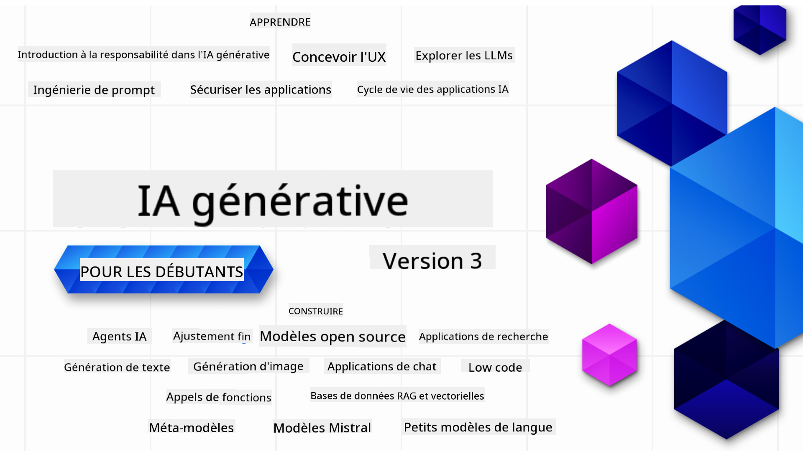

<!--
CO_OP_TRANSLATOR_METADATA:
{
  "original_hash": "c2ee25895ebbfa1a52868bb6eab686fc",
  "translation_date": "2025-05-19T10:50:42+00:00",
  "source_file": "README.md",
  "language_code": "fr"
}
-->

### 21 Leçons pour tout savoir afin de commencer à construire des applications d'IA générative

### 🌐 Support multilingue

#### Pris en charge via GitHub Action (Automatisé et toujours à jour)
[Français](./README.md) | [Espagnol](../es/README.md) | [Allemand](../de/README.md) | [Russe](../ru/README.md) | [Arabe](../ar/README.md) | [Persan (Farsi)](../fa/README.md) | [Ourdou](../ur/README.md) | [Chinois (Simplifié)](../zh/README.md) | [Chinois (Traditionnel, Macao)](../mo/README.md) | [Chinois (Traditionnel, Hong Kong)](../hk/README.md) | [Chinois (Traditionnel, Taïwan)](../tw/README.md) | [Japonais](../ja/README.md) | [Coréen](../ko/README.md) | [Hindi](../hi/README.md) | [Bengali](../bn/README.md) | [Marathi](../mr/README.md) | [Népalais](../ne/README.md) | [Punjabi (Gurmukhi)](../pa/README.md) | [Portugais (Portugal)](../pt/README.md) | [Portugais (Brésil)](../br/README.md) | [Italien](../it/README.md) | [Polonais](../pl/README.md) | [Turc](../tr/README.md) | [Grec](../el/README.md) | [Thaï](../th/README.md) | [Suédois](../sv/README.md) | [Danois](../da/README.md) | [Norvégien](../no/README.md) | [Finnois](../fi/README.md) | [Néerlandais](../nl/README.md) | [Hébreu](../he/README.md) | [Vietnamien](../vi/README.md) | [Indonésien](../id/README.md) | [Malais](../ms/README.md) | [Tagalog (Philippin)](../tl/README.md) | [Swahili](../sw/README.md) | [Hongrois](../hu/README.md) | [Tchèque](../cs/README.md) | [Slovaque](../sk/README.md) | [Roumain](../ro/README.md) | [Bulgare](../bg/README.md) | [Serbe (Cyrillique)](../sr/README.md) | [Croate](../hr/README.md) | [Slovène](../sl/README.md)
# IA Générative pour Débutants (Version 3) - Un Cours

Apprenez les bases de la création d'applications d'IA générative avec notre cours complet de 21 leçons proposé par les Avocats Cloud de Microsoft.

## 🌱 Commencer

Ce cours comprend 21 leçons. Chaque leçon aborde un sujet spécifique, alors commencez où vous le souhaitez !

Les leçons sont étiquetées soit comme leçons "Apprendre" expliquant un concept d'IA générative, soit comme leçons "Construire" qui expliquent un concept et des exemples de code en **Python** et **TypeScript** quand c'est possible.

Pour les développeurs .NET, consultez [IA Générative pour Débutants (Édition .NET)](https://github.com/microsoft/Generative-AI-for-beginners-dotnet?WT.mc_id=academic-105485-koreyst) !

Chaque leçon inclut également une section "Continuer à apprendre" avec des outils d'apprentissage supplémentaires.

## Ce Dont Vous Avez Besoin
### Pour exécuter le code de ce cours, vous pouvez utiliser soit : 
 - [Azure OpenAI Service](https://aka.ms/genai-beginners/azure-open-ai?WT.mc_id=academic-105485-koreyst) - **Leçons :** "aoai-assignment"
 - [GitHub Marketplace Model Catalog](https://aka.ms/genai-beginners/gh-models?WT.mc_id=academic-105485-koreyst) - **Leçons :** "githubmodels"
 - [OpenAI API](https://aka.ms/genai-beginners/open-ai?WT.mc_id=academic-105485-koreyst) - **Leçons :** "oai-assignment" 
   
- Une connaissance de base de Python ou TypeScript est utile - \*Pour les débutants absolus, consultez ces cours de [Python](https://aka.ms/genai-beginners/python?WT.mc_id=academic-105485-koreyst) et [TypeScript](https://aka.ms/genai-beginners/typescript?WT.mc_id=academic-105485-koreyst)
- Un compte GitHub pour [dupliquer ce dépôt entier](https://aka.ms/genai-beginners/github?WT.mc_id=academic-105485-koreyst) sur votre propre compte GitHub

Nous avons créé une leçon de **[Configuration du Cours](./00-course-setup/README.md?WT.mc_id=academic-105485-koreyst)** pour vous aider à configurer votre environnement de développement.

N'oubliez pas de [mettre une étoile (🌟) à ce dépôt](https://docs.github.com/en/get-started/exploring-projects-on-github/saving-repositories-with-stars?WT.mc_id=academic-105485-koreyst) pour le retrouver plus facilement plus tard.

## 🧠 Prêt à Déployer ?

Si vous recherchez des exemples de code plus avancés, consultez notre [collection d'exemples de code d'IA Générative](https://aka.ms/genai-beg-code?WT.mc_id=academic-105485-koreyst) en **Python** et **TypeScript**.

## 🗣️ Rencontrez d'Autres Apprenants, Obtenez du Support

Rejoignez notre [serveur Discord officiel Azure AI Foundry](https://aka.ms/genai-discord?WT.mc_id=academic-105485-koreyst) pour rencontrer et réseauter avec d'autres apprenants suivant ce cours et obtenir du support.

Posez des questions ou partagez des retours produits dans notre [Forum des Développeurs Azure AI Foundry](https://aka.ms/azureaifoundry/forum) sur Github.

## 🚀 Créer une Startup ?

Inscrivez-vous au [Microsoft for Startups Founders Hub](https://aka.ms/genai-foundershub?WT.mc_id=academic-105485-koreyst) pour recevoir **des crédits OpenAI gratuits** et jusqu'à **150 000 $ de crédits Azure pour accéder aux modèles OpenAI via les services Azure OpenAI**.

## 🙏 Vous Voulez Aider ?

Avez-vous des suggestions ou avez-vous trouvé des erreurs d'orthographe ou de code ? [Soulevez un problème](https://github.com/microsoft/generative-ai-for-beginners/issues?WT.mc_id=academic-105485-koreyst) ou [Créez une demande de tirage](https://github.com/microsoft/generative-ai-for-beginners/pulls?WT.mc_id=academic-105485-koreyst)

## 📂 Chaque leçon comprend :

- Une courte vidéo d'introduction au sujet
- Une leçon écrite située dans le README
- Des exemples de code Python et TypeScript prenant en charge Azure OpenAI et OpenAI API
- Des liens vers des ressources supplémentaires pour continuer votre apprentissage

## 🗃️ Leçons

| #   | **Lien de la Leçon**                                                                                                                             | **Description**                                                                                   | **Vidéo**                                                                   | **Apprentissage Supplémentaire**                                                |
| --- | ------------------------------------------------------------------------------------------------------------------------------------------------- | ------------------------------------------------------------------------------------------------- | --------------------------------------------------------------------------- | -------------------------------------------------------------------------------- |
| 00  | [Configuration du Cours](./00-course-setup/README.md?WT.mc_id=academic-105485-koreyst)                                                           | **Apprendre :** Comment configurer votre environnement de développement                            | Vidéo à venir                                                               | [En savoir plus](https://aka.ms/genai-collection?WT.mc_id=academic-105485-koreyst) |
| 01  | [Introduction à l'IA Générative et aux LLMs](./01-introduction-to-genai/README.md?WT.mc_id=academic-105485-koreyst)                              | **Apprendre :** Comprendre ce qu'est l'IA générative et comment fonctionnent les modèles de langage large (LLMs). | [Vidéo](https://aka.ms/gen-ai-lesson-1-gh?WT.mc_id=academic-105485-koreyst) | [En savoir plus](https://aka.ms/genai-collection?WT.mc_id=academic-105485-koreyst) |
| 02  | [Explorer et comparer différents LLMs](./02-exploring-and-comparing-different-llms/README.md?WT.mc_id=academic-105485-koreyst)                   | **Apprendre :** Comment choisir le bon modèle pour votre cas d'utilisation                          | [Vidéo](https://aka.ms/gen-ai-lesson2-gh?WT.mc_id=academic-105485-koreyst)  | [En savoir plus](https://aka.ms/genai-collection?WT.mc_id=academic-105485-koreyst) |
| 03  | [Utiliser l'IA Générative de manière Responsable](./03-using-generative-ai-responsibly/README.md?WT.mc_id=academic-105485-koreyst)               | **Apprendre :** Comment construire des applications d'IA générative de manière responsable         | [Vidéo](https://aka.ms/gen-ai-lesson3-gh?WT.mc_id=academic-105485-koreyst)  | [En savoir plus](https://aka.ms/genai-collection?WT.mc_id=academic-105485-koreyst) |
| 04  | [Comprendre les Fondamentaux de l'Ingénierie des Prompts](./04-prompt-engineering-fundamentals/README.md?WT.mc_id=academic-105485-koreyst)       | **Apprendre :** Meilleures pratiques pratiques en ingénierie des prompts                           | [Vidéo](https://aka.ms/gen-ai-lesson4-gh?WT.mc_id=academic-105485-koreyst)  | [En savoir plus](https://aka.ms/genai-collection?WT.mc_id=academic-105485-koreyst) |
| 05  | [Créer des invites avancées](./05-advanced-prompts/README.md?WT.mc_id=academic-105485-koreyst)                                                | **Apprendre :** Comment appliquer des techniques d'ingénierie d'invite qui améliorent le résultat de vos invites. | [Vidéo](https://aka.ms/gen-ai-lesson5-gh?WT.mc_id=academic-105485-koreyst)  | [En savoir plus](https://aka.ms/genai-collection?WT.mc_id=academic-105485-koreyst) |
| 06  | [Construire des applications de génération de texte](./06-text-generation-apps/README.md?WT.mc_id=academic-105485-koreyst)                                | **Construire :** Une application de génération de texte utilisant Azure OpenAI / OpenAI API                                | [Vidéo](https://aka.ms/gen-ai-lesson6-gh?WT.mc_id=academic-105485-koreyst)  | [En savoir plus](https://aka.ms/genai-collection?WT.mc_id=academic-105485-koreyst) |
| 07  | [Construire des applications de chat](./07-building-chat-applications/README.md?WT.mc_id=academic-105485-koreyst)                                     | **Construire :** Techniques pour construire et intégrer efficacement des applications de chat.               | [Vidéo](https://aka.ms/gen-ai-lessons7-gh?WT.mc_id=academic-105485-koreyst) | [En savoir plus](https://aka.ms/genai-collection?WT.mc_id=academic-105485-koreyst) |
| 08  | [Construire des applications de recherche avec bases de données vectorielles](./08-building-search-applications/README.md?WT.mc_id=academic-105485-koreyst)                        | **Construire :** Une application de recherche qui utilise les embeddings pour rechercher des données.                        | [Vidéo](https://aka.ms/gen-ai-lesson8-gh?WT.mc_id=academic-105485-koreyst)  | [En savoir plus](https://aka.ms/genai-collection?WT.mc_id=academic-105485-koreyst) |
| 09  | [Construire des applications de génération d'images](./09-building-image-applications/README.md?WT.mc_id=academic-105485-koreyst)                        | **Construire :** Une application de génération d'images                                                       | [Vidéo](https://aka.ms/gen-ai-lesson9-gh?WT.mc_id=academic-105485-koreyst)  | [En savoir plus](https://aka.ms/genai-collection?WT.mc_id=academic-105485-koreyst) |
| 10  | [Construire des applications IA à faible code](./10-building-low-code-ai-applications/README.md?WT.mc_id=academic-105485-koreyst)                       | **Construire :** Une application d'IA générative utilisant des outils à faible code                                     | [Vidéo](https://aka.ms/gen-ai-lesson10-gh?WT.mc_id=academic-105485-koreyst) | [En savoir plus](https://aka.ms/genai-collection?WT.mc_id=academic-105485-koreyst) |
| 11  | [Intégrer des applications externes avec appel de fonction](./11-integrating-with-function-calling/README.md?WT.mc_id=academic-105485-koreyst) | **Construire :** Qu'est-ce que l'appel de fonction et ses cas d'utilisation pour les applications                          | [Vidéo](https://aka.ms/gen-ai-lesson11-gh?WT.mc_id=academic-105485-koreyst) | [En savoir plus](https://aka.ms/genai-collection?WT.mc_id=academic-105485-koreyst) |
| 12  | [Concevoir l'UX pour les applications IA](./12-designing-ux-for-ai-applications/README.md?WT.mc_id=academic-105485-koreyst)                         | **Apprendre :** Comment appliquer les principes de conception UX lors du développement d'applications d'IA générative         | [Vidéo](https://aka.ms/gen-ai-lesson12-gh?WT.mc_id=academic-105485-koreyst) | [En savoir plus](https://aka.ms/genai-collection?WT.mc_id=academic-105485-koreyst) |
| 13  | [Sécuriser vos applications d'IA générative](./13-securing-ai-applications/README.md?WT.mc_id=academic-105485-koreyst)                         | **Apprendre :** Les menaces et risques pour les systèmes d'IA et les méthodes pour sécuriser ces systèmes.             | [Vidéo](https://aka.ms/gen-ai-lesson13-gh?WT.mc_id=academic-105485-koreyst) | [En savoir plus](https://aka.ms/genai-collection?WT.mc_id=academic-105485-koreyst) |
| 14  | [Le cycle de vie des applications d'IA générative](./14-the-generative-ai-application-lifecycle/README.md?WT.mc_id=academic-105485-koreyst)           | **Apprendre :** Les outils et métriques pour gérer le cycle de vie des LLM et LLMOps                         | [Vidéo](https://aka.ms/gen-ai-lesson14-gh?WT.mc_id=academic-105485-koreyst) | [En savoir plus](https://aka.ms/genai-collection?WT.mc_id=academic-105485-koreyst) |
| 15  | [Génération Augmentée par Récupération (RAG) et Bases de Données Vectorielles](./15-rag-and-vector-databases/README.md?WT.mc_id=academic-105485-koreyst)        | **Construire :** Une application utilisant un cadre RAG pour récupérer des embeddings à partir de bases de données vectorielles  | [Vidéo](https://aka.ms/gen-ai-lesson15-gh?WT.mc_id=academic-105485-koreyst) | [En savoir plus](https://aka.ms/genai-collection?WT.mc_id=academic-105485-koreyst) |
| 16  | [Modèles Open Source et Hugging Face](./16-open-source-models/README.md?WT.mc_id=academic-105485-koreyst)                                    | **Construire :** Une application utilisant des modèles open source disponibles sur Hugging Face                    | [Vidéo](https://aka.ms/gen-ai-lesson16-gh?WT.mc_id=academic-105485-koreyst) | [En savoir plus](https://aka.ms/genai-collection?WT.mc_id=academic-105485-koreyst) |
| 17  | [Agents IA](./17-ai-agents/README.md?WT.mc_id=academic-105485-koreyst)                                                                       | **Construire :** Une application utilisant un cadre d'agent IA                                           | [Vidéo](https://aka.ms/gen-ai-lesson17-gh?WT.mc_id=academic-105485-koreyst) | [En savoir plus](https://aka.ms/genai-collection?WT.mc_id=academic-105485-koreyst) |
| 18  | [Affinage des LLMs](./18-fine-tuning/README.md?WT.mc_id=academic-105485-koreyst)                                                              | **Apprendre :** Le quoi, pourquoi et comment de l'affinage des LLMs                                            | [Vidéo](https://aka.ms/gen-ai-lesson18-gh?WT.mc_id=academic-105485-koreyst) | [En savoir plus](https://aka.ms/genai-collection?WT.mc_id=academic-105485-koreyst) |
| 19  | [Construire avec les SLMs](./19-slm/README.md?WT.mc_id=academic-105485-koreyst)                                                              | **Apprendre :** Les avantages de la construction avec les Small Language Models                                            | Vidéo à venir | [En savoir plus](https://aka.ms/genai-collection?WT.mc_id=academic-105485-koreyst) |
| 20  | [Construire avec les Modèles Mistral](./20-mistral/README.md?WT.mc_id=academic-105485-koreyst)                                                              | **Apprendre :** Les caractéristiques et différences des Modèles de la Famille Mistral                                           | Vidéo à venir | [En savoir plus](https://aka.ms/genai-collection?WT.mc_id=academic-105485-koreyst) |
| 21  | [Construire avec les Modèles Meta](./21-meta/README.md?WT.mc_id=academic-105485-koreyst)                                                              | **Apprendre :** Les caractéristiques et différences des Modèles de la Famille Meta                                           | Vidéo à venir | [En savoir plus](https://aka.ms/genai-collection?WT.mc_id=academic-105485-koreyst) |

### 🌟 Remerciements spéciaux

Remerciements spéciaux à [**John Aziz**](https://www.linkedin.com/in/john0isaac/) pour avoir créé toutes les Actions GitHub et workflows

[**Bernhard Merkle**](https://www.linkedin.com/in/bernhard-merkle-738b73/) pour ses contributions clés à chaque leçon afin d'améliorer l'expérience des apprenants et du code.

## 🎒 Autres cours

Notre équipe produit d'autres cours ! Découvrez :

- [**NOUVEAU** Agents IA pour débutants](https://github.com/microsoft/ai-agents-for-beginners?WT.mc_id=academic-105485-koreyst)
- [**NOUVEAU** IA Générative pour débutants utilisant .NET](https://github.com/microsoft/Generative-AI-for-beginners-dotnet?WT.mc_id=academic-105485-koreyst)
- [**NOUVEAU** IA Générative pour débutants utilisant JavaScript](https://aka.ms/genai-js-course?WT.mc_id=academic-105485-koreyst)
- [ML pour débutants](https://aka.ms/ml-beginners?WT.mc_id=academic-105485-koreyst)
- [Science des données pour débutants](https://aka.ms/datascience-beginners?WT.mc_id=academic-105485-koreyst)
- [IA pour débutants](https://aka.ms/ai-beginners?WT.mc_id=academic-105485-koreyst)
- [Cybersécurité pour débutants](https://github.com/microsoft/Security-101??WT.mc_id=academic-96948-sayoung)
- [Développement Web pour débutants](https://aka.ms/webdev-beginners?WT.mc_id=academic-105485-koreyst)
- [IoT pour débutants](https://aka.ms/iot-beginners?WT.mc_id=academic-105485-koreyst)
- [Développement XR pour débutants](https://github.com/microsoft/xr-development-for-beginners?WT.mc_id=academic-105485-koreyst)
- [Maîtriser GitHub Copilot pour la programmation en binôme avec l'IA](https://aka.ms/GitHubCopilotAI?WT.mc_id=academic-105485-koreyst)
- [Maîtriser GitHub Copilot pour les développeurs C#/.NET](https://github.com/microsoft/mastering-github-copilot-for-dotnet-csharp-developers?WT.mc_id=academic-105485-koreyst)
- [Choisissez votre propre aventure Copilot](https://github.com/microsoft/CopilotAdventures?WT.mc_id=academic-105485-koreyst)

**Clause de non-responsabilité** :  
Ce document a été traduit à l'aide du service de traduction IA [Co-op Translator](https://github.com/Azure/co-op-translator). Bien que nous nous efforcions d'assurer l'exactitude, veuillez noter que les traductions automatiques peuvent contenir des erreurs ou des inexactitudes. Le document original dans sa langue native doit être considéré comme la source faisant autorité. Pour des informations critiques, une traduction professionnelle par un humain est recommandée. Nous ne sommes pas responsables des malentendus ou des interprétations erronées résultant de l'utilisation de cette traduction.