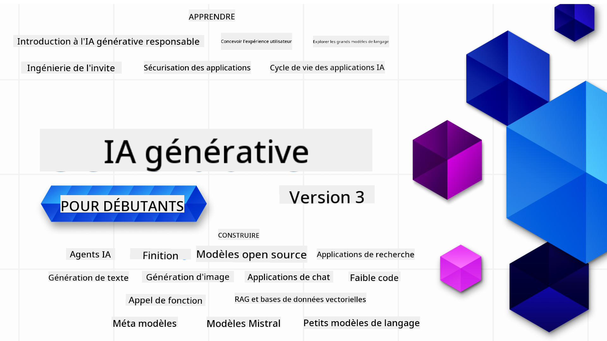

<!--
CO_OP_TRANSLATOR_METADATA:
{
  "original_hash": "ca2afa136ed9aca0634f39f51239746e",
  "translation_date": "2025-08-27T08:06:05+00:00",
  "source_file": "README.md",
  "language_code": "fr"
}
-->

### 21 Leçons pour tout apprendre et commencer à créer des applications d'IA Générative

  
  
  
  
  

  
  
  

### 🌐 Support Multilingue

#### Pris en charge via GitHub Action (Automatisé & Toujours à jour)

[Français](./README.md) | [Espagnol](../es/README.md) | [Allemand](../de/README.md) | [Russe](../ru/README.md) | [Arabe](../ar/README.md) | [Persan (Farsi)](../fa/README.md) | [Ourdou](../ur/README.md) | [Chinois (Simplifié)](../zh/README.md) | [Chinois (Traditionnel, Macao)](../mo/README.md) | [Chinois (Traditionnel, Hong Kong)](../hk/README.md) | [Chinois (Traditionnel, Taïwan)](../tw/README.md) | [Japonais](../ja/README.md) | [Coréen](../ko/README.md) | [Hindi](../hi/README.md) | [Bengali](../bn/README.md) | [Marathi](../mr/README.md) | [Népalais](../ne/README.md) | [Punjabi (Gurmukhi)](../pa/README.md) | [Portugais (Portugal)](../pt/README.md) | [Portugais (Brésil)](../br/README.md) | [Italien](../it/README.md) | [Lituanien](../lt/README.md) | [Polonais](../pl/README.md) | [Turc](../tr/README.md) | [Grec](../el/README.md) | [Thaï](../th/README.md) | [Suédois](../sv/README.md) | [Danois](../da/README.md) | [Norvégien](../no/README.md) | [Finnois](../fi/README.md) | [Néerlandais](../nl/README.md) | [Hébreu](../he/README.md) | [Vietnamien](../vi/README.md) | [Indonésien](../id/README.md) | [Malais](../ms/README.md) | [Tagalog (Filipino)](../tl/README.md) | [Swahili](../sw/README.md) | [Hongrois](../hu/README.md) | [Tchèque](../cs/README.md) | [Slovaque](../sk/README.md) | [Roumain](../ro/README.md) | [Bulgare](../bg/README.md) | [Serbe (Cyrillique)](../sr/README.md) | [Croate](../hr/README.md) | [Slovène](../sl/README.md) | [Ukrainien](../uk/README.md) | [Birman (Myanmar)](../my/README.md)

# IA Générative pour Débutants (Version 3) - Un Cours

Apprenez les bases de la création d'applications d'IA Générative grâce à notre cours complet de 21 leçons proposé par les Cloud Advocates de Microsoft.

## 🌱 Pour Commencer

Ce cours comprend 21 leçons. Chaque leçon aborde un sujet spécifique, alors commencez où vous voulez !

Les leçons sont classées en deux catégories : les leçons "Apprendre" qui expliquent un concept d'IA Générative, et les leçons "Construire" qui combinent explications et exemples de code en **Python** et **TypeScript** lorsque c'est possible.

Pour les développeurs .NET, consultez [IA Générative pour Débutants (Édition .NET)](https://github.com/microsoft/Generative-AI-for-beginners-dotnet?WT.mc_id=academic-105485-koreyst) !

Chaque leçon inclut également une section "Pour aller plus loin" avec des outils d'apprentissage supplémentaires.

## Ce dont vous avez besoin
### Pour exécuter le code de ce cours, vous pouvez utiliser :
 - [Azure OpenAI Service](https://aka.ms/genai-beginners/azure-open-ai?WT.mc_id=academic-105485-koreyst) - **Leçons :** "aoai-assignment"  
 - [GitHub Marketplace Model Catalog](https://aka.ms/genai-beginners/gh-models?WT.mc_id=academic-105485-koreyst) - **Leçons :** "githubmodels"  
 - [OpenAI API](https://aka.ms/genai-beginners/open-ai?WT.mc_id=academic-105485-koreyst) - **Leçons :** "oai-assignment"  

- Une connaissance de base en Python ou TypeScript est utile - \*Pour les débutants absolus, consultez ces cours [Python](https://aka.ms/genai-beginners/python?WT.mc_id=academic-105485-koreyst) et [TypeScript](https://aka.ms/genai-beginners/typescript?WT.mc_id=academic-105485-koreyst)  
- Un compte GitHub pour [forker ce dépôt](https://aka.ms/genai-beginners/github?WT.mc_id=academic-105485-koreyst) dans votre propre compte GitHub  

Nous avons créé une leçon **[Configuration du Cours](./00-course-setup/README.md?WT.mc_id=academic-105485-koreyst)** pour vous aider à configurer votre environnement de développement.

N'oubliez pas de [mettre une étoile (🌟) à ce dépôt](https://docs.github.com/en/get-started/exploring-projects-on-github/saving-repositories-with-stars?WT.mc_id=academic-105485-koreyst) pour le retrouver plus facilement plus tard.

## 🧠 Prêt à Déployer ?

Si vous recherchez des exemples de code plus avancés, consultez notre [collection d'exemples de code d'IA Générative](https://aka.ms/genai-beg-code?WT.mc_id=academic-105485-koreyst) en **Python** et **TypeScript**.

## 🗣️ Rencontrez d'autres apprenants, obtenez du soutien

Rejoignez notre [serveur Discord officiel Azure AI Foundry](https://aka.ms/genai-discord?WT.mc_id=academic-105485-koreyst) pour rencontrer et échanger avec d'autres apprenants suivant ce cours et obtenir du soutien.

Posez vos questions ou partagez vos retours sur le produit dans notre [forum des développeurs Azure AI Foundry](https://aka.ms/azureaifoundry/forum) sur GitHub.

## 🚀 Vous créez une startup ?

Visitez [Microsoft for Startups](https://www.microsoft.com/startups) pour découvrir comment commencer à construire avec des crédits Azure dès aujourd'hui.

## 🙏 Vous voulez aider ?

Vous avez des suggestions ou avez trouvé des erreurs dans le code ou l'orthographe ? [Soumettez un problème](https://github.com/microsoft/generative-ai-for-beginners/issues?WT.mc_id=academic-105485-koreyst) ou [créez une pull request](https://github.com/microsoft/generative-ai-for-beginners/pulls?WT.mc_id=academic-105485-koreyst).

## 📂 Chaque leçon inclut :

- Une courte vidéo d'introduction au sujet  
- Une leçon écrite située dans le README  
- Des exemples de code Python et TypeScript prenant en charge Azure OpenAI et OpenAI API  
- Des liens vers des ressources supplémentaires pour continuer votre apprentissage  

## 🗃️ Leçons

| #   | **Lien de la Leçon**                                                                                                                         | **Description**                                                                                 | **Vidéo**                                                                   | **Ressources Supplémentaires**                                                |
| --- | -------------------------------------------------------------------------------------------------------------------------------------------- | ----------------------------------------------------------------------------------------------- | --------------------------------------------------------------------------- | ------------------------------------------------------------------------------ |
| 00  | [Configuration du Cours](./00-course-setup/README.md?WT.mc_id=academic-105485-koreyst)                                                       | **Apprendre :** Comment configurer votre environnement de développement                         | Vidéo à venir                                                               | [En savoir plus](https://aka.ms/genai-collection?WT.mc_id=academic-105485-koreyst) |
| 01  | [Introduction à l'IA Générative et aux LLMs](./01-introduction-to-genai/README.md?WT.mc_id=academic-105485-koreyst)                          | **Apprendre :** Comprendre ce qu'est l'IA Générative et comment fonctionnent les LLMs.          | [Vidéo](https://aka.ms/gen-ai-lesson-1-gh?WT.mc_id=academic-105485-koreyst) | [En savoir plus](https://aka.ms/genai-collection?WT.mc_id=academic-105485-koreyst) |
| 02  | [Explorer et comparer différents LLMs](./02-exploring-and-comparing-different-llms/README.md?WT.mc_id=academic-105485-koreyst)               | **Apprendre :** Comment choisir le bon modèle pour votre cas d'utilisation                     | [Vidéo](https://aka.ms/gen-ai-lesson2-gh?WT.mc_id=academic-105485-koreyst)  | [En savoir plus](https://aka.ms/genai-collection?WT.mc_id=academic-105485-koreyst) |
| 03  | [Utiliser l'IA Générative de manière Responsable](./03-using-generative-ai-responsibly/README.md?WT.mc_id=academic-105485-koreyst)           | **Apprendre :** Comment construire des applications d'IA Générative de manière responsable      | [Vidéo](https://aka.ms/gen-ai-lesson3-gh?WT.mc_id=academic-105485-koreyst)  | [En savoir plus](https://aka.ms/genai-collection?WT.mc_id=academic-105485-koreyst) |
| 04  | [Comprendre les Fondamentaux de l'Ingénierie des Prompts](./04-prompt-engineering-fundamentals/README.md?WT.mc_id=academic-105485-koreyst)   | **Apprendre :** Pratiques exemplaires d'ingénierie des prompts avec exercices pratiques         | [Vidéo](https://aka.ms/gen-ai-lesson4-gh?WT.mc_id=academic-105485-koreyst)  | [En savoir plus](https://aka.ms/genai-collection?WT.mc_id=academic-105485-koreyst) |
| 05  | [Créer des Prompts Avancés](./05-advanced-prompts/README.md?WT.mc_id=academic-105485-koreyst)                                                | **Apprendre :** Comment appliquer des techniques d'ingénierie des prompts pour améliorer les résultats | [Vidéo](https://aka.ms/gen-ai-lesson5-gh?WT.mc_id=academic-105485-koreyst)  | [En savoir plus](https://aka.ms/genai-collection?WT.mc_id=academic-105485-koreyst) |
| 06  | [Créer des applications de génération de texte](./06-text-generation-apps/README.md?WT.mc_id=academic-105485-koreyst)                                | **Créer :** Une application de génération de texte utilisant Azure OpenAI / OpenAI API                                | [Vidéo](https://aka.ms/gen-ai-lesson6-gh?WT.mc_id=academic-105485-koreyst)  | [En savoir plus](https://aka.ms/genai-collection?WT.mc_id=academic-105485-koreyst) |
| 07  | [Créer des applications de chat](./07-building-chat-applications/README.md?WT.mc_id=academic-105485-koreyst)                                     | **Créer :** Techniques pour construire et intégrer efficacement des applications de chat.               | [Vidéo](https://aka.ms/gen-ai-lessons7-gh?WT.mc_id=academic-105485-koreyst) | [En savoir plus](https://aka.ms/genai-collection?WT.mc_id=academic-105485-koreyst) |
| 08  | [Créer des applications de recherche avec bases de données vectorielles](./08-building-search-applications/README.md?WT.mc_id=academic-105485-koreyst)                        | **Créer :** Une application de recherche utilisant des embeddings pour rechercher des données.                        | [Vidéo](https://aka.ms/gen-ai-lesson8-gh?WT.mc_id=academic-105485-koreyst)  | [En savoir plus](https://aka.ms/genai-collection?WT.mc_id=academic-105485-koreyst) |
| 09  | [Créer des applications de génération d'images](./09-building-image-applications/README.md?WT.mc_id=academic-105485-koreyst)                        | **Créer :** Une application de génération d'images                                                       | [Vidéo](https://aka.ms/gen-ai-lesson9-gh?WT.mc_id=academic-105485-koreyst)  | [En savoir plus](https://aka.ms/genai-collection?WT.mc_id=academic-105485-koreyst) |
| 10  | [Créer des applications IA avec peu de code](./10-building-low-code-ai-applications/README.md?WT.mc_id=academic-105485-koreyst)                       | **Créer :** Une application d'IA générative utilisant des outils à faible code                                     | [Vidéo](https://aka.ms/gen-ai-lesson10-gh?WT.mc_id=academic-105485-koreyst) | [En savoir plus](https://aka.ms/genai-collection?WT.mc_id=academic-105485-koreyst) |
| 11  | [Intégrer des applications externes avec l'appel de fonctions](./11-integrating-with-function-calling/README.md?WT.mc_id=academic-105485-koreyst) | **Créer :** Qu'est-ce que l'appel de fonctions et ses cas d'utilisation pour les applications                          | [Vidéo](https://aka.ms/gen-ai-lesson11-gh?WT.mc_id=academic-105485-koreyst) | [En savoir plus](https://aka.ms/genai-collection?WT.mc_id=academic-105485-koreyst) |
| 12  | [Concevoir l'UX pour les applications IA](./12-designing-ux-for-ai-applications/README.md?WT.mc_id=academic-105485-koreyst)                         | **Apprendre :** Comment appliquer les principes de conception UX lors du développement d'applications d'IA générative         | [Vidéo](https://aka.ms/gen-ai-lesson12-gh?WT.mc_id=academic-105485-koreyst) | [En savoir plus](https://aka.ms/genai-collection?WT.mc_id=academic-105485-koreyst) |
| 13  | [Sécuriser vos applications d'IA générative](./13-securing-ai-applications/README.md?WT.mc_id=academic-105485-koreyst)                         | **Apprendre :** Les menaces et risques pour les systèmes IA et les méthodes pour sécuriser ces systèmes.             | [Vidéo](https://aka.ms/gen-ai-lesson13-gh?WT.mc_id=academic-105485-koreyst) | [En savoir plus](https://aka.ms/genai-collection?WT.mc_id=academic-105485-koreyst) |
| 14  | [Le cycle de vie des applications d'IA générative](./14-the-generative-ai-application-lifecycle/README.md?WT.mc_id=academic-105485-koreyst)           | **Apprendre :** Les outils et métriques pour gérer le cycle de vie des LLM et les LLMOps                         | [Vidéo](https://aka.ms/gen-ai-lesson14-gh?WT.mc_id=academic-105485-koreyst) | [En savoir plus](https://aka.ms/genai-collection?WT.mc_id=academic-105485-koreyst) |
| 15  | [Récupération augmentée par génération (RAG) et bases de données vectorielles](./15-rag-and-vector-databases/README.md?WT.mc_id=academic-105485-koreyst)        | **Créer :** Une application utilisant un cadre RAG pour récupérer des embeddings à partir de bases de données vectorielles  | [Vidéo](https://aka.ms/gen-ai-lesson15-gh?WT.mc_id=academic-105485-koreyst) | [En savoir plus](https://aka.ms/genai-collection?WT.mc_id=academic-105485-koreyst) |
| 16  | [Modèles open source et Hugging Face](./16-open-source-models/README.md?WT.mc_id=academic-105485-koreyst)                                    | **Créer :** Une application utilisant des modèles open source disponibles sur Hugging Face                    | [Vidéo](https://aka.ms/gen-ai-lesson16-gh?WT.mc_id=academic-105485-koreyst) | [En savoir plus](https://aka.ms/genai-collection?WT.mc_id=academic-105485-koreyst) |
| 17  | [Agents IA](./17-ai-agents/README.md?WT.mc_id=academic-105485-koreyst)                                                                       | **Créer :** Une application utilisant un cadre d'agent IA                                           | [Vidéo](https://aka.ms/gen-ai-lesson17-gh?WT.mc_id=academic-105485-koreyst) | [En savoir plus](https://aka.ms/genai-collection?WT.mc_id=academic-105485-koreyst) |
| 18  | [Affiner les LLMs](./18-fine-tuning/README.md?WT.mc_id=academic-105485-koreyst)                                                              | **Apprendre :** Le quoi, pourquoi et comment de l'affinage des LLMs                                            | [Vidéo](https://aka.ms/gen-ai-lesson18-gh?WT.mc_id=academic-105485-koreyst) | [En savoir plus](https://aka.ms/genai-collection?WT.mc_id=academic-105485-koreyst) |
| 19  | [Créer avec les SLMs](./19-slm/README.md?WT.mc_id=academic-105485-koreyst)                                                              | **Apprendre :** Les avantages de créer avec des modèles de petite taille                                            | Vidéo à venir | [En savoir plus](https://aka.ms/genai-collection?WT.mc_id=academic-105485-koreyst) |
| 20  | [Créer avec les modèles Mistral](./20-mistral/README.md?WT.mc_id=academic-105485-koreyst)                                                              | **Apprendre :** Les caractéristiques et différences des modèles de la famille Mistral                                           | Vidéo à venir | [En savoir plus](https://aka.ms/genai-collection?WT.mc_id=academic-105485-koreyst) |
| 21  | [Créer avec les modèles Meta](./21-meta/README.md?WT.mc_id=academic-105485-koreyst)                                                              | **Apprendre :** Les caractéristiques et différences des modèles de la famille Meta                                           | Vidéo à venir | [En savoir plus](https://aka.ms/genai-collection?WT.mc_id=academic-105485-koreyst) |

### 🌟 Remerciements spéciaux

Remerciements spéciaux à [**John Aziz**](https://www.linkedin.com/in/john0isaac/) pour avoir créé toutes les actions GitHub et workflows.

[**Bernhard Merkle**](https://www.linkedin.com/in/bernhard-merkle-738b73/) pour ses contributions clés à chaque leçon afin d'améliorer l'expérience des apprenants et du code.

## 🎒 Autres cours

Notre équipe produit d'autres cours ! Découvrez :

- [**NOUVEAU** Protocole de contexte de modèle pour débutants](https://github.com/microsoft/mcp-for-beginners)
- [Agents IA pour débutants](https://github.com/microsoft/ai-agents-for-beginners)
- [IA générative pour débutants avec .NET](https://github.com/microsoft/Generative-AI-for-beginners-dotnet)
- [IA générative pour débutants avec JavaScript](https://aka.ms/genai-js-course)
- [IA générative pour débutants avec Java](https://aka.ms/genaijava)
- [ML pour débutants](https://aka.ms/ml-beginners)
- [Science des données pour débutants](https://aka.ms/datascience-beginners)
- [IA pour débutants](https://aka.ms/ai-beginners)
- [Cybersécurité pour débutants](https://github.com/microsoft/Security-101)
- [Développement web pour débutants](https://aka.ms/webdev-beginners)
- [IoT pour débutants](https://aka.ms/iot-beginners)
- [Développement XR pour débutants](https://github.com/microsoft/xr-development-for-beginners)
- [Maîtriser GitHub Copilot pour la programmation assistée par IA](https://aka.ms/GitHubCopilotAI)
- [Maîtriser GitHub Copilot pour les développeurs C#/.NET](https://github.com/microsoft/mastering-github-copilot-for-dotnet-csharp-developers)
- [Choisissez votre propre aventure Copilot](https://github.com/microsoft/CopilotAdventures)

---

**Avertissement** :  
Ce document a été traduit à l'aide du service de traduction automatique [Co-op Translator](https://github.com/Azure/co-op-translator). Bien que nous nous efforcions d'assurer l'exactitude, veuillez noter que les traductions automatisées peuvent contenir des erreurs ou des inexactitudes. Le document original dans sa langue d'origine doit être considéré comme la source faisant autorité. Pour des informations critiques, il est recommandé de recourir à une traduction professionnelle réalisée par un humain. Nous déclinons toute responsabilité en cas de malentendus ou d'interprétations erronées résultant de l'utilisation de cette traduction.