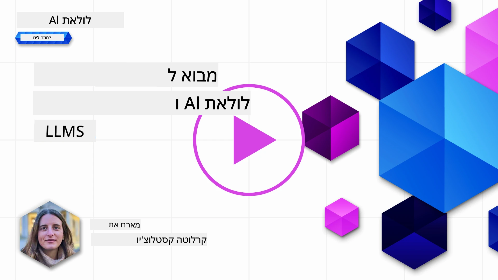
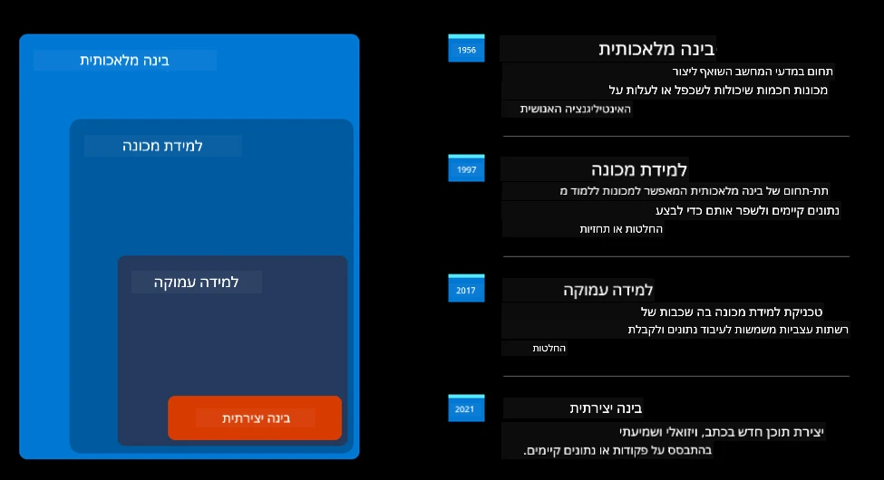
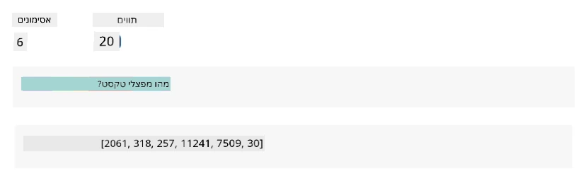
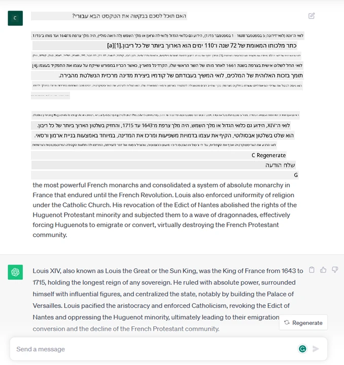
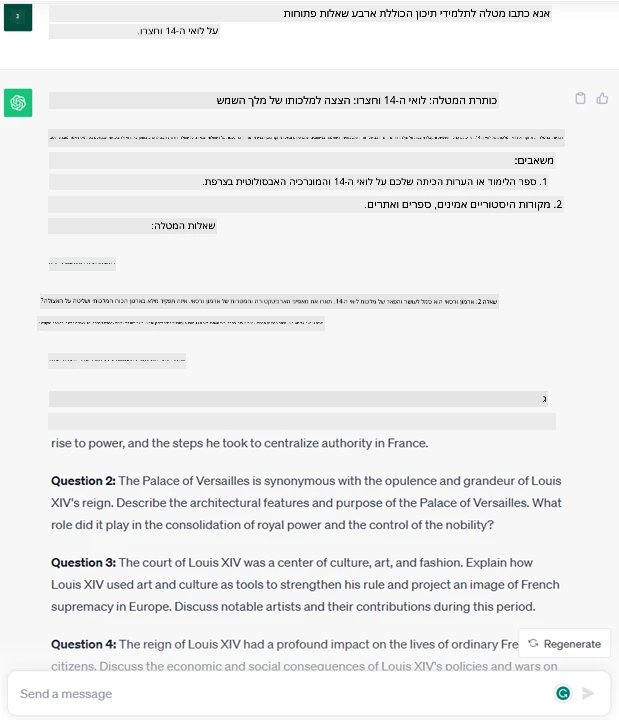
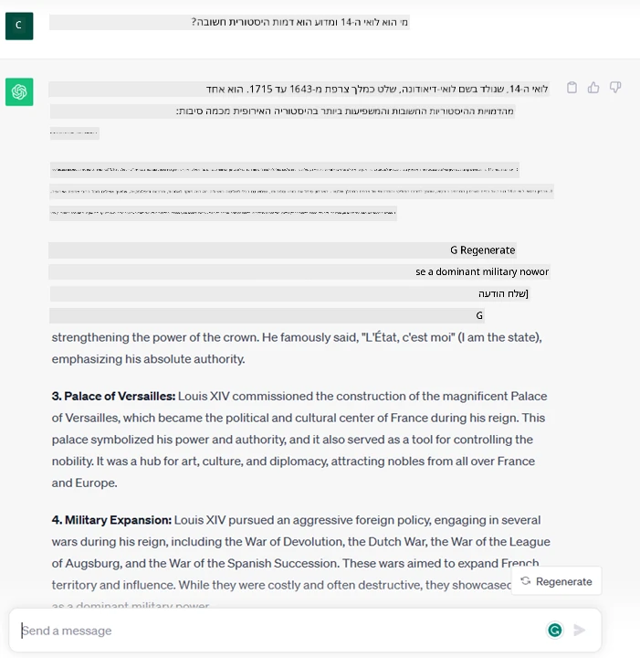
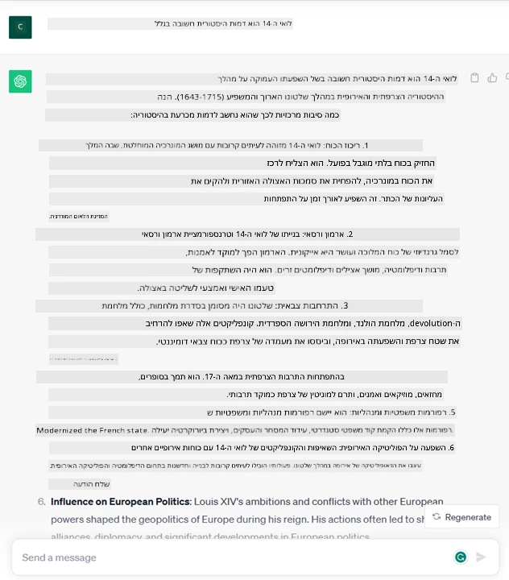
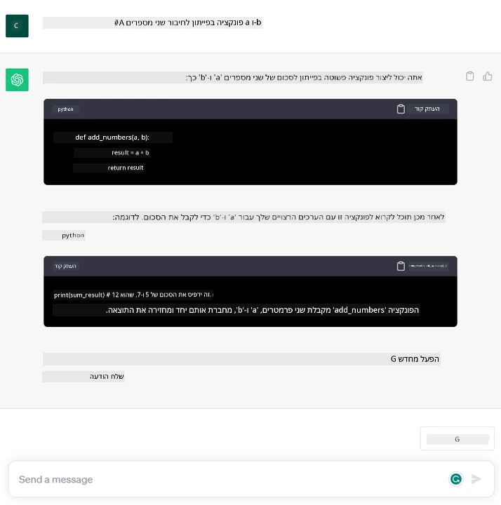

# מבוא ל-AI גנרטיבי ודגמי שפה גדולים  

  

_(לחצו על התמונה למעלה כדי לצפות בווידאו של השיעור)_  

AI גנרטיבי הוא אינטיליגנציה מלאכותית המסוגלת לייצר טקסט, תמונות וסוגי תוכן אחרים. מה שהופך אותו לטכנולוגיה מדהימה הוא שהיא מאפשרת דמוקרטיזציה של AI, כל אחד יכול להשתמש בו עם מינימום של פקודת טקסט, משפט שנכתב בשפה טבעית. אין צורך ללמוד שפה כמו Java או SQL כדי להשיג תוצאות משמעותיות, כל מה שצריך הוא להשתמש בשפה שלך, לנסח מה שאתה רוצה ותקבל הצעה ממודל AI. היישומים וההשפעה לכך הם עצומים, אתה כותב או מבין דוחות, כותב יישומים ועוד, הכל בתוך שניות.  

בקורס זה נחקור כיצד הסטארטאפ שלנו מנצל את ה-AI הגנרטיבי כדי לפתוח תרחישים חדשים בעולם החינוך וכיצד אנו מתמודדים עם האתגרים הבלתי נמנעים הקשורים להשלכות החברתיות של היישום והגבלות הטכנולוגיה.  

## מבוא  

שיעור זה יכלול:  

- מבוא לתרחיש העסקי: רעיון ומשימה של הסטארטאפ שלנו.  
- AI גנרטיבי וכיצד הגענו לנוף הטכנולוגי הנוכחי.  
- הפעילות הפנימית של מודל שפה גדול.  
- היכולות המרכזיות ומקרי שימוש מעשיים של דגמי שפה גדולים.  

## יעדי למידה  

בתום שיעור זה, תבינו:  

- מהו AI גנרטיבי וכיצד דגמי שפה גדולים פועלים.  
- כיצד ניתן לנצל דגמי שפה גדולים למקרי שימוש שונים, עם דגש על תרחישי חינוך.  

## תרחיש: הסטארטאפ החינוכי שלנו  

אינטיליגנציה מלאכותית גנרטיבית (AI) מייצגת את פסגת טכנולוגיית ה-AI, ודוחפת את הגבולות של מה שהאמינו אי פעם שהוא אפשרי. לדגמי AI גנרטיביים יש מספר יכולות ויישומים, אך במסגרת הקורס נחקור כיצד הם מבצעים מהפכה בתחום החינוך דרך סטארטאפ בדוי. נתייחס לסטארטאפ זה כאל _הסטארטאפ שלנו_. הסטארטאפ שלנו פועל בתחום החינוך עם הצהרת כוונות שאפתנית של  

> _שיפור הנגישות ללמידה, בקנה מידה עולמי, הבטחת גישה שווה לחינוך ומתן חוויות למידה מותאמות אישית לכל לומד, בהתאם לצרכיו_.  

צוות הסטארטאפ שלנו מודע לכך שלא נוכל להשיג מטרה זו ללא ניצול אחד הכלים העוצמתיים ביותר של זמננו – דגמי שפה גדולים (LLMs).  

מצופה שה-AI הגנרטיבי יגדיל בצורה משמעותית את האופן בו אנו לומדים ומלמדים כיום, כאשר לתלמידים יהיו מורים וירטואליים זמינים 24 שעות ביממה המספקים כמויות ענקיות של מידע ודוגמאות, והמורים יוכלו לנצל כלים חדשניים להערכת תלמידיהם ומתן משוב.  

  

נתחיל בהגדרת מושגים בסיסיים ומונחים שנשתמש בהם לאורך כל הקורס.  

## איך הגענו ל-AI גנרטיבי?  

למרות ההייפ המיוחד שנוצר לאחרונה עם הכרזות על דגמי AI גנרטיביים, טכנולוגיה זו נמצאת בפיתוח כבר עשרות שנים, כאשר מאמצי המחקר הראשונים מתייחסים לשנות ה-60. כיום אנו בנקודה בה ל-AI יש יכולות קוגניטיביות דמויות אדם, כמו שיחה כפי שמודגם למשל על ידי [OpenAI ChatGPT](https://openai.com/chatgpt) או [Microsoft Copilot](https://copilot.microsoft.com/?WT.mc_id=academic-105485-koreyst), שמשתמש גם הוא במודל GPT לחוויית חיפוש משוחח באינטרנט.  

נתחיל קצת אחורה, הפרוטוטיפים הראשונים של AI כללו צ'אטים מודפסים, שהסתמכו על בסיס ידע שהופק מקבוצת מומחים והוצג במחשב. התשובות בבסיס הידע הופעלו על ידי מילות מפתח שהופיעו בטקסט הקלט.  
עם זאת, מהר מאוד התברר שגישה כזו, המשתמשת בצ'אטבוטים מודפסים, לא סקלאבילית היטב.  

### גישה סטטיסטית ל-AI: למידת מכונה  

נקודת מפנה הגיעה בשנות ה-90, עם יישום גישה סטטיסטית לניתוח טקסט. זה הוביל לפיתוח אלגוריתמים חדשים – המכונים למידת מכונה – המסוגלים ללמוד דפוסים מתוך נתונים ללא תכנות מפורש. גישה זו מאפשרת למכונות לדמות הבנת שפה אנושית: מודל סטטיסטי מאומן על זוגות של טקסט ותוויות, המאפשר למודל לסווג טקסט לא מוכר עם תווית מוגדרת מראש המייצגת את כוונת ההודעה.  

### רשתות עצביות ועוזרים וירטואליים מודרניים  

בשנים האחרונות, ההתפתחות הטכנולוגית של חומרה היכולה להתמודד עם כמויות גדולות יותר של נתונים וחישובים מורכבים, עודדה מחקר ב-AI, והובילה לפיתוח אלגוריתמים מתקדמים של למידה עמוקה המכונים רשתות עצביות.  

רשתות עצביות (ובפרט רשתות עצביות חוזרות – RNNs) שיפרו משמעותית את עיבוד השפה הטבעית, המאפשרות ייצוג משמעותי יותר של טקסט, תוך התחשבות בהקשר של מילה במשפט.  

זוהי הטכנולוגיה שהניעה את העוזרים הווירטואליים שנולדו בעשור הראשון של המאה החדשה, מיומנים מאוד לפרש שפה אנושית, לזהות צורך ולבצע פעולה במטרה לספק אותו – כמו מענה עם סקריפט מוגדר מראש או שימוש בשירות צד שלישי.  

### היום, AI גנרטיבי  

כך הגענו ל-AI הגנרטיבי של היום, שנוכל לראותו כתת-תחום של למידה עמוקה.  

  

לאחר עשרות שנים של מחקר בתחום ה-AI, ארכיטקטורת מודל חדשה – שנקראת _Transformer_ – התגברה על המגבלות של רשתות RNN, כשהיא מסוגלת לקבל רצפי טקסט ארוכים בהרבה כקלט. טרנספורמרים מבוססים על מנגנון תשומת הלב (attention), המאפשר למודל להקצות משקלים שונים לקלטים שהוא מקבל, 'לתת יותר תשומת לב' היכן שמרוכזת המידע הרלוונטי ביותר, בלי תלות בסדר שלהם ברצף הטקסט.  

רוב הדגמים הגנרטיביים העכשוויים – הידועים גם כדגמי שפה גדולים (LLMs), מאחר שהם עובדים עם קלט ופלט טקסטואלי – מבוססים למעשה על ארכיטקטורה זו. מה שמעניין בדגמים אלו – שאומנו על כמות עצומה של נתונים לא מתויגים ממקורות מגוונים כמו ספרים, מאמרים ואתרים – הוא שהם ניתנים להסתגלות למגוון רחב של משימות ומייצרים טקסט דקדוקי תקין עם דמיון של יצירתיות. כך הם לא רק שיפרו בצורה חסרת תקדים את יכולת המכונה 'להבין' טקסט קלט, אלא גם אפשרו לה לייצר תגובה מקורית בשפה אנושית.  

## כיצד דגמי שפה גדולים פועלים?  

בפרק הבא נחקור סוגים שונים של דגמי AI גנרטיביים, אך בינתיים נבחן כיצד דגמי שפה גדולים פועלים, עם דגש על הדגמים של OpenAI GPT (Generative Pre-trained Transformer).  

- **טוקניזר, טקסט למספרים**: דגמי שפה גדולים מקבלים טקסט כקלט ומייצרים טקסט כפלט. עם זאת, כיוון שמדובר במודלים סטטיסטיים, הם עובדים הרבה יותר טוב עם מספרים מאשר עם רצפי טקסט. לכן כל קלט למודל מעובד על ידי טוקניזר, לפני השימוש במודל הליבה. טוקן הוא חתיכת טקסט – המורכבת ממספר משתנה של תווים, ולכן המשימה העיקרית של הטוקניזר היא לפצל את הקלט למערך של טוקנים. לאחר מכן, כל טוקן משויך לאינדקס טוקן, שהוא הקידוד השלמים של חתיכת הטקסט המקורית.  

  

- **חיזוי טוקנים פלטיים**: בהינתן n טוקנים כקלט (עם ערך מקסימלי n שמשתנה מדגם לדגם), המודל מסוגל לחזות טוקן אחד כפלט. טוקן זה משולב אז בקלט של האיטרציה הבאה, בתבנית חלון מתרחב, ומאפשר חוויית משתמש טובה יותר בקבלת משפט אחד (או כמה) כתשובה. זה מסביר למה, אם שיחקת פעם עם ChatGPT, ייתכן ששמת לב שהוא לפעמים נראה כאילו הוא מפסיק באמצע משפט.  

- **תהליך הבחירה, התפלגות הסתברותית**: טוקן הפלט נבחר על ידי המודל בהתאם להסתברות שלו להופיע אחרי רצף הטקסט הנוכחי. זאת כיוון שהמודל מנבא התפלגות הסתברותית על כל הטוקנים 'הבאים', מחושבת בהתבסס על האימון שלו. עם זאת, לא תמיד הטוקן עם ההסתברות הגבוהה ביותר נבחר מההתפלגות המתקבלת. מוסיפים מידה של אקראיות לבחירה זו, כך שהמודל פועל באופן לא דטרמיניסטי - איננו מקבלים תמיד את אותה תוצאה עבור אותו קלט. מידה זו של אקראיות מתווספת כדי לדמות את תהליך החשיבה היצירתית וניתנת לכיוונון באמצעות פרמטר במודל שנקרא טמפרטורה.  

## כיצד הסטארטאפ שלנו יכול לנצל דגמי שפה גדולים?  

עכשיו כשיש לנו הבנה טובה יותר של הפעילות הפנימית של מודל שפה גדול, נסתכל על דוגמאות מעשיות של המשימות הנפוצות ביותר שהם יכולים לבצע היטב, בעין לתרחיש העסקי שלנו.  
אמרנו שהיכולת המרכזית של מודל שפה גדול היא _לייצר טקסט מהתחלה, בהסתמך על קלט טקסטואלי בכתב בשפה טבעית_.  

אבל איזו סוג של קלט ופלט טקסטואלי?  
קלט של מודל שפה גדול נקרא פקודה (prompt), בעוד הפלט נקרא השלמה (completion), מונח המתייחס למנגנון המודל לייצר את הטוקן הבא להשלמת הקלט הנוכחי. נצלול לעומק מהי פקודה וכיצד לעצב אותה כדי להפיק את המרב מהמודל שלנו. אך כרגע נאמר שפלט יכול לכלול:  

- **הוראה** המפרטת את סוג הפלט המצופה מהמודל. הוראה זו לפעמים כוללת דוגמאות או נתונים נוספים.  

  1. סיכום של מאמר, ספר, ביקורות על מוצרים ועוד, כולל הפקת תובנות מנתונים לא מובנים.  
    
      
  
  2. יצירת רעיונות ועיצוב למאמר, חיבור, מטלה או יותר.  
      
       

- **שאלה**, שנשאלת בצורת שיחה עם סוכן.  
  
    

- קטע של **טקסט שיש להשלים**, שהוא בעצם בקשה לעזרה בכתיבה.  
  
    

- קטע של **קוד** יחד עם בקשה להסבר ותיעוד שלו, או תגובה המבקשת לייצר קטע קוד המבצע משימה ספציפית.  
  
    

הדוגמאות למעלה פשוטות למדי ואינן מיועדות להראות את כל יכולות דגמי השפה הגדולים. הן מיועדות להמחיש את הפוטנציאל בשימוש ב-AI גנרטיבי, בפרט אך לא רק בקשרים חינוכיים.  

כמו כן, הפלט של מודל AI גנרטיבי אינו מושלם ולפעמים היצירתיות של המודל יכולה לעבוד נגדו, וליצור פלט שהוא שילוב של מילים שלמשתמש האנושי עשוי להיראות כמיסטיפיקציה של המציאות, או שהוא עלול להיות פוגע. AI גנרטיבי אינו אינטליגנטי – לפחות בהגדרה הרחבה יותר של אינטליגנציה, הכוללת חשיבה ביקורתית ויצירתית או אינטליגנציה רגשית; הוא לא דטרמיניסטי, ואסור לסמוך עליו, כיוון שעלולות להיות בו המצאות, כמו הפניות שגויות, תוכן והצהרות, המשולבות עם מידע נכון ומוצגות באופן משכנע ובטוח. בשיעורים הבאים, נתמודד עם כל המגבלות האלו ונראה מה ניתן לעשות כדי להפחית אותן.  

## מטלה  

מטלתכם היא לקרוא עוד על [AI גנרטיבי](https://en.wikipedia.org/wiki/Generative_artificial_intelligence?WT.mc_id=academic-105485-koreyst) ולנסות לזהות תחום שבו הייתם מוסיפים AI גנרטיבי היום שאין בו כזה. כיצד ההשפעה תהיה שונה מאופן ה"ישן", האם תוכלו לעשות משהו שלא יכולתם קודם, או שתהיו מהירים יותר? כתבו סיכום של 300 מילים על כיצד הייתם רוצים שהסטארטאפ AI החלומי שלכם ייראה, וכללו כותרות כמו "בעיה", "כיצד אשתמש ב-AI", "השפעה" ואופציונלית תוכנית עסקית.  

אם עשיתם את המשימה, אולי גם תהיו מוכנים להגיש מועמדות למאיץ של מיקרוסופט, [Microsoft for Startups Founders Hub](https://www.microsoft.com/startups?WT.mc_id=academic-105485-koreyst) – אנו מציעים קרדיטים ל-Azure, OpenAI, מנטורינג ועוד, בדקו זאת!  

## בדיקת ידע  

מה נכון לגבי דגמי שפה גדולים?  

1. תמיד מקבלים את אותה תגובה מדויקת.  
1. הם עושים דברים בצורה מושלמת, מצוינים בחיבור מספרים, יוצרים קוד שעובד וכו’.  
1. התגובה עשויה להשתנות למרות השימוש באותה פקודה. הם גם מצוינים במתן טיוטה ראשונית של משהו, בין אם טקסט או קוד. אך יש צורך לשפר את התוצאות.  

תשובה: 3, דגם LLM הוא לא דטרמיניסטי, התגובה משתנה, אולם ניתן לשלוט על משתנותו באמצעות פרמטר הטמפרטורה. כמו כן, לא כדאי לצפות שהוא יבצע דברים באופן מושלם; הוא כאן כדי לבצע עבורכם את המשימות הכבדות, שבדרך כלל יניבו ניסיון ראשון טוב שצריך לשפר בהדרגה.  

## עבודה מצוינת! המשיכו במסע  

לאחר שסיימתם שיעור זה, בדקו את [אוסף למידת AI גנרטיבי שלנו](https://aka.ms/genai-collection?WT.mc_id=academic-105485-koreyst) כדי להמשיך לשדרג את הידע שלכם ב-AI גנרטיבי!  

עברו לשיעור 2 שם נבחן כיצד [לחקור ולהשוות סוגים שונים של LLM](../02-exploring-and-comparing-different-llms/README.md?WT.mc_id=academic-105485-koreyst)!

---

<!-- CO-OP TRANSLATOR DISCLAIMER START -->
**כתב ויתור**:
מסמך זה תורגם באמצעות שירות תרגום אוטומטי [Co-op Translator](https://github.com/Azure/co-op-translator). למרות שאנו שואפים לדיוק, יש לקחת בחשבון שתרגומים אוטומטיים עלולים להכיל שגיאות או אי-דיוקים. יש להחשיב את המסמך המקורי בשפתו הטבעית כמקור הסמכות. למידע קריטי מומלץ להשתמש בתרגום מקצועי על ידי מתרגם אדם. אנו לא אחראים לכל אי-הבנה או פירוש שגוי הנובע מהשימוש בתרגום זה.
<!-- CO-OP TRANSLATOR DISCLAIMER END -->