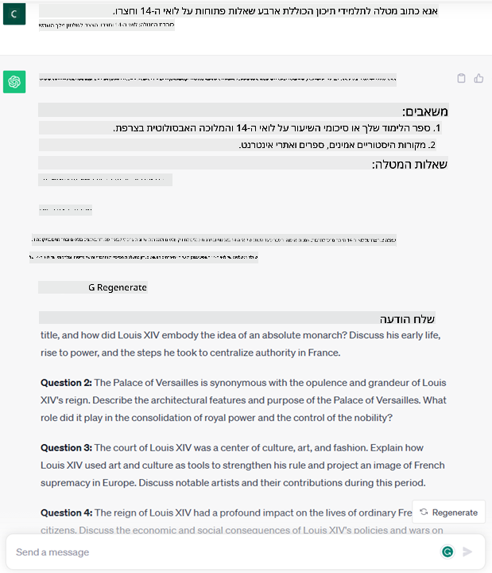
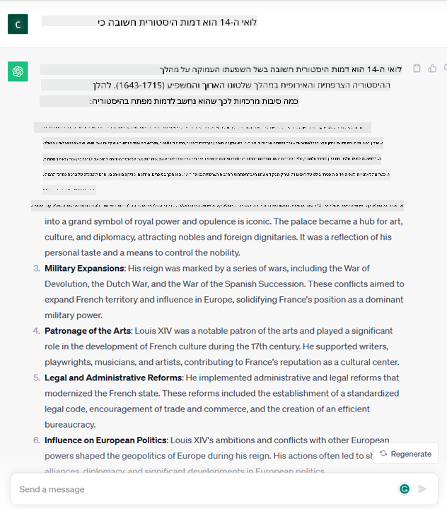

<!--
CO_OP_TRANSLATOR_METADATA:
{
  "original_hash": "f53ba0fa49164f9323043f1c6b11f2b1",
  "translation_date": "2025-07-09T07:57:01+00:00",
  "source_file": "01-introduction-to-genai/README.md",
  "language_code": "he"
}
-->
# מבוא ל-AI גנרטיבי ולמודלים גדולים של שפה

_(לחצו על התמונה למעלה לצפייה בסרטון של השיעור)_

AI גנרטיבי הוא בינה מלאכותית המסוגלת ליצור טקסט, תמונות וסוגי תוכן נוספים. מה שהופך אותה לטכנולוגיה מדהימה הוא שהיא מדמה את הבינה המלאכותית לנגישות לכולם – כל אחד יכול להשתמש בה עם פקודת טקסט פשוטה, משפט בשפה טבעית. אין צורך ללמוד שפות תכנות כמו Java או SQL כדי להשיג משהו משמעותי, כל מה שצריך זה להשתמש בשפה שלך, לציין מה אתה רוצה, ולקבל הצעה ממודל AI. היישומים וההשפעה של זה עצומים – אתה יכול לכתוב או להבין דוחות, לכתוב אפליקציות ועוד, הכל בתוך שניות.

בקורס הזה נחקור כיצד הסטארטאפ שלנו מנצל את ה-AI הגנרטיבי כדי לפתוח תרחישים חדשים בעולם החינוך, ואיך אנו מתמודדים עם האתגרים הבלתי נמנעים הקשורים להשלכות החברתיות של השימוש בטכנולוגיה ולמגבלות הטכנולוגיות.

## מבוא

בשיעור זה נסקור:

- מבוא לתרחיש העסקי: רעיון הסטארטאפ שלנו והמשימה שלו.
- AI גנרטיבי וכיצד הגענו לנוף הטכנולוגי הנוכחי.
- אופן הפעולה הפנימי של מודל שפה גדול.
- היכולות העיקריות ומקרי השימוש המעשיים של מודלים גדולים של שפה.

## מטרות הלמידה

בסיום השיעור תבינו:

- מהו AI גנרטיבי וכיצד פועלים מודלים גדולים של שפה.
- כיצד ניתן לנצל מודלים גדולים של שפה למגוון שימושים, עם דגש על תרחישי חינוך.

## תרחיש: הסטארטאפ החינוכי שלנו

בינה מלאכותית גנרטיבית (AI) מייצגת את שיא טכנולוגיית ה-AI, דוחפת את הגבולות של מה שנחשב בעבר לבלתי אפשרי. למודלים גנרטיביים יש יכולות ויישומים רבים, אך בקורס זה נחקור כיצד הם משנים את עולם החינוך דרך סטארטאפ בדיוני. נתייחס לסטארטאפ הזה כאל _הסטארטאפ שלנו_. הסטארטאפ שלנו פועל בתחום החינוך עם הצהרת משימה שאפתנית:

> _שיפור הנגישות ללמידה, בקנה מידה עולמי, תוך הבטחת גישה שוויונית לחינוך ומתן חוויות למידה מותאמות אישית לכל לומד, בהתאם לצרכיו_.

צוות הסטארטאפ שלנו מודע לכך שלא נוכל להשיג מטרה זו ללא ניצול אחד הכלים החזקים ביותר של זמננו – מודלים גדולים של שפה (LLMs).

צפוי שה-AI הגנרטיבי ישנה את הדרך בה אנו לומדים ומלמדים כיום, כאשר לסטודנטים יהיו זמינים מורים וירטואליים 24 שעות ביממה המספקים כמויות עצומות של מידע ודוגמאות, ומורים יוכלו להשתמש בכלים חדשניים להערכת תלמידיהם ומתן משוב.

נתחיל בהגדרת מושגים בסיסיים וטרמינולוגיה שנשתמש בהם לאורך כל הקורס.

## איך הגענו ל-AI גנרטיבי?

למרות ההייפ העצום שנוצר לאחרונה בעקבות הכרזות על מודלים גנרטיביים, הטכנולוגיה הזו מתפתחת כבר עשרות שנים, כאשר המאמצים הראשונים למחקר החלו בשנות ה-60. כיום אנו נמצאים בנקודה שבה ל-AI יש יכולות קוגניטיביות דמויות אדם, כמו שיחה, כפי שמודגם למשל ב-[OpenAI ChatGPT](https://openai.com/chatgpt) או [Bing Chat](https://www.microsoft.com/edge/features/bing-chat?WT.mc_id=academic-105485-koreyst), שגם משתמש במודל GPT לשיחות חיפוש באינטרנט.

נחזור קצת אחורה: הפרוטוטיפים הראשונים של AI היו צ'אטבוטים מבוססי טקסט, שהסתמכו על בסיס ידע שנלקח מקבוצת מומחים ויוצג במחשב. התשובות בבסיס הידע הופעלו על ידי מילות מפתח שהופיעו בטקסט הקלט. עם זאת, מהר מאוד התברר שגישה זו, של צ'אטבוטים מבוססי טקסט, לא התרחבה היטב.

### גישה סטטיסטית ל-AI: למידת מכונה

נקודת מפנה הגיעה בשנות ה-90, עם יישום גישה סטטיסטית לניתוח טקסט. זה הוביל לפיתוח אלגוריתמים חדשים – המכונים למידת מכונה – המסוגלים ללמוד דפוסים מתוך נתונים ללא תכנות מפורש. גישה זו מאפשרת למכונות לדמות הבנת שפה אנושית: מודל סטטיסטי מאומן על זוגות טקסט-תווית, ומאפשר למודל לסווג טקסט לא מוכר עם תווית מוגדרת מראש המייצגת את כוונת ההודעה.

### רשתות עצביות ועוזרים וירטואליים מודרניים

בשנים האחרונות, ההתפתחות הטכנולוגית של חומרה המסוגלת לטפל בכמויות גדולות יותר של נתונים ובחישובים מורכבים יותר, עודדה מחקר ב-AI, שהוביל לפיתוח אלגוריתמים מתקדמים של למידת מכונה המכונים רשתות עצביות או למידה עמוקה.

רשתות עצביות (ובמיוחד רשתות עצביות חוזרות – RNNs) שיפרו משמעותית את עיבוד השפה הטבעית, ואפשרו ייצוג משמעותי יותר של טקסט, תוך התחשבות בהקשר של מילה במשפט.

זו הטכנולוגיה שהניעה את העוזרים הווירטואליים שנולדו בעשור הראשון של המאה ה-21, שהיו מיומנים מאוד בפרשנות שפה אנושית, זיהוי צורך וביצוע פעולה למענה עליו – כמו מענה עם תסריט מוגדר מראש או שימוש בשירות צד שלישי.

### היום, AI גנרטיבי

כך הגענו ל-AI גנרטיבי של היום, שניתן לראותו כתת-תחום של למידה עמוקה.

לאחר עשורים של מחקר בתחום ה-AI, ארכיטקטורת מודל חדשה – שנקראת _Transformer_ – התגברה על מגבלות ה-RNNs, והייתה מסוגלת לקבל רצפי טקסט ארוכים בהרבה כקלט. ה-Transformers מבוססים על מנגנון תשומת לב, המאפשר למודל לתת משקלים שונים לקלטים שהוא מקבל, "לתת יותר תשומת לב" לאזורים שבהם מרוכזת המידע הרלוונטי ביותר, ללא תלות בסדרם ברצף הטקסט.

רוב המודלים הגנרטיביים האחרונים – הידועים גם כמודלים גדולים של שפה (LLMs), מכיוון שהם עובדים עם קלט ופלט טקסטואלי – מבוססים למעשה על ארכיטקטורה זו. מה שמעניין במודלים אלה – שאומנו על כמות עצומה של נתונים לא מתויגים ממקורות מגוונים כמו ספרים, מאמרים ואתרים – הוא שניתן להתאים אותם למגוון רחב של משימות וליצור טקסט דקדוקי תקין עם נימה של יצירתיות. כך, לא רק שהגבירו בצורה משמעותית את יכולת המכונה "להבין" טקסט קלט, אלא גם אפשרו לה ליצור תגובה מקורית בשפה אנושית.

## איך פועלים מודלים גדולים של שפה?

בפרק הבא נחקור סוגים שונים של מודלים גנרטיביים, אך בינתיים נבחן כיצד פועלים מודלים גדולים של שפה, עם דגש על מודלי OpenAI GPT (Generative Pre-trained Transformer).

- **Tokenizer, טקסט למספרים**: מודלים גדולים של שפה מקבלים טקסט כקלט ומייצרים טקסט כפלט. עם זאת, כמודלים סטטיסטיים, הם עובדים טוב יותר עם מספרים מאשר עם רצפי טקסט. לכן כל קלט למודל מעובד על ידי tokenizer, לפני השימוש במודל המרכזי. טוקן הוא חתיכת טקסט – המורכבת ממספר משתנה של תווים, ולכן תפקידו העיקרי של ה-tokenizer הוא לפצל את הקלט למערך של טוקנים. לאחר מכן, כל טוקן ממופה לאינדקס טוקן, שהוא הקידוד המספרי של חתיכת הטקסט המקורית.

- **חיזוי טוקנים בפלט**: בהינתן n טוקנים כקלט (עם מקסימום n שמשתנה ממודל למודל), המודל מסוגל לחזות טוקן אחד כפלט. טוקן זה משולב אז בקלט של האיטרציה הבאה, בדפוס חלון מתרחב, המאפשר חוויית משתמש טובה יותר של קבלת משפט אחד (או יותר) כתשובה. זה מסביר מדוע, אם שיחקת עם ChatGPT, ייתכן ששמת לב שלפעמים נראה שהוא עוצר באמצע משפט.

- **תהליך הבחירה, התפלגות הסתברותית**: טוקן הפלט נבחר על ידי המודל לפי ההסתברות שלו להופיע אחרי רצף הטקסט הנוכחי. זאת מכיוון שהמודל חוזה התפלגות הסתברותית על כל הטוקנים האפשריים הבאים, המחושבת על בסיס האימון שלו. עם זאת, לא תמיד הטוקן עם ההסתברות הגבוהה ביותר נבחר מתוך ההתפלגות. מוסיפים מידה של אקראיות לבחירה זו, כך שהמודל פועל בצורה לא דטרמיניסטית – לא מקבלים את אותו פלט מדויק עבור אותו קלט. מידה זו של אקראיות מתווספת כדי לדמות תהליך של חשיבה יצירתית וניתן לכוונן אותה באמצעות פרמטר במודל שנקרא טמפרטורה.

## כיצד הסטארטאפ שלנו יכול לנצל מודלים גדולים של שפה?

כעת, כשיש לנו הבנה טובה יותר של אופן הפעולה הפנימי של מודל שפה גדול, נבחן כמה דוגמאות מעשיות של המשימות הנפוצות ביותר שהם מבצעים היטב, עם מבט לתרחיש העסקי שלנו. אמרנו שהיכולת העיקרית של מודל שפה גדול היא _ליצור טקסט מאפס, בהתבסס על קלט טקסטואלי בשפה טבעית_.

אבל איזה סוג של קלט ופלט טקסטואלי?  
הקלט של מודל שפה גדול נקרא prompt, בעוד שהפלט נקרא completion, מונח המתייחס למנגנון המודל ליצירת הטוקן הבא להשלמת הקלט הנוכחי. נצלול לעומק מהו prompt ואיך לעצב אותו כך שנפיק את המירב מהמודל. בינתיים, נאמר ש-prompt יכול לכלול:

- **הוראה** שמציינת את סוג הפלט שאנו מצפים לקבל מהמודל. הוראה זו לפעמים כוללת דוגמאות או נתונים נוספים.

  1. סיכום של מאמר, ספר, ביקורות מוצר ועוד, יחד עם הפקת תובנות מנתונים לא מובנים.
    
    
  
  2. יצירת רעיונות ועיצוב של מאמר, חיבור, מטלה ועוד.
      
     

- **שאלה**, המוצגת בצורת שיחה עם סוכן.

  

- קטע **טקסט להשלמה**, שהוא למעשה בקשה לעזרה בכתיבה.

  

- קטע **קוד** יחד עם בקשה להסבר ותיעוד שלו, או הערה המבקשת ליצור קוד שמבצע משימה מסוימת.

  

הדוגמאות שלמעלה פשוטות יחסית ואינן מיועדות להציג את כל היכולות של מודלים גדולים של שפה. הן נועדו להמחיש את הפוטנציאל של שימוש ב-AI גנרטיבי, בפרט אך לא רק בהקשרים חינוכיים.

כמו כן, הפלט של מודל AI גנרטיבי אינו מושלם ולפעמים היצירתיות של המודל עלולה לפעול נגדו, וליצור פלט שהוא שילוב של מילים שהמשתמש האנושי יכול לפרש כמיסטיפיקציה של המציאות, או אפילו כפוגעני. AI גנרטיבי אינו אינטליגנטי – לפחות לא בהגדרה הרחבה של אינטליגנציה, הכוללת חשיבה ביקורתית ויצירתית או אינטליגנציה רגשית; הוא אינו דטרמיניסטי, ואינו אמין, שכן עלולות להופיע המצאות, כמו הפניות שגויות, תוכן והצהרות, המשולבות עם מידע נכון ומוצגות בצורה משכנעת ובטוחה. בשיעורים הבאים נתמודד עם כל המגבלות הללו ונראה מה ניתן לעשות כדי למתן אותן.

## מטלה

המשימה שלך היא לקרוא עוד על [AI גנרטיבי](https://en.wikipedia.org/wiki/Generative_artificial_intelligence?WT.mc_id=academic-105485-koreyst) ולנסות לזהות תחום שבו היית מוסיף AI גנרטיבי היום שאין בו כזה. איך ההשפעה תהיה שונה מהדרך "הישנה"? האם תוכל לעשות משהו שלא יכולת לפני כן, או שאתה מהיר יותר? כתוב סיכום של 300 מילים על איך הסטארטאפ AI החלומי שלך ייראה, וכלול כותרות כמו "בעיה", "איך אשתמש ב-AI", "השפעה" ואופציונלית תוכנית עסקית.

אם ביצעת את המשימה, ייתכן שאתה אפילו מוכן להגיש מועמדות למאיץ של מיקרוסופט, [Microsoft for Startups Founders Hub](https://www.microsoft.com/startups?WT.mc_id=academic-105485-koreyst) – אנו מציעים קרדיטים ל-Azure, OpenAI, מנטורינג ועוד, בדוק את זה!

## בדיקת ידע

מה נכון לגבי מודלים גדולים של שפה?

1. מקבלים את אותה תגובה מדויקת בכל פעם.  
2. הם עושים הכל בצורה מושלמת, מצוינים בחיבור מספרים, יצירת קוד עובד וכו'.  
3. התגובה עשויה להשתנות למרות שימוש באותו prompt. הם גם מצוינים במתן טיוטה ראשונה של משהו, בין אם טקסט או קוד. אבל צריך לשפר את התוצאות.

תשובה: 3, LLM הוא לא דטרמיניסטי, התגובה משתנה, אך ניתן לשלוט בשונות שלו באמצעות הגדרת טמפרטורה. גם לא כדאי לצפות שהוא יעשה הכל בצורה מושלמת, הוא כאן כדי לעשות את העבודה הכבדה עבורך, שלרוב תביא ניסיון ראשון טוב שצריך לשפר בהדרגה.

## עבודה מצוינת! המשך את המסע

בסיום השיעור, בדוק את [אוסף הלמידה של AI גנרטיבי](https://aka.ms/genai-collection?WT.mc_id=academic-105485-koreyst) שלנו כדי להמשיך להעמיק את הידע שלך ב-AI גנרטיבי!
עבור לשיעור 2 שבו נבחן כיצד [לחקור ולהשוות בין סוגים שונים של LLM](../02-exploring-and-comparing-different-llms/README.md?WT.mc_id=academic-105485-koreyst)!

**כתב ויתור**:  
מסמך זה תורגם באמצעות שירות תרגום מבוסס בינה מלאכותית [Co-op Translator](https://github.com/Azure/co-op-translator). למרות שאנו שואפים לדיוק, יש לקחת בחשבון כי תרגומים אוטומטיים עלולים להכיל שגיאות או אי-דיוקים. המסמך המקורי בשפת המקור שלו נחשב למקור הסמכותי. למידע קריטי מומלץ להשתמש בתרגום מקצועי על ידי מתרגם אנושי. אנו לא נושאים באחריות לכל אי-הבנה או פרשנות שגויה הנובעת משימוש בתרגום זה.