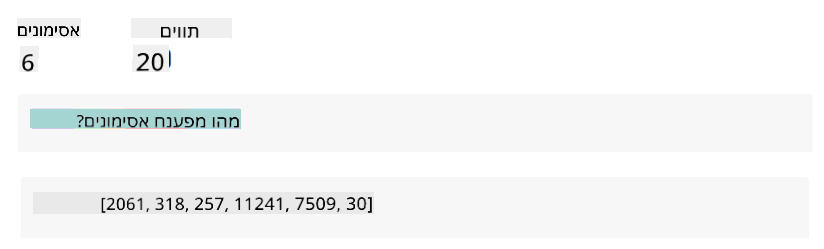
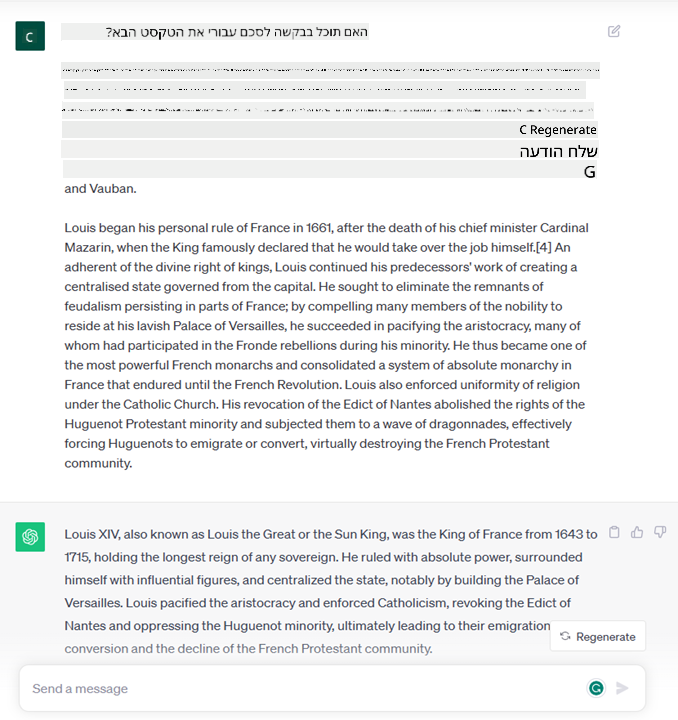

<!--
CO_OP_TRANSLATOR_METADATA:
{
  "original_hash": "bfb7901bdbece1ba3e9f35c400ca33e8",
  "translation_date": "2025-10-17T20:07:39+00:00",
  "source_file": "01-introduction-to-genai/README.md",
  "language_code": "he"
}
-->
# מבוא ל-AI גנרטיבי ומודלים לשוניים גדולים

_(לחצו על התמונה למעלה לצפייה בסרטון של השיעור הזה)_

AI גנרטיבי הוא בינה מלאכותית המסוגלת לייצר טקסט, תמונות וסוגים אחרים של תוכן. מה שהופך אותה לטכנולוגיה מדהימה הוא שהיא מנגישה את הבינה המלאכותית לכולם; כל אחד יכול להשתמש בה עם מעט כמו הנחיה טקסטואלית, משפט שנכתב בשפה טבעית. אין צורך ללמוד שפה כמו Java או SQL כדי להשיג משהו בעל ערך, כל מה שצריך זה להשתמש בשפה שלך, להגדיר מה אתה רוצה, והמודל של הבינה המלאכותית יציע הצעה. היישומים וההשפעה של זה הם עצומים – כתיבת או הבנת דוחות, יצירת יישומים ועוד, הכל תוך שניות.

בתוכנית הלימודים הזו, נחקור כיצד הסטארטאפ שלנו מנצל את ה-AI הגנרטיבי כדי לפתוח תרחישים חדשים בעולם החינוך וכיצד אנו מתמודדים עם האתגרים הבלתי נמנעים הקשורים להשלכות החברתיות של יישומו ולמגבלות הטכנולוגיה.

## מבוא

השיעור הזה יעסוק ב:

- מבוא לתרחיש העסקי: רעיון הסטארטאפ שלנו והמשימה שלו.
- AI גנרטיבי וכיצד הגענו לנוף הטכנולוגי הנוכחי.
- הפעולה הפנימית של מודל לשוני גדול.
- יכולות עיקריות ושימושים מעשיים של מודלים לשוניים גדולים.

## מטרות למידה

לאחר השלמת השיעור הזה, תבינו:

- מהו AI גנרטיבי וכיצד מודלים לשוניים גדולים פועלים.
- כיצד ניתן לנצל מודלים לשוניים גדולים עבור שימושים שונים, עם דגש על תרחישים חינוכיים.

## תרחיש: הסטארטאפ החינוכי שלנו

בינה מלאכותית גנרטיבית (AI) מייצגת את פסגת הטכנולוגיה של הבינה המלאכותית, ודוחפת את גבולות מה שהיה פעם בלתי אפשרי. למודלים של AI גנרטיבי יש יכולות ויישומים רבים, אך בתוכנית הלימודים הזו נחקור כיצד היא מהפכת את החינוך דרך סטארטאפ בדיוני. נקרא לסטארטאפ הזה _הסטארטאפ שלנו_. הסטארטאפ שלנו פועל בתחום החינוך עם הצהרת משימה שאפתנית:

> _שיפור הנגישות ללמידה בקנה מידה עולמי, הבטחת גישה שוויונית לחינוך ומתן חוויות למידה מותאמות אישית לכל לומד, בהתאם לצרכיו._

צוות הסטארטאפ שלנו מודע לכך שלא נוכל להשיג את המטרה הזו ללא ניצול אחד הכלים החזקים ביותר של זמננו – מודלים לשוניים גדולים (LLMs).

AI גנרטיבי צפוי לשנות את הדרך שבה אנו לומדים ומלמדים כיום, עם תלמידים שיכולים להיעזר במורים וירטואליים 24 שעות ביממה המספקים כמויות עצומות של מידע ודוגמאות, ומורים שיכולים לנצל כלים חדשניים להערכת תלמידיהם ומתן משוב.

כדי להתחיל, בואו נגדיר כמה מושגים בסיסיים ומונחים שנשתמש בהם לאורך תוכנית הלימודים.

## איך הגענו ל-AI גנרטיבי?

למרות ההייפ יוצא הדופן שנוצר לאחרונה בעקבות הכרזת המודלים של AI גנרטיבי, הטכנולוגיה הזו נמצאת בפיתוח כבר עשרות שנים, כאשר המאמצים המחקריים הראשונים החלו בשנות ה-60. כיום אנו נמצאים בנקודה שבה AI בעל יכולות קוגניטיביות אנושיות, כמו שיחה, כפי שמוצג לדוגמה על ידי [OpenAI ChatGPT](https://openai.com/chatgpt) או [Bing Chat](https://www.microsoft.com/edge/features/bing-chat?WT.mc_id=academic-105485-koreyst), שגם הוא משתמש במודל GPT עבור שיחות חיפוש באינטרנט.

אם נחזור קצת אחורה, האבות הטיפוס הראשונים של AI היו צ'אטבוטים כתובים, שהתבססו על בסיס ידע שהופק מקבוצת מומחים ויוצג במחשב. התשובות בבסיס הידע הופעלו על ידי מילות מפתח שהופיעו בטקסט הקלט. עם זאת, במהרה התברר שגישה כזו, המשתמשת בצ'אטבוטים כתובים, אינה מתאימה להיקפים גדולים.

### גישה סטטיסטית ל-AI: למידת מכונה

נקודת מפנה הגיעה במהלך שנות ה-90, עם יישום גישה סטטיסטית לניתוח טקסט. זה הוביל לפיתוח אלגוריתמים חדשים – הידועים כלמידת מכונה – המסוגלים ללמוד דפוסים מנתונים מבלי להיות מתוכנתים באופן מפורש. גישה זו מאפשרת למכונות לדמות הבנה של שפה אנושית: מודל סטטיסטי מאומן על זוגות טקסט-תווית, ומאפשר למודל לסווג טקסט קלט לא ידוע עם תווית מוגדרת מראש המייצגת את כוונת ההודעה.

### רשתות עצביות ועוזרים וירטואליים מודרניים

בשנים האחרונות, ההתפתחות הטכנולוגית של חומרה, המסוגלת להתמודד עם כמויות גדולות יותר של נתונים וחישובים מורכבים יותר, עודדה מחקר ב-AI, והובילה לפיתוח אלגוריתמים מתקדמים של למידת מכונה הידועים כרשתות עצביות או אלגוריתמים של למידה עמוקה.

רשתות עצביות (ובמיוחד רשתות עצביות חוזרות – RNNs) שיפרו באופן משמעותי את עיבוד השפה הטבעית, ואפשרו ייצוג משמעותי יותר של משמעות הטקסט, תוך התחשבות בהקשר של מילה במשפט.

זו הטכנולוגיה שהניעה את העוזרים הווירטואליים שנולדו בעשור הראשון של המאה החדשה, שהיו מיומנים מאוד בפירוש שפה אנושית, זיהוי צורך וביצוע פעולה כדי לספק אותו – כמו מתן תשובה עם תסריט מוגדר מראש או שימוש בשירות צד שלישי.

### ימינו, AI גנרטיבי

כך הגענו ל-AI גנרטיבי כיום, שניתן לראות אותו כתת-תחום של למידה עמוקה.

לאחר עשרות שנים של מחקר בתחום ה-AI, ארכיטקטורת מודל חדשה – שנקראת _Transformer_ – התגברה על מגבלות ה-RNNs, והייתה מסוגלת לקבל רצפים ארוכים יותר של טקסט כקלט. Transformers מבוססים על מנגנון תשומת הלב, שמאפשר למודל לתת משקל שונה לקלטים שהוא מקבל, 'לשים יותר תשומת לב' במקום שבו מרוכזת המידע הרלוונטי ביותר, ללא קשר לסדר שלהם ברצף הטקסט.

רוב המודלים הגנרטיביים האחרונים – הידועים גם כמודלים לשוניים גדולים (LLMs), מכיוון שהם עובדים עם קלטים ופלטים טקסטואליים – מבוססים למעשה על ארכיטקטורה זו. מה שמעניין במודלים האלה – שמאומנים על כמות עצומה של נתונים לא מתויגים ממקורות מגוונים כמו ספרים, מאמרים ואתרי אינטרנט – הוא שהם יכולים להיות מותאמים למגוון רחב של משימות ולייצר טקסט נכון מבחינה דקדוקית עם מראית עין של יצירתיות. כך, הם לא רק שיפרו באופן מדהים את יכולת המכונה 'להבין' טקסט קלט, אלא גם אפשרו את יכולתה לייצר תגובה מקורית בשפה אנושית.

## איך מודלים לשוניים גדולים פועלים?

בפרק הבא נחקור סוגים שונים של מודלים גנרטיביים, אבל לעת עתה בואו נסתכל על איך מודלים לשוניים גדולים פועלים, עם דגש על מודלים של OpenAI GPT (Generative Pre-trained Transformer).

- **Tokenizer, טקסט למספרים**: מודלים לשוניים גדולים מקבלים טקסט כקלט ומייצרים טקסט כפלט. עם זאת, בהיותם מודלים סטטיסטיים, הם עובדים הרבה יותר טוב עם מספרים מאשר עם רצפי טקסט. לכן כל קלט למודל מעובד על ידי Tokenizer, לפני שהוא משמש את המודל המרכזי. טוקן הוא חלק טקסט – שמורכב ממספר משתנה של תווים, כך שהמשימה העיקרית של ה-Tokenizer היא לפצל את הקלט למערך של טוקנים. לאחר מכן, כל טוקן ממופה עם אינדקס טוקן, שהוא קידוד מספרי של חלק הטקסט המקורי.

- **ניבוי טוקנים בפלט**: בהתחשב ב-n טוקנים כקלט (עם n מקסימלי שמשתנה ממודל למודל), המודל מסוגל לנבא טוקן אחד כפלט. טוקן זה משולב לאחר מכן בקלט של האיטרציה הבאה, בתבנית חלון מתרחבת, מה שמאפשר חוויית משתמש טובה יותר של קבלת משפט אחד (או יותר) כתשובה. זה מסביר מדוע, אם אי פעם שיחקתם עם ChatGPT, אולי שמתם לב שלפעמים נראה שהוא עוצר באמצע משפט.

- **תהליך הבחירה, התפלגות הסתברות**: טוקן הפלט נבחר על ידי המודל בהתאם להסתברות שלו להופיע לאחר רצף הטקסט הנוכחי. זאת מכיוון שהמודל מנבא התפלגות הסתברותית על פני כל ה'טוקנים הבאים' האפשריים, מחושבת על בסיס האימון שלו. עם זאת, לא תמיד הטוקן עם ההסתברות הגבוהה ביותר נבחר מההתפלגות המתקבלת. מוסיפים מידה של אקראיות לבחירה זו, באופן שבו המודל פועל בצורה לא דטרמיניסטית – אנחנו לא מקבלים את אותו הפלט בדיוק עבור אותו הקלט. מידה זו של אקראיות מתווספת כדי לדמות את תהליך החשיבה היצירתית וניתן לכוונן אותה באמצעות פרמטר מודל שנקרא טמפרטורה.

## איך הסטארטאפ שלנו יכול לנצל מודלים לשוניים גדולים?

עכשיו, כשיש לנו הבנה טובה יותר של הפעולה הפנימית של מודל לשוני גדול, בואו נראה כמה דוגמאות מעשיות למשימות הנפוצות ביותר שהמודלים האלה יכולים לבצע בצורה טובה, עם מבט על תרחיש העסק שלנו. אמרנו שהיכולת העיקרית של מודל לשוני גדול היא _לייצר טקסט מאפס, החל מקלט טקסטואלי שנכתב בשפה טבעית_.

אבל איזה סוג של קלט ופלט טקסטואלי?
הקלט של מודל לשוני גדול ידוע כהנחיה (prompt), בעוד שהפלט ידוע כהשלמה, מונח שמתייחס למנגנון המודל של יצירת הטוקן הבא להשלמת הקלט הנוכחי. נעמיק בהמשך מהי הנחיה וכיצד לעצב אותה בצורה שתפיק את המירב מהמודל שלנו. אבל לעת עתה, נאמר שהנחיה יכולה לכלול:

- **הוראה** שמפרטת את סוג הפלט שאנו מצפים מהמודל. ההוראה עשויה לעיתים לכלול דוגמאות או נתונים נוספים.

  1. סיכום של מאמר, ספר, ביקורות מוצרים ועוד, יחד עם הפקת תובנות מנתונים לא מובנים.
    
    
  
  2. יצירת רעיונות ועיצוב יצירתי של מאמר, חיבור, משימה או יותר.
      
     

- **שאלה**, שנשאלת בצורה של שיחה עם סוכן.
  
  

- חלק של **טקסט להשלמה**, שמרמז על בקשה לעזרה בכתיבה.
  
  

- חלק של **קוד** יחד עם בקשה להסבר ותיעוד שלו, או הערה שמבקשת לייצר קטע קוד שמבצע משימה ספציפית.
  
  

הדוגמאות לעיל הן די פשוטות ואינן מיועדות להיות הדגמה ממצה של יכולות המודלים לשוניים גדולים. הן נועדו להראות את הפוטנציאל של שימוש ב-AI גנרטיבי, במיוחד אך לא רק בהקשרים חינוכיים.

בנוסף, הפלט של מודל AI גנרטיבי אינו מושלם ולעיתים היצירתיות של המודל יכולה לפעול נגדו, מה שמוביל לפלט שהוא שילוב של מילים שהמשתמש האנושי יכול לפרש כמיסטיפיקציה של המציאות, או שהוא יכול להיות פוגעני. AI גנרטיבי אינו אינטליגנטי – לפחות בהגדרה המקיפה יותר של אינטליגנציה, הכוללת חשיבה ביקורתית ויצירתית או אינטליגנציה רגשית; הוא אינו דטרמיניסטי, והוא אינו אמין, שכן שגיאות, כמו הפניות שגויות, תוכן והצהרות, עשויים להיות משולבים עם מידע נכון ומוצגים בצורה משכנעת ובטוחה. בשיעורים הבאים, נתמודד עם כל המגבלות הללו ונראה מה ניתן לעשות כדי לצמצם אותן.

## משימה

המשימה שלכם היא לקרוא עוד על [AI גנרטיבי](https://en.wikipedia.org
גשו לשיעור 2, שם נבחן כיצד [לחקור ולהשוות בין סוגים שונים של LLM](../02-exploring-and-comparing-different-llms/README.md?WT.mc_id=academic-105485-koreyst)!

---

**כתב ויתור**:  
מסמך זה תורגם באמצעות שירות תרגום AI [Co-op Translator](https://github.com/Azure/co-op-translator). למרות שאנו שואפים לדיוק, יש לקחת בחשבון שתרגומים אוטומטיים עשויים להכיל שגיאות או אי דיוקים. המסמך המקורי בשפתו המקורית צריך להיחשב כמקור סמכותי. עבור מידע קריטי, מומלץ להשתמש בתרגום מקצועי אנושי. איננו נושאים באחריות לאי הבנות או לפרשנויות שגויות הנובעות משימוש בתרגום זה.