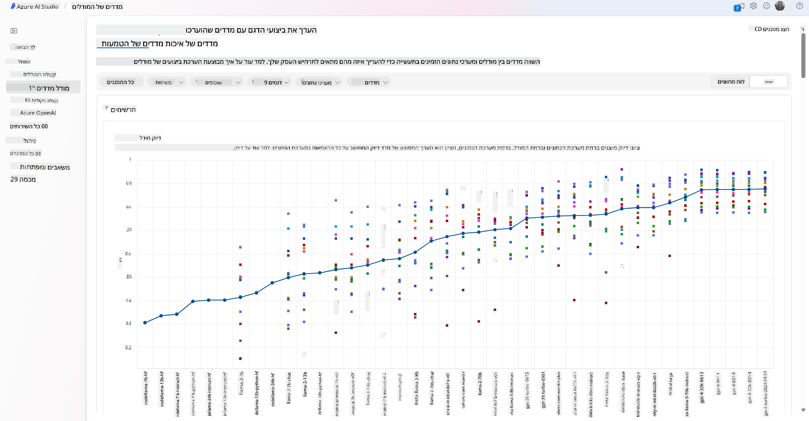
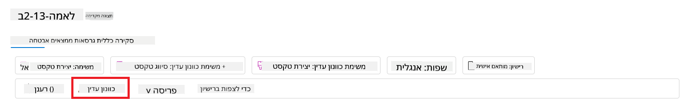
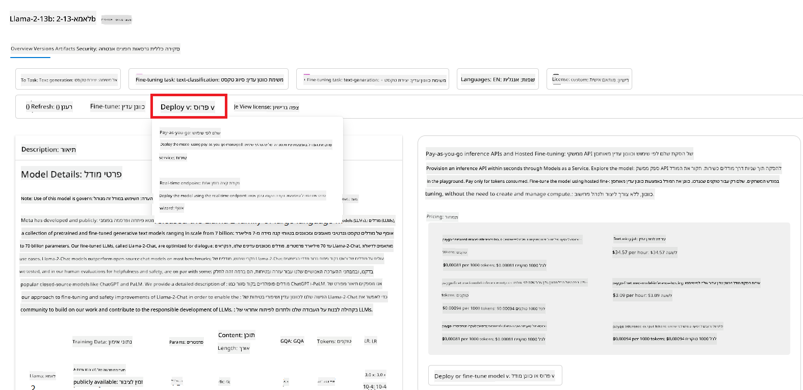
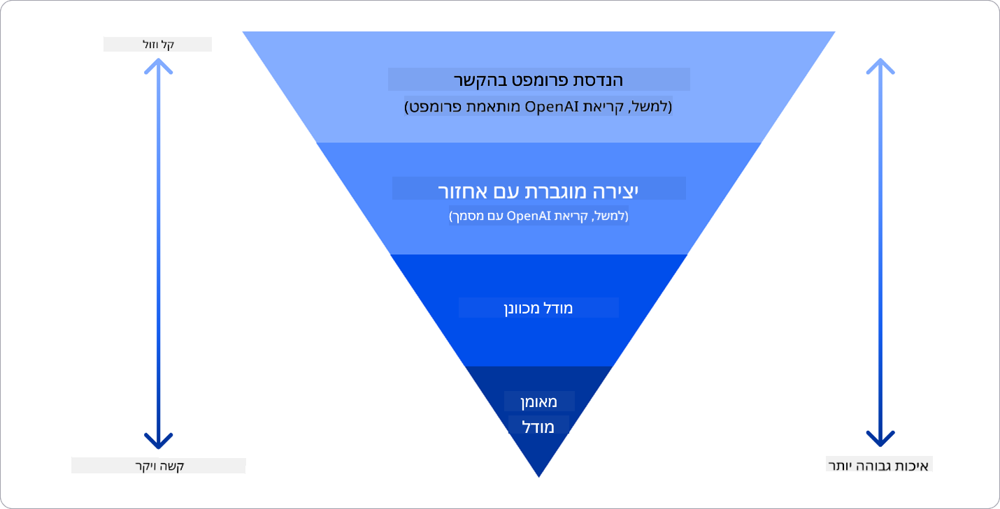

<!--
CO_OP_TRANSLATOR_METADATA:
{
  "original_hash": "e2f686f2eb794941761252ac5e8e090b",
  "translation_date": "2025-05-19T14:10:39+00:00",
  "source_file": "02-exploring-and-comparing-different-llms/README.md",
  "language_code": "he"
}
-->
# חקר והשוואה בין מודלים גדולים של שפה

> _לחץ על התמונה למעלה כדי לצפות בסרטון של השיעור הזה_

בשיעור הקודם ראינו כיצד בינה מלאכותית גנרטיבית משנה את נוף הטכנולוגיה, כיצד מודלים גדולים של שפה (LLMs) פועלים וכיצד עסק - כמו הסטארטאפ שלנו - יכול ליישם אותם במקרים שלהם ולצמוח! בפרק זה, אנו מתכוונים להשוות ולבחון סוגים שונים של מודלים גדולים של שפה כדי להבין את היתרונות והחסרונות שלהם.

השלב הבא במסע הסטארטאפ שלנו הוא חקר הנוף הנוכחי של מודלים גדולים של שפה והבנה אילו מהם מתאימים למקרה השימוש שלנו.

## מבוא

שיעור זה יכסה:

- סוגים שונים של מודלים גדולים של שפה בנוף הנוכחי.
- בדיקה, איטרציה והשוואה בין מודלים שונים למקרה השימוש שלך ב-Azure.
- כיצד לפרוס מודל גדול של שפה.

## מטרות למידה

לאחר השלמת השיעור, תוכל:

- לבחור את המודל הנכון למקרה השימוש שלך.
- להבין כיצד לבדוק, לבצע איטרציה ולשפר את ביצועי המודל שלך.
- לדעת כיצד עסקים מפרסים מודלים.

## הבנת סוגים שונים של מודלים גדולים של שפה

מודלים גדולים של שפה יכולים להיות מסווגים לפי ארכיטקטורה, נתוני אימון ומקרה שימוש. הבנת ההבדלים הללו תעזור לסטארטאפ שלנו לבחור את המודל הנכון לתרחיש ולהבין כיצד לבדוק, לבצע איטרציה ולשפר ביצועים.

ישנם סוגים רבים ושונים של מודלים גדולים של שפה, הבחירה שלך תלויה במה שאתה מתכוון להשתמש בהם, בנתונים שלך, כמה אתה מוכן לשלם ועוד.

בהתאם אם אתה מתכוון להשתמש במודלים ליצירת טקסט, אודיו, וידאו, תמונה וכדומה, ייתכן שתרצה לבחור סוג שונה של מודל.

- **זיהוי אודיו ודיבור**. למטרה זו, מודלים מסוג Whisper הם בחירה מצוינת מכיוון שהם כלליים ומכוונים לזיהוי דיבור. הם מאומנים על אודיו מגוון ויכולים לבצע זיהוי דיבור רב לשוני.

- **יצירת תמונות**. ליצירת תמונות, DALL-E ו-Midjourney הם שתי בחירות ידועות. DALL-E מוצע על ידי Azure OpenAI.

- **יצירת טקסט**. רוב המודלים מאומנים על יצירת טקסט ויש לך מגוון רחב של בחירות מ-GPT-3.5 ועד GPT-4. הם מגיעים בעלויות שונות עם GPT-4 שהוא היקר ביותר.

- **רב-מודאליות**. אם אתה מחפש לטפל בסוגי נתונים מרובים בקלט ובפלט, ייתכן שתרצה לבדוק מודלים כמו gpt-4 turbo עם ראייה או gpt-4o.

בחירת מודל מעניקה לך כמה יכולות בסיסיות, שאולי לא יהיו מספיקות. לעיתים יש לך נתונים ספציפיים לחברה שאתה צריך להודיע למודל. ישנן כמה אפשרויות כיצד לגשת לזה, על כך נרחיב בהמשך.

### מודלים בסיסיים לעומת מודלים גדולים של שפה

המונח מודל בסיסי הוגדר על ידי חוקרים מסטנפורד כמודל AI שעומד בכמה קריטריונים, כגון:

- **מאומנים בלמידה ללא פיקוח או למידה עצמית**. כלומר הם מאומנים על נתונים רב-מודאליים ללא תיוג, ולא דורשים אנוטציה או תיוג אנושי בתהליך האימון שלהם.
- **מודלים גדולים מאוד**. מבוססים על רשתות עצביות עמוקות מאוד מאומנות על מיליארדי פרמטרים.
- **מיועדים לשמש כ'בסיס' למודלים אחרים**. כלומר ניתן להשתמש בהם כנקודת התחלה לבניית מודלים אחרים על גביהם, מה שניתן לעשות על ידי התאמה עדינה.

כדי להבהיר עוד את ההבדל הזה, ניקח את ChatGPT כדוגמה. כדי לבנות את הגרסה הראשונה של ChatGPT, מודל בשם GPT-3.5 שימש כמודל בסיסי. המשמעות היא ש-OpenAI השתמשו בנתונים ספציפיים לצ'אט כדי ליצור גרסה מותאמת של GPT-3.5 שהתמחתה בביצועים טובים בתרחישים של שיחה, כמו צ'אטבוטים.

### מודלים בקוד פתוח לעומת מודלים קנייניים

דרך נוספת לסווג מודלים גדולים של שפה היא האם הם בקוד פתוח או קנייניים.

מודלים בקוד פתוח הם מודלים הזמינים לציבור וניתן להשתמש בהם על ידי כל אחד. הם לעיתים זמינים על ידי החברה שיצרה אותם, או על ידי קהילת המחקר. ניתן לבדוק, לשנות ולהתאים את המודלים הללו לשימושים שונים במודלים גדולים של שפה. עם זאת, הם לא תמיד מותאמים לשימוש בייצור, ולא תמיד הם מבצעים כמו מודלים קנייניים.

מודלים קנייניים הם מודלים בבעלות חברה ואינם זמינים לציבור. הם לעיתים מותאמים לשימוש בייצור. עם זאת, הם אינם ניתנים לבדיקה, שינוי או התאמה לשימושים שונים. בנוסף, הם לא תמיד זמינים בחינם, וייתכן שידרשו מנוי או תשלום לשימוש.

### הטמעה לעומת יצירת תמונה לעומת יצירת טקסט וקוד

מודלים גדולים של שפה יכולים גם להיות מסווגים לפי הפלט שהם מייצרים.

הטמעות הן קבוצת מודלים שיכולים להמיר טקסט לצורה מספרית, הנקראת הטמעה, שהיא ייצוג מספרי של טקסט הקלט. הטמעות מקלות על מכונות להבין את הקשרים בין מילים או משפטים ויכולות להיות קלטים למודלים אחרים.

מודלים ליצירת תמונה הם מודלים המייצרים תמונות. הם לעיתים משמשים לעריכת תמונות, סינתזת תמונות ותרגום תמונות.

מודלים ליצירת טקסט וקוד הם מודלים המייצרים טקסט או קוד. הם לעיתים משמשים לסיכום טקסט, תרגום ומענה על שאלות.

### קידוד-פענוח לעומת פענוח בלבד

כדי לדבר על סוגי ארכיטקטורות שונות של מודלים גדולים של שפה, נשתמש באנלוגיה.

דמיין שהמנהל שלך נתן לך משימה לכתיבת חידון לסטודנטים. יש לך שני עמיתים; אחד אחראי על יצירת התוכן והשני על בדיקתו.

יוצר התוכן הוא כמו מודל פענוח בלבד, הוא יכול להסתכל על הנושא ולראות מה כבר כתבת ואז לכתוב קורס על בסיס זה. הוא טוב מאוד בכתיבת תוכן מרתק ומידע, אך לא טוב בהבנת הנושא והמטרות הלימודיות.

הבודק הוא כמו מודל קידוד בלבד, הוא מסתכל על הקורס והתגובות, מזהה את הקשר ביניהם ומבין את ההקשר, אך לא טוב ביצירת תוכן.

דמיין שנוכל גם שיהיה מישהו שיכול ליצור ולבדוק את החידון, זהו מודל קידוד-פענוח.

### שירות לעומת מודל

עכשיו, נדבר על ההבדל בין שירות למודל. שירות הוא מוצר שמוצע על ידי ספק שירותי ענן, ולעיתים הוא שילוב של מודלים, נתונים ורכיבים אחרים. מודל הוא הרכיב המרכזי של שירות, ולעיתים הוא מודל בסיסי, כמו מודל גדול של שפה.

שירותים לעיתים מותאמים לשימוש בייצור ולעיתים קל יותר להשתמש בהם מאשר מודלים, באמצעות ממשק משתמש גרפי. עם זאת, שירותים לא תמיד זמינים בחינם, וייתכן שידרשו מנוי או תשלום לשימוש.

מודלים הם רק רשת עצבית, עם הפרמטרים, המשקלים ואחרים. הם מאפשרים לחברות להריץ מקומית, אך ידרשו לקנות ציוד, לבנות מבנה להרחבה ולקנות רישיון או להשתמש במודל בקוד פתוח.

## כיצד לבדוק ולבצע איטרציה עם מודלים שונים כדי להבין ביצועים ב-Azure

לאחר שהצוות שלנו חקר את הנוף הנוכחי של מודלים גדולים של שפה וזיהה כמה מועמדים טובים לתרחישים שלהם, השלב הבא הוא לבדוק אותם על הנתונים שלהם ועל עומס העבודה שלהם. זהו תהליך איטרטיבי, שנעשה באמצעות ניסויים ומדידות.

רוב המודלים שהזכרנו בפסקאות הקודמות זמינים בקטלוג המודלים ב-Azure AI Studio.

Azure AI Studio היא פלטפורמת ענן המיועדת למפתחים לבנות יישומי AI גנרטיביים ולנהל את כל מחזור הפיתוח - מאקספרימנטציה ועד הערכה - על ידי שילוב כל שירותי Azure AI למרכז יחיד עם ממשק משתמש גרפי נוח.

קטלוג המודלים ב-Azure AI Studio מאפשר למשתמש:

- למצוא את המודל הבסיסי המעניין בקטלוג - קנייני או בקוד פתוח, סינון לפי משימה, רישיון או שם.

- לבדוק את כרטיס המודל, כולל תיאור מפורט של שימוש מיועד ונתוני אימון, דוגמאות קוד ותוצאות הערכה על ספריית ההערכות הפנימית.
- השווה מדדים בין מודלים ומערכי נתונים זמינים בתעשייה כדי להעריך איזה מהם עונה על תרחיש העסקי, דרך חלונית [מדדי מודלים](https://learn.microsoft.com/azure/ai-studio/how-to/model-benchmarks?WT.mc_id=academic-105485-koreyst).

- כוונן את המודל על נתוני אימון מותאמים אישית כדי לשפר את ביצועי המודל בעומס עבודה ספציפי, תוך ניצול יכולות הניסוי והמעקב של Azure AI Studio.

- פרוס את המודל המקורי שהוכשר מראש או את הגרסה המכווננת לפריסת ניתוח בזמן אמת - מחשוב מנוהל - או נקודת קצה API ללא שרת - [תשלום לפי שימוש](https://learn.microsoft.com/azure/ai-studio/how-to/model-catalog-overview#model-deployment-managed-compute-and-serverless-api-pay-as-you-go?WT.mc_id=academic-105485-koreyst) - כדי לאפשר יישומים לצרוך אותו.

> [!NOTE]
> לא כל המודלים בקטלוג זמינים כרגע לכוונון ו/או פריסה בתשלום לפי שימוש. בדוק את כרטיס המודל לפרטים על יכולות והגבלות המודל.

## שיפור תוצאות LLM

חקרנו עם צוות הסטארטאפ שלנו סוגים שונים של LLMs ופלטפורמת ענן (Azure Machine Learning) המאפשרת לנו להשוות בין מודלים שונים, להעריך אותם על נתוני בדיקה, לשפר ביצועים ולפרוס אותם על נקודות קצה ניתוח.

אבל מתי כדאי להם לשקול לכוונן מודל במקום להשתמש באחד שהוכשר מראש? האם יש גישות אחרות לשיפור ביצועי המודל בעומסי עבודה ספציפיים?

יש כמה גישות שעסק יכול להשתמש בהן כדי לקבל את התוצאות שהוא צריך מ-LLM. אתה יכול לבחור סוגים שונים של מודלים עם דרגות אימון שונות כאשר אתה מפרסם LLM בייצור, עם רמות שונות של מורכבות, עלות ואיכות. הנה כמה גישות שונות:

- **הנדסת הנחיות עם הקשר**. הרעיון הוא לספק מספיק הקשר כאשר אתה מנחה כדי להבטיח שאתה מקבל את התגובות שאתה צריך.

- **הפקה מוגברת של אחזור, RAG**. הנתונים שלך עשויים להתקיים במסד נתונים או נקודת קצה אינטרנט למשל, כדי להבטיח שנתונים אלה, או תת-קבוצה מהם, נכללים בזמן הנחיה, אתה יכול לאחזר את הנתונים הרלוונטיים ולהפוך אותם לחלק מהנחיית המשתמש.

- **מודל מכוונן**. כאן, הכשרת את המודל עוד יותר על הנתונים שלך שהובילו לכך שהמודל היה מדויק יותר ומגיב לצרכים שלך אך עשוי להיות יקר.

מקור תמונה: [ארבע דרכים שבהן ארגונים מפרסים LLMs | בלוג Fiddler AI](https://www.fiddler.ai/blog/four-ways-that-enterprises-deploy-llms?WT.mc_id=academic-105485-koreyst)

### הנדסת הנחיות עם הקשר

LLMs שהוכשרו מראש עובדים היטב במשימות שפה טבעית כלליות, אפילו על ידי קריאה אליהם עם הנחיה קצרה, כמו משפט להשלמה או שאלה – הלמידה המכונה "ללא ירייה".

עם זאת, ככל שהמשתמש יכול למסגר את השאילתה שלו, עם בקשה מפורטת ודוגמאות – ההקשר – כך התשובה תהיה מדויקת וקרובה יותר לציפיות המשתמש. במקרה זה, אנו מדברים על "למידת ירייה אחת" אם ההנחיה כוללת רק דוגמה אחת ו"למידת יריות מעטות" אם היא כוללת מספר דוגמאות.
הנדסת הנחיות עם הקשר היא הגישה החסכונית ביותר להתחיל בה.

### הפקה מוגברת של אחזור (RAG)

ל-LLMs יש את המגבלה שהם יכולים להשתמש רק בנתונים ששימשו במהלך האימון שלהם כדי ליצור תשובה. המשמעות היא שהם לא יודעים שום דבר על העובדות שהתרחשו לאחר תהליך האימון שלהם, והם לא יכולים לגשת למידע לא ציבורי (כמו נתוני חברה).
ניתן להתגבר על כך באמצעות RAG, טכניקה שמגבירה הנחיות עם נתונים חיצוניים בצורת קטעי מסמכים, בהתחשב במגבלות אורך הנחיות. זה נתמך על ידי כלים למסדי נתונים וקטוריים (כמו [Azure Vector Search](https://learn.microsoft.com/azure/search/vector-search-overview?WT.mc_id=academic-105485-koreyst)) שמאחזר את הקטעים השימושיים ממקורות נתונים מוגדרים מראש ומוסיפים אותם להקשר ההנחיה.

טכניקה זו מועילה מאוד כאשר לעסק אין מספיק נתונים, מספיק זמן או משאבים לכוונן LLM, אך עדיין רוצה לשפר ביצועים בעומס עבודה ספציפי ולהפחית סיכונים של זיופים, כלומר, מיסטיפיקציה של המציאות או תוכן מזיק.

### מודל מכוונן

כוונון הוא תהליך שמנצל למידה להעברה כדי 'להתאים' את המודל למשימה במורד הזרם או לפתור בעיה ספציפית. בניגוד ללמידת יריות מעטות ו-RAG, זה גורם ליצירת מודל חדש, עם משקלים והטיות מעודכנים. זה דורש סט של דוגמאות אימון המורכב מקלט יחיד (ההנחיה) והפלט המשויך לו (ההשלמה).
זו תהיה הגישה המועדפת אם:

- **שימוש במודלים מכווננים**. עסק ירצה להשתמש במודלים מכווננים פחות יכולתיים (כמו מודלים של הטבעה) במקום מודלים בעלי ביצועים גבוהים, מה שיביא לפתרון חסכוני ומהיר יותר.

- **התחשבות בהשהיה**. ההשהיה חשובה למקרה שימוש ספציפי, כך שלא ניתן להשתמש בהנחיות ארוכות מאוד או במספר הדוגמאות שיש ללמוד מהמודל לא מתאים עם מגבלת אורך ההנחיה.

- **שמירה על עדכניות**. לעסק יש הרבה נתונים איכותיים ותוויות אמת קרקע והמשאבים הנדרשים כדי לשמור על נתונים אלו מעודכנים לאורך זמן.

### מודל מאומן

אימון LLM מאפס הוא ללא ספק הגישה הקשה והמורכבת ביותר לאימוץ, הדורשת כמויות עצומות של נתונים, משאבים מיומנים וכוח חישובי מתאים. אפשרות זו צריכה להישקל רק בתרחיש שבו לעסק יש מקרה שימוש ספציפי לתחום וכמות גדולה של נתונים ממוקדי תחום.

## בדיקת ידע

מה יכולה להיות גישה טובה לשיפור תוצאות השלמת LLM?

1. הנדסת הנחיות עם הקשר
1. RAG
1. מודל מכוונן

ת:3, אם יש לך את הזמן והמשאבים ונתונים איכותיים, כוונון הוא האפשרות הטובה יותר לשמור על עדכניות. עם זאת, אם אתה מחפש לשפר דברים וחסר לך זמן, כדאי לשקול קודם את RAG.

## 🚀 אתגר

קרא עוד על איך אתה יכול [להשתמש ב-RAG](https://learn.microsoft.com/azure/search/retrieval-augmented-generation-overview?WT.mc_id=academic-105485-koreyst) עבור העסק שלך.

## עבודה מצוינת, המשך את הלמידה שלך

לאחר השלמת השיעור הזה, בדוק את [אוסף הלמידה של AI יצירתי שלנו](https://aka.ms/genai-collection?WT.mc_id=academic-105485-koreyst) כדי להמשיך להעלות את רמת הידע שלך ב-AI יצירתי!

עבור לשיעור 3 שבו נבחן כיצד [לבנות עם AI יצירתי באחריות](../03-using-generative-ai-responsibly/README.md?WT.mc_id=academic-105485-koreyst)!

**כתב ויתור**:  
מסמך זה תורגם באמצעות שירות תרגום AI [Co-op Translator](https://github.com/Azure/co-op-translator). בעוד אנו שואפים לדיוק, יש להיות מודעים לכך שתרגומים אוטומטיים עשויים להכיל שגיאות או אי-דיוקים. המסמך המקורי בשפתו המקורית צריך להיחשב כמקור הסמכותי. עבור מידע קריטי, מומלץ להשתמש בתרגום אנושי מקצועי. איננו אחראים לכל אי-הבנה או פרשנות שגויה הנובעת משימוש בתרגום זה.