# חקירה והשוואה של מודלים גדולים שונים לשפה

[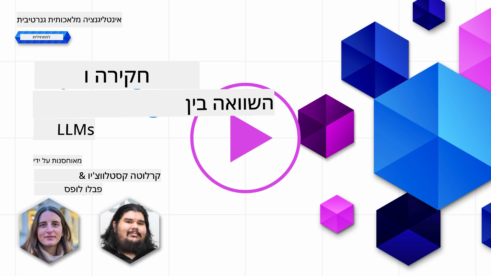](https://youtu.be/KIRUeDKscfI?si=8BHX1zvwzQBn-PlK)

> _לחץ על התמונה למעלה כדי לראות את וידאו השיעור_

בשיעור הקודם ראינו כיצד AI גנרטיבי משנה את נוף הטכנולוגיה, כיצד מודלים גדולים לשפה (LLMs) פועלים וכיצד עסק – כמו הסטארטאפ שלנו – יכול ליישם אותם למקרים שימושיים ולגדול! בפרק זה אנו מתמקדים בהשוואה והבדלים בין סוגים שונים של מודלים גדולים לשפה כדי להבין את היתרונות והחסרונות שלהם.

הצעד הבא במסע של הסטארטאפ שלנו הוא חקירת הנוף הנוכחי של מודלי LLM והבנת אילו מהם מתאימים למקרה השימוש שלנו.

## מבוא

שיעור זה יכסה:

- סוגים שונים של מודלי LLM בנוף הנוכחי.
- בדיקה, איטרציה והשוואה של מודלים שונים בשביל מקרה השימוש שלכם ב-Azure.
- כיצד לפרוס מודל LLM.

## יעדי הלמידה

לאחר סיום שיעור זה, תוכלו:

- לבחור את המודל הנכון למקרה השימוש שלכם.
- להבין כיצד לבדוק, לאטור ולשפר את ביצועי המודל.
- לדעת כיצד עסקים מפעילים מודלים.

## הבנת סוגים שונים של מודלי LLM

למודלי LLM יש קטגוריות שונות בהתבסס על הארכיטקטורה שלהם, נתוני האימון ומקרה השימוש. הבנת ההבדלים הללו תעזור לסטארטאפ שלנו לבחור את המודל הנכון לתרחיש ולהבין כיצד לבדוק, לאטור ולשפר ביצועים.

ישנם סוגים שונים רבים של מודלי LLM, הבחירה שלכם במודל תלויה במה שאתם מכוונים להשתמש בו, הנתונים שלכם, כמה אתם מוכנים לשלם ועוד.

בהתאם לשאלה אם אתם מתכוונים להשתמש במודלים לטקסט, קול, וידאו, יצירת תמונות וכן הלאה, ייתכן שתבחרו בסוג שונה של מודל.

- **זיהוי קול ודיבור**. מודלים בסגנון Whisper עדיין שימושיים כמודלי זיהוי דיבור לכל מטרה, אך כיום ישנן גם אפשרויות חדשות כגון מודלי דיבור לטקסט כמו `gpt-4o-transcribe`, `gpt-4o-mini-transcribe` וגרסאות דיוריזציה. יש להעריך את כיסוי השפה, דיוריזציה, תמיכה בזמן אמת, השהייה ועלות עבור התרחיש שלכם. למידע נוסף ראו את [תיעוד דיבור לטקסט של OpenAI](https://platform.openai.com/docs/guides/speech-to-text?WT.mc_id=academic-105485-koreyst).

- **יצירת תמונות**. DALL-E ו-Midjourney הן אפשרויות ידועות ליצירת תמונות, אך ממשקי API ליצירת תמונות של OpenAI מתמקדים כעת במודלי GPT Image כמו `gpt-image-2`, בעוד ש-Stable Diffusion, Imagen, Flux ומשפחות מודלים אחרות גם הן אפשרויות נפוצות. יש להשוות בין עמידה בהנחיות, תמיכה בעריכה, שליטה בסגנון, דרישות בטיחות ורישוי. למידע נוסף ראו את [מדריך יצירת תמונות של OpenAI](https://platform.openai.com/docs/guides/images?WT.mc_id=academic-105485-koreyst) ופרק 9 בתוכנית הלימודים.

- **יצירת טקסט**. מודלי הטקסט כוללים כיום מודלים מתקדמים, מודלי הסקה, מודלים קטנים עם השהייה נמוכה ומודלים עם משקל פתוח. דוגמאות נוכחיות הן מודלי OpenAI GPT-5.x, מודלי Anthropic Claude 4.x, מודלי Google Gemini 3.x, מודלי Meta Llama 4, ומודלי Mistral. אין לבחור רק לפי תאריך שחרור או מחיר; השוו איכות משימה, השהייה, חלון הקשר, שימוש בכלים, התנהגות בטיחותית, זמינות אזורית ועלות כוללת. [קטלוג מודלי Microsoft Foundry](https://ai.azure.com/catalog?WT.mc_id=academic-105485-koreyst) הוא מקום טוב להשוואת מודלים הזמינים ב-Azure.

- **רב-מודליות**. רבים מהמודלים הנוכחיים יכולים לעבד יותר מטקסט בלבד. חלקם מקבלים קלט של תמונה, קול או וידאו; אחרים יכולים לקרוא לכלים; ומודלים מיוחדים יכולים ליצור תמונות, קול או וידאו. לדוגמה, מודלי OpenAI הנוכחיים תומכים בקלט טקסט ותמונה, מודלי Gemini יכולים לתמוך בקלט של טקסט, קוד, תמונה, קול ווידאו תלוי בגרסה, ומודלי Llama 4 Scout ו-Maverick הם מודלים רב-מודליים עם משקל פתוח במקור. תמיד בדקו בכרטיס המודל את סוגי הקלט והפלט הנתמכים לפני בניית זרימת עבודה סביבו.

בחירת מודל משמעותה שתקבלו יכולות בסיסיות, שלעיתים לא יספיקו. לרוב יש לכם נתונים ספציפיים לחברה שאתם צריכים להודיע עליהם ל-LLM. ישנן כמה אפשרויות שונות כיצד לגשת לכך, נרחיב על כך בחלקים הבאים.

### מודלי יסוד לעומת מודלי LLM

המונח מודל יסוד (Foundation Model) [נוצר על ידי חוקרי סטנפורד](https://arxiv.org/abs/2108.07258?WT.mc_id=academic-105485-koreyst) והוגדר כמודל AI שעומד בכמה קריטריונים, כגון:

- **הם מאומנים בלמידה ללא השגחה או בלמידה עצמית**, כלומר הם מאומנים על נתונים רב-מודליים ללא תיוג, ואינם דורשים אנוטציה או תיוג אנושי בתהליך האימון.
- **הם מודלים גדולים מאוד**, מבוססי רשתות עצביות עמוקות המאמנות מאות מיליארדי פרמטרים.
- **הם מיועדים בדרך כלל לשמש כ’יסוד’ למודלים אחרים**, כלומר הם משמשים כנקודת התחלה לבניית מודלים נוספים, הנעשה בדרך כלל דרך כיוונון עדין.

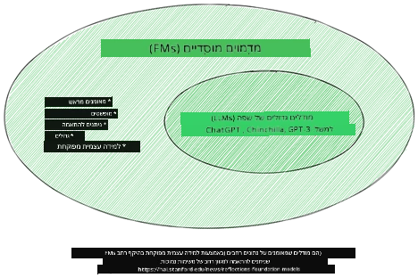

מקור התמונה: [מדריך חיוני למודלי יסוד ומודלים גדולים לשפה | מאת Babar M Bhatti | Medium
](https://thebabar.medium.com/essential-guide-to-foundation-models-and-large-language-models-27dab58f7404)

כדי להבהיר את ההבחנה הזו, ניקח את ChatGPT כדוגמה היסטורית. גרסאות מוקדמות של ChatGPT השתמשו ב-GPT-3.5 כמודל יסוד. OpenAI השתמשה אז בנתוני שיחה וטכניקות יישור ליצירת גרסה מכוונת שהציגה ביצועים טובים יותר בתרחישי שיחה, כמו צ׳אטבוטים. שירותי AI מודרניים פעמים רבות מנתבים בין מספר גרסאות מודל, ולכן שם השירות ושם המודל הבסיסי אינם תמיד זהים.

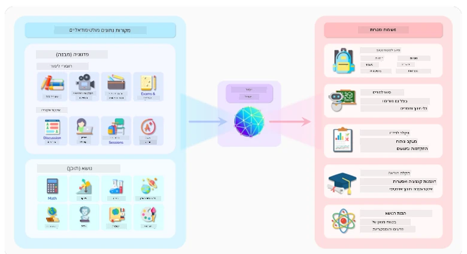

מקור התמונה: [2108.07258.pdf (arxiv.org)](https://arxiv.org/pdf/2108.07258.pdf?WT.mc_id=academic-105485-koreyst)

### מודלים עם משקל פתוח/קוד פתוח לעומת מודלים קנייניים

דרך נוספת לקטלג מודלי LLM היא האם הם משקל פתוח, קוד פתוח או קנייניים.

מודלים בקוד פתוח ומשקל פתוח מאפשרים גישה לחומרה של המודל לביקורת, הורדה או התאמה אישית, אך הרישיונות שלהם שונים. חלקם קוד פתוח מלא, בעוד אחרים הם מודלים עם משקל פתוח עם הגבלות שימוש. הם יכולים להיות שימושיים כאשר עסק צריך שליטה רבה יותר בפריסה, מיקום הנתונים, עלות או התאמה אישית. עם זאת, צוותים צריכים עדיין לבחון תנאי רישיון, עלויות שירות, תחזוקה, עדכוני אבטחה ואיכות הערכה לפני השימוש במודלים אלו בפרודקשן. דוגמאות כוללות [Meta Llama 4](https://ai.meta.com/blog/llama-4-multimodal-intelligence/?WT.mc_id=academic-105485-koreyst), כמה [מודלי Mistral](https://docs.mistral.ai/models/overview?WT.mc_id=academic-105485-koreyst) ורבים מהמופעים ב-[Hugging Face](https://huggingface.co/models?WT.mc_id=academic-105485-koreyst).

מודלים קנייניים הם בבעלות ומאוחסנים אצל ספק. מודלים אלו לעיתים מותאמים לשימוש מנוהל בפרודקשן ויכולים להציע תמיכה חזקה, מערכות בטיחות, אינטגרציה עם כלים ויכולת סקייל. עם זאת, הלקוחות לרוב אינם יכולים לבדוק או לשנות את משקלי המודל, והם צריכים לעיין בתנאי הספק בנוגע לפרטיות, שמירה, תאימות ושימוש מקובל. דוגמאות כוללות [מודלי OpenAI](https://platform.openai.com/docs/models?WT.mc_id=academic-105485-koreyst), [Google Gemini](https://deepmind.google/models/gemini/pro/?WT.mc_id=academic-105485-koreyst), ו-[Anthropic Claude](https://platform.claude.com/docs/en/about-claude/models/overview?WT.mc_id=academic-105485-koreyst).

### הטמעה לעומת יצירת תמונה לעומת יצירת טקסט וקוד

ניתן גם לקטלג מודלי LLM לפי הפלט שהם מייצרים.

הטמעה היא קבוצת מודלים שיכולים להמיר טקסט לצורה נומרית הנקראת הטמעה, שהיא ייצוג מספרי של הטקסט הנכנס. הטמעות מקלות על מחשבים להבין את הקשרים בין מילים או משפטים וניתן להשתמש בהן כקלט למודלים אחרים, כמו מודלי סיווג או מודלי אשכול שיש להם ביצועים טובים יותר על נתונים מספריים. מודלי הטמעה משמשים לרוב ללמידת העברה, שבה נבנה מודל למשימה תחליפית שיש לה שפע נתונים, ואז משתמשים במשקלי המודל (ההטמעות) למשימות אחרות בהמשך. דוגמה לקטגוריה זו היא [OpenAI embeddings](https://platform.openai.com/docs/models/embeddings?WT.mc_id=academic-105485-koreyst).

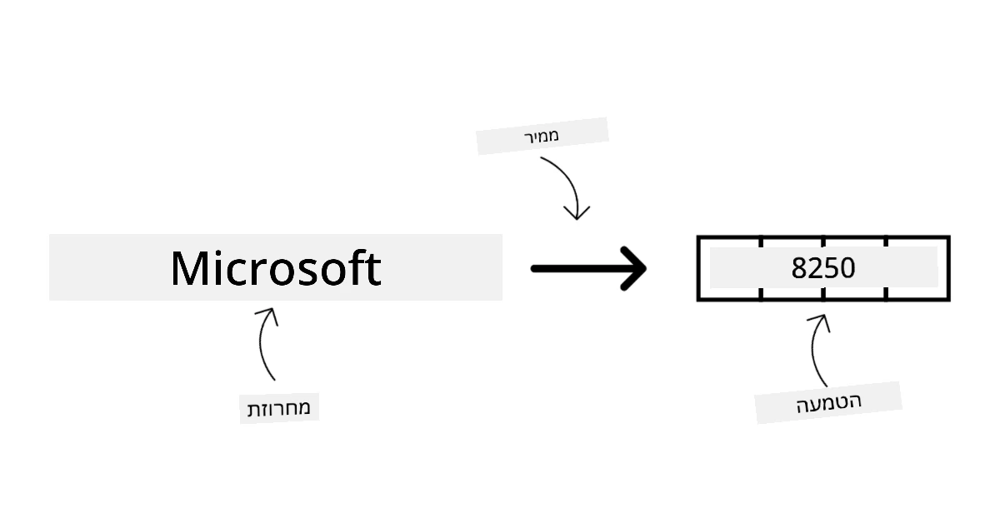

מודלי יצירת תמונות הם מודלים שמייצרים תמונות. מודלים אלו משמשים לעיתים קרובות לעריכת תמונות, סינתוז תמונות ותרגום תמונות. מודלי יצירת תמונות מיומנים בדרך כלל על מערכי נתונים גדולים של תמונות, כמו [LAION-5B](https://laion.ai/blog/laion-5b/?WT.mc_id=academic-105485-koreyst), וניתן להשתמש בהם ליצירת תמונות חדשות או לעריכת תמונות קיימות באמצעות טכניקות כמו inpainting, super-resolution וצביעה. דוגמאות כוללות [מודלי GPT Image](https://platform.openai.com/docs/guides/images?WT.mc_id=academic-105485-koreyst), [מודלי Stable Diffusion](https://github.com/Stability-AI/StableDiffusion?WT.mc_id=academic-105485-koreyst) ו-Imagen.

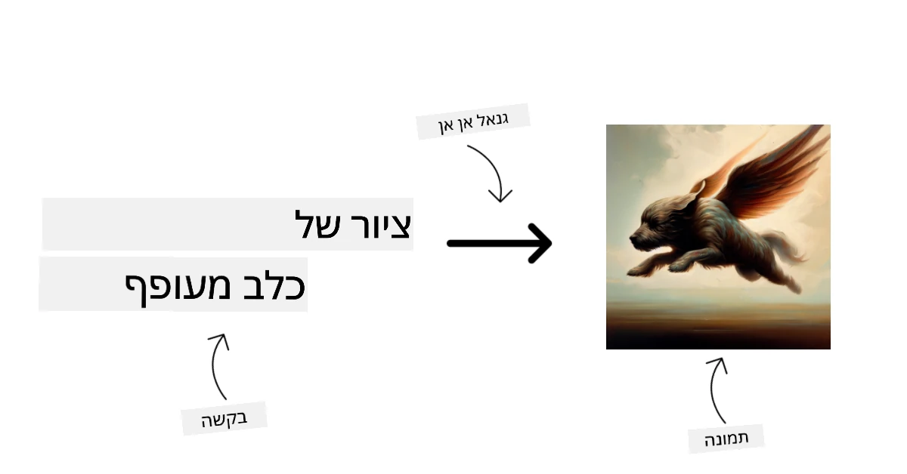

מודלי יצירת טקסט וקוד הם מודלים שמייצרים טקסט או קוד. מודלים אלו משמשים לעיתים קרובות לסיכום טקסט, תרגום ומענה על שאלות. מודלי יצירת טקסט מאומנים בדרך כלל על מערכי נתונים גדולים של טקסט, כמו [BookCorpus](https://www.cv-foundation.org/openaccess/content_iccv_2015/html/Zhu_Aligning_Books_and_ICCV_2015_paper.html?WT.mc_id=academic-105485-koreyst), וניתן להשתמש בהם ליצירת טקסט חדש או למענה על שאלות. מודלי יצירת קוד, כמו [CodeParrot](https://huggingface.co/codeparrot?WT.mc_id=academic-105485-koreyst), מאומנים בדרך כלל על מערכי נתונים גדולים של קוד, כמו GitHub, וניתן להשתמש בהם ליצירת קוד חדש או לתיקון שגיאות בקוד קיים.

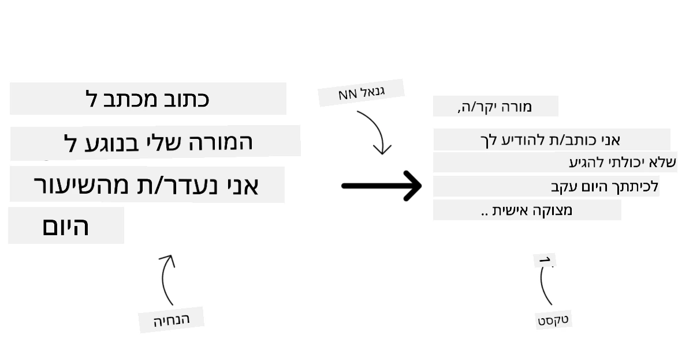

### מקודד-מפענח לעומת מפענח בלבד

כדי לדבר על סוגים שונים של ארכיטקטורת מודלי LLM, נשתמש באנלוגיה.

דמיינו שמנהלכם נתן לכם משימה לכתוב חידון לסטודנטים. יש לכם שני קולגות; אחד אחראי על יצירת התוכן והשני אחראי על בדיקתו.

היוצר התוכן הוא כמו מודל מפענח בלבד: הוא יכול להסתכל על הנושא, לראות מה כבר כתבת, ואז להמשיך ליצור תוכן בהתאם להקשר. הם טובים מאוד בכתיבת תוכן מעניין ומלמד, אך לא תמיד הבחירה הטובה ביותר כאשר המשימה היא אך ורק לסווג, לאחזר או לקודד מידע. דוגמאות למשפחות מודלים מסוג מפענח בלבד כוללות את מודלי GPT ו-Llama.

הבודק הוא כמו מודל מקודד בלבד, הוא מסתכל על הטקסט שנכתב והתשובות, מבחין בקשר ביניהם ומבין הקשר, אך אינו טוב ביצירת תוכן. דוגמה למודל מקודד בלבד תהיה BERT.

דמיינו שאפשר גם מישהו שיוכל ליצור ולבדוק את החידון, זהו מודל מקודד-מפענח. דוגמאות לכך הן BART ו-T5.

### שירות לעומת מודל

כעת, נדבר על ההבדל בין שירות ומודל. שירות הוא מוצר שמוצע על ידי ספק שירותי ענן, ולעיתים מורכב משילוב של מודלים, נתונים ורכיבים נוספים. מודל הוא הרכיב המרכזי של שירות, ולעיתים קרובות זהו מודל יסוד, כמו LLM.

שירותים לרוב מותאמים לשימוש בפרודקשן וקלים יותר לשימוש מאשר מודלים, באמצעות ממשק משתמש גרפי. עם זאת, שירותים אינם תמיד זמינים בחינם, וייתכן שידרשו מנוי או תשלום לשימוש, בתמורה לשימוש בציוד ומשאבים של בעל השירות, אופטימיזציה של הוצאות ויכולת סקייל. דוגמה לשירות היא [שירות Azure OpenAI](https://learn.microsoft.com/azure/ai-foundry/openai/overview?WT.mc_id=academic-105485-koreyst), שמציע תכנית תשלום לפי שימוש, כלומר המשתמשים מחויבים בהתאם לכמות השימוש. שירות Azure OpenAI מציע גם אבטחה ברמת ארגון ומסגרת AI אחראית מעל ליכולות המודלים.

מודלים הם החפצים של רשתות עצביות: פרמטרים, משקלים, ארכיטקטורה, טוקניזר וקונפיגורציה תומכת. הפעלת מודל מקומית או בסביבה פרטית דורשת חומרה מתאימה, תשתיות שרת, מעקב ורישיון קוד פתוח/משקל פתוח תואם או רישיון מסחרי. מודלים עם משקל פתוח כמו Llama 4 או מודלי Mistral יכולים להיות מאוחסנים בעצמכם, אך הם עדיין דורשים כוח חישובי ומומחיות תפעולית.

## כיצד לבדוק ולאטור עם מודלים שונים להבנת הביצועים ב-Azure

ברגע שהצוות שלנו חקר את נוף ה-LLMs הנוכחי וזיהה כמה מועמדים טובים לתרחישים שלהם, השלב הבא הוא לבדוק אותם על הנתונים שלהם ועל עומס העבודה שלהם. זהו תהליך איטרטיבי, שנעשה באמצעות ניסויים ומדידות.
רוב המודלים שהזכרנו בפסקאות הקודמות (מודלים של OpenAI, מודלים עם משקל פתוח כמו Llama 4 ו-Mistral, ומודלים מ-Hugging Face) זמינים ב-[Microsoft Foundry Models](https://learn.microsoft.com/azure/foundry/concepts/foundry-models-overview?WT.mc_id=academic-105485-koreyst).

[Microsoft Foundry](https://learn.microsoft.com/azure/foundry/what-is-foundry?WT.mc_id=academic-105485-koreyst), שבעבר נקרא Azure AI Studio/Azure AI Foundry, היא פלטפורמת Azure מאוחדת לבניית אפליקציות וסוכני בינה מלאכותית. היא עוזרת למפתחים לנהל את מחזור החיים מהניסוי וההערכה ועד לפריסה, ניטור וממשל. קטלוג המודלים ב-Microsoft Foundry מאפשר למשתמש:

- למצוא את מודל הבסיס הרצוי בקטלוג, כולל מודלים שנמכרים על ידי Azure ומודלים של שותפים ונותני קהילה. המשתמשים יכולים לסנן לפי משימה, ספק, רישיון, אפשרות פריסה או שם.

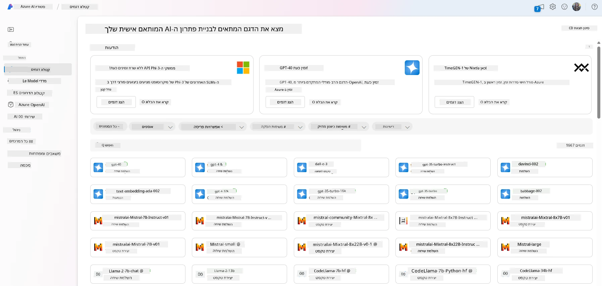

- לעיין בכרטיס המודל, כולל תיאור מפורט של השימוש המיועד ונתוני האימון, דוגמאות קוד ותוצאות הערכה בספריית ההערכות הפנימית.

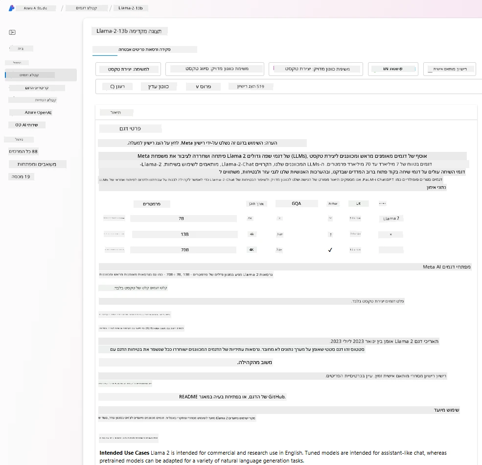

- להשוות בין מדדי ביצועים של מודלים ומערכי נתונים זמינים בתעשייה על מנת להעריך איזה מהם מתאים לתרחיש העסקי, דרך לוח ה-[Model Benchmarks](https://learn.microsoft.com/azure/ai-foundry/concepts/model-benchmarks?WT.mc_id=academic-105485-koreyst).

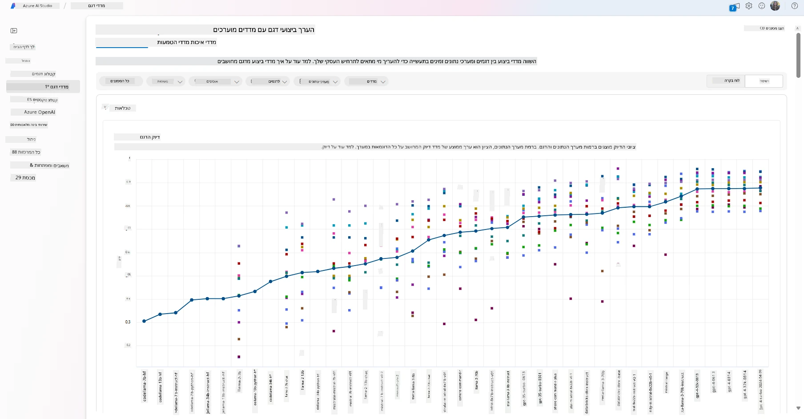

- לכוונן מודלים נתמכים על נתוני אימון מותאמים לשפר את ביצועי המודל בעומס עבודה ספציפי, תוך שימוש ביכולות הניסוי והמעקב של Microsoft Foundry.

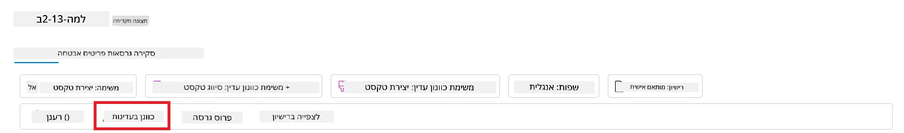

- לפרוס את המודל המאומן מראש המקורי או את הגרסה בכיוונון עדין לנקודת סיכום real-time מרוחקת, באמצעות חישוב מנוהל או אפשרויות פריסה ללא שרת, כדי לאפשר לאפליקציות לצרוך אותו.

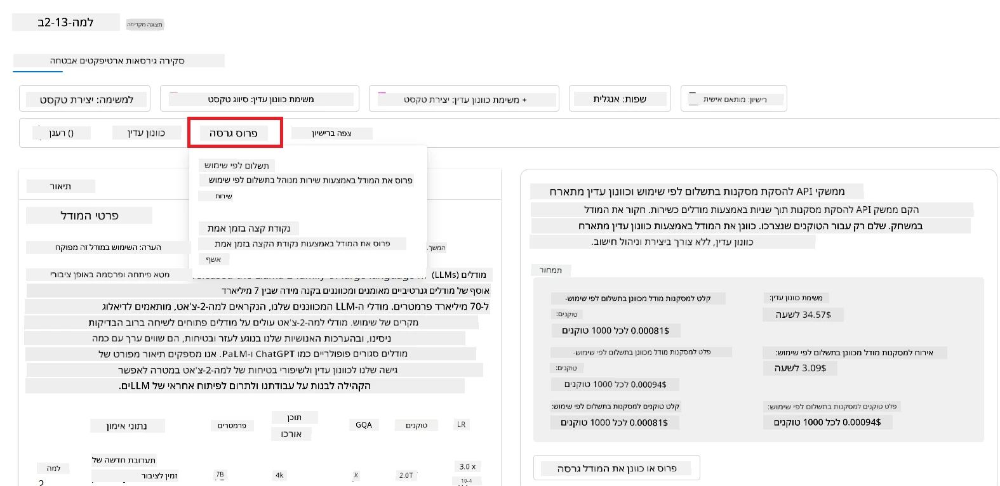

> [!NOTE]
> לא כל המודלים בקטלוג זמינים כעת לכיונון עדין ו/או לפריסת pay-as-you-go. בדקו את כרטיס המודל לפרטים על יכולות ומגבלות המודל.

## שיפור תוצאות LLM

חקרנו עם צוות הסטארטאפ שלנו סוגים שונים של LLMs ופלטפורמת ענן (Microsoft Foundry) שמאפשרת לנו להשוות בין מודלים שונים, להעריך אותם על נתוני בדיקה, לשפר ביצועים ולפרוס אותם בנקודות סיכום.

אבל מתי כדאי לשקול לכוון דגם במקום להשתמש בדגם מאומן מראש? האם יש גישות נוספות לשפר את ביצועי המודל בעומסי עבודה ספציפיים?

יש כמה גישות שעסק יכול להשתמש בהן כדי לקבל את התוצאות שהם צריכים מ-LLM. ניתן לבחור סוגים שונים של מודלים עם דרגות אימון שונות בפריסת LLM בייצור, עם רמות מורכבות, עלות ואיכות שונות. הנה כמה גישות שונות:

- **הנדסת פרומפט עם הקשר**. הרעיון הוא לספק הקשר מספיק כאשר נותנים פרומפט כדי להבטיח שתקבל את התגובות שאתה צריך.

- **Retrieval Augmented Generation, RAG**. הנתונים שלך עשויים להתקיים במסד נתונים או בנקודת קצה אינטרנטית, למשל, כדי להבטיח שחלק מהנתונים הרלוונטיים כלולים בזמן הפרומפט, ניתן להוציא את הנתונים הרלוונטיים ולהפוך אותם לחלק מהפרומפט של המשתמש.

- **מודל עם כיוונון עדין**. כאן, אימנת את המודל עוד על הנתונים שלך מה שהוביל לכך שהמודל מדויק יותר ומגיב יותר לצרכים שלך אך עלול להיות יקר.

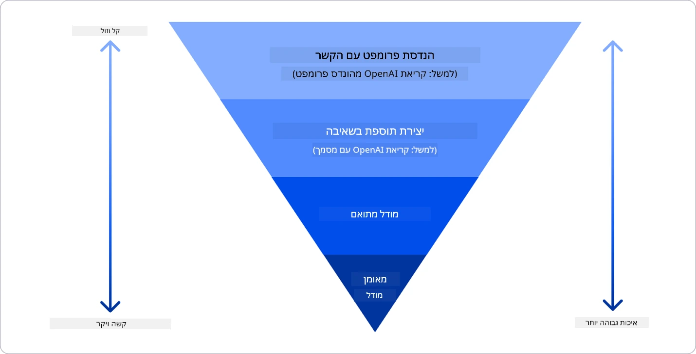

מקור התמונה: [Four Ways that Enterprises Deploy LLMs | Fiddler AI Blog](https://www.fiddler.ai/blog/four-ways-that-enterprises-deploy-llms?WT.mc_id=academic-105485-koreyst)

### הנדסת פרומפט עם הקשר

LLMs מאומנים מראש עובדים טוב מאוד במשימות שפת טבעית כלליות, אפילו בקריאה עם פרומפט קצר, כמו משפט להשלמה או שאלה – למידה מסוג "zero-shot".

אולם, ככל שהמשתמש יכול למסגר את השאילתה שלו, עם בקשה מפורטת ודוגמאות – ההקשר – התשובה תהיה מדויקת יותר וקרובה יותר לציפיות המשתמש. במקרה זה, מדברים על למידה מסוג "one-shot" אם הפרומפט כולל דוגמה אחת בלבד ו"למידת few-shot" אם הוא כולל דוגמאות רבות.
הנדסת פרומפט עם הקשר היא הגישה החסכונית ביותר להתחלה.

### Retrieval Augmented Generation (RAG)

ל-LLMs יש מגבלה שהם יכולים להשתמש רק בנתונים ששימשו בעת האימון שלהם כדי לייצר תשובה. משמעות הדבר היא שהם לא יודעים כלום על עובדות שקרו אחרי תהליך האימון, ואינם יכולים לגשת למידע שאינו פומבי (כמו נתוני חברה).
ניתן להתגבר על כך באמצעות RAG, טכניקה שמוסיפה פרומפט עם נתונים חיצוניים בצורת חתיכות של מסמכים, תוך התחשבות במגבלות אורך הפרומפט. זה נתמך על ידי כלים של מסדי נתונים וקטוריים (כמו [Azure Vector Search](https://learn.microsoft.com/azure/search/vector-search-overview?WT.mc_id=academic-105485-koreyst)) שמחזירים את החתיכות השימושיות ממקורות נתונים מוגדרים מראש ומוסיפים אותן להקשר הפרומפט.

טכניקה זו מאוד מועילה כאשר לעסק אין מספיק נתונים, זמן או משאבים לכוונון עדין של LLM, אך הוא עדיין רוצה לשפר ביצועים בעומס עבודה ספציפי ולהפחית סיכונים לתשובות מבלבלות, מיושנות או בלתי מוגנות.

### מודל עם כיוונון עדין

כיוונון עדין הוא תהליך שמשתמש בלמידת העברה כדי 'להתאים' את המודל למשימה ספציפית או לפתור בעיה מסוימת. בניגוד ללמידת few-shot ו-RAG, הוא מוביל ליצירת מודל חדש, עם משקלים והטיות מעודכנות. זה דורש מערך של דוגמאות אימון שמכילות קלט יחיד (הפרומפט) והפלט המשויכת אליו (ההשלמה).
זוהי הגישה המועדפת אם:

- **שימוש במודלים קטנים יותר למשימות ספציפיות**. עסק יעדיף לכוונן מודל קטן יותר למשימה צרה במקום לקרוא שוב ושוב לפרומפט למודל גבול גדול, מה שמביא לפתרון חסכוני ומהיר יותר.

- **התחשבות באיחור (Latency)**. זמן איחור חשוב במקרה שימוש ספציפי, ולכן לא ניתן להשתמש בפרומפטים ארוכים מאוד או בכמות דוגמאות שהמודל צריך ללמוד שאינם מתאימים למגבלות אורך הפרומפט.

- **התאמת התנהגות יציבה**. לעסק יש הרבה דוגמאות איכותיות והוא רוצה שהמודל יעקוב בקביעות אחר דפוס משימה, פורמט פלט, טון, או סגנון תחום-ספציפי. אם הבעיה המרכזית היא עובדות טריות או ידע פרטי שמשתנה לעתים קרובות, כדאי להשתמש ב-RAG במקום להסתמך רק על כיוונון עדין.

### מודל מאומן

לאמן LLM מאפס הוא ללא ספק הגישה הקשה והמורכבת ביותר לאימוץ, והיא דורשת כמויות עצומות של נתונים, משאבים מיומנים וכוח חישובי מתאים. אפשרות זו יש לשקול רק במקרה שבו לעסק יש שימוש תחום-ספציפי וכמות גדולה של נתוני תחום רלוונטיים.

## בדיקת ידע

מה יכולה להיות גישה טובה לשיפור תוצאות השלמת LLM?

1. הנדסת פרומפט עם הקשר
1. RAG
1. מודל עם כיוונון עדין

תשובה: שלושתם יכולים לעזור. התחל עם הנדסת פרומפט והקשר לשיפורים מהירים, והשתמש ב-RAG כשהמודל זקוק לעובדות עדכניות או לנתונים פרטיים של העסק. בחר בכיוונון עדין כאשר יש לך מספיק דוגמאות איכותיות ואתה רוצה שהמודל יתמיד לעקוב אחר משימה, פורמט, טון או דפוס תחום.

## 🚀 אתגר

קרא עוד על איך אתה יכול [להשתמש ב-RAG](https://learn.microsoft.com/azure/search/retrieval-augmented-generation-overview?WT.mc_id=academic-105485-koreyst) עבור העסק שלך.

## עבודה מעולה, המשך ללמוד

אחרי שסיימת את השיעור הזה, בדוק את [אוסף הלמידה על Generative AI](https://aka.ms/genai-collection?WT.mc_id=academic-105485-koreyst) שלנו כדי להמשיך לשפר את הידע שלך על בינה מלאכותית יוצרת!

עבור לשיעור 3 שבו נבחן כיצד [לבנות עם בינה מלאכותית יוצרת באחריות](../03-using-generative-ai-responsibly/README.md?WT.mc_id=academic-105485-koreyst)!

---

<!-- CO-OP TRANSLATOR DISCLAIMER START -->
**כתב ויתור**:
מסמך זה תורגם באמצעות שירות תרגום אוטומטי [Co-op Translator](https://github.com/Azure/co-op-translator). למרות שאנו שואפים לדיוק, יש לקחת בחשבון שתרגומים אוטומטיים עלולים להכיל שגיאות או אי-דיוקים. יש להחשיב את המסמך המקורי בשפתו הטבעית כמקור הסמכות. למידע קריטי מומלץ להשתמש בתרגום מקצועי על ידי מתרגם אדם. אנו לא אחראים לכל אי-הבנה או פירוש שגוי הנובע מהשימוש בתרגום זה.
<!-- CO-OP TRANSLATOR DISCLAIMER END -->