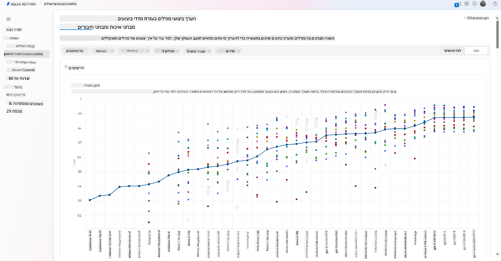
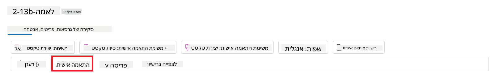
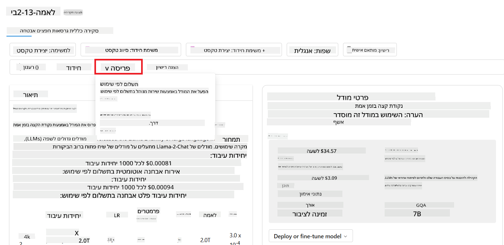
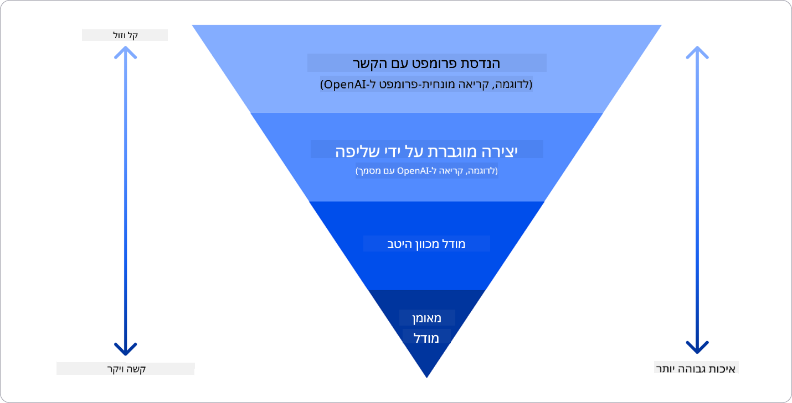

<!--
CO_OP_TRANSLATOR_METADATA:
{
  "original_hash": "e2f686f2eb794941761252ac5e8e090b",
  "translation_date": "2025-06-25T10:49:26+00:00",
  "source_file": "02-exploring-and-comparing-different-llms/README.md",
  "language_code": "he"
}
-->
# חקירה והשוואה בין דגמים שונים של LLM

> _לחץ על התמונה למעלה כדי לצפות בסרטון של השיעור הזה_

בשיעור הקודם, ראינו כיצד הבינה המלאכותית הגנרטיבית משנה את נוף הטכנולוגיה, כיצד דגמים של שפה גדולה (LLMs) עובדים וכיצד עסק - כמו הסטארטאפ שלנו - יכול ליישם אותם לשימושים שלו ולגדול! בפרק הזה, אנחנו מתכוונים להשוות ולהבדיל בין סוגים שונים של דגמים של שפה גדולה (LLMs) כדי להבין את היתרונות והחסרונות שלהם.

הצעד הבא במסע הסטארטאפ שלנו הוא לחקור את הנוף הנוכחי של LLMs ולהבין אילו מהם מתאימים לשימוש שלנו.

## הקדמה

השיעור הזה יכסה:

- סוגים שונים של LLMs בנוף הנוכחי.
- בדיקה, חזרה והשוואה בין דגמים שונים לשימוש שלך ב-Azure.
- כיצד לפרוס LLM.

## מטרות למידה

לאחר סיום השיעור הזה, תוכל:

- לבחור את הדגם המתאים לשימוש שלך.
- להבין כיצד לבדוק, לחזור ולשפר את ביצועי הדגם שלך.
- לדעת כיצד עסקים מפרסים דגמים.

## הבנת סוגים שונים של LLMs

LLMs יכולים להיות מסווגים בדרכים שונות בהתאם לארכיטקטורה שלהם, נתוני האימון והשימוש שלהם. הבנת ההבדלים האלה תעזור לסטארטאפ שלנו לבחור את הדגם הנכון לסיטואציה, ולהבין כיצד לבדוק, לחזור ולשפר ביצועים.

ישנם סוגים רבים של דגמי LLM, הבחירה שלך בדגם תלויה במה שאתה מתכוון להשתמש בו, הנתונים שלך, כמה אתה מוכן לשלם ועוד.

בהתאם לשימוש שאתה מתכוון לעשות בדגמים ליצירת טקסט, אודיו, וידאו, תמונה וכדומה, ייתכן שתרצה לבחור דגם מסוג אחר.

- **זיהוי אודיו ודיבור**. למטרה זו, דגמי מסוג Whisper הם בחירה מצוינת מכיוון שהם רב-תכליתיים ומיועדים לזיהוי דיבור. הם מאומנים על אודיו מגוון ויכולים לבצע זיהוי דיבור רב-לשוני. למד עוד על [דגמי Whisper כאן](https://platform.openai.com/docs/models/whisper?WT.mc_id=academic-105485-koreyst).

- **יצירת תמונות**. ליצירת תמונות, DALL-E ו-Midjourney הם שתי בחירות ידועות מאוד. DALL-E מוצע על ידי Azure OpenAI. [קרא עוד על DALL-E כאן](https://platform.openai.com/docs/models/dall-e?WT.mc_id=academic-105485-koreyst) וגם בפרק 9 של תוכנית הלימודים הזו.

- **יצירת טקסט**. רוב הדגמים מאומנים על יצירת טקסט ויש לך מגוון רחב של אפשרויות מ-GPT-3.5 ועד GPT-4. הם מגיעים בעלויות שונות כאשר GPT-4 הוא היקר ביותר. כדאי לבדוק את [Azure OpenAI playground](https://oai.azure.com/portal/playground?WT.mc_id=academic-105485-koreyst) כדי להעריך אילו דגמים מתאימים ביותר לצרכים שלך מבחינת יכולת ועלות.

- **רב-מודאליות**. אם אתה מחפש להתמודד עם סוגים מרובים של נתונים בקלט ובפלט, ייתכן שתרצה לבדוק דגמים כמו [gpt-4 turbo עם חזון או gpt-4o](https://learn.microsoft.com/azure/ai-services/openai/concepts/models#gpt-4-and-gpt-4-turbo-models?WT.mc_id=academic-105485-koreyst) - השחרורים האחרונים של דגמי OpenAI - שמסוגלים לשלב עיבוד שפה טבעית עם הבנה חזותית, מאפשרים אינטראקציות דרך ממשקים רב-מודאליים.

בחירת דגם פירושה שאתה מקבל כמה יכולות בסיסיות, שלעתים לא מספיקות. לעתים קרובות יש לך נתונים ספציפיים לחברה שצריך להעביר בצורה כלשהי ל-LLM. יש כמה אפשרויות שונות כיצד לגשת לכך, עוד על כך בקטעים הבאים.

### דגמי בסיס לעומת LLMs

המונח דגם בסיס הוטבע על ידי [חוקרי סטנפורד](https://arxiv.org/abs/2108.07258?WT.mc_id=academic-105485-koreyst) ומוגדר כדגם AI שעוקב אחרי כמה קריטריונים, כגון:

- **הם מאומנים באמצעות למידה לא מפוקחת או למידה עצמית**, כלומר הם מאומנים על נתונים רב-מודאליים לא מתויגים, והם לא דורשים הערות אנושיות או תיוג נתונים לתהליך האימון שלהם.
- **הם דגמים גדולים מאוד**, מבוססים על רשתות נוירונים עמוקות מאוד מאומנות על מיליארדי פרמטרים.
- **הם בדרך כלל מיועדים לשמש כ'בסיס' לדגמים אחרים**, כלומר ניתן להשתמש בהם כנקודת התחלה לדגמים אחרים שיבנו על גביהם, מה שניתן לעשות על ידי כיוונון עדין.

כדי להבהיר עוד יותר את ההבחנה הזו, ניקח את ChatGPT כדוגמה. כדי לבנות את הגרסה הראשונה של ChatGPT, דגם בשם GPT-3.5 שימש כמודל בסיס. זה אומר ש-OpenAI השתמשו בנתונים ספציפיים לצ'אט כדי ליצור גרסה מכווננת של GPT-3.5 שהייתה מתמחה בביצועים טובים בסצנות שיחה, כמו צ'אטבוטים.

### דגמים פתוחים לעומת דגמים קנייניים

דרך נוספת לסווג LLMs היא האם הם פתוחים או קנייניים.

דגמים פתוחים הם דגמים שמוצעים לציבור וניתן להשתמש בהם על ידי כל אחד. הם לעתים קרובות מוצעים על ידי החברה שיצרה אותם או על ידי הקהילה המחקרית. דגמים אלו יכולים להיות נבדקים, מותאמים ומותאמים לשימושים השונים ב-LLMs. עם זאת, הם לא תמיד מותאמים לשימוש בייצור, וייתכן שהם לא יהיו יעילים כמו דגמים קנייניים. בנוסף, המימון לדגמים פתוחים יכול להיות מוגבל, והם לא תמיד מתוחזקים לטווח ארוך או לא מעודכנים עם המחקר האחרון. דוגמאות לדגמים פתוחים פופולריים כוללות [Alpaca](https://crfm.stanford.edu/2023/03/13/alpaca.html?WT.mc_id=academic-105485-koreyst), [Bloom](https://huggingface.co/bigscience/bloom) ו-[LLaMA](https://llama.meta.com).

דגמים קנייניים הם דגמים שנמצאים בבעלות חברה ולא מוצעים לציבור. דגמים אלו לעתים קרובות מותאמים לשימוש בייצור. עם זאת, הם לא מורשים להיות נבדקים, מותאמים או מותאמים לשימושים שונים. בנוסף, הם לא תמיד זמינים בחינם, וייתכן שידרשו מנוי או תשלום לשימוש. כמו כן, המשתמשים לא שולטים על הנתונים שמשמשים לאימון הדגם, מה שאומר שהם צריכים לסמוך על בעל הדגם שיבטיח מחויבות לפרטיות נתונים ושימוש אחראי ב-AI. דוגמאות לדגמים קנייניים פופולריים כוללות [דגמי OpenAI](https://platform.openai.com/docs/models/overview?WT.mc_id=academic-105485-koreyst), [Google Bard](https://sapling.ai/llm/bard?WT.mc_id=academic-105485-koreyst) או [Claude 2](https://www.anthropic.com/index/claude-2?WT.mc_id=academic-105485-koreyst).

### הטמעה לעומת יצירת תמונות לעומת יצירת טקסט וקוד

LLMs יכולים גם להיות מסווגים לפי הפלט שהם מייצרים.

הטמעות הן קבוצת דגמים שיכולים להמיר טקסט לצורה מספרית, הנקראת הטמעה, שהיא ייצוג מספרי של הטקסט הקלט. הטמעות מקלות על מכונות להבין את היחסים בין מילים או משפטים וניתן לצרוך אותן כקלטים על ידי דגמים אחרים, כמו דגמי סיווג או דגמי אשכולות שיש להם ביצועים טובים יותר על נתונים מספריים. דגמי הטמעה משמשים לעתים קרובות ללמידה מעבירה, שבה נבנה דגם למשימה חלופית שיש לה שפע של נתונים, ואז משקל הדגם (הטמעות) משמשים מחדש למשימות אחרות במורד הזרם. דוגמה לקטגוריה זו היא [הטמעות OpenAI](https://platform.openai.com/docs/models/embeddings?WT.mc_id=academic-105485-koreyst).

דגמי יצירת תמונות הם דגמים שמייצרים תמונות. דגמים אלו משמשים לעתים קרובות לעריכת תמונות, סינתזת תמונות ותרגום תמונות. דגמי יצירת תמונות מאומנים לעתים קרובות על מערכי נתונים גדולים של תמונות, כמו [LAION-5B](https://laion.ai/blog/laion-5b/?WT.mc_id=academic-105485-koreyst), וניתן להשתמש בהם כדי לייצר תמונות חדשות או לערוך תמונות קיימות בטכניקות של צביעה מחדש, סופר-רזולוציה וטכניקות צביעה. דוגמאות כוללות [DALL-E-3](https://openai.com/dall-e-3?WT.mc_id=academic-105485-koreyst) ו-[Stable Diffusion models](https://github.com/Stability-AI/StableDiffusion?WT.mc_id=academic-105485-koreyst).

דגמי יצירת טקסט וקוד הם דגמים שמייצרים טקסט או קוד. דגמים אלו משמשים לעתים קרובות לסיכום טקסט, תרגום ועניית שאלות. דגמי יצירת טקסט מאומנים לעתים קרובות על מערכי נתונים גדולים של טקסט, כמו [BookCorpus](https://www.cv-foundation.org/openaccess/content_iccv_2015/html/Zhu_Aligning_Books_and_ICCV_2015_paper.html?WT.mc_id=academic-105485-koreyst), וניתן להשתמש בהם כדי לייצר טקסט חדש או לענות על שאלות. דגמי יצירת קוד, כמו [CodeParrot](https://huggingface.co/codeparrot?WT.mc_id=academic-105485-koreyst), מאומנים לעתים קרובות על מערכי נתונים גדולים של קוד, כמו GitHub, וניתן להשתמש בהם כדי לייצר קוד חדש או לתקן באגים בקוד קיים.

### מקודד-מפענח לעומת מפענח בלבד

כדי לדבר על סוגי הארכיטקטורות השונים של LLMs, נשתמש באנלוגיה.

דמיין שהמנהל שלך נתן לך משימה לכתוב מבחן לתלמידים. יש לך שני עמיתים; אחד אחראי על יצירת התוכן והשני אחראי על הביקורת.

יוצר התוכן הוא כמו דגם מפענח בלבד, הם יכולים להסתכל על הנושא ולראות מה כבר כתבת ואז הם יכולים לכתוב קורס על סמך זה. הם מאוד טובים בכתיבת תוכן מרתק ומידע, אבל הם לא מאוד טובים בהבנת הנושא והמטרות הלמידה. כמה דוגמאות לדגמי מפענח הם דגמי משפחת GPT, כמו GPT-3.

הבקר הוא כמו דגם מקודד בלבד, הם מסתכלים על הקורס שנכתב והתשובות, מבחינים בקשר ביניהם ומבינים את ההקשר, אבל הם לא טובים ביצירת תוכן. דוגמה לדגם מקודד בלבד תהיה BERT.

דמיין שיש לנו גם מישהו שיכול ליצור ולבקר את המבחן, זהו דגם מקודד-מפענח. כמה דוגמאות יהיו BART ו-T5.

### שירות לעומת דגם

עכשיו, נדבר על ההבדל בין שירות לדגם. שירות הוא מוצר שמוצע על ידי ספק שירותי ענן, ולעתים קרובות הוא שילוב של דגמים, נתונים ורכיבים אחרים. דגם הוא הרכיב המרכזי של שירות, ולעתים קרובות הוא דגם בסיס, כמו LLM.

שירותים לעתים קרובות מותאמים לשימוש בייצור ולעתים קרובות קלים יותר לשימוש מאשר דגמים, דרך ממשק משתמש גרפי. עם זאת, שירותים לא תמיד זמינים בחינם, וייתכן שידרשו מנוי או תשלום לשימוש, בתמורה לשימוש בציוד ומשאבים של בעל השירות, אופטימיזציה של הוצאות והגדלה קלה. דוגמה לשירות היא [שירות Azure OpenAI](https://learn.microsoft.com/azure/ai-services/openai/overview?WT.mc_id=academic-105485-koreyst), שמציע תוכנית תשלום לפי שימוש, כלומר המשתמשים מחויבים באופן יחסי לכמה שהם משתמשים בשירות. כמו כן, שירות Azure OpenAI מציע אבטחת ברמה ארגונית ומסגרת AI אחראית על גבי יכולות הדגמים.

דגמים הם רק רשת הנוירונים, עם הפרמטרים, המשקלים ואחרים. מאפשרים לחברות להפעיל באופן מקומי, אך יצטרכו לקנות ציוד, לבנות מבנה להגדלה ולקנות רישיון או להשתמש בדגם פתוח. דגם כמו LLaMA זמין לשימוש, דורש כוח חישוב כדי להפעיל את הדגם.

## כיצד לבדוק ולחזור עם דגמים שונים כדי להבין ביצועים ב-Azure

לאחר שהצוות שלנו חקר את הנוף הנוכחי של LLMs וזיהה כמה מועמדים טובים לסצנות שלהם, הצעד הבא הוא לבדוק אותם על הנתונים שלהם ועל עומס העבודה שלהם. זהו תהליך חזרתי, נעשה באמצעות ניסויים ומדידות. רוב הדגמים שהזכרנו בפסקאות הקודמות (דגמי OpenAI, דגמים פתוחים כמו Llama2, וטרנספורמרים של Hugging Face) זמינים ב-[קטלוג הדגמים](https://learn.microsoft.com/azure/ai-studio/how-to/model-catalog-overview?WT.mc_id=academic-105485-koreyst) ב-[Azure AI Studio](https://ai.azure.com/?WT.mc_id=academic-105485-koreyst).

[Azure AI Studio](https://learn.microsoft.com/azure/ai-studio/what-is-ai-studio?WT.mc_id=academic-105485-koreyst) היא פלטפורמת ענן שנועדה למפתחים לבנות יישומי AI גנרטיביים ולנהל את כל מחזור הפיתוח - מהניסוי להערכה - על ידי שילוב כל שירותי Azure AI למרכז יחיד עם ממשק משתמש גרפי נוח. קטלוג הדגמים ב-Azure AI Studio מאפשר למשתמש:

- למצוא את דגם הבסיס של עניין בקטלוג - בין אם קנייני או פתוח, מסנן לפי משימה, רישיון או שם. כדי לשפר את החיפוש, הדגמים מאורגנים באוספים, כמו אוסף Azure OpenAI, אוסף Hugging Face ועוד.

- לבדוק את כרטיס הדגם, כולל תיאור מפורט של שימוש מיועד ונתוני אימון, דוגמאות קוד ותוצאות הערכה על ספריית הערכות פנימית.
- השווה ביצועים בין מודלים ומערכי נתונים זמינים בתעשייה כדי להעריך איזה מהם מתאים לתרחיש העסקי, דרך לוח [השוואת המודלים](https://learn.microsoft.com/azure/ai-studio/how-to/model-benchmarks?WT.mc_id=academic-105485-koreyst).

- כוונן את המודל על נתוני אימון מותאמים אישית כדי לשפר את ביצועי המודל בעומס עבודה ספציפי, תוך ניצול יכולות הניסוי והמעקב של Azure AI Studio.

- פרוס את המודל המקורי שעבר אימון מראש או את הגרסה המכווננת לפריסת חיזוי בזמן אמת מרחוק - מחשוב מנוהל - או נקודת קצה של api ללא שרת - [תשלום לפי שימוש](https://learn.microsoft.com/azure/ai-studio/how-to/model-catalog-overview#model-deployment-managed-compute-and-serverless-api-pay-as-you-go?WT.mc_id=academic-105485-koreyst) - כדי לאפשר יישומים לצרוך אותו.

> [!NOTE]
> לא כל המודלים בקטלוג זמינים כרגע לכוונון ו/או לפריסה בתשלום לפי שימוש. בדוק את כרטיס המודל לפרטים על יכולות והגבלות המודל.

## שיפור תוצאות LLM

חקרנו עם צוות הסטארט-אפ שלנו סוגים שונים של LLM ופלטפורמת ענן (Azure Machine Learning) המאפשרת לנו להשוות מודלים שונים, להעריך אותם על נתוני בדיקה, לשפר ביצועים ולפרוס אותם בנקודות חיזוי.

אבל מתי כדאי לשקול לכוונן מודל במקום להשתמש באחד שעבר אימון מראש? האם יש גישות אחרות לשיפור ביצועי מודל בעומס עבודה ספציפי?

ישנן מספר גישות שעסק יכול להשתמש בהן כדי לקבל את התוצאות שהוא צריך מ-LLM. אתה יכול לבחור סוגים שונים של מודלים עם דרגות שונות של אימון כאשר אתה מפרוס LLM בייצור, עם רמות שונות של מורכבות, עלות ואיכות. הנה כמה גישות שונות:

- **הנדסת הנחיות עם הקשר**. הרעיון הוא לספק מספיק הקשר כאשר אתה נותן הנחיה כדי להבטיח שתקבל את התגובות שאתה צריך.

- **ייצור מועשר בשליפה, RAG**. הנתונים שלך עשויים להתקיים במסד נתונים או בנקודת קצה אינטרנט למשל, כדי להבטיח שהנתונים הללו, או חלק מהם, כלולים בזמן מתן הנחיה, אתה יכול לשלוף את הנתונים הרלוונטיים ולהפוך אותם לחלק מההנחיה של המשתמש.

- **מודל מכוונן**. כאן, אתה אימנת את המודל נוסף על הנתונים שלך מה שהוביל למודל להיות מדויק יותר ותגובתי לצרכים שלך אבל עשוי להיות יקר.

מקור תמונה: [ארבע דרכים שבהן ארגונים מפרסים LLMs | בלוג Fiddler AI](https://www.fiddler.ai/blog/four-ways-that-enterprises-deploy-llms?WT.mc_id=academic-105485-koreyst)

### הנדסת הנחיות עם הקשר

LLMs שעברו אימון מראש עובדים היטב על משימות שפה טבעית כלליות, אפילו על ידי קריאה להם עם הנחיה קצרה, כמו משפט להשלמה או שאלה – מה שנקרא "למידה ללא דוגמאות".

עם זאת, ככל שהמשתמש יכול למסגר את השאילתה שלו, עם בקשה מפורטת ודוגמאות – ההקשר – כך התשובה תהיה מדויקת וקרובה יותר לציפיות המשתמש. במקרה זה, אנו מדברים על "למידה עם דוגמה אחת" אם ההנחיה כוללת רק דוגמה אחת ו"למידה עם מספר דוגמאות" אם היא כוללת מספר דוגמאות. הנדסת הנחיות עם הקשר היא הגישה החסכונית ביותר להתחיל בה.

### ייצור מועשר בשליפה (RAG)

ל-LLMs יש את המגבלה שהם יכולים להשתמש רק בנתונים ששימשו במהלך האימון שלהם כדי ליצור תשובה. זה אומר שהם לא יודעים שום דבר על עובדות שקרו לאחר תהליך האימון שלהם, והם לא יכולים לגשת למידע לא ציבורי (כמו נתוני חברה). ניתן להתגבר על כך באמצעות RAG, טכניקה שמעשירה הנחיה עם נתונים חיצוניים בצורת חלקים של מסמכים, בהתחשב במגבלות אורך ההנחיה. זה נתמך על ידי כלים למסדי נתונים וקטוריים (כמו [חיפוש וקטור ב-Azure](https://learn.microsoft.com/azure/search/vector-search-overview?WT.mc_id=academic-105485-koreyst)) שמחזירים את החלקים השימושיים ממקורות נתונים מוגדרים מראש ומוסיפים אותם להקשר ההנחיה.

טכניקה זו מאוד מועילה כאשר לעסק אין מספיק נתונים, זמן או משאבים לכוונן LLM, אך עדיין רוצה לשפר ביצועים בעומס עבודה ספציפי ולהפחית סיכונים של זיופים, כלומר, מיסטיפיקציה של המציאות או תוכן מזיק.

### מודל מכוונן

כוונון הוא תהליך שמנצל למידה מעבירה כדי 'להתאים' את המודל למשימה במורד הזרם או לפתור בעיה ספציפית. בניגוד ללמידה עם מספר דוגמאות ו-RAG, זה מוביל ליצירת מודל חדש, עם משקלים והטיות מעודכנים. זה דורש סט של דוגמאות אימון המורכב מקלט יחיד (ההנחיה) והפלט המשויך לו (ההשלמה).
זו תהיה הגישה המועדפת אם:

- **שימוש במודלים מכווננים**. עסק ירצה להשתמש במודלים מכווננים פחות יכולתיים (כמו מודלי הטמעה) במקום מודלים בעלי ביצועים גבוהים, מה שיוביל לפתרון חסכוני ומהיר יותר.

- **התחשבות בעיכוב**. עיכוב חשוב לשימוש מסוים, ולכן אי אפשר להשתמש בהנחיות ארוכות מאוד או מספר הדוגמאות שצריך ללמוד מהמודל לא מתאים למגבלת אורך ההנחיה.

- **שמירה על עדכניות**. לעסק יש הרבה נתונים איכותיים ותוויות אמת קרקע והמשאבים הדרושים לשמור על נתונים אלה מעודכנים לאורך זמן.

### מודל מאומן

אימון LLM מאפס הוא ללא ספק הגישה הקשה והמורכבת ביותר לאימוץ, הדורשת כמויות אדירות של נתונים, משאבים מיומנים וכוח מחשוב מתאים. אפשרות זו צריכה להיחשב רק בתרחיש שבו לעסק יש מקרה שימוש ספציפי לתחום וכמות גדולה של נתונים ממוקדים תחום.

## בדיקת ידע

מה יכולה להיות גישה טובה לשיפור תוצאות השלמת LLM?

1. הנדסת הנחיות עם הקשר
1. RAG
1. מודל מכוונן

ת:3, אם יש לך את הזמן והמשאבים ונתונים איכותיים, כוונון הוא האפשרות הטובה ביותר לשמור על עדכניות. עם זאת, אם אתה מחפש לשפר דברים וחסר לך זמן, כדאי לשקול RAG קודם.

## 🚀 אתגר

קרא עוד על איך אתה יכול [להשתמש ב-RAG](https://learn.microsoft.com/azure/search/retrieval-augmented-generation-overview?WT.mc_id=academic-105485-koreyst) לעסק שלך.

## עבודה מצוינת, המשך ללמוד

לאחר השלמת השיעור הזה, בדוק את [אוסף לימוד AI גנרטיבי שלנו](https://aka.ms/genai-collection?WT.mc_id=academic-105485-koreyst) כדי להמשיך לשפר את הידע שלך ב-AI גנרטיבי!

עבור לשיעור 3 שבו נבחן כיצד [לבנות עם AI גנרטיבי באחריות](../03-using-generative-ai-responsibly/README.md?WT.mc_id=academic-105485-koreyst)!

**הצהרת אחריות**:  
מסמך זה תורגם באמצעות שירות תרגום בינה מלאכותית [Co-op Translator](https://github.com/Azure/co-op-translator). למרות שאנו שואפים לדיוק, יש להיות מודעים לכך שתרגומים אוטומטיים עשויים להכיל שגיאות או אי-דיוקים. יש להתייחס למסמך המקורי בשפתו המקורית כמקור הסמכותי. עבור מידע קריטי, מומלץ להשתמש בתרגום אנושי מקצועי. איננו אחראים לכל אי-הבנות או פרשנויות שגויות הנובעות משימוש בתרגום זה.