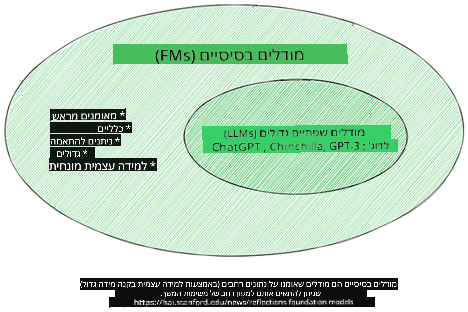
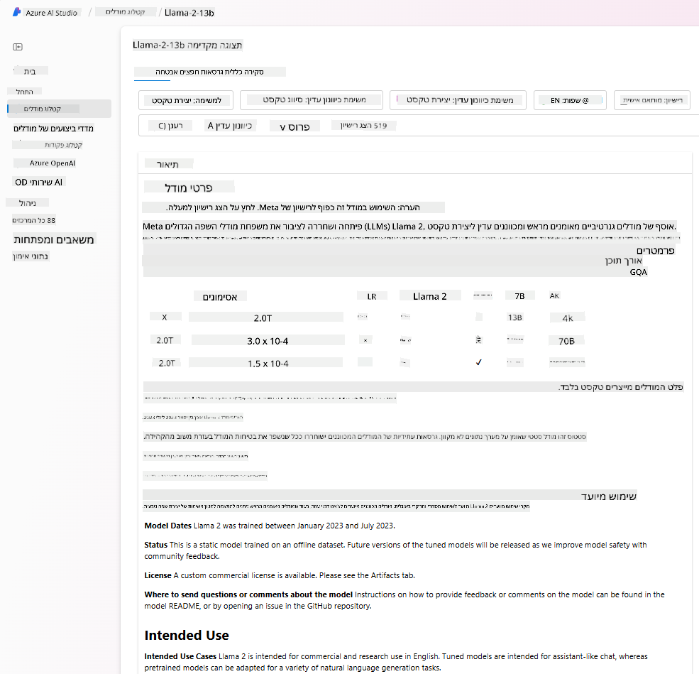

<!--
CO_OP_TRANSLATOR_METADATA:
{
  "original_hash": "e2f686f2eb794941761252ac5e8e090b",
  "translation_date": "2025-07-09T08:32:21+00:00",
  "source_file": "02-exploring-and-comparing-different-llms/README.md",
  "language_code": "he"
}
-->
# חקירה והשוואה בין מודלים גדולים שונים של שפה (LLMs)

> _לחצו על התמונה למעלה לצפייה בסרטון של השיעור_

בשיעור הקודם ראינו כיצד AI גנרטיבי משנה את נוף הטכנולוגיה, איך מודלים גדולים של שפה (LLMs) פועלים ואיך עסק – כמו הסטארטאפ שלנו – יכול ליישם אותם למקרי השימוש שלו ולצמוח! בפרק זה נבחן ונשווה בין סוגים שונים של מודלים גדולים של שפה (LLMs) כדי להבין את היתרונות והחסרונות שלהם.

השלב הבא במסע הסטארטאפ שלנו הוא לחקור את הנוף הנוכחי של ה-LLMs ולהבין אילו מהם מתאימים למקרה השימוש שלנו.

## מבוא

בשיעור זה נסקור:

- סוגים שונים של LLMs בנוף הנוכחי.
- בדיקה, איטרציה והשוואה בין מודלים שונים למקרה השימוש שלך ב-Azure.
- כיצד לפרוס מודל LLM.

## מטרות הלמידה

בסיום השיעור תוכל/י:

- לבחור את המודל המתאים למקרה השימוש שלך.
- להבין כיצד לבדוק, לאטור ולשפר את ביצועי המודל שלך.
- לדעת כיצד עסקים מפרסים מודלים.

## הבנת סוגים שונים של LLMs

ניתן לסווג LLMs בכמה דרכים בהתאם לארכיטקטורה שלהם, לנתוני האימון ולמקרה השימוש. הבנת ההבדלים הללו תעזור לסטארטאפ שלנו לבחור את המודל הנכון לסיטואציה, ולהבין כיצד לבדוק, לאטור ולשפר ביצועים.

ישנם סוגים רבים ושונים של מודלים, והבחירה שלך תלויה במה שאתה מתכוון להשתמש בהם, בנתונים שלך, כמה אתה מוכן לשלם ועוד.

בהתאם לשימוש במודל ליצירת טקסט, אודיו, וידאו, תמונות וכדומה, ייתכן שתבחר בסוג שונה של מודל.

- **זיהוי דיבור ואודיו**. למטרה זו, מודלים מסוג Whisper הם בחירה מצוינת, שכן הם כלליים ומיועדים לזיהוי דיבור. הם מאומנים על אודיו מגוון ויכולים לבצע זיהוי דיבור רב-לשוני. למידע נוסף על [מודלים מסוג Whisper כאן](https://platform.openai.com/docs/models/whisper?WT.mc_id=academic-105485-koreyst).

- **יצירת תמונות**. ליצירת תמונות, DALL-E ו-Midjourney הם שתי אפשרויות מוכרות מאוד. DALL-E מוצע על ידי Azure OpenAI. [קראו עוד על DALL-E כאן](https://platform.openai.com/docs/models/dall-e?WT.mc_id=academic-105485-koreyst) וגם בפרק 9 של תכנית הלימודים הזו.

- **יצירת טקסט**. רוב המודלים מאומנים ליצירת טקסט ויש מגוון רחב של אפשרויות מ-GPT-3.5 ועד GPT-4. הם מגיעים בעלויות שונות כאשר GPT-4 הוא היקר ביותר. כדאי לבדוק את [Azure OpenAI playground](https://oai.azure.com/portal/playground?WT.mc_id=academic-105485-koreyst) כדי להעריך אילו מודלים מתאימים ביותר לצרכים שלך מבחינת יכולת ועלות.

- **רב-מודליות**. אם אתה רוצה לטפל בסוגים שונים של נתונים בקלט ובפלט, ייתכן שתרצה לבדוק מודלים כמו [gpt-4 turbo עם ראייה או gpt-4o](https://learn.microsoft.com/azure/ai-services/openai/concepts/models#gpt-4-and-gpt-4-turbo-models?WT.mc_id=academic-105485-koreyst) – הגרסאות האחרונות של מודלי OpenAI – המסוגלים לשלב עיבוד שפה טבעית עם הבנה ויזואלית, ומאפשרים אינטראקציות דרך ממשקים רב-מודליים.

בחירת מודל נותנת לך יכולות בסיסיות, שלעיתים לא מספיקות. לעיתים יש לך נתונים ספציפיים לחברה שצריך somehow לספר עליהם ל-LLM. יש כמה דרכים לגשת לזה, נרחיב על כך בהמשך.

### מודלים בסיסיים לעומת LLMs

המונח Foundation Model הוטבע על ידי [חוקרים מסטנפורד](https://arxiv.org/abs/2108.07258?WT.mc_id=academic-105485-koreyst) והוגדר כמודל AI שעומד בקריטריונים מסוימים, כגון:

- **מאומנים באמצעות למידה ללא השגחה או למידה עצמית**, כלומר מאומנים על נתונים רב-מודליים ללא תיוג, ואינם דורשים אנוטציה או תיוג ידני של הנתונים בתהליך האימון.
- **מודלים גדולים מאוד**, מבוססי רשתות עצביות עמוקות מאוד המאומנות על מיליארדי פרמטרים.
- **מיועדים בדרך כלל לשמש כ'בסיס' למודלים אחרים**, כלומר ניתן להשתמש בהם כנקודת התחלה לבניית מודלים נוספים באמצעות כיוונון עדין (fine-tuning).

מקור התמונה: [Essential Guide to Foundation Models and Large Language Models | by Babar M Bhatti | Medium](https://thebabar.medium.com/essential-guide-to-foundation-models-and-large-language-models-27dab58f7404)

להבהרת ההבדל, ניקח את ChatGPT כדוגמה. לבניית הגרסה הראשונה של ChatGPT, מודל בשם GPT-3.5 שימש כמודל בסיס. כלומר, OpenAI השתמשה בנתוני שיחה ספציפיים כדי ליצור גרסה מכווננת של GPT-3.5 שהתמחתה בביצועים טובים בסיטואציות שיחה, כמו צ'טבוטים.

מקור התמונה: [2108.07258.pdf (arxiv.org)](https://arxiv.org/pdf/2108.07258.pdf?WT.mc_id=academic-105485-koreyst)

### מודלים בקוד פתוח לעומת מודלים קנייניים

דרך נוספת לסווג LLMs היא האם הם בקוד פתוח או קנייניים.

מודלים בקוד פתוח הם מודלים הזמינים לציבור וניתן להשתמש בהם על ידי כל אחד. לעיתים הם מוצעים על ידי החברה שיצרה אותם או על ידי קהילת המחקר. מודלים אלו ניתנים לבדיקה, שינוי והתאמה למקרי שימוש שונים ב-LLMs. עם זאת, הם לא תמיד מותאמים לשימוש פרודקשן, ועלולים להיות פחות יעילים ממודלים קנייניים. בנוסף, המימון למודלים בקוד פתוח מוגבל, והם עלולים לא להתעדכן או להישמר לאורך זמן. דוגמאות למודלים פופולריים בקוד פתוח כוללות את [Alpaca](https://crfm.stanford.edu/2023/03/13/alpaca.html?WT.mc_id=academic-105485-koreyst), [Bloom](https://huggingface.co/bigscience/bloom) ו-[LLaMA](https://llama.meta.com).

מודלים קנייניים הם מודלים שבבעלות חברה ואינם זמינים לציבור. מודלים אלו מותאמים לרוב לשימוש פרודקשן. עם זאת, אין אפשרות לבדוק, לשנות או להתאים אותם למקרי שימוש שונים. בנוסף, הם לא תמיד זמינים בחינם ועלולים לדרוש מנוי או תשלום לשימוש. כמו כן, המשתמשים אינם שולטם בנתונים שבהם משתמשים לאימון המודל, ולכן יש לסמוך על בעל המודל שיבטיח פרטיות נתונים ושימוש אחראי ב-AI. דוגמאות למודלים קנייניים פופולריים כוללות את [מודלי OpenAI](https://platform.openai.com/docs/models/overview?WT.mc_id=academic-105485-koreyst), [Google Bard](https://sapling.ai/llm/bard?WT.mc_id=academic-105485-koreyst) או [Claude 2](https://www.anthropic.com/index/claude-2?WT.mc_id=academic-105485-koreyst).

### Embedding לעומת יצירת תמונות לעומת יצירת טקסט וקוד

ניתן גם לסווג LLMs לפי סוג הפלט שהם מייצרים.

Embedding הם קבוצת מודלים שיכולים להמיר טקסט לצורה מספרית, הנקראת embedding, שהיא ייצוג מספרי של הטקסט הנכנס. Embeddings מקלים על מכונות להבין את הקשרים בין מילים או משפטים וניתן להשתמש בהם כקלט למודלים אחרים, כמו מודלי סיווג או אשכולות, שמשיגים ביצועים טובים יותר על נתונים מספריים. מודלי embedding משמשים לעיתים ללמידת העברה (transfer learning), שבה מודל נבנה למשימה חלופית שיש לה שפע נתונים, ואז משקליו (embeddings) משמשים למשימות נוספות. דוגמה לקטגוריה זו היא [OpenAI embeddings](https://platform.openai.com/docs/models/embeddings?WT.mc_id=academic-105485-koreyst).

מודלי יצירת תמונות הם מודלים שיוצרים תמונות. מודלים אלו משמשים לעיתים לעריכת תמונות, סינתזת תמונות ותרגום תמונות. הם מאומנים על מאגרי תמונות גדולים, כמו [LAION-5B](https://laion.ai/blog/laion-5b/?WT.mc_id=academic-105485-koreyst), ויכולים ליצור תמונות חדשות או לערוך תמונות קיימות באמצעות טכניקות כמו inpainting, super-resolution ו-colorization. דוגמאות כוללות את [DALL-E-3](https://openai.com/dall-e-3?WT.mc_id=academic-105485-koreyst) ואת [מודלי Stable Diffusion](https://github.com/Stability-AI/StableDiffusion?WT.mc_id=academic-105485-koreyst).

מודלי יצירת טקסט וקוד הם מודלים שיוצרים טקסט או קוד. מודלים אלו משמשים לעיתים לסיכום טקסט, תרגום ומענה על שאלות. מודלי יצירת טקסט מאומנים על מאגרי טקסט גדולים, כמו [BookCorpus](https://www.cv-foundation.org/openaccess/content_iccv_2015/html/Zhu_Aligning_Books_and_ICCV_2015_paper.html?WT.mc_id=academic-105485-koreyst), ויכולים ליצור טקסט חדש או לענות על שאלות. מודלי יצירת קוד, כמו [CodeParrot](https://huggingface.co/codeparrot?WT.mc_id=academic-105485-koreyst), מאומנים על מאגרי קוד גדולים, כמו GitHub, ויכולים ליצור קוד חדש או לתקן באגים בקוד קיים.

### Encoder-Decoder לעומת Decoder בלבד

כדי לדבר על סוגי הארכיטקטורות השונות של LLMs, נשתמש באנלוגיה.

דמיין שהמנהל שלך נתן לך משימה לכתוב חידון לתלמידים. יש לך שני עמיתים; אחד אחראי על יצירת התוכן והשני על סקירתו.

יוצר התוכן הוא כמו מודל Decoder בלבד, הוא יכול להסתכל על הנושא ולראות מה כבר כתבת ואז לכתוב קורס על סמך זה. הם טובים מאוד בכתיבת תוכן מעניין ומלמד, אך לא טובים בהבנת הנושא ומטרות הלמידה. דוגמאות למודלי Decoder הן משפחת GPT, כמו GPT-3.

הסקור הוא כמו מודל Encoder בלבד, הוא מסתכל על הקורס שנכתב והתשובות, מבחין בקשרים ביניהם ומבין את ההקשר, אך אינו טוב ביצירת תוכן. דוגמה למודל Encoder בלבד הוא BERT.

דמיין שאפשר שיהיה מישהו שגם יוצר וגם סוקר את החידון, זהו מודל Encoder-Decoder. דוגמאות לכך הן BART ו-T5.

### שירות לעומת מודל

כעת, נדבר על ההבדל בין שירות למודל. שירות הוא מוצר שמוצע על ידי ספק שירותי ענן, ולעיתים הוא שילוב של מודלים, נתונים ורכיבים נוספים. מודל הוא הרכיב המרכזי בשירות, ולעיתים הוא מודל בסיס, כמו LLM.

שירותים מותאמים לרוב לשימוש פרודקשן וקלים יותר לשימוש מאשר מודלים, דרך ממשק משתמש גרפי. עם זאת, שירותים לא תמיד זמינים בחינם ועלולים לדרוש מנוי או תשלום, בתמורה לשימוש בציוד ובמשאבים של בעל השירות, אופטימיזציה של הוצאות ויכולת סקיילינג קלה. דוגמה לשירות היא [Azure OpenAI Service](https://learn.microsoft.com/azure/ai-services/openai/overview?WT.mc_id=academic-105485-koreyst), שמציע תמחור pay-as-you-go, כלומר המשתמשים מחויבים בהתאם לשימושם בשירות. בנוסף, Azure OpenAI Service מציע אבטחה ברמת ארגונית ומסגרת AI אחראית מעל ליכולות המודלים.

מודלים הם רק הרשת העצבית, עם הפרמטרים, המשקלים ואחרים. הם מאפשרים לחברות להריץ אותם מקומית, אך יש צורך ברכישת ציוד, בניית תשתית לסקיילינג ורכישת רישיון או שימוש במודל בקוד פתוח. מודל כמו LLaMA זמין לשימוש, אך דורש כוח חישובי להפעלתו.

## כיצד לבדוק ולאטור עם מודלים שונים כדי להבין ביצועים ב-Azure

לאחר שהצוות שלנו חקר את נוף ה-LLMs הנוכחי וזיהה כמה מועמדים טובים לסיטואציות שלהם, השלב הבא הוא לבדוק אותם על הנתונים שלהם ועל עומס העבודה שלהם. זהו תהליך איטרטיבי, שמתבצע באמצעות ניסויים ומדידות.
רוב המודלים שהזכרנו בפסקאות הקודמות (מודלים של OpenAI, מודלים בקוד פתוח כמו Llama2, וטרנספורמרים של Hugging Face) זמינים ב-[Model Catalog](https://learn.microsoft.com/azure/ai-studio/how-to/model-catalog-overview?WT.mc_id=academic-105485-koreyst) ב-[Azure AI Studio](https://ai.azure.com/?WT.mc_id=academic-105485-koreyst).

[Azure AI Studio](https://learn.microsoft.com/azure/ai-studio/what-is-ai-studio?WT.mc_id=academic-105485-koreyst) היא פלטפורמת ענן המיועדת למפתחים לבניית יישומי AI גנרטיביים ולניהול כל מחזור חיי הפיתוח – מהניסוי ועד להערכה – על ידי שילוב כל שירותי Azure AI במרכז אחד עם ממשק משתמש נוח. קטלוג המודלים ב-Azure AI Studio מאפשר למשתמש:

- למצוא את Foundation Model שמעניין אותו בקטלוג – בין אם הוא קנייני או בקוד פתוח, עם סינון לפי משימה, רישיון או שם. לשיפור החיפוש, המודלים מאורגנים לאוספים, כמו אוסף Azure OpenAI, אוסף Hugging Face ועוד.

- לעיין בכרטיס המודל, הכולל תיאור מפורט של השימוש המיועד ונתוני האימון, דוגמאות קוד ותוצאות הערכה מספריית ההערכות הפנימית.

- להשוות בין מדדי ביצועים של מודלים וסטי נתונים זמינים בתעשייה כדי להעריך איזה מהם מתאים לתרחיש העסקי, דרך לוח [Model Benchmarks](https://learn.microsoft.com/azure/ai-studio/how-to/model-benchmarks?WT.mc_id=academic-105485-koreyst).

- לכוונן את המודל על נתוני אימון מותאמים כדי לשפר את ביצועי המודל בעומס עבודה ספציפי, תוך ניצול יכולות הניסוי והמעקב של Azure AI Studio.

- לפרוס את המודל המקורי המאומן מראש או את הגרסה המכווננת לנקודת אינפרנס בזמן אמת מרוחקת – מחשוב מנוהל – או נקודת קצה api ללא שרת – [pay-as-you-go](https://learn.microsoft.com/azure/ai-studio/how-to/model-catalog-overview#model-deployment-managed-compute-and-serverless-api-pay-as-you-go?WT.mc_id=academic-105485-koreyst) – כדי לאפשר ליישומים לצרוך אותו.

> [!NOTE]
> לא כל המודלים בקטלוג זמינים כרגע לכוונון עדין ו/או לפריסה בתשלום לפי שימוש. יש לבדוק את כרטיס המודל לפרטים על היכולות והמגבלות של המודל.

## שיפור תוצאות LLM

חקרנו עם צוות הסטארטאפ שלנו סוגים שונים של LLM ופלטפורמת ענן (Azure Machine Learning) שמאפשרת לנו להשוות בין מודלים שונים, להעריך אותם על נתוני מבחן, לשפר ביצועים ולפרוס אותם בנקודות אינפרנס.

אבל מתי כדאי לשקול לכוונן מודל במקום להשתמש במודל מאומן מראש? האם יש גישות נוספות לשיפור ביצועי המודל בעומסי עבודה ספציפיים?

יש כמה גישות שעסק יכול להשתמש בהן כדי לקבל את התוצאות שהוא צריך מ-LLM. ניתן לבחור סוגים שונים של מודלים עם דרגות אימון שונות בעת פריסת LLM בייצור, עם רמות שונות של מורכבות, עלות ואיכות. הנה כמה גישות שונות:

- **הנדסת פרומפט עם הקשר**. הרעיון הוא לספק הקשר מספק בעת יצירת הפרומפט כדי להבטיח שתקבל את התגובות שאתה צריך.

- **Retrieval Augmented Generation, RAG**. הנתונים שלך עשויים להתקיים במסד נתונים או בנקודת קצה באינטרנט, לדוגמה, כדי להבטיח שהנתונים האלה, או תת-קבוצה שלהם, ייכללו בזמן יצירת הפרומפט, ניתן לשלוף את הנתונים הרלוונטיים ולהפוך אותם לחלק מהפרומפט של המשתמש.

- **מודל מכוונן עדין**. כאן, אימנת את המודל נוסף על הנתונים שלך, מה שהוביל לכך שהמודל מדויק ורגיש יותר לצרכים שלך, אך זה עלול להיות יקר.

מקור התמונה: [Four Ways that Enterprises Deploy LLMs | Fiddler AI Blog](https://www.fiddler.ai/blog/four-ways-that-enterprises-deploy-llms?WT.mc_id=academic-105485-koreyst)

### הנדסת פרומפט עם הקשר

מודלים מאומנים מראש של LLM עובדים טוב מאוד במשימות שפה טבעית כלליות, אפילו כשקוראים להם עם פרומפט קצר, כמו משפט להשלים או שאלה – הלמידה המכונה “zero-shot”.

עם זאת, ככל שהמשתמש יכול למסגר את השאילתה שלו, עם בקשה מפורטת ודוגמאות – ההקשר – התשובה תהיה מדויקת יותר וקרובה יותר לציפיות המשתמש. במקרה זה, מדברים על “one-shot” אם הפרומפט כולל דוגמה אחת בלבד ו-“few shot learning” אם הוא כולל מספר דוגמאות.
הנדסת פרומפט עם הקשר היא הגישה החסכונית ביותר להתחלה.

### Retrieval Augmented Generation (RAG)

ל-LLM יש מגבלה בכך שהם יכולים להשתמש רק בנתונים ששימשו לאימון שלהם כדי לייצר תשובה. משמעות הדבר היא שהם לא יודעים כלום על עובדות שהתרחשו לאחר תהליך האימון, והם לא יכולים לגשת למידע שאינו ציבורי (כמו נתוני חברה).
ניתן להתגבר על כך באמצעות RAG, טכניקה שמוסיפה לפרומפט נתונים חיצוניים בצורת קטעי מסמכים, תוך התחשבות במגבלות אורך הפרומפט. זה נתמך על ידי כלים של מסדי נתונים וקטוריים (כמו [Azure Vector Search](https://learn.microsoft.com/azure/search/vector-search-overview?WT.mc_id=academic-105485-koreyst)) שמחזירים את הקטעים השימושיים ממקורות נתונים מוגדרים מראש ומוסיפים אותם להקשר הפרומפט.

טכניקה זו מאוד מועילה כאשר לעסק אין מספיק נתונים, זמן או משאבים לכוונון עדין של LLM, אך הוא עדיין רוצה לשפר ביצועים בעומס עבודה ספציפי ולהפחית סיכונים של המצאות, כלומר, עיוות המציאות או תוכן מזיק.

### מודל מכוונן עדין

כוונון עדין הוא תהליך שמנצל למידת העברה כדי ‘להתאים’ את המודל למשימה ספציפית או לפתור בעיה מסוימת. בשונה מלמידה עם מעט דוגמאות ו-RAG, התהליך מייצר מודל חדש עם משקלים והטיות מעודכנים. הוא דורש סט של דוגמאות אימון הכולל קלט יחיד (הפרומפט) ופלט משויך (ההשלמה).
זו תהיה הגישה המועדפת אם:

- **שימוש במודלים מכווננים עדין**. עסק ירצה להשתמש במודלים מכווננים עדין בעלי יכולות נמוכות יותר (כמו מודלים להטמעה) במקום מודלים בעלי ביצועים גבוהים, מה שמוביל לפתרון חסכוני ומהיר יותר.

- **שיקול זמן תגובה**. זמן התגובה חשוב למקרה שימוש מסוים, ולכן לא ניתן להשתמש בפרומפטים ארוכים מאוד או במספר דוגמאות שהמודל צריך ללמוד מהן שאינו מתאים למגבלת אורך הפרומפט.

- **שמירה על עדכניות**. לעסק יש הרבה נתונים איכותיים ותוויות אמת, וכן את המשאבים הדרושים לשמור על הנתונים מעודכנים לאורך זמן.

### מודל מאומן

אימון LLM מאפס הוא ללא ספק הגישה הקשה והמורכבת ביותר, ודורש כמויות עצומות של נתונים, משאבים מיומנים וכוח חישובי מתאים. אפשרות זו צריכה להילקח בחשבון רק בתרחיש שבו לעסק יש מקרה שימוש תחומי ספציפי וכמות גדולה של נתונים ממוקדי תחום.

## בדיקת ידע

מה יכולה להיות גישה טובה לשיפור תוצאות ההשלמה של LLM?

1. הנדסת פרומפט עם הקשר  
1. RAG  
1. מודל מכוונן עדין  

תשובה: 3, אם יש לך את הזמן, המשאבים ונתונים איכותיים, כוונון עדין הוא האפשרות הטובה ביותר לשמור על עדכניות. עם זאת, אם אתה מחפש לשפר דברים ואין לך זמן, כדאי לשקול קודם את RAG.

## 🚀 אתגר

קרא עוד על איך אפשר [להשתמש ב-RAG](https://learn.microsoft.com/azure/search/retrieval-augmented-generation-overview?WT.mc_id=academic-105485-koreyst) לעסק שלך.

## עבודה מצוינת, המשך ללמוד

לאחר שסיימת את השיעור הזה, בדוק את [אוסף הלמידה על Generative AI](https://aka.ms/genai-collection?WT.mc_id=academic-105485-koreyst) שלנו כדי להמשיך לשפר את הידע שלך ב-Generative AI!

עבור לשיעור 3 שבו נבחן איך [לבנות עם Generative AI באחריות](../03-using-generative-ai-responsibly/README.md?WT.mc_id=academic-105485-koreyst)!

**כתב ויתור**:  
מסמך זה תורגם באמצעות שירות תרגום מבוסס בינה מלאכותית [Co-op Translator](https://github.com/Azure/co-op-translator). למרות שאנו שואפים לדיוק, יש לקחת בחשבון כי תרגומים אוטומטיים עלולים להכיל שגיאות או אי-דיוקים. המסמך המקורי בשפת המקור שלו צריך להיחשב כמקור הסמכות. למידע קריטי מומלץ להשתמש בתרגום מקצועי על ידי מתרגם אנושי. אנו לא נושאים באחריות לכל אי-הבנה או פרשנות שגויה הנובעת משימוש בתרגום זה.