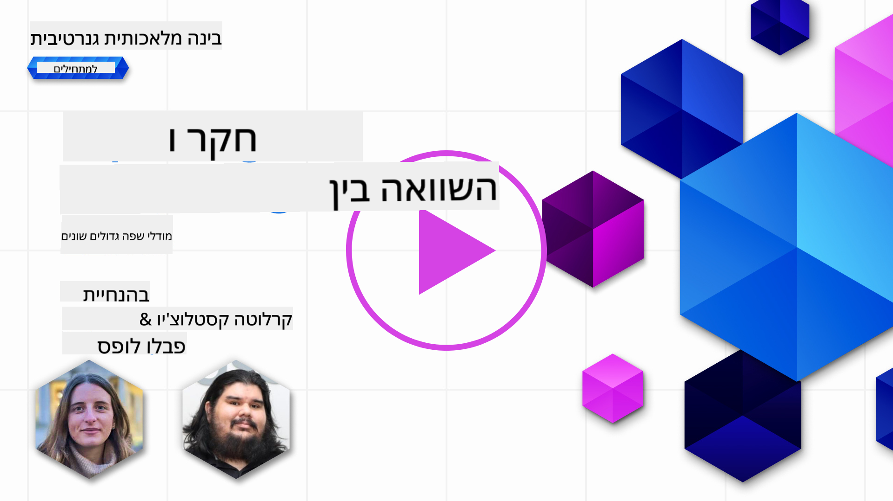
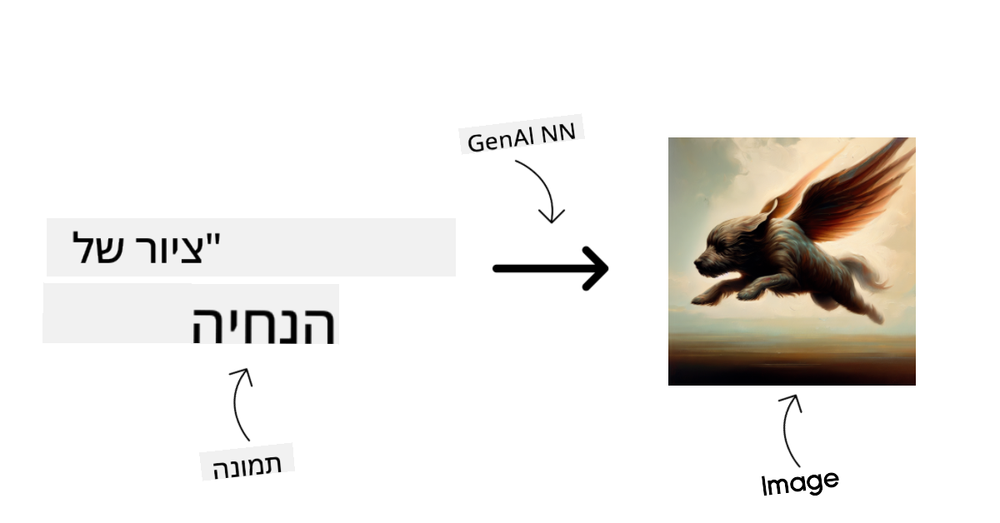
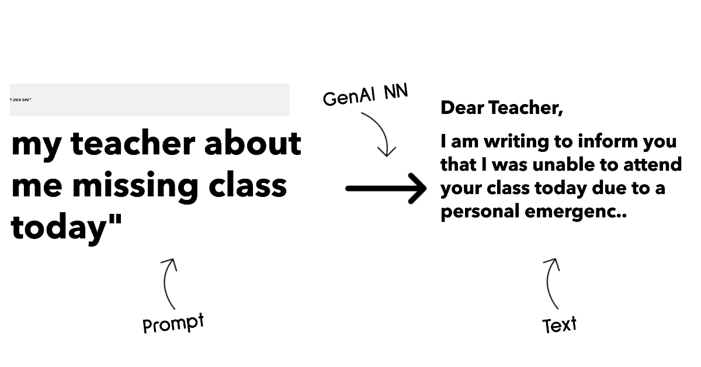
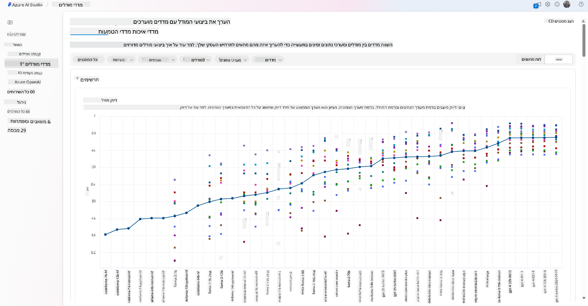
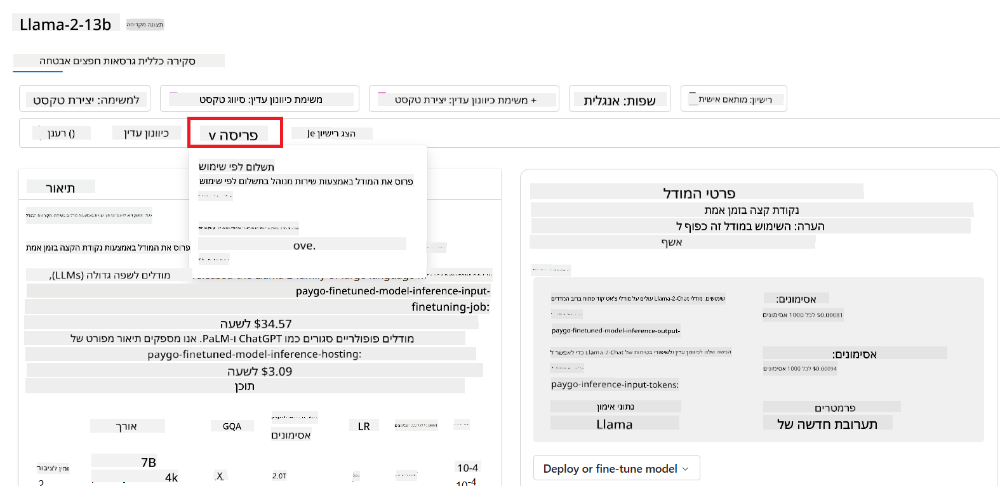

<!--
CO_OP_TRANSLATOR_METADATA:
{
  "original_hash": "6b7629b8ee4d7d874a27213e903d86a7",
  "translation_date": "2025-10-17T20:04:15+00:00",
  "source_file": "02-exploring-and-comparing-different-llms/README.md",
  "language_code": "he"
}
-->
# חקר והשוואה בין מודלים גדולים לשפה (LLMs)

> _לחצו על התמונה למעלה לצפייה בסרטון של השיעור_

בשיעור הקודם ראינו כיצד הבינה המלאכותית הגנרטיבית משנה את פני הטכנולוגיה, כיצד מודלים גדולים לשפה (LLMs) פועלים וכיצד עסקים - כמו הסטארטאפ שלנו - יכולים ליישם אותם לצרכים שלהם ולצמוח! בפרק זה, נבחן ונשווה בין סוגים שונים של מודלים גדולים לשפה (LLMs) כדי להבין את היתרונות והחסרונות שלהם.

השלב הבא במסע של הסטארטאפ שלנו הוא לחקור את הנוף הנוכחי של LLMs ולהבין אילו מהם מתאימים לצרכים שלנו.

## מבוא

השיעור הזה יעסוק ב:

- סוגים שונים של LLMs בנוף הנוכחי.
- בדיקה, חזרה והשוואה בין מודלים שונים לצרכים שלכם ב-Azure.
- כיצד לפרוס מודל LLM.

## מטרות למידה

לאחר השלמת השיעור, תוכלו:

- לבחור את המודל המתאים לצרכים שלכם.
- להבין כיצד לבדוק, לחזור ולשפר את ביצועי המודל שלכם.
- לדעת כיצד עסקים פורסים מודלים.

## הבנת סוגים שונים של LLMs

ניתן לסווג LLMs לפי הארכיטקטורה שלהם, נתוני האימון והשימושים שלהם. הבנת ההבדלים הללו תעזור לסטארטאפ שלנו לבחור את המודל המתאים לתרחיש, ולהבין כיצד לבדוק, לחזור ולשפר ביצועים.

ישנם סוגים רבים של מודלים LLM, הבחירה שלכם תלויה במה שאתם מתכוונים להשתמש בהם, בנתונים שלכם, בתקציב שלכם ועוד.

בהתאם לשימוש במודלים לטקסט, אודיו, וידאו, יצירת תמונות וכדומה, ייתכן שתבחרו סוג שונה של מודל.

- **זיהוי אודיו ודיבור**. למטרה זו, מודלים מסוג Whisper הם בחירה מצוינת מכיוון שהם רב-תכליתיים ומיועדים לזיהוי דיבור. הם מאומנים על אודיו מגוון ויכולים לבצע זיהוי דיבור רב-לשוני. למידע נוסף על [מודלים מסוג Whisper](https://platform.openai.com/docs/models/whisper?WT.mc_id=academic-105485-koreyst).

- **יצירת תמונות**. ליצירת תמונות, DALL-E ו-Midjourney הם שתי בחירות מוכרות מאוד. DALL-E מוצע על ידי Azure OpenAI. [קראו עוד על DALL-E כאן](https://platform.openai.com/docs/models/dall-e?WT.mc_id=academic-105485-koreyst) וגם בפרק 9 של תוכנית הלימודים הזו.

- **יצירת טקסט**. רוב המודלים מאומנים על יצירת טקסט ויש לכם מגוון רחב של אפשרויות מ-GPT-3.5 ועד GPT-4. הם מגיעים בעלויות שונות כאשר GPT-4 הוא היקר ביותר. כדאי לבדוק את [Azure OpenAI playground](https://oai.azure.com/portal/playground?WT.mc_id=academic-105485-koreyst) כדי להעריך אילו מודלים מתאימים לצרכים שלכם מבחינת יכולת ועלות.

- **רב-מודאליות**. אם אתם מחפשים להתמודד עם סוגים שונים של נתונים בקלט ובפלט, ייתכן שתרצו לבדוק מודלים כמו [gpt-4 turbo עם vision או gpt-4o](https://learn.microsoft.com/azure/ai-services/openai/concepts/models#gpt-4-and-gpt-4-turbo-models?WT.mc_id=academic-105485-koreyst) - הגרסאות האחרונות של מודלים OpenAI - שמסוגלים לשלב עיבוד שפה טבעית עם הבנה חזותית, ומאפשרים אינטראקציות דרך ממשקים רב-מודאליים.

בחירת מודל מעניקה לכם יכולות בסיסיות, אך לעיתים זה לא מספיק. לעיתים יש לכם נתונים ספציפיים לחברה שאתם צריכים להעביר למודל. ישנן כמה אפשרויות כיצד לגשת לכך, עוד על כך בסעיפים הבאים.

### מודלים בסיסיים לעומת LLMs

המונח מודל בסיסי [הוטבע על ידי חוקרים מסטנפורד](https://arxiv.org/abs/2108.07258?WT.mc_id=academic-105485-koreyst) והוגדר כמודל AI שעומד בכמה קריטריונים, כגון:

- **הם מאומנים באמצעות למידה לא מפוקחת או למידה עצמית מפוקחת**, כלומר הם מאומנים על נתונים רב-מודאליים לא מתויגים, ואינם דורשים תיוג או הערות אנושיות לתהליך האימון שלהם.
- **הם מודלים גדולים מאוד**, מבוססים על רשתות עצביות עמוקות מאוד המאומנות על מיליארדי פרמטרים.
- **הם בדרך כלל מיועדים לשמש כ'בסיס' למודלים אחרים**, כלומר ניתן להשתמש בהם כנקודת התחלה לבניית מודלים אחרים על גביהם, מה שניתן לעשות באמצעות כיוונון עדין.

מקור תמונה: [Essential Guide to Foundation Models and Large Language Models | מאת Babar M Bhatti | Medium
](https://thebabar.medium.com/essential-guide-to-foundation-models-and-large-language-models-27dab58f7404)

כדי להבהיר את ההבדל הזה, ניקח את ChatGPT כדוגמה. כדי לבנות את הגרסה הראשונה של ChatGPT, מודל בשם GPT-3.5 שימש כמודל הבסיס. משמעות הדבר היא ש-OpenAI השתמשו בנתונים ספציפיים לצ'אט כדי ליצור גרסה מכווננת של GPT-3.5 שהתמחתה בביצועים טובים בתרחישי שיחה, כמו צ'אטבוטים.

מקור תמונה: [2108.07258.pdf (arxiv.org)](https://arxiv.org/pdf/2108.07258.pdf?WT.mc_id=academic-105485-koreyst)

### מודלים בקוד פתוח לעומת מודלים קנייניים

דרך נוספת לסווג LLMs היא האם הם בקוד פתוח או קנייניים.

מודלים בקוד פתוח הם מודלים הזמינים לציבור וניתן להשתמש בהם על ידי כל אחד. הם לעיתים קרובות זמינים על ידי החברה שיצרה אותם או על ידי קהילת המחקר. מודלים אלה מאפשרים בדיקה, שינוי והתאמה לצרכים שונים ב-LLMs. עם זאת, הם לא תמיד מותאמים לשימוש בייצור, ואולי לא יהיו יעילים כמו מודלים קנייניים. בנוסף, המימון למודלים בקוד פתוח יכול להיות מוגבל, והם עשויים לא להיות מתוחזקים לטווח ארוך או לא להיות מעודכנים עם המחקר האחרון. דוגמאות למודלים פופולריים בקוד פתוח כוללות [Alpaca](https://crfm.stanford.edu/2023/03/13/alpaca.html?WT.mc_id=academic-105485-koreyst), [Bloom](https://huggingface.co/bigscience/bloom) ו-[LLaMA](https://llama.meta.com).

מודלים קנייניים הם מודלים בבעלות חברה ואינם זמינים לציבור. מודלים אלה לעיתים קרובות מותאמים לשימוש בייצור. עם זאת, לא ניתן לבדוק, לשנות או להתאים אותם לצרכים שונים. בנוסף, הם לא תמיד זמינים בחינם, ועשויים לדרוש מנוי או תשלום לשימוש. כמו כן, למשתמשים אין שליטה על הנתונים המשמשים לאימון המודל, מה שאומר שהם צריכים לסמוך על בעל המודל שיבטיח מחויבות לפרטיות נתונים ושימוש אחראי ב-AI. דוגמאות למודלים קנייניים פופולריים כוללות [מודלים של OpenAI](https://platform.openai.com/docs/models/overview?WT.mc_id=academic-105485-koreyst), [Google Bard](https://sapling.ai/llm/bard?WT.mc_id=academic-105485-koreyst) או [Claude 2](https://www.anthropic.com/index/claude-2?WT.mc_id=academic-105485-koreyst).

### הטמעה לעומת יצירת תמונות לעומת יצירת טקסט וקוד

ניתן גם לסווג LLMs לפי הפלט שהם מייצרים.

הטמעות הן קבוצת מודלים שיכולים להמיר טקסט לצורה מספרית, הנקראת הטמעה, שהיא ייצוג מספרי של טקסט הקלט. הטמעות מקלות על מכונות להבין את הקשרים בין מילים או משפטים וניתן להשתמש בהן כקלט למודלים אחרים, כגון מודלים לסיווג או למודלים לקיבוץ עם ביצועים טובים יותר על נתונים מספריים. מודלים של הטמעה משמשים לעיתים קרובות ללמידת העברה, שבה נבנה מודל למשימה חלופית שיש לה שפע של נתונים, ואז משקלות המודל (הטמעות) משמשות מחדש למשימות אחרות. דוגמה לקטגוריה זו היא [OpenAI embeddings](https://platform.openai.com/docs/models/embeddings?WT.mc_id=academic-105485-koreyst).

מודלים ליצירת תמונות הם מודלים שמייצרים תמונות. מודלים אלה משמשים לעיתים קרובות לעריכת תמונות, סינתזת תמונות ותרגום תמונות. מודלים ליצירת תמונות מאומנים לעיתים קרובות על מערכי נתונים גדולים של תמונות, כגון [LAION-5B](https://laion.ai/blog/laion-5b/?WT.mc_id=academic-105485-koreyst), וניתן להשתמש בהם ליצירת תמונות חדשות או לעריכת תמונות קיימות בטכניקות כמו צביעה מחדש, סופר-רזולוציה וטכניקות צביעה. דוגמאות כוללות [DALL-E-3](https://openai.com/dall-e-3?WT.mc_id=academic-105485-koreyst) ו-[Stable Diffusion models](https://github.com/Stability-AI/StableDiffusion?WT.mc_id=academic-105485-koreyst).

מודלים ליצירת טקסט וקוד הם מודלים שמייצרים טקסט או קוד. מודלים אלה משמשים לעיתים קרובות לסיכום טקסט, תרגום ומענה על שאלות. מודלים ליצירת טקסט מאומנים לעיתים קרובות על מערכי נתונים גדולים של טקסט, כגון [BookCorpus](https://www.cv-foundation.org/openaccess/content_iccv_2015/html/Zhu_Aligning_Books_and_ICCV_2015_paper.html?WT.mc_id=academic-105485-koreyst), וניתן להשתמש בהם ליצירת טקסט חדש או למענה על שאלות. מודלים ליצירת קוד, כמו [CodeParrot](https://huggingface.co/codeparrot?WT.mc_id=academic-105485-koreyst), מאומנים לעיתים קרובות על מערכי נתונים גדולים של קוד, כגון GitHub, וניתן להשתמש בהם ליצירת קוד חדש או לתיקון באגים בקוד קיים.

### מודל מקודד-מפענח לעומת מודל מפענח בלבד

כדי לדבר על סוגי הארכיטקטורות השונות של LLMs, נשתמש באנלוגיה.

דמיינו שהמנהל שלכם נתן לכם משימה לכתוב מבחן לתלמידים. יש לכם שני עמיתים; אחד אחראי על יצירת התוכן והשני אחראי על סקירתו.

יוצר התוכן דומה למודל מפענח בלבד, הוא יכול להסתכל על הנושא ולראות מה כבר כתבתם ואז לכתוב קורס על בסיס זה. הוא טוב מאוד בכתיבת תוכן מרתק ומידע, אבל הוא לא טוב מאוד בהבנת הנושא והמטרות הלימודיות. כמה דוגמאות למודלים מפענחים הם מודלים ממשפחת GPT, כמו GPT-3.

הסוקר דומה למודל מקודד בלבד, הוא מסתכל על הקורס שנכתב ועל התשובות, מבחין בקשר ביניהם ומבין את ההקשר, אבל הוא לא טוב ביצירת תוכן. דוגמה למודל מקודד בלבד תהיה BERT.

דמיינו שיש גם מישהו שיכול ליצור ולסקור את המבחן, זהו מודל מקודד-מפענח. כמה דוגמאות יהיו BART ו-T5.

### שירות לעומת מודל

עכשיו, נדבר על ההבדל בין שירות למודל. שירות הוא מוצר שמוצע על ידי ספק שירותי ענן, ולעיתים קרובות הוא שילוב של מודלים, נתונים ורכיבים אחרים. מודל הוא הרכיב המרכזי של שירות, ולעיתים קרובות הוא מודל בסיסי, כמו LLM.

שירותים לעיתים קרובות מותאמים לשימוש בייצור ולעיתים קרובות קלים יותר לשימוש ממודלים, באמצעות ממשק משתמש גרפי. עם זאת, שירותים לא תמיד זמינים בחינם, ועשויים לדרוש מנוי או תשלום לשימוש, בתמורה לניצול הציוד והמשאבים של בעל השירות, אופטימיזציה של הוצאות והרחבה קלה. דוגמה לשירות היא [Azure OpenAI Service](https://learn.microsoft.com/azure/ai-services/openai/overview?WT.mc_id=academic-105485-koreyst), שמציעה תוכנית תשלום לפי שימוש, כלומר משתמשים מחויבים באופן יחסי לכמות השימוש שלהם בשירות. בנוסף, Azure OpenAI Service מציעה אבטחה ברמה ארגונית ומסגרת AI אחראית מעל יכולות המודלים.

מודלים הם רק רשת עצבית, עם הפרמטרים, המשקלים ואחרים. הם מאפשרים לחברות להריץ באופן מקומי, אך ידרשו רכישת ציוד, בניית מבנה להרחבה ורכישת רישיון או שימוש במודל בקוד פתוח. מודל כמו LLaMA זמין לשימוש, ודורש כוח מחשוב כדי להריץ את המודל.

## כיצד לבדוק ולחזור עם מודלים שונים כדי להבין ביצועים ב-Azure

לאחר שהצוות שלנו חקר את נוף ה-LLMs הנוכחי וזיהה כמה מועמדים טובים לתרחישים שלהם, השלב הבא הוא לבדוק אותם על הנתונים שלהם ועל עומס העבודה שלהם. זהו תהליך איטרטיבי, שמתבצע באמצעות ניסויים ומדידות.
רוב המודלים שהזכרנו בפסקאות הקודמות (מודלים של OpenAI, מודלים בקוד פתוח כמו Llama2 ו-Hugging Face transformers) זמינים ב-[קטלוג המודלים](https://learn.microsoft.com/azure/ai-studio/how-to/model-catalog-overview?WT.mc_id=academic-105485-koreyst) ב-[Azure AI Studio](https://ai.azure.com/?WT.mc_id=academic-105485-koreyst).

[Azure AI Studio](https://learn.microsoft.com/azure/ai-studio/what-is-ai-studio?WT.mc_id=academic-105485-koreyst) היא פלטפורמת ענן המיועדת למפתחים לבנות יישומי AI גנרטיביים ולנהל את כל מחזור הפיתוח - מהניסוי ועד ההערכה - על ידי שילוב כל שירותי Azure AI במרכז אחד עם ממשק משתמש נוח. קטלוג המודלים ב-Azure AI Studio מאפשר למשתמש:

- למצוא את מודל הבסיס הרצוי בקטלוג - בין אם הוא קנייני או בקוד פתוח, תוך סינון לפי משימה, רישיון או שם. כדי לשפר את החיפוש, המודלים מאורגנים באוספים, כמו אוסף Azure OpenAI, אוסף Hugging Face ועוד.

- לעיין בכרטיס המודל, כולל תיאור מפורט של השימוש המיועד ונתוני האימון, דוגמאות קוד ותוצאות הערכה בספריית ההערכות הפנימית.

- להשוות ביצועים בין מודלים ומאגרי נתונים זמינים בתעשייה כדי להעריך איזה מהם מתאים לתרחיש העסקי, דרך חלונית [השוואת מודלים](https://learn.microsoft.com/azure/ai-studio/how-to/model-benchmarks?WT.mc_id=academic-105485-koreyst).

- לכוונן את המודל על נתוני אימון מותאמים אישית כדי לשפר את ביצועי המודל בעומס עבודה ספציפי, תוך ניצול יכולות הניסוי והמעקב של Azure AI Studio.

- לפרוס את המודל המקורי המאומן מראש או את הגרסה המכווננת לפריסה בזמן אמת - מחשוב מנוהל - או נקודת קצה API ללא שרת - [תשלום לפי שימוש](https://learn.microsoft.com/azure/ai-studio/how-to/model-catalog-overview#model-deployment-managed-compute-and-serverless-api-pay-as-you-go?WT.mc_id=academic-105485-koreyst) - כדי לאפשר ליישומים לצרוך אותו.

> [!NOTE]
> לא כל המודלים בקטלוג זמינים כיום לכיוונון ו/או לפריסה בתשלום לפי שימוש. בדוק את כרטיס המודל לפרטים על יכולותיו ומגבלותיו.

## שיפור תוצאות LLM

חקרנו עם צוות הסטארטאפ שלנו סוגים שונים של LLMs ופלטפורמת ענן (Azure Machine Learning) שמאפשרת לנו להשוות בין מודלים שונים, להעריך אותם על נתוני בדיקה, לשפר ביצועים ולפרוס אותם בנקודות קצה של הסקה.

אבל מתי כדאי לשקול לכוונן מודל במקום להשתמש במודל מאומן מראש? האם יש גישות אחרות לשיפור ביצועי מודל בעומסי עבודה ספציפיים?

ישנן מספר גישות שעסק יכול להשתמש בהן כדי להשיג את התוצאות הרצויות מ-LLM. ניתן לבחור סוגים שונים של מודלים עם דרגות שונות של אימון בעת פריסת LLM בייצור, עם רמות שונות של מורכבות, עלות ואיכות. הנה כמה גישות שונות:

- **הנדסת הנחיות עם הקשר**. הרעיון הוא לספק מספיק הקשר כאשר אתה מנחה כדי להבטיח שתקבל את התשובות שאתה צריך.

- **יצירת מידע מוגברת על ידי אחזור, RAG**. ייתכן שהנתונים שלך קיימים בבסיס נתונים או נקודת קצה אינטרנט, לדוגמה, כדי להבטיח שהנתונים הללו, או חלק מהם, ייכללו בזמן ההנחיה, ניתן לאחזר את הנתונים הרלוונטיים ולהפוך אותם לחלק מההנחיה של המשתמש.

- **מודל מכוונן**. כאן, אתה מאמן את המודל עוד יותר על הנתונים שלך, מה שמוביל לכך שהמודל יהיה מדויק יותר ומגיב לצרכים שלך, אך ייתכן שיהיה יקר.

מקור תמונה: [Four Ways that Enterprises Deploy LLMs | Fiddler AI Blog](https://www.fiddler.ai/blog/four-ways-that-enterprises-deploy-llms?WT.mc_id=academic-105485-koreyst)

### הנדסת הנחיות עם הקשר

מודלים מאומנים מראש של LLMs עובדים היטב במשימות שפה טבעית כלליות, אפילו על ידי קריאה עם הנחיה קצרה, כמו משפט להשלמה או שאלה – מה שנקרא "למידה ללא דוגמאות".

עם זאת, ככל שהמשתמש יכול למסגר את השאילתה שלו, עם בקשה מפורטת ודוגמאות – ההקשר – כך התשובה תהיה מדויקת יותר וקרובה יותר לציפיות המשתמש. במקרה זה, אנו מדברים על "למידה עם דוגמה אחת" אם ההנחיה כוללת רק דוגמה אחת ו"למידה עם מספר דוגמאות" אם היא כוללת מספר דוגמאות. הנדסת הנחיות עם הקשר היא הגישה הכי חסכונית להתחיל איתה.

### יצירת מידע מוגברת על ידי אחזור (RAG)

ל-LLMs יש מגבלה שהם יכולים להשתמש רק בנתונים ששימשו במהלך האימון שלהם כדי ליצור תשובה. משמעות הדבר היא שהם לא יודעים דבר על עובדות שקרו לאחר תהליך האימון שלהם, והם לא יכולים לגשת למידע שאינו ציבורי (כמו נתוני חברה).  
ניתן להתגבר על כך באמצעות RAG, טכניקה שמגבירה את ההנחיה עם נתונים חיצוניים בצורת קטעי מסמכים, תוך התחשבות במגבלות אורך ההנחיה. זה נתמך על ידי כלי בסיסי נתונים וקטוריים (כמו [Azure Vector Search](https://learn.microsoft.com/azure/search/vector-search-overview?WT.mc_id=academic-105485-koreyst)) שמחזירים את הקטעים השימושיים ממקורות נתונים מוגדרים מראש ומוסיפים אותם להקשר ההנחיה.

טכניקה זו מועילה מאוד כאשר לעסק אין מספיק נתונים, זמן או משאבים לכוונן LLM, אך עדיין מעוניין לשפר ביצועים בעומס עבודה ספציפי ולהפחית סיכונים של המצאות, כלומר, עיוות המציאות או תוכן מזיק.

### מודל מכוונן

כיוונון הוא תהליך שמנצל למידה מעבירה כדי 'להתאים' את המודל למשימה ספציפית או לפתור בעיה מסוימת. בניגוד ללמידה עם מספר דוגמאות ו-RAG, הוא יוצר מודל חדש עם משקלים והטיות מעודכנים. הוא דורש סט של דוגמאות אימון שמורכב מקלט יחיד (ההנחיה) ותוצאה משויכת (השלמה).  
זו תהיה הגישה המועדפת אם:

- **שימוש במודלים מכווננים**. עסק ירצה להשתמש במודלים מכווננים פחות חזקים (כמו מודלים של הטמעה) במקום מודלים בעלי ביצועים גבוהים, מה שמוביל לפתרון חסכוני ומהיר יותר.

- **התחשבות בזמן תגובה**. זמן תגובה חשוב עבור מקרה שימוש ספציפי, ולכן לא ניתן להשתמש בהנחיות ארוכות מאוד או במספר הדוגמאות שהמודל צריך ללמוד מהן, שאינן מתאימות למגבלת אורך ההנחיה.

- **שמירה על עדכניות**. לעסק יש הרבה נתונים איכותיים ותוויות אמת קרקעיות ומשאבים הנדרשים לשמור על נתונים אלו מעודכנים לאורך זמן.

### מודל מאומן

אימון LLM מאפס הוא ללא ספק הגישה הקשה והמורכבת ביותר לאימוץ, ודורשת כמויות עצומות של נתונים, משאבים מיומנים וכוח חישוב מתאים. אפשרות זו צריכה להישקל רק בתרחיש שבו לעסק יש מקרה שימוש ספציפי לתחום וכמות גדולה של נתונים ממוקדי תחום.

## בדיקת ידע

מה יכולה להיות גישה טובה לשיפור תוצאות השלמת LLM?

1. הנדסת הנחיות עם הקשר  
1. RAG  
1. מודל מכוונן  

תשובה: 3, אם יש לך את הזמן והמשאבים ונתונים איכותיים, כיוונון הוא האפשרות הטובה ביותר לשמור על עדכניות. עם זאת, אם אתה מחפש לשפר דברים ואין לך זמן, כדאי לשקול קודם RAG.

## 🚀 אתגר

קרא עוד על איך אתה יכול [להשתמש ב-RAG](https://learn.microsoft.com/azure/search/retrieval-augmented-generation-overview?WT.mc_id=academic-105485-koreyst) עבור העסק שלך.

## עבודה מצוינת, המשך ללמוד

לאחר שסיימת את השיעור הזה, בדוק את [אוסף הלמידה של AI גנרטיבי](https://aka.ms/genai-collection?WT.mc_id=academic-105485-koreyst) שלנו כדי להמשיך לשפר את הידע שלך ב-AI גנרטיבי!

עבור לשיעור 3 שבו נבחן איך [לבנות עם AI גנרטיבי באחריות](../03-using-generative-ai-responsibly/README.md?WT.mc_id=academic-105485-koreyst)!

---

**הצהרת אחריות**:  
מסמך זה תורגם באמצעות שירות תרגום AI [Co-op Translator](https://github.com/Azure/co-op-translator). למרות שאנו שואפים לדיוק, יש לקחת בחשבון שתרגומים אוטומטיים עשויים להכיל שגיאות או אי דיוקים. המסמך המקורי בשפתו המקורית צריך להיחשב כמקור סמכותי. עבור מידע קריטי, מומלץ להשתמש בתרגום מקצועי אנושי. איננו נושאים באחריות לאי הבנות או לפרשנויות שגויות הנובעות משימוש בתרגום זה.