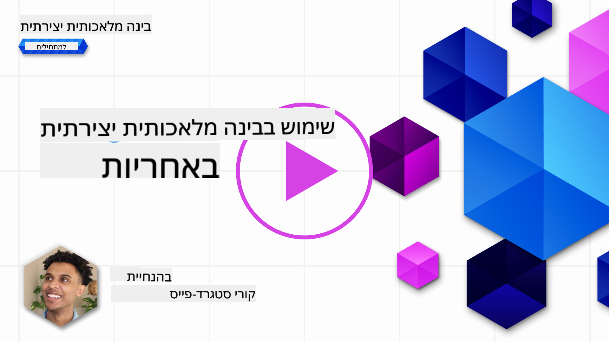
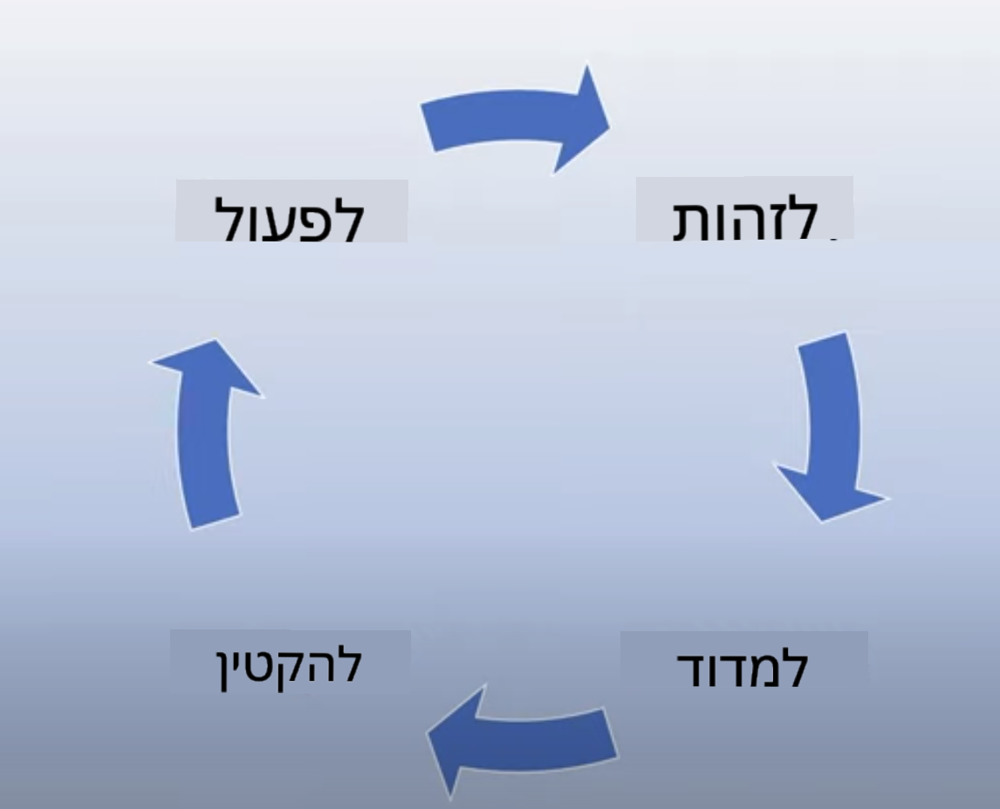
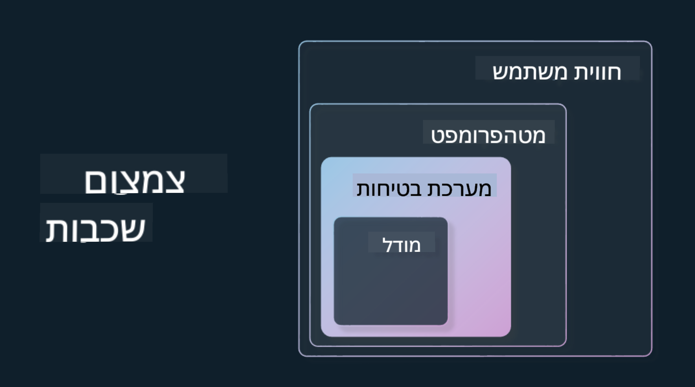

<!--
CO_OP_TRANSLATOR_METADATA:
{
  "original_hash": "7f8f4c11f8c1cb6e1794442dead414ea",
  "translation_date": "2025-07-09T08:59:17+00:00",
  "source_file": "03-using-generative-ai-responsibly/README.md",
  "language_code": "he"
}
-->
# שימוש אחראי בבינה מלאכותית גנרטיבית

> _לחצו על התמונה למעלה לצפייה בסרטון של השיעור_

קל להתלהב מבינה מלאכותית ובינה מלאכותית גנרטיבית בפרט, אבל חשוב לשקול כיצד להשתמש בה באחריות. יש לקחת בחשבון דברים כמו איך להבטיח שהתוצאה תהיה הוגנת, לא מזיקה ועוד. פרק זה נועד לספק לכם את ההקשר הנדרש, מה לשקול ואיך לנקוט צעדים פעילים לשיפור השימוש שלכם בבינה מלאכותית.

## מבוא

בשיעור זה נסקור:

- מדוע כדאי לתת עדיפות ל-Responsible AI בעת בניית יישומים מבוססי בינה מלאכותית גנרטיבית.
- עקרונות הליבה של Responsible AI וכיצד הם מתקשרים לבינה מלאכותית גנרטיבית.
- איך ליישם את עקרונות Responsible AI באמצעות אסטרטגיה וכלים.

## מטרות הלמידה

בסיום השיעור תדעו:

- את חשיבות Responsible AI בעת בניית יישומים מבוססי בינה מלאכותית גנרטיבית.
- מתי לחשוב וליישם את עקרונות הליבה של Responsible AI בעת בניית יישומים מבוססי בינה מלאכותית גנרטיבית.
- אילו כלים ואסטרטגיות זמינים לכם כדי ליישם את מושג Responsible AI בפועל.

## עקרונות Responsible AI

ההתלהבות מבינה מלאכותית גנרטיבית בשיאה. התלהבות זו הביאה אל התחום מפתחים חדשים רבים, תשומת לב ומימון. למרות שזה חיובי מאוד למי שמעוניין לבנות מוצרים וחברות המשתמשות בבינה מלאכותית גנרטיבית, חשוב שנפעל באחריות.

במהלך הקורס הזה, נתמקד בבניית הסטארטאפ שלנו ומוצר החינוך שלנו לבינה מלאכותית. נשתמש בעקרונות Responsible AI: הוגנות, הכללה, אמינות/בטיחות, אבטחה ופרטיות, שקיפות ואחריות. באמצעות עקרונות אלו נבחן כיצד הם מתקשרים לשימוש שלנו בבינה מלאכותית גנרטיבית במוצרים שלנו.

## מדוע כדאי לתת עדיפות ל-Responsible AI

כשבונים מוצר, גישה ממוקדת אדם תוך שמירה על טובת המשתמש מובילה לתוצאות הטובות ביותר.

הייחודיות של בינה מלאכותית גנרטיבית היא ביכולתה ליצור תשובות מועילות, מידע, הנחיות ותוכן למשתמשים. זה יכול להיעשות ללא הרבה שלבים ידניים, מה שמוביל לתוצאות מרשימות מאוד. עם זאת, ללא תכנון ואסטרטגיות נכונות, זה עלול להוביל לתוצאות מזיקות למשתמשים, למוצר ולחברה כולה.

נבחן כמה (אך לא את כל) התוצאות המזיקות האפשריות:

### הזיות

הזיות הן מונח המתאר מקרים שבהם מודל שפה גדול (LLM) מייצר תוכן שהוא או חסר משמעות לחלוטין או שגוי עובדתית לפי מקורות מידע אחרים.

לדוגמה, נניח שבנינו תכונה בסטארטאפ שלנו המאפשרת לתלמידים לשאול שאלות היסטוריות למודל. תלמיד שואל את השאלה `מי היה הניצול היחיד של הטיטניק?`

המודל מייצר תשובה כמו זו למטה:

> _(מקור: [Flying bisons](https://flyingbisons.com?WT.mc_id=academic-105485-koreyst))_

זו תשובה בטוחה ומפורטת מאוד. לצערנו, היא שגויה. אפילו עם מעט מחקר, ניתן לגלות שהיו יותר מניצול אחד באסון הטיטניק. עבור תלמיד שמתחיל לחקור את הנושא, תשובה כזו עלולה להיות משכנעת מדי ולא להטיל ספק, ולטפל בה כעובדה. התוצאות של זה עלולות להפוך את מערכת הבינה המלאכותית ללא אמינה ולהשפיע לרעה על המוניטין של הסטארטאפ שלנו.

עם כל גרסה חדשה של כל מודל שפה גדול, ראינו שיפורים בביצועים שמפחיתים הזיות. למרות השיפור, אנחנו כמפתחים ומשתמשים צריכים להישאר מודעים למגבלות אלו.

### תוכן מזיק

כבר דיברנו על מקרים שבהם מודל שפה גדול מייצר תשובות שגויות או חסרות משמעות. סיכון נוסף שצריך להיות מודעים אליו הוא מענה בתוכן מזיק.

תוכן מזיק מוגדר כ:

- מתן הנחיות או עידוד לפגיעה עצמית או פגיעה בקבוצות מסוימות.
- תוכן שנאה או משפיל.
- הנחיה לתכנון כל סוג של התקפה או מעשי אלימות.
- מתן הנחיות כיצד למצוא תוכן לא חוקי או לבצע מעשים לא חוקיים.
- הצגת תוכן מיני מפורש.

לסטארטאפ שלנו חשוב לוודא שיש לנו את הכלים והאסטרטגיות הנכונות כדי למנוע מתלמידים לראות תוכן כזה.

### חוסר הוגנות

הוגנות מוגדרת כ"להבטיח שמערכת בינה מלאכותית חפה מהטיות ואפליה, ושהיא מתייחסת לכולם בהוגנות ובשוויון". בעולם הבינה המלאכותית הגנרטיבית, חשוב לנו לוודא שהתפיסות המפלגות של קבוצות מוחלשות לא מחוזקות על ידי הפלט של המודל.

פלטים מסוג זה לא רק פוגעים ביצירת חוויות מוצר חיוביות למשתמשים שלנו, אלא גם גורמים לנזק חברתי נוסף. כמפתחים, עלינו תמיד לזכור בסיס משתמשים רחב ומגוון כשאנו בונים פתרונות עם בינה מלאכותית גנרטיבית.

## איך להשתמש בבינה מלאכותית גנרטיבית באחריות

כעת כשזיהינו את חשיבות Responsible Generative AI, נבחן 4 צעדים שנוכל לנקוט כדי לבנות פתרונות AI באחריות:

### למדוד נזקים פוטנציאליים

בבדיקות תוכנה, בודקים את הפעולות הצפויות של משתמש על יישום. בדומה לכך, בדיקת מגוון רחב של בקשות שהמשתמשים סביר להניח ישתמשו בהן היא דרך טובה למדוד נזק פוטנציאלי.

מכיוון שהסטארטאפ שלנו בונה מוצר חינוכי, כדאי להכין רשימה של בקשות הקשורות לחינוך. זה יכול לכלול נושאים מסוימים, עובדות היסטוריות ובקשות על חיי תלמידים.

### להפחית נזקים פוטנציאליים

כעת הגיע הזמן למצוא דרכים למנוע או להגביל את הנזק הפוטנציאלי שנגרם על ידי המודל ותשובותיו. ניתן להתבונן בזה בארבע שכבות שונות:

- **המודל**. בחירת המודל המתאים למקרה השימוש הנכון. מודלים גדולים ומורכבים כמו GPT-4 עלולים להגדיל את הסיכון לתוכן מזיק כשמיישמים אותם במקרים קטנים וממוקדים יותר. שימוש בנתוני האימון שלכם לכוונון עדין מפחית גם הוא את הסיכון לתוכן מזיק.

- **מערכת בטיחות**. מערכת בטיחות היא אוסף כלים וקונפיגורציות בפלטפורמה שמשרתת את המודל ועוזרת להפחית נזקים. דוגמה לכך היא מערכת סינון התוכן בשירות Azure OpenAI. מערכות אלו צריכות גם לזהות התקפות jailbreak ופעילות לא רצויה כמו בקשות מבוטים.

- **מטפרומפט**. מטפרומפטים ועיגון הם דרכים שבהן ניתן לכוון או להגביל את המודל בהתבסס על התנהגויות ומידע מסוימים. זה יכול להיות שימוש בקלטי מערכת להגדרת גבולות מסוימים למודל. בנוסף, לספק פלטים שרלוונטיים יותר לתחום או להיקף המערכת.

ניתן גם להשתמש בטכניקות כמו Retrieval Augmented Generation (RAG) כדי שהמודל ימשוך מידע רק ממקורות אמינים שנבחרו. יש שיעור בהמשך הקורס על [בניית יישומי חיפוש](../08-building-search-applications/README.md?WT.mc_id=academic-105485-koreyst)

- **חוויית משתמש**. השכבה הסופית היא המקום שבו המשתמש מתקשר ישירות עם המודל דרך ממשק היישום שלנו. כך ניתן לעצב את ה-UI/UX כדי להגביל את סוגי הקלט שהמשתמש יכול לשלוח למודל, כמו גם את הטקסט או התמונות המוצגים למשתמש. בעת פריסת יישום הבינה המלאכותית, חשוב גם להיות שקופים לגבי מה שהיישום שלנו יכול ואינו יכול לעשות.

יש לנו שיעור שלם המוקדש ל-[עיצוב UX ליישומי AI](../12-designing-ux-for-ai-applications/README.md?WT.mc_id=academic-105485-koreyst)

- **הערכת המודל**. עבודה עם מודלים גדולים של שפה יכולה להיות מאתגרת כי אין לנו תמיד שליטה על הנתונים שעליהם אומן המודל. עם זאת, תמיד כדאי להעריך את ביצועי המודל ואת הפלטים שלו. חשוב למדוד את הדיוק, הדמיון, העיגון והרלוונטיות של הפלט. זה מסייע לספק שקיפות ואמון לבעלי העניין ולמשתמשים.

### להפעיל פתרון Responsible Generative AI

בניית תהליך תפעולי סביב יישומי הבינה המלאכותית שלכם היא השלב הסופי. זה כולל שיתוף פעולה עם חלקים אחרים בסטארטאפ כמו מחלקת משפטית ואבטחה כדי לוודא עמידה בכל המדיניות הרגולטורית. לפני ההשקה, חשוב גם לבנות תוכניות למשלוח, טיפול בתקלות וחזרה אחורה כדי למנוע נזק למשתמשים.

## כלים

למרות שעבודת פיתוח פתרונות Responsible AI עשויה להיראות רבה, היא שווה את המאמץ. ככל שתחום הבינה המלאכותית הגנרטיבית מתפתח, כלים נוספים שיעזרו למפתחים לשלב אחריות ביעילות בעבודתם יתפתחו. לדוגמה, [Azure AI Content Safety](https://learn.microsoft.com/azure/ai-services/content-safety/overview?WT.mc_id=academic-105485-koreyst) יכול לעזור לזהות תוכן ותמונות מזיקים באמצעות בקשת API.

## בדיקת ידע

מהם הדברים שצריך לשים לב אליהם כדי להבטיח שימוש אחראי בבינה מלאכותית?

1. שהתשובה נכונה.
1. שימוש מזיק, שהבינה המלאכותית לא תשמש למטרות פליליות.
1. הבטחת חפות הבינה המלאכותית מהטיות ואפליה.

תשובה: 2 ו-3 נכונים. Responsible AI עוזר לכם לשקול כיצד להפחית השפעות מזיקות והטיות ועוד.

## 🚀 אתגר

קראו על [Azure AI Content Safety](https://learn.microsoft.com/azure/ai-services/content-safety/overview?WT.mc_id=academic-105485-koreyst) וראו מה תוכלו לאמץ לשימוש שלכם.

## עבודה מצוינת, המשיכו ללמוד

לאחר שסיימתם את השיעור, בדקו את [אוסף הלמידה של בינה מלאכותית גנרטיבית](https://aka.ms/genai-collection?WT.mc_id=academic-105485-koreyst) כדי להמשיך להעמיק את הידע שלכם בבינה מלאכותית גנרטיבית!

המשיכו לשיעור 4 שבו נבחן את [יסודות הנדסת הפרומפטים](../04-prompt-engineering-fundamentals/README.md?WT.mc_id=academic-105485-koreyst)!

**כתב ויתור**:  
מסמך זה תורגם באמצעות שירות תרגום מבוסס בינה מלאכותית [Co-op Translator](https://github.com/Azure/co-op-translator). למרות שאנו שואפים לדיוק, יש לקחת בחשבון כי תרגומים אוטומטיים עלולים להכיל שגיאות או אי-דיוקים. המסמך המקורי בשפת המקור שלו נחשב למקור הסמכותי. למידע קריטי מומלץ להשתמש בתרגום מקצועי על ידי מתרגם אנושי. אנו לא נושאים באחריות לכל אי-הבנה או פרשנות שגויה הנובעת משימוש בתרגום זה.