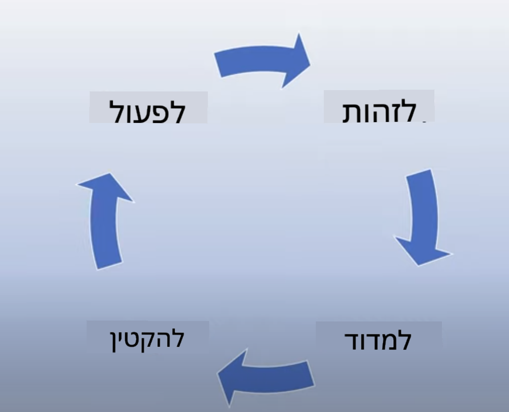
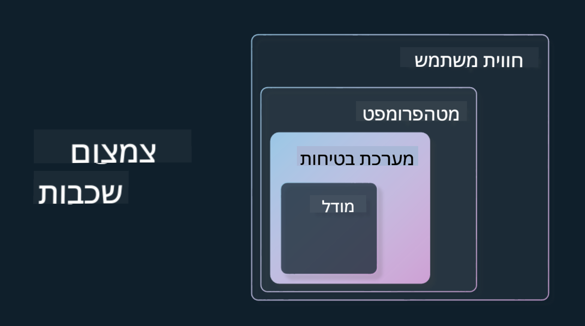

<!--
CO_OP_TRANSLATOR_METADATA:
{
  "original_hash": "13084c6321a2092841b9a081b29497ba",
  "translation_date": "2025-06-25T11:27:29+00:00",
  "source_file": "03-using-generative-ai-responsibly/README.md",
  "language_code": "he"
}
-->
# שימוש באינטליגנציה מלאכותית גנרטיבית באחריות

> _לחץ על התמונה למעלה כדי לצפות בווידאו של השיעור הזה_

קל להתפעל מאינטליגנציה מלאכותית ובמיוחד מאינטליגנציה מלאכותית גנרטיבית, אבל חשוב לשקול כיצד להשתמש בה באחריות. יש לשקול דברים כמו כיצד להבטיח שהפלט יהיה הוגן, לא מזיק ועוד. פרק זה נועד לספק לך את ההקשר שהוזכר, מה לשקול וכיצד לנקוט צעדים פעילים כדי לשפר את השימוש שלך באינטליגנציה מלאכותית.

## מבוא

שיעור זה יכסה:

- מדוע כדאי להעדיף אינטליגנציה מלאכותית אחראית בעת בניית יישומי אינטליגנציה מלאכותית גנרטיבית.
- עקרונות הליבה של אינטליגנציה מלאכותית אחראית וכיצד הם קשורים לאינטליגנציה מלאכותית גנרטיבית.
- כיצד ליישם עקרונות אינטליגנציה מלאכותית אחראית באמצעות אסטרטגיה וכלים.

## מטרות למידה

לאחר השלמת שיעור זה תדע:

- את חשיבותה של אינטליגנציה מלאכותית אחראית בעת בניית יישומי אינטליגנציה מלאכותית גנרטיבית.
- מתי לחשוב וליישם את עקרונות הליבה של אינטליגנציה מלאכותית אחראית בעת בניית יישומי אינטליגנציה מלאכותית גנרטיבית.
- אילו כלים ואסטרטגיות זמינים עבורך כדי ליישם את הרעיון של אינטליגנציה מלאכותית אחראית.

## עקרונות אינטליגנציה מלאכותית אחראית

ההתרגשות מאינטליגנציה מלאכותית גנרטיבית מעולם לא הייתה גבוהה יותר. התרגשות זו הביאה הרבה מפתחים חדשים, תשומת לב ומימון לתחום זה. בעוד שזה חיובי מאוד עבור כל מי שמחפש לבנות מוצרים וחברות באמצעות אינטליגנציה מלאכותית גנרטיבית, חשוב גם להתקדם באחריות.

במהלך הקורס הזה, אנו מתמקדים בבניית הסטארטאפ שלנו ומוצר החינוך באינטליגנציה מלאכותית שלנו. נשתמש בעקרונות של אינטליגנציה מלאכותית אחראית: הוגנות, הכללה, אמינות/בטיחות, אבטחה ופרטיות, שקיפות ואחריות. עם עקרונות אלה, נחקור כיצד הם קשורים לשימוש שלנו באינטליגנציה מלאכותית גנרטיבית במוצרים שלנו.

## מדוע כדאי להעדיף אינטליגנציה מלאכותית אחראית

כאשר בונים מוצר, גישה מרכזית לאדם תוך שמירה על טובת המשתמשים מובילה לתוצאות הטובות ביותר.

הייחודיות של אינטליגנציה מלאכותית גנרטיבית היא כוחה ליצור תשובות מועילות, מידע, הנחיות ותוכן עבור המשתמשים. ניתן לעשות זאת ללא שלבים ידניים רבים שיכולים להוביל לתוצאות מרשימות מאוד. ללא תכנון ואסטרטגיות נכונות, זה יכול גם להוביל לתוצאות מזיקות עבור המשתמשים שלך, המוצר שלך והחברה כולה.

בואו נבחן כמה (אך לא את כולם) מהתוצאות המזיקות הפוטנציאליות הללו:

### הזיות

הזיות הן מונח המתאר כאשר מודל שפה גדול (LLM) מייצר תוכן שהוא או חסר משמעות לחלוטין או משהו שאנו יודעים שהוא שגוי עובדתית על סמך מקורות מידע אחרים.

נניח לדוגמה שאנו בונים תכונה עבור הסטארטאפ שלנו שמאפשרת לתלמידים לשאול שאלות היסטוריות למודל. תלמיד שואל את השאלה `Who was the sole survivor of Titanic?`

המודל מייצר תגובה כמו זו שלמטה:

> _(מקור: [Flying bisons](https://flyingbisons.com?WT.mc_id=academic-105485-koreyst))_

זו תשובה מאוד בטוחה ומפורטת. למרבה הצער, היא שגויה. אפילו עם כמות מינימלית של מחקר, ניתן לגלות שהיו יותר מניצול אחד מאסון הטיטניק. עבור תלמיד שמתחיל לחקור נושא זה, תשובה זו יכולה להיות משכנעת מספיק כדי לא להיות מוטלת בספק ולהתייחס אליה כעובדה. ההשלכות של זה יכולות להוביל לכך שהמערכת תהיה בלתי אמינה ולהשפיע לרעה על המוניטין של הסטארטאפ שלנו.

עם כל איטרציה של כל מודל שפה גדול, ראינו שיפורי ביצועים בהקטנת הזיות. גם עם שיפור זה, אנו כמתכנני יישומים ומשתמשים עדיין צריכים להישאר מודעים למגבלות אלה.

### תוכן מזיק

כיסינו בחלק הקודם כאשר מודל שפה גדול מייצר תגובות שגויות או חסרות משמעות. סיכון נוסף שעלינו להיות מודעים אליו הוא כאשר מודל מגיב בתוכן מזיק.

תוכן מזיק יכול להיות מוגדר כ:

- מתן הוראות או עידוד לפגיעה עצמית או פגיעה בקבוצות מסוימות.
- תוכן שנאה או משפיל.
- הנחיית תכנון כל סוג של התקפה או מעשים אלימים.
- מתן הוראות כיצד למצוא תוכן לא חוקי או לבצע מעשים לא חוקיים.
- הצגת תוכן מיני מפורש.

עבור הסטארטאפ שלנו, אנו רוצים לוודא שיש לנו את הכלים והאסטרטגיות הנכונות כדי למנוע מהסוג הזה של תוכן להיראות על ידי התלמידים.

### חוסר הוגנות

הוגנות מוגדרת כ"להבטיח שמערכת אינטליגנציה מלאכותית תהיה חפה מהטיה ואפליה ושתטפל בכולם בהוגנות ושוויון." בעולם האינטליגנציה המלאכותית הגנרטיבית, אנו רוצים להבטיח שראיית עולם מודרת של קבוצות שוליים לא תתחזק על ידי הפלט של המודל.

סוגי פלט אלה אינם רק הרסניים לבניית חוויות מוצר חיוביות עבור המשתמשים שלנו, אלא גם גורמים נזק חברתי נוסף. כמתכנני יישומים, עלינו תמיד לשמור על בסיס משתמשים רחב ומגוון בעת בניית פתרונות עם אינטליגנציה מלאכותית גנרטיבית.

## כיצד להשתמש באינטליגנציה מלאכותית גנרטיבית באחריות

עכשיו, כשזיהינו את החשיבות של אינטליגנציה מלאכותית גנרטיבית אחראית, בואו נבחן 4 צעדים שנוכל לנקוט כדי לבנות את פתרונות האינטליגנציה המלאכותית שלנו באחריות:

### מדידת נזקים פוטנציאליים

בבדיקות תוכנה, אנו בודקים את הפעולות הצפויות של משתמש ביישום. באופן דומה, בדיקת סט מגוון של פקודות שמשתמשים צפויים להשתמש בהן היא דרך טובה למדוד נזק פוטנציאלי.

מכיוון שהסטארטאפ שלנו בונה מוצר חינוכי, יהיה טוב להכין רשימה של פקודות קשורות לחינוך. זה יכול להיות כדי לכסות נושא מסוים, עובדות היסטוריות, ופקודות על חיי תלמידים.

### הקלת נזקים פוטנציאליים

עכשיו הגיע הזמן למצוא דרכים שבהן נוכל למנוע או להגביל את הנזק הפוטנציאלי הנגרם על ידי המודל ותגובותיו. ניתן להסתכל על כך ב-4 שכבות שונות:

- **מודל**. בחירת המודל הנכון למקרה השימוש הנכון. מודלים גדולים ומורכבים יותר כמו GPT-4 יכולים לגרום ליותר סיכון לתוכן מזיק כאשר הם מיושמים על מקרים קטנים וממוקדים יותר. שימוש בנתוני האימון שלך לכיוונון עדין גם מפחית את הסיכון לתוכן מזיק.

- **מערכת בטיחות**. מערכת בטיחות היא סט של כלים וקונפיגורציות על הפלטפורמה המשרתת את המודל שעוזרים להקל על נזק. דוגמה לכך היא מערכת סינון תוכן על שירות Azure OpenAI. מערכות צריכות גם לזהות התקפות פריצה ופעילות לא רצויה כמו בקשות מבוטים.

- **מטה-פרומפט**. מטה-פרומפטים והקרקעה הם דרכים שבהן אנו יכולים לכוון או להגביל את המודל על סמך התנהגויות ומידע מסוימים. זה יכול להיות שימוש בקלטים מערכתיים כדי להגדיר מגבלות מסוימות של המודל. בנוסף, מתן פלטים הרלוונטיים יותר לתחום או לתחום המערכת.

זה יכול להיות גם שימוש בטכניקות כמו יצירת מידע מועשרת (RAG) כדי לגרום למודל למשוך מידע רק ממקורות אמינים נבחרים. יש שיעור מאוחר יותר בקורס זה על [בניית יישומי חיפוש](../08-building-search-applications/README.md?WT.mc_id=academic-105485-koreyst)

- **חווית משתמש**. השכבה הסופית היא המקום שבו המשתמש מתקשר ישירות עם המודל דרך הממשק של היישום שלנו בדרך כלשהי. בדרך זו אנו יכולים לעצב את ה-UI/UX כדי להגביל את המשתמש בסוגי הקלטים שהוא יכול לשלוח למודל כמו גם טקסט או תמונות המוצגים למשתמש. בעת פריסת יישום האינטליגנציה המלאכותית, עלינו גם להיות שקופים לגבי מה יישום האינטליגנציה המלאכותית הגנרטיבית שלנו יכול ולא יכול לעשות.

יש לנו שיעור שלם המוקדש ל[עיצוב חווית משתמש ליישומי אינטליגנציה מלאכותית](../12-designing-ux-for-ai-applications/README.md?WT.mc_id=academic-105485-koreyst)

- **הערכת המודל**. עבודה עם מודלים של שפה גדולה יכולה להיות מאתגרת מכיוון שאין לנו תמיד שליטה על הנתונים שהמודל אומן עליהם. בכל מקרה, עלינו תמיד להעריך את ביצועי המודל והפלטים. חשוב עדיין למדוד את הדיוק, הדמיון, הקרקעה והרלוונטיות של הפלט. זה עוזר לספק שקיפות ואמון לבעלי העניין והמשתמשים.

### הפעלת פתרון אינטליגנציה מלאכותית גנרטיבית אחראי

בניית נוהל תפעולי סביב יישומי האינטליגנציה המלאכותית שלך היא השלב הסופי. זה כולל שיתוף פעולה עם חלקים אחרים של הסטארטאפ שלנו כמו משפטי ואבטחה כדי להבטיח שאנו עומדים בכל המדיניות הרגולטורית. לפני השקה, אנו גם רוצים לבנות תוכניות סביב משלוח, טיפול בתקריות והחזרה לאחור כדי למנוע כל נזק למשתמשים שלנו מהצמיחה.

## כלים

בעוד שעבודת פיתוח פתרונות אינטליגנציה מלאכותית אחראית עשויה להיראות רבה, זו עבודה ששווה את המאמץ. ככל שתחום האינטליגנציה המלאכותית הגנרטיבית גדל, יותר כלים שיסייעו למפתחים לשלב אחריות ביעילות בתהליכי העבודה שלהם יתבגרו. לדוגמה, [Azure AI Content Safety](https://learn.microsoft.com/azure/ai-services/content-safety/overview?WT.mc_id=academic-105485-koreyst) יכול לעזור לזהות תוכן ותמונות מזיקים באמצעות בקשת API.

## בדיקת ידע

מהם כמה דברים שעליך לדאוג להם כדי להבטיח שימוש אחראי באינטליגנציה מלאכותית?

1. שהתשובה נכונה.
1. שימוש מזיק, שהאינטליגנציה המלאכותית לא תשתמש למטרות פליליות.
1. להבטיח שהאינטליגנציה המלאכותית תהיה חפה מהטיה ואפליה.

תשובה: 2 ו-3 נכונים. אינטליגנציה מלאכותית אחראית עוזרת לך לשקול כיצד להקל על השפעות מזיקות והטיות ועוד.

## 🚀 אתגר

קרא על [Azure AI Content Safety](https://learn.microsoft.com/azure/ai-services/content-safety/overview?WT.mc_id=academic-105485-koreyst) וראה מה תוכל לאמץ לשימושך.

## עבודה נהדרת, המשך ללמוד

לאחר השלמת שיעור זה, בדוק את [אוסף הלמידה של אינטליגנציה מלאכותית גנרטיבית](https://aka.ms/genai-collection?WT.mc_id=academic-105485-koreyst) שלנו כדי להמשיך לשדרג את הידע שלך באינטליגנציה מלאכותית גנרטיבית!

עבור לשיעור 4 שבו נבחן את [עקרונות ההנדסה של פרומפטים](../04-prompt-engineering-fundamentals/README.md?WT.mc_id=academic-105485-koreyst)!

**כתב ויתור**:  
מסמך זה תורגם באמצעות שירות תרגום AI [Co-op Translator](https://github.com/Azure/co-op-translator). למרות שאנו שואפים לדיוק, אנא היו מודעים לכך שתרגומים אוטומטיים עשויים להכיל שגיאות או אי דיוקים. המסמך המקורי בשפתו המקורית צריך להיחשב כמקור סמכותי. עבור מידע קריטי, מומלץ תרגום מקצועי אנושי. איננו אחראים לכל אי הבנות או פירושים שגויים הנובעים מהשימוש בתרגום זה.