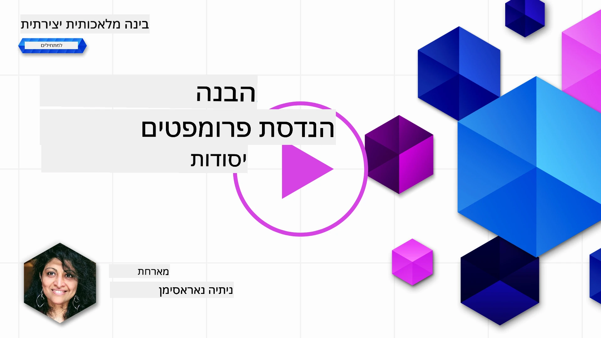
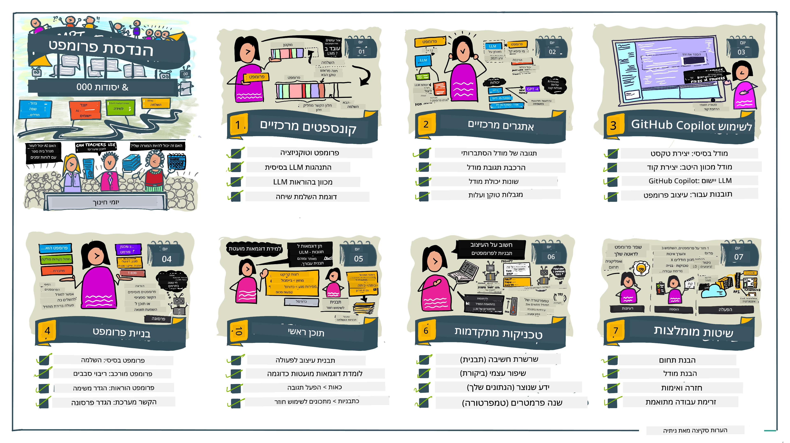
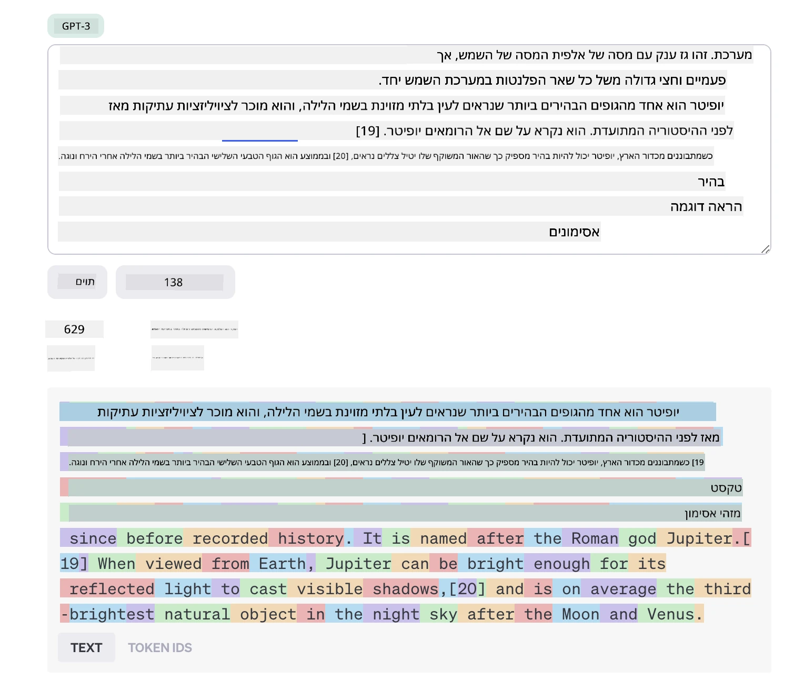
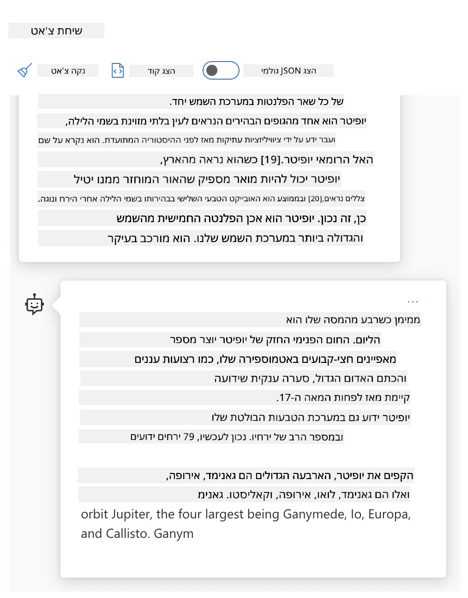
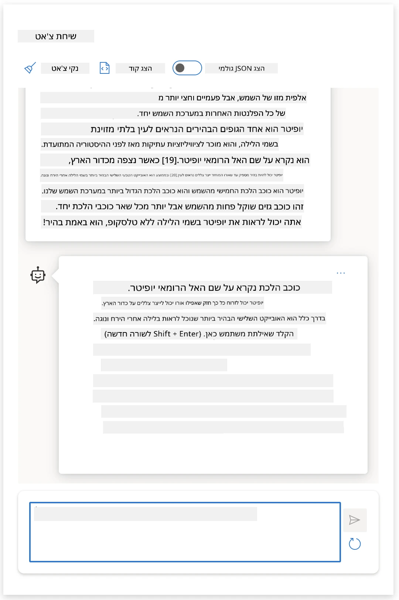
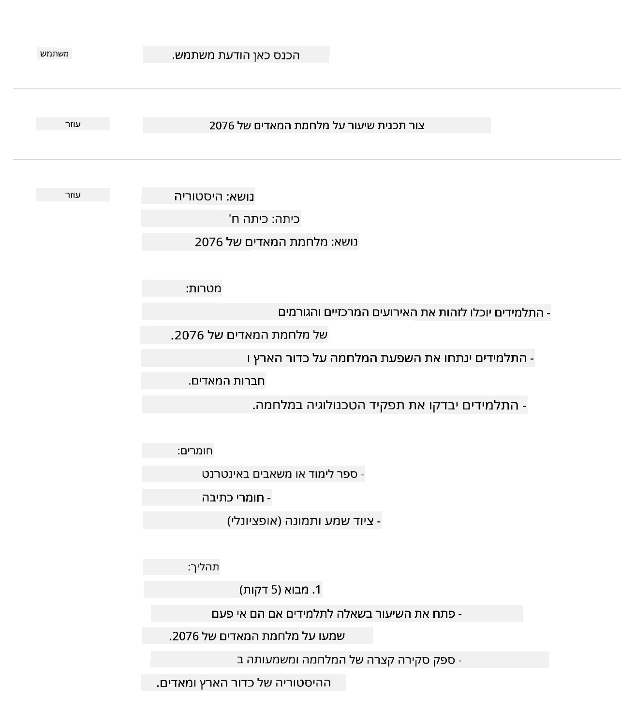
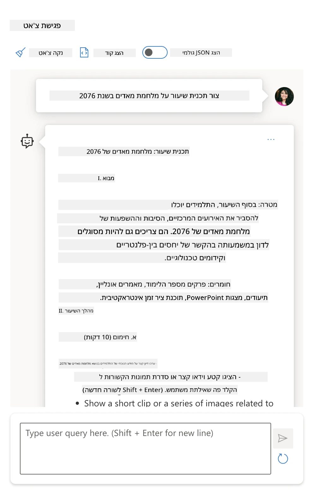

# יסודות הנדסת הפקודות

[](https://youtu.be/GElCu2kUlRs?si=qrXsBvXnCW12epb8)

## הקדמה
מודול זה מכסה מושגים וטכניקות חיוניות ליצירת פקודות יעילות במודלים גנרטיביים של בינה מלאכותית. האופן שבו אתם כותבים את הפקודה ל-LLM חשוב גם הוא. פקודה שנכתבה בקפידה יכולה להשיג איכות תגובה טובה יותר. אבל מה בדיוק משמעות המונחים _פקודה_ ו-הנדסת פקודות_? וכיצד אשפר את _קלט הפקודה_ שאני שולח ל-LLM? אלה הן השאלות שננסה לענות להן בפרק זה ובפרקים הבאים.

_בינה מלאכותית גנרטיבית_ מסוגלת ליצור תוכן חדש (לדוגמה, טקסט, תמונות, אודיו, קוד וכו') בתגובה לבקשות משתמש. היא עושה זאת באמצעות _מודלים לשוניים גדולים_ כמו סדרת GPT של OpenAI ("טרנספורמר מאומן מראש גנרטיבי") שמאמנים אותם לשימוש בשפה טבעית ובקוד.

כעת משתמשים יכולים לתקשר עם המודלים הללו באמצעות פרדיגמות מוכרות כמו שיחה, ללא צורך בידע טכני או אימון. המודלים הם _מבוססי פקודות_ – המשתמשים שולחים קלט טקסטואלי (פקודה) ומקבלים חזרה את תגובת הבינה המלאכותית (השלמה). ניתן להמשיך "לשוחח עם הבינה המלאכותית" במחזורים מרובים, ולחדד את הפקודה עד שהתשובה תואמת את הציפיות.

"הפקודות" הופכות מעתה לממשק התכנותי העיקרי של אפליקציות בינה מלאכותית גנרטיבית, המספר למודלים מה לעשות ומשפיע על איכות התגובות המוחזרות. "הנדסת פקודות" הוא תחום מחקר מתפתח במהירות המתמקד ב-_עיצוב ואופטימיזציה_ של פקודות כדי לספק תגובות עקביות ואיכותיות בקנה מידה.

## יעדי הלמידה

בשיעור זה נלמד מהי הנדסת פקודות, מדוע היא חשובה, וכיצד ניתן ליצור פקודות יעילות יותר עבור מודל מסוים ומטרת יישום. נבין מושגים מרכזיים ושיטות עבודה מומלצות בהנדסת פקודות – ונלמד על סביבת "מגרש משחקים" אינטראקטיבית ב-Jupyter Notebooks שבה נוכל לראות את המושגים מיושמים בדוגמאות אמיתיות.

בסיום שיעור זה נוכל:

1. להסביר מהי הנדסת פקודות ולמה היא חשובה.
2. לתאר את רכיבי הפקודה וכיצד משתמשים בהם.
3. ללמוד שיטות עבודה מומלצות וטכניקות להנדסת פקודות.
4. ליישם את הטכניקות הנלמדות בדוגמאות אמיתיות, תוך שימוש ב-EndPoint של OpenAI.

## מונחים מרכזיים

הנדסת פקודות: העיסוק בתכנון ושכלול הקלטים להכוונת מודלי AI ליצירת פלט רצוי.  
טוקניזציה: התהליך של המרת טקסט ליחידות קטנות יותר, הנקראות טוקנים, שהמודל יכול להבין ולעבד.  
LLMs ממוקדי הוראות: מודלים לשוניים גדולים (LLMs) שעברו כוונון עדין באמצעות הוראות ספציפיות לשיפור דיוק ורלוונטיות התגובה.

## סביבת מגרש משחקים ללמידה

הנדסת פקודות היא כיום יותר אומנות מאשר מדע. הדרך הטובה ביותר לשפר את האינטואיציה שלנו בעניין היא _להתאמן יותר_ ולאמץ גישת ניסוי וטעייה המשולבת במומחיות בתחום היישום עם טכניקות מומלצות ואופטימיזציות למודל הספציפי.

מחברת ה-Jupyter הנלווית לשיעור זה מספקת סביבת _מגרש משחקים_ שבה תוכלו להתנסות במה שלמדתם – ככל שתתקדמו או כחלק מאתגר הקוד בסוף. כדי להפעיל את התרגילים, תזדקקו ל:

1. **מפתח API של Azure OpenAI** - נקודת קצה לשירות עבור מודל LLM בפריסה.  
2. **סביבת הרצה של Python** - בה ניתן להריץ את המחברת.  
3. **משתני סביבה מקומיים** - _סיימו את שלבי ה-[SETUP](./../00-course-setup/02-setup-local.md?WT.mc_id=academic-105485-koreyst) כעת כדי להתכונן_.

המחברת מגיעה עם תרגילים _התחלתיים_ - אבל מומלץ להוסיף את ה-_Markdown_ שלכם (תיאור) ואת חלקי ה-_Code_ (בקשות פקודה) כדי לנסות דוגמאות או רעיונות נוספים - ולבנות את האינטואיציה שלכם לעיצוב פקודות.

## מדריך ממוחשב

רוצים לקבל תמונה רחבה של מה שהשיעור הזה מכסה לפני שאתם צוללים? צפו במדריך הממוחשב הזה, שמעניק לכם מושג על הנושאים המרכזיים והנקודות החשובות למחשבה בכל אחד מהם. מפת הדרכים של השיעור מובילה אתכם מהבנת המושגים והאתגרים המרכזיים לטיפול בהם באמצעות טכניקות הנדסת פקודות רלוונטיות ושיטות עבודה מומלצות. שימו לב שפרק "טכניקות מתקדמות" במדריך זה מתייחס לתוכן המכוסה בפרק _הבא_ בתכנית הלימודים הזו.



## הסטארטאפ שלנו

עכשיו נדבר על איך _הנושא הזה_ קשור למשימת הסטארטאפ שלנו בנושא [להביא חדשנות בינה מלאכותית לחינוך](https://educationblog.microsoft.com/2023/06/collaborating-to-bring-ai-innovation-to-education?WT.mc_id=academic-105485-koreyst). אנו רוצים לבנות יישומים מבוססי AI ללמידה מותאמת אישית - אז בואו נבחן איך משתמשים שונים ביישום שלנו עשויים "לעצב" פקודות:

- **מנהלנים** עשויים לבקש מה-AI _לנתח נתוני תוכנית לימודים כדי לזהות פערים בכיסוי_. ה-AI יכול לסכם תוצאות או להמחיש אותן עם קוד.  
- **מחנכים** עשויים לבקש מה-AI _ליצור תכנית שיעור לקהל יעד ונושא מסוימים_. ה-AI יכול לבנות את התכנית המותאמת בפורמט מוגדר.  
- **תלמידים** עשויים לבקש מה-AI _להדריך אותם בנושא קשה_. ה-AI יכול כעת להנחות תלמידים עם שיעורים, רמזים ודוגמאות המתאימות לרמתם.

וזה רק קצה הקרחון. בדקו את [Prompts For Education](https://github.com/microsoft/prompts-for-edu/tree/main?WT.mc_id=academic-105485-koreyst) - ספריית פקודות קוד פתוח שערכו מומחי חינוך - כדי לקבל מושג רחב יותר על האפשרויות! _נסו להריץ כמה מהפקודות האלה במגרש המשחקים או ב-OpenAI Playground כדי לראות מה קורה!_

<!--
תבנית שיעור:
היחידה הזו אמורה לכסות את המושג המרכזי #1.
לחזק את המושג עם דוגמאות והפניות.

מושג #1:
הנדסת פקודות.
להגדיר ולהסביר מדוע היא נדרשת.
-->

## מהי הנדסת פקודות?

התחלנו שיעור זה בהגדרת **הנדסת פקודות** כתהליך של _תכנון ואופטימיזציה_ של קלטי טקסט (פקודות) כדי לספק השלמות עקביות ואיכותיות למטרה ויישום נתונים ולהתאמה למודל. ניתן לחשוב על כך כתהליך שני שלבים:

- _תכנון_ הפקודה הראשונית עבור מודל ומטרה נתונים  
- _שכלול_ הפקודה באופן איטרטיבי כדי לשפר את איכות התגובה

מדובר בהכרח בתהליך ניסוי וטעייה שדורש אינטואיציה ומאמץ משתמש כדי לקבל תוצאות אופטימליות. אז למה זה חשוב? כדי לענות על שאלה זו, ראשית עלינו להבין שלוש מושגים:

- _טוקניזציה_ = כיצד המודל "רואה" את הפקודה  
- _מודלים בסיסיים LLM_ = כיצד המודל הבסיסי "מעבד" פקודה  
- _מודלים ממוקדי הוראות LLM_ = כיצד המודל יכול כעת לזהות "משימות"

### טוקניזציה

מודל LLM רואה פקודות כ_רצף של טוקנים_ כאשר מודלים שונים (או גרסאות שונות של מודל) יכולים לטוקנז את אותה הפקודה בדרכים שונות. מאחר ש-LLMs מאומנים על טוקנים (ולא על טקסט גולמי), אופן הטוקניזציה של הפקודות משפיע ישירות על איכות התגובה המיוצרת.

כדי לקבל אינטואיציה כיצד עובדת הטוקניזציה, נסו כלים כמו [OpenAI Tokenizer](https://platform.openai.com/tokenizer?WT.mc_id=academic-105485-koreyst) המוצג למטה. העתיקו את הפקודה שלכם - וראו כיצד היא מומרת לטוקנים, תוך תשומת לב לאופן שבו מטופלים תווי רווח וסימני פיסוק. שימו לב שהדוגמה מציגה LLM ישן יותר (GPT-3) - אז ניסיון עם מודל חדש יותר עשוי להניב תוצאה שונה.



### מושג: מודלים בסיסיים

לאחר טוקניזציה של הפקודה, הפעולה העיקרית של ["מודל בסיסי LLM"](https://blog.gopenai.com/an-introduction-to-base-and-instruction-tuned-large-language-models-8de102c785a6?WT.mc_id=academic-105485-koreyst) (או מודל הבסיס) היא לחזות את הטוקן הבא ברצף. מכיוון שבניו למידה מיומנים על מערכי נתוני טקסט עצומים, יש להם הבנה טובה של היחסים הסטטיסטיים בין הטוקנים ויכולים לבצע את התחזית באמינות מסוימת. שימו לב שהם לא מבינים את _משמעות_ המילים בפקודה או בטוקן; הם רואים רק דפוס שיכולים "להשלים" עם התחזית הבאה שלהם. הם יכולים להמשיך לנבא את רצף הטוקנים עד שמופעלת הפסקה על ידי המשתמש או תנאי שנקבע מראש.

רוצים לראות כיצד השלמה מבוססת פקודות עובדת? הזינו את הפקודה הנ"ל ב-Azure OpenAI Studio [_Chat Playground_](https://oai.azure.com/playground?WT.mc_id=academic-105485-koreyst) עם הגדרות ברירת המחדל. המערכת מוגדרת לטפל בפקודות כבקשות מידע – כך שתראו השלמה העונה להקשר זה.

אבל מה אם המשתמש רצה לראות משהו ספציפי העונה לקריטריונים או למטרת משימה? כאן נכנסים לתמונה ה-LLMs ה-_המכוונים על פי הוראות_.



### מושג: מודלים ממוקדי הוראות

[מודל לוּמדי (Instruction Tuned) LLM](https://blog.gopenai.com/an-introduction-to-base-and-instruction-tuned-large-language-models-8de102c785a6?WT.mc_id=academic-105485-koreyst) מתחיל עם המודל הבסיסי ומכוון אותו בעדינות באמצעות דוגמאות או זוגות קלט/פלט (למשל, "הודעות" רב-מחזוריות) שיכולים לכלול הוראות ברורות – והתגובה של ה-AI מנסה לעקוב אחר ההוראה.

טכניקות אלה כוללות למידה עם חיזוק המשוב האנושי (RLHF) שיכולות לאמן את המודל _לעקוב אחרי הוראות_ ו-_ללמוד ממשוב_ כדי לייצר תגובות המתאימות יותר ליישומים מעשיים ורלוונטיות יותר למטרות המשתמש.

בואו ננסה זאת – חזרו לפקודה שלעיל, אך עכשיו שנו את _הודעת המערכת_ כדי לספק את ההוראה הבאה כהקשר:

> _סכם תוכן שניתן לך לתלמיד בכיתה ב'. שמור את התוצאה לפסקה אחת עם 3-5 נקודות בולטות._

רואים כיצד התוצאה כעת מכוונת להראות את המטרה והפורמט הרצויים? מחנך יכול כעת להשתמש ישירות בתגובה הזו במצגות עבור הכיתה.



## מדוע אנו צריכים הנדסת פקודות?

כעת כשאנחנו יודעים כיצד המודלים מעבדים פקודות, בואו נדבר על _מדוע_ אנו זקוקים להנדסת פקודות. התשובה נעוצה בעובדה שמודלים LLM עכשוויים מציבים מספר אתגרים שהופכים את השגת _השלמות אמינות ועקביות_ לקשה יותר ללא השקעת מאמץ בבניית הפקודה ואופטימיזציה שלה. לדוגמה:

1. **תגובות המודל הינן מקריות.** _אותה פקודה_ צפויה לייצר תגובות שונות במודלים שונים או בגרסאות שונות של אותו מודל. ואף עלולה להניב תוצאות שונות באותו מודל בזמנים שונים. _טכניקות הנדסת פקודות יכולות לסייע להקטין שינויים אלו על ידי מתן גבולות טובים יותר_.

1. **מודלים עשויים להמציא תגובות.** מודלים מאומנים עם _מערכי נתונים גדולים אך סופיים_, כלומר חסרים ידע לגבי מושגים מחוץ לטווח האימון. כתוצאה מכך, הם עלולים לייצר השלמות שאינן מדויקות, דמיוניות או סותרות באופן ישיר עובדות ידועות. _טכניקות הנדסת פקודות מסייעות למשתמשים לזהות ולהפחית המצאות כאלו, למשל על ידי בקשת ציטוטים או היגיון מה-AI_.

1. **יכולות המודל משתנות.** דורות או דגמים חדשים מציעים יכולות עשירות יותר אך מביאים גם תכונות ייחודיות ואיזונים שונים בעלויות ומורכבות. _הנדסת פקודות מסייעת לפתח שיטות עבודה וזרימות עבודה המסתרות הבדלים ומסתגלות לדרישות ספציפיות למודל בצורה נרחבת וחלקה_.

בואו נראה זאת בפעולה ב-OpenAI או ב-Azure OpenAI Playground:

- השתמשו באותה הפקודה בפריסות LLM שונות (למשל, OpenAI, Azure OpenAI, Hugging Face) – האם ראיתם שינויים?  
- השתמשו באותה הפקודה שוב ושוב באותה פריסת LLM (למשל, Azure OpenAI Playground) – כיצד שונות תגובות אלו?

### דוגמה להמצאות

בקורס זה, אנו משתמשים במונח **"המצאה"** להתייחס לתופעה שבה לעיתים מודלים LLM מייצרים מידע שאינו מדויק בשל מגבלות באימון או אילוצים אחרים. ייתכן שגם שמעתם מונחים כמו _"הלוצינציות"_ במאמרים פופולריים או במאמרים מחקריים. עם זאת, אנו ממליצים בחום להשתמש במונח _"המצאה"_ כדי לא לאנשה את ההתנהגות על ידי ייחוס תכונה אנושית לתוצאה שמונעת על ידי מכונה. זאת גם מחזקת את [ההנחיות לבינה מלאכותית אחראית](https://www.microsoft.com/ai/responsible-ai?WT.mc_id=academic-105485-koreyst) מבחינת מונחים, ומסירה מונחים שעשויים להיחשב לפוגעניים או לא כלוליים בהקשרים מסוימים.

רוצים לקבל הבנה כיצד פועלות המצאות? חשבו על פקודה שמבקשת מה-AI ליצור תוכן בנושא שאינו קיים (כדי להבטיח שהוא לא נמצא במערך האימון). לדוגמה – ניסיתי את הפקודה:

> **פקודה:** צור תכנית שיעור על מלחמת מאדים של 2076.
חיפוש באינטרנט הראה לי שהיו תיאורים בדיוניים (למשל, סדרות טלוויזיה או ספרים) על מלחמות במארס – אך אף אחד בשנת 2076. היגיון פשוט גם אומר ש־2076 הוא _בעתיד_ ולכן, לא יכול להיות קשור לאירוע אמיתי.

אז מה קורה כשמריצים את ההנחיה הזו עם ספקי LLM שונים?

> **תשובה 1**: OpenAI Playground (GPT-35)



> **תשובה 2**: Azure OpenAI Playground (GPT-35)



> **תשובה 3**: : Hugging Face Chat Playground (LLama-2)


כמצופה, כל מודל (או גרסת מודל) מפיק תגובות מעט שונות הודות להתנהגות סטוכסטית ולהבדלים ביכולות המודל. לדוגמה, מודל אחד פונה לקהל בכיתה ח' בעוד השני מניח סטודנט תיכון. אבל שלושת המודלים כן יצרו תגובות שיכולות לשכנע משתמש בלתי מיודע שהאירוע אמיתי.

טכניקות הנדסת פרומפט כמו _מטאפראמפטינג_ ו_קונפיגורציית טמפרטורה_ עשויות לצמצם במידה מסוימת את יצירת ההמצאות של המודל. ארכיטקטורות הנדסת פרומפט חדשות גם משלבות כלים וטכניקות באופן חלק בתוך זרם הפרומפט, כדי למתן או לצמצם חלק מההשפעות האלה.

## מחקר מקרה: GitHub Copilot

נסכם את הסעיף הזה בהבנת איך נעשה שימוש בהנדסת פרומפט בפתרונות מהעולם האמיתי באמצעות מחקר מקרה: [GitHub Copilot](https://github.com/features/copilot?WT.mc_id=academic-105485-koreyst).

GitHub Copilot הוא "מתכנת זוג AI" שלך - הוא ממיר פרומפטים טקסטואליים להשלים קוד ומשולב בסביבת הפיתוח שלך (למשל Visual Studio Code) לחוויית משתמש זורמת. כפי שמתועד בשרשרת הבלוגים למטה, הגרסה המוקדמת התבססה על מודל OpenAI Codex - מהנדסים הבינו מהר שצריך לכוונן את המודל ולפתח טכניקות הנדסת פרומפט טובות יותר, כדי לשפר את איכות הקוד. ביולי הם [חשפו מודל AI משופר שמתקדם מעבר לקודקס](https://github.blog/2023-07-28-smarter-more-efficient-coding-github-copilot-goes-beyond-codex-with-improved-ai-model/?WT.mc_id=academic-105485-koreyst) עבור הצעות מהירות עוד יותר.

קראו את הפוסטים לפי סדר כדי לעקוב אחר מסע הלמידה שלהם.

- **מאי 2023** | [GitHub Copilot משתפר בהבנת הקוד שלך](https://github.blog/2023-05-17-how-github-copilot-is-getting-better-at-understanding-your-code/?WT.mc_id=academic-105485-koreyst)
- **מאי 2023** | [מבפנים ב-GitHub: עבודה עם ה-LLM מאחורי GitHub Copilot](https://github.blog/2023-05-17-inside-github-working-with-the-llms-behind-github-copilot/?WT.mc_id=academic-105485-koreyst).
- **יוני 2023** | [איך לכתוב פרומפטים טובים יותר ל-GitHub Copilot](https://github.blog/2023-06-20-how-to-write-better-prompts-for-github-copilot/?WT.mc_id=academic-105485-koreyst).
- **יולי 2023** | [.. GitHub Copilot מתקדם מעבר לקודקס עם מודל AI משופר](https://github.blog/2023-07-28-smarter-more-efficient-coding-github-copilot-goes-beyond-codex-with-improved-ai-model/?WT.mc_id=academic-105485-koreyst)
- **יולי 2023** | [המדריך של מפתח להנדסת פרומפט ו-LLM](https://github.blog/2023-07-17-prompt-engineering-guide-generative-ai-llms/?WT.mc_id=academic-105485-koreyst)
- **ספטמבר 2023** | [איך לבנות אפליקציית LLM ארגונית: לקחים מ-GitHub Copilot](https://github.blog/2023-09-06-how-to-build-an-enterprise-llm-application-lessons-from-github-copilot/?WT.mc_id=academic-105485-koreyst)

אתם יכולים גם לגלוש בבלוג ההנדסה שלהם [כאן](https://github.blog/category/engineering/?WT.mc_id=academic-105485-koreyst) עבור פוסטים נוספים כמו [זה](https://github.blog/2023-09-27-how-i-used-github-copilot-chat-to-build-a-reactjs-gallery-prototype/?WT.mc_id=academic-105485-koreyst) שמדגים איך הטכניקות והמודלים האלה _מופעלים_ ליישומים בעולם האמיתי.

---

<!--
LESSON TEMPLATE:
This unit should cover core concept #2.
Reinforce the concept with examples and references.

CONCEPT #2:
Prompt Design.
Illustrated with examples.
-->

## בניית פרומפט

ראינו מדוע הנדסת פרומפט חשובה – עכשיו נבין איך פרומפטים _בנויים_ כדי שנוכל להעריך טכניקות שונות לעיצוב פרומפטים יעיל יותר.

### פרומפט בסיסי

נתחיל עם הפרומפט הבסיסי: קלט טקסט שנשלח אל המודל ללא הקשר אחר. הנה דוגמה – כשאנחנו שולחים את המילים הראשונות של ההמנון הלאומי של ארה"ב ל־OpenAI [Completion API](https://platform.openai.com/docs/api-reference/completions?WT.mc_id=academic-105485-koreyst) הוא מיד _משלים_ את התגובה עם השורות הבאות, ומדגים את התנהגות החיזוי הבסיסית.

| פרומפט (קלט)      | השלמה (פלט)                                                                                                                             |
| :----------------- | :----------------------------------------------------------------------------------------------------------------------------------------- |
| Oh say can you see | זה נשמע שאתה מתחיל את מילות השיר "The Star-Spangled Banner," ההמנון הלאומי של ארה"ב. המילים המלאות הן ...                              |

### פרומפט מורכב

עכשיו נוסיף הקשר והוראות לאותו פרומפט בסיסי. ה־[Chat Completion API](https://learn.microsoft.com/azure/ai-services/openai/how-to/chatgpt?WT.mc_id=academic-105485-koreyst) מאפשר לנו לבנות פרומפט מורכב כאוסף של _הודעות_ הכוללות:

- זוגות קלט/פלט המשקפים קלט _משתמש_ ותגובה של _עוזר_.
- הודעת מערכת שמגדירה את ההקשר להתנהגות או אישיות העוזר.

הבקשה כעת היא בצורתה הבאה, שבה ה־_טוקניזציה_ מפיקה ביעילות את המידע הרלוונטי מההקשר ומהשיח. שינוי ההקשר במערכת יכול להיות משמעותי לא פחות באיכות ההשלמות, מהקלט שנתן המשתמש.

```python
response = openai.chat.completions.create(
    model="gpt-3.5-turbo",
    messages=[
        {"role": "system", "content": "You are a helpful assistant."},
        {"role": "user", "content": "Who won the world series in 2020?"},
        {"role": "assistant", "content": "The Los Angeles Dodgers won the World Series in 2020."},
        {"role": "user", "content": "Where was it played?"}
    ]
)
```

### פרומפט הוראות

בדוגמאות לעיל, פרומפט המשתמש היה שאילתה טקסט פשוטה שניתן לפרש אותה כבקשת מידע. עם פרומפטים מסוג _הוראות_ אנחנו משתמשים בטקסט כדי לציין פעולה בפירוט רב יותר, ולספק הנחיה טובה יותר ל-AI. הנה דוגמה:

| פרומפט (קלט)                                                                                                                                                                                                                         | השלמה (פלט)                                                                                                        | סוג הוראות         |
| :------------------------------------------------------------------------------------------------------------------------------------------------------------------------------------------------------------------------------------- | :----------------------------------------------------------------------------------------------------------------- | :------------------ |
| כתוב תיאור של מלחמת האזרחים                                                                                                                                                                                                         | _החזיר פסקה פשוטה_                                                                                                | פשוט               |
| כתוב תיאור של מלחמת האזרחים. ספק תאריכים ואירועים עיקריים ותאר את משמעותם                                                                                                                                                            | _החזיר פסקה ואחריה רשימת תאריכי אירועים מרכזיים ותיאורים_                                                       | מורכב               |
| כתוב תיאור של מלחמת האזרחים בפסקה אחת. ספק 3 נקודות עם תאריכים מרכזיים ומשמעותם. ספק 3 נקודות נוספות עם דמויות היסטוריות חשובות ותפקידן. החזר את הפלט כקובץ JSON                           | _מחזיר פרטים נרחבים יותר בתוך תיבת טקסט, מעוצבים כ־JSON שניתן להעתיק ולהדביק לקובץ ולוודא לפי הצורך_               | מורכב. מעוצב.        |

## תוכן ראשוני

בדוגמאות שלמעלה, הפרומפט היה פתוח למדי, מה שאיפשר ל־LLM להחליט איזו חלק מהקבוצה הממוחשבת שהיו לו רלוונטית. עם תבנית עיצוב ה_תוכן הראשוני_, הטקסט שמוזן מתחלק לשני חלקים:

- הוראה (פעולה)
- תוכן רלוונטי (שמשפיע על הפעולה)

הנה דוגמה שבה ההוראה היא "סכם את זה בשתי משפטים".

| פרומפט (קלט)                                                                                                                                                                                                                                                                                                                                                                                                                                                                                                                                                                                                                                                                                      | השלמה (פלט)                                                                                                                                                                                                                                                                             |
| :-------------------------------------------------------------------------------------------------------------------------------------------------------------------------------------------------------------------------------------------------------------------------------------------------------------------------------------------------------------------------------------------------------------------------------------------------------------------------------------------------------------------------------------------------------------------------------------------------------------------------------------------------------------------------------------------------- | :---------------------------------------------------------------------------------------------------------------------------------------------------------------------------------------------------------------------------------------------------------------------------------------------- |
| יופיטר הוא כוכב הלכת החמישי מהשמש והגדול ביותר במערכת השמש. זהו ענק גז עם מסה שהיא אלףית של מסה של השמש, אך פי שניים וחצי מכל שאר כוכבי הלכת במערכת השמש ביחד. יופיטר הוא אחד הדברים הבהירים הנראים לעין בלתי מזוינת בשמי הלילה, וידוע לציוויליזציות עתיקות מאז לפני ההיסטוריה המתועדת. הוא נקרא על שם האל הרומי יופיטר.[19] כשמביטים אליו מהארץ, יופיטר יכול להיות מבריק מספיק שהאור המשוקף ממנו ייצור צללים נראים,[20] ובדרך כלל הוא האובייקט הטבעי השלישי בבהירותו בשמי הלילה אחרי הירח ונוגה. <br/> **סכם זאת ב-2 משפטים קצרים** | יופיטר, כוכב הלכת החמישי מהשמש, הוא הגדול ביותר במערכת השמש וידוע כאחד מהגופים הבהירים ביותר בשמי הלילה. נקרא על שם האל הרומי יופיטר, הוא ענק גז שמסתו פי שניים וחצי מכל שאר כוכבי הלכת במערכת השמש ביחד. |

ניתן להשתמש בקטע התוכן הראשוני בדרכים שונות כדי להנחות הוראות יעילות יותר:

- **דוגמאות** – במקום לומר למודל מה לעשות עם הוראה מפורשת, נותנים לו דוגמאות של מה לעשות ונותנים לו להסיק את התבנית.
- **רמזים** – שומרים את ההוראה עם "רמז" שמכוון את ההשלמה, ומנחה את המודל לכיוון תגובות רלוונטיות יותר.
- **תבניות** – אלו "מתכונים" חוזרים לפרומפט עם תחליפים (משתנים) שניתן להתאים עם נתונים למקרים ספציפיים.

בואו נחקור את זה בפעולה.

### שימוש בדוגמאות

זו גישה שבה משתמשים בתוכן הראשוני כדי "לספק למודל" כמה דוגמאות של הפלט הרצוי להוראה נתונה, ונותנים למודל להסיק את התבנית לפלט הרצוי. בהתאם למספר הדוגמאות שסופקו, אפשר לעשות פרומפט זיר"שוט, יונשוט, פיושוט וכו'.

הפרומפט עכשיו מורכב משלושה מרכיבים:

- תיאור משימה
- כמה דוגמאות של הפלט הרצוי
- התחלה של דוגמה חדשה (שמתפקדת כהוראת משימה מרומזת)

| סוג למידה    | פרומפט (קלט)                                                                                                                                        | השלמה (פלט)             |
| :----------- | :--------------------------------------------------------------------------------------------------------------------------------------------------- | :----------------------- |
| זיר"שוט     | "The Sun is Shining". תרגם לספרדית                                                                                                                  | "El Sol está brillando".  |
| יונשוט      | "The Sun is Shining" => ""El Sol está brillando". <br> "It's a Cold and Windy Day" =>                                                                 | "Es un día frío y ventoso". |
| פיושוט      | השחקן רץ בבסיסים => בייסבול <br/> השחקן ביצע אס => טניס <br/> השחקן ביצע שש => קריקט <br/> השחקן קלע סלאם דאנק =>                                | כדורסל                   |
|              |                                                                                                                                                      |                          |

שימו לב שנדרש לתת הוראה מפורשת ("תרגם לספרדית") בפרומפט זיר"שוט, אבל בפרומפט יונשוט ההוראה מוסקת. הדוגמה של פיושוט מראה איך הוספת דוגמאות נוספות מאפשרת דייקנות רבה יותר ללא הוראות נוספות.

### רמזי פרומפט

טכניקה נוספת לשימוש בתוכן הראשוני היא לספק _רמזים_ במקום דוגמאות. במקרה כזה, אנחנו נותנים למודל דחיפה בכיוון הנכון באמצעות _התחלת_ קטע שמציג את פורמט התגובה הרצויה. המודל לוקח את ה"רמז" וממשיך באותו סגנון.

| מספר הרמזים | פרומפט (קלט)                                                                                                                                                                                                                                                                                                                                                                                                                                               | השלמה (פלט)                                                                                                                                                                                                                                                                                       |
| :---------- | :----------------------------------------------------------------------------------------------------------------------------------------------------------------------------------------------------------------------------------------------------------------------------------------------------------------------------------------------------------------------------------------------------------------------------------------------------------- | :------------------------------------------------------------------------------------------------------------------------------------------------------------------------------------------------------------------------------------------------------------------------------------------------ |
| 0           | יופיטר הוא כוכב הלכת החמישי מהשמש והגדול ביותר במערכת השמש. זהו ענק גז עם מסה שהיא אלףית של מסה של השמש, אך פי שניים וחצי מכל שאר כוכבי הלכת במערכת השמש ביחד. יופיטר הוא אחד הדברים הבהירים הנראים לעין בלתי מזוינת בשמי הלילה, וידוע לציוויליזציות עתיקות מאז לפני ההיסטוריה המתועדת. <br/>**סכם זאת**                                       | יופיטר הוא כוכב הלכת הגדול ביותר במערכת השמש והחמישי מהשמש. הוא ענק גז שמסתו 1/1000 של מסת השמש, אך הוא כבד יותר מכל שאר כוכבי הלכת ביחד. ציוויליזציות עתיקות מכירות את יופיטר זמן רב, והוא נראה בקלות בשמי הלילה.                                                       |
| 1              | יופיטר הוא כוכב הלכת החמישי מהשמש והגדול ביותר במערכת השמש. זהו ענק גז עם מסה של אלפית מזו של השמש, אך פי שתיים וחצי מסך כל שאר כוכבי הלכת במערכת השמש יחדיו. יופיטר הוא אחד מהגופים הבהירים ביותר הנראים לעין בלתי מזוינת בשמי הלילה, ומוכר לתרבויות הקדומות מאז טרם תיעוד ההיסטוריה. <br/>**לסכם זאת** <br/> מה שלמדנו הוא שיופיטר | הוא כוכב הלכת החמישי מהשמש והגדול ביותר במערכת השמש. זהו ענק גז עם מסה של אלפית מזו של השמש, אך פי שתיים וחצי מסך כל שאר כוכבי הלכת יחדיו. הוא נצפה בקלות בעין בלתי מזוינת ומוכר מאז העת העתיקה.                        |
| 2              | יופיטר הוא כוכב הלכת החמישי מהשמש והגדול ביותר במערכת השמש. זהו ענק גז עם מסה של אלפית מזו של השמש, אך פי שתיים וחצי מסך כל שאר כוכבי הלכת במערכת השמש יחדיו. יופיטר הוא אחד מהגופים הבהירים ביותר הנראים לעין בלתי מזוינת בשמי הלילה, ומוכר לתרבויות הקדומות מאז טרם תיעוד ההיסטוריה. <br/>**לסכם זאת** <br/> 3 עובדות מובילות שלמדנו:         | 1. יופיטר הוא כוכב הלכת החמישי מהשמש והגדול ביותר במערכת השמש. <br/> 2. זהו ענק גז עם מסה של אלפית מזו של השמש...<br/> 3. יופיטר נראה לעין בלתי מזוינת מאז העת העתיקה ...                                                                       |
|                |                                                                                                                                                                                                                                                                                                                                                                                                                                                              |                                                                                                                                                                                                                                                                                                           |

### תבניות הנחיות

תבנית הנחיה היא _מתכון מוגדר מראש להנחיה_ שניתן לשמור ולהשתמש בו לפי הצורך, כדי להניע חוויות משתמש עקביות בקנה מידה. בצורה הפשוטה ביותר היא אוסף של דוגמות הנחיה כמו [זו מאת OpenAI](https://platform.openai.com/examples?WT.mc_id=academic-105485-koreyst) שמספקת הן את רכיבי ההנחיה האינטראקטיביים (הודעות משתמש ומערכת) והן את פורמט הבקשה המונע ע"י ממשק API - לתמיכה בשימוש חוזר.

בצורה המורכבת יותר כמו [דוגמה זו מ-LangChain](https://python.langchain.com/docs/concepts/prompt_templates/?WT.mc_id=academic-105485-koreyst) היא מכילה _מקומות שמורים_ שניתן להחליף בהם נתונים ממקורות שונים (קלט משתמש, הקשר מערכת, מקורות נתונים חיצוניים וכו') כדי ליצור הנחיה דינמית. זה מאפשר לנו ליצור ספרייה של הנחיות שניתן להשתמש בהן באופן חוזר כדי להניע חוויות משתמש עקביות **בצורה תכנותית** בקנה מידה.

לבסוף, הערך האמיתי של תבניות הוא ביכולת ליצור ולפרסם _ספריות הנחיות_ לתחומי ישומים ורטיקליים - כאשר תבנית ההנחיה מותאמת כעת ליישום ספציפי או דוגמאות שמדגישות את ההקשר בצורה מדויקת יותר לקהל היעד. מאגר ה-[Prompts For Edu](https://github.com/microsoft/prompts-for-edu?WT.mc_id=academic-105485-koreyst) הוא דוגמה מצוינת לגישה זו, המתמקדת בספריית הנחיות לתחום החינוך עם דגש על יעדים מרכזיים כמו תכנון שיעורים, עיצוב תוכניות לימודים, הדרכת תלמידים ועוד.

## תוכן תומך

אם נחשוב על בניית הנחיה כמכילה הוראה (משימה) ותוכן ראשי (תוכן עיקרי), אז _תוכן משני_ הוא סוג של הקשר נוסף שאנו מספקים כדי **לשנות את התוצר בדרך כלשהי**. זה יכול להיות פרמטרי כוונון, הוראות עיצוב, טקסונומיות של נושאים וכו' שעוזרים למודל _להתאים_ את תגובתו לצרכי המשתמש או הציפיות.

לדוגמה: בהתבסס על קטלוג קורסים עם מטא-מידע נרחב (שם, תיאור, רמה, תגיות, מרצה וכו') של כל הקורסים בתוכנית הלימודים:

- ניתן להגדיר הוראה ל"לתמצת את קטלוג הקורסים לסתיו 2023"
- להשתמש בתוכן הראשי כדי לספק מספר דוגמאות לתוצאה הרצויה
- להשתמש בתוכן המשני כדי לזהות את 5 התגיות המובילות 

כעת, המודל יכול לספק סיכום בפורמט המוצג בדוגמאות - אך אם תוצאה מכילה תגיות מרובות, המודל יכול לתת עדיפות ל-5 תגיות המוזכרות בתוכן המשני.

---

<!--
תבנית שיעור:
יחידה זו תעסוק במושג ליבה מספר 1.
חזק את המושג עם דוגמאות והפניות.

מושג 3:
טכניקות הנחיית דרישה.
מה הן כמה טכניקות בסיסיות להנחיית דרישה?
תדגים זאת עם תרגילים.
-->

## שיטות עבודה מומלצות להנחיה

כעת כשאנו יודעים כיצד ניתן _לבנות_ הנחיות, נתחיל לחשוב כיצד _לעצב_ אותן כך שישקפו שיטות עבודה מומלצות. ניתן לחשוב על זה בשני חלקים - קיום _גישה נכונה_ ויישום _טכניקות מתאימות_.

### גישת הנדסת הנחיות

הנדסת הנחיות היא תהליך של ניסוי וטעייה, לכן שמור שלושה גורמים מנחים רחבים בזיכרון:

1. **הבנת התחום חשובה.** דיוק ורלוונטיות התגובה תלויים ב_תחום_ שבו האפליקציה או המשתמש פועלים. השתמש באינטואיציה ומומחיות תחומית כדי **להתאים טכניקות** במיוחד. למשל, הגדר _אישיויות תחומיות_ ספציפיות בהנחיות המערכת שלך, או השתמש ב_תבניות תחומיות_ בהנחיות המשתמש. ספק תוכן משני שמשקף הקשרים תחומיים, או השתמש ב_רמזים ודוגמאות תחומיות_ כדי לכוון את המודל לדפוסי שימוש מוכרים.

2. **הבנת המודל חשובה.** ידוע שהמודלים הם סטוכסטיים מטבעם. אך יישומי המודל יכולים להשתנות גם בהתאם לנתוני האימון בהם השתמשו (ידע מוקדם), היכולות הניתנות (למשל, דרך API או SDK) וסוג התוכן אליו הם מותאמים (קוד, תמונות, טקסט וכו'). הבן את החוזקות והמגבלות של המודל בו אתה משתמש, והשתמש בידע זה כדי _לתעדף משימות_ או לבנות _תבניות מותאמות_ שמותאמות ליכולות המודל.

3. **איטרציה ואימות חשובים.** המודלים מתפתחים במהירות, וכך גם הטכניקות להנדסת הנחיות. כמומחה תחום, ייתכן ויש לך הקשרים או קריטריונים ספציפיים לאפליקציה שלך שאינם חלים על הקהילה הרחבה. השתמש בכלים וטכניקות להנדסת הנחיות כדי "לקפוץ" להתחלת הבנייה, ואז בצע איטרציה ואימות של התוצאות עם האינטואיציה והמומחיות שלך. רשום תובנות וצרף **מאגר ידע** (כגון ספריות הנחיות) שיהיו בסיס חדש לאחרים לאיטרציות מהירות יותר בעתיד.

## שיטות עבודה מומלצות

כעת נסקור שיטות עבודה מומלצות נפוצות שמומלצות על ידי [OpenAI](https://help.openai.com/en/articles/6654000-best-practices-for-prompt-engineering-with-openai-api?WT.mc_id=academic-105485-koreyst) ו[Azure OpenAI](https://learn.microsoft.com/azure/ai-services/openai/concepts/prompt-engineering#best-practices?WT.mc_id=academic-105485-koreyst).

| מה                              | למה                                                                                                                                                                                                                                               |
| :-------------------------------- | :------------------------------------------------------------------------------------------------------------------------------------------------------------------------------------------------------------------------------------------------ |
| להעריך את המודלים העדכניים ביותר       | דורות חדשים של מודלים צפויים לכלול תכונות איכות משופרות - אך עלולים לעלות יותר. הערך את השפעתם, ואז קבל החלטות מעבר.                                                                                     |
| להפריד הוראות והקשר   | בדוק אם המודל/ספק שלך מגדיר _מפרידים_ להבדיל בין הוראות, תוכן ראשי ותוכן משני בצורה ברורה יותר. זה יכול לעזור למודלים להקצות משקל מדויק יותר לטוקנים.                                                          |
| להיות ספציפי וברור             | ספק פרטים רבים יותר על ההקשר הרצוי, התוצאה, האורך, הפורמט, הסגנון וכו'. זה ישפר גם את איכות וגם עקביות התגובות. אחזר מתכונים בתבניות שניתנות לשימוש חוזר.                                                          |
| להיות תיאורי, השתמש בדוגמאות      | מודלים עשויים להגיב טוב יותר לגישה של "הראה וספר". התחל עם גישת `zero-shot` שבה נותנים הוראה (אך ללא דוגמאות) ואז נסה `few-shot` לשיפור, תוך אספקת כמה דוגמאות לתוצאה הרצויה. השתמש באנלוגיות. |
| השתמש ברמזים כדי לזרז השלמות | עודד את המודל לכיוון התוצאה הרצויה על ידי מתן מילות פתיחה או ביטויים מובילים שיכול להשתמש בהם כנקודת התחלה לתגובה.                                                                                                               |
| חזור על ההוראות                       | לפעמים יש צורך לחזור על ההוראות למודל. ספק הוראות לפני ואחרי התוכן הראשי, השתמש גם בהוראה וגם ברמז וכו'. בצע איטרציה ואימות כדי לראות מה עובד.                                                         |
| הסדר חשוב                     | הסדר שבו מציגים מידע למודל עשוי להשפיע על התוצאה, גם בדוגמאות הלמידה, בגלל הטיה לזכירות. נסה אפשרויות שונות כדי למצוא מה מיטבי.                                                               |
| תן למודל "יציאה"           | ספק למודל תגובת השלמה _חילופית_ למקרה שאינו יכול להשלים את המשימה מסיבה כלשהי. זה יכול להפחית סיכוי ליצירת תגובות שגויות או מומצאות.                                                         |
|                                   |                                                                                                                                                                                                                                                   |

כמו בכל שיטת עבודה מומלצת, זכרו ש_הניסיון עשוי להשתנות_ תלוי במודל, במשימה ובתחום. השתמשו בזה כנקודת התחלה, בצעו איטרציה למציאת הטוב ביותר עבורכם. הערכו מחדש את תהליך הנדסת ההנחיות בהתאם למודלים וכלים חדשים העולים, במבט על קנה מידה ואיכות התגובה.

<!--
תבנית שיעור:
יחידה זו תספק אתגר קוד אם רלוונטי

אתגר:
קישור ל-Jupyter Notebook עם תגובות קוד בלבד בהוראות (אזורים ריקים של קוד).

פתרון:
קישור להעתק של ה-Notebook עם ההנחיות מלאות שרצות, המציג דוגמה אחת מצוינת.
-->

## משימה

ברכות! הגעת לסוף השיעור! הגיע הזמן לממש חלק מהמונחים והטכניקות עם דוגמאות אמיתיות!

למשימה שלנו, נשתמש ב-Jupyter Notebook עם תרגילים שניתן להשלים באופן אינטראקטיבי. ניתן גם להרחיב את ה-Notebook עם תאי Markdown ו-Code משלכם כדי לחקור רעיונות וטכניקות.

### כדי להתחיל, פצל את המאגר, ואז

- (מומלץ) הפעל GitHub Codespaces
- (אופציה נוספת) שכפל את המאגר למכשיר המקומי והשתמש בו עם Docker Desktop
- (אופציה נוספת) פתח את ה-Notebook בסביבת הריצה המועדפת עליך

### לאחר מכן, קבע את משתני הסביבה

- העתיק את הקובץ `.env.copy` משורש המאגר ל`.env` ומלא את הערכים `AZURE_OPENAI_API_KEY`, `AZURE_OPENAI_ENDPOINT` ו-`AZURE_OPENAI_DEPLOYMENT`. חזור ל[סעיף הלימוד Sandbox](../../../04-prompt-engineering-fundamentals) כדי ללמוד כיצד.

### לאחר מכן, פתח את ה-Jupyter Notebook

- בחר בליבת הריצה. אם משתמש באופציות 1 או 2, פשוט בחר בליבת Python 3.10.x המוגדרת כברירת מחדל בקונטיינר הפיתוח.

אתה מוכן להריץ את התרגילים. שים לב שאין תשובות _נכונות או לא נכונות_ כאן - רק חקר אפשרויות בניסוי וטעייה ובניית אינטואיציה לאיך עובד מודל ואפליקציה מסוימת.

_לכן אין קטעי קוד עם פתרון בשיעור זה. במקום זאת, ל-Notebook יהיו תאי Markdown שכותרתם "הפתרון שלי:" שמראים דוגמה אחת לתוצאה למען התייחסות._

 <!--
תבנית שיעור:
עטוף את הסעיף בסיכום ומשאבים ללמידה עצמאית.
-->

## בדיקת ידע

איזו מהאפשרויות הבאות היא הנחיה טובה לפי שיטות עבודה מומלצות סבירות?

1. הצג לי תמונה של רכב אדום
2. הצג לי תמונה של רכב אדום מדגם וולוו XC90 חנוי על צוק עם השמש שוקעת
3. הצג לי תמונה של רכב אדום מדגם וולוו XC90

תשובה: 2, זוהי ההנחיה הטובה ביותר כי היא מספקת פרטים על "מה" ופרטים ספציפיים (לא רק רכב כלשהו אלא מותג ודגם מסוים) וגם מתארת את ההקשר הכולל. 3 היא הבאה בטיבה כי גם מכילה תיאור רב.

## 🚀 אתגר

נסה להשתמש בטכניקת "הרמז" עם ההנחיה: השלם את המשפט "הצג לי תמונה של רכב אדום מדגם וולוו ו-". מה התגובה, ואיך תשפר את זה?

## עבודה מצוינת! המשך ללמוד

רוצה ללמוד עוד על מושגי הנדסת הנחיות שונים? עבור לעמוד ה[למידה הממושכת](https://aka.ms/genai-collection?WT.mc_id=academic-105485-koreyst) כדי למצוא משאבים מעולים נוספים בנושא.

קדימה לשיעור 5 שבו נסקור [טכניקות הנחיה מתקדמות](../05-advanced-prompts/README.md?WT.mc_id=academic-105485-koreyst)!

---

<!-- CO-OP TRANSLATOR DISCLAIMER START -->
**כתב ויתור**:
מסמך זה תורגם באמצעות שירות התרגום האוטומטי [Co-op Translator](https://github.com/Azure/co-op-translator). על אף שאנו שואפים לדיוק, יש להיות מודעים לכך שתירגומים אוטומטיים עלולים להכיל שגיאות או אי־דיוקים. המסמך המקורי בשפתו המקורית נחשב למקור הסמכותי. עבור מידע קריטי מומלץ להיעזר בתרגום מקצועי על ידי אנשי מקצוע. אנו לא אחראים לכל אי הבנה או פרשנות שגויה הנובעים משימוש בתרגום זה.
<!-- CO-OP TRANSLATOR DISCLAIMER END -->