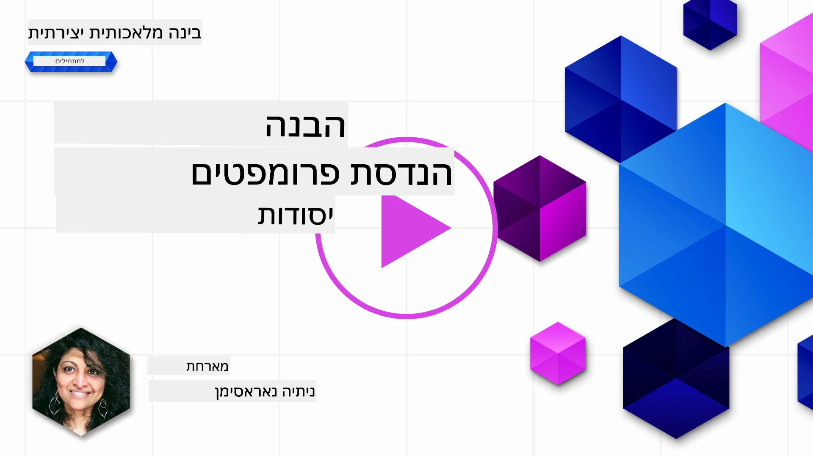
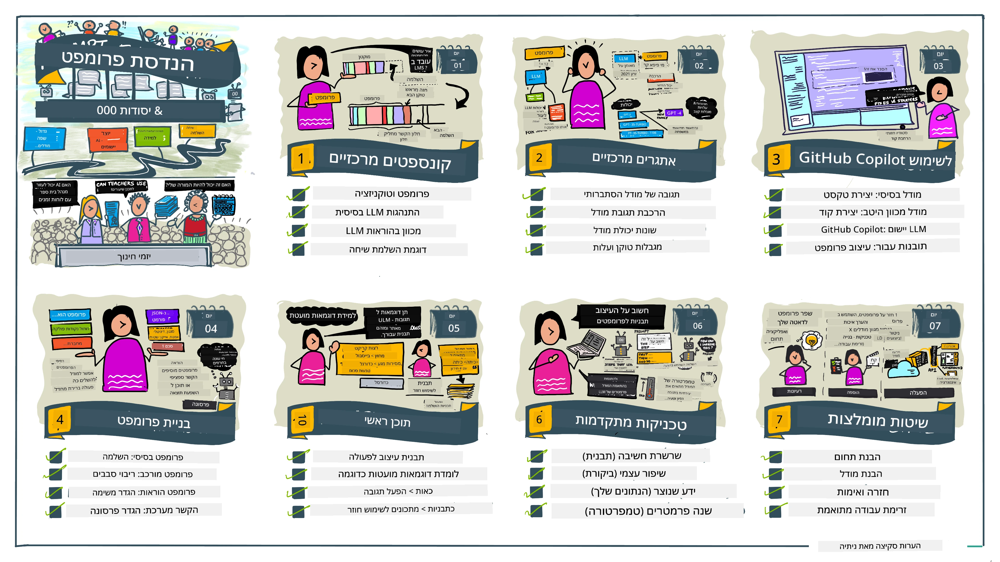
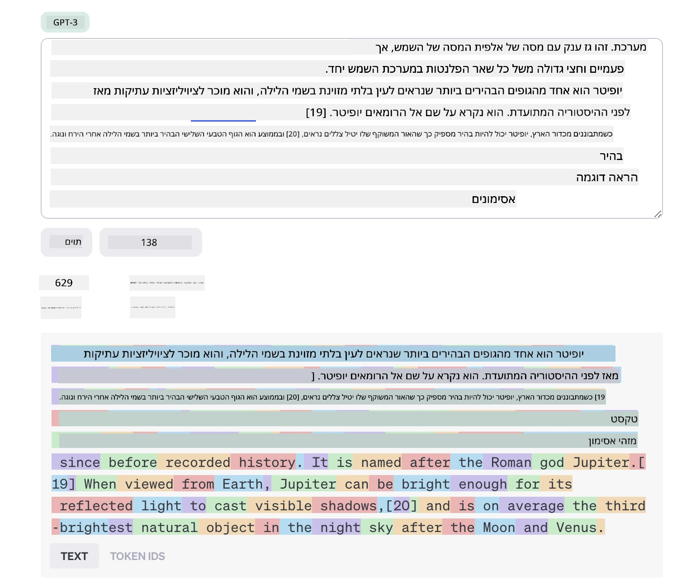
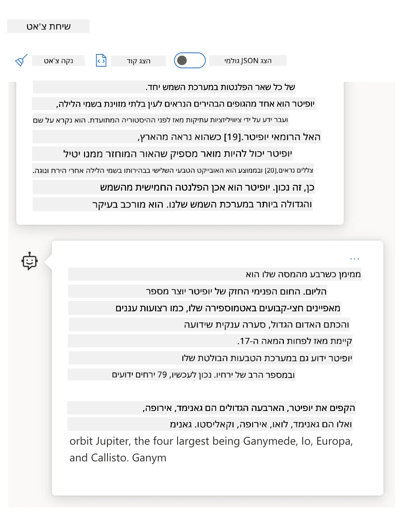
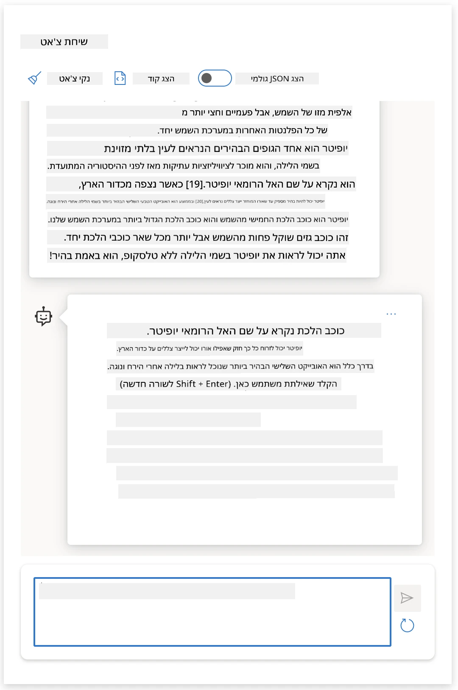
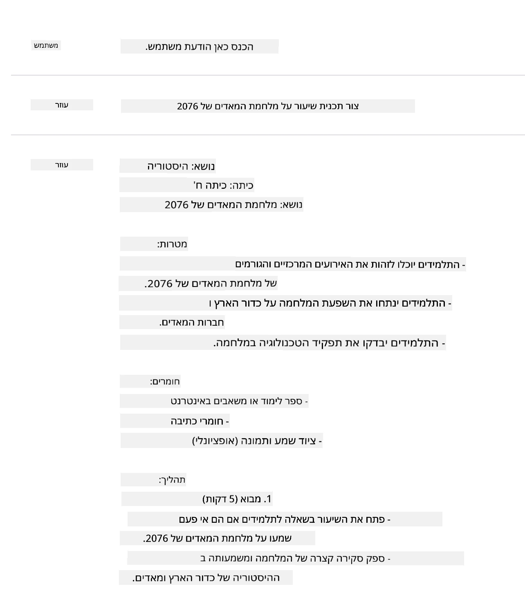
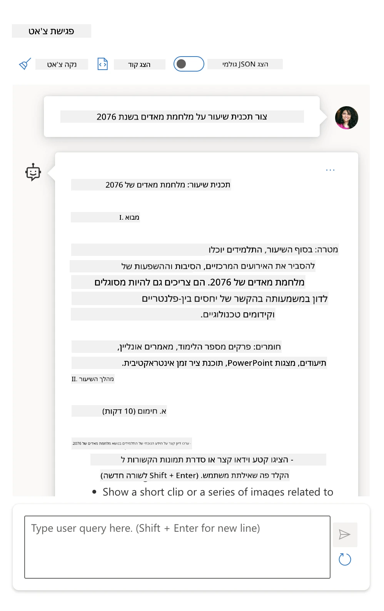
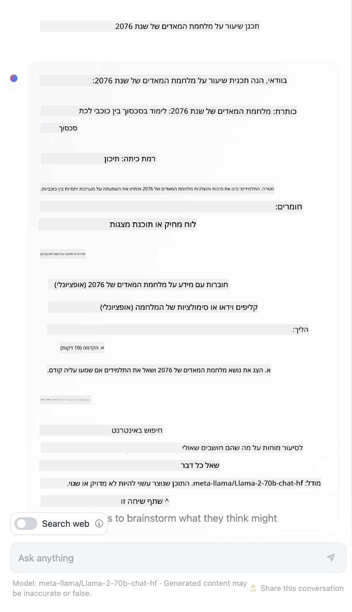

# יסודות הנדסת הפרומפטים

[](https://youtu.be/GElCu2kUlRs?si=qrXsBvXnCW12epb8)

## מבוא
מודול זה מכסה מושגים וטכניקות חיוניות ליצירת פרומפטים יעילים במודלים גנרטיביים של בינה מלאכותית. האופן שבו אתה כותב את הפרומפט למודל שפה גדול (LLM) גם הוא חשוב. פרומפט המעוצב בקפידה יכול להשיג איכות תגובה טובה יותר. אך מה בדיוק משמעות המונחים _פרומפט_ ו-_הנדסת פרומפטים_? וכיצד אני משפר את קלט הפרומפט שאני שולח למודל השפה? אלה השאלות שננסה לענות עליהן בפרק זה והבא.

_בינה מלאכותית גנרטיבית_ מסוגלת ליצור תוכן חדש (למשל, טקסט, תמונות, קול, קוד וכו') בהתאם לבקשות משתמש. היא משיגה זאת באמצעות _מודלי שפה גדולים_ כמו סדרת GPT של OpenAI ("טרנספורמר מאומן מראש גנרטיבי") המותאמים לשימוש בשפה טבעית ובקוד.

משתמשים יכולים כעת לתקשר עם מודלים אלו באמצעות פרדיגמות מוכרות כמו צ'אט, ללא צורך במומחיות טכנית או הכשרה. המודלים מבוססי-_פרומפטים_ – המשתמשים שולחים קלט טקסטואלי (פרומפט) ומקבלים תגובת בינה מלאכותית (תוצאה). הם יכולים לאחר מכן "לדבר עם הבינה המלאכותית" באינטראקציות מרובות סבבים, ולשפר את הפרומפט עד שהתשובה תתאים לציפיותיהם.

"פרומפטים" הופכים כעת לממשק ה-_תכנותי_ המרכזי באפליקציות בינה מלאכותית גנרטיביות, שמכוון את המודלים ומהווה גורם משפיע על איכות התגובות המתקבלות. "הנדסת פרומפטים" היא תחום מתפתח במהירות שמתמקד ב-_עיצוב ואופטימיזציה_ של פרומפטים כדי לספק תגובות איכותיות ועקביות בקנה מידה רחב.

## מטרות הלמידה

בשיעור זה נלמד מהי הנדסת פרומפטים, מדוע היא חשובה, וכיצד ניתן ליצור פרומפטים יעילים יותר עבור מודל ומטרת יישום נתונים. נבין את המושגים הבסיסיים ואת השיטות הטובות ביותר להנדסת פרומפטים – ונכיר סביבת "סנדבוקס" אינטראקטיבית ב-Jupyter Notebooks שבה נוכל לראות את המושגים מיושמים בדוגמאות ממשיות.

בסיום השיעור נוכל:

1. להסביר מהי הנדסת פרומפטים ומדוע היא חשובה.
2. לתאר את מרכיבי הפרומפט ואיך הם משמשים.
3. ללמוד שיטות וטכניקות להנדסת פרומפטים.
4. ליישם טכניקות שנלמדו בדוגמאות אמיתיות, בעזרת נקודת קצה של OpenAI.

## מונחים מרכזיים

הנדסת פרומפטים: תהליך של תכנון ושיפור קלטים שמכוונים את מודלי הבינה המלאכותית ליצירת תוצאות רצויות.
טוקניזציה: התהליך של המרת טקסט ליחידות קטנות יותר, המכונות טוקנים, שהמודל יכול להבין ולעבד.
מודלי שפה גדולים מכווני הוראות: מודלי שפה גדולים (LLMs) שעברו התאמה עדינה עם הוראות ברורות לשיפור דיוק ורלוונטיות התגובות שלהם.

## סביבת סנדבוקס ללמידה

הנדסת פרומפטים היא כיום אומנות יותר מאשר מדע. הדרך הטובה ביותר לשפר את האינטואיציה שלנו היא _לתרגל יותר_ ולאמץ גישת ניסוי וטעייה שמשלבת מומחיות בתחום היישום עם טכניקות מומלצות ואופטימיזציות מותאמות למודל.

מחברת Jupyter הנלווית לשיעור זה מספקת סביבת _סנדבוקס_ שבה ניתן לנסות את מה שלמדתם – תוך כדי תנועה או כחלק מאתגר הקוד בסוף השיעור. לביצוע התרגילים תצטרכו:

1. **מפתח API של Azure OpenAI** – נקודת הקצה של השירות עבור מודל שפה גדול שמופעל.
2. **סביבת הרצה בפייתון** – שבה ניתן להפעיל את המחברת.
3. **משתני סביבה מקומיים** – _השלימו את שלבי ה-[SETUP](./../00-course-setup/02-setup-local.md?WT.mc_id=academic-105485-koreyst) כעת כדי להתכונן_.

המחברת כוללת תרגילים _מתחילים_ – אך מומלץ להוסיף גם תיאורים ב-_Markdown_ וקטעי קוד (בקשות פרומפט) שלכם כדי לנסות עוד דוגמאות או רעיונות – ולבנות את האינטואיציה לעיצוב פרומפטים.

## מדריך מאויר

רוצים לקבל תמונת מצב גדולה של מה שהשיעור הזה מכסה לפני שנכנסים לעומק? עיינו במדריך המאור, שמעניק לכם תחושה של הנושאים המרכזיים והמסקנות החשובות בכל אחד מהם. מפת השיעור מובילה אתכם מהבנת המושגים והאתגרים הבסיסיים ועד התמודדות איתם בעזרת טכניקות הנדסת פרומפטים רלוונטיות ושיטות עבודה מומלצות. שימו לב כי סקטור "טכניקות מתקדמות" במדריך מתייחס לתוכן הנלמד בפרק הבא של תכנית הלימודים הזו.



## הסטארטאפ שלנו

עכשיו, נדבר על האופן שבו _הנושא הזה_ מתקשר למשימת הסטארטאפ שלנו להביא חדשנות בינה מלאכותית לחינוך [bringing AI innovation to education](https://educationblog.microsoft.com/2023/06/collaborating-to-bring-ai-innovation-to-education?WT.mc_id=academic-105485-koreyst). אנו רוצים לבנות אפליקציות מבוססות בינה מלאכותית ללמידה _אישית_ – אז בואו נחשוב על האופן שבו משתמשים שונים באפליקציה שלנו עשויים "לעצב" פרומפטים:

- **מנהלים** עשויים לבקש מהבינה המלאכותית _לנתח נתוני תכניות לימודים כדי לאתר פערי כיסוי_. הבינה המלאכותית יכולה לסכם תוצאות או להמחיש אותן עם קוד.
- **מחנכים** עשויים לבקש מהבינה המלאכותית _ליצור תכנית שיעור עבור קהל יעד ונושא מסוימים_. הבינה יכולה לבנות את התכנית האישית בפורמט מוגדר.
- **תלמידים** עשויים לבקש מהבינה המלאכותית _לתת להם שיעור במקצוע קשה_. הבינה יכולה להנחות את התלמידים עם שיעורים, רמזים ודוגמאות המותאמות לרמתם.

זו רק קצה הקרחון. עיינו ב-[Prompts For Education](https://github.com/microsoft/prompts-for-edu/tree/main?WT.mc_id=academic-105485-koreyst) – ספריית פרומפטים בקוד פתוח שנבחרה על ידי מומחי חינוך – כדי לקבל תחושה רחבה יותר של האפשרויות! _נסו להריץ כמה מהפרומפטים בסנדבוקס או באמצעות OpenAI Playground כדי לראות מה קורה!_

<!--
תבנית שיעור:
יחידה זו צריכה לכסות את המושג המרכזי מספר 1.
לחזק את המושג עם דוגמאות והפניות.

מושג מס' 1:
הנדסת פרומפטים.
להגדיר ולהסביר למה זה נחוץ.
-->

## מהי הנדסת פרומפטים?

התחלנו את השיעור בהגדרת **הנדסת פרומפטים** כתהליך של _עיצוב ואופטימיזציה_ של קלטים טקסטואליים (פרומפטים) כדי לספק תגובות עקביות ובעלות איכות (השלמות) למטרת יישום ומודל נתונים. ניתן לחשוב על כך כתהליך דו-שלבי:

- _עיצוב_ הפרומפט הראשוני עבור מודל ומטרה מסוימים
- _שיפור_ הפרומפט בצורה איטרטיבית כדי לשפר את איכות התגובה

זהו בהכרח תהליך של ניסוי וטעייה שמצריך אינטואיציה ומאמץ מצד המשתמש להשגת תוצאות מיטביות. מדוע זה חשוב? כדי לענות על שאלה זו, עלינו תחילה להבין שלושה מושגים:

- _טוקניזציה_ = איך המודל "רואה" את הפרומפט
- _מודלי שפה בסיסיים_ = איך מודל הבסיס "מעבד" פרומפט
- _מודלי שפה מכווני הוראות_ = איך המודל יכול כעת לזהות "משימות"

### טוקניזציה

מודל שפה גדול רואה פרומפטים כסידרה של טוקנים, שבה מודלים שונים (או גרסאות שונות של מודל) יכולים לפרק את אותו פרומפט בדרכים שונות. מכיוון שהמודלים מאומנים על טוקנים (ולא על טקסט גלמי), האופן שבו הטוקניזציה מתבצעת משפיע ישירות על איכות התגובה המופקת.

כדי לקבל אינטואיציה לגבי אופן פעולת הטוקניזציה, נסו כלים כמו [OpenAI Tokenizer](https://platform.openai.com/tokenizer?WT.mc_id=academic-105485-koreyst) שמוצג למטה. העתקו את הפרומפט שלכם – וראו כיצד הוא מומר לטוקנים, תוך התבוננות איך תווי הרווח והנקודה מטופלים. שימו לב שהדוגמה מראה מודל ישן יותר (GPT-3) – לכן ייתכן שהתוצאה במודל חדש תהיה שונה.



### מושג: מודלי יסוד

לאחר שהפרומפט מומצל לטוקנים, התפקיד העיקרי של ["מודל שפה בסיסי"](https://blog.gopenai.com/an-introduction-to-base-and-instruction-tuned-large-language-models-8de102c785a6?WT.mc_id=academic-105485-koreyst) (או מודל היסוד) הוא לחזות את הטוקן הבא בסדרה. מכיוון שמודלי השפה מאומנים על מאגרי טקסט עצומים, יש להם הבנה טובה של הקשרים הסטטיסטיים בין טוקנים ויכולת לבצע תחזיות אלה בביטחון מסוים. עם זאת, הם אינם מבינים את _משמעות_ המילים בפרומפט או בטוקן; הם פשוט מזהים דפוס שניתן "להשלים" עם התחזית הבאה שלהם. הם יכולים להמשיך לחזות את הסדרה עד לסיום בהתערבות משתמש או תנאי קודם.

רוצים לראות איך השלמת פרומפט עובדת? הזינו את הפרומפט שלמעלה ל-[Microsoft Foundry playground](https://ai.azure.com?WT.mc_id=academic-105485-koreyst) עם ההגדרות ברירת המחדל. המערכת מוגדרת לטפל בפרומפטים כבקשות למידע – כך שתקבלו השלמה שעונה להקשר זה.

אך מה אם המשתמש רוצה לראות משהו ספציפי שעומד בקריטריון או במטרה כלשהי? כאן נכנסים לתמונה המודלים מכווני ההוראות.



### מושג: מודלי שפה מכווני הוראות

[מודל שפה מכוון הוראות](https://blog.gopenai.com/an-introduction-to-base-and-instruction-tuned-large-language-models-8de102c785a6?WT.mc_id=academic-105485-koreyst) מתחיל במודל היסוד ועובר התאמה עדינה עם דוגמאות או זוגות קלט/פלט (למשל, מסרים מרובי סבבים) שיכולים להכיל הוראות ברורות – והתגובות של הבינה המלאכותית מנסות לעקוב אחר אותן הוראות.

משתמשים בטכניקות כמו Reinforcement Learning with Human Feedback (RLHF) שיכולות לאמן את המודל _לעקוב אחרי הוראות_ וללמוד מפיוביק בדיעבד, כך שהוא מייצר תגובות המתאימות יותר ליישומים מעשיים ורלוונטיות למטרות המשתמש.

בואו ננסה – חזרו על הפרומפט שלמעלה, אך כעת שנו את _הודעת המערכת_ כך שתכלול את ההוראה הבאה כהקשר:

> _סכם את התוכן שניתן לך עבור תלמיד בכיתה ב'. השאר את התוצאה לפסקה אחת עם 3-5 נקודות._

תשימו לב שהתוצאה מותאמת כעת למטרה ולפורמט הרצויים? מחנך יכול להשתמש בתגובה זו ישירות במצגות לשיעור.



## למה אנחנו צריכים הנדסת פרומפטים?

כעת, כשהבנו כיצד מודלים מעבדים פרומפטים, נדבר על _מדוע_ אנו צריכים הנדסת פרומפטים. התשובה טמונה בעובדה שמודלי השפה הנוכחיים מציגים מספר אתגרים שהופכים את השגת _השלמות אמינות ועקביות_ לקשה יותר ללא השקעת מאמץ בבניית הפרומפט ואופטימיזציה שלו. לדוגמה:

1. **תגובות המודל הן סטוכסטיות.** אותו פרומפט כנראה יפיק תגובות שונות עם מודלים שונים או בגרסאות שונות של אותו מודל. ואף עלול להפיק תוצאות שונות עם אותו מודל בזמנים שונים. _טכניקות הנדסת פרומפטים יכולות לעזור לנו לצמצם שונות זאת על ידי מתן כללים טובים יותר_.

1. **מודלים עלולים להמציא תגובות.** המודלים מאומנים על מאגרים _גדולים אך סופיים_, כלומר חסרה להם ידע על מושגים מחוץ להיקף האימון. כתוצאה מכך הם עלולים לייצר השלמות שלא מדויקות, דמיוניות או מנוגדות לעובדות ידועות. _טכניקות הנדסת פרומפטים מסייעות למשתמשים לזהות ולהפחית המצאות מסוג זה, למשל על ידי בקשת ציטוטים או הסברים מהבינה המלאכותית_.

1. **יכולות המודלים משתנות.** מודלים חדשים או דורות חדשים יביאו יכולות עשירות יותר אך גם בעלי מאפיינים מסוימים והשפעות על עלות ומורכבות. _הנדסת פרומפטים יכולה לסייע לפתח שיטות עבודה מומלצות ותהליכים שמעבירים על ההבדלים ומסתנכרנים לדרישות מודל ספציפיות בצורה נוחה ונגישה בקנה מידה רחב_.

בואו נראה זאת בפעולה ב-OpenAI או Azure OpenAI Playground:

- השתמשו באותו פרומפט עם פריסות שונות של מודלים (למשל, OpenAI, Azure OpenAI, Hugging Face) – האם ראיתם הבדלים?
- השתמשו באותו פרומפט שוב ושוב עם אותה פריסת מודל (למשל, Azure OpenAI playground) – כיצד השתנו התגובות?

### דוגמה להמצאות

בקורס הזה, אנו משתמשים במונח **"המצאה"** כדי להתייחס לתופעה שבה מודלי שפה מייצרים לפעמים מידע אינו מדויק בשל מגבלות באימון או מגבלות אחרות. יתכן כי שמעתם גם את המונח _"הלוצינציות"_ במאמרים פופולריים או מחקרים. עם זאת, אנו ממליצים בחום להשתמש במונח _"המצאה"_ כדי למנוע אנתרופומורפיזם של ההתנהגות באמצעות אפיון תכונה אנושית לתוצאה ממונעת על ידי מכונה. זה גם מחזק את [קווי ההנחיה לבינה מלאכותית אחראית](https://www.microsoft.com/ai/responsible-ai?WT.mc_id=academic-105485-koreyst) בהקשר של מונחים, ומוציא מונחים שעלולים להיחשב כפוגעניים או בלתי כוללניים בהקשרים מסוימים.

רוצים להבין איך המצאות פועלות? חשבו על פרומפט שמבקש מהבינה המלאכותית ליצור תוכן בנושא שאינו קיים (כדי לוודא שהוא לא נמצא במאגרי האימון). למשל – ניסיתי את הפרומפט הבא:

> **פרומפט:** צור תכנית שיעור על מלחמת המאדים בשנת 2076.

חיפוש באינטרנט הראה לי שישנם תיאורים בדיוניים (למשל, סדרות טלוויזיה או ספרים) על מלחמות מאדים – אך לא בשנת 2076. ההיגיון הבריא אומר ש-2076 הוא _בעתיד_ ולכן לא יכול להיות מקושר לאירוע אמיתי.


אז מה קורה כשמריצים את הפקודה הזו עם ספקי LLM שונים?

> **תגובה 1**: OpenAI Playground (GPT-35)



> **תגובה 2**: Azure OpenAI Playground (GPT-35)



> **תגובה 3**: : Hugging Face Chat Playground (LLama-2)



כפי שציפינו, כל דגם (או גרסת דגם) מייצר תגובות שונות במקצת בזכות התנהגות אקראית ושונות ביכולת הדגם. לדוגמה, דגם אחד פונה לקהל כיתה ח' בעוד שהאחר מניח תלמיד בית ספר תיכון. אבל כל שלושת הדגמים ייצרו תגובות שיכולות לשכנע משתמש לא מיודע שהאירוע היה אמיתי.

טכניקות הנדסת פרומפט כמו _מטאפראופטינג_ ו_קונפיגורציית טמפרטורה_ עשויות להפחית במעט את ההמצאות של הדגם. ארכיטקטורות חדשות של הנדסת פרומפט משלבות גם כלים וטכניקות חדשות בזרימת הפרומפט, כדי להקטין או להפחית חלק מההשפעות האלו.

## מחקר מקרה: GitHub Copilot

נסיים את החלק הזה בהבנת כיצד משתמשים בהנדסת פרומפט בפתרונות בעולם האמיתי על ידי הסתכלות על מחקר מקרה: [GitHub Copilot](https://github.com/features/copilot?WT.mc_id=academic-105485-koreyst).

GitHub Copilot הוא ה"שותף המהנדס" שלך ב-AI – הוא ממיר פקודות טקסט להשלמות קוד ומשולב בסביבת הפיתוח שלך (למשל, Visual Studio Code) לחוויית משתמש חלקה. כמו שמתועד בסדרת הבלוגים למטה, הגרסה המוקדמת התבססה על דגם OpenAI Codex – כאשר המהנדסים הבינו מהר את הצורך לכוונן היטב את הדגם ולפתח טכניקות הנדסת פרומפט טובות יותר, כדי לשפר את איכות הקוד. ביולי, הם [חשפו דגם AI משופר שעובר את Codex](https://github.blog/2023-07-28-smarter-more-efficient-coding-github-copilot-goes-beyond-codex-with-improved-ai-model/?WT.mc_id=academic-105485-koreyst) להציע הצעות מהירות יותר.

קראו את הפוסטים בסדר, לעקוב אחרי מסע הלמידה שלהם.

- **מאי 2023** | [GitHub Copilot משתפר בהבנת הקוד שלך](https://github.blog/2023-05-17-how-github-copilot-is-getting-better-at-understanding-your-code/?WT.mc_id=academic-105485-koreyst)
- **מאי 2023** | [פנים GitHub: עבודה עם ה-LLM מאחורי GitHub Copilot](https://github.blog/2023-05-17-inside-github-working-with-the-llms-behind-github-copilot/?WT.mc_id=academic-105485-koreyst).
- **יוני 2023** | [איך לכתוב פרומפטים טובים יותר עבור GitHub Copilot](https://github.blog/2023-06-20-how-to-write-better-prompts-for-github-copilot/?WT.mc_id=academic-105485-koreyst).
- **יולי 2023** | [.. GitHub Copilot עובר את Codex עם דגם AI משופר](https://github.blog/2023-07-28-smarter-more-efficient-coding-github-copilot-goes-beyond-codex-with-improved-ai-model/?WT.mc_id=academic-105485-koreyst)
- **יולי 2023** | [מדריך למפתח להנדסת פרומפט ו-LLM](https://github.blog/2023-07-17-prompt-engineering-guide-generative-ai-llms/?WT.mc_id=academic-105485-koreyst)
- **ספטמבר 2023** | [איך לבנות אפליקציית LLM ארגונית: לקחים מ-GitHub Copilot](https://github.blog/2023-09-06-how-to-build-an-enterprise-llm-application-lessons-from-github-copilot/?WT.mc_id=academic-105485-koreyst)

אתם גם יכולים לעיין ב[בלוג ההנדסה שלהם](https://github.blog/category/engineering/?WT.mc_id=academic-105485-koreyst) לפוסטים נוספים כמו [זה](https://github.blog/2023-09-27-how-i-used-github-copilot-chat-to-build-a-reactjs-gallery-prototype/?WT.mc_id=academic-105485-koreyst) שמראה איך דגמים וטכניקות אלו מיושמים להנעת יישומים בעולם האמיתי.

---

<!--
תבנית שיעור:
יחידה זו אמורה לכסות את המושג המרכזי #2.
לחזק את המושג עם דוגמאות והפניות.

מושג מספר 2:
עיצוב פרומפט.
ממוזג עם דוגמאות.
-->

## בניית פרומפט

ראינו מדוע הנדסת פרומפט חשובה - עכשיו נבין איך פרומפטים _נבנים_ כדי שנוכל להעריך טכניקות שונות לעיצוב פרומפט יעיל יותר.

### פרומפט בסיסי

נתחיל עם הפרומפט הבסיסי: קלט טקסט שנשלח לדגם ללא הקשר נוסף. הנה דוגמה - כשאנחנו שולחים את המילים הראשונות של ההמנון הלאומי של ארה"ב ל-OpenAI [Completion API](https://platform.openai.com/docs/api-reference/completions?WT.mc_id=academic-105485-koreyst), הוא מיד _משלים_ את התגובה עם השורות הבאות, ומדגים את התנהגות החיזוי הבסיסית.

| פרומפט (קלט)      | השלמה (פלט)                                                                                                                             |
| :----------------- | :-------------------------------------------------------------------------------------------------------------------------------------- |
| Oh say can you see | זה נשמע כאילו אתה מתחיל בשיר "The Star-Spangled Banner", ההמנון הלאומי של ארצות הברית. מילות השיר המלאות הן ...                        |

### פרומפט מורכב

עכשיו נוסיף הקשר והוראות לפרומפט הבסיסי הזה. ה-[Chat Completion API](https://learn.microsoft.com/azure/ai-foundry/openai/how-to/chatgpt?WT.mc_id=academic-105485-koreyst) מאפשר לנו לבנות פרומפט מורכב כאוסף של _הודעות_ עם:

- זוגות קלט/פלט המשקפים קלט של _המשתמש_ ותגובה של _העוזר_.
- הודעת מערכת שקובעת את ההקשר להתנהגות או אישיות העוזר.

הבקשה היא כעת בצורה הבאה, שבה ה-_טוקניזציה_ לוכדת בצורה יעילה מידע רלוונטי מהקשר ושיחה. כעת, שינוי ההקשר במערכת יכול להיות בעל השפעה משמעותית על איכות ההשלמות, כפי שהקלטים שניתנים למשתמש.

```python
response = client.responses.create(
    model="gpt-5-mini",
    input=[
        {"role": "system", "content": "You are a helpful assistant."},
        {"role": "user", "content": "Who won the world series in 2020?"},
        {"role": "assistant", "content": "The Los Angeles Dodgers won the World Series in 2020."},
        {"role": "user", "content": "Where was it played?"}
    ]
)
```

### הוראת פרומפט

בדוגמאות שלמעלה, פרומפט המשתמש היה שאילתה טקסט פשוטה שיכולה להתפרש כבקשה למידע. עם פרומפטים מסוג _הוראות_, אפשר להשתמש בטקסט הזה כדי לציין משימה בפירוט רב יותר, ולספק הדרכה טובה יותר ל-AI. הנה דוגמה:

| פרומפט (קלט)                                                                                                                                                                                                                         | השלמה (פלט)                                                                                                        | סוג הוראה         |
| :------------------------------------------------------------------------------------------------------------------------------------------------------------------------------------------------------------------------------------- | :------------------------------------------------------------------------------------------------------------------------- | :------------------ |
| כתוב תיאור של מלחמת האזרחים                                                                                                                                                                                                   | _החזיר פסקה פשוטה_                                                                                              | פשוט               |
| כתוב תיאור של מלחמת האזרחים. ספק תאריכים ואירועים מרכזיים ותאר את משמעותם                                                                                                                                     | _החזיר פסקה ואחריה רשימת תאריכים חשובים עם תיאורים_                                             | מורכב               |
| כתוב תיאור של מלחמת האזרחים בפסקה אחת. ספק 3 נקודות עם תאריכים מרכזיים ומשמעותם. ספק 3 נקודות נוספות עם דמויות היסטוריות מרכזיות ותרומותיהן. החזר את הפלט כקובץ JSON | _מחזיר פרטים מקיפים יותר בתיבת טקסט, מעוצב כ-JSON שאפשר להעתיק-להדביק לקובץ ולוודא לפי הצורך_ | מורכב. מעוצב.        |

## תוכן ראשי

בדוגמאות שלמעלה, הפרומפט עדיין היה פתוח למדי, ומאפשר ל-LLM להחליט איזו חלק מהמאגר המקדים שלו רלוונטי. עם דפוס העיצוב _תוכן ראשי_, טקסט הקלט מחולק לשני חלקים:

- הוראה (פעולה)
- תוכן רלוונטי (שמשפיע על הפעולה)

הנה דוגמה שבה ההוראה היא "סכם זאת בשתי משפטים".

| פרומפט (קלט)                                                                                                                                                                                                                                                                                                                                                                                                                                                                                                                                                                                                                                                                                      | השלמה (פלט)                                                                                                                                                                                                                                                                             |
| :-------------------------------------------------------------------------------------------------------------------------------------------------------------------------------------------------------------------------------------------------------------------------------------------------------------------------------------------------------------------------------------------------------------------------------------------------------------------------------------------------------------------------------------------------------------------------------------------------------------------------------------------------------------------------------------------------- | :---------------------------------------------------------------------------------------------------------------------------------------------------------------------------------------------------------------------------------------------------------------------------------------------- |
| צדק הוא הפלנטה החמישית מהשמש והגדולה ביותר במערכת השמש. הוא ענק גז עם מסת אחד אלף מזו של השמש, אך פעמיים וחצי ממסת כל הפלנטות האחרות במערכת השמש יחד. צדק הוא אחת מהעצמים המבריקים ביותר שנראים לעין בלתי מזוינת בשמיים בלילה, והוא ידוע מזה עתיקות לפני התקופה המתועדת. הוא נקרא על שם האל הרומי צדק.[19] כשהוא נצפה מכדור הארץ, צדק יכול להיות מבריק מספיק כדי שהאור המוחזר ייצר צללים נראים,[20] ובממוצע הוא העצם הטבעי השלישי ביותר מבריק בשמיים בלילה אחרי הירח ונוגה. <br/> **סכם זאת בשני משפטים קצרים** | צדק, הפלנטה החמישית מהשמש, הוא הגדולה ביותר במערכת השמש וידוע כאחד מהעצמים המבריקים בשמיים בלילה. הוא נקרא על שם האל הרומי צדק, והוא ענק גז שמסתו היא פעמיים וחצי מסת כל שאר הפלנטות במערכת השמש יחד. |

ניתן להשתמש בקטע התוכן הראשי בדרכים שונות כדי להניע הוראות יעילות יותר:

- **דוגמאות** - במקום לומר לדגם מה לעשות עם הוראה מפורשת, תנו לו דוגמאות למה לעשות ותנו לו להסיק את התבנית.
- **רמזים** - תעקבו אחרי ההוראה עם "רמז" שמכוון את ההשלמה, ומנחה את הדגם לתגובות רלוונטיות יותר.
- **תבניות** - אלו 'מתכונים' חוזרים לפרומפטים עם משתנים שניתן להתאים עם נתונים למקרי שימוש ספציפיים.

בואו נבדוק את אלו בפעולה.

### שימוש בדוגמאות

זו שיטה שבה משתמשים בתוכן הראשי כדי "להאכיל את הדגם" בדוגמאות לפלט הרצוי עבור הוראה נתונה, ומאפשרים לו להסיק את התבנית לפלט הרצוי. על פי מספר הדוגמאות שניתנו, יש לנו פרומפטינג אפס-ירי, ירי-יחיד, ירי-מועט וכן הלאה.

הפרומפט כעת מורכב משלושה מרכיבים:

- תיאור המשימה
- כמה דוגמאות לפלט הרצוי
- תחילת דוגמה חדשה (שהופכת לתיאור משימה מרומז)

| סוג למידה  | פרומפט (קלט)                                                                                                                                        | השלמה (פלט)         |
| :------------ | :---------------------------------------------------------------------------------------------------------------------------------------------------- | :-------------------------- |
| אפס-ירי     | "השמש זורחת". תרגם לספרדית                                                                                                                         | "El Sol está brillando".    |
| ירי-יחיד    | "השמש זורחת" => ""El Sol está brillando". <br> "זה יום קר ורטוב" =>                                                                                   | "Es un día frío y ventoso". |
| ירי-מועט    | השחקן רץ על הבסיסים => בייסבול <br/> השחקן קלע אס => טניס <br/> השחקן קלע שש => קריקט <br/> השחקן עשה סל-דאנק =>                                 | כדורסל                  |
|               |                                                                                                                                                       |                             |

שימו לב שצריך לספק הוראה מפורשת ("תרגם לספרדית") בפרומפט אפס-ירי, אך היא נסקה בדגם ירי-יחיד. הדוגמה ירי-מועט מראה שעם הוספת דוגמאות הדגמים יכולים להסיק יותר מדויק ללא הוראות נוספות.

### רמזים בפרומפט

טכניקה נוספת לשימוש בתוכן הראשי היא לספק _רמזים_ במקום דוגמאות. במקרה כזה, נותנים לדגם דחיפה קלה לכיוון הנכון על ידי _התחלתו_ בקטע שמראה את פורמט התגובה הרצוי. הדגם "לוקח את הרמז" וממשיך באותו הקו.

| מספר הרמזים | פרומפט (קלט)                                                                                                                                                                                                                                                                                                                                                                                                                                               | השלמה (פלט)                                                                                                                                                                                                                                                                                       |
| :------------- | :----------------------------------------------------------------------------------------------------------------------------------------------------------------------------------------------------------------------------------------------------------------------------------------------------------------------------------------------------------------------------------------------------------------------------------------------------------- | :-------------------------------------------------------------------------------------------------------------------------------------------------------------------------------------------------------------------------------------------------------------------------------------------------------- |
| 0              | צדק הוא הפלנטה החמישית מהשמש והגדולה ביותר במערכת השמש. הוא ענק גז עם מסת אחד אלף מזו של השמש, אך פעמיים וחצי ממסת כל הפלנטות האחרות במערכת השמש יחד. צדק הוא אחת מהעצמים המבריקים ביותר שנראים לעין בלתי מזוינת בשמיים בלילה, והוא ידוע מזה עתיקות לפני התקופה המתועדת. <br/>**סכם זאת**                                       | צדק היא הפלנטה הגדולה ביותר במערכת השמש והחמישית מהשמש. היא ענק גז עם מסת 1/1000 מזו של השמש, אך כבדה יותר מכל שאר הפלנטות יחד. ציוויליזציות עתיקות ידעו על צדק זמן רב, והוא נראית בבירור בשמי הלילה. |
| 1              | צדק הוא הפלנטה החמישית מהשמש והגדולה ביותר במערכת השמש. הוא ענק גז עם מסת אחד אלף מזו של השמש, אך פעמיים וחצי ממסת כל הפלנטות האחרות במערכת השמש יחד. צדק הוא אחת מהעצמים המבריקים ביותר שנראים לעין בלתי מזוינת בשמיים בלילה, והוא ידוע מזה עתיקות לפני התקופה המתועדת. <br/>**סכם זאת** <br/> מה שלמדנו הוא שצדק | הוא הפלנטה החמישית מהשמש והגדולה ביותר במערכת השמש. הוא ענק גז עם מסת אחד אלף מזו של השמש, אך פעמיים וחצי מזו של כל שאר הפלנטות יחד. הוא נראה לעין בלתי מזוינת ומוכר מאז העת העתיקה.                        |

| 2              | כוכב הלכת צדק הוא הכוכב החמישי מהשמש והגדול ביותר במערכת השמש. זהו כוכב-ענק גזי עם מסה שהיא אלףית ממסת השמש, אך כפולה פי שניים וחצי מכל שאר הכוכבים במערכת השמש ביחד. צדק הוא אחד מהגופים הבהירים ביותר הנראים לעין בלתי מזוינת בשמי הלילה, והוא היה מוכר לציוויליזציות עתיקות עוד לפני התקופה המוקלטת. <br/>**סכם זאת** <br/> 3 עובדות מובילות שלמדנו:         | 1. כוכב הלכת צדק הוא הכוכב החמישי מהשמש והגדול ביותר במערכת השמש. <br/> 2. זהו כוכב-ענק גזי עם מסה שהיא אלףית ממסת השמש...<br/> 3. צדק נצפה לעין בלתי מזוינת מאז העת העתיקה ...                                                                       |
|                |                                                                                                                                                                                                                                                                                                                                                                                                                                                              |                                                                                                                                                                                                                                                                                                           |

### תבניות הנחייה

תבנית הנחייה היא _מתכון מוגדר מראש להנחייה_ שניתן לשמור ולשחזר לפי הצורך, כדי להניע חוויות משתמש עקביות בקנה מידה. בצורה הפשוטה ביותר, זוהי אוסף של דוגמאות הנחייה כמו [זו של OpenAI](https://cookbook.openai.com/examples/gpt4-1_prompting_guide?WT.mc_id=academic-105485-koreyst) שמספקת הן את רכיבי ההנחייה האינטראקטיביים (הודעות משתמש ומערכת) והן את פורמט הבקשה המונע על ידי API - כדי לתמוך בשימוש חוזר.

בצורה המורכבת יותר כמו [דוגמה זו מ-LangChain](https://python.langchain.com/docs/concepts/prompt_templates/?WT.mc_id=academic-105485-koreyst) היא מכילה _מקומות ממלאים_ שניתן להחליף בנתונים ממקורות מגוונים (קלט משתמש, הקשר מערכת, מקורות נתונים חיצוניים וכו') כדי לייצר הנחייה דינמית. זה מאפשר לנו ליצור ספריה של הנחיות לשימוש חוזר שניתן להשתמש בהן כדי להניע חוויות משתמש עקביות **תכנותית** בקנה מידה.

בסופו של דבר, הערך האמיתי של תבניות טמון ביכולת ליצור ולפרסם _ספריות הנחיות_ לתחומי יישום אנכיים - שבהן תבנית ההנחייה מותאמת כעת _באופטימיזציה_ כדי לשקף הקשר או דוגמאות ספציפיות ליישום שעושות את התגובות רלוונטיות ומדויקות יותר לקהל המשתמש המיועד. מאגר [Prompts For Edu](https://github.com/microsoft/prompts-for-edu?WT.mc_id=academic-105485-koreyst) הוא דוגמה נהדרת לגישה זו, שמאגדת ספריית הנחיות לתחום החינוך תוך דגש על מטרות מרכזיות כמו תכנון שיעורים, עיצוב תוכניות לימוד, חונכות לסטודנטים וכו'.

## תוכן תומך

אם נחשוב על בניית הנחייה כהכילה הוראה (משימה) ותוכן ראשי (תוכן עיקרי), אז _תוכן משני_ הוא כמו הקשר נוסף שאנו מספקים כדי **להשפיע על הפלט בדרך כלשהי**. זה יכול להיות פרמטרים לכיוונון, הוראות עיצוב, טקסונומיות נושאים וכו' שיכולים לסייע למודל _להתאים_ את תגובתו כך שתתאים למטרות או לציפיות המשתמש הרצויות.

לדוגמה: בהינתן קטלוג קורסים עם מטה-נתונים מפורטים (שם, תיאור, רמה, תגי מטה-נתונים, מרצה וכו') על כל הקורסים הזמינים בתכנית הלימודים:

- נוכל להגדיר הוראה ל"סכם את קטלוג הקורסים לסתיו 2023"
- נוכל להשתמש בתוכן הראשי כדי לספק כמה דוגמאות לפלט הרצוי
- נוכל להשתמש בתוכן המשני כדי לזהות את 5 ה"תגים" החשובים ביותר.

כעת, המודל יכול לספק סיכום בפורמט המוצג בדוגמאות, אך אם תוצאה מכילה תגיות מרובות, הוא יכול לתת עדיפות לאותם 5 תגיות שנקבעו בתוכן המשני.

---

<!--
תבנית שיעור:
יחידה זו צריכה לכסות את המושג המרכזי מספר 1.
תחזק את המושג עם דוגמאות והפניות.

מושג מספר 3:
טכניקות הנדסת הנחיות.
מהם כמה טכניקות בסיסיות להנדסת הנחיות?
המחיש אותו עם כמה תרגילים.
-->

## שיטות עבודה מומלצות להנחייה

עכשיו כשאנחנו יודעים כיצד ניתן _לבנות_ הנחיות, נוכל להתחיל לחשוב כיצד _לעצב_ אותן כך שישקפו שיטות עבודה מומלצות. נוכל לחשוב על כך בחלקים שניים - גישה נכונה (_mindset_) ויישום הטכניקות הנכונות.

### גישת הנדסת הנחיות

הנדסת הנחיות היא תהליך של ניסוי וטעייה, לכן שמרו בראש שלושה גורמים מנחים רחבים:

1. **הבנת התחום חשובה.** הדיוק והרלוונטיות של התגובה הם פונקציה של ה _תחום_ שבו היישום או המשתמש פועל. השתמשו באינטואיציה ובמומחיות התחום שלכם כדי **להתאים טכניקות** נוסף. למשל, הגדירו _אישיויות ייחודיות לתחום_ בתבניות המערכת שלכם, או השתמשו ב _תבניות ייחודיות לתחום_ בהנחיות המשתמש שלכם. ספקו תוכן משני המשקף הקשרים ייחודיים לתחום, או השתמשו ב _רמזים ודוגמאות ייחודיות לתחום_ כדי להכווין את המודל לדפוסי שימוש מוכרים.

2. **הבנת המודל חשובה.** אנו יודעים שמודלים הם סטוכסטיים מטבעם. אך מימושי מודל יכולים להשתנות גם בהתאם למאגר הנתונים עליו אומנו (ידע מראש), ליכולות שהם מספקים (למשל, דרך API או SDK) ולסוג התוכן שאליו הם מותאמים (למשל, קוד לעומת תמונות לעומת טקסט). הבינו את החוזקות והמגבלות של המודל בו אתם משתמשים, והשתמשו בידע זה כדי _לתעדף משימות_ או לבנות _תבניות מותאמות אישית_ המותאמות ליכולות המודל.

3. **חשיבות הלולאה והוולידציה.** המודלים מתפתחים במהירות, וכך גם הטכניקות להנדסת הנחיות. כמומחה תחום, ייתכן שיש לכם הקשר ספציפי או קריטריונים ל _היישום_ שלכם, שאינם חלים על הקהילה הרחבה יותר. השתמשו בכלי וטכניקות הנדסת הנחיות כדי "להאיץ" את בניית ההנחייה, ולאחר מכן בצעו לולאה ואימות התוצאות תוך שימוש באינטואיציה ובמומחיות התחום שלכם. תעדו את התובנות שלכם וצרו **מאגר ידע** (למשל, ספריות הנחיות) שניתן להשתמש בו כקו בסיס חדש לאחרים, עבור לולאות מהירות יותר בעתיד.

## שיטות עבודה מומלצות

עכשיו נבחן שיטות עבודה מומלצות נפוצות המומלצות על ידי [OpenAI](https://help.openai.com/en/articles/6654000-best-practices-for-prompt-engineering-with-openai-api?WT.mc_id=academic-105485-koreyst) ו [Azure OpenAI](https://learn.microsoft.com/azure/ai-foundry/openai/concepts/prompt-engineering#best-practices?WT.mc_id=academic-105485-koreyst) מומחים.

| מה                              | למה                                                                                                                                                                                                                                               |
| :-------------------------------- | :------------------------------------------------------------------------------------------------------------------------------------------------------------------------------------------------------------------------------------------------ |
| העריכו את המודלים האחרונים.       | דורות חדשים של מודלים צפויים לכלול תכונות ואיכות משופרות - אך עלולים גם לגרום לעלויות גבוהות יותר. העריכו אותם לפי השפעה, ואז קבלו החלטות על מעבר.                                                                                |
| הפרידו בין הוראות להקשר         | בדקו האם המודל/הספק שלכם מגדיר _גבולות_ להבחנה בין הוראות, תוכן ראשי ותוכן משני בצורה ברורה יותר. זה יכול לעזור למודלים להקצות משקלים מדויקים יותר לטוקנים.                                                         |
| היו ספציפיים וברורים             | ספקו פרטים נוספים על ההקשר הרצוי, התוצאה, האורך, הפורמט, הסגנון וכו'. זה ישפר גם את האיכות וגם את העקביות של התגובות. קיבעו מתכונים בתבניות לשימוש חוזר.                                                          |
| היו תיאוריים, השתמשו בדוגמאות      | המודלים עשויים להגיב טוב יותר לגישה של "הראה וספר". התחילו בגישת `שונה-אפס` שבה אתם נותנים הוראה (אבל ללא דוגמאות) ואז נסו `שונה-מעט` כשיונון, המספק כמה דוגמאות לפלט הרצוי. השתמשו באנלוגיות. |
| השתמשו ברמזים כדי לזרז השלמות | נדדו אותו לעבר תוצאה רצויה על ידי מתן מילים או ביטויים מובילים שיכולים לשמש נקודת התחלה לתגובה.                                                                                                               |
| חזרו על עצמכם                 | לפעמים תצטרכו לחזור על עצמכם למודל. ספקו הוראות לפני ואחרי התוכן הראשי, השתמשו בהוראה ורמז, וכו'. בצעו חזרות ואימות כדי לראות מה עובד.                                                         |
| הסדר חשוב                     | הסדר בו אתם מציגים מידע למודל עשוי להשפיע על הפלט, גם בדוגמאות הלמידה, בזכות הטיה של עדכניות. נסו אפשרויות שונות כדי לגלות מה עובד הכי טוב.                                                               |
| תנו למודל אפשרות “יציאה”           | ספקו למודל תגובת המשך _גיבוי_ שתוכל לספק במקרה שהוא לא מצליח להשלימה את המשימה מסיבה כלשהי. זה יכול להפחית סיכוי להפקת תגובות שקריות או מומצאות.                                                         |
|                                   |                                                                                                                                                                                                                                                   |

כמו בכל שיטה מומלצת, זכרו ש _התוצאה שלכם עשויה להשתנות_ בהתאם למודל, המשימה והתחום. השתמשו בכך כנקודת התחלה, וחזרו על התהליך למציאת מה שהכי מתאים לכם. העריכו מחדש את תהליך הנדסת ההנחות שלכם כל הזמן ככל שמודלים וכלים חדשים זמינים, עם דגש על סקלביליות התהליך ואיכות התגובה.

<!--
תבנית שיעור:
יחידה זו צריכה לכלול אתגר קוד אם רלוונטי

אתגר:
קישור ל-Jupyter Notebook שבו רק הערות הקוד במדריך (חלקי הקוד ריקים).

פתרון:
קישור להעתק של אותו דף עם ההנחיות הממולאות והרצתן, המציג דוגמה אחת אפשרית.
-->

## מטלה

ברכות! הגעתם לסוף השיעור! הגיע הזמן לבחון חלק מהמושגים והטכניקות האלה עם דוגמאות ממשיות!

עבור המטלה שלנו, נשתמש ב-Jupyter Notebook עם תרגילים שתוכלו להשלים אינטראקטיבית. תוכלו גם להרחיב את ה-Notebook עם תאים משלכם במרקדאון וקוד כדי לחקור רעיונות וטכניקות בעצמכם.

### להתחלה, בצעו fork לרפוזיטורי, ואז

- (מומלץ) הפעלו GitHub Codespaces
- (כחלופה) השיבו עותק מהרפוזיטורי למכשיר המקומי שלכם והשתמשו בו עם Docker Desktop
- (כחלופה) פתחו את ה-Notebook בסביבת הריצה המועדפת עליכם.

### לאחר מכן, הגדירו את משתני הסביבה שלכם

- העתיקו את הקובץ `.env.copy` שבשורש הרפוזיטורי ל-`.env` ומלאו את הערכים `AZURE_OPENAI_API_KEY`, `AZURE_OPENAI_ENDPOINT` ו-`AZURE_OPENAI_DEPLOYMENT`. חזרו ל[מדור למידת החול](#סביבת-סנדבוקס-ללמידה) כדי ללמוד כיצד.

### לאחר מכן, פתחו את ה-Jupyter Notebook

- בחרו את קרנל הריצה. אם אתם משתמשים באפשרויות 1 או 2, פשוט בחרו בקרנל Python 3.10.x המוגדר כברירת מחדל שמסופק על ידי מכולת הפיתוח.

אתם מוכנים להריץ את התרגילים. שימו לב שאין פה תשובות _נכונות או שגויות_ - רק חקירת אפשרויות בניסוי וטעייה ופיתוח אינטואיציה למה עובד עבור מודל ותחום יישום מסוימים.

_מסיבה זו אין קטעי פתרון קוד בשיעור הזה. במקום זאת, ל-Notebook יהיו תאי Markdown שכותרתם "הפתרון שלי:" שמציג דוגמה אחת לפלט כהפניה._

 <!--
תבנית שיעור:
עטפו את החלק בסיכום ומשאבים ללמידה עצמאית.
-->

## בדיקת ידע

איזו מבין ההנחיות הבאות היא טובה ועומדת בשיטות עבודה סבירות?

1. תראה לי תמונה של רכב אדום
2. תראה לי תמונה של רכב אדום מדגם Volvo ודגם XC90 חונה על צוק עם השמש שוקעת
3. תראה לי תמונה של רכב אדום מדגם Volvo ודגם XC90

א: 2 הוא ההנחייה הטובה ביותר מכיוון שהיא מספקת פרטים על "מה" ונכנסת לספציפיות (לא סתם רכב אלא דגם מדויק) וגם מתארת את הסביבה הכוללת. הנחייה 3 היא השנייה בטיבה כי היא גם מכילה הרבה תיאורים.

## 🚀 אתגר

נסו לנצל את טכניקת ה"רמז" עם ההנחייה: השלם את המשפט "תראה לי תמונה של רכב אדום מדגם Volvo ו...". מה התגובה, ואיך הייתם משפרים אותה?

## עבודה מעולה! המשך ללמוד

רוצים ללמוד עוד על מושגי הנדסת הנחיות שונים? גשו ל[דף הלמידה המתמשכת](https://aka.ms/genai-collection?WT.mc_id=academic-105485-koreyst) כדי למצוא משאבים מעולים נוספים על הנושא.

עברו לשיעור 5 שבו נבחן [טכניקות הנחיה מתקדמות](../05-advanced-prompts/README.md?WT.mc_id=academic-105485-koreyst)!

---

<!-- CO-OP TRANSLATOR DISCLAIMER START -->
**כתב ויתור**:
מסמך זה תורגם באמצעות שירות תרגום אוטומטי [Co-op Translator](https://github.com/Azure/co-op-translator). למרות שאנו שואפים לדיוק, יש לקחת בחשבון שתרגומים אוטומטיים עלולים להכיל שגיאות או אי-דיוקים. יש להחשיב את המסמך המקורי בשפתו הטבעית כמקור הסמכות. למידע קריטי מומלץ להשתמש בתרגום מקצועי על ידי מתרגם אדם. אנו לא אחראים לכל אי-הבנה או פירוש שגוי הנובע מהשימוש בתרגום זה.
<!-- CO-OP TRANSLATOR DISCLAIMER END -->