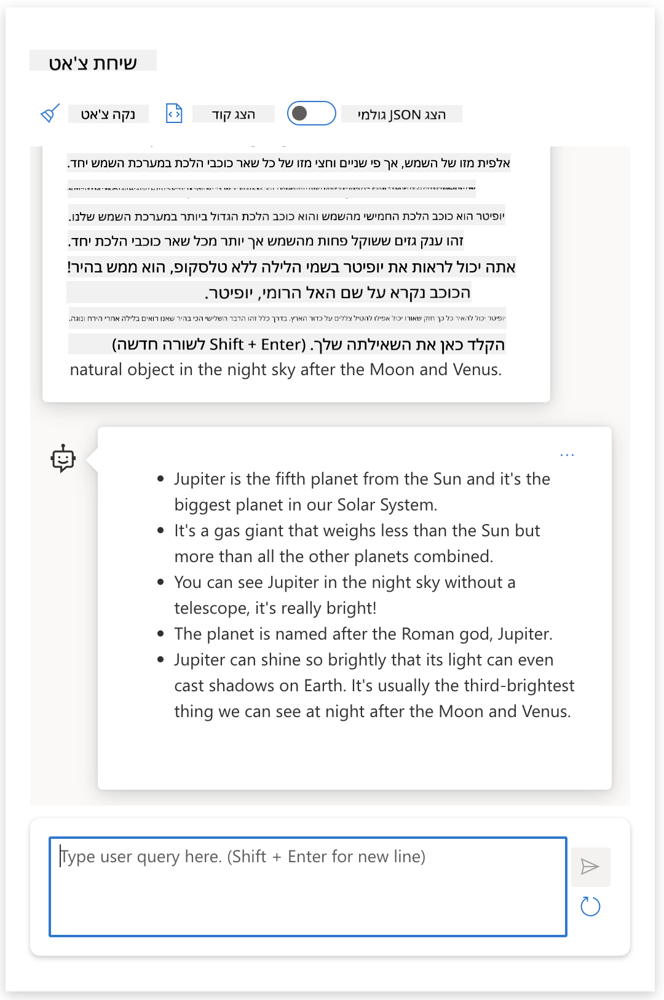

<!--
CO_OP_TRANSLATOR_METADATA:
{
  "original_hash": "dcbaaae026cb50fee071e690685b5843",
  "translation_date": "2025-08-26T18:01:50+00:00",
  "source_file": "04-prompt-engineering-fundamentals/README.md",
  "language_code": "he"
}
-->
# יסודות הנדסת פרומפטים

[](https://aka.ms/gen-ai-lesson4-gh?WT.mc_id=academic-105485-koreyst)

## הקדמה
המודול הזה עוסק במושגים וטכניקות מרכזיות ליצירת פרומפטים יעילים במודלים גנרטיביים של בינה מלאכותית. גם האופן שבו אתם כותבים את הפרומפט ל-LLM משפיע על התוצאה. פרומפט שנכתב בקפידה יכול להוביל לתגובה איכותית יותר. אבל מה בעצם המשמעות של מושגים כמו _פרומפט_ ו-הנדסת פרומפטים_? ואיך אפשר לשפר את _הקלט_ שאני שולח ל-LLM? אלה השאלות שננסה לענות עליהן בפרק הזה ובזה שאחריו.

בינה מלאכותית גנרטיבית מסוגלת ליצור תוכן חדש (למשל, טקסט, תמונות, אודיו, קוד וכו') בתגובה לבקשות משתמשים. היא עושה זאת באמצעות _מודלים שפתיים גדולים_ כמו סדרת GPT ("Generative Pre-trained Transformer") של OpenAI, שמאומנים על שפה טבעית וקוד.

המשתמשים יכולים כיום לתקשר עם המודלים האלה בשיטות מוכרות כמו צ'אט, בלי צורך בידע טכני או הכשרה. המודלים מבוססי _פרומפט_ - המשתמשים שולחים קלט טקסטואלי (פרומפט) ומקבלים תגובה מה-AI (קומפלישן). אפשר "לשוחח עם ה-AI" באופן מחזורי, בשיחות מרובות פניות, ולשפר את הפרומפט עד שהתוצאה תואמת את הציפיות.

ה"פרומפטים" הופכים לממשק _תכנות_ עיקרי לאפליקציות בינה מלאכותית גנרטיבית, ומכוונים את המודלים למה לעשות ומשפיעים על איכות התשובות. "הנדסת פרומפטים" היא תחום מתפתח במהירות, שמתמקד ב_עיצוב ואופטימיזציה_ של פרומפטים כדי להבטיח תגובות איכותיות ועקביות בקנה מידה גדול.

## מטרות למידה

בשיעור הזה נלמד מהי הנדסת פרומפטים, למה זה חשוב, ואיך אפשר ליצור פרומפטים יעילים יותר עבור מודל ומטרה מסוימים. נבין מושגים מרכזיים ושיטות עבודה מומלצות להנדסת פרומפטים - ונכיר סביבת "sandbox" אינטראקטיבית ב-Jupyter Notebooks שבה אפשר לראות את המושגים האלה בפעולה על דוגמאות אמיתיות.

בסוף השיעור נוכל:

1. להסביר מהי הנדסת פרומפטים ולמה היא חשובה.
2. לתאר את מרכיבי הפרומפט ואיך משתמשים בהם.
3. ללמוד שיטות עבודה וטכניקות להנדסת פרומפטים.
4. ליישם את הטכניקות שנלמד על דוגמאות אמיתיות, באמצעות נקודת קצה של OpenAI.

## מושגים מרכזיים

הנדסת פרומפטים: עיצוב ושיפור קלטים כדי לכוון את מודלי הבינה המלאכותית להפיק פלטים רצויים.
טוקניזציה: תהליך הפיכת טקסט ליחידות קטנות יותר, שנקראות טוקנים, שהמודל יודע להבין ולעבד.
מודלים שפתיים גדולים מכווני-הוראות: LLMs שעברו כיוונון נוסף עם הוראות ספציפיות כדי לשפר את דיוק ורלוונטיות התשובות.

## סביבת למידה

הנדסת פרומפטים היא כרגע יותר אמנות ממדע. הדרך הטובה ביותר לשפר את האינטואיציה שלנו היא _להתנסות יותר_ ולאמץ גישה של ניסוי וטעייה שמשלבת מומחיות בתחום היישום עם טכניקות מומלצות ואופטימיזציות ייחודיות למודל.

ה-Jupyter Notebook שמלווה את השיעור הזה מספק סביבת _sandbox_ שבה אפשר לנסות את מה שלומדים - תוך כדי או כחלק מאתגר הקוד בסוף. כדי לבצע את התרגילים, תצטרכו:

1. **מפתח API של Azure OpenAI** - נקודת קצה לשירות עם LLM שהופעל.
2. **סביבת הרצה של Python** - שבה אפשר להריץ את ה-Notebook.
3. **משתני סביבה מקומיים** - _השלימו עכשיו את שלבי [SETUP](./../00-course-setup/02-setup-local.md?WT.mc_id=academic-105485-koreyst) כדי להתכונן_.

ה-Notebook מגיע עם תרגילים _ראשוניים_ - אבל מומלץ להוסיף קטעי _Markdown_ (תיאור) ו-_Code_ (בקשות פרומפט) משלכם כדי לנסות עוד דוגמאות או רעיונות - ולבנות אינטואיציה לעיצוב פרומפטים.

## מדריך מאויר

רוצים להבין את התמונה הגדולה של מה שהשיעור הזה כולל לפני שמתחילים? הציצו במדריך המאויר הזה, שמציג את הנושאים המרכזיים ואת התובנות שכדאי לחשוב עליהן בכל אחד מהם. מפת השיעור לוקחת אתכם מהבנת המושגים והאתגרים המרכזיים ועד להתמודדות איתם באמצעות טכניקות ושיטות עבודה מומלצות להנדסת פרומפטים. שימו לב שקטע "טכניקות מתקדמות" במדריך הזה מתייחס לתוכן שיילמד בפרק _הבא_ בקורס.


## הסטארטאפ שלנו

עכשיו, בואו נדבר על איך _הנושא הזה_ קשור למשימה של הסטארטאפ שלנו ל[הביא חדשנות AI לחינוך](https://educationblog.microsoft.com/2023/06/collaborating-to-bring-ai-innovation-to-education?WT.mc_id=academic-105485-koreyst). אנחנו רוצים לבנות אפליקציות לימוד _מותאמות אישית_ שמבוססות על AI - אז בואו נחשוב איך משתמשים שונים באפליקציה שלנו עשויים "לעצב" פרומפטים:

- **מנהלים** עשויים לבקש מה-AI _לנתח נתוני תוכנית לימודים כדי לזהות פערים בכיסוי_. ה-AI יכול לסכם תוצאות או להציג אותן בצורה ויזואלית עם קוד.
- **מורים** עשויים לבקש מה-AI _ליצור מערך שיעור לקהל יעד ונושא מסוים_. ה-AI יכול לבנות את התוכנית האישית בפורמט מוגדר.
- **תלמידים** עשויים לבקש מה-AI _לעזור להם בלימוד נושא קשה_. ה-AI יכול להדריך את התלמידים עם שיעורים, רמזים ודוגמאות שמותאמים לרמה שלהם.

וזה רק קצה הקרחון. הציצו ב-[Prompts For Education](https://github.com/microsoft/prompts-for-edu/tree/main?WT.mc_id=academic-105485-koreyst) - ספריית פרומפטים בקוד פתוח שאצרו מומחי חינוך - כדי לקבל מושג רחב יותר על האפשרויות! _נסו להריץ כמה מהפרומפטים האלה ב-sandbox או ב-OpenAI Playground ותראו מה קורה!_

<!--
LESSON TEMPLATE:
This unit should cover core concept #1.
Reinforce the concept with examples and references.

CONCEPT #1:
Prompt Engineering.
Define it and explain why it is needed.
-->

## מהי הנדסת פרומפטים?

התחלנו את השיעור בהגדרת **הנדסת פרומפטים** כתהליך של _עיצוב ואופטימיזציה_ של קלטים טקסטואליים (פרומפטים) כדי להבטיח תגובות עקביות ואיכותיות (קומפלישנים) עבור מטרה ומודל מסוימים. אפשר לחשוב על זה כתהליך דו-שלבי:

- _עיצוב_ הפרומפט הראשוני עבור מודל ומטרה מסוימים
- _שיפור_ הפרומפט באופן מחזורי כדי לשפר את איכות התגובה

זהו תהליך של ניסוי וטעייה שמצריך אינטואיציה ומאמץ מצד המשתמש כדי להגיע לתוצאות מיטביות. אז למה זה חשוב? כדי לענות על השאלה, צריך להבין שלושה מושגים:

- _טוקניזציה_ = איך המודל "רואה" את הפרומפט
- _מודלי בסיס_ = איך מודל הבסיס "מעבד" את הפרומפט
- _מודלים מכווני-הוראות_ = איך המודל יכול לראות "משימות"

### טוקניזציה

LLM רואה פרומפטים כ_רצף של טוקנים_, כאשר מודלים שונים (או גרסאות שונות של אותו מודל) יכולים לטוקן את אותו פרומפט בדרכים שונות. מאחר ש-LLMs מאומנים על טוקנים (ולא על טקסט גולמי), הדרך שבה הפרומפטים עוברים טוקניזציה משפיעה ישירות על איכות התגובה שנוצרת.

כדי להבין איך טוקניזציה עובדת, נסו כלים כמו [OpenAI Tokenizer](https://platform.openai.com/tokenizer?WT.mc_id=academic-105485-koreyst) שמוצג למטה. העתיקו את הפרומפט שלכם - ותראו איך הוא הופך לטוקנים, תוך תשומת לב לאיך תווי רווח וסימני פיסוק מטופלים. שימו לב שהדוגמה הזו מציגה מודל ישן יותר (GPT-3) - אז אם תנסו זאת עם מודל חדש יותר, ייתכן שתקבלו תוצאה שונה.


### מושג: מודלי בסיס

לאחר שהפרומפט עבר טוקניזציה, התפקיד העיקרי של ["מודל הבסיס"](https://blog.gopenai.com/an-introduction-to-base-and-instruction-tuned-large-language-models-8de102c785a6?WT.mc_id=academic-105485-koreyst) (או Foundation model) הוא לנבא את הטוקן הבא ברצף. מאחר ש-LLMs מאומנים על מאגרי טקסט עצומים, יש להם הבנה סטטיסטית טובה של הקשרים בין טוקנים והם יכולים לנבא את הטוקן הבא בביטחון מסוים. שימו לב שהם לא מבינים את _המשמעות_ של המילים או הטוקנים בפרומפט; הם פשוט מזהים תבנית שאפשר "להשלים" עם הניבוי הבא. הם יכולים להמשיך לנבא את הרצף עד שהמשתמש מפסיק אותם או לפי תנאי מוגדר מראש.

רוצים לראות איך השלמה מבוססת פרומפט עובדת? הזינו את הפרומפט למעלה ל-Azure OpenAI Studio [_Chat Playground_](https://oai.azure.com/playground?WT.mc_id=academic-105485-koreyst) עם ההגדרות ברירת מחדל. המערכת מוגדרת להתייחס לפרומפטים כבקשות למידע - אז תראו השלמה שמספקת את ההקשר הזה.

אבל מה אם המשתמש רוצה לראות משהו מסוים שעונה על קריטריונים או משימה? כאן נכנסים לתמונה _מודלים מכווני-הוראות_.


### מושג: מודלים מכווני-הוראות

[מודל מכוון-הוראות](https://blog.gopenai.com/an-introduction-to-base-and-instruction-tuned-large-language-models-8de102c785a6?WT.mc_id=academic-105485-koreyst) מתחיל ממודל הבסיס ועובר כיוונון נוסף עם דוגמאות או זוגות קלט/פלט (למשל, "הודעות" מרובות פניות) שכוללות הוראות ברורות - והתגובה מה-AI מנסה לעקוב אחרי ההוראה.

זה משתמש בטכניקות כמו Reinforcement Learning with Human Feedback (RLHF) שמאפשרות למודל _לעקוב אחרי הוראות_ ו_ללמוד ממשוב_, כך שהוא מפיק תגובות שמתאימות יותר ליישומים מעשיים ורלוונטיות יותר למטרות המשתמש.

בואו ננסה - חזרו לפרומפט למעלה, אבל עכשיו שנו את _הודעת המערכת_ ותנו את ההוראה הבאה כהקשר:

> _סכם את התוכן שתקבל עבור תלמיד בכיתה ב'. שמור על התוצאה כפסקה אחת עם 3-5 נקודות עיקריות._

שימו לב איך התוצאה עכשיו מותאמת למטרה ולפורמט הרצוי? מורה יכול להשתמש בתגובה הזו ישירות בשקופיות לשיעור.



## למה צריך הנדסת פרומפטים?

עכשיו כשאנחנו יודעים איך פרומפטים מעובדים על ידי LLMs, בואו נדבר על _למה_ צריך הנדסת פרומפטים. התשובה טמונה בכך ש-LLMs כיום מציבים אתגרים שמקשים על השגת _קומפלישנים אמינים ועקביים_ בלי להשקיע מאמץ בעיצוב ואופטימיזציה של הפרומפט. למשל:

1. **התגובות של המודל אקראיות.** אותו _פרומפט_ כנראה יניב תגובות שונות עם מודלים שונים או גרסאות שונות של אותו מודל. ואפילו עם אותו מודל, ייתכן שתקבלו תוצאות שונות בזמנים שונים. _טכניקות הנדסת פרומפטים יכולות לעזור לצמצם את השונות הזו על ידי יצירת מסגרות ברורות יותר_.

1. **המודלים עלולים להמציא תשובות.** המודלים מאומנים על מאגרי מידע _גדולים אך סופיים_, כלומר אין להם ידע על מושגים שמחוץ לתחום האימון. לכן, הם עלולים להפיק קומפלישנים לא מדויקים, דמיוניים או סותרים עובדות ידועות. _טכניקות הנדסת פרומפטים עוזרות למשתמשים לזהות ולהפחית המצאות כאלה, למשל על ידי בקשת ציטוטים או הסברים מה-AI_.

1. **היכולות של המודלים משתנות.** מודלים חדשים או דורות חדשים יהיו בעלי יכולות עשירות יותר, אבל גם יביאו איתם מאפיינים ייחודיים ואתגרים בעלות ומורכבות. _הנדסת פרומפטים יכולה לעזור לנו לפתח שיטות עבודה שמסתירות את ההבדלים ומסתגלות לדרישות ייחודיות של כל מודל בצורה גמישה ויעילה_.

בואו נראה את זה בפעולה ב-OpenAI או Azure OpenAI Playground:

- השתמשו באותו פרומפט עם פריסות LLM שונות (למשל, OpenAI, Azure OpenAI, Hugging Face) - האם ראיתם הבדלים?
- השתמשו באותו פרומפט שוב ושוב עם אותה פריסה של LLM (למשל, Azure OpenAI playground) - איך ההבדלים נראו?

### דוגמה להמצאות

בקורס הזה, אנחנו משתמשים במונח **"המצאה"** כדי לתאר את התופעה שבה LLMs לפעמים מייצרים מידע לא נכון עובדתית בגלל מגבלות באימון או סיבות אחרות. אולי שמעתם גם את המונח _"הזיות"_ במאמרים פופולריים או מחקרים. עם זאת, אנחנו ממליצים בחום להשתמש במונח _"המצאה"_ כדי שלא נייחס תכונה אנושית לתוצאה שנובעת ממכונה. זה גם מחזק את [הנחיות AI אחראי](https://www.microsoft.com/ai/responsible-ai?WT.mc_id=academic-105485-koreyst) מבחינת טרמינולוגיה, ומסיר מושגים שעלולים להיחשב פוגעניים או לא-כוללים בהקשרים מסוימים.

רוצים להבין איך המצאות עובדות? חשבו על פרומפט שמנחה את ה-AI לייצר תוכן בנושא לא קיים (כדי לוודא שהוא לא נמצא במאגר האימון). לדוגמה - ניסיתי את הפרומפט הזה:
# תוכנית שיעור: מלחמת המאדים של 2076

## מטרות השיעור
- להבין את הגורמים למלחמת המאדים של 2076
- לנתח את ההשפעות של המלחמה על מאדים ועל כדור הארץ
- לדון בתפקידים של הצדדים השונים במלחמה
- לפתח חשיבה ביקורתית לגבי השלכות עתידיות של סכסוכים בין-פלנטריים

## מבוא
מלחמת המאדים של 2076 הייתה נקודת מפנה בהיסטוריה של ההתיישבות האנושית בחלל. השיעור יבחן את הרקע, הגורמים, וההשפעות של המלחמה, תוך התמקדות באירועים המרכזיים ובדמויות החשובות.

## שלבי השיעור

### 1. רקע היסטורי
- סקירה קצרה של ההתיישבות האנושית במאדים עד 2076
- הסבר על המתחים בין המושבות השונות
- דיון על המשאבים והטכנולוגיות שהובילו לסכסוך

### 2. הגורמים למלחמה
- ניתוח הסיבות הכלכליות, הפוליטיות והחברתיות
- השפעת התחרות על מים, חמצן ומשאבים אחרים
- תפקידן של חברות כדור-ארציות בסכסוך

### 3. מהלך המלחמה
- תיאור האירועים המרכזיים: קרבות, בריתות, אסטרטגיות
- הצגת דמויות מפתח: מנהיגים, גנרלים, מדענים
- השפעת הטכנולוגיה על אופי הלחימה

### 4. השלכות המלחמה
- השפעות על החברה המאדימית והכדור-ארצית
- שינויים פוליטיים וחברתיים בעקבות המלחמה
- לקחים שנלמדו והסכמים שנחתמו

### 5. דיון ופעילות
- דיון קבוצתי: האם ניתן היה למנוע את המלחמה?
- פעילות יצירתית: כתיבת מכתב מנקודת מבט של משתתף במלחמה
- ניתוח תרחישים עתידיים של סכסוכים בין-פלנטריים

## סיכום
השיעור מספק הבנה מעמיקה של מלחמת המאדים של 2076, ומעודד חשיבה ביקורתית על סכסוכים עתידיים בחלל. התלמידים יוכלו לזהות את הגורמים, ההשפעות והלקחים מהאירוע ההיסטורי.

## משימות להמשך
- לקרוא את הפרק על מלחמת המאדים בספר הלימוד
- להכין מצגת קצרה על אחת מהדמויות המרכזיות במלחמה
- לכתוב חיבור: "כיצד מלחמת המאדים שינתה את פני ההתיישבות האנושית בחלל?"
חיפוש ברשת הראה לי שיש תיאורים בדיוניים (למשל, סדרות טלוויזיה או ספרים) על מלחמות במאדים – אבל אף אחד מהם לא מתרחש ב-2076. ההיגיון הבריא גם אומר לנו ש-2076 היא _בעתיד_, ולכן לא יכולה להיות קשורה לאירוע אמיתי.

אז מה קורה כשמריצים את השאלה הזו אצל ספקי LLM שונים?

> **תגובה 1**: OpenAI Playground (GPT-35)


> **תגובה 2**: Azure OpenAI Playground (GPT-35)


> **תגובה 3**: : Hugging Face Chat Playground (LLama-2)


כצפוי, כל מודל (או גרסה של מודל) מייצר תגובות מעט שונות, בזכות ההתנהגות הסטוכסטית והבדלים ביכולות המודל. לדוגמה, מודל אחד מכוון לקהל של תלמידי חטיבת ביניים בעוד אחר מניח שמדובר בתלמיד תיכון. אבל כל שלושת המודלים יצרו תגובות שיכולות לשכנע משתמש לא בקיא שהאירוע אמיתי.

טכניקות הנדסת פרומפט כמו _מטה-פרומפטינג_ ו_הגדרת טמפרטורה_ עשויות להפחית במידה מסוימת את תופעת ההמצאות של המודל. ארכיטקטורות חדשות של הנדסת פרומפט משלבות גם כלים וטכניקות חדשות בזרימת הפרומפט, כדי לצמצם או למתן חלק מההשפעות הללו.

## מחקר מקרה: GitHub Copilot

נסיים את החלק הזה בהצצה לאופן שבו הנדסת פרומפטים משמשת בפתרונות אמיתיים, דרך מחקר מקרה: [GitHub Copilot](https://github.com/features/copilot?WT.mc_id=academic-105485-koreyst).

GitHub Copilot הוא "מתכנת זוגי מבוסס בינה מלאכותית" – הוא ממיר פרומפטים טקסטואליים להשלמות קוד ומשולב בסביבת הפיתוח שלך (למשל, Visual Studio Code) לחוויית משתמש חלקה. כפי שמתואר בסדרת הבלוגים למטה, הגרסה הראשונה התבססה על מודל OpenAI Codex – והמהנדסים הבינו במהרה שיש צורך לכוונן את המודל ולפתח טכניקות הנדסת פרומפטים טובות יותר, כדי לשפר את איכות הקוד. ביולי, הם [השיקו מודל בינה מלאכותית משופר שמתקדם מעבר ל-Codex](https://github.blog/2023-07-28-smarter-more-efficient-coding-github-copilot-goes-beyond-codex-with-improved-ai-model/?WT.mc_id=academic-105485-koreyst) ומספק הצעות מהירות יותר.

קראו את הפוסטים לפי הסדר, כדי לעקוב אחרי מסע הלמידה שלהם.

- **מאי 2023** | [GitHub Copilot משתפר בהבנת הקוד שלך](https://github.blog/2023-05-17-how-github-copilot-is-getting-better-at-understanding-your-code/?WT.mc_id=academic-105485-koreyst)
- **מאי 2023** | [מאחורי הקלעים של GitHub: עבודה עם ה-LLMs שמאחורי GitHub Copilot](https://github.blog/2023-05-17-inside-github-working-with-the-llms-behind-github-copilot/?WT.mc_id=academic-105485-koreyst).
- **יוני 2023** | [איך לכתוב פרומפטים טובים יותר ל-GitHub Copilot](https://github.blog/2023-06-20-how-to-write-better-prompts-for-github-copilot/?WT.mc_id=academic-105485-koreyst).
- **יולי 2023** | [.. GitHub Copilot מתקדם מעבר ל-Codex עם מודל בינה מלאכותית משופר](https://github.blog/2023-07-28-smarter-more-efficient-coding-github-copilot-goes-beyond-codex-with-improved-ai-model/?WT.mc_id=academic-105485-koreyst)
- **יולי 2023** | [מדריך למפתחים להנדסת פרומפטים ו-LLMs](https://github.blog/2023-07-17-prompt-engineering-guide-generative-ai-llms/?WT.mc_id=academic-105485-koreyst)
- **ספטמבר 2023** | [איך לבנות אפליקציית LLM לארגון: לקחים מ-GitHub Copilot](https://github.blog/2023-09-06-how-to-build-an-enterprise-llm-application-lessons-from-github-copilot/?WT.mc_id=academic-105485-koreyst)

אפשר גם לעיין ב[בלוג ההנדסה שלהם](https://github.blog/category/engineering/?WT.mc_id=academic-105485-koreyst) לעוד פוסטים כמו [הפוסט הזה](https://github.blog/2023-09-27-how-i-used-github-copilot-chat-to-build-a-reactjs-gallery-prototype/?WT.mc_id=academic-105485-koreyst) שמדגים איך המודלים והטכניקות האלו _מיושמים_ בפיתוח יישומים אמיתיים.

---

## בניית פרומפט

הבנו למה הנדסת פרומפטים חשובה – עכשיו נבין איך _בונים_ פרומפטים כדי שנוכל להעריך טכניקות שונות לעיצוב פרומפטים יעיל יותר.

### פרומפט בסיסי

נתחיל מהפרומפט הבסיסי: קלט טקסטואלי שנשלח למודל בלי הקשר נוסף. הנה דוגמה – כששולחים את המילים הראשונות של ההמנון האמריקאי ל-[Completion API של OpenAI](https://platform.openai.com/docs/api-reference/completions?WT.mc_id=academic-105485-koreyst), הוא מיד _משלים_ את התגובה עם השורות הבאות, ומדגים את התנהגות החיזוי הבסיסית.

| פרומפט (קלט)     | השלמה (פלט)                                                                                                                        |
| :----------------- | :----------------------------------------------------------------------------------------------------------------------------------------- |
| Oh say can you see | זה נשמע כאילו אתה מתחיל את מילות ההמנון "The Star-Spangled Banner", ההמנון הלאומי של ארצות הברית. המילים המלאות הן ... |

### פרומפט מורכב

עכשיו נוסיף הקשר והוראות לאותו פרומפט בסיסי. [Chat Completion API](https://learn.microsoft.com/azure/ai-services/openai/how-to/chatgpt?WT.mc_id=academic-105485-koreyst) מאפשר לנו לבנות פרומפט מורכב כאוסף של _הודעות_ עם:

- זוגות קלט/פלט שמייצגים קלט _משתמש_ ותגובה של _העוזר_.
- הודעת מערכת שמגדירה את ההקשר להתנהגות או אישיות של העוזר.

הבקשה כעת בנויה כך, כשה-_tokenization_ לוכד מידע רלוונטי מההקשר ומהשיחה. שינוי ההקשר של המערכת יכול להשפיע על איכות ההשלמות לא פחות מהקלט של המשתמש.

```python
response = openai.chat.completions.create(
    model="gpt-3.5-turbo",
    messages=[
        {"role": "system", "content": "You are a helpful assistant."},
        {"role": "user", "content": "Who won the world series in 2020?"},
        {"role": "assistant", "content": "The Los Angeles Dodgers won the World Series in 2020."},
        {"role": "user", "content": "Where was it played?"}
    ]
)
```

### פרומפט הוראות

בדוגמאות למעלה, פרומפט המשתמש היה שאילתא טקסטואלית פשוטה שניתן לפרש אותה כבקשה למידע. עם פרומפטי _הוראות_, אפשר להשתמש בטקסט כדי להגדיר את המשימה בפירוט רב יותר, ולתת הכוונה טובה יותר ל-AI. הנה דוגמה:

| פרומפט (קלט)                                                                                                                                                                                                                         | השלמה (פלט)                                                                                                        | סוג הוראה    |
| :------------------------------------------------------------------------------------------------------------------------------------------------------------------------------------------------------------------------------------- | :------------------------------------------------------------------------------------------------------------------------- | :------------------ |
| כתוב תיאור של מלחמת האזרחים                                                                                                                                                                                                   | _הוחזר פסקה פשוטה_                                                                                              | פשוט              |
| כתוב תיאור של מלחמת האזרחים. ציין תאריכים ואירועים מרכזיים והסבר את חשיבותם                                                                                                                                     | _הוחזרה פסקה ואחריה רשימת תאריכים מרכזיים עם הסברים_                                             | מורכב             |
| כתוב תיאור של מלחמת האזרחים בפסקה אחת. ציין 3 נקודות עם תאריכים מרכזיים וחשיבותם. ציין 3 דמויות היסטוריות מרכזיות ותרומתן. החזר את הפלט כקובץ JSON | _הוחזר פירוט רחב יותר בתיבת טקסט, בפורמט JSON שאפשר להעתיק לקובץ ולבדוק לפי הצורך_ | מורכב. בפורמט. |

## תוכן עיקרי

בדוגמאות למעלה, הפרומפט עדיין היה פתוח יחסית, ואפשר למודל להחליט איזה חלק מהמידע שברשותו רלוונטי. עם תבנית _תוכן עיקרי_, קלט הטקסט מחולק לשני חלקים:

- הוראה (פעולה)
- תוכן רלוונטי (שמשפיע על הפעולה)

הנה דוגמה שבה ההוראה היא "סכם זאת בשתי משפטים".

| פרומפט (קלט)                                                                                                                                                                                                                                                                                                                                                                                                                                                                                                                                                                                                                                                                                      | השלמה (פלט)                                                                                                                                                                                                                                                                             |
| :-------------------------------------------------------------------------------------------------------------------------------------------------------------------------------------------------------------------------------------------------------------------------------------------------------------------------------------------------------------------------------------------------------------------------------------------------------------------------------------------------------------------------------------------------------------------------------------------------------------------------------------------------------------------------------------------------- | :---------------------------------------------------------------------------------------------------------------------------------------------------------------------------------------------------------------------------------------------------------------------------------------------- |
| צדק הוא כוכב הלכת החמישי מהשמש והגדול ביותר במערכת השמש. זהו ענק גזים שמסתו אלפית מזו של השמש, אך פי שניים וחצי מכל שאר כוכבי הלכת יחד. צדק הוא אחד מהעצמים הבהירים ביותר שניתן לראות בעין בלתי מזוינת בשמי הלילה, ומוכר לציביליזציות עתיקות עוד לפני ההיסטוריה המתועדת. שמו של צדק ניתן לו על שם אל הרומאים יופיטר.[19] כאשר מתבוננים בו מכדור הארץ, צדק יכול להיות כה בהיר עד שאורו המוחזר יוצר צללים נראים לעין,[20] ובממוצע הוא העצם הטבעי השלישי בבהירותו בשמי הלילה אחרי הירח ונוגה. <br/> **סכם זאת בשני משפטים קצרים** | צדק, כוכב הלכת החמישי מהשמש, הוא הגדול ביותר במערכת השמש ומוכר כאחד מהעצמים הבהירים ביותר בשמי הלילה. הוא קרוי על שם אל הרומאים, והוא ענק גזים שמסתו פי שניים וחצי מכל שאר כוכבי הלכת יחד. |

את מקטע התוכן העיקרי אפשר לנצל בדרכים שונות כדי להנחות את ההוראות:

- **דוגמאות** – במקום להורות למודל מה לעשות, אפשר לתת לו דוגמאות של התוצאה הרצויה ולתת לו להסיק את התבנית.
- **רמזים** – אחרי ההוראה, מוסיפים "רמז" שמכוון את ההשלמה, ומנחה את המודל לתגובה רלוונטית יותר.
- **תבניות** – אלו "מתכונים" חוזרים לפרומפטים עם משתנים (placeholders) שאפשר להתאים לנתונים שונים לפי הצורך.

בואו נראה דוגמאות לכך.

### שימוש בדוגמאות

זו גישה שבה משתמשים בתוכן העיקרי כדי "להאכיל את המודל" בדוגמאות של הפלט הרצוי עבור הוראה מסוימת, ונותנים לו להסיק את התבנית הרצויה. לפי מספר הדוגמאות, אפשר לקבל zero-shot, one-shot, few-shot וכו'.

הפרומפט מורכב כעת משלושה חלקים:

- תיאור המשימה
- כמה דוגמאות של הפלט הרצוי
- התחלה של דוגמה חדשה (שמשמשת כהוראה מרומזת)

| סוג למידה | פרומפט (קלט)                                                                                                                                        | השלמה (פלט)         |
| :------------ | :---------------------------------------------------------------------------------------------------------------------------------------------------- | :-------------------------- |
| Zero-shot     | "The Sun is Shining". Translate to Spanish                                                                                                            | "El Sol está brillando".    |
| One-shot      | "The Sun is Shining" => ""El Sol está brillando". <br> "It's a Cold and Windy Day" =>                                                                 | "Es un día frío y ventoso". |
| Few-shot      | The player ran the bases => Baseball <br/> The player hit an ace => Tennis <br/> The player hit a six => Cricket <br/> The player made a slam-dunk => | Basketball                  |
|               |                                                                                                                                                       |                             |

שימו לב שב-zero-shot היינו צריכים לתת הוראה מפורשת ("Translate to Spanish"), אבל ב-one-shot ההוראה כבר משתמעת. בדוגמת few-shot, הוספת דוגמאות מאפשרת למודל להסיק טוב יותר את התבנית גם בלי הוראות נוספות.

### רמזים בפרומפט

טכניקה נוספת לשימוש בתוכן עיקרי היא לתת _רמזים_ במקום דוגמאות. כאן אנחנו נותנים למודל דחיפה קטנה בכיוון הנכון על ידי _התחלה_ של תגובה בפורמט הרצוי. המודל "תופס את הרמז" וממשיך באותו סגנון.

| מספר רמזים | פרומפט (קלט)                                                                                                                                                                                                                                                                                                                                                                                                                                               | השלמה (פלט)                                                                                                                                                                                                                                                                                       |
| :------------- | :----------------------------------------------------------------------------------------------------------------------------------------------------------------------------------------------------------------------------------------------------------------------------------------------------------------------------------------------------------------------------------------------------------------------------------------------------------- | :-------------------------------------------------------------------------------------------------------------------------------------------------------------------------------------------------------------------------------------------------------------------------------------------------------- |
| 0              | צדק הוא כוכב הלכת החמישי מהשמש והגדול ביותר במערכת השמש. זהו ענק גזים שמסתו אלפית מזו של השמש, אך פי שניים וחצי מכל שאר כוכבי הלכת יחד. צדק הוא אחד מהעצמים הבהירים ביותר שניתן לראות בעין בלתי מזוינת בשמי הלילה, ומוכר לציביליזציות עתיקות עוד לפני ההיסטוריה המתועדת.

**סכם זאת**                                       | צדק הוא כוכב הלכת הגדול ביותר במערכת השמש והחמישי מהשמש. זהו ענק גזים שמסתו היא אלפית מזו של השמש, אך הוא כבד יותר מכל שאר כוכבי הלכת יחד. תרבויות עתיקות הכירו את צדק מזה זמן רב, והוא נראה בקלות בשמי הלילה. |
| 1              | צדק הוא כוכב הלכת החמישי מהשמש והגדול ביותר במערכת השמש. זהו ענק גזים שמסתו אלפית מזו של השמש, אך פי שניים וחצי מכל שאר כוכבי הלכת יחד. צדק הוא אחד מהעצמים הבהירים ביותר שניתן לראות בעין בלתי מזוינת בשמי הלילה, והוא מוכר לתרבויות עתיקות עוד לפני ההיסטוריה המתועדת. <br/>**סכם זאת** <br/> מה שלמדנו הוא שצדק | הוא כוכב הלכת החמישי מהשמש והגדול ביותר במערכת השמש. זהו ענק גזים שמסתו אלפית מזו של השמש, אך פי שניים וחצי מכל שאר כוכבי הלכת יחד. הוא נראה בקלות בעין בלתי מזוינת ומוכר מאז ימי קדם.                        |
| 2              | צדק הוא כוכב הלכת החמישי מהשמש והגדול ביותר במערכת השמש. זהו ענק גזים שמסתו אלפית מזו של השמש, אך פי שניים וחצי מכל שאר כוכבי הלכת יחד. צדק הוא אחד מהעצמים הבהירים ביותר שניתן לראות בעין בלתי מזוינת בשמי הלילה, והוא מוכר לתרבויות עתיקות עוד לפני ההיסטוריה המתועדת. <br/>**סכם זאת** <br/> 3 עובדות עיקריות שלמדנו:         | 1. צדק הוא כוכב הלכת החמישי מהשמש והגדול ביותר במערכת השמש. <br/> 2. זהו ענק גזים שמסתו אלפית מזו של השמש...<br/> 3. צדק נראה בעין בלתי מזוינת מאז ימי קדם ...                                                                       |
|                |                                                                                                                                                                                                                                                                                                                                                                                                                                                              |                                                                                                                                                                                                                                                                                                           |

### תבניות להנחיות

תבנית להנחיה היא _מתכון מוגדר מראש להנחיה_ שניתן לשמור ולהשתמש בו שוב לפי הצורך, כדי ליצור חוויות משתמש עקביות יותר בקנה מידה גדול. בצורה הפשוטה ביותר, מדובר באוסף של דוגמאות להנחיות כמו [הדוגמה הזו של OpenAI](https://platform.openai.com/examples?WT.mc_id=academic-105485-koreyst) שמספקת גם את רכיבי ההנחיה האינטראקטיביים (הודעות משתמש ומערכת) וגם את פורמט הבקשה ל-API - כדי לאפשר שימוש חוזר.

בצורה המורכבת יותר כמו [הדוגמה הזו של LangChain](https://python.langchain.com/docs/concepts/prompt_templates/?WT.mc_id=academic-105485-koreyst) היא כוללת _מקומות שמורים_ שניתן להחליף בנתונים ממקורות שונים (קלט משתמש, הקשר מערכת, מקורות מידע חיצוניים וכו') כדי ליצור הנחיה באופן דינמי. זה מאפשר לנו ליצור ספרייה של הנחיות שניתן להשתמש בהן כדי ליצור חוויות משתמש עקביות **באופן תכנותי** בקנה מידה גדול.

הערך האמיתי של תבניות הוא ביכולת ליצור ולפרסם _ספריות הנחיות_ לתחומי יישום מסוימים - כאשר התבנית מותאמת להקשר או דוגמאות רלוונטיות לאותו תחום, מה שהופך את התשובות לרלוונטיות ומדויקות יותר עבור קהל היעד. [המאגר Prompts For Edu](https://github.com/microsoft/prompts-for-edu?WT.mc_id=academic-105485-koreyst) הוא דוגמה מצוינת לכך, עם ספרייה של הנחיות לתחום החינוך בדגש על מטרות כמו תכנון שיעורים, עיצוב תוכניות לימודים, חונכות תלמידים ועוד.

## תוכן תומך

אם נחשוב על בניית הנחיה ככוללת הוראה (משימה) ותוכן עיקרי (המטרה), אז _תוכן משני_ הוא הקשר נוסף שאנו מספקים כדי **להשפיע על התוצאה בדרך כלשהי**. זה יכול להיות פרמטרים לכיוונון, הוראות עיצוב, טקסונומיות נושאיות וכו' שיכולים לעזור למודל _להתאים_ את התשובה למטרות או ציפיות המשתמש.

לדוגמה: אם יש לנו קטלוג קורסים עם מטא-דאטה נרחב (שם, תיאור, רמה, תגיות, מרצה וכו') על כל הקורסים בתוכנית הלימודים:

- אפשר להגדיר הוראה "לסכם את קטלוג הקורסים לסתיו 2023"
- אפשר להשתמש בתוכן העיקרי כדי לספק כמה דוגמאות לתוצאה הרצויה
- אפשר להשתמש בתוכן המשני כדי לזהות את 5 התגיות החשובות ביותר.

כעת, המודל יכול לספק סיכום בפורמט שמוצג בדוגמאות, אבל אם יש תוצאה עם כמה תגיות, הוא יכול להעדיף את 5 התגיות שצוינו בתוכן המשני.

---

<!--
תבנית שיעור:
יחידה זו צריכה לכסות את מושג הליבה #1.
חזק את המושג עם דוגמאות והפניות.

מושג #3:
טכניקות הנדסת הנחיות.
אילו טכניקות בסיסיות קיימות להנדסת הנחיות?
הדגם זאת עם תרגילים.
-->

## עקרונות להנחיה נכונה

עכשיו כשאנחנו יודעים איך אפשר _לבנות_ הנחיות, אפשר להתחיל לחשוב איך _לעצב_ אותן לפי עקרונות מומלצים. אפשר לחלק זאת לשני חלקים - גישה נכונה ויישום טכניקות נכונות.

### גישת הנדסת הנחיות

הנדסת הנחיות היא תהליך של ניסוי וטעייה, לכן כדאי לזכור שלושה עקרונות מנחים:

1. **הבנה תחומית חשובה.** דיוק ורלוונטיות התשובה תלויים _בתחום_ בו פועל המשתמש או היישום. השתמש באינטואיציה ובידע שלך כדי **להתאים טכניקות**. למשל, הגדר _אישיות תחומית_ בהנחיות מערכת, או השתמש בתבניות תחומיות בהנחיות משתמש. ספק תוכן משני שמייצג הקשר תחומי, או השתמש ברמזים ודוגמאות מתחום מסוים כדי לכוון את המודל לשימוש מוכר.

2. **הבנת המודל חשובה.** אנחנו יודעים שמודלים הם אקראיים מטבעם. אבל גם היישום של המודל משתנה לפי מאגר הנתונים עליו הוא אומן (ידע מוקדם), היכולות שהוא מספק (למשל, דרך API או SDK) וסוג התוכן שהוא מותאם אליו (קוד, תמונות, טקסט). למד את החוזקות והמגבלות של המודל בו אתה משתמש, והשתמש בזה כדי _לתעדף משימות_ או לבנות _תבניות מותאמות_ שמנצלות את יכולות המודל.

3. **חזרתיות ואימות חשובים.** המודלים משתנים במהירות, וכך גם הטכניקות להנדסת הנחיות. כמומחה תחום, ייתכן שיש לך הקשר או קריטריונים ליישום שלך, שלא רלוונטיים לקהילה הרחבה. השתמש בכלים וטכניקות להנדסת הנחיות כדי "להניע" את בניית ההנחיה, ואז חזור ואמת את התוצאות לפי האינטואיציה והידע שלך. תעד את התובנות שלך ויצור **בסיס ידע** (למשל, ספריות הנחיות) שאחרים יוכלו להשתמש בו כנקודת התחלה, כדי לייעל את התהליך בעתיד.

## עקרונות מומלצים

בואו נסקור עקרונות מומלצים שמומלצים על ידי [OpenAI](https://help.openai.com/en/articles/6654000-best-practices-for-prompt-engineering-with-openai-api?WT.mc_id=academic-105485-koreyst) ו-[Azure OpenAI](https://learn.microsoft.com/azure/ai-services/openai/concepts/prompt-engineering#best-practices?WT.mc_id=academic-105485-koreyst).

| מה                              | למה                                                                                                                                                                                                                                               |
| :-------------------------------- | :------------------------------------------------------------------------------------------------------------------------------------------------------------------------------------------------------------------------------------------------ |
| הערך את המודלים החדשים ביותר.       | דורות חדשים של מודלים עשויים לכלול תכונות ואיכות משופרות - אך גם עלויות גבוהות יותר. בדוק את ההשפעה, ואז קבל החלטות מעבר.                                                                                |
| הפרד בין הוראות להקשר   | בדוק אם המודל/הספק שלך מגדיר _תוחמים_ שמפרידים בין הוראות, תוכן עיקרי ותוכן משני בצורה ברורה יותר. זה יכול לעזור למודל להעריך משקל נכון יותר לטוקנים.                                                         |
| היה ספציפי וברור             | תן יותר פרטים על ההקשר הרצוי, התוצאה, אורך, פורמט, סגנון וכו'. זה ישפר את איכות ועקביות התשובות. שמור מתכונים בתבניות לשימוש חוזר.                                                          |
| היה תיאורי, השתמש בדוגמאות      | מודלים מגיבים טוב יותר לגישה של "הראה והסבר". התחל בגישת `zero-shot` שבה אתה נותן הוראה (בלי דוגמאות), ואז נסה `few-shot` עם כמה דוגמאות לתוצאה הרצויה. השתמש באנלוגיות. |
| השתמש ברמזים להניע השלמות | תן למודל מילים או ביטויים התחלתיים שיכולים להניע אותו לכיוון התוצאה הרצויה.                                                                                                               |
| חזור על עצמך                       | לפעמים צריך לחזור על ההוראות למודל. תן הוראות לפני ואחרי התוכן העיקרי, השתמש בהוראה ורמז, וכו'. חזור ואמת מה עובד.                                                         |
| סדר הדברים חשוב                     | הסדר בו אתה מציג מידע למודל עשוי להשפיע על התוצאה, אפילו בדוגמאות הלמידה, בגלל הטיית "העדכניות". נסה אפשרויות שונות לראות מה עובד הכי טוב.                                                               |
| תן למודל "מוצא"           | תן למודל תשובה חלופית שהוא יכול לספק אם הוא לא מצליח להשלים את המשימה. זה יכול להפחית סיכוי לתשובות שגויות או מומצאות.                                                         |
|                                   |                                                                                                                                                                                                                                                   |

כמו בכל עקרון מומלץ, זכור ש_התוצאות עשויות להשתנות_ לפי המודל, המשימה והתחום. השתמש בזה כנקודת התחלה, וחזור כדי למצוא מה עובד הכי טוב עבורך. הערך מחדש את תהליך הנדסת ההנחיות שלך ככל שמודלים וכלים חדשים יוצאים, תוך דגש על יכולת הרחבה ואיכות התשובות.

<!--
תבנית שיעור:
יחידה זו צריכה לכלול אתגר קוד אם רלוונטי

אתגר:
קישור למחברת Jupyter עם רק הערות קוד בהוראות (החלקים של הקוד ריקים).

פתרון:
קישור להעתק של אותה מחברת עם ההנחיות ממולאות ומורצות, שמראה דוגמה אחת.
-->

## משימה

כל הכבוד! הגעת לסוף השיעור! עכשיו הזמן ליישם חלק מהעקרונות והטכניקות שלמדת עם דוגמאות אמיתיות!

למשימה, נשתמש במחברת Jupyter עם תרגילים שתוכל להשלים בצורה אינטראקטיבית. אפשר גם להרחיב את המחברת עם תאי Markdown וקוד משלך כדי לחקור רעיונות וטכניקות בעצמך.

### כדי להתחיל, עשה fork למאגר ואז

- (מומלץ) הפעל GitHub Codespaces
- (אפשרות נוספת) שיבוט המאגר למחשב שלך והפעל אותו עם Docker Desktop
- (אפשרות נוספת) פתח את המחברת בסביבת העבודה המועדפת עליך.

### לאחר מכן, הגדר משתני סביבה

- העתק את הקובץ `.env.copy` מהשורש ל-`.env` ומלא את הערכים `AZURE_OPENAI_API_KEY`, `AZURE_OPENAI_ENDPOINT` ו-`AZURE_OPENAI_DEPLOYMENT`. חזור ל[סעיף Learning Sandbox](../../../04-prompt-engineering-fundamentals/04-prompt-engineering-fundamentals) כדי ללמוד איך.

### לאחר מכן, פתח את מחברת Jupyter

- בחר את ה-Kernel הרצוי. אם השתמשת באפשרות 1 או 2, פשוט בחר את Kernel ברירת המחדל של Python 3.10.x שמסופק על ידי סביבת הפיתוח.

אתה מוכן להריץ את התרגילים. שים לב שאין כאן _תשובות נכונות או שגויות_ - רק חקירה בניסוי וטעייה ובניית אינטואיציה למה עובד עבור מודל ותחום מסוים.

_מסיבה זו אין קטעי פתרון קוד בשיעור זה. במקום זאת, במחברת יהיו תאי Markdown בשם "הפתרון שלי:" שמראים דוגמה אחת לתשובה._

 <!--
תבנית שיעור:
סכם את הסעיף והוסף משאבים ללמידה עצמית.
-->

## בדיקת ידע

איזו מההנחיות הבאות היא הנחיה טובה לפי עקרונות סבירים?

1. תראה לי תמונה של רכב אדום
2. תראה לי תמונה של רכב אדום מדגם Volvo ודגם XC90 חונה ליד צוק עם שקיעה ברקע
3. תראה לי תמונה של רכב אדום מדגם Volvo ודגם XC90

תשובה: 2, זו ההנחיה הטובה ביותר כי היא מפרטת "מה" ומוסיפה פרטים (לא סתם רכב אלא דגם מסוים) וגם מתארת את הסביבה הכללית. 3 היא הבאה בתור כי היא גם כוללת הרבה תיאור.

## 🚀 אתגר

נסה להשתמש בטכניקת "רמז" עם ההנחיה: השלם את המשפט "תראה לי תמונה של רכב אדום מדגם Volvo ו-". מה המודל משיב, ואיך היית משפר זאת?

## עבודה מצוינת! המשך ללמוד

רוצה ללמוד עוד על מושגים שונים בהנדסת הנחיות? עבור ל[עמוד המשך הלמידה](https://aka.ms/genai-collection?WT.mc_id=academic-105485-koreyst) כדי למצוא משאבים נוספים בנושא.

המשך לשיעור 5 בו נלמד על [טכניקות הנחיה מתקדמות](../05-advanced-prompts/README.md?WT.mc_id=academic-105485-koreyst)!

---

Certainly! Here is your requested translation to Hebrew:

**הצהרת אחריות**:  
מסמך זה תורגם באמצעות שירות תרגום מבוסס בינה מלאכותית [Co-op Translator](https://github.com/Azure/co-op-translator). למרות שאנו שואפים לדיוק, יש לקחת בחשבון כי תרגומים אוטומטיים עשויים להכיל שגיאות או אי-דיוקים. יש לראות במסמך המקורי בשפתו המקורית כמקור הסמכותי. למידע קריטי, מומלץ לפנות לתרגום מקצועי על ידי אדם. איננו אחראים לכל אי-הבנה או פירוש שגוי הנובעים מהשימוש בתרגום זה.