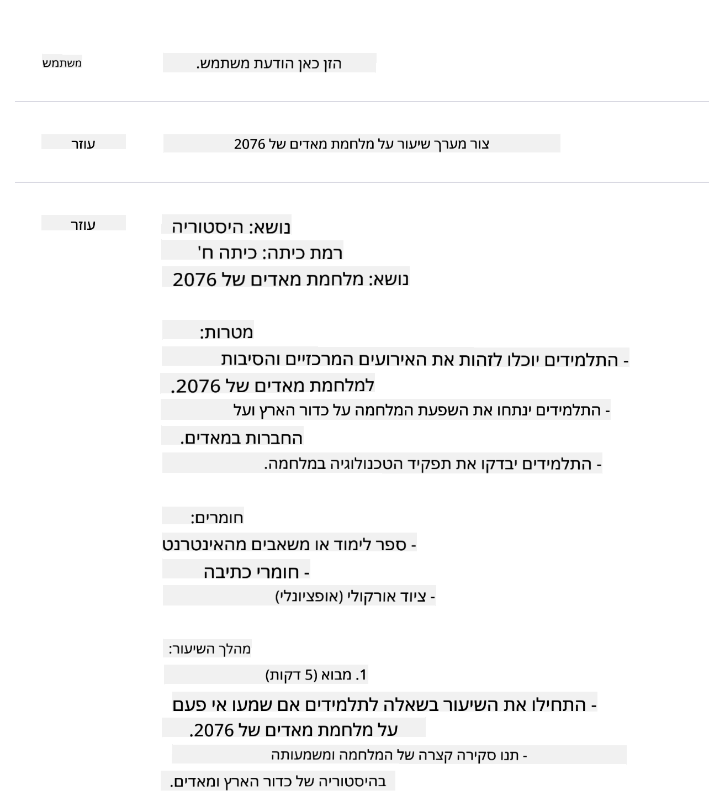
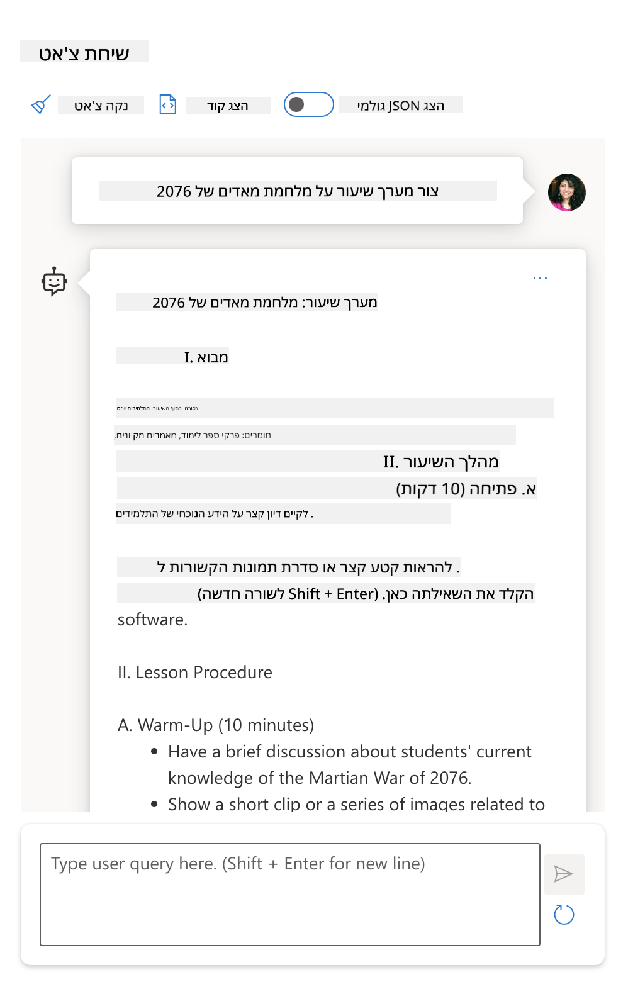

<!--
CO_OP_TRANSLATOR_METADATA:
{
  "original_hash": "0135e6c271f3ece8699050d4debbce88",
  "translation_date": "2025-10-17T20:08:10+00:00",
  "source_file": "04-prompt-engineering-fundamentals/README.md",
  "language_code": "he"
}
-->
# יסודות הנדסת הנחיות

[](https://youtu.be/GElCu2kUlRs?si=qrXsBvXnCW12epb8)

## מבוא
מודול זה מכסה מושגים וטכניקות חיוניות ליצירת הנחיות אפקטיביות במודלים של AI גנרטיבי. הדרך שבה אתם כותבים את ההנחיה שלכם ל-LLM חשובה גם היא. הנחיה שנכתבה בקפידה יכולה להוביל לתגובה איכותית יותר. אבל מה בדיוק משמעותם של מונחים כמו _הנחיה_ ו-הנדסת הנחיות_? ואיך אני יכול לשפר את קלט ההנחיה שאני שולח ל-LLM? אלו השאלות שננסה לענות עליהן בפרק זה ובפרק הבא.

_AI גנרטיבי_ מסוגל ליצור תוכן חדש (לדוגמה, טקסט, תמונות, אודיו, קוד וכו') בתגובה לבקשות משתמשים. הוא משיג זאת באמצעות _מודלים שפתיים גדולים_ כמו סדרת GPT ("Generative Pre-trained Transformer") של OpenAI, שמאומנים לשימוש בשפה טבעית ובקוד.

כעת משתמשים יכולים לתקשר עם מודלים אלו באמצעות פרדיגמות מוכרות כמו צ'אט, ללא צורך בידע טכני או הכשרה. המודלים מבוססי הנחיות - משתמשים שולחים קלט טקסט (הנחיה) ומקבלים בחזרה את תגובת ה-AI (השלמה). הם יכולים "לשוחח עם ה-AI" באופן איטרטיבי, בשיחות רב-סיבוביות, ולשפר את ההנחיה שלהם עד שהתגובה תתאים לציפיותיהם.

"הנחיות" הופכות כעת לממשק _תכנות_ ראשי עבור אפליקציות AI גנרטיבי, שמנחות את המודלים מה לעשות ומשפיעות על איכות התגובות המוחזרות. "הנדסת הנחיות" היא תחום מחקר שמתפתח במהירות ומתמקד ב_עיצוב ואופטימיזציה_ של הנחיות כדי לספק תגובות עקביות ואיכותיות בקנה מידה רחב.

## מטרות למידה

בשיעור זה נלמד מהי הנדסת הנחיות, מדוע היא חשובה, וכיצד נוכל ליצור הנחיות אפקטיביות יותר עבור מודל ומטרת אפליקציה נתונה. נבין מושגים מרכזיים ופרקטיקות מומלצות להנדסת הנחיות - ונלמד על סביבת "ארגז חול" אינטראקטיבית ב-Jupyter Notebooks שבה נוכל לראות את היישום של מושגים אלו בדוגמאות אמיתיות.

בסוף השיעור נוכל:

1. להסביר מהי הנדסת הנחיות ולמה היא חשובה.
2. לתאר את מרכיבי ההנחיה וכיצד הם משמשים.
3. ללמוד פרקטיקות וטכניקות מומלצות להנדסת הנחיות.
4. ליישם טכניקות שנלמדו בדוגמאות אמיתיות, באמצעות נקודת קצה של OpenAI.

## מונחים מרכזיים

הנדסת הנחיות: הפרקטיקה של עיצוב ושיפור קלטים כדי להנחות מודלי AI לייצר פלטים רצויים.
טוקניזציה: תהליך המרת טקסט ליחידות קטנות יותר, הנקראות טוקנים, שהמודל יכול להבין ולעבד.
LLMs מכווני הוראות: מודלים שפתיים גדולים (LLMs) שעברו כיוונון עדין עם הוראות ספציפיות כדי לשפר את דיוק ורלוונטיות התגובות שלהם.

## ארגז חול ללמידה

הנדסת הנחיות היא כיום יותר אמנות מאשר מדע. הדרך הטובה ביותר לשפר את האינטואיציה שלנו לגביה היא _לתרגל יותר_ ולאמץ גישה של ניסוי וטעייה שמשלבת מומחיות בתחום היישום עם טכניקות מומלצות ואופטימיזציות ספציפיות למודל.

ה-Jupyter Notebook שמלווה את השיעור מספק סביבת _ארגז חול_ שבה תוכלו לנסות את מה שלמדתם - תוך כדי או כחלק מאתגר הקוד בסוף. כדי לבצע את התרגילים, תצטרכו:

1. **מפתח API של Azure OpenAI** - נקודת השירות למודל LLM שהופעל.
2. **סביבת ריצה של Python** - שבה ניתן להפעיל את ה-Notebook.
3. **משתני סביבה מקומיים** - _השלימו את [ההגדרות](./../00-course-setup/02-setup-local.md?WT.mc_id=academic-105485-koreyst) עכשיו כדי להתכונן_.

ה-Notebook מגיע עם תרגילים _מתחילים_ - אך מומלץ להוסיף קטעי _Markdown_ (תיאור) ו_קוד_ (בקשות הנחיה) משלכם כדי לנסות דוגמאות או רעיונות נוספים - ולבנות את האינטואיציה שלכם לעיצוב הנחיות.

## מדריך מאויר

רוצים לקבל תמונה כללית של מה שהשיעור הזה מכסה לפני שאתם צוללים פנימה? עיינו במדריך המאויר הזה, שמעניק לכם תחושה של הנושאים המרכזיים המכוסים ושל התובנות המרכזיות שכדאי לכם לחשוב עליהן בכל אחד מהם. מפת הדרכים של השיעור לוקחת אתכם מהבנת המושגים והאתגרים המרכזיים להתמודדות איתם באמצעות טכניקות הנדסת הנחיות רלוונטיות ופרקטיקות מומלצות. שימו לב שקטע "טכניקות מתקדמות" במדריך זה מתייחס לתוכן שמכוסה בפרק _הבא_ של תכנית הלימודים הזו.


## הסטארטאפ שלנו

עכשיו, בואו נדבר על איך _הנושא הזה_ קשור למשימה של הסטארטאפ שלנו ל[הביא חדשנות AI לחינוך](https://educationblog.microsoft.com/2023/06/collaborating-to-bring-ai-innovation-to-education?WT.mc_id=academic-105485-koreyst). אנחנו רוצים לבנות אפליקציות מבוססות AI ללמידה _מותאמת אישית_ - אז בואו נחשוב איך משתמשים שונים באפליקציה שלנו עשויים "לעצב" הנחיות:

- **מנהלים** עשויים לבקש מה-AI _לנתח נתוני תכנית לימודים כדי לזהות פערים בכיסוי_. ה-AI יכול לסכם תוצאות או להציג אותן בצורה חזותית עם קוד.
- **מורים** עשויים לבקש מה-AI _ליצור תכנית שיעור לקהל יעד ונושא מסוים_. ה-AI יכול לבנות את התכנית המותאמת בפורמט מוגדר.
- **תלמידים** עשויים לבקש מה-AI _ללמד אותם נושא קשה_. ה-AI יכול להנחות את התלמידים עם שיעורים, רמזים ודוגמאות המותאמים לרמתם.

וזה רק קצה הקרחון. עיינו ב-[הנחיות לחינוך](https://github.com/microsoft/prompts-for-edu/tree/main?WT.mc_id=academic-105485-koreyst) - ספריית הנחיות בקוד פתוח שאצרו מומחי חינוך - כדי לקבל תחושה רחבה יותר של האפשרויות! _נסו להריץ כמה מההנחיות הללו בארגז החול או באמצעות OpenAI Playground כדי לראות מה קורה!_

<!--
תבנית שיעור:
יחידה זו צריכה לכסות מושג מרכזי #1.
חזקו את המושג עם דוגמאות והפניות.

מושג #1:
הנדסת הנחיות.
הגדירו אותו והסבירו מדוע הוא נחוץ.
-->

## מהי הנדסת הנחיות?

התחלנו את השיעור בהגדרת **הנדסת הנחיות** כתהליך של _עיצוב ואופטימיזציה_ של קלטי טקסט (הנחיות) כדי לספק תגובות עקביות ואיכותיות (השלמות) עבור מטרת אפליקציה ומודל נתונה. ניתן לחשוב על כך כתהליך דו-שלבי:

- _עיצוב_ ההנחיה הראשונית עבור מודל ומטרה נתונה
- _שיפור_ ההנחיה באופן איטרטיבי כדי לשפר את איכות התגובה

זהו תהליך של ניסוי וטעייה שמחייב אינטואיציה ומאמץ מצד המשתמש כדי להשיג תוצאות מיטביות. אז למה זה חשוב? כדי לענות על השאלה הזו, קודם כל עלינו להבין שלושה מושגים:

- _טוקניזציה_ = איך המודל "רואה" את ההנחיה
- _מודלי בסיס_ = איך מודל הבסיס "מעבד" הנחיה
- _מודלים מכווני הוראות_ = איך המודל יכול כעת לראות "משימות"

### טוקניזציה

LLM רואה הנחיות כ_רצף של טוקנים_ שבו מודלים שונים (או גרסאות של מודל) יכולים לבצע טוקניזציה של אותה הנחיה בדרכים שונות. מכיוון ש-LLMs מאומנים על טוקנים (ולא על טקסט גולמי), הדרך שבה הנחיות מתבצעות טוקניזציה משפיעה ישירות על איכות התגובה שנוצרת.

כדי לקבל אינטואיציה לגבי איך טוקניזציה עובדת, נסו כלים כמו [OpenAI Tokenizer](https://platform.openai.com/tokenizer?WT.mc_id=academic-105485-koreyst) שמוצג למטה. העתיקו את ההנחיה שלכם - ותראו איך היא מומרת לטוקנים, תוך שימת לב לאופן שבו מטופלים תווי רווח וסימני פיסוק. שימו לב שהדוגמה הזו מציגה מודל LLM ישן יותר (GPT-3) - כך שניסיון עם מודל חדש יותר עשוי להניב תוצאה שונה.


### מושג: מודלי בסיס

לאחר שההנחיה עוברת טוקניזציה, הפונקציה העיקרית של ["מודל הבסיס"](https://blog.gopenai.com/an-introduction-to-base-and-instruction-tuned-large-language-models-8de102c785a6?WT.mc_id=academic-105485-koreyst) היא לחזות את הטוקן הבא ברצף. מכיוון ש-LLMs מאומנים על מאגרי נתונים טקסטואליים עצומים, יש להם הבנה טובה של הקשרים הסטטיסטיים בין טוקנים והם יכולים לבצע את התחזית הזו בביטחון מסוים. שימו לב שהם לא מבינים את _המשמעות_ של המילים בהנחיה או בטוקן; הם פשוט רואים תבנית שהם יכולים "להשלים" עם התחזית הבאה שלהם. הם יכולים להמשיך לחזות את הרצף עד להפסקה על ידי התערבות המשתמש או תנאי שהוגדר מראש.

רוצים לראות איך השלמה מבוססת הנחיה עובדת? הכניסו את ההנחיה לעיל ל-Azure OpenAI Studio [_Chat Playground_](https://oai.azure.com/playground?WT.mc_id=academic-105485-koreyst) עם ההגדרות המוגדרות כברירת מחדל. המערכת מוגדרת להתייחס להנחיות כבקשות למידע - כך שתראו השלמה שמספקת את ההקשר הזה.

אבל מה אם המשתמש רצה לראות משהו ספציפי שעונה על קריטריונים או מטרת משימה מסוימת? כאן נכנסים לתמונה _מודלים מכווני הוראות_.


### מושג: מודלים מכווני הוראות

[מודל מכוון הוראות](https://blog.gopenai.com/an-introduction-to-base-and-instruction-tuned-large-language-models-8de102c785a6?WT.mc_id=academic-105485-koreyst) מתחיל עם מודל הבסיס ומכוונן אותו עם דוגמאות או זוגות קלט/פלט (לדוגמה, "הודעות" רב-סיבוביות) שיכולות להכיל הוראות ברורות - והתגובה מה-AI מנסה לעקוב אחרי ההוראה הזו.

זה משתמש בטכניקות כמו למידת חיזוק עם משוב אנושי (RLHF) שיכולות לאמן את המודל ל_עקוב אחרי הוראות_ ול_ללמוד ממשוב_ כך שהוא יפיק תגובות שמתאימות יותר ליישומים מעשיים ורלוונטיות יותר למטרות המשתמש.

בואו ננסה את זה - חזרו להנחיה לעיל, אבל עכשיו שנו את _הודעת המערכת_ כדי לספק את ההוראה הבאה כהקשר:

> _סכם את התוכן שסופק לך עבור תלמיד כיתה ב'. שמור את התוצאה לפסקה אחת עם 3-5 נקודות._

ראו איך התוצאה כעת מכוונת לשקף את המטרה והפורמט הרצויים? מורה יכול כעת להשתמש ישירות בתגובה הזו בשקפים לשיעור שלו.


## למה אנחנו צריכים הנדסת הנחיות?

עכשיו כשאנחנו יודעים איך הנחיות מעובדות על ידי LLMs, בואו נדבר על _למה_ אנחנו צריכים הנדסת הנחיות. התשובה טמונה בעובדה שמודלים LLM נוכחיים מציבים מספר אתגרים שהופכים את ההשגת _השלמות אמינות ועקביות_ למאתגרת יותר ללא השקעת מאמץ בבניית ואופטימיזציית הנחיות. לדוגמה:

1. **תגובות המודל הן סטוכסטיות.** אותה _הנחיה_ עשויה להפיק תגובות שונות עם מודלים שונים או גרסאות מודל שונות. והיא עשויה אפילו להפיק תוצאות שונות עם _אותו מודל_ בזמנים שונים. _טכניקות הנדסת הנחיות יכולות לעזור לנו למזער את השונות הזו על ידי מתן מסגרות ברורות יותר_.

1. **מודלים יכולים להמציא תגובות.** מודלים מאומנים עם מאגרי נתונים _גדולים אך סופיים_, כלומר הם חסרים ידע על מושגים מחוץ להיקף האימון הזה. כתוצאה מכך, הם יכולים להפיק השלמות שאינן מדויקות, דמיוניות או סותרות ישירות עובדות ידועות. _טכניקות הנדסת הנחיות עוזרות למשתמשים לזהות ולהפחית המצאות כאלה, לדוגמה, על ידי בקשת ציטוטים או הסברים מה-AI_.

1. **יכולות המודלים משתנות.** מודלים חדשים או דורות מודלים חדשים יהיו בעלי יכולות עשירות יותר אך גם יביאו עימם מוזרויות ייחודיות ופשרות בעלות ומורכבות. _הנדסת הנחיות יכולה לעזור לנו לפתח פרקטיקות מומלצות ותהליכי עבודה שמפשטים את ההבדלים ומסתגלים לדרישות ספציפיות למודל בדרכים ניתנות להרחבה וללא תקלות_.

בואו נראה את זה בפעולה ב-OpenAI או Azure OpenAI Playground:

- השתמשו באותה הנחיה עם פריסות LLM שונות (לדוגמה, OpenAI, Azure OpenAI, Hugging Face) - האם ראיתם את השונות?
- השתמשו באותה הנחיה שוב ושוב עם אותה _פריסת LLM_ (לדוגמה, Azure OpenAI Playground) - איך השונות הזו השתנתה?

### דוגמת המצאות

בקורס זה, אנו משתמשים במונח **"המצאה"** כדי להתייחס לתופעה שבה LLMs לעיתים מייצרים מידע שגוי מבחינה עובדתית עקב מגבלות באימון שלהם או מגבלות אחרות. ייתכן שגם שמעתם על כך כ_הזיות_ במאמרים פופולריים או מחקרים. עם זאת, אנו ממליצים בחום להשתמש במונח _"המצאה"_ כדי שלא נייחס בטעות תכונה אנושית לתוצאה שמונעת על ידי מכונה. זה גם מחזק את [הנחיות ה-AI האחראי](https://www.microsoft.com/ai/responsible-ai?WT.mc_id=academic-105485-koreyst) מנקודת מבט של טרמינולוגיה, ומסיר מונחים שעשויים להיחשב פוגעניים או לא כוללניים בהקשרים מסוימים.

רוצים לקבל תחושה של איך המצאות עובדות? חשבו על הנחיה שמנחה את ה-AI לייצר תוכן עבור נושא שאינו קיים (כדי להבטיח שהוא לא נמצא במאגר האימון). לדוגמה - ניסיתי את ההנחיה הזו:

> **הנחיה:** צור תכנית שיעור על מלחמת מאדים של שנת 2076.
חיפוש באינטרנט הראה לי שישנם סיפורים בדיוניים (לדוגמה, סדרות טלוויזיה או ספרים) על מלחמות במאדים - אך אף אחד מהם לא התרחש בשנת 2076. ההיגיון הבריא גם אומר לנו ש-2076 היא _בעתיד_ ולכן לא יכולה להיות קשורה לאירוע אמיתי.

אז מה קורה כשמריצים את השאלה הזו עם ספקי מודלים שונים?

> **תגובה 1**: OpenAI Playground (GPT-35)



> **תגובה 2**: Azure OpenAI Playground (GPT-35)



> **תגובה 3**: Hugging Face Chat Playground (LLama-2)


כצפוי, כל מודל (או גרסה של מודל) מייצר תגובות מעט שונות בזכות התנהגות סטוכסטית והבדלים ביכולות המודל. לדוגמה, מודל אחד מכוון לקהל יעד של תלמידי כיתה ח', בעוד שהשני מניח קהל של תלמידי תיכון. אך כל שלושת המודלים יצרו תגובות שיכולות לשכנע משתמש לא מיודע שהאירוע היה אמיתי.

טכניקות הנדסת שאלות כמו _מטה-שאלות_ ו_הגדרת טמפרטורה_ עשויות להפחית את ההמצאות של המודל במידה מסוימת. ארכיטקטורות חדשות של הנדסת שאלות משלבות גם כלים וטכניקות חדשות בצורה חלקה בתוך זרימת השאלה, כדי למזער או להפחית חלק מההשפעות הללו.

## מחקר מקרה: GitHub Copilot

נסיים את החלק הזה בהבנה כיצד הנדסת שאלות משמשת בפתרונות בעולם האמיתי על ידי בחינת מחקר מקרה: [GitHub Copilot](https://github.com/features/copilot?WT.mc_id=academic-105485-koreyst).

GitHub Copilot הוא "מתכנת זוגי מבוסס AI" - הוא ממיר שאלות טקסט להשלמות קוד ומשולב בסביבת הפיתוח שלך (לדוגמה, Visual Studio Code) לחוויית משתמש חלקה. כפי שמתועד בסדרת הבלוגים למטה, הגרסה הראשונה התבססה על מודל OpenAI Codex - כאשר המהנדסים הבינו במהירות את הצורך לכוונן את המודל ולפתח טכניקות הנדסת שאלות טובות יותר, כדי לשפר את איכות הקוד. ביולי, הם [השיקו מודל AI משופר שמתקדם מעבר ל-Codex](https://github.blog/2023-07-28-smarter-more-efficient-coding-github-copilot-goes-beyond-codex-with-improved-ai-model/?WT.mc_id=academic-105485-koreyst) להצעות מהירות יותר.

קראו את הפוסטים לפי הסדר, כדי לעקוב אחר מסע הלמידה שלהם.

- **מאי 2023** | [GitHub Copilot משתפר בהבנת הקוד שלך](https://github.blog/2023-05-17-how-github-copilot-is-getting-better-at-understanding-your-code/?WT.mc_id=academic-105485-koreyst)
- **מאי 2023** | [בתוך GitHub: עבודה עם LLMs מאחורי GitHub Copilot](https://github.blog/2023-05-17-inside-github-working-with-the-llms-behind-github-copilot/?WT.mc_id=academic-105485-koreyst).
- **יוני 2023** | [איך לכתוב שאלות טובות יותר ל-GitHub Copilot](https://github.blog/2023-06-20-how-to-write-better-prompts-for-github-copilot/?WT.mc_id=academic-105485-koreyst).
- **יולי 2023** | [GitHub Copilot מתקדם מעבר ל-Codex עם מודל AI משופר](https://github.blog/2023-07-28-smarter-more-efficient-coding-github-copilot-goes-beyond-codex-with-improved-ai-model/?WT.mc_id=academic-105485-koreyst)
- **יולי 2023** | [מדריך למפתחים להנדסת שאלות ו-LLMs](https://github.blog/2023-07-17-prompt-engineering-guide-generative-ai-llms/?WT.mc_id=academic-105485-koreyst)
- **ספטמבר 2023** | [איך לבנות אפליקציית LLM ארגונית: שיעורים מ-GitHub Copilot](https://github.blog/2023-09-06-how-to-build-an-enterprise-llm-application-lessons-from-github-copilot/?WT.mc_id=academic-105485-koreyst)

ניתן גם לעיין ב[בלוג ההנדסה שלהם](https://github.blog/category/engineering/?WT.mc_id=academic-105485-koreyst) לפוסטים נוספים כמו [זה](https://github.blog/2023-09-27-how-i-used-github-copilot-chat-to-build-a-reactjs-gallery-prototype/?WT.mc_id=academic-105485-koreyst) שמראה כיצד מודלים וטכניקות אלו _מיושמים_ ליצירת אפליקציות בעולם האמיתי.

---

## בניית שאלות

ראינו מדוע הנדסת שאלות חשובה - עכשיו נבין כיצד שאלות _נבנות_ כדי שנוכל להעריך טכניקות שונות לעיצוב שאלות יעיל יותר.

### שאלה בסיסית

נתחיל עם שאלה בסיסית: קלט טקסט שנשלח למודל ללא הקשר נוסף. הנה דוגמה - כששולחים את המילים הראשונות של ההמנון הלאומי של ארצות הברית ל-[Completion API](https://platform.openai.com/docs/api-reference/completions?WT.mc_id=academic-105485-koreyst) של OpenAI, הוא מיד _משלים_ את התגובה עם השורות הבאות, ומדגים את התנהגות החיזוי הבסיסית.

| שאלה (קלט)       | השלמה (פלט)                                                                                                                        |
| :--------------- | :--------------------------------------------------------------------------------------------------------------------------------- |
| Oh say can you see | נראה שאתה מתחיל את מילות השיר "The Star-Spangled Banner", ההמנון הלאומי של ארצות הברית. המילים המלאות הן ... |

### שאלה מורכבת

עכשיו נוסיף הקשר והוראות לשאלה הבסיסית. [Chat Completion API](https://learn.microsoft.com/azure/ai-services/openai/how-to/chatgpt?WT.mc_id=academic-105485-koreyst) מאפשר לנו לבנות שאלה מורכבת כאוסף של _הודעות_ עם:

- זוגות קלט/פלט המשקפים קלט _משתמש_ ותגובה _עוזר_.
- הודעת מערכת שמגדירה את ההקשר להתנהגות או אישיות העוזר.

הבקשה עכשיו בצורה הבאה, שבה ה_טוקניזציה_ למעשה לוכדת מידע רלוונטי מההקשר והשיחה. כעת, שינוי הקשר המערכת יכול להיות בעל השפעה רבה על איכות ההשלמות, כמו הקלטים שהמשתמש מספק.

```python
response = openai.chat.completions.create(
    model="gpt-3.5-turbo",
    messages=[
        {"role": "system", "content": "You are a helpful assistant."},
        {"role": "user", "content": "Who won the world series in 2020?"},
        {"role": "assistant", "content": "The Los Angeles Dodgers won the World Series in 2020."},
        {"role": "user", "content": "Where was it played?"}
    ]
)
```

### שאלה עם הוראות

בדוגמאות לעיל, השאלה של המשתמש הייתה שאילתה טקסט פשוטה שניתן לפרש אותה כבקשה למידע. עם שאלות _הוראה_, ניתן להשתמש בטקסט הזה כדי לציין משימה בפירוט רב יותר, ולספק הנחיות טובות יותר ל-AI. הנה דוגמה:

| שאלה (קלט)                                                                                                                                                                                                                         | השלמה (פלט)                                                                                                        | סוג הוראה          |
| :------------------------------------------------------------------------------------------------------------------------------------------------------------------------------------------------------------------------------------- | :------------------------------------------------------------------------------------------------------------------------- | :------------------ |
| כתוב תיאור של מלחמת האזרחים                                                                                                                                                                                                   | _הוחזר פסקה פשוטה_                                                                                              | פשוט              |
| כתוב תיאור של מלחמת האזרחים. ספק תאריכים ואירועים מרכזיים ותאר את משמעותם                                                                                                                                     | _הוחזר פסקה ואחריה רשימה של תאריכים מרכזיים עם תיאורים_                                             | מורכב             |
| כתוב תיאור של מלחמת האזרחים בפסקה אחת. ספק 3 נקודות עם תאריכים מרכזיים ומשמעותם. ספק 3 נקודות נוספות עם דמויות היסטוריות מרכזיות ותרומתן. החזר את הפלט כקובץ JSON | _הוחזר מידע מפורט יותר בתיבת טקסט, מעוצב כ-JSON שניתן להעתיק ולהדביק לקובץ ולבדוק לפי הצורך_ | מורכב. מעוצב. |

## תוכן ראשי

בדוגמאות לעיל, השאלה עדיין הייתה די פתוחה, מה שאיפשר ל-LLM להחליט איזה חלק ממאגר הנתונים המוקדם שלו רלוונטי. עם דפוס עיצוב _תוכן ראשי_, טקסט הקלט מחולק לשני חלקים:

- הוראה (פעולה)
- תוכן רלוונטי (שמשפיע על הפעולה)

הנה דוגמה שבה ההוראה היא "סכם את זה בשני משפטים".

| שאלה (קלט)                                                                                                                                                                                                                                                                                                                                                                                                                                                                                                                                                                                                                                                                                      | השלמה (פלט)                                                                                                                                                                                                                                                                             |
| :-------------------------------------------------------------------------------------------------------------------------------------------------------------------------------------------------------------------------------------------------------------------------------------------------------------------------------------------------------------------------------------------------------------------------------------------------------------------------------------------------------------------------------------------------------------------------------------------------------------------------------------------------------------------------------------------------- | :---------------------------------------------------------------------------------------------------------------------------------------------------------------------------------------------------------------------------------------------------------------------------------------------- |
| צדק הוא הכוכב החמישי מהשמש והגדול ביותר במערכת השמש. הוא ענק גזי עם מסה של אלפית מזו של השמש, אך פי שניים וחצי מזו של כל שאר הכוכבים במערכת השמש יחד. צדק הוא אחד מהעצמים הבהירים ביותר הנראים לעין בלתי מזוינת בשמי הלילה, והוא ידוע לציוויליזציות עתיקות מאז לפני ההיסטוריה המתועדת. הוא נקרא על שם האל הרומי צדק.[19] כאשר נצפה מכדור הארץ, צדק יכול להיות בהיר מספיק כדי שאורו המוחזר יטיל צללים נראים,[20] והוא בממוצע העצם הטבעי השלישי הבהיר ביותר בשמי הלילה אחרי הירח ונוגה. <br/> **סכם את זה בשני משפטים קצרים** | צדק, הכוכב החמישי מהשמש, הוא הגדול ביותר במערכת השמש ונחשב לאחד מהעצמים הבהירים ביותר בשמי הלילה. הוא נקרא על שם האל הרומי צדק, והוא ענק גזי עם מסה פי שניים וחצי מזו של כל שאר הכוכבים במערכת השמש יחד. |

קטע התוכן הראשי יכול לשמש בדרכים שונות כדי להניע הוראות יעילות יותר:

- **דוגמאות** - במקום לומר למודל מה לעשות עם הוראה מפורשת, תנו לו דוגמאות למה לעשות ותנו לו להסיק את הדפוס.
- **רמזים** - עקבו אחרי ההוראה עם "רמז" שמכוון את ההשלמה, ומנחה את המודל לתגובות רלוונטיות יותר.
- **תבניות** - אלו "מתכונים" חוזרים לשאלות עם מקומות (משתנים) שניתן להתאים עם נתונים לשימושים ספציפיים.

בואו נחקור את זה בפעולה.

### שימוש בדוגמאות

זו גישה שבה משתמשים בתוכן הראשי כדי "להאכיל את המודל" בכמה דוגמאות של הפלט הרצוי עבור הוראה נתונה, ונותנים לו להסיק את הדפוס לפלט הרצוי. בהתבסס על מספר הדוגמאות שסופקו, ניתן לקבל שאלות ללא דוגמאות, עם דוגמה אחת, עם כמה דוגמאות וכו'.

השאלה עכשיו מורכבת משלושה רכיבים:

- תיאור משימה
- כמה דוגמאות של הפלט הרצוי
- התחלה של דוגמה חדשה (שנעשית תיאור משימה מרומז)

| סוג למידה | שאלה (קלט)                                                                                                                                        | השלמה (פלט)         |
| :------------ | :---------------------------------------------------------------------------------------------------------------------------------------------------- | :-------------------------- |
| ללא דוגמאות     | "The Sun is Shining". Translate to Spanish                                                                                                            | "El Sol está brillando".    |
| דוגמה אחת      | "The Sun is Shining" => ""El Sol está brillando". <br> "It's a Cold and Windy Day" =>                                                                 | "Es un día frío y ventoso". |
| כמה דוגמאות      | The player ran the bases => Baseball <br/> The player hit an ace => Tennis <br/> The player hit a six => Cricket <br/> The player made a slam-dunk => | Basketball                  |
|               |                                                                                                                                                       |                             |

שימו לב כיצד היינו צריכים לספק הוראה מפורשת ("Translate to Spanish") בשאלות ללא דוגמאות, אך היא מוסקת בדוגמה אחת. הדוגמה עם כמה דוגמאות מראה כיצד הוספת דוגמאות נוספות מאפשרת למודלים להסיק בצורה מדויקת יותר ללא הוראות נוספות.

### רמזים לשאלה

טכניקה נוספת לשימוש בתוכן ראשי היא לספק _רמזים_ במקום דוגמאות. במקרה זה, אנו נותנים למודל דחיפה בכיוון הנכון על ידי _התחלתו_ עם קטע שמשקף את פורמט התגובה הרצוי. המודל אז "לוקח את הרמז" וממשיך באותו כיוון.

| מספר רמזים | שאלה (קלט)                                                                                                                                                                                                                                                                                                                                                                                                                                               | השלמה (פלט)                                                                                                                                                                                                                                                                                       |
| :------------- | :----------------------------------------------------------------------------------------------------------------------------------------------------------------------------------------------------------------------------------------------------------------------------------------------------------------------------------------------------------------------------------------------------------------------------------------------------------- | :-------------------------------------------------------------------------------------------------------------------------------------------------------------------------------------------------------------------------------------------------------------------------------------------------------- |
| 0              | צדק הוא הכוכב החמישי מהשמש והגדול ביותר במערכת השמש. הוא ענק גזי עם מסה של אלפית מזו של השמש, אך פי שניים וחצי מזו של כל שאר הכוכבים במערכת השמש יחד. צדק הוא אחד מהעצמים הבהירים ביותר הנראים לעין בלתי מזוינת בשמי הלילה, והוא ידוע לציוויליזציות עתיקות מאז לפני ההיסטוריה המתועדת. <br/>**סכם את זה**                                       | צדק הוא הכוכב הגדול ביותר במערכת השמש והחמישי מהשמש. הוא ענק גזי עם מסה של אלפית מזו של השמש, אך כבד יותר מכל שאר הכוכבים יחד. ציוויליזציות עתיקות הכירו את צדק זמן רב, והוא נראה בקלות בשמי הלילה. |
| 1              | צדק הוא הכוכב החמישי מהשמש והגדול ביותר במערכת השמש. הוא ענק גזי עם מסה שהיא אלפית ממסת השמש, אך פי שניים וחצי ממסת כל שאר הכוכבים במערכת השמש יחד. צדק הוא אחד מהעצמים הבהירים ביותר שניתן לראות בעין בלתי מזוינת בשמי הלילה, והוא היה מוכר לציוויליזציות עתיקות עוד לפני תחילת ההיסטוריה המתועדת. <br/>**סכם זאת** <br/> מה שלמדנו הוא שצדק | הוא הכוכב החמישי מהשמש והגדול ביותר במערכת השמש. הוא ענק גזי עם מסה שהיא אלפית ממסת השמש, אך פי שניים וחצי ממסת כל שאר הכוכבים יחד. ניתן לראות אותו בקלות בעין בלתי מזוינת והוא היה מוכר מאז ימי קדם.                        |
| 2              | צדק הוא הכוכב החמישי מהשמש והגדול ביותר במערכת השמש. הוא ענק גזי עם מסה שהיא אלפית ממסת השמש, אך פי שניים וחצי ממסת כל שאר הכוכבים במערכת השמש יחד. צדק הוא אחד מהעצמים הבהירים ביותר שניתן לראות בעין בלתי מזוינת בשמי הלילה, והוא היה מוכר לציוויליזציות עתיקות עוד לפני תחילת ההיסטוריה המתועדת. <br/>**סכם זאת** <br/> 3 עובדות עיקריות שלמדנו:         | 1. צדק הוא הכוכב החמישי מהשמש והגדול ביותר במערכת השמש. <br/> 2. הוא ענק גזי עם מסה שהיא אלפית ממסת השמש...<br/> 3. צדק היה נראה לעין בלתי מזוינת מאז ימי קדם ...                                                                       |
|                |                                                                                                                                                                                                                                                                                                                                                                                                                                                              |                                                                                                                                                                                                                                                                                                           |

### תבניות הנחיה

תבנית הנחיה היא _מתכון מוגדר מראש להנחיה_ שניתן לשמור ולהשתמש בו לפי הצורך, כדי ליצור חוויות משתמש עקביות בקנה מידה רחב. בצורה הפשוטה ביותר, מדובר באוסף של דוגמאות הנחיה כמו [זו מ-OpenAI](https://platform.openai.com/examples?WT.mc_id=academic-105485-koreyst) שמספקת גם את רכיבי ההנחיה האינטראקטיביים (הודעות משתמש ומערכת) וגם את פורמט הבקשה המונעת על ידי API - כדי לתמוך בשימוש חוזר.

בצורה המורכבת יותר כמו [הדוגמה הזו מ-LangChain](https://python.langchain.com/docs/concepts/prompt_templates/?WT.mc_id=academic-105485-koreyst) היא מכילה _מקומות להחלפה_ שניתן להחליף בנתונים ממגוון מקורות (קלט משתמש, הקשר מערכת, מקורות נתונים חיצוניים וכו') כדי ליצור הנחיה באופן דינמי. זה מאפשר לנו ליצור ספרייה של הנחיות לשימוש חוזר שניתן להשתמש בהן כדי ליצור חוויות משתמש עקביות **באופן תכנותי** בקנה מידה רחב.

לבסוף, הערך האמיתי של תבניות טמון ביכולת ליצור ולפרסם _ספריות הנחיה_ עבור תחומי יישום אנכיים - כאשר תבנית ההנחיה כעת _מותאמת_ לשקף הקשר או דוגמאות ספציפיות ליישום שמגבירות את הרלוונטיות והדיוק של התגובות עבור קהל היעד. [הספרייה Prompts For Edu](https://github.com/microsoft/prompts-for-edu?WT.mc_id=academic-105485-koreyst) היא דוגמה מצוינת לגישה זו, שמאגדת ספרייה של הנחיות עבור תחום החינוך עם דגש על מטרות מפתח כמו תכנון שיעורים, עיצוב תוכניות לימודים, הדרכת תלמידים וכו'.

## תוכן תומך

אם נחשוב על בניית הנחיה כעל משימה (הוראה) ומטרה (תוכן עיקרי), אז _תוכן משני_ הוא כמו הקשר נוסף שאנו מספקים כדי **להשפיע על התוצאה בדרך כלשהי**. זה יכול להיות פרמטרים לכוונון, הוראות עיצוב, טקסונומיות נושא וכו' שיכולים לעזור למודל _להתאים_ את תגובתו כך שתתאים למטרות או ציפיות המשתמש הרצויות.

לדוגמה: בהתחשב בקטלוג קורסים עם מטא-נתונים נרחבים (שם, תיאור, רמה, תגי מטא, מרצה וכו') על כל הקורסים הזמינים בתוכנית הלימודים:

- אנו יכולים להגדיר הוראה ל"סכם את קטלוג הקורסים לסתיו 2023"
- אנו יכולים להשתמש בתוכן העיקרי כדי לספק כמה דוגמאות לתוצאה הרצויה
- אנו יכולים להשתמש בתוכן המשני כדי לזהות את 5 ה"תגים" המובילים שמעניינים אותנו.

כעת, המודל יכול לספק סיכום בפורמט שמוצג על ידי כמה דוגמאות - אך אם תוצאה מכילה מספר תגים, הוא יכול לתת עדיפות ל-5 התגים שזוהו בתוכן המשני.

---

<!--
תבנית שיעור:
יחידה זו צריכה לכסות את מושג הליבה #1.
חזק את המושג עם דוגמאות והפניות.

מושג #3:
טכניקות הנדסת הנחיה.
מהן כמה טכניקות בסיסיות להנדסת הנחיה?
הדגם זאת עם כמה תרגילים.
-->

## שיטות עבודה מומלצות להנחיה

עכשיו כשאנחנו יודעים איך ניתן _לבנות_ הנחיות, אנחנו יכולים להתחיל לחשוב איך _לעצב_ אותן כך שישקפו שיטות עבודה מומלצות. ניתן לחשוב על כך בשני חלקים - גישה נכונה ויישום טכניקות נכונות.

### גישת הנדסת הנחיה

הנדסת הנחיה היא תהליך של ניסוי וטעייה, ולכן יש לשמור על שלושה גורמים מנחים רחבים:

1. **הבנת התחום חשובה.** דיוק ורלוונטיות התגובה הם פונקציה של _התחום_ שבו היישום או המשתמש פועלים. השתמש באינטואיציה ובמומחיות התחום שלך כדי **להתאים טכניקות**. לדוגמה, הגדר _אישיות ספציפית לתחום_ בהנחיות המערכת שלך, או השתמש ב_תבניות ספציפיות לתחום_ בהנחיות המשתמש שלך. ספק תוכן משני שמשקף הקשרים ספציפיים לתחום, או השתמש ב_רמזים ודוגמאות ספציפיים לתחום_ כדי להנחות את המודל לעבר דפוסי שימוש מוכרים.

2. **הבנת המודל חשובה.** אנו יודעים שמודלים הם סטוכסטיים מטבעם. אך יישומי מודלים יכולים גם להשתנות מבחינת מערך הנתונים שבו הם משתמשים (ידע מוקדם), היכולות שהם מספקים (למשל, דרך API או SDK) וסוג התוכן שהם מותאמים אליו (למשל, קוד מול תמונות מול טקסט). הבן את החוזקות והמגבלות של המודל שבו אתה משתמש, והשתמש בידע זה כדי _לתעדף משימות_ או לבנות _תבניות מותאמות_ שמותאמות ליכולות המודל.

3. **חזרה ואימות חשובים.** מודלים מתפתחים במהירות, וכך גם הטכניקות להנדסת הנחיה. כמומחה תחום, ייתכן שיש לך הקשר או קריטריונים אחרים ליישום _שלך_ שאינם חלים על הקהילה הרחבה יותר. השתמש בכלי וטכניקות להנדסת הנחיה כדי "להתחיל" את בניית ההנחיה, ואז חזור ואמת את התוצאות באמצעות האינטואיציה והמומחיות שלך. תעד את התובנות שלך ויצר **בסיס ידע** (למשל, ספריות הנחיה) שניתן להשתמש בו כבסיס חדש על ידי אחרים, לצורך חזרות מהירות יותר בעתיד.

## שיטות עבודה מומלצות

כעת נבחן שיטות עבודה מומלצות שמומלצות על ידי [OpenAI](https://help.openai.com/en/articles/6654000-best-practices-for-prompt-engineering-with-openai-api?WT.mc_id=academic-105485-koreyst) ו-[Azure OpenAI](https://learn.microsoft.com/azure/ai-services/openai/concepts/prompt-engineering#best-practices?WT.mc_id=academic-105485-koreyst).

| מה                              | למה                                                                                                                                                                                                                                               |
| :-------------------------------- | :------------------------------------------------------------------------------------------------------------------------------------------------------------------------------------------------------------------------------------------------ |
| הערך את המודלים העדכניים ביותר.       | דורות מודלים חדשים עשויים לכלול תכונות ואיכות משופרות - אך עשויים גם לגרור עלויות גבוהות יותר. הערך את השפעתם, ואז קבל החלטות מעבר.                                                                                |
| הפרד בין הוראות להקשר   | בדוק אם המודל/הספק שלך מגדיר _מפרידים_ כדי להבחין בין הוראות, תוכן עיקרי ותוכן משני בצורה ברורה יותר. זה יכול לעזור למודלים להקצות משקל בצורה מדויקת יותר לטוקנים.                                                         |
| היה ספציפי וברור             | תן יותר פרטים על ההקשר הרצוי, התוצאה, האורך, הפורמט, הסגנון וכו'. זה ישפר גם את איכות התגובות וגם את עקביותן. שמור מתכונים בתבניות לשימוש חוזר.                                                          |
| היה תיאורי, השתמש בדוגמאות      | ייתכן שמודלים יגיבו טוב יותר לגישה של "הראה וספר". התחל בגישת `zero-shot` שבה אתה נותן הוראה (אך ללא דוגמאות) ואז נסה `few-shot` כעדכון, תוך מתן כמה דוגמאות לתוצאה הרצויה. השתמש באנלוגיות. |
| השתמש ברמזים כדי להתחיל השלמות | הכוון את המודל לעבר תוצאה רצויה על ידי מתן כמה מילים או ביטויים מובילים שהוא יכול להשתמש בהם כנקודת התחלה לתגובה.                                                                                                               |
| חזור על עצמך                       | לפעמים ייתכן שתצטרך לחזור על עצמך למודל. תן הוראות לפני ואחרי התוכן העיקרי שלך, השתמש בהוראה וברמז, וכו'. חזור ואמת כדי לראות מה עובד.                                                         |
| סדר חשוב                     | הסדר שבו אתה מציג מידע למודל עשוי להשפיע על התוצאה, אפילו בדוגמאות הלמידה, בזכות הטיה של מידע אחרון. נסה אפשרויות שונות כדי לראות מה עובד הכי טוב.                                                               |
| תן למודל "מוצא"           | תן למודל תגובת השלמה _חלופית_ שהוא יכול לספק אם הוא לא יכול להשלים את המשימה מסיבה כלשהי. זה יכול להפחית את הסיכויים שהמודלים ייצרו תגובות שגויות או מפוברקות.                                                         |
|                                   |                                                                                                                                                                                                                                                   |

כמו בכל שיטה מומלצת, זכור ש_התוצאות עשויות להשתנות_ בהתאם למודל, למשימה ולתחום. השתמש באלו כנקודת התחלה, וחזור כדי למצוא מה עובד הכי טוב עבורך. הערך מחדש את תהליך הנדסת ההנחיה שלך באופן קבוע ככל שמודלים וכלים חדשים הופכים לזמינים, תוך התמקדות בסקלביליות התהליך ובאיכות התגובות.

<!--
תבנית שיעור:
יחידה זו צריכה לספק אתגר קוד אם רלוונטי

אתגר:
קישור למחברת Jupyter עם רק הערות הקוד בהוראות (קטעי הקוד ריקים).

פתרון:
קישור להעתק של אותה מחברת עם ההנחיות מלאות ומופעלות, שמראה מה יכול להיות דוגמה אחת.
-->

## משימה

ברכות! הגעת לסוף השיעור! הגיע הזמן לבדוק כמה מהקונספטים והטכניקות עם דוגמאות אמיתיות!

למשימה שלנו, נשתמש במחברת Jupyter עם תרגילים שתוכל להשלים באופן אינטראקטיבי. תוכל גם להרחיב את המחברת עם תאי Markdown וקוד משלך כדי לחקור רעיונות וטכניקות בעצמך.

### כדי להתחיל, בצע fork למאגר, ואז

- (מומלץ) הפעל את GitHub Codespaces
- (לחלופין) שיבט את המאגר למכשיר המקומי שלך והשתמש בו עם Docker Desktop
- (לחלופין) פתח את המחברת עם סביבת הריצה המועדפת עליך למחברות.

### לאחר מכן, הגדר את משתני הסביבה שלך

- העתק את הקובץ `.env.copy` בשורש המאגר ל-`.env` ומלא את הערכים `AZURE_OPENAI_API_KEY`, `AZURE_OPENAI_ENDPOINT` ו-`AZURE_OPENAI_DEPLOYMENT`. חזור ל[סעיף ארגז החול ללמידה](../../../04-prompt-engineering-fundamentals/04-prompt-engineering-fundamentals) כדי ללמוד איך.

### לאחר מכן, פתח את מחברת Jupyter

- בחר את ליבת הריצה. אם אתה משתמש באפשרויות 1 או 2, פשוט בחר את ליבת Python 3.10.x המוגדרת כברירת מחדל שסופקה על ידי מיכל הפיתוח.

אתה מוכן להריץ את התרגילים. שים לב שאין כאן _תשובות נכונות או שגויות_ - רק חקר אפשרויות באמצעות ניסוי וטעייה ובניית אינטואיציה למה עובד עבור מודל ותחום יישום נתון.

_מסיבה זו אין קטעי פתרון קוד בשיעור זה. במקום זאת, המחברת תכלול תאי Markdown שכותרתם "הפתרון שלי:" שמציגים דוגמת פלט אחת לצורך התייחסות._

 <!--
תבנית שיעור:
סכם את הסעיף עם סיכום ומשאבים ללמידה עצמית.
-->

## בדיקת ידע

איזו מההנחיות הבאות היא הנחיה טובה בהתאם לשיטות עבודה מומלצות סבירות?

1. הראה לי תמונה של מכונית אדומה
2. הראה לי תמונה של מכונית אדומה מסוג וולוו ודגם XC90 חונה ליד צוק עם שקיעה
3. הראה לי תמונה של מכונית אדומה מסוג וולוו ודגם XC90

תשובה: 2, זו ההנחיה הטובה ביותר מכיוון שהיא מספקת פרטים על "מה" ונכנסת לספציפיות (לא סתם מכונית אלא סוג ודגם ספציפיים) והיא גם מתארת את ההקשר הכללי. 3 היא הבאה הטובה ביותר מכיוון שהיא גם מכילה הרבה תיאור.

## 🚀 אתגר

נסה להשתמש בטכניקת "רמז" עם ההנחיה: השלם את המשפט "הראה לי תמונה של מכונית אדומה מסוג וולוו ו". מה התגובה, ואיך היית משפר אותה?

## עבודה נהדרת! המשך ללמוד

רוצה ללמוד עוד על קונספטים שונים בהנדסת הנחיה? עבור לדף [למידה מתמשכת](https://aka.ms/genai-collection?WT.mc_id=academic-105485-koreyst) כדי למצוא משאבים נהדרים נוספים בנושא זה.

עבור לשיעור 5 שבו נבחן [טכניקות הנחיה מתקדמות](../05-advanced-prompts/README.md?WT.mc_id=academic-105485-koreyst)!

---

**כתב ויתור**:  
מסמך זה תורגם באמצעות שירות תרגום AI [Co-op Translator](https://github.com/Azure/co-op-translator). למרות שאנו שואפים לדיוק, יש להיות מודעים לכך שתרגומים אוטומטיים עשויים להכיל שגיאות או אי דיוקים. המסמך המקורי בשפתו המקורית צריך להיחשב כמקור סמכותי. עבור מידע קריטי, מומלץ להשתמש בתרגום מקצועי אנושי. איננו אחראים לאי הבנות או לפרשנויות שגויות הנובעות משימוש בתרגום זה.