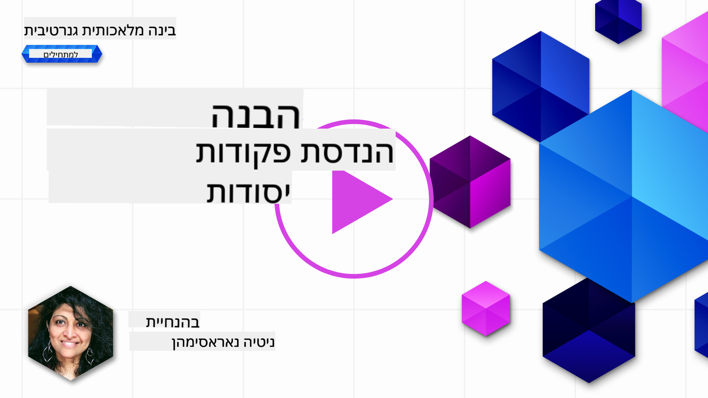
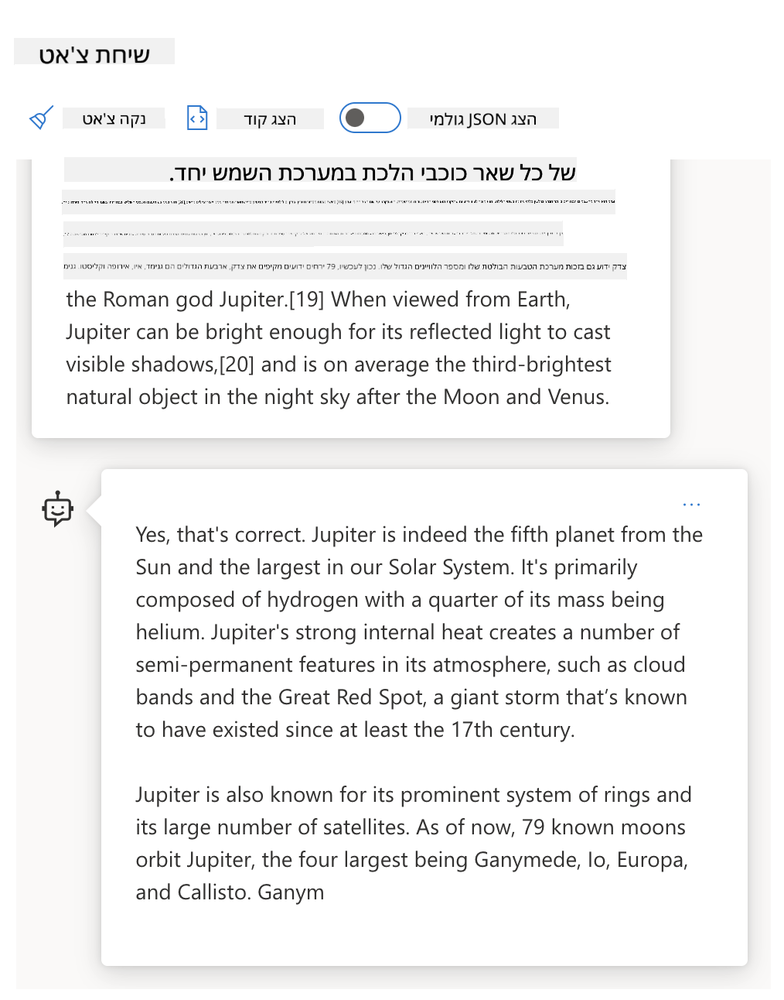

<!--
CO_OP_TRANSLATOR_METADATA:
{
  "original_hash": "a45c318dc6ebc2604f35b8b829f93af2",
  "translation_date": "2025-07-09T10:35:52+00:00",
  "source_file": "04-prompt-engineering-fundamentals/README.md",
  "language_code": "he"
}
-->
# יסודות הנדסת הפרומפטים

[](https://aka.ms/gen-ai-lesson4-gh?WT.mc_id=academic-105485-koreyst)

## מבוא  
מודול זה עוסק במושגים וטכניקות חיוניות ליצירת פרומפטים אפקטיביים במודלים של בינה מלאכותית יוצרת. האופן שבו אתם כותבים את הפרומפט ל-LLM חשוב גם הוא. פרומפט שנבנה בקפידה יכול להניב תגובה באיכות טובה יותר. אבל מה בעצם המשמעות של מונחים כמו _פרומפט_ ו-_הנדסת פרומפטים_? ואיך משפרים את ה-_קלט_ של הפרומפט שנשלח ל-LLM? אלו השאלות שננסה לענות עליהן בפרק הזה ובפרק הבא.

_בינה מלאכותית יוצרת_ מסוגלת ליצור תוכן חדש (למשל, טקסט, תמונות, אודיו, קוד ועוד) בתגובה לבקשות משתמש. היא עושה זאת באמצעות _מודלים לשוניים גדולים_ כמו סדרת GPT של OpenAI ("Generative Pre-trained Transformer") שמאומנים לשימוש בשפה טבעית ובקוד.

כעת משתמשים יכולים לתקשר עם המודלים האלה באמצעות פרדיגמות מוכרות כמו צ'אט, מבלי צורך בידע טכני או הכשרה. המודלים מבוססי _פרומפטים_ – המשתמשים שולחים קלט טקסטואלי (פרומפט) ומקבלים תגובת AI (השלמה). הם יכולים לנהל "שיחה עם ה-AI" באופן איטרטיבי, בשיחות מרובות סבבים, ולשפר את הפרומפט עד שהתגובה תתאים לציפיותיהם.

"הפרומפטים" הופכים כיום לממשק התכנותי העיקרי של אפליקציות בינה מלאכותית יוצרת, שמכוונות את המודלים מה לעשות ומשפיעות על איכות התגובות המוחזרות. "הנדסת פרומפטים" היא תחום מחקר מתפתח במהירות שמתמקד ב-_עיצוב ואופטימיזציה_ של פרומפטים כדי לספק תגובות עקביות ואיכותיות בקנה מידה.

## מטרות הלמידה

בשיעור זה נלמד מהי הנדסת פרומפטים, מדוע היא חשובה, ואיך ניתן ליצור פרומפטים יעילים יותר עבור מודל ומטרת יישום מסוימים. נבין מושגים מרכזיים ושיטות עבודה מומלצות להנדסת פרומפטים – ונכיר סביבת "סנדבוקס" אינטראקטיבית ב-Jupyter Notebooks שבה נוכל לראות את המושגים מיושמים בדוגמאות אמיתיות.

בסיום השיעור נוכל:

1. להסביר מהי הנדסת פרומפטים ולמה היא חשובה.  
2. לתאר את רכיבי הפרומפט ואיך משתמשים בהם.  
3. ללמוד שיטות עבודה מומלצות וטכניקות להנדסת פרומפטים.  
4. ליישם את הטכניקות שנלמדו בדוגמאות אמיתיות, באמצעות נקודת קצה של OpenAI.

## מונחים מרכזיים

הנדסת פרומפטים: תהליך עיצוב ושיפור הקלטים שמכוונים את מודלי ה-AI ליצירת פלטים רצויים.  
טוקניזציה: תהליך המרת טקסט ליחידות קטנות יותר, שנקראות טוקנים, שהמודל יכול להבין ולעבד.  
Instruction-Tuned LLMs: מודלים לשוניים גדולים (LLMs) שעברו כוונון עדין עם הוראות ספציפיות לשיפור דיוק ורלוונטיות התגובה.

## סנדבוקס ללמידה

הנדסת פרומפטים היא כיום יותר אמנות מאשר מדע. הדרך הטובה ביותר לשפר את האינטואיציה שלנו היא _לתרגל יותר_ ולאמץ גישת ניסוי וטעייה שמשלבת מומחיות בתחום היישום עם טכניקות מומלצות ואופטימיזציות ספציפיות למודל.

מחברת ה-Jupyter שמלווה את השיעור מספקת סביבת _סנדבוקס_ שבה תוכלו לנסות את מה שלמדתם – תוך כדי תנועה או כחלק מאתגר הקוד בסוף. כדי לבצע את התרגילים תזדקקו ל:

1. **מפתח API של Azure OpenAI** – נקודת הקצה לשירות של מודל LLM פרוס.  
2. **סביבת ריצה של Python** – שבה ניתן להריץ את המחברת.  
3. **משתני סביבה מקומיים** – _השלימו עכשיו את שלבי ה-[SETUP](./../00-course-setup/SETUP.md?WT.mc_id=academic-105485-koreyst) כדי להתכונן_.

המחברת מגיעה עם תרגילים _מתחילים_ – אך מומלץ להוסיף קטעי _Markdown_ (תיאור) ו-_Code_ (בקשות פרומפט) משלכם כדי לנסות דוגמאות או רעיונות נוספים – ולבנות את האינטואיציה שלכם לעיצוב פרומפטים.

## מדריך מאויר

רוצים לקבל תמונה כוללת של מה שהשיעור הזה מכסה לפני שתתחילו? עיינו במדריך המאויר הזה, שנותן לכם תחושה של הנושאים המרכזיים והנקודות החשובות למחשבה בכל אחד מהם. מפת השיעור מובילה אתכם מהבנת המושגים והאתגרים המרכזיים ועד לטיפול בהם באמצעות טכניקות הנדסת פרומפטים ושיטות עבודה מומלצות. שימו לב שקטע "טכניקות מתקדמות" במדריך זה מתייחס לתוכן שיכוסה בפרק _הבא_ בתכנית הלימודים.


## הסטארטאפ שלנו

עכשיו, נדבר על איך _הנושא הזה_ מתקשר למשימת הסטארטאפ שלנו להביא [חדשנות בינה מלאכותית לחינוך](https://educationblog.microsoft.com/2023/06/collaborating-to-bring-ai-innovation-to-education?WT.mc_id=academic-105485-koreyst). אנחנו רוצים לבנות אפליקציות מבוססות AI ללמידה _אישית_ – אז בואו נחשוב איך משתמשים שונים באפליקציה שלנו עשויים "לעצב" פרומפטים:

- **מנהלים** עשויים לבקש מה-AI _לנתח נתוני תוכנית הלימודים כדי לזהות פערים בכיסוי_. ה-AI יכול לסכם תוצאות או להמחיש אותן עם קוד.  
- **מחנכים** עשויים לבקש מה-AI _ליצור תוכנית שיעור לקהל יעד ולנושא מסוים_. ה-AI יכול לבנות את התוכנית האישית בפורמט מוגדר.  
- **תלמידים** עשויים לבקש מה-AI _לתמוך בהם בנושא קשה_. ה-AI יכול להנחות את התלמידים עם שיעורים, רמזים ודוגמאות המותאמים לרמתם.

וזה רק קצה הקרחון. עיינו ב-[Prompts For Education](https://github.com/microsoft/prompts-for-edu/tree/main?WT.mc_id=academic-105485-koreyst) – ספריית פרומפטים בקוד פתוח שנבחרה על ידי מומחי חינוך – כדי לקבל תחושה רחבה יותר של האפשרויות! _נסו להריץ כמה מהפרומפטים האלה בסנדבוקס או ב-OpenAI Playground כדי לראות מה קורה!_

<!--  
תבנית שיעור:  
יחידה זו אמורה לכסות את המושג המרכזי #1.  
לחזק את המושג עם דוגמאות והפניות.  

מושג #1:  
הנדסת פרומפטים.  
להגדיר ולהסביר מדוע היא נחוצה.  
-->

## מהי הנדסת פרומפטים?

התחלנו את השיעור בהגדרת **הנדסת פרומפטים** כתהליך של _עיצוב ואופטימיזציה_ של קלטי טקסט (פרומפטים) כדי לספק תגובות עקביות ואיכותיות (השלמות) עבור מטרה ויישום מסוימים ומודל נתון. אפשר לחשוב על זה כתהליך דו-שלבי:

- _עיצוב_ הפרומפט הראשוני עבור מודל ומטרה מסוימים  
- _שיפור_ הפרומפט באופן איטרטיבי כדי לשפר את איכות התגובה

זהו תהליך של ניסוי וטעייה שדורש אינטואיציה ומאמץ מצד המשתמש כדי להגיע לתוצאות מיטביות. אז למה זה חשוב? כדי לענות על השאלה הזו, קודם כל צריך להבין שלושה מושגים:

- _טוקניזציה_ = איך המודל "רואה" את הפרומפט  
- _מודלים בסיסיים (Base LLMs)_ = איך מודל היסוד "מעבד" פרומפט  
- _מודלים מכווני הוראות (Instruction-Tuned LLMs)_ = איך המודל יכול כעת "לראות משימות"

### טוקניזציה

מודל LLM רואה פרומפטים כסדרת _טוקנים_ כאשר מודלים שונים (או גרסאות שונות של אותו מודל) יכולים לפרק את אותו פרומפט בדרכים שונות. מאחר ש-LLMs מאומנים על טוקנים (ולא על טקסט גולמי), האופן שבו הפרומפטים מתפרקים לטוקנים משפיע ישירות על איכות התגובה שנוצרת.

כדי לקבל אינטואיציה על אופן פעולת הטוקניזציה, נסו כלים כמו [OpenAI Tokenizer](https://platform.openai.com/tokenizer?WT.mc_id=academic-105485-koreyst) שמוצג למטה. העתיקו את הפרומפט שלכם – וראו איך הוא מומר לטוקנים, תוך תשומת לב לאופן שבו מטופלים תווי רווח וסימני פיסוק. שימו לב שהדוגמה מציגה מודל LLM ישן יותר (GPT-3) – לכן ניסיון עם מודל חדש יותר עשוי להניב תוצאה שונה.


### מושג: מודלי יסוד

לאחר שהפרומפט מתפרק לטוקנים, התפקיד העיקרי של ["Base LLM"](https://blog.gopenai.com/an-introduction-to-base-and-instruction-tuned-large-language-models-8de102c785a6?WT.mc_id=academic-105485-koreyst) (או מודל היסוד) הוא לחזות את הטוקן הבא בסדרה. מאחר ש-LLMs מאומנים על מאגרי טקסט עצומים, יש להם הבנה טובה של הקשרים הסטטיסטיים בין הטוקנים ויכולים לבצע את החיזוי בביטחון מסוים. שימו לב שהם לא מבינים את _משמעות_ המילים בפרומפט או בטוקן; הם פשוט מזהים דפוס שהם יכולים "להשלים" עם החיזוי הבא שלהם. הם יכולים להמשיך לחזות את הרצף עד שהמשתמש מפסיק או מתקיים תנאי סיום כלשהו.

רוצים לראות איך השלמה מבוססת פרומפט עובדת? הכניסו את הפרומפט שלמעלה ל-Azure OpenAI Studio [_Chat Playground_](https://oai.azure.com/playground?WT.mc_id=academic-105485-koreyst) עם ההגדרות ברירת המחדל. המערכת מוגדרת לטפל בפרומפטים כבקשות למידע – כך שתקבלו השלמה שתתאים להקשר זה.

אבל מה אם המשתמש רוצה לראות משהו ספציפי שעונה על קריטריון או מטרה מסוימת? כאן נכנסים לתמונה מודלים מכווני הוראות.



### מושג: מודלים מכווני הוראות

[Instruction Tuned LLM](https://blog.gopenai.com/an-introduction-to-base-and-instruction-tuned-large-language-models-8de102c785a6?WT.mc_id=academic-105485-koreyst) מתחיל עם מודל היסוד ומכוון אותו בעדינות באמצעות דוגמאות או זוגות קלט/פלט (למשל, "הודעות" מרובות סבבים) שיכולות להכיל הוראות ברורות – והתגובה של ה-AI מנסה לעקוב אחרי ההוראות הללו.

זה נעשה באמצעות טכניקות כמו Reinforcement Learning with Human Feedback (RLHF) שמאפשרות לאמן את המודל _לעקוב אחרי הוראות_ ו-_ללמוד ממשוב_, כך שהוא מייצר תגובות שמתאימות יותר ליישומים מעשיים ורלוונטיות יותר למטרות המשתמש.

בואו ננסה – חזרו לפרומפט שלמעלה, אך עכשיו שנו את _הודעת המערכת_ כך שתספק את ההוראה הבאה כהקשר:

> _סכם את התוכן שניתן לך עבור תלמיד בכיתה ב'. שמור על התוצאה בפסקה אחת עם 3-5 נקודות עיקריות._

ראו איך התוצאה מכוונת כעת לשקף את המטרה והפורמט הרצויים? מחנך יכול להשתמש בתגובה הזו ישירות במצגות שלו לשיעור.


## למה אנחנו צריכים הנדסת פרומפטים?

כעת כשאנחנו יודעים איך מודלים מעבדים פרומפטים, נדבר על _למה_ אנחנו צריכים הנדסת פרומפטים. התשובה טמונה בעובדה שמודלים לשוניים גדולים עכשוויים מציבים מספר אתגרים שמקשים להשיג _השלמות אמינות ועקביות_ ללא השקעת מאמץ בבניית הפרומפט ואופטימיזציה שלו. לדוגמה:

1. **תגובות המודל הן סטוכסטיות.** _אותו פרומפט_ צפוי להניב תגובות שונות במודלים שונים או בגרסאות שונות של אותו מודל. ואפילו ייתכן שיתקבלו תוצאות שונות עם _אותו מודל_ בזמנים שונים. _טכניקות הנדסת פרומפטים יכולות לעזור לנו למזער את השונות הזו על ידי מתן מסגרות בטוחות טובות יותר_.

1. **מודלים עלולים להמציא תגובות.** המודלים מאומנים על מאגרי נתונים _גדולים אך סופיים_, כלומר חסר להם ידע על מושגים מחוץ לתחום האימון. כתוצאה מכך, הם עלולים לייצר השלמות שאינן מדויקות, דמיוניות או סותרות עובדות ידועות. _טכניקות הנדסת פרומפטים עוזרות למשתמשים לזהות ולהפחית המצאות כאלה, למשל על ידי בקשת ציטוטים או הסברים מה-AI_.

1. **יכולות המודלים משתנות.** מודלים חדשים או דורות חדשים של מודלים מציעים יכולות עשירות יותר אך גם מביאים איתם תכונות ייחודיות ופשרות בעלות ועלות מורכבות. _הנדסת פרומפטים יכולה לעזור לנו לפתח שיטות עבודה וזרימות עבודה שמסתירות הבדלים ומסתגלות לדרישות ספציפיות של מודלים בצורה נרחבת וחלקה_.

בואו נראה זאת בפעולה ב-OpenAI או Azure OpenAI Playground:

- השתמשו באותו פרומפט בפריסות LLM שונות (למשל, OpenAI, Azure OpenAI, Hugging Face) – האם ראיתם הבדלים?  
- השתמשו באותו פרומפט שוב ושוב עם אותה פריסת LLM (למשל, Azure OpenAI playground) – איך השתנו התגובות?

### דוגמה להמצאות

בקורס זה, אנו משתמשים במונח **"המצאה"** כדי להתייחס לתופעה שבה מודלים לשוניים גדולים מייצרים לעיתים מידע שגוי מבחינה עובדתית, בשל מגבלות באימון או אילוצים אחרים. ייתכן ששמעתם על כך גם כמונח _"הלוצינציות"_ במאמרים פופולריים או מחקרים. עם זאת, אנו ממליצים בחום להשתמש במונח _"המצאה"_ כדי לא לייחס בטעות תכונות אנושיות להתנהגות שמונעת על ידי מכונה. זה גם מחזק את [הנחיות AI אחראי](https://www.microsoft.com/ai/responsible-ai?WT.mc_id=academic-105485-koreyst) מבחינת מונחים, ומסיר מונחים שעשויים להיחשב לפוגעניים או לא כוללניים בהקשרים מסוימים.

רוצים לקבל תחושה איך המצאות פועלות? חשבו על פרומפט שמורה ל-AI ליצור תוכן בנושא שאינו קיים (כדי לוודא שהוא לא נמצא במאגר האימון). לדוגמה – ניסיתי את הפרומפט הבא:
# תוכנית שיעור: מלחמת המאדים של 2076

## מבוא
במהלך שיעור זה נחקור את מלחמת המאדים שהתרחשה בשנת 2076. נלמד על הגורמים שהובילו למלחמה, מהלכיה המרכזיים, וההשלכות שלה על האנושות והכוכב האדום.

## מטרות השיעור
- להבין את הרקע ההיסטורי של מלחמת המאדים
- לנתח את האירועים המרכזיים במלחמה
- לדון בהשפעות ארוכות הטווח של המלחמה על החברה והטכנולוגיה

## חומרים נדרשים
- מפות של מאדים מתקופת המלחמה
- מקורות ראשוניים ומשניים (מאמרים, יומנים, תיעודים)
- מצגת עם תמונות וגרפים

## מהלך השיעור

### חלק 1: רקע היסטורי (20 דקות)
- הצגת המצב הפוליטי והחברתי על מאדים ועל כדור הארץ לפני המלחמה
- דיון בגורמים שהובילו למתיחות בין הצדדים

### חלק 2: מהלך המלחמה (30 דקות)
- סקירת הקרבות המרכזיים והאסטרטגיות שהיו בשימוש
- הצגת דמויות מפתח ומשימות חשובות
- ניתוח טכנולוגיות חדשות שהופעלו במהלך הלחימה

### חלק 3: השלכות המלחמה (20 דקות)
- דיון בהשפעות הפוליטיות, חברתיות וכלכליות לאחר המלחמה
- השפעת המלחמה על ההתיישבות במאדים ועל יחסי כדור הארץ-מאדים

### סיכום ומשימות בית (10 דקות)
- סיכום הנקודות המרכזיות שנלמדו
- משימת קריאה: כתיבת מאמר קצר על לקח חשוב שנלמד מ-2076

## הערות למורה
- יש לעודד את התלמידים לשאול שאלות ולהביע דעות במהלך הדיונים
- ניתן להוסיף סרטונים קצרים להמחשת האירועים
- חשוב להדגיש את ההבדלים בין מקורות שונים ולהסביר כיצד להעריך אותם באופן ביקורתי

[!NOTE] זכרו כי מלחמת המאדים היא נושא בדיוני, אך ניתן ללמוד ממנו רבות על דינמיקות חברתיות ופוליטיות.
חיפוש באינטרנט הראה לי שיש חשבונות בדיוניים (למשל, סדרות טלוויזיה או ספרים) על מלחמות במאדים – אבל אף אחד מהם לא ב-2076. ההיגיון הבריא גם אומר ש-2076 הוא _בעתיד_, ולכן לא יכול להיות קשור לאירוע אמיתי.

אז מה קורה כשמריצים את ההנחיה הזו עם ספקי LLM שונים?

> **תגובה 1**: OpenAI Playground (GPT-35)


> **תגובה 2**: Azure OpenAI Playground (GPT-35)


> **תגובה 3**: : Hugging Face Chat Playground (LLama-2)


כמצופה, כל מודל (או גרסת מודל) מייצר תגובות מעט שונות בזכות התנהגות סטוכסטית ושינויים ביכולות המודל. למשל, מודל אחד פונה לקהל של כיתה ח', בעוד שהאחר מניח שמדובר בתלמיד תיכון. אבל כל שלושת המודלים ייצרו תגובות שיכולות לשכנע משתמש לא מיודע שהאירוע היה אמיתי.

טכניקות הנדסת פרומפט כמו _מטא-פרומפטינג_ ו_קונפיגורציית טמפרטורה_ עשויות להפחית במידה מסוימת את ההמצאות של המודל. ארכיטקטורות הנדסת פרומפט חדשות גם משלבות כלים וטכניקות חדשות בצורה חלקה בתוך זרימת הפרומפט, כדי למתן או להפחית חלק מההשפעות הללו.

## מקרה בוחן: GitHub Copilot

נסיים את החלק הזה בהבנת איך הנדסת פרומפטים משמשת בפתרונות בעולם האמיתי, דרך מקרה בוחן אחד: [GitHub Copilot](https://github.com/features/copilot?WT.mc_id=academic-105485-koreyst).

GitHub Copilot הוא "שותף התכנות מבוסס AI" שלך – הוא ממיר פרומפטים טקסטואליים להשלמות קוד ומשולב בסביבת הפיתוח שלך (למשל, Visual Studio Code) לחוויית משתמש חלקה. כפי שמתועד בסדרת הבלוגים למטה, הגרסה המוקדמת התבססה על מודל OpenAI Codex – כאשר המהנדסים הבינו במהירות את הצורך לכוונן את המודל ולפתח טכניקות הנדסת פרומפט טובות יותר, כדי לשפר את איכות הקוד. ביולי, הם [חשפו מודל AI משופר שעולה על Codex](https://github.blog/2023-07-28-smarter-more-efficient-coding-github-copilot-goes-beyond-codex-with-improved-ai-model/?WT.mc_id=academic-105485-koreyst) עם הצעות מהירות יותר.

קראו את הפוסטים לפי הסדר, כדי לעקוב אחרי מסע הלמידה שלהם.

- **מאי 2023** | [GitHub Copilot משתפר בהבנת הקוד שלך](https://github.blog/2023-05-17-how-github-copilot-is-getting-better-at-understanding-your-code/?WT.mc_id=academic-105485-koreyst)
- **מאי 2023** | [מבפנים ב-GitHub: עבודה עם ה-LLMs שמאחורי GitHub Copilot](https://github.blog/2023-05-17-inside-github-working-with-the-llms-behind-github-copilot/?WT.mc_id=academic-105485-koreyst)
- **יוני 2023** | [איך לכתוב פרומפטים טובים יותר ל-GitHub Copilot](https://github.blog/2023-06-20-how-to-write-better-prompts-for-github-copilot/?WT.mc_id=academic-105485-koreyst)
- **יולי 2023** | [GitHub Copilot עולה על Codex עם מודל AI משופר](https://github.blog/2023-07-28-smarter-more-efficient-coding-github-copilot-goes-beyond-codex-with-improved-ai-model/?WT.mc_id=academic-105485-koreyst)
- **יולי 2023** | [מדריך למפתח להנדסת פרומפטים ו-LLMs](https://github.blog/2023-07-17-prompt-engineering-guide-generative-ai-llms/?WT.mc_id=academic-105485-koreyst)
- **ספטמבר 2023** | [איך לבנות אפליקציית LLM ארגונית: לקחים מ-GitHub Copilot](https://github.blog/2023-09-06-how-to-build-an-enterprise-llm-application-lessons-from-github-copilot/?WT.mc_id=academic-105485-koreyst)

אפשר גם לעיין ב[בלוג ההנדסה שלהם](https://github.blog/category/engineering/?WT.mc_id=academic-105485-koreyst) לפוסטים נוספים כמו [זה](https://github.blog/2023-09-27-how-i-used-github-copilot-chat-to-build-a-reactjs-gallery-prototype/?WT.mc_id=academic-105485-koreyst) שמראה איך מודלים וטכניקות אלו _מופעלים_ ליצירת יישומים בעולם האמיתי.

---

<!--
תבנית שיעור:
יחידה זו אמורה לכסות את המושג המרכזי #2.
לחזק את המושג עם דוגמאות והפניות.

מושג #2:
עיצוב פרומפט.
מוארת בדוגמאות.
-->

## בניית פרומפט

ראינו למה הנדסת פרומפטים חשובה – עכשיו נבין איך פרומפטים _נבנים_ כדי שנוכל להעריך טכניקות שונות לעיצוב פרומפט יעיל יותר.

### פרומפט בסיסי

נתחיל עם הפרומפט הבסיסי: קלט טקסט שנשלח למודל ללא הקשר נוסף. הנה דוגמה – כשאנחנו שולחים את המילים הראשונות של ההמנון הלאומי של ארה"ב ל-OpenAI [Completion API](https://platform.openai.com/docs/api-reference/completions?WT.mc_id=academic-105485-koreyst), הוא מייד _משלים_ את התגובה עם השורות הבאות, וממחיש את התנהגות החיזוי הבסיסית.

| פרומפט (קלט)       | השלמה (פלט)                                                                                                                             |
| :----------------- | :--------------------------------------------------------------------------------------------------------------------------------------- |
| Oh say can you see | זה נשמע שאתה מתחיל את מילות השיר "The Star-Spangled Banner," ההמנון הלאומי של ארצות הברית. המילים המלאות הן ... |

### פרומפט מורכב

עכשיו נוסיף הקשר והוראות לפרומפט הבסיסי הזה. ה-[Chat Completion API](https://learn.microsoft.com/azure/ai-services/openai/how-to/chatgpt?WT.mc_id=academic-105485-koreyst) מאפשר לנו לבנות פרומפט מורכב כאוסף של _הודעות_ עם:

- זוגות קלט/פלט המשקפים את קלט ה_משתמש_ ותגובה של ה_עוזר_.
- הודעת מערכת שמגדירה את ההקשר להתנהגות או לאישיות של העוזר.

הבקשה כעת היא בצורת הבאה, שבה ה_טוקניזציה_ לוכדת בצורה יעילה מידע רלוונטי מההקשר ומהשיחה. שינוי ההקשר של המערכת יכול להיות בעל השפעה משמעותית על איכות ההשלמות, כמו גם הקלטים שהמשתמש מספק.

```python
response = openai.chat.completions.create(
    model="gpt-3.5-turbo",
    messages=[
        {"role": "system", "content": "You are a helpful assistant."},
        {"role": "user", "content": "Who won the world series in 2020?"},
        {"role": "assistant", "content": "The Los Angeles Dodgers won the World Series in 2020."},
        {"role": "user", "content": "Where was it played?"}
    ]
)
```

### פרומפט הוראות

בדוגמאות שלמעלה, פרומפט המשתמש היה שאילתה טקסטואלית פשוטה שניתן לפרש אותה כבקשת מידע. עם פרומפטים מסוג _הוראות_, אפשר להשתמש בטקסט הזה כדי לציין משימה בפירוט רב יותר, ולספק הנחיה טובה יותר ל-AI. הנה דוגמה:

| פרומפט (קלט)                                                                                                                                                                                                                         | השלמה (פלט)                                                                                                        | סוג ההוראה         |
| :------------------------------------------------------------------------------------------------------------------------------------------------------------------------------------------------------------------------------------- | :----------------------------------------------------------------------------------------------------------------- | :------------------ |
| כתוב תיאור של מלחמת האזרחים                                                                                                                                                                                                         | _הוחזרה פסקה פשוטה_                                                                                                | פשוט               |
| כתוב תיאור של מלחמת האזרחים. ספק תאריכים ואירועים מרכזיים ותאר את משמעותם                                                                                                                                                           | _הוחזרה פסקה ואחריה רשימת תאריכים מרכזיים עם תיאורים_                                                           | מורכב               |
| כתוב תיאור של מלחמת האזרחים בפסקה אחת. ספק 3 נקודות עם תאריכים מרכזיים ומשמעותם. ספק 3 נקודות נוספות עם דמויות היסטוריות מרכזיות ותרומותיהן. החזר את הפלט כקובץ JSON | _מחזיר פרטים נרחבים יותר בתיבת טקסט, מעוצב כ-JSON שניתן להעתיק ולהדביק לקובץ ולוודא לפי הצורך_                     | מורכב. מעוצב.       |

## תוכן ראשי

בדוגמאות שלמעלה, הפרומפט היה עדיין פתוח יחסית, ומאפשר ל-LLM להחליט איזו חלק ממאגר הנתונים המאומן מראש שלו רלוונטי. עם תבנית העיצוב של _תוכן ראשי_, טקסט הקלט מחולק לשני חלקים:

- הוראה (פעולה)
- תוכן רלוונטי (שמשפיע על הפעולה)

הנה דוגמה שבה ההוראה היא "סכם זאת בשתי משפטים קצרים".

| פרומפט (קלט)                                                                                                                                                                                                                                                                                                                                                                                                                                                                                                                                                                                                                                                                                      | השלמה (פלט)                                                                                                                                                                                                                                                                             |
| :-------------------------------------------------------------------------------------------------------------------------------------------------------------------------------------------------------------------------------------------------------------------------------------------------------------------------------------------------------------------------------------------------------------------------------------------------------------------------------------------------------------------------------------------------------------------------------------------------------------------------------------------------------------------------------------------------- | :---------------------------------------------------------------------------------------------------------------------------------------------------------------------------------------------------------------------------------------------------------------------------------------------- |
| יופיטר הוא כוכב הלכת החמישי מהשמש והגדול ביותר במערכת השמש. הוא כוכב גז עם מסה שהיא אלפית מזו של השמש, אך פי שניים וחצי מכל שאר כוכבי הלכת במערכת השמש יחד. יופיטר הוא אחד מהגופים הבהירים ביותר הנראים לעין בלתי מזוינת בשמי הלילה, ומוכר לציוויליזציות עתיקות עוד לפני ההיסטוריה המתועדת. הוא נקרא על שם האל הרומי יופיטר.[19] כאשר מסתכלים עליו מהארץ, יופיטר יכול להיות בהיר מספיק כדי שהאור המוחזר ממנו ייצר צללים נראים,[20] ובממוצע הוא הגוף הטבעי השלישי הבהיר ביותר בשמי הלילה אחרי הירח ונוגה. <br/> **סכם זאת בשתי משפטים קצרים** | יופיטר, כוכב הלכת החמישי מהשמש, הוא הגדול ביותר במערכת השמש ומוכר כאחד מהגופים הבהירים בשמי הלילה. נקרא על שם האל הרומי יופיטר, הוא כוכב גז שמסתו פי שניים וחצי מכל שאר כוכבי הלכת במערכת השמש יחד. |

ניתן להשתמש בקטע התוכן הראשי בדרכים שונות כדי להניע הוראות יעילות יותר:

- **דוגמאות** – במקום לומר למודל מה לעשות עם הוראה מפורשת, תן לו דוגמאות למה לעשות ותן לו להסיק את הדפוס.
- **רמזים** – עקוב אחרי ההוראה עם "רמז" שמכין את ההשלמה, ומכוון את המודל לתגובות רלוונטיות יותר.
- **תבניות** – אלו 'מתכונים' חוזרים לפרומפטים עם משתנים שניתן להתאים עם נתונים למקרים ספציפיים.

בואו נבחן את אלה בפעולה.

### שימוש בדוגמאות

זו גישה שבה משתמשים בתוכן הראשי כדי "להאכיל את המודל" בדוגמאות של הפלט הרצוי עבור הוראה מסוימת, ומאפשרים לו להסיק את הדפוס לפלט הרצוי. בהתאם למספר הדוגמאות שניתנו, אפשר לבצע פרומפטינג ללא דוגמאות (zero-shot), עם דוגמה אחת (one-shot), עם כמה דוגמאות (few-shot) וכו'.

הפרומפט כעת מורכב משלושה מרכיבים:

- תיאור המשימה
- כמה דוגמאות של הפלט הרצוי
- תחילת דוגמה חדשה (שהופכת לתיאור משימה מרומז)

| סוג הלמידה  | פרומפט (קלט)                                                                                                                                        | השלמה (פלט)              |
| :---------- | :-------------------------------------------------------------------------------------------------------------------------------------------------- | :------------------------ |
| ללא דוגמאות | "The Sun is Shining". תרגם לספרדית                                                                                                                | "El Sol está brillando".  |
| דוגמה אחת  | "The Sun is Shining" => "El Sol está brillando". <br> "It's a Cold and Windy Day" =>                                                               | "Es un día frío y ventoso". |
| כמה דוגמאות | השחקן רץ על הבסיסים => בייסבול <br/> השחקן ביצע אס => טניס <br/> השחקן ביצע שישה => קריקט <br/> השחקן ביצע סל דאנק => כדורסל                      |                           |

שימו לב שצריך לספק הוראה מפורשת ("תרגם לספרדית") בפרומפט ללא דוגמאות, אבל היא מוסקת בדוגמה עם דוגמה אחת. הדוגמה עם כמה דוגמאות מראה איך הוספת דוגמאות מאפשרת למודלים להסיק בצורה מדויקת יותר ללא הוראות נוספות.

### רמזי פרומפט

טכניקה נוספת לשימוש בתוכן הראשי היא לספק _רמזים_ במקום דוגמאות. במקרה זה, אנחנו נותנים למודל דחיפה בכיוון הנכון על ידי _התחלה_ עם קטע שמשקף את פורמט התגובה הרצוי. המודל אז "לוקח את הרמז" וממשיך באותו סגנון.

| מספר רמזים  | פרומפט (קלט)                                                                                                                                                                                                                                                                                                                                                                                                                                               | השלמה (פלט)                                                                                                                                                                                                                                                                                       |
| :---------- | :----------------------------------------------------------------------------------------------------------------------------------------------------------------------------------------------------------------------------------------------------------------------------------------------------------------------------------------------------------------------------------------------------------------------------------------------------------- | :------------------------------------------------------------------------------------------------------------------------------------------------------------------------------------------------------------------------------------------------------------------------------------------------ |
| 0           | יופיטר הוא כוכב הלכת החמישי מהשמש והגדול ביותר במערכת השמש. הוא כוכב גז עם מסה שהיא אלפית מזו של השמש, אך פי שניים וחצי מכל שאר כוכבי הלכת במערכת השמש יחד. יופיטר הוא אחד מהגופים הבהירים ביותר הנראים לעין בלתי מזוינת בשמי הלילה, ומוכר לציוויליזציות עתיקות עוד לפני ההיסטוריה המתועדת.

**לסכם את זה**                                       | יופיטר הוא הכוכב הגדול ביותר במערכת השמש שלנו והחמישי במרחקו מהשמש. זהו כוכב גזים ענק עם מסה שהיא אלףית מזו של השמש, אך הוא כבד יותר מכל שאר הכוכבים יחד. ציוויליזציות עתיקות הכירו את יופיטר מזה זמן רב, והוא נראה בבירור בשמי הלילה. |
| 1              | יופיטר הוא הכוכב החמישי מהשמש והגדול ביותר במערכת השמש. זהו כוכב גזים ענק עם מסה שהיא אלףית מזו של השמש, אך פי שניים וחצי מזו של כל שאר הכוכבים במערכת השמש יחד. יופיטר הוא אחד מהגופים הבהירים ביותר הנראים לעין בלתי מזוינת בשמי הלילה, והוא היה מוכר לציוויליזציות עתיקות עוד לפני ההיסטוריה המתועדת. <br/>**לסכם את זה** <br/> מה שלמדנו הוא שיופיטר | הוא הכוכב החמישי מהשמש והגדול ביותר במערכת השמש. זהו כוכב גזים ענק עם מסה שהיא אלףית מזו של השמש, אך פי שניים וחצי מזו של כל שאר הכוכבים יחד. הוא נראה בבירור לעין בלתי מזוינת ומוכר מאז העת העתיקה.                        |
| 2              | יופיטר הוא הכוכב החמישי מהשמש והגדול ביותר במערכת השמש. זהו כוכב גזים ענק עם מסה שהיא אלףית מזו של השמש, אך פי שניים וחצי מזו של כל שאר הכוכבים במערכת השמש יחד. יופיטר הוא אחד מהגופים הבהירים ביותר הנראים לעין בלתי מזוינת בשמי הלילה, והוא היה מוכר לציוויליזציות עתיקות עוד לפני ההיסטוריה המתועדת. <br/>**לסכם את זה** <br/> שלושת העובדות המובילות שלמדנו:         | 1. יופיטר הוא הכוכב החמישי מהשמש והגדול ביותר במערכת השמש. <br/> 2. זהו כוכב גזים ענק עם מסה שהיא אלףית מזו של השמש...<br/> 3. יופיטר נראה לעין בלתי מזוינת מאז העת העתיקה ...                                                                       |
|                |                                                                                                                                                                                                                                                                                                                                                                                                                                                              |                                                                                                                                                                                                                                                                                                           |

### תבניות פרומפט

תבנית פרומפט היא _מתכון מוגדר מראש לפרומפט_ שניתן לשמור ולשימוש חוזר לפי הצורך, כדי להניע חוויות משתמש עקביות בקנה מידה. בצורה הפשוטה ביותר, זו אוסף של דוגמאות פרומפט כמו [זו של OpenAI](https://platform.openai.com/examples?WT.mc_id=academic-105485-koreyst) שמספקת גם את רכיבי הפרומפט האינטראקטיביים (הודעות משתמש ומערכת) וגם את פורמט הבקשה המונע על ידי API – לתמיכה בשימוש חוזר.

בצורה המורכבת יותר כמו [הדוגמה הזו של LangChain](https://python.langchain.com/docs/concepts/prompt_templates/?WT.mc_id=academic-105485-koreyst) היא מכילה _מקומות שמורים_ שניתן להחליף בנתונים ממקורות שונים (קלט משתמש, הקשר מערכת, מקורות חיצוניים וכו') כדי ליצור פרומפט דינמי. זה מאפשר לנו ליצור ספרייה של פרומפטים לשימוש חוזר שיכולים להניע חוויות משתמש עקביות **בתכנות** בקנה מידה.

לבסוף, הערך האמיתי של תבניות טמון ביכולת ליצור ולפרסם _ספריות פרומפטים_ לתחומי יישום אנכיים – שבהם תבנית הפרומפט מותאמת כעת לשקף הקשר או דוגמאות ספציפיות ליישום שהופכות את התגובות לרלוונטיות ומדויקות יותר עבור קהל היעד. מאגר [Prompts For Edu](https://github.com/microsoft/prompts-for-edu?WT.mc_id=academic-105485-koreyst) הוא דוגמה מצוינת לגישה זו, שמאגדת ספרייה של פרומפטים לתחום החינוך עם דגש על מטרות מרכזיות כמו תכנון שיעורים, עיצוב תוכניות לימודים, הדרכת תלמידים ועוד.

## תוכן תומך

אם נחשוב על בניית פרומפט כעל הוראה (משימה) ותוכן ראשי (תוכן עיקרי), אז _תוכן משני_ הוא כמו הקשר נוסף שאנו מספקים כדי **להשפיע על הפלט בדרך כלשהי**. זה יכול להיות פרמטרים לכוונון, הוראות עיצוב, טקסונומיות נושאים וכו' שיכולים לעזור למודל _להתאים_ את תגובתו כך שתתאים למטרות או לציפיות המשתמש.

לדוגמה: בהינתן קטלוג קורסים עם מטא-נתונים נרחבים (שם, תיאור, רמה, תגי מטא, מרצה וכו') על כל הקורסים הזמינים בתכנית הלימודים:

- ניתן להגדיר הוראה ל"לתמצת את קטלוג הקורסים לסתיו 2023"
- ניתן להשתמש בתוכן הראשי כדי לספק כמה דוגמאות לפלט הרצוי
- ניתן להשתמש בתוכן המשני כדי לזהות את 5 התגים המובילים שמעניינים.

כעת, המודל יכול לספק סיכום בפורמט שמוצג בדוגמאות – אך אם תוצאה כוללת מספר תגיות, הוא יכול להעדיף את 5 התגים שזוהו בתוכן המשני.

---

<!--
תבנית שיעור:
יחידה זו צריכה לכסות את המושג המרכזי #1.
לחזק את המושג עם דוגמאות והפניות.

מושג #3:
טכניקות הנדסת פרומפט.
מהן כמה טכניקות בסיסיות להנדסת פרומפט?
להמחיש עם תרגילים.
-->

## שיטות עבודה מומלצות לפרומפטים

כעת כשאנחנו יודעים איך ניתן _לבנות_ פרומפטים, אפשר להתחיל לחשוב איך _לעצב_ אותם כך שישקפו שיטות עבודה מומלצות. אפשר לחשוב על זה בשני חלקים – להחזיק את ה_גישה הנכונה_ וליישם את ה_טכניקות הנכונות_.

### גישת הנדסת פרומפט

הנדסת פרומפט היא תהליך של ניסוי וטעייה, לכן חשוב לזכור שלושה גורמים מנחים רחבים:

1. **הבנת התחום חשובה.** דיוק ורלוונטיות התגובה תלויים ב_תחום_ שבו האפליקציה או המשתמש פועלים. השתמש באינטואיציה ובמומחיות התחומית שלך כדי **להתאים טכניקות** באופן מדויק יותר. לדוגמה, הגדר _אישיויות תחומיות_ בפרומפטי המערכת שלך, או השתמש ב_תבניות תחומיות_ בפרומפטי המשתמש. ספק תוכן משני שמשקף הקשרים תחומיים, או השתמש ב_רמזים ודוגמאות תחומיות_ כדי לכוון את המודל לדפוסי שימוש מוכרים.

2. **הבנת המודל חשובה.** ידוע שהמודלים הם אקראיים מטבעם. אך יישומי המודל יכולים להשתנות גם בהתאם למאגרי האימון בהם השתמשו (ידע מאומן מראש), היכולות שהם מספקים (למשל דרך API או SDK) וסוג התוכן שהם מותאמים לו (קוד, תמונות, טקסט וכו'). הבן את החוזקות והמגבלות של המודל שבו אתה משתמש, והשתמש בידע זה כדי _לתעדף משימות_ או לבנות _תבניות מותאמות_ שמותאמות ליכולות המודל.

3. **איטרציה ואימות חשובים.** המודלים מתפתחים במהירות, וכך גם הטכניקות להנדסת פרומפט. כמומחה תחום, ייתכן שיש לך הקשר או קריטריונים ייחודיים ליישום הספציפי שלך, שאינם חלים על הקהילה הרחבה. השתמש בכלי וטכניקות הנדסת פרומפט כדי "להתחיל" את בניית הפרומפט, ואז בצע איטרציה ואימות של התוצאות באמצעות האינטואיציה והמומחיות שלך. תעד את התובנות שלך ויצר **מאגר ידע** (למשל ספריות פרומפטים) שניתן להשתמש בו כקו בסיס חדש לאחרים, לאיטרציות מהירות יותר בעתיד.

## שיטות עבודה מומלצות

כעת נבחן שיטות עבודה נפוצות שמומלצות על ידי [OpenAI](https://help.openai.com/en/articles/6654000-best-practices-for-prompt-engineering-with-openai-api?WT.mc_id=academic-105485-koreyst) ו[Azure OpenAI](https://learn.microsoft.com/azure/ai-services/openai/concepts/prompt-engineering#best-practices?WT.mc_id=academic-105485-koreyst).

| מה                              | למה                                                                                                                                                                                                                                               |
| :-------------------------------- | :------------------------------------------------------------------------------------------------------------------------------------------------------------------------------------------------------------------------------------------------ |
| להעריך את המודלים העדכניים ביותר.       | דורות חדשים של מודלים צפויים לכלול תכונות ואיכות משופרות – אך עלולים גם לעלות יותר. הערך אותם לפי ההשפעה, ואז קבל החלטות על מעבר.                                                                                |
| להפריד בין הוראות להקשר   | בדוק אם המודל/הספק שלך מגדיר _מפרידים_ להבחין בין הוראות, תוכן ראשי ותוכן משני בצורה ברורה יותר. זה יכול לעזור למודלים להקצות משקלים מדויקים יותר לטוקנים.                                                         |
| להיות ספציפי וברור             | ספק פרטים נוספים על ההקשר הרצוי, התוצאה, האורך, הפורמט, הסגנון וכו'. זה ישפר גם את האיכות וגם את העקביות של התגובות. תעד מתכונים בתבניות לשימוש חוזר.                                                          |
| להיות תיאורי, להשתמש בדוגמאות      | מודלים עשויים להגיב טוב יותר לגישה של "הראה וספר". התחל בגישת `zero-shot` שבה אתה נותן הוראה (ללא דוגמאות) ואז נסה `few-shot` כהשלמה, עם כמה דוגמאות לפלט הרצוי. השתמש באנלוגיות. |
| להשתמש ברמזים כדי להניע השלמות | דחוף את המודל לכיוון התוצאה הרצויה על ידי מתן מילים או ביטויים מובילים שישמשו נקודת התחלה לתגובה.                                                                                                               |
| לחזור על עצמך                       | לפעמים יש צורך לחזור על ההוראות למודל. ספק הוראות לפני ואחרי התוכן הראשי, השתמש בהוראה וברמז, וכו'. בצע איטרציה ואימות כדי לראות מה עובד.                                                         |
| סדר חשוב                     | הסדר שבו אתה מציג מידע למודל עשוי להשפיע על הפלט, אפילו בדוגמאות הלמידה, בזכות הטיית רסנטיות. נסה אפשרויות שונות כדי לראות מה עובד הכי טוב.                                                               |
| תן למודל "יציאה"           | ספק למודל תגובת השלמה _גיבוי_ שהוא יכול לספק אם אינו מצליח להשלים את המשימה מכל סיבה שהיא. זה יכול להפחית סיכוי ליצירת תגובות שגויות או מומצאות.                                                         |
|                                   |                                                                                                                                                                                                                                                   |

כמו בכל שיטת עבודה מומלצת, זכור ש_התוצאות שלך עשויות להשתנות_ בהתאם למודל, למשימה ולתחום. השתמש בהן כנקודת התחלה, ובצע איטרציה כדי למצוא מה הכי מתאים לך. הערך מחדש את תהליך הנדסת הפרומפט שלך כל הזמן ככל שמודלים וכלים חדשים זמינים, עם דגש על סקלאביליות התהליך ואיכות התגובה.

<!--
תבנית שיעור:
יחידה זו צריכה לספק אתגר קוד אם רלוונטי

אתגר:
קישור ל-Jupyter Notebook עם רק הערות קוד בהוראות (קטעי הקוד ריקים).

פתרון:
קישור להעתק של אותו Notebook עם הפרומפטים מלאים ומופעלים, המציג דוגמה אחת אפשרית.
-->

## משימה

מזל טוב! הגעת לסוף השיעור! הגיע הזמן ליישם כמה מהמושגים והטכניקות האלה עם דוגמאות אמיתיות!

למשימה שלנו, נשתמש ב-Jupyter Notebook עם תרגילים שניתן להשלים באופן אינטראקטיבי. ניתן גם להרחיב את ה-Notebook עם תאי Markdown וקוד משלך כדי לחקור רעיונות וטכניקות בעצמך.

### כדי להתחיל, בצע fork לריפו, ואז

- (מומלץ) הפעל GitHub Codespaces
- (אופציונלי) שכפל את הריפו למכשיר המקומי שלך והשתמש בו עם Docker Desktop
- (אופציונלי) פתח את ה-Notebook בסביבת הריצה המועדפת עליך.

### לאחר מכן, הגדר את משתני הסביבה שלך

- העתק את הקובץ `.env.copy` משורש הריפו ל-`.env` ומלא את הערכים `AZURE_OPENAI_API_KEY`, `AZURE_OPENAI_ENDPOINT` ו-`AZURE_OPENAI_DEPLOYMENT`. חזור ל[סעיף Learning Sandbox](../../../04-prompt-engineering-fundamentals/04-prompt-engineering-fundamentals) כדי ללמוד איך.

### לאחר מכן, פתח את ה-Jupyter Notebook

- בחר את קרנל הריצה. אם אתה משתמש באפשרות 1 או 2, פשוט בחר את קרנל Python 3.10.x המוגדר כברירת מחדל במיכל הפיתוח.

אתה מוכן להריץ את התרגילים. שים לב שאין כאן תשובות _נכונות או שגויות_ – רק חקירת אפשרויות בניסוי וטעייה ובניית אינטואיציה למה עובד עבור מודל ותחום יישום מסוימים.

_לכן אין קטעי פתרון קוד בשיעור זה. במקום זאת, ל-Notebook יהיו תאי Markdown שכותרתם "הפתרון שלי:" שמציגים דוגמה אחת לפלט כהפניה._

 <!--
תבנית שיעור:
סכם את הסעיף עם סיכום ומשאבים ללמידה עצמית.
-->

## בדיקת ידע

איזה מהבאים הוא פרומפט טוב העומד בשיטות עבודה מומלצות סבירות?

1. תראה לי תמונה של מכונית אדומה  
2. תראה לי תמונה של מכונית אדומה מדגם וולוו XC90 חונה ליד מצוק עם שקיעת השמש  
3. תראה לי תמונה של מכונית אדומה מדגם וולוו XC90

תשובה: 2, זה הפרומפט הטוב ביותר כי הוא מספק פרטים על "מה" ונכנס לספציפיות (לא סתם מכונית אלא דגם ומותג ספציפיים) וגם מתאר את הסביבה הכללית. 3 הוא הבא בתור כי הוא גם מכיל תיאור רב.

## 🚀 אתגר

נסה לנצל את טכניקת ה"רמז" עם הפרומפט: השלם את המשפט "תראה לי תמונה של מכונית אדומה מדגם וולוו ו-". מה התגובה, ואיך תשפר את זה?

## עבודה מצוינת! המשך ללמוד

רוצה ללמוד עוד על מושגים שונים בהנדסת פרומפט? עבור ל[דף הלמידה המתקדמת](https://aka.ms/genai-collection?WT.mc_id=academic-105485-koreyst) כדי למצוא משאבים מצוינים נוספים בנושא.

המשך לשיעור 5 שבו נבחן [טכניקות פרומפט מתקדמות](../05-advanced-prompts/README.md?WT.mc_id=academic-105485-koreyst)!

**כתב ויתור**:  
מסמך זה תורגם באמצעות שירות תרגום מבוסס בינה מלאכותית [Co-op Translator](https://github.com/Azure/co-op-translator). למרות שאנו שואפים לדיוק, יש לקחת בחשבון כי תרגומים אוטומטיים עלולים להכיל שגיאות או אי-דיוקים. המסמך המקורי בשפת המקור שלו נחשב למקור הסמכותי. למידע קריטי מומלץ להשתמש בתרגום מקצועי על ידי מתרגם אנושי. אנו לא נושאים באחריות לכל אי-הבנה או פרשנות שגויה הנובעת משימוש בתרגום זה.