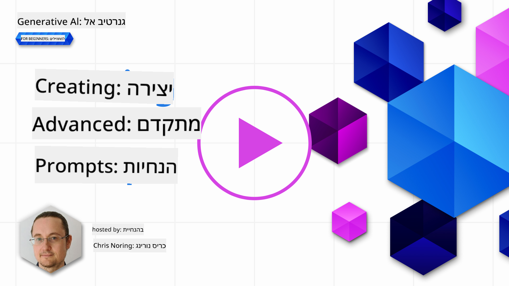

<!--
CO_OP_TRANSLATOR_METADATA:
{
  "original_hash": "b2651fb16bcfbc62b8e518751ed90fdb",
  "translation_date": "2025-10-17T19:59:31+00:00",
  "source_file": "05-advanced-prompts/README.md",
  "language_code": "he"
}
-->
# יצירת הנחיות מתקדמות

[](https://youtu.be/BAjzkaCdRok?si=NmUIyRf7-cDgbjtt)

בואו נסכם כמה מהלימודים מהפרק הקודם:

> הנדסת הנחיות היא התהליך שבו אנו **מכוונים את המודל לתגובות רלוונטיות יותר** על ידי מתן הוראות או הקשר מועילים יותר.

ישנם גם שני שלבים לכתיבת הנחיות: בניית ההנחיה, על ידי מתן הקשר רלוונטי, ו- _אופטימיזציה_, כיצד לשפר בהדרגה את ההנחיה.

בשלב זה, יש לנו הבנה בסיסית של איך לכתוב הנחיות, אבל אנחנו צריכים להעמיק. בפרק זה, תעברו מניסיונות עם הנחיות שונות להבנה מדוע הנחיה אחת טובה יותר מאחרת. תלמדו כיצד לבנות הנחיות תוך שימוש בטכניקות בסיסיות שניתן ליישם על כל LLM.

## מבוא

בפרק זה, נעסוק בנושאים הבאים:

- הרחבת הידע שלכם בהנדסת הנחיות על ידי יישום טכניקות שונות בהנחיות שלכם.
- הגדרת ההנחיות שלכם כדי לשנות את הפלט.

## מטרות למידה

לאחר השלמת השיעור, תוכלו:

- ליישם טכניקות הנדסת הנחיות שמשפרות את תוצאות ההנחיות שלכם.
- לבצע הנחיות שמשתנות או דטרמיניסטיות.

## הנדסת הנחיות

הנדסת הנחיות היא התהליך של יצירת הנחיות שיניבו את התוצאה הרצויה. יש יותר בהנדסת הנחיות מאשר רק כתיבת טקסט הנחיה. הנדסת הנחיות אינה תחום הנדסי, אלא יותר סט של טכניקות שניתן ליישם כדי לקבל את התוצאה הרצויה.

### דוגמה להנחיה

בואו ניקח הנחיה בסיסית כמו זו:

> צור 10 שאלות על גיאוגרפיה.

בהנחיה זו, אתם למעשה מיישמים סט של טכניקות הנחיה שונות.

בואו נפרק את זה.

- **הקשר**, אתם מציינים שזה צריך להיות על "גיאוגרפיה".
- **הגבלת הפלט**, אתם רוצים לא יותר מ-10 שאלות.

### מגבלות של הנחיות פשוטות

ייתכן שתקבלו או לא תקבלו את התוצאה הרצויה. תקבלו את השאלות שנוצרו, אבל גיאוגרפיה היא נושא גדול וייתכן שלא תקבלו את מה שאתם רוצים בגלל הסיבות הבאות:

- **נושא רחב**, אתם לא יודעים אם זה יהיה על מדינות, ערי בירה, נהרות וכדומה.
- **פורמט**, מה אם רציתם שהשאלות יהיו בפורמט מסוים?

כפי שאתם רואים, יש הרבה מה לשקול כשמייצרים הנחיות.

עד כה, ראינו דוגמה להנחיה פשוטה, אבל AI גנרטיבי מסוגל להרבה יותר כדי לעזור לאנשים במגוון תפקידים ותעשיות. בואו נחקור כמה טכניקות בסיסיות בהמשך.

### טכניקות להנחיה

ראשית, אנחנו צריכים להבין שהנחיה היא תכונה _מתפתחת_ של LLM, כלומר זו לא תכונה מובנית במודל אלא משהו שאנחנו מגלים תוך כדי שימוש במודל.

ישנן כמה טכניקות בסיסיות שניתן להשתמש בהן כדי להנחות LLM. בואו נחקור אותן.

- **הנחיה ללא דוגמאות**, זו הצורה הבסיסית ביותר של הנחיה. זו הנחיה יחידה שמבקשת תגובה מה-LLM בהתבסס רק על נתוני האימון שלו.
- **הנחיה עם דוגמאות**, סוג זה של הנחיה מכוון את ה-LLM על ידי מתן דוגמה אחת או יותר שהוא יכול להסתמך עליהן כדי לייצר את תגובתו.
- **שרשרת מחשבה**, סוג זה של הנחיה אומר ל-LLM כיצד לפרק בעיה לשלבים.
- **ידע שנוצר**, כדי לשפר את תגובת ההנחיה, ניתן לספק עובדות או ידע שנוצר בנוסף להנחיה.
- **ממעט להרבה**, כמו שרשרת מחשבה, טכניקה זו עוסקת בפירוק בעיה לסדרת שלבים ואז לבקש לבצע את השלבים הללו לפי הסדר.
- **שיפור עצמי**, טכניקה זו עוסקת בביקורת על הפלט של ה-LLM ואז לבקש ממנו לשפר.
- **הנחיה מיילדת**, כאן אתם רוצים להבטיח שהתשובה של ה-LLM נכונה ואתם מבקשים ממנו להסביר חלקים שונים בתשובה. זו צורה של שיפור עצמי.

### הנחיה ללא דוגמאות

סגנון הנחיה זה מאוד פשוט, הוא מורכב מהנחיה יחידה. טכניקה זו היא כנראה מה שאתם משתמשים בו כשאתם מתחילים ללמוד על LLMs. הנה דוגמה:

- הנחיה: "מה זה אלגברה?"
- תשובה: "אלגברה היא ענף במתמטיקה שחוקר סמלים מתמטיים ואת הכללים למניפולציה של סמלים אלו."

### הנחיה עם דוגמאות

סגנון הנחיה זה עוזר למודל על ידי מתן כמה דוגמאות יחד עם הבקשה. הוא מורכב מהנחיה יחידה עם נתונים ספציפיים למשימה. הנה דוגמה:

- הנחיה: "כתוב שיר בסגנון שייקספיר. הנה כמה דוגמאות של סונטות שייקספיריות:
  סונטה 18: 'האם אשווה אותך ליום קיץ? את יפה יותר ומתונה יותר...'
  סונטה 116: 'אל תתן למוח של אהבה אמיתית להפריע. אהבה אינה אהבה שמשתנה כשמוצאת שינוי...'
  סונטה 132: 'עינייך אני אוהב, והן, כאילו מרחמות עליי, יודעות שליבך מענה אותי בבוז,...'
  עכשיו, כתוב סונטה על יופיו של הירח."
- תשובה: "על השמיים, הירח זורח בעדינות, באור כסוף שמפיץ את חסדו העדין,..."

דוגמאות מספקות ל-LLM את ההקשר, הפורמט או הסגנון של הפלט הרצוי. הן עוזרות למודל להבין את המשימה הספציפית ולייצר תגובות מדויקות ורלוונטיות יותר.

### שרשרת מחשבה

שרשרת מחשבה היא טכניקה מאוד מעניינת שכן היא עוסקת בלקחת את ה-LLM דרך סדרת שלבים. הרעיון הוא להנחות את ה-LLM בצורה כזו שהוא יבין כיצד לעשות משהו. שקלו את הדוגמה הבאה, עם ובלי שרשרת מחשבה:

    - הנחיה: "לאליס יש 5 תפוחים, היא זורקת 3 תפוחים, נותנת 2 לבוב ובוב מחזיר לה אחד, כמה תפוחים יש לאליס?"
    - תשובה: 5

ה-LLM עונה עם 5, שזה לא נכון. התשובה הנכונה היא תפוח אחד, בהתחשב בחישוב (5 -3 -2 + 1 = 1).

אז איך נוכל ללמד את ה-LLM לעשות זאת נכון?

בואו ננסה שרשרת מחשבה. יישום שרשרת מחשבה אומר:

1. תנו ל-LLM דוגמה דומה.
1. הראו את החישוב, וכיצד לחשב אותו נכון.
1. ספקו את ההנחיה המקורית.

הנה איך:

- הנחיה: "ליסה יש 7 תפוחים, היא זורקת תפוח אחד, נותנת 4 תפוחים לברט וברט מחזיר אחד:
  7 -1 = 6
  6 -4 = 2
  2 +1 = 3  
  לאליס יש 5 תפוחים, היא זורכת 3 תפוחים, נותנת 2 לבוב ובוב מחזיר לה אחד, כמה תפוחים יש לאליס?"
  תשובה: 1

שימו לב כיצד אנחנו כותבים הנחיות ארוכות משמעותית עם דוגמה נוספת, חישוב ואז ההנחיה המקורית ומגיעים לתשובה הנכונה 1.

כפי שאתם רואים, שרשרת מחשבה היא טכניקה מאוד חזקה.

### ידע שנוצר

במקרים רבים כשאתם רוצים לבנות הנחיה, אתם רוצים לעשות זאת באמצעות נתוני החברה שלכם. אתם רוצים שחלק מההנחיה יגיע מהחברה והחלק השני יהיה ההנחיה שאתם מעוניינים בה.

לדוגמה, כך יכולה להיראות ההנחיה שלכם אם אתם בעסקי הביטוח:

```text
{{company}}: {{company_name}}
{{products}}:
{{products_list}}
Please suggest an insurance given the following budget and requirements:
Budget: {{budget}}
Requirements: {{requirements}}
```

למעלה, אתם רואים כיצד ההנחיה נבנית באמצעות תבנית. בתבנית יש מספר משתנים, שמסומנים על ידי `{{variable}}`, שיחליפו בערכים אמיתיים מ-API של החברה.

הנה דוגמה כיצד ההנחיה יכולה להיראות לאחר שהמשתנים הוחלפו בתוכן מהחברה שלכם:

```text
Insurance company: ACME Insurance
Insurance products (cost per month):
- Car, cheap, 500 USD
- Car, expensive, 1100 USD
- Home, cheap, 600 USD
- Home, expensive, 1200 USD
- Life, cheap, 100 USD

Please suggest an insurance given the following budget and requirements:
Budget: $1000
Requirements: Car, Home, and Life insurance
```

הרצת ההנחיה הזו דרך LLM תפיק תגובה כמו זו:

```output
Given the budget and requirements, we suggest the following insurance package from ACME Insurance:
- Car, cheap, 500 USD
- Home, cheap, 600 USD
- Life, cheap, 100 USD
Total cost: $1,200 USD
```

כפי שאתם רואים, הוא גם מציע את ביטוח החיים, מה שלא אמור להיות. תוצאה זו היא אינדיקציה לכך שאנחנו צריכים לאופטימיזציה של ההנחיה על ידי שינוי ההנחיה להיות ברורה יותר לגבי מה שהיא יכולה לאפשר. לאחר כמה _ניסויים ושגיאות_, אנחנו מגיעים להנחיה הבאה:

```text
Insurance company: ACME Insurance
Insurance products (cost per month):
- type: Car, cheap, cost: 500 USD
- type: Car, expensive, cost: 1100 USD
- type: Home, cheap, cost: 600 USD
- type: Home, expensive, cost: 1200 USD
- type: Life, cheap, cost: 100 USD

Please suggest an insurance given the following budget and requirements:
Budget: $1000 restrict choice to types: Car, Home
```

שימו לב כיצד הוספת _סוג_ ו- _עלות_ וגם שימוש במילת המפתח _הגבל_ עוזרים ל-LLM להבין מה אנחנו רוצים.

עכשיו אנחנו מקבלים את התגובה הבאה:

```output
Given the budget and requirements, we suggest the Car, Cheap insurance product which costs 500 USD per month.
```

המטרה של הדוגמה הזו הייתה להראות שאפילו כשאנחנו משתמשים בטכניקה בסיסית כמו _ידע שנוצר_, אנחנו עדיין צריכים לאופטימיזציה של ההנחיה ברוב המקרים כדי לקבל את התוצאה הרצויה.

### ממעט להרבה

הרעיון עם הנחיה ממעט להרבה הוא לפרק בעיה גדולה לבעיות משנה. כך, אתם עוזרים להנחות את ה-LLM כיצד "לכבוש" את הבעיה הגדולה. דוגמה טובה יכולה להיות במדעי הנתונים שבה אתם יכולים לבקש מה-LLM לחלק בעיה כך:

> הנחיה: איך לבצע מדעי הנתונים ב-5 שלבים?

עם עוזר ה-AI שלכם עונה עם:

1. איסוף נתונים
1. ניקוי נתונים
1. ניתוח נתונים
1. הצגת נתונים
1. הצגת ממצאים

### שיפור עצמי, ביקורת על התוצאות

עם AI גנרטיבי ו-LLMs, אתם לא יכולים לסמוך על הפלט. אתם צריכים לוודא אותו. אחרי הכל, ה-LLM רק מציג לכם מה הדבר הבא הסביר ביותר לומר, לא מה נכון. לכן, רעיון טוב הוא לבקש מה-LLM לבקר את עצמו, מה שמוביל אותנו לטכניקת השיפור העצמי.

איך זה עובד הוא שאתם עוקבים אחרי השלבים הבאים:

1. הנחיה ראשונית שמבקשת מה-LLM לפתור בעיה
1. ה-LLM עונה
1. אתם מבקרים את התשובה ומבקשים מה-AI לשפר
1. ה-LLM עונה שוב, הפעם בהתחשב בביקורת ומציע פתרונות שהוא הגיע אליהם

אתם יכולים לחזור על התהליך הזה כמה פעמים שתרצו.

הנה דוגמה לשימוש בטכניקה זו:

> הנחיה: "צור API אינטרנטי ב-Python עם מסלולים למוצרים וללקוחות"

תשובת AI:

```python
import flask
app = Flask(__name__)

@app.route('/products')
def products():
    return 'Products'

@app.route('/customers')
def customers():
    return 'Customers'
```

> הנחיה: הצע 3 שיפורים לקוד הנ"ל

תשובת AI:

```text
Sure, here are three suggestions to improve the code:

Import the correct module: The first line should import Flask instead of flask. The correct import statement should be from flask import Flask.

Add a main function: Add a if __name__ == '__main__': block to the end of the file to run the application when the file is executed.

Use f-strings: Use f-strings to format the return statements in the route functions. For example, return 'Products' can be changed to return f'This is the {request.path} page'.
```

```python
from flask import Flask, request

app = Flask(__name__)

@app.route('/products')
def products():
    return f'This is the {request.path} page'

@app.route('/customers')
def customers():
    return f'This is the {request.path} page'

if __name__ == '__main__':
    app.run()
```

כפי שאתם רואים, תגובת ה-AI לעיל משפרת את הקוד המוצע הראשון בזכות הביקורת על התשובה הראשונה.

### הנחיה מיילדת

הנחיה מיילדת היא טכניקה שדומה לשיפור עצמי אבל היא יותר עוסקת בבקשה מה-LLM להסביר את עצמו. המטרה היא להפחית אי עקביות בפלט של ה-LLM כדי להבטיח שהוא מגיע לתשובה הנכונה. תהליך העבודה שיש לעקוב אחריו הוא:

1. בקשו מה-LLM לענות על שאלה
1. עבור כל חלק מהתשובה, בקשו מה-LLM להסביר אותו בצורה מעמיקה יותר.
1. אם יש אי עקביות, דחו את החלקים שאינם עקביים.

חזרו על שלבים 2 ו-3 עד שעברתם על כל החלקים ואתם מרוצים מהתשובה.

הנה דוגמה להנחיה:

> הנחיה: איך אני יכול ליצור תוכנית חירום להתמודדות עם מגפה ב-5 שלבים?
> תשובת LLM:

```text
1. Identify the risks
1. Identify the stakeholders
1. Identify the resources
1. Identify the actions
1. Identify the communication channels
```

הוא זיהה 5 שלבים, אבל האם אנחנו יכולים לקבוע אם זה נכון? בואו נבקש מה-LLM להסביר כל שלב:

> הנחיה: הסבר את השלב הראשון בפירוט, מהם הסיכונים בפירוט עם מגפה?

```text
The risks are the following:

- Loss of life
- Loss of business
- Loss of reputation
- Loss of customers
- Loss of employees
```

בשלב זה, אנחנו רוצים לוודא שה-LLM נכון אז אנחנו מבקשים ממנו להסביר את הסיכון הראשון בפירוט ומקווים שהוא עקבי עם התשובה לעיל:

> הנחיה: במגפה, מהו הסיכון הגדול ביותר ולמה?

```text
The biggest risk is loss of life because it's the most important thing to protect.
```

> מהם שני הסיכונים הגדולים ביותר במגפה?

```text
The two biggest risks are loss of life and loss of business.
```

בשלב זה, ה-LLM עקבי ומזכיר "חיים" ו"עסקים" כשני הסיכונים הגדולים ביותר. אנחנו יכולים עכשיו להמשיך לשלב הבא ולהרגיש די בטוחים. עם זאת, אנחנו לא צריכים לסמוך על ה-LLM בעיניים עצומות, תמיד כדאי לוודא את הפלט.

## שינוי הפלט שלכם

LLMs הם מטבעם לא דטרמיניסטיים, כלומר תקבלו תוצאות שונות בכל פעם שתפעילו את אותה הנחיה. נסו את ההנחיה הבאה לדוגמה:

> "צור קוד ל-API אינטרנטי ב-Python"

```python
# Import necessary modules
import flask
from flask import request, jsonify

# Create a Flask app
app = flask.Flask(__name__)

# Create a route for the API
@app.route('/api', methods=['GET'])
def api():
    # Get the data from the request
    data = request.args

    # Process the data
    result = process_data(data)

    # Return the result as JSON
    return jsonify(result)

# Function to process the data
def process_data(data):
    # Do something with the data
    result = data + 1

    # Return the result
    return result

# Run the app
if __name__ == '__main__':
    app.run()

```

הרצת אותה הנחיה שוב יוצרת תגובה מעט שונה:

```python
#import necessary packages
import flask
from flask import request, jsonify

#create the Flask application
app = flask.Flask(__name__)
app.config["DEBUG"] = True

#create a list of books
books = [
    {'id': 0,
     'title': 'A Fire Upon the Deep',
     'author': 'Vernor Vinge',
     'first_sentence': 'The coldsleep itself was dreamless.',
     'year_published': '1992'},
    {'id': 1,
     'title': 'The Ones Who Walk Away From Omelas',
     'author': 'Ursula K. Le Guin',
     'first_sentence': 'With a clamor of bells that set the swallows soaring, the Festival of Summer came to the city Omelas, bright-towered by the sea.',
     'published': '1973'},
    {'id': 2,
     'title': 'Dhalgren',
     'author': 'Samuel R. Delany',
     'first_sentence': 'to wound the autumnal city.',
     'published': '1975'}
]

#create an endpoint for the API
@app.route('/', methods=['GET'])
def home():
    return '''<h1>Books API</h1>
<p>A prototype API for retrieving books.</p>'''

#create an endpoint to return all books
@app.route('/api/v1/resources/books/all', methods=['GET'])
def api_all():
    return jsonify(books)

#create an endpoint to return a single book
@app.route('/api/v1/resources/books', methods=['GET'])
def api_id():
    #check if an ID was provided as part of the URL
    #if ID is provided, assign it to a variable
    #if no ID is provided, display an error
    if 'id' in request.args:
        id = int(request.args['id'])
    else:
        return "Error: No id field provided. Please specify an id."

    #create an empty list for our results
    results = []

    #loop through the data and match results that fit the requested ID
    #IDs are unique, but other fields might return many results
    for book in books:
        if book['id'] == id:
            results.append(book)

    #use the jsonify function from Flask to convert our list of
    #Python dictionaries to the JSON format
    return jsonify(results)

app.run()
```

> אז האם הפלט המשתנה הוא בעיה?

תלוי במה שאתם מנסים לעשות. אם אתם רוצים תגובה ספציפית אז זו בעיה. אם אתם בסדר עם פלט משתנה כמו "צור 3 שאלות על גיאוגרפיה", אז זו לא בעיה.

### שימוש בטמפרטורה לשינוי הפלט שלכם

אוקיי, אז החלטנו שאנחנו רוצים להגביל את הפלט להיות יותר צפוי, כלומר יותר דטרמיניסטי. איך עושים את זה?

טמפרטורה היא ערך בין 0 ל-1, כאשר 0 הוא הכי דטרמיניסטי ו-1 הוא הכי משתנה. הערך ברירת המחדל הוא 0.7. בואו נראה מה קורה עם שתי הרצות של אותה הנחיה עם טמפרטורה מוגדרת ל-0.1:

> "צור קוד ל-API אינטרנטי ב-Python"

```python
#import necessary libraries
import flask
from flask import request, jsonify

#create an instance of the Flask class
app = flask.Flask(__name__)

#create an endpoint for the API
@app.route('/api/v1/endpoint', methods=['GET'])
def api_endpoint():
    #get the request data
    data = request.get_json()

    #process the data
    result = process_data(data)

    #return the result
    return jsonify(result)

#function to process the data
def process_data(data):
    #process the data
    result = {'result': 'success'}

    #return the result
    return result

#run the Flask app
if __name__ == '__main__':
    app.run()

```

הרצת ההנחיה שוב נותנת לנו את התוצאה הזו:

```python
#import necessary libraries
import flask
from flask import request, jsonify

#create a Flask app
app = flask.Flask(__name__)

#create a route for the API
@app.route('/api', methods=['GET'])
def api_call():
    #get the data from the request
    data = request.get_json()

    #process the data
    result = process_data(data)

    #return the result
    return jsonify(result)

#define the process_data function
def process_data(data):
    #do something with the data
    result = data + 1

    #return the result
    return result

#run the app
if __name__ == '__main__':
    app.run()

```

יש רק הבדל קטן בין שני הפלטים הללו. הפעם נעשה את ההפך, נגדיר את הטמפרטורה ל-0.9:

```python
# Import necessary libraries
import flask
from flask import request, jsonify

# Create a Flask app
app = flask.Flask(__name__)

# Create a route for the API
@app.route('/api', methods=['GET'])
def api_call():
    # Get the data from the request
    data = request.args

    # Process the data
    result = process_data(data)

    # Return the result
    return jsonify(result)

# Function to process the data
def process_data(data):
    # Do something with the data
    result = data + 1

    # Return the result
    return result

# Run the app
if __name__ == '__main__':
    app.run()

```

והניסיון השני עם ערך טמפרטורה של 0.9:

```python
import flask
from flask import request, jsonify

# create the Flask app
app = flask.Flask(__name__)
app.config['DEBUG'] = True

# create some test data
books = [
    {'id': 0, 'title': 'A Fire Upon The Deep', 'author': 'Vernor Vinge', 'first_sentence': 'The coldsleep itself was dreamless.', 'year_published': '1992'},
    {'id': 1, 'title': 'The Ones Who Walk Away From Omelas', 'author': 'Ursula K. Le Guin', 'first_sentence': 'With a clamor of bells that set the swallows soaring, the Festival of Summer came to the city Omelas, bright-towered by the sea.', 'published': '1973'},
    {'id': 2, 'title': 'Dhalgren', 'author': 'Samuel R. Delany', 'first_sentence': 'to wound the autumnal city.', 'published': '1975'}
]

# create an endpoint
@app.route('/', methods=['GET'])
def home():
    return '''<h1>Welcome to our book API!</h1>'''

@app.route('/api/v1/resources/books

```

כפי שאתם יכולים לראות, התוצאות לא יכולות להיות יותר מגוונות.

> שימו לב, שישנם פרמטרים נוספים שניתן לשנות כדי לגוון את התוצאה, כמו top-k, top-p, עונש חזרתיות, עונש אורך ועונש גיוון, אך אלו מחוץ לתחום הלימוד של תוכנית זו.

## שיטות עבודה טובות

ישנן שיטות רבות שתוכלו ליישם כדי לנסות להשיג את מה שאתם רוצים. תמצאו את הסגנון שלכם ככל שתשתמשו יותר ויותר בהנחיות.

בנוסף לטכניקות שכיסינו, ישנן כמה שיטות עבודה טובות שכדאי לשקול בעת הנחיית מודל שפה גדול (LLM).

הנה כמה שיטות עבודה טובות שכדאי לשקול:

- **ציינו הקשר**. ההקשר חשוב, ככל שתוכלו לציין יותר כמו תחום, נושא וכו', כך התוצאה תהיה טובה יותר.
- הגבילו את הפלט. אם אתם רוצים מספר פריטים מסוים או אורך מסוים, ציינו זאת.
- **ציינו גם מה וגם איך**. זכרו לציין גם מה אתם רוצים וגם איך אתם רוצים את זה, לדוגמה "צרו API ב-Python עם מסלולים למוצרים וללקוחות, חלקו אותו ל-3 קבצים".
- **השתמשו בתבניות**. לעיתים קרובות תרצו להעשיר את ההנחיות שלכם עם נתונים מהחברה שלכם. השתמשו בתבניות כדי לעשות זאת. תבניות יכולות לכלול משתנים שתוכלו להחליף בנתונים אמיתיים.
- **כתבו נכון**. מודלים של שפה גדולים עשויים לספק לכם תשובה נכונה, אך אם תכתבו נכון, תקבלו תשובה טובה יותר.

## משימה

הנה קוד ב-Python שמראה איך לבנות API פשוט באמצעות Flask:

```python
from flask import Flask, request

app = Flask(__name__)

@app.route('/')
def hello():
    name = request.args.get('name', 'World')
    return f'Hello, {name}!'

if __name__ == '__main__':
    app.run()
```

השתמשו בעוזר AI כמו GitHub Copilot או ChatGPT ויישמו את טכניקת "שיפור עצמי" כדי לשפר את הקוד.

## פתרון

נסו לפתור את המשימה על ידי הוספת הנחיות מתאימות לקוד.

> [!TIP]
> נסחו הנחיה שתבקש לשפר, זה רעיון טוב להגביל את מספר השיפורים. תוכלו גם לבקש לשפר בדרך מסוימת, למשל ארכיטקטורה, ביצועים, אבטחה וכו'.

[פתרון](../../../05-advanced-prompts/python/aoai-solution.py)

## בדיקת ידע

מדוע להשתמש בהנחיית שרשרת מחשבה? הציגו תשובה אחת נכונה ושתי תשובות שגויות.

1. ללמד את מודל השפה הגדול איך לפתור בעיה.
1. ב', ללמד את מודל השפה הגדול למצוא שגיאות בקוד.
1. ג', להנחות את מודל השפה הגדול להציע פתרונות שונים.

תשובה: 1, כי הנחיית שרשרת מחשבה עוסקת בהצגת למודל השפה הגדול איך לפתור בעיה על ידי מתן סדרת צעדים, ובעיות דומות ואיך הן נפתרו.

## 🚀 אתגר

הרגע השתמשתם בטכניקת השיפור העצמי במשימה. קחו כל תוכנית שבניתם ושקלו אילו שיפורים הייתם רוצים ליישם עליה. עכשיו השתמשו בטכניקת השיפור העצמי כדי ליישם את השינויים המוצעים. מה דעתכם על התוצאה, טובה יותר או פחות?

## עבודה נהדרת! המשיכו ללמוד

לאחר שסיימתם את השיעור הזה, בדקו את [אוסף הלמידה של AI גנרטיבי](https://aka.ms/genai-collection?WT.mc_id=academic-105485-koreyst) כדי להמשיך ולהעמיק את הידע שלכם ב-AI גנרטיבי!

עברו לשיעור 6 שבו ניישם את הידע שלנו בהנדסת הנחיות על ידי [בניית אפליקציות ליצירת טקסט](../06-text-generation-apps/README.md?WT.mc_id=academic-105485-koreyst)

---

**כתב ויתור**:  
מסמך זה תורגם באמצעות שירות תרגום AI [Co-op Translator](https://github.com/Azure/co-op-translator). למרות שאנו שואפים לדיוק, יש לקחת בחשבון שתרגומים אוטומטיים עשויים להכיל שגיאות או אי דיוקים. המסמך המקורי בשפתו המקורית צריך להיחשב כמקור סמכותי. עבור מידע קריטי, מומלץ להשתמש בתרגום מקצועי אנושי. איננו אחראים לאי הבנות או לפרשנויות שגויות הנובעות משימוש בתרגום זה.