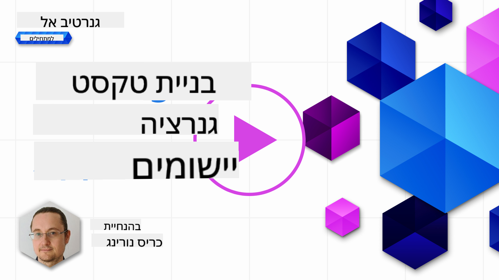

<!--
CO_OP_TRANSLATOR_METADATA:
{
  "original_hash": "ce8224073b86b728ed52b19bed7932fd",
  "translation_date": "2025-07-09T12:02:33+00:00",
  "source_file": "06-text-generation-apps/README.md",
  "language_code": "he"
}
-->
# בניית אפליקציות ליצירת טקסט

[](https://aka.ms/gen-ai-lesson6-gh?WT.mc_id=academic-105485-koreyst)

> _(לחצו על התמונה למעלה לצפייה בסרטון של השיעור)_

עד כה ראיתם במסגרת הקורס שיש מושגים מרכזיים כמו prompts ואפילו תחום שלם שנקרא "הנדסת פרומפטים". כלים רבים שאפשר להשתמש בהם כמו ChatGPT, Office 365, Microsoft Power Platform ועוד, תומכים בשימוש בפרומפטים כדי להשיג משהו.

כדי להוסיף חוויה כזו לאפליקציה, צריך להבין מושגים כמו prompts, completions ולבחור ספרייה לעבודה. זה בדיוק מה שתלמדו בפרק הזה.

## מבוא

בפרק זה תלמדו:

- להכיר את ספריית openai ואת המושגים המרכזיים שלה.
- לבנות אפליקציית יצירת טקסט באמצעות openai.
- להבין איך להשתמש במושגים כמו prompt, temperature ו-tokens כדי לבנות אפליקציית יצירת טקסט.

## מטרות הלמידה

בסוף השיעור תוכלו:

- להסביר מהי אפליקציית יצירת טקסט.
- לבנות אפליקציית יצירת טקסט באמצעות openai.
- להגדיר את האפליקציה כך שתשתמש ביותר או פחות tokens וגם לשנות את ה-temperature, לקבלת פלט מגוון.

## מהי אפליקציית יצירת טקסט?

בדרך כלל כשבונים אפליקציה יש לה ממשק כלשהו כמו:

- מבוסס פקודות. אפליקציות קונסול הן אפליקציות טיפוסיות שבהן מקלידים פקודה והיא מבצעת משימה. לדוגמה, `git` היא אפליקציה מבוססת פקודות.
- ממשק משתמש (UI). יש אפליקציות עם ממשקי משתמש גרפיים (GUIs) שבהם לוחצים על כפתורים, מזינים טקסט, בוחרים אפשרויות ועוד.

### אפליקציות קונסול ו-UI מוגבלות

השוו זאת לאפליקציה מבוססת פקודות שבה מקלידים פקודה:

- **מוגבלות**. אי אפשר להקליד כל פקודה, רק את אלו שהאפליקציה תומכת בהן.
- **תלויות בשפה**. יש אפליקציות שתומכות בשפות רבות, אבל כברירת מחדל האפליקציה בנויה לשפה מסוימת, גם אם אפשר להוסיף תמיכה בשפות נוספות.

### יתרונות של אפליקציות ליצירת טקסט

אז מה שונה באפליקציית יצירת טקסט?

באפליקציה כזו יש יותר גמישות, לא מוגבלים למערך פקודות או לשפת קלט מסוימת. במקום זאת, אפשר להשתמש בשפה טבעית כדי לתקשר עם האפליקציה. יתרון נוסף הוא שכבר מתקשרים עם מקור נתונים שאומן על מאגר מידע עצום, בעוד שאפליקציה מסורתית מוגבלת למה שיש בבסיס הנתונים שלה.

### מה אפשר לבנות עם אפליקציית יצירת טקסט?

יש הרבה דברים שאפשר לבנות. לדוגמה:

- **צ'אטבוט**. צ'אטבוט שמענה על שאלות בנושאים כמו החברה שלך והמוצרים שלה יכול להתאים מאוד.
- **עוזר**. מודלים גדולים (LLMs) מצטיינים במשימות כמו סיכום טקסט, הפקת תובנות מטקסט, יצירת טקסטים כמו קורות חיים ועוד.
- **עוזר קוד**. בהתאם למודל השפה שבו משתמשים, אפשר לבנות עוזר קוד שעוזר לכתוב קוד. לדוגמה, אפשר להשתמש במוצרים כמו GitHub Copilot וגם ChatGPT כדי לסייע בכתיבת קוד.

## איך מתחילים?

צריך למצוא דרך לשלב עם LLM, שבדרך כלל כוללת שתי גישות עיקריות:

- שימוש ב-API. כאן בונים בקשות רשת עם הפרומפט ומקבלים טקסט שנוצר בחזרה.
- שימוש בספרייה. ספריות עוזרות לעטוף את קריאות ה-API ולהפוך אותן לקלות יותר לשימוש.

## ספריות/SDKs

יש כמה ספריות מוכרות לעבודה עם LLMs כמו:

- **openai**, ספרייה זו מקלה על החיבור למודל ושליחת פרומפטים.

יש גם ספריות שפועלות ברמה גבוהה יותר כמו:

- **Langchain**. Langchain מוכרת ותומכת בפייתון.
- **Semantic Kernel**. Semantic Kernel היא ספרייה של מיקרוסופט התומכת בשפות C#, Python ו-Java.

## האפליקציה הראשונה עם openai

בואו נראה איך לבנות את האפליקציה הראשונה שלנו, אילו ספריות נצטרך, כמה זה דורש וכדומה.

### התקנת openai

ישנן ספריות רבות לעבודה עם OpenAI או Azure OpenAI. אפשר להשתמש בשפות תכנות שונות כמו C#, Python, JavaScript, Java ועוד. בחרנו להשתמש בספריית `openai` בפייתון, לכן נשתמש ב-`pip` להתקנה.

```bash
pip install openai
```

### יצירת משאב

יש לבצע את השלבים הבאים:

- ליצור חשבון ב-Azure [https://azure.microsoft.com/free/](https://azure.microsoft.com/free/?WT.mc_id=academic-105485-koreyst).
- לקבל גישה ל-Azure OpenAI. גשו ל-[https://learn.microsoft.com/azure/ai-services/openai/overview#how-do-i-get-access-to-azure-openai](https://learn.microsoft.com/azure/ai-services/openai/overview#how-do-i-get-access-to-azure-openai?WT.mc_id=academic-105485-koreyst) ובקשו גישה.

  > [!NOTE]
  > בזמן כתיבת שורות אלו, יש להגיש בקשה לקבלת גישה ל-Azure OpenAI.

- התקינו Python <https://www.python.org/>
- יצרתם משאב שירות Azure OpenAI. ראו מדריך זה כיצד [ליצור משאב](https://learn.microsoft.com/azure/ai-services/openai/how-to/create-resource?pivots=web-portal?WT.mc_id=academic-105485-koreyst).

### מציאת מפתח API ו-endpoint

כעת, יש להגדיר לספריית `openai` איזה מפתח API להשתמש. כדי למצוא את מפתח ה-API, גשו לקטע "Keys and Endpoint" במשאב Azure OpenAI שלכם והעתיקו את הערך של "Key 1".


כעת כשיש לכם את המידע, ננחה את הספריות להשתמש בו.

> [!NOTE]
> כדאי להפריד את מפתח ה-API מהקוד שלכם. אפשר לעשות זאת באמצעות משתני סביבה.
>
> - הגדירו את משתנה הסביבה `OPENAI_API_KEY` למפתח ה-API שלכם.
>   `export OPENAI_API_KEY='sk-...'`

### הגדרת תצורה ל-Azure

אם אתם משתמשים ב-Azure OpenAI, כך מגדירים את התצורה:

```python
openai.api_type = 'azure'
openai.api_key = os.environ["OPENAI_API_KEY"]
openai.api_version = '2023-05-15'
openai.api_base = os.getenv("API_BASE")
```

מעל הגדרנו את הדברים הבאים:

- `api_type` ל-`azure`. זה אומר לספרייה להשתמש ב-Azure OpenAI ולא ב-OpenAI.
- `api_key`, זה מפתח ה-API שלכם שנמצא בפורטל Azure.
- `api_version`, זו גרסת ה-API שברצונכם להשתמש בה. בזמן הכתיבה, הגרסה העדכנית היא `2023-05-15`.
- `api_base`, זה ה-endpoint של ה-API. אפשר למצוא אותו בפורטל Azure ליד מפתח ה-API שלכם.

> [!NOTE] > `os.getenv` היא פונקציה שקוראת משתני סביבה. אפשר להשתמש בה כדי לקרוא משתני סביבה כמו `OPENAI_API_KEY` ו-`API_BASE`. הגדירו את משתני הסביבה האלה בטרמינל או באמצעות ספרייה כמו `dotenv`.

## יצירת טקסט

הדרך ליצור טקסט היא באמצעות המחלקה `Completion`. הנה דוגמה:

```python
prompt = "Complete the following: Once upon a time there was a"

completion = openai.Completion.create(model="davinci-002", prompt=prompt)
print(completion.choices[0].text)
```

בקוד שלמעלה, אנו יוצרים אובייקט completion ומעבירים את המודל הרצוי ואת הפרומפט. לאחר מכן מדפיסים את הטקסט שנוצר.

### השלמות שיחה (Chat completions)

עד כה ראיתם איך השתמשנו ב-`Completion` ליצירת טקסט. אבל יש מחלקה נוספת שנקראת `ChatCompletion` שמתאימה יותר לצ'אטבוטים. הנה דוגמה לשימוש בה:

```python
import openai

openai.api_key = "sk-..."

completion = openai.ChatCompletion.create(model="gpt-3.5-turbo", messages=[{"role": "user", "content": "Hello world"}])
print(completion.choices[0].message.content)
```

עוד על פונקציונליות זו בפרק הבא.

## תרגיל - אפליקציית יצירת הטקסט הראשונה שלך

כעת שלמדנו איך להגדיר ולתצבר את openai, הגיע הזמן לבנות את אפליקציית יצירת הטקסט הראשונה שלכם. כדי לבנות את האפליקציה, בצעו את השלבים הבאים:

1. צרו סביבה וירטואלית והתקינו את openai:

   ```bash
   python -m venv venv
   source venv/bin/activate
   pip install openai
   ```

   > [!NOTE]
   > אם אתם משתמשים ב-Windows הקלידו `venv\Scripts\activate` במקום `source venv/bin/activate`.

   > [!NOTE]
   > מצאו את מפתח Azure OpenAI שלכם על ידי כניסה ל-[https://portal.azure.com/](https://portal.azure.com/?WT.mc_id=academic-105485-koreyst), חפשו `Open AI`, בחרו ב-`Open AI resource` ואז בחרו ב-`Keys and Endpoint` והעתיקו את הערך של `Key 1`.

1. צרו קובץ _app.py_ והכניסו בו את הקוד הבא:

   ```python
   import openai

   openai.api_key = "<replace this value with your open ai key or Azure OpenAI key>"

   openai.api_type = 'azure'
   openai.api_version = '2023-05-15'
   openai.api_base = "<endpoint found in Azure Portal where your API key is>"
   deployment_name = "<deployment name>"

   # add your completion code
   prompt = "Complete the following: Once upon a time there was a"
   messages = [{"role": "user", "content": prompt}]

   # make completion
   completion = openai.chat.completions.create(model=deployment_name, messages=messages)

   # print response
   print(completion.choices[0].message.content)
   ```

   > [!NOTE]
   > אם אתם משתמשים ב-Azure OpenAI, יש להגדיר את `api_type` ל-`azure` ואת `api_key` למפתח Azure OpenAI שלכם.

   אמור להופיע פלט דומה ל:

   ```output
    very unhappy _____.

   Once upon a time there was a very unhappy mermaid.
   ```

## סוגים שונים של פרומפטים, לדברים שונים

כעת ראיתם איך ליצור טקסט באמצעות פרומפט. יש לכם אפילו תוכנית רצה שאפשר לשנות ולשפר כדי ליצור סוגים שונים של טקסט.

פרומפטים יכולים לשמש למגוון משימות. לדוגמה:

- **יצירת סוג טקסט**. לדוגמה, אפשר ליצור שיר, שאלות לחידון ועוד.
- **חיפוש מידע**. אפשר להשתמש בפרומפטים כדי לחפש מידע כמו בדוגמה: 'מה המשמעות של CORS בפיתוח ווב?'.
- **יצירת קוד**. אפשר להשתמש בפרומפטים ליצירת קוד, למשל לפתח ביטוי רגולרי לאימות אימיילים או אפילו ליצור תוכנית שלמה, כמו אפליקציית ווב.

## מקרה שימוש מעשי יותר: מחולל מתכונים

תארו לעצמכם שיש לכם בבית מרכיבים ואתם רוצים לבשל משהו. לשם כך, צריך מתכון. דרך למצוא מתכונים היא להשתמש במנוע חיפוש או להשתמש ב-LLM.

אפשר לכתוב פרומפט כזה:

> "הראה לי 5 מתכונים למנה עם המרכיבים הבאים: עוף, תפוחי אדמה וגזר. עבור כל מתכון, רשום את כל המרכיבים שבהם משתמשים"

בהתאם לפרומפט הזה, ייתכן שתקבלו תגובה דומה ל:

```output
1. Roasted Chicken and Vegetables:
Ingredients:
- 4 chicken thighs
- 2 potatoes, cut into cubes
- 2 carrots, cut into cubes
- 2 tablespoons olive oil
- 2 cloves garlic, minced
- 1 teaspoon dried thyme
- 1 teaspoon dried oregano
- Salt and pepper, to taste

2. Chicken and Potato Stew:
Ingredients:
- 2 tablespoons olive oil
- 1 onion, diced
- 2 cloves garlic, minced
- 2 chicken breasts, cut into cubes
- 2 potatoes, cut into cubes
- 2 carrots, cut into cubes
- 1 teaspoon dried oregano
- 1 teaspoon dried thyme
- 1 cup chicken broth
- Salt and pepper, to taste

3. Chicken and Potato Bake:
Ingredients:
- 2 tablespoons olive oil
- 2 chicken breasts, cut into cubes
- 2 potatoes, cut into cubes
- 2 carrots, cut into cubes
- 1 onion, diced
- 2 cloves garlic, minced
- 1 teaspoon dried oregano
- 1 teaspoon dried thyme
- 1 cup chicken broth
- Salt and pepper, to taste

4. Chicken and Potato Soup:
Ingredients:
- 2 tablespoons olive oil
- 1 onion, diced
- 2 cloves garlic, minced
- 2 chicken breasts, cut into cubes
- 2 potatoes, cut into cubes
- 2 carrots, cut into cubes
- 1 teaspoon dried oregano
- 1 teaspoon dried thyme
- 4 cups chicken broth
- Salt and pepper, to taste

5. Chicken and Potato Hash:
Ingredients:
- 2 tablespoons olive oil
- 2 chicken breasts, cut into cubes
- 2 potatoes, cut into cubes
- 2 carrots, cut into cubes
- 1 onion, diced
- 2 cloves garlic, minced
- 1 teaspoon dried oregano
```

התוצאה הזו מצוינת, אני יודע מה לבשל. בשלב זה, שיפורים שימושיים יכולים להיות:

- סינון מרכיבים שאני לא אוהב או אלרגי אליהם.
- הפקת רשימת קניות, למקרה שאין לי את כל המרכיבים בבית.

למקרים האלה, נוסיף פרומפט נוסף:

> "אנא הסר מתכונים עם שום כי אני אלרגי והחלף במשהו אחר. בנוסף, הפק רשימת קניות עבור המתכונים, בהתחשב שכבר יש לי בבית עוף, תפוחי אדמה וגזר."

כעת יש לכם תוצאה חדשה, כלומר:

```output
1. Roasted Chicken and Vegetables:
Ingredients:
- 4 chicken thighs
- 2 potatoes, cut into cubes
- 2 carrots, cut into cubes
- 2 tablespoons olive oil
- 1 teaspoon dried thyme
- 1 teaspoon dried oregano
- Salt and pepper, to taste

2. Chicken and Potato Stew:
Ingredients:
- 2 tablespoons olive oil
- 1 onion, diced
- 2 chicken breasts, cut into cubes
- 2 potatoes, cut into cubes
- 2 carrots, cut into cubes
- 1 teaspoon dried oregano
- 1 teaspoon dried thyme
- 1 cup chicken broth
- Salt and pepper, to taste

3. Chicken and Potato Bake:
Ingredients:
- 2 tablespoons olive oil
- 2 chicken breasts, cut into cubes
- 2 potatoes, cut into cubes
- 2 carrots, cut into cubes
- 1 onion, diced
- 1 teaspoon dried oregano
- 1 teaspoon dried thyme
- 1 cup chicken broth
- Salt and pepper, to taste

4. Chicken and Potato Soup:
Ingredients:
- 2 tablespoons olive oil
- 1 onion, diced
- 2 chicken breasts, cut into cubes
- 2 potatoes, cut into cubes
- 2 carrots, cut into cubes
- 1 teaspoon dried oregano
- 1 teaspoon dried thyme
- 4 cups chicken broth
- Salt and pepper, to taste

5. Chicken and Potato Hash:
Ingredients:
- 2 tablespoons olive oil
- 2 chicken breasts, cut into cubes
- 2 potatoes, cut into cubes
- 2 carrots, cut into cubes
- 1 onion, diced
- 1 teaspoon dried oregano

Shopping List:
- Olive oil
- Onion
- Thyme
- Oregano
- Salt
- Pepper
```

אלו חמשת המתכונים שלכם, ללא שום, ויש לכם גם רשימת קניות בהתחשב במה שכבר יש בבית.

## תרגיל - בניית מחולל מתכונים

כעת כששיחקנו תרחיש, בואו נכתוב קוד שיתאים לתרחיש שהוצג. לשם כך, בצעו את השלבים הבאים:

1. השתמשו בקובץ _app.py_ הקיים כנקודת התחלה
1. מצאו את המשתנה `prompt` ושנו את הקוד שלו ל:

   ```python
   prompt = "Show me 5 recipes for a dish with the following ingredients: chicken, potatoes, and carrots. Per recipe, list all the ingredients used"
   ```

   אם תריצו כעת את הקוד, אמור להופיע פלט דומה ל:

   ```output
   -Chicken Stew with Potatoes and Carrots: 3 tablespoons oil, 1 onion, chopped, 2 cloves garlic, minced, 1 carrot, peeled and chopped, 1 potato, peeled and chopped, 1 bay leaf, 1 thyme sprig, 1/2 teaspoon salt, 1/4 teaspoon black pepper, 1 1/2 cups chicken broth, 1/2 cup dry white wine, 2 tablespoons chopped fresh parsley, 2 tablespoons unsalted butter, 1 1/2 pounds boneless, skinless chicken thighs, cut into 1-inch pieces
   -Oven-Roasted Chicken with Potatoes and Carrots: 3 tablespoons extra-virgin olive oil, 1 tablespoon Dijon mustard, 1 tablespoon chopped fresh rosemary, 1 tablespoon chopped fresh thyme, 4 cloves garlic, minced, 1 1/2 pounds small red potatoes, quartered, 1 1/2 pounds carrots, quartered lengthwise, 1/2 teaspoon salt, 1/4 teaspoon black pepper, 1 (4-pound) whole chicken
   -Chicken, Potato, and Carrot Casserole: cooking spray, 1 large onion, chopped, 2 cloves garlic, minced, 1 carrot, peeled and shredded, 1 potato, peeled and shredded, 1/2 teaspoon dried thyme leaves, 1/4 teaspoon salt, 1/4 teaspoon black pepper, 2 cups fat-free, low-sodium chicken broth, 1 cup frozen peas, 1/4 cup all-purpose flour, 1 cup 2% reduced-fat milk, 1/4 cup grated Parmesan cheese

   -One Pot Chicken and Potato Dinner: 2 tablespoons olive oil, 1 pound boneless, skinless chicken thighs, cut into 1-inch pieces, 1 large onion, chopped, 3 cloves garlic, minced, 1 carrot, peeled and chopped, 1 potato, peeled and chopped, 1 bay leaf, 1 thyme sprig, 1/2 teaspoon salt, 1/4 teaspoon black pepper, 2 cups chicken broth, 1/2 cup dry white wine

   -Chicken, Potato, and Carrot Curry: 1 tablespoon vegetable oil, 1 large onion, chopped, 2 cloves garlic, minced, 1 carrot, peeled and chopped, 1 potato, peeled and chopped, 1 teaspoon ground coriander, 1 teaspoon ground cumin, 1/2 teaspoon ground turmeric, 1/2 teaspoon ground ginger, 1/4 teaspoon cayenne pepper, 2 cups chicken broth, 1/2 cup dry white wine, 1 (15-ounce) can chickpeas, drained and rinsed, 1/2 cup raisins, 1/2 cup chopped fresh cilantro
   ```

   > שימו לב, ה-LLM שלכם אינו דטרמיניסטי, לכן ייתכן שתקבלו תוצאות שונות בכל הרצה.

   מצוין, בואו נראה איך אפשר לשפר. כדי לשפר, נרצה לוודא שהקוד גמיש, כך שניתן לשנות את המרכיבים ומספר המתכונים.

1. נשנה את הקוד כך:

   ```python
   no_recipes = input("No of recipes (for example, 5): ")

   ingredients = input("List of ingredients (for example, chicken, potatoes, and carrots): ")

   # interpolate the number of recipes into the prompt an ingredients
   prompt = f"Show me {no_recipes} recipes for a dish with the following ingredients: {ingredients}. Per recipe, list all the ingredients used"
   ```

   הרצת הקוד לבדיקה יכולה להיראות כך:

   ```output
   No of recipes (for example, 5): 3
   List of ingredients (for example, chicken, potatoes, and carrots): milk,strawberries

   -Strawberry milk shake: milk, strawberries, sugar, vanilla extract, ice cubes
   -Strawberry shortcake: milk, flour, baking powder, sugar, salt, unsalted butter, strawberries, whipped cream
   -Strawberry milk: milk, strawberries, sugar, vanilla extract
   ```

### שיפור על ידי הוספת סינון ורשימת קניות

כעת יש לנו אפליקציה עובדת שמסוגלת להפיק מתכונים והיא גמישה כי היא מתבססת על קלט מהמשתמש, גם במספר המתכונים וגם במרכיבים.

כדי לשפר עוד יותר, נרצה להוסיף את הדברים הבאים:

- **סינון מרכיבים**. נרצה לסנן מרכיבים שאנחנו לא אוהבים או אלרגיים אליהם. לשם כך, אפשר לערוך את הפרומפט הקיים ולהוסיף תנאי סינון בסופו כך:

  ```python
  filter = input("Filter (for example, vegetarian, vegan, or gluten-free): ")

  prompt = f"Show me {no_recipes} recipes for a dish with the following ingredients: {ingredients}. Per recipe, list all the ingredients used, no {filter}"
  ```

  למעלה, הוספנו `{filter}` בסוף הפרומפט וגם לוכדים את ערך הסינון מהמשתמש.

  דוגמה לקלט בעת הרצת התוכנית יכולה להיראות כך:

  ```output
  No of recipes (for example, 5): 3
  List of ingredients (for example, chicken, potatoes, and carrots): onion,milk
  Filter (for example, vegetarian, vegan, or gluten-free): no milk

  1. French Onion Soup

  Ingredients:

  -1 large onion, sliced
  -3 cups beef broth
  -1 cup milk
  -6 slices french bread
  -1/4 cup shredded Parmesan cheese
  -1 tablespoon butter
  -1 teaspoon dried thyme
  -1/4 teaspoon salt
  -1/4 teaspoon black pepper

  Instructions:

  1. In a large pot, sauté onions in butter until golden brown.
  2. Add beef broth, milk, thyme, salt, and pepper. Bring to a boil.
  3. Reduce heat and simmer for 10 minutes.
  4. Place french bread slices on soup bowls.
  5. Ladle soup over bread.
  6. Sprinkle with Parmesan cheese.

  2. Onion and Potato Soup

  Ingredients:

  -1 large onion, chopped
  -2 cups potatoes, diced
  -3 cups vegetable broth
  -1 cup milk
  -1/4 teaspoon black pepper

  Instructions:

  1. In a large pot, sauté onions in butter until golden brown.
  2. Add potatoes, vegetable broth, milk, and pepper. Bring to a boil.
  3. Reduce heat and simmer for 10 minutes.
  4. Serve hot.

  3. Creamy Onion Soup

  Ingredients:

  -1 large onion, chopped
  -3 cups vegetable broth
  -1 cup milk
  -1/4 teaspoon black pepper
  -1/4 cup all-purpose flour
  -1/2 cup shredded Parmesan cheese

  Instructions:

  1. In a large pot, sauté onions in butter until golden brown.
  2. Add vegetable broth, milk, and pepper. Bring to a boil.
  3. Reduce heat and simmer for 10 minutes.
  4. In a small bowl, whisk together flour and Parmesan cheese until smooth.
  5. Add to soup and simmer for an additional 5 minutes, or until soup has thickened.
  ```

  כפי שניתן לראות, כל מתכון עם חלב סונן החוצה. אבל אם אתם רגישים ללקטוז, אולי תרצו לסנן גם מתכונים עם גבינה, לכן חשוב להיות מדויקים.

- **הפקת רשימת קניות**. נרצה להפיק רשימת קניות בהתחשב במה שכבר יש בבית.

  עבור פונקציונליות זו, אפשר לנסות לפתור הכל בפרומפט אחד או לחלק לשני פרומפטים. ננסה את הגישה השנייה. כאן מציעים להוסיף פרומפט נוסף, אך כדי שזה יעבוד, צריך להוסיף את תוצאת הפרומפט הראשון כהקשר לפרומפט השני.

  מצאו את החלק בקוד שמדפיס את התוצאה מהפרומפט הראשון והוסיפו את הקוד הבא מתחתיו:

  ```python
  old_prompt_result = completion.choices[0].message.content
  prompt = "Produce a shopping list for the generated recipes and please don't include ingredients that I already have."

  new_prompt = f"{old_prompt_result} {prompt}"
  messages = [{"role": "user", "content": new_prompt}]
  completion = openai.Completion.create(engine=deployment_name, messages=messages, max_tokens=1200)

  # print response
  print("Shopping list:")
  print(completion.choices[0].message.content)
  ```

  שימו לב לדברים הבאים:

  1. אנו בונים פרומפט חדש על ידי הוספת התוצאה מהפרומפט הראשון לפרומפט החדש:

     ```python
     new_prompt = f"{old_prompt_result} {prompt}"
     ```
1. אנחנו יוצרים בקשה חדשה, אך גם מתחשבים במספר הטוקנים שביקשנו בהנחיה הראשונה, אז הפעם נגדיר את `max_tokens` כ-1200.

```python
     completion = openai.Completion.create(engine=deployment_name, prompt=new_prompt, max_tokens=1200)
     ```

כשמריצים את הקוד הזה, מגיעים לפלט הבא:

```output
     No of recipes (for example, 5): 2
     List of ingredients (for example, chicken, potatoes, and carrots): apple,flour
     Filter (for example, vegetarian, vegan, or gluten-free): sugar


     -Apple and flour pancakes: 1 cup flour, 1/2 tsp baking powder, 1/2 tsp baking soda, 1/4 tsp salt, 1 tbsp sugar, 1 egg, 1 cup buttermilk or sour milk, 1/4 cup melted butter, 1 Granny Smith apple, peeled and grated
     -Apple fritters: 1-1/2 cups flour, 1 tsp baking powder, 1/4 tsp salt, 1/4 tsp baking soda, 1/4 tsp nutmeg, 1/4 tsp cinnamon, 1/4 tsp allspice, 1/4 cup sugar, 1/4 cup vegetable shortening, 1/4 cup milk, 1 egg, 2 cups shredded, peeled apples
     Shopping list:
     -Flour, baking powder, baking soda, salt, sugar, egg, buttermilk, butter, apple, nutmeg, cinnamon, allspice
     ```

## שפר את ההגדרות שלך

מה שיש לנו עד כה הוא קוד שעובד, אבל יש כמה שינויים שכדאי לעשות כדי לשפר את הדברים עוד יותר. כמה דברים שכדאי לעשות הם:

- **להפריד סודות מהקוד**, כמו מפתח ה-API. סודות לא שייכים לקוד וצריך לאחסן אותם במקום מאובטח. כדי להפריד סודות מהקוד, אפשר להשתמש במשתני סביבה ובספריות כמו `python-dotenv` כדי לטעון אותם מקובץ. כך זה ייראה בקוד:

  1. צור קובץ `.env` עם התוכן הבא:

     ```bash
     OPENAI_API_KEY=sk-...
     ```

     
> [!NOTE] עבור Azure, יש להגדיר את משתני הסביבה הבאים:

     ```bash
     OPENAI_API_TYPE=azure
     OPENAI_API_VERSION=2023-05-15
     OPENAI_API_BASE=<replace>
     ```

     בקוד, תטען את משתני הסביבה כך:

     ```python
     from dotenv import load_dotenv

     load_dotenv()

     openai.api_key = os.environ["OPENAI_API_KEY"]
     ```

- **מילה על אורך הטוקנים**. כדאי לשקול כמה טוקנים אנחנו צריכים כדי לייצר את הטקסט הרצוי. טוקנים עולים כסף, לכן כשאפשר, כדאי להיות חסכוניים במספר הטוקנים שבהם משתמשים. לדוגמה, האם אפשר לנסח את ההנחיה כך שנשתמש בפחות טוקנים?

  כדי לשנות את מספר הטוקנים, אפשר להשתמש בפרמטר `max_tokens`. לדוגמה, אם רוצים להשתמש ב-100 טוקנים, עושים כך:

  ```python
  completion = client.chat.completions.create(model=deployment, messages=messages, max_tokens=100)
  ```

- **ניסוי עם הטמפרטורה**. הטמפרטורה היא פרמטר שעד כה לא הזכרנו, אך הוא חשוב להקשר של איך התוכנית שלנו מתפקדת. ככל שהטמפרטורה גבוהה יותר, הפלט יהיה אקראי יותר. לעומת זאת, ככל שהטמפרטורה נמוכה יותר, הפלט יהיה צפוי יותר. חשוב לשקול אם רוצים גיוון בפלט או לא.

  כדי לשנות את הטמפרטורה, אפשר להשתמש בפרמטר `temperature`. לדוגמה, אם רוצים להשתמש בטמפרטורה של 0.5, עושים כך:

  ```python
  completion = client.chat.completions.create(model=deployment, messages=messages, temperature=0.5)
  ```

  > [!NOTE] ככל שהערך קרוב יותר ל-1.0, הפלט יהיה מגוון יותר.

## משימה

למשימה הזו, אתם יכולים לבחור מה לבנות.

הנה כמה הצעות:

- לשפר את אפליקציית מחולל המתכונים עוד יותר. לשחק עם ערכי הטמפרטורה וההנחיות כדי לראות מה תוכלו ליצור.
- לבנות "חבר ללמידה". אפליקציה שיכולה לענות על שאלות בנושא מסוים, למשל Python, עם הנחיות כמו "מה זה נושא מסוים ב-Python?", או הנחיה שמבקשת להראות קוד בנושא מסוים.
- בוט היסטוריה, להחיות את ההיסטוריה, להנחות את הבוט לשחק דמות היסטורית מסוימת ולשאול אותו שאלות על חייו וזמנו.

## פתרון

### חבר ללמידה

להלן הנחיה התחלתית, ראו איך אפשר להשתמש בה ולשנות אותה לפי הטעם שלכם.

```text
- "You're an expert on the Python language

    Suggest a beginner lesson for Python in the following format:

    Format:
    - concepts:
    - brief explanation of the lesson:
    - exercise in code with solutions"
```

### בוט היסטוריה

הנה כמה הנחיות שאפשר להשתמש בהן:

```text
- "You are Abe Lincoln, tell me about yourself in 3 sentences, and respond using grammar and words like Abe would have used"
- "You are Abe Lincoln, respond using grammar and words like Abe would have used:

   Tell me about your greatest accomplishments, in 300 words"
```

## בדיקת ידע

מה עושה המושג טמפרטורה?

1. הוא שולט כמה אקראי הפלט יהיה.
1. הוא שולט כמה גדול התגובה תהיה.
1. הוא שולט כמה טוקנים ישמשו.

## 🚀 אתגר

כשאתם עובדים על המשימה, נסו לשנות את הטמפרטורה, לנסות להגדיר אותה ל-0, 0.5 ו-1. זכרו ש-0 הוא הכי פחות מגוון ו-1 הוא הכי מגוון. איזו ערך עובד הכי טוב לאפליקציה שלכם?

## עבודה מצוינת! המשיכו ללמוד

לאחר שסיימתם את השיעור הזה, בדקו את [אוסף הלמידה של Generative AI](https://aka.ms/genai-collection?WT.mc_id=academic-105485-koreyst) כדי להמשיך לשפר את הידע שלכם ב-Generative AI!

המשיכו לשיעור 7 שבו נלמד איך [לבנות אפליקציות צ'אט](../07-building-chat-applications/README.md?WT.mc_id=academic-105485-koreyst)!

**כתב ויתור**:  
מסמך זה תורגם באמצעות שירות תרגום מבוסס בינה מלאכותית [Co-op Translator](https://github.com/Azure/co-op-translator). למרות שאנו שואפים לדיוק, יש לקחת בחשבון כי תרגומים אוטומטיים עלולים להכיל שגיאות או אי-דיוקים. המסמך המקורי בשפת המקור שלו נחשב למקור הסמכותי. למידע קריטי מומלץ להשתמש בתרגום מקצועי על ידי מתרגם אנושי. אנו לא נושאים באחריות לכל אי-הבנה או פרשנות שגויה הנובעת משימוש בתרגום זה.