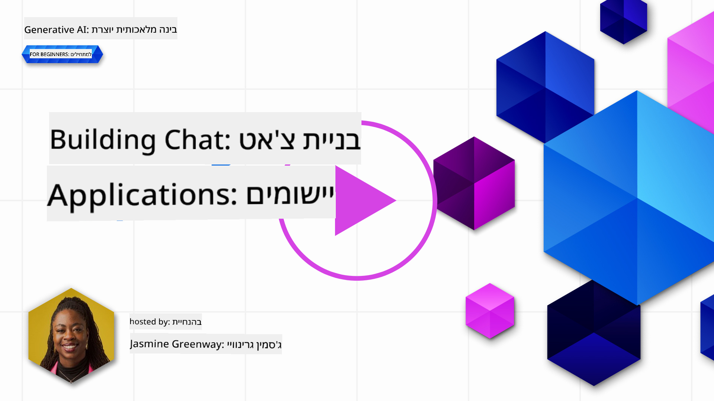
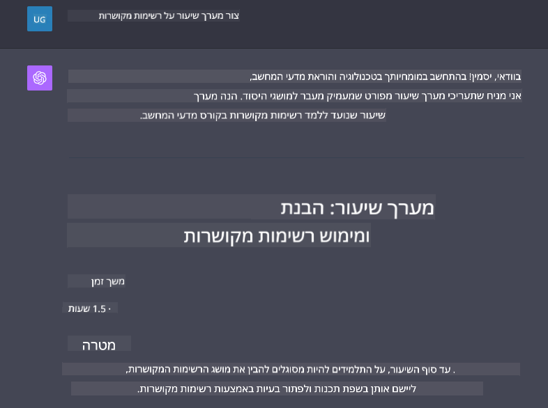

<!--
CO_OP_TRANSLATOR_METADATA:
{
  "original_hash": "ea4bbe640847aafbbba14dae4625e9af",
  "translation_date": "2025-05-19T17:58:35+00:00",
  "source_file": "07-building-chat-applications/README.md",
  "language_code": "he"
}
-->
# בניית יישומי צ'אט המופעלים על ידי AI גנרטיבי

[](https://aka.ms/gen-ai-lessons7-gh?WT.mc_id=academic-105485-koreyst)

> _(לחצו על התמונה למעלה לצפייה בסרטון של השיעור הזה)_

עכשיו כשכבר ראינו איך אפשר לבנות אפליקציות ליצירת טקסט, בואו נבחן את יישומי הצ'אט.

יישומי צ'אט הפכו לחלק בלתי נפרד מחיי היומיום שלנו, ומציעים הרבה יותר מאשר אמצעי לתקשורת מזדמנת. הם חלקים אינטגרליים משירות לקוחות, תמיכה טכנית ואפילו מערכות ייעוץ מתקדמות. סביר להניח שקיבלתם עזרה מיישום צ'אט לא מזמן. ככל שאנו משלבים טכנולוגיות מתקדמות יותר כמו AI גנרטיבי בפלטפורמות אלו, המורכבות גדלה וגם האתגרים.

כמה שאלות שצריך לענות עליהן הן:

- **בניית האפליקציה**. איך אנחנו בונים ביעילות ומשלבים בצורה חלקה את האפליקציות המופעלות על ידי AI לשימושים ספציפיים?
- **מעקב**. לאחר פריסה, איך אנחנו יכולים לעקוב ולהבטיח שהאפליקציות פועלות ברמה הגבוהה ביותר של איכות, הן מבחינת פונקציונליות והן בהיצמדות ל[ששת עקרונות ה-AI האחראי](https://www.microsoft.com/ai/responsible-ai?WT.mc_id=academic-105485-koreyst)?

כשאנחנו מתקדמים לעידן שמוגדר על ידי אוטומציה ואינטראקציות חלקות בין אדם למכונה, הבנת איך AI גנרטיבי משנה את היקף, עומק והתאמת יישומי הצ'אט הופכת להיות חיונית. שיעור זה יחקור את ההיבטים של ארכיטקטורה שתומכת במערכות מורכבות אלו, יעמיק במתודולוגיות לכוונון עדין שלהן למשימות ספציפיות לתחום, ויעריך את המדדים והשיקולים הרלוונטיים להבטחת פריסת AI אחראית.

## הקדמה

שיעור זה מכסה:

- טכניקות לבנייה יעילה ושילוב יישומי צ'אט.
- איך ליישם התאמה אישית וכוונון עדין ליישומים.
- אסטרטגיות ושיקולים למעקב יעיל אחרי יישומי צ'אט.

## מטרות למידה

בסוף השיעור הזה, תוכלו:

- לתאר שיקולים לבניית ושילוב יישומי צ'אט במערכות קיימות.
- להתאים אישית יישומי צ'אט לשימושים ספציפיים.
- לזהות מדדים מרכזיים ושיקולים למעקב יעיל ושמירה על איכות יישומי צ'אט המופעלים על ידי AI.
- להבטיח שיישומי צ'אט מנצלים את AI בצורה אחראית.

## שילוב AI גנרטיבי ביישומי צ'אט

העלאת יישומי צ'אט דרך AI גנרטיבי אינה מתמקדת רק בהפיכתם לחכמים יותר; זה עוסק באופטימיזציה של הארכיטקטורה, הביצועים וממשק המשתמש שלהם כדי לספק חוויית משתמש איכותית. זה כולל חקירת יסודות ארכיטקטוניים, שילובי API ושיקולי ממשק משתמש. סעיף זה נועד להציע לכם מפת דרכים מקיפה לניווט בנופים מורכבים אלו, בין אם אתם מחברים אותם למערכות קיימות או בונים אותם כפלטפורמות עצמאיות.

בסוף סעיף זה, תהיו מצוידים במומחיות הנדרשת לבנות ולשלב יישומי צ'אט ביעילות.

### צ'אט-בוט או יישום צ'אט?

לפני שנצלול לבניית יישומי צ'אט, בואו נשווה בין 'צ'אט-בוטים' לבין 'יישומי צ'אט המופעלים על ידי AI', שמשרתים תפקידים ופונקציות שונים. המטרה העיקרית של צ'אט-בוט היא אוטומציה של משימות שיחה ספציפיות, כמו מענה על שאלות נפוצות או מעקב אחר חבילה. הוא נשלט בדרך כלל על ידי לוגיקה מבוססת חוקים או אלגוריתמים AI מורכבים. לעומת זאת, יישום צ'אט המופעל על ידי AI הוא סביבה הרבה יותר רחבה המיועדת להקל על צורות שונות של תקשורת דיגיטלית, כמו צ'אט טקסט, קול ווידאו בין משתמשים אנושיים. התכונה המגדירה שלו היא שילוב של מודל AI גנרטיבי שמדמה שיחות ניואנסיות, דמויות אדם, ומייצר תגובות על סמך מגוון רחב של קלט ורמזים הקשריים. יישום צ'אט המופעל על ידי AI גנרטיבי יכול לעסוק בדיונים פתוחים, להסתגל להקשרים שיחה משתנים ואפילו לייצר דיאלוג יצירתי או מורכב.

הטבלה שלהלן מציינת את ההבדלים והדמיון המרכזיים שיעזרו לנו להבין את התפקידים הייחודיים שלהם בתקשורת דיגיטלית.

| צ'אט-בוט                               | יישום צ'אט המופעל על ידי AI גנרטיבי |
| ------------------------------------- | -------------------------------------- |
| ממוקד משימות ומבוסס חוקים           | מודע להקשר                          |
| לעיתים משולב במערכות גדולות  | עשוי לארח צ'אט-בוט אחד או יותר      |
| מוגבל לפונקציות מתוכנתות       | משלב מודלים AI גנרטיביים      |
| אינטראקציות מתמחות ומובנות | מסוגל לדון בנושאים פתוחים     |

### ניצול פונקציות מובנות מראש עם SDKs ו-APIs

כשבונים יישום צ'אט, צעד ראשון נהדר הוא להעריך מה כבר קיים שם. שימוש ב-SDKs ו-APIs לבניית יישומי צ'אט הוא אסטרטגיה מועילה ממגוון סיבות. על ידי שילוב SDKs ו-APIs מתועדים היטב, אתם ממקמים את האפליקציה שלכם באופן אסטרטגי להצלחה לטווח ארוך, מתמודדים עם דאגות של סקלאביליות ותחזוקה.

- **מזרז את תהליך הפיתוח ומפחית עומס**: הסתמכות על פונקציות מובנות מראש במקום התהליך היקר של בנייתן בעצמכם מאפשרת לכם להתמקד בהיבטים אחרים של האפליקציה שיכולים להיות יותר חשובים, כמו לוגיקה עסקית.
- **ביצועים טובים יותר**: כשבונים פונקציונליות מאפס, בסופו של דבר תשאלו את עצמכם "איך זה סקלאבילי? האם האפליקציה מסוגלת להתמודד עם זרם פתאומי של משתמשים?" SDK ו-APIs מתוחזקים היטב לעיתים קרובות כוללים פתרונות מובנים לדאגות אלו.
- **תחזוקה קלה יותר**: עדכונים ושיפורים קלים יותר לניהול שכן רוב ה-APIs וה-SDKs פשוט דורשים עדכון לספרייה כאשר גרסה חדשה משוחררת.
- **גישה לטכנולוגיה מתקדמת**: ניצול מודלים שכבר כווננו ואומנו על מערכי נתונים נרחבים מספק לאפליקציה שלכם יכולות שפה טבעית.

גישה לפונקציונליות של SDK או API בדרך כלל כוללת קבלת הרשאה להשתמש בשירותים המסופקים, מה שלרוב מתבצע באמצעות שימוש במפתח ייחודי או אסימון אימות. נשתמש בספריית Python של OpenAI כדי לחקור איך זה נראה. אתם יכולים גם לנסות זאת בעצמכם במחברת הבאה ל-OpenAI [notebook for OpenAI](../../../07-building-chat-applications/python/oai-assignment.ipynb) או במחברת ל-Azure OpenAI Services [notebook for Azure OpenAI Services](../../../07-building-chat-applications/python/aoai-assignment.ipynb) לשיעור זה.

```python
import os
from openai import OpenAI

API_KEY = os.getenv("OPENAI_API_KEY","")

client = OpenAI(
    api_key=API_KEY
    )

chat_completion = client.chat.completions.create(model="gpt-3.5-turbo", messages=[{"role": "user", "content": "Suggest two titles for an instructional lesson on chat applications for generative AI."}])
```

הדוגמה לעיל משתמשת במודל GPT-3.5 Turbo להשלמת הפרומפט, אך שימו לב שהמפתח ל-API מוגדר לפני כן. תקבלו שגיאה אם לא תגדירו את המפתח.

## חווית משתמש (UX)

עקרונות UX כלליים חלים על יישומי צ'אט, אך הנה כמה שיקולים נוספים שמקבלים חשיבות מיוחדת בשל רכיבי הלמידה המכונה המעורבים.

- **מנגנון לטיפול בעמימות**: מודלים של AI גנרטיבי מדי פעם מייצרים תשובות מעורפלות. תכונה שמאפשרת למשתמשים לבקש הבהרה יכולה להיות מועילה אם הם נתקלים בבעיה זו.
- **שמירת הקשר**: מודלים מתקדמים של AI גנרטיבי יכולים לזכור הקשר בתוך שיחה, מה שיכול להיות נכס הכרחי לחווית המשתמש. מתן אפשרות למשתמשים לשלוט ולנהל את ההקשר משפר את חווית המשתמש, אך מציג את הסיכון של שמירת מידע רגיש של המשתמש. שיקולים לגבי כמה זמן מידע זה נשמר, כמו הצגת מדיניות שמירה, יכולים לאזן בין הצורך בהקשר לבין פרטיות.
- **התאמה אישית**: עם היכולת ללמוד ולהסתגל, מודלים של AI מציעים חוויה אישית למשתמש. התאמת חווית המשתמש באמצעות תכונות כמו פרופילי משתמש לא רק גורמת למשתמש להרגיש מובן, אלא גם עוזרת לו למצוא תשובות ספציפיות, יוצרת אינטראקציה יעילה ומספקת יותר.

דוגמה אחת להתאמה אישית היא הגדרות "הוראות מותאמות אישית" ב-ChatGPT של OpenAI. זה מאפשר לכם לספק מידע על עצמכם שעשוי להיות הקשר חשוב לפרומפטים שלכם. הנה דוגמה להוראה מותאמת אישית.


ה"פרופיל" הזה מנחה את ChatGPT ליצור תוכנית שיעור על רשימות מקושרות. שימו לב ש-ChatGPT מתחשב בכך שהמשתמש עשוי לרצות תוכנית שיעור מעמיקה יותר בהתבסס על הניסיון שלה.



### מסגרת הודעות מערכת של Microsoft למודלים של שפה גדולה

[Microsoft סיפקה הנחיות](https://learn.microsoft.com/azure/ai-services/openai/concepts/system-message#define-the-models-output-format?WT.mc_id=academic-105485-koreyst) לכתיבת הודעות מערכת יעילות בעת יצירת תגובות מ-LLMs, מחולקות ל-4 תחומים:

1. הגדרת מי המודל מיועד לו, כמו גם יכולותיו ומגבלותיו.
2. הגדרת פורמט הפלט של המודל.
3. מתן דוגמאות ספציפיות שמדגימות את ההתנהגות המיועדת של המודל.
4. מתן גבולות התנהגות נוספים.

### נגישות

בין אם למשתמש יש ליקויים חזותיים, שמיעתיים, מוטוריים או קוגניטיביים, יישום צ'אט מעוצב היטב צריך להיות שמיש על ידי כולם. הרשימה הבאה מפרקת תכונות ספציפיות שמיועדות לשיפור הנגישות עבור ליקויי משתמשים שונים.

- **תכונות לליקויים חזותיים**: ערכות נושא עם ניגודיות גבוהה וטקסט ניתן לשינוי גודל, תאימות לקוראי מסך.
- **תכונות לליקויים שמיעתיים**: פונקציות טקסט לדיבור ודיבור לטקסט, רמזים חזותיים להודעות שמע.
- **תכונות לליקויים מוטוריים**: תמיכה בניווט באמצעות מקלדת, פקודות קוליות.
- **תכונות לליקויים קוגניטיביים**: אפשרויות שפה פשוטה.

## התאמה אישית וכוונון עדין למודלים של שפה ספציפיים לתחום

דמיינו יישום צ'אט שמבין את הז'רגון של החברה שלכם ומצפה לשאלות הספציפיות של בסיס המשתמשים שלה. ישנם כמה גישות שכדאי להזכיר:

- **ניצול מודלים DSL**. DSL מייצג שפה ספציפית לתחום. אתם יכולים לנצל מודל DSL שנקרא כך שמאומן על תחום ספציפי כדי להבין את הקונספטים והתסריטים שלו.
- **יישום כוונון עדין**. כוונון עדין הוא התהליך של אימון נוסף של המודל שלכם עם נתונים ספציפיים.

## התאמה אישית: שימוש ב-DSL

ניצול מודלים של שפה ספציפיים לתחום (מודלים DSL) יכול לשפר את המעורבות של המשתמש על ידי מתן אינטראקציות מתמחות ורלוונטיות להקשר. זהו מודל שמאומן או מכוונן להבין ולייצר טקסט הקשור לתחום ספציפי, תעשייה או נושא. אפשרויות לשימוש במודל DSL יכולות להשתנות מאימון אחד מאפס ועד לשימוש במודלים קיימים דרך SDKs ו-APIs. אפשרות נוספת היא כוונון עדין, שכולל לקיחת מודל מאומן מראש והתאמתו לתחום ספציפי.

## התאמה אישית: יישום כוונון עדין

כוונון עדין נחשב לעיתים כאשר מודל מאומן מראש נופל קצר בתחום מיוחד או משימה ספציפית.

לדוגמה, שאילתות רפואיות הן מורכבות ודורשות הרבה הקשר. כאשר איש מקצוע רפואי מאבחן מטופל, זה מבוסס על מגוון גורמים כמו אורח חיים או מצבים קיימים, ויכול אפילו להסתמך על כתבי עת רפואיים עדכניים כדי לאמת את האבחנה שלהם. בתסריטים מורכבים כאלה, יישום צ'אט AI כללי לא יכול להיות מקור אמין.

### תרחיש: יישום רפואי

שקלו יישום צ'אט שנועד לסייע למקצוענים רפואיים על ידי מתן הפניות מהירות להנחיות טיפול, אינטראקציות תרופות או ממצאי מחקר עדכניים.

מודל כללי עשוי להיות מספיק למענה על שאלות רפואיות בסיסיות או מתן עצות כלליות, אך עשוי להתקשות עם הדברים הבאים:

- **מקרים מאוד ספציפיים או מורכבים**. לדוגמה, נוירולוג עשוי לשאול את האפליקציה, "מהם הפרקטיקות הטובות ביותר הנוכחיות לניהול אפילפסיה עמידה לתרופות אצל ילדים?"
- **חסרים התקדמות עדכנית**. מודל כללי עשוי להתקשות לספק תשובה עדכנית שמכילה את ההתקדמות האחרונה בנוירולוגיה ופרמקולוגיה.

במקרים כאלה, כוונון עדין של המודל עם מערך נתונים רפואי מתמחה יכול לשפר באופן משמעותי את יכולתו להתמודד עם שאלות רפואיות מורכבות אלו בצורה מדויקת ואמינה יותר. זה דורש גישה למערך נתונים גדול ורלוונטי שמייצג את האתגרים והשאלות הספציפיות לתחום שצריך להתמודד איתם.

## שיקולים לחוויית צ'אט מונעת AI איכותית

סעיף זה מתאר את הקריטריונים ליישומי צ'אט "איכותיים", הכוללים את לכידת המדדים הניתנים לפעולה וההיצמדות למסגרת שמנצלת את טכנולוגיית AI באחריות.

### מדדים מרכזיים

כדי לשמור על ביצועים איכותיים של אפליקציה, חשוב לעקוב אחר מדדים מרכזיים ושיקולים. מדידות אלו לא רק מבטיחות את הפונקציונליות של האפליקציה אלא גם מעריכות את איכות המודל AI וחווית המשתמש. להלן רשימה שמכסה מדדים בסיסיים, AI ומדדי חווית משתמש שיש לקחת בחשבון.

| מדד                        | הגדרה                                                                                                             | שיקולים למפתחי צ'אט                                         |
| ----------------------------- | ---------------------------------------------------------------------------------------------------------------------- | ------------------------------------------------------------------------- |
| **זמן פעולה**                    | מודד את הזמן שבו האפליקציה פועלת ונגישה על ידי משתמשים.                                              | איך תצמצמו זמן השבתה?                                           |
| **זמן תגובה**             | הזמן שנדרש לאפליקציה להשיב לשאילתת משתמש.                                                          | איך תוכלו לשפר את עיבוד השאילתות כדי לשפר את זמן התגובה?           |
| **דיוק**                 | היחס של ניבויים חיוביים נכונים למספר הכולל של ניבויים חיוביים                                     | איך תאמתו את דיוק המודל שלכם?                        |
| **זכירה (רגישות)**      | היחס של ניבויים חיוביים נכונים למספר החיוביים האמיתי                                               | איך תמדדו ותשפרו זכירה?                                  |
| **ציון F1**                  | הממוצע ההרמוני של דיוק וזכירה, שמאזן את הסחר בין שניהם.                                   | מהו ציון ה-F1 שלכם? איך תאזנו בין דיוק לזכירה?  |
| **מורכבות**                | מודד

**כתב ויתור**:  
מסמך זה תורגם באמצעות שירות תרגום בינה מלאכותית [Co-op Translator](https://github.com/Azure/co-op-translator). בעוד שאנו שואפים לדיוק, יש להיות מודעים לכך שתרגומים אוטומטיים עשויים להכיל שגיאות או אי דיוקים. המסמך המקורי בשפתו המקורית צריך להיחשב כמקור סמכותי. עבור מידע קריטי, מומלץ תרגום אנושי מקצועי. אנו לא נושאים באחריות לכל אי הבנות או פירושים שגויים הנובעים משימוש בתרגום זה.