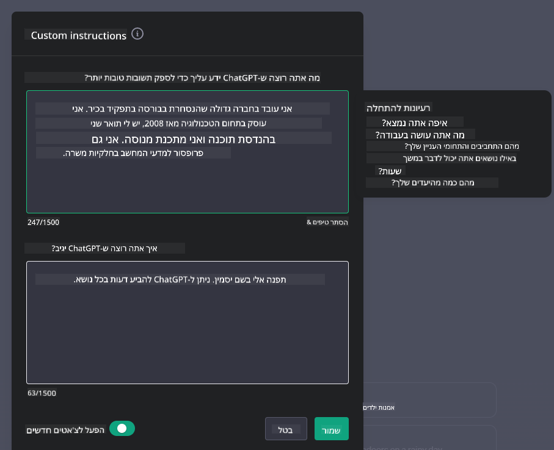
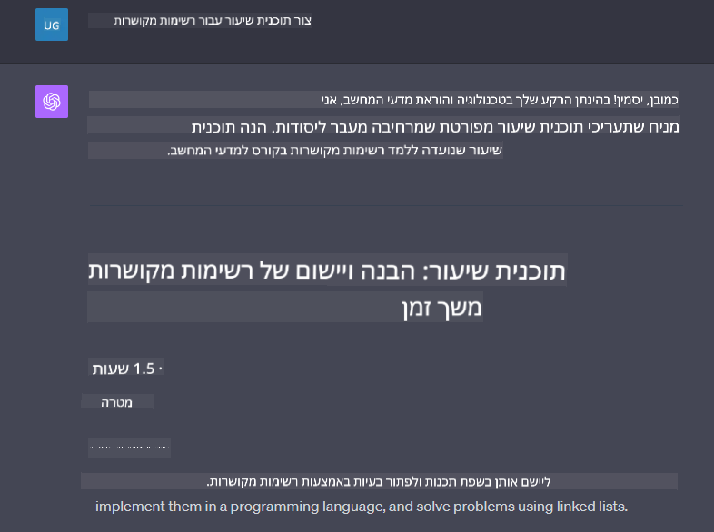

<!--
CO_OP_TRANSLATOR_METADATA:
{
  "original_hash": "ea4bbe640847aafbbba14dae4625e9af",
  "translation_date": "2025-06-25T15:43:56+00:00",
  "source_file": "07-building-chat-applications/README.md",
  "language_code": "he"
}
-->
# בניית אפליקציות צ'אט מבוססות AI גנרטיבי

[](https://aka.ms/gen-ai-lessons7-gh?WT.mc_id=academic-105485-koreyst)

> _(לחץ על התמונה למעלה לצפייה בסרטון של השיעור הזה)_

עכשיו כשאנחנו יודעים כיצד לבנות אפליקציות ליצירת טקסטים, בואו נסתכל על אפליקציות צ'אט.

אפליקציות צ'אט הפכו לחלק בלתי נפרד מחיי היומיום שלנו, והן מציעות יותר מאשר רק אמצעי לשיחה מזדמנת. הן חלקים אינטגרליים משירות לקוחות, תמיכה טכנית ואפילו מערכות ייעוץ מתוחכמות. סביר להניח שקיבלתם עזרה מאפליקציית צ'אט לא מזמן. ככל שאנו משלבים טכנולוגיות מתקדמות כמו AI גנרטיבי בפלטפורמות אלה, המורכבות עולה וגם האתגרים.

כמה שאלות שצריך לענות עליהן הן:

- **בניית האפליקציה**. איך אנחנו בונים ומטמיעים באופן יעיל את האפליקציות המופעלות על ידי AI למקרים שימוש ספציפיים?
- **מעקב**. לאחר הפריסה, כיצד נוכל לעקוב ולהבטיח שהאפליקציות פועלות ברמת האיכות הגבוהה ביותר, הן מבחינת פונקציונליות והן בהקפדה על [ששת העקרונות של AI אחראי](https://www.microsoft.com/ai/responsible-ai?WT.mc_id=academic-105485-koreyst)?

ככל שאנו מתקדמים לעידן המוגדר על ידי אוטומציה ואינטראקציות חלקות בין אדם למכונה, הבנת כיצד AI גנרטיבי משנה את ההיקף, העומק והיכולת להסתגל של אפליקציות צ'אט הופכת להיות חיונית. שיעור זה יחקור את היבטי הארכיטקטורה התומכים במערכות מורכבות אלה, יעמיק בשיטות להתאמתן למשימות ספציפיות בתחום, ויעריך את המדדים והשיקולים הרלוונטיים להבטחת פריסה אחראית של AI.

## הקדמה

שיעור זה מכסה:

- טכניקות לבניית והטמעת אפליקציות צ'אט בצורה יעילה.
- כיצד ליישם התאמה אישית והתאמה עדינה לאפליקציות.
- אסטרטגיות ושיקולים למעקב יעיל אחר אפליקציות צ'אט.

## מטרות למידה

בסיום השיעור הזה, תוכלו:

- לתאר שיקולים לבניית והטמעת אפליקציות צ'אט במערכות קיימות.
- להתאים אישית אפליקציות צ'אט למקרי שימוש ספציפיים.
- לזהות מדדים ושיקולים מרכזיים למעקב ותחזוקת איכות אפליקציות צ'אט המופעלות על ידי AI.
- להבטיח שאפליקציות צ'אט משתמשות ב-AI באופן אחראי.

## שילוב AI גנרטיבי באפליקציות צ'אט

שדרוג אפליקציות צ'אט באמצעות AI גנרטיבי אינו מתמקד רק בהפיכתן לחכמות יותר; מדובר באופטימיזציה של הארכיטקטורה, הביצועים והממשק המשתמש כדי לספק חוויית משתמש איכותית. זה כולל חקירת יסודות הארכיטקטורה, שילובי API ושיקולים של ממשק משתמש. חלק זה נועד להציע לכם מפת דרכים מקיפה לניווט בנופים המורכבים הללו, בין אם אתם מחברים אותם למערכות קיימות או בונים אותם כפלטפורמות עצמאיות.

בסיום חלק זה, תהיו מצוידים במומחיות הנדרשת לבניית והטמעת אפליקציות צ'אט בצורה יעילה.

### צ'אטבוט או אפליקציית צ'אט?

לפני שנצלול לבניית אפליקציות צ'אט, בואו נשווה בין 'צ'אטבוטים' ל'אפליקציות צ'אט מבוססות AI', שמשרתות תפקידים ופונקציות ייחודיות. המטרה העיקרית של צ'אטבוט היא אוטומציה של משימות שיחה ספציפיות, כמו מענה על שאלות נפוצות או מעקב אחר חבילה. הוא בדרך כלל נשלט על ידי לוגיקה מבוססת חוקים או אלגוריתמים AI מורכבים. לעומת זאת, אפליקציית צ'אט מבוססת AI היא סביבה רחבה יותר המיועדת להקל על צורות שונות של תקשורת דיגיטלית, כגון צ'אטים טקסט, קול ווידאו בין משתמשים אנושיים. התכונה המגדירה שלה היא שילוב של מודל AI גנרטיבי המדמה שיחות אנושיות ומורכבות, ומייצר תגובות בהתבסס על מגוון רחב של קלט ורמזים הקשריים. אפליקציית צ'אט מבוססת AI גנרטיבי יכולה להשתתף בדיונים בתחום פתוח, להסתגל להקשרים שיחה מתפתחים ואפילו לייצר דיאלוג יצירתי או מורכב.

הטבלה שלהלן מציגה את ההבדלים והדמיון המרכזיים כדי לעזור לנו להבין את תפקידיהם הייחודיים בתקשורת דיגיטלית.

| צ'אטבוט                              | אפליקציית צ'אט מבוססת AI גנרטיבי    |
| ------------------------------------- | -------------------------------------- |
| ממוקד משימות ומבוסס חוקים            | מודע להקשר                             |
| בדרך כלל משולב במערכות גדולות יותר  | עשוי להכיל אחד או מספר צ'אטבוטים      |
| מוגבל לפונקציות מתוכנתות             | משלב מודלים AI גנרטיביים              |
| אינטראקציות מיוחדות ומובנות          | מסוגל לדיונים בתחום פתוח               |

### ניצול פונקציות מובנות מראש עם SDKs ו-APIs

כשבונים אפליקציית צ'אט, צעד ראשון מצוין הוא להעריך מה כבר קיים בחוץ. שימוש ב-SDKs ו-APIs לבניית אפליקציות צ'אט הוא אסטרטגיה מועילה ממגוון סיבות. על ידי שילוב SDKs ו-APIs מתועדים היטב, אתם ממקמים את האפליקציה שלכם בצורה אסטרטגית להצלחה ארוכת טווח, ומטפלים בדאגות של מדרגיות ותחזוקה.

- **מאיץ את תהליך הפיתוח ומפחית את העלויות**: הסתמכות על פונקציות מובנות מראש במקום על התהליך היקר של בנייתן בעצמכם מאפשרת לכם להתמקד בהיבטים אחרים של האפליקציה שאתם עשויים למצוא חשובים יותר, כמו לוגיקת עסקית.
- **ביצועים טובים יותר**: כשבונים פונקציונליות מאפס, תמצאו את עצמכם שואלים "איך זה מדרג? האם האפליקציה הזו מסוגלת להתמודד עם זרם פתאומי של משתמשים?" SDK ו-APIs מתוחזקים היטב כוללים לעיתים קרובות פתרונות מובנים לדאגות אלה.
- **תחזוקה קלה יותר**: עדכונים ושיפורים קלים יותר לניהול שכן רוב ה-APIs וה-SDKs פשוט דורשים עדכון ספרייה כאשר גרסה חדשה משוחררת.
- **גישה לטכנולוגיה מתקדמת**: ניצול מודלים שהותאמו ואומנו על מערכי נתונים נרחבים מספק לאפליקציה שלכם יכולות שפה טבעית.

גישה לפונקציונליות של SDK או API בדרך כלל כוללת קבלת הרשאה להשתמש בשירותים המסופקים, אשר בדרך כלל מתבצע באמצעות שימוש במפתח ייחודי או אסימון אימות. נשתמש בספריית OpenAI Python כדי לחקור איך זה נראה. תוכלו גם לנסות זאת בעצמכם במחברת [OpenAI](../../../07-building-chat-applications/python/oai-assignment.ipynb) או במחברת [Azure OpenAI Services](../../../07-building-chat-applications/python/aoai-assignment.ipynb) לשיעור זה.

```python
import os
from openai import OpenAI

API_KEY = os.getenv("OPENAI_API_KEY","")

client = OpenAI(
    api_key=API_KEY
    )

chat_completion = client.chat.completions.create(model="gpt-3.5-turbo", messages=[{"role": "user", "content": "Suggest two titles for an instructional lesson on chat applications for generative AI."}])
```

הדוגמה לעיל משתמשת במודל GPT-3.5 Turbo להשלמת הפקודה, אך שימו לב שהמפתח מוגדר לפני כן. תקבלו שגיאה אם לא תגדירו את המפתח.

## חוויית משתמש (UX)

עקרונות UX כלליים חלים על אפליקציות צ'אט, אך הנה כמה שיקולים נוספים שהופכים להיות חשובים במיוחד בשל רכיבי הלמידה המכונתיים המעורבים.

- **מנגנון לטיפול בעמימות**: מודלים AI גנרטיביים מדי פעם מייצרים תשובות עמומות. תכונה שמאפשרת למשתמשים לבקש הבהרה יכולה להיות מועילה אם הם נתקלים בבעיה זו.
- **שימור הקשר**: מודלים AI גנרטיביים מתקדמים יכולים לזכור הקשר בתוך שיחה, מה שיכול להיות נכס הכרחי לחוויית המשתמש. מתן למשתמשים יכולת לשלוט ולנהל הקשר משפר את חוויית המשתמש, אך מציג את הסיכון לשמירת מידע משתמש רגיש. שיקולים לגבי כמה זמן מידע זה נשמר, כגון הצגת מדיניות שימור, יכולים לאזן בין הצורך בהקשר לבין פרטיות.
- **התאמה אישית**: עם היכולת ללמוד ולהסתגל, מודלים AI מציעים חוויה מותאמת אישית למשתמש. התאמת חוויית המשתמש באמצעות תכונות כמו פרופילי משתמש לא רק גורמת למשתמש להרגיש מובן, אלא גם עוזרת לו למצוא תשובות ספציפיות, וליצור אינטראקציה יעילה ומספקת יותר.

דוגמה אחת להתאמה אישית היא הגדרות "הוראות מותאמות אישית" ב-ChatGPT של OpenAI. זה מאפשר לכם לספק מידע על עצמכם שיכול להיות הקשר חשוב לפקודות שלכם. הנה דוגמה להוראה מותאמת אישית.



ה"פרופיל" הזה מנחה את ChatGPT ליצור תוכנית שיעור על רשימות מקושרות. שימו לב ש-ChatGPT מתחשב בכך שהמשתמש עשוי לרצות תוכנית שיעור מעמיקה יותר בהתבסס על ניסיונה.



### מסגרת הודעות מערכת של מיקרוסופט למודלים שפה גדולים

[מיקרוסופט סיפקה הנחיות](https://learn.microsoft.com/azure/ai-services/openai/concepts/system-message#define-the-models-output-format?WT.mc_id=academic-105485-koreyst) לכתיבת הודעות מערכת יעילות בעת יצירת תגובות ממודלים שפה גדולים, מחולקות ל-4 תחומים:

1. הגדרת למי המודל מיועד, כמו גם יכולותיו ומגבלותיו.
2. הגדרת פורמט הפלט של המודל.
3. מתן דוגמאות ספציפיות המדגימות את ההתנהגות המתוכננת של המודל.
4. מתן גדרות התנהגות נוספות.

### נגישות

בין אם למשתמש יש ליקויים חזותיים, שמיעתיים, מוטוריים או קוגניטיביים, אפליקציית צ'אט מעוצבת היטב צריכה להיות ניתנת לשימוש על ידי כולם. הרשימה הבאה מפרקת תכונות ספציפיות שמטרתן לשפר את הנגישות עבור ליקויי משתמש שונים.

- **תכונות לליקוי חזותי**: ערכות נושא עם ניגודיות גבוהה וטקסט ניתן לשינוי גודל, תאימות לקוראי מסך.
- **תכונות לליקוי שמיעתי**: פונקציות טקסט לדיבור ודיבור לטקסט, רמזים חזותיים להודעות שמע.
- **תכונות לליקוי מוטורי**: תמיכה בניווט באמצעות מקלדת, פקודות קוליות.
- **תכונות לליקוי קוגניטיבי**: אפשרויות שפה פשוטות.

## התאמה אישית והתאמה עדינה למודלים שפה ספציפיים לתחום

דמיינו אפליקציית צ'אט שמבינה את הז'רגון של החברה שלכם ומצפה לשאילתות ספציפיות שהמשתמשים שלה נוהגים להעלות. ישנן כמה גישות שכדאי להזכיר:

- **ניצול מודלים DSL**. DSL מייצג שפה ספציפית לתחום. תוכלו לנצל מודל DSL שנאמן על תחום ספציפי כדי להבין את הקונספטים והתסריטים שלו.
- **יישום התאמה עדינה**. התאמה עדינה היא תהליך של אימון נוסף של המודל שלכם עם נתונים ספציפיים.

## התאמה אישית: שימוש ב-DSL

ניצול מודלים שפה ספציפיים לתחום (DSL Models) יכול לשפר את מעורבות המשתמשים על ידי מתן אינטראקציות מיוחדות ורלוונטיות הקשרית. זהו מודל שאומן או הותאם להבין ולייצר טקסט הקשור לתחום ספציפי, תעשייה או נושא. אפשרויות לשימוש במודל DSL יכולות להשתנות מאימון אחד מאפס, לשימוש במודלים קיימים באמצעות SDKs ו-APIs. אפשרות נוספת היא התאמה עדינה, הכוללת לקיחת מודל מאומן מראש והתאמתו לתחום ספציפי.

## התאמה אישית: יישום התאמה עדינה

התאמה עדינה נחשבת לעיתים כאשר מודל מאומן מראש לא מצליח בתחום ספציפי או משימה מסוימת.

לדוגמה, שאילתות רפואיות הן מורכבות ודורשות הרבה הקשר. כאשר מקצוען רפואי מאבחן מטופל זה מבוסס על מגוון גורמים כגון אורח חיים או מצבים קיימים, ויכול אפילו להסתמך על כתבי עת רפואיים עדכניים כדי לאמת את האבחנה שלו. בתסריטים מורכבים כאלה, אפליקציית צ'אט AI כללית לא יכולה להיות מקור אמין.

### תרחיש: אפליקציה רפואית

שקלו אפליקציית צ'אט שנועדה לסייע למטפלים רפואיים על ידי מתן הפניות מהירות להנחיות טיפול, אינטראקציות תרופתיות או ממצאים מחקריים עדכניים.

מודל כללי עשוי להיות מספיק לענות על שאלות רפואיות בסיסיות או לספק עצות כלליות, אך הוא עשוי להתקשות עם הדברים הבאים:

- **מקרים מאוד ספציפיים או מורכבים**. לדוגמה, נוירולוג עשוי לשאול את האפליקציה, "מהן הפרקטיקות הטובות ביותר הנוכחיות לניהול אפילפסיה עמידה לתרופות אצל מטופלים צעירים?"
- **חוסר בהתקדמות עדכנית**. מודל כללי יכול להתקשות לספק תשובה עדכנית שמשלבת את ההתקדמות האחרונה בנוירולוגיה ופרמקולוגיה.

במקרים כאלה, התאמה עדינה של המודל עם מערך נתונים רפואי מיוחד יכולה לשפר משמעותית את יכולתו להתמודד עם שאילתות רפואיות מורכבות אלה בצורה מדויקת ואמינה יותר. זה דורש גישה למערך נתונים גדול ורלוונטי שמייצג את האתגרים והשאלות הספציפיות בתחום שיש לטפל בהם.

## שיקולים לחוויית צ'אט מונעת AI איכותית

חלק זה מפרט את הקריטריונים לאפליקציות צ'אט "איכותיות", הכוללים לכידה של מדדים שניתן לפעול לפיהם והקפדה על מסגרת שמנצלת את טכנולוגיית AI בצורה אחראית.

### מדדים מרכזיים

כדי לשמור על ביצועים איכותיים של אפליקציה, חשוב לעקוב אחר מדדים מרכזיים ושיקולים. מדידות אלו לא רק מבטיחות את הפונקציונליות של האפליקציה אלא גם מעריכות את איכות המודל AI וחוויית המשתמש. להלן רשימה המכסה מדדים בסיסיים, מדדי AI ומדדי חוויית משתמש שיש לקחת בחשבון.

| מדד                         | הגדרה                                                                                                              | שיקולים למפתח צ'אט                                                  |
| ----------------------------- | ------------------------------------------------------------------------------------------------------------------ | ------------------------------------------------------------------------- |
| **זמן פעולה**                | מודד את הזמן שהאפליקציה פועלת ונגישה על ידי משתמשים.                                                               | איך תצמצם זמן השבתה?                                                      |
| **זמן תגובה**                | הזמן שלוקח לאפליקציה להשיב לשאילתת משתמש.                                                                        | איך תוכל לייעל את עיבוד השאילתות לשיפור זמן התגובה?                      |
| **דיוק**                     | היחס בין תחזיות חיוביות אמיתיות לבין סך התחזיות החיוביות                                                          | איך תאמת את דיוק המודל שלך?                                               |
| **ריקול (רגישות)**           | היחס בין תחזיות חיוביות אמיתיות לבין המספר האמיתי של חיוביות                                                      | איך תמדוד ותשפר ריקול?                                                   |
| **ציון F1**                  | הממוצע ההרמוני של דיוק וריקול, שמאזן את הפשרה בין שניהם.                                                         | מהו ציון ה-F1 שלך? איך תאזן בין דיוק לריקול?                             |
| **פרפלקסיטי**                | מודד כמה טוב ההתפלגות ההסתברות שנחזה על ידי

**כתב ויתור**:  
מסמך זה תורגם באמצעות שירות תרגום AI [Co-op Translator](https://github.com/Azure/co-op-translator). למרות שאנו שואפים לדיוק, יש להיות מודעים לכך שתרגומים אוטומטיים עשויים להכיל שגיאות או אי-דיוקים. המסמך המקורי בשפתו המקורית צריך להיחשב כמקור הסמכותי. עבור מידע קריטי, מומלץ להשתמש בתרגום אנושי מקצועי. אנו לא נושאים באחריות על כל אי-הבנה או פרשנות מוטעית הנובעות מהשימוש בתרגום זה.