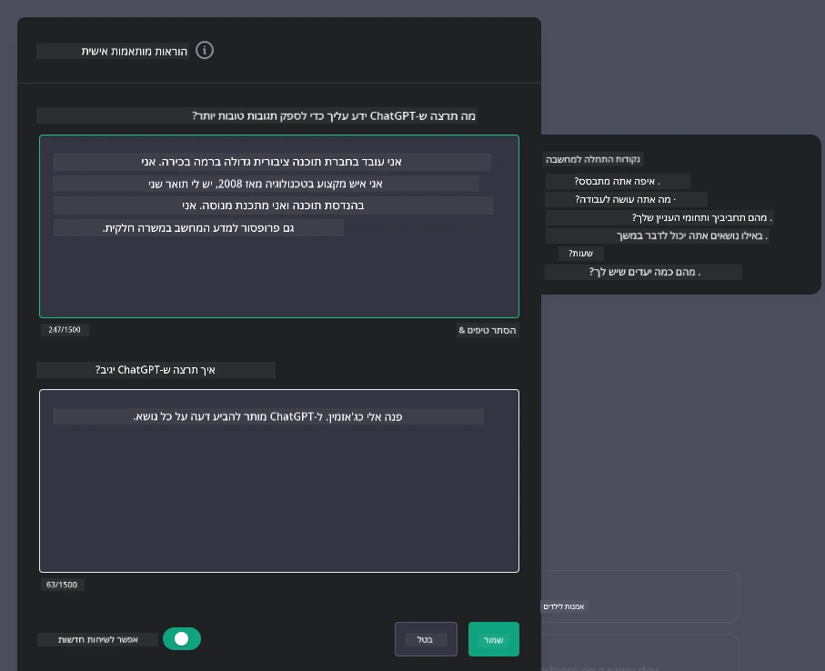
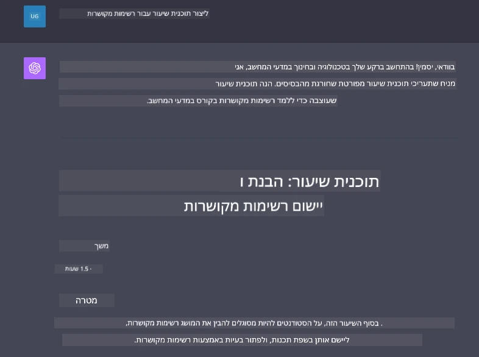

# בניית אפליקציות צ׳אט מונעות בינה מלאכותית גנרטיבית

[](https://youtu.be/R9V0ZY1BEQo?si=IHuU-fS9YWT8s4sA)

> _(לחצו על התמונה למעלה כדי לצפות בסרטון של השיעור)_

עכשיו כשראינו כיצד ניתן לבנות אפליקציות לייצור טקסט, בואו נבחן אפליקציות צ׳אט.

אפליקציות צ׳אט הפכו לחלק בלתי נפרד מחיינו היומיומיים, ומציעות יותר מאשר רק אמצעי לשיחה יום יומית. הן מהוות חלק בלתי נפרד משירות לקוחות, תמיכה טכנית ואפילו מערכות ייעוץ מתקדמות. סביר להניח שקיבלתם עזרה מאפליקציית צ׳אט לא מזמן. ככל שאנו משתלבים טכנולוגיות מתקדמות יותר כמו בינה מלאכותית גנרטיבית בפלטפורמות אלו, המורכבות עולה וכך גם האתגרים.

כמה שאלות שצריך לענות עליהן הן:

- **בניית האפליקציה**. כיצד נבנה בצורה יעילה ונשלב בצורה חלקה אפליקציות מונעות בינה מלאכותית לשימושים ספציפיים?
- **מעקב ובקרה**. לאחר הפריסה, איך נוכל לעקוב ולהבטיח שהאפליקציות פועלות ברמת איכות גבוהה, הן במונחי פונקציונליות והן לפי [ששת עקרונות הבינה המלאכותית האחראית](https://www.microsoft.com/ai/responsible-ai?WT.mc_id=academic-105485-koreyst)?

כאשר אנו מתקדמים לעידן המוגדר על ידי אוטומציה ואינטראקציות חלקות בין אדם למכונה, הבנת כיצד בינה מלאכותית גנרטיבית משנה את הטווח, העומק והיכולת להסתגל של אפליקציות צ׳אט הופכת לחשובה. שיעור זה יבחן את היבטי הארכיטקטורה התומכים במערכות מורכבות אלו, יעמיק בשיטות לכיול מתקדם למשימות בתחום ספציפי, ויעריך את המדדים והשיקולים הרלוונטיים להבטחת פריסת בינה מלאכותית אחראית.

## מבוא

שיעור זה יכלול:

- טכניקות לבניית ושילוב אפליקציות צ׳אט ביעילות.
- כיצד ליישם התאמה אישית וכיול מתקדם לאפליקציות.
- אסטרטגיות ושיקולים לבקרה יעילה של אפליקציות צ׳אט.

## מטרות למידה

בסיום השיעור תוכלו:

- לתאר שיקולים לבניית ואינטגרציה של אפליקציות צ׳אט במערכות קיימות.
- להתאים אפליקציות צ׳אט לצרכים ספציפיים.
- לזהות מדדים ושיקולים מרכזיים למעקב ותחזוקה יעילה של איכות אפליקציות צ׳אט מונעות בינה מלאכותית.
- להבטיח שאפליקציות הצ׳אט ישתמשו בבינה מלאכותית באחריות.

## שילוב בינה מלאכותית גנרטיבית באפליקציות צ׳אט

שדרוג אפליקציות צ׳אט באמצעות בינה מלאכותית גנרטיבית אינו מתמקד רק בהפיכתן לחכמות יותר; מדובר באופטימיזציה של הארכיטקטורה, הביצועים וממשק המשתמש כדי לספק חוויית משתמש איכותית. זה כולל חקירת היסודות הארכיטקטוניים, אינטגרציות API ושיקולי ממשק המשתמש. חלק זה שואף להציע לכם מפת דרכים מקיפה להתמודדות עם תחומים מורכבים אלו, בין אם אתם משתלבים במערכות קיימות או בונים פלטפורמות עצמאיות.

בסוף חלק זה תצוידו במיומנויות הדרושות לבנייה ושילוב אפליקציות צ׳אט ביעילות.

### בוט שיח או אפליקציית צ׳אט?

לפני שנצלול לבניית אפליקציות צ׳אט, נשווה בין 'בוטים' לבין 'אפליקציות צ׳אט מונעות בינה מלאכותית', שממלאות תפקידים ופונקציות מובחנות. מטרתו העיקרית של בוט שיח היא לאוטומציה של משימות שיחה ספציפיות, כמו מענה על שאלות נפוצות או מעקב אחר חבילה. הוא בדרך כלל נשלט על ידי לוגיקה מבוססת חוקים או אלגוריתמים מורכבים של בינה מלאכותית. לעומת זאת, אפליקציית צ׳אט מונעת בינה מלאכותית היא סביבה רחבה הרבה יותר שנועדה לאפשר צורות שונות של תקשורת דיגיטלית, כגון שיחות טקסט, קול ווידאו בין משתמשים אנושיים. מאפיינה המובהק הוא השילוב של מודל בינה מלאכותית גנרטיבי המדמה שיחות עדינות בדומה לבני אדם, המייצר תגובות המבוססות על מגוון רחב של קלט ורמזים הקשריים. אפליקציית צ׳אט מונעת בינה מלאכותית גנרטיבית יכולה לנהל דיונים בכל תחום, להתאים את עצמה להקשרים משתנים של השיחה ואפילו לייצר דיאלוג יצירתי או מורכב.

הטבלה למטה מציגה את ההבדלים והדמיון המרכזיים כדי לעזור לנו להבין את תפקידיהן הייחודיים בתקשורת דיגיטלית.

| בוט שיח                            | אפליקציית צ׳אט מונעת בינה מלאכותית גנרטיבית                         |
| ----------------------------------- | -------------------------------------- |
| ממוקד משימה ומבוסס חוק              | מודע להקשר                            |
| לעיתים משולב במערכות גדולות יותר     | עשוי לארח בוט שיח אחד או כמה          |
| מוגבל לתפקודים מתוכנתים              | משלב מודלי בינה מלאכותית גנרטיבית   |
| אינטראקציות ממוקדות ומגודרות        | מסוגל לדיונים פתוחים וללא הגבלה       |

### שימוש בפונקציונליות מוכנה מראש עם SDKs ו-APIs

בעת בניית אפליקציית צ׳אט, צעד ראשון מצוין הוא להעריך מה כבר קיים. שימוש ב-SDKs ו-APIs לבניית אפליקציות צ׳אט הוא אסטרטגיה מועילה ממגוון סיבות. על ידי אינטגרציה של SDKs ו-APIs מתועדים היטב, אתם ממקמים את האפליקציה שלכם להצלחה ארוכת טווח, ומטפלים בנושאי מדרגיות ותחזוקה.

- **מזרז תהליך פיתוח ומפחית עומס**: הסתמכות על פונקציונליות מוכנה מראש במקום תהליך יקר של בנייה עצמית מאפשרת לכם להתמקד בהיבטים אחרים של האפליקציה שחשובים לכם יותר, כמו לוגיקת העסקית.
- **ביצועים טובים יותר**: כאשר בונים פונקציונליות מאפס, אתם תוהים בסופו של דבר "כמה זה מתרחב? האם האפליקציה מסוגלת לטפל בשטף פתאומי של משתמשים?" SDKs ו-APIs מתוחזקים היטב כוללים לעיתים קרובות פתרונות מובנים לנושאים אלו.
- **תחזוקה קלה יותר**: עדכונים ושיפורים קלים יותר לניהול כיוון שרוב ה-APIs וה-SDKs דורשים פשוט עדכון של ספרייה כשמשוחררת גרסה חדשה.
- **גישה לטכנולוגיה מתקדמת**: שימוש במודלים שעברו כיול ואימון על מאגרי נתונים נרחבים מספק לאפליקציה שלכם יכולות שפה טבעית.

גישה לפונקציונליות של SDK או API בדרך כלל כוללת קבלת הרשאה לשימוש בשירותים הניתנים, שלרוב נעשית באמצעות מפתח ייחודי או אסימון אימות. נשתמש בספריית Python של OpenAI כדי לבחון איך זה נראה. תוכלו גם לנסות זאת בעצמכם במחברות הבאות: [מחברת ל-OpenAI](./python/oai-assignment.ipynb?WT.mc_id=academic-105485-koreyst) או [מחברת לשירותי Azure OpenAI](./python/aoai-assignment.ipynb?WT.mc_id=academic-105485-koreys) לשיעור זה.

```python
import os
from openai import OpenAI

API_KEY = os.getenv("OPENAI_API_KEY","")

client = OpenAI(
    api_key=API_KEY
    )

response = client.responses.create(model="gpt-5-mini", input="Suggest two titles for an instructional lesson on chat applications for generative AI.", store=False)
print(response.output_text)
```

הדוגמה למעלה משתמשת במודל GPT-5 מיני עם Responses API להשלים את הפקודה, אך שימו לב שמפתח ה-API מוגדר לפני כן. תקבלו שגיאה אם לא תגדירו את המפתח.

## חווית משתמש (UX)

עקרונות UX כלליים חלים על אפליקציות צ׳אט, אך להלן שיקולים נוספים שהופכים לקריטיים במיוחד עקב רכיבי הלמידה המכונה המעורבים.

- **מנגנון לטיפול באמיגואיטיות**: מודלים גנרטיביים של בינה מלאכותית לעיתים מייצרים תשובות מעורפלות. אפשרות למשתמשים לבקש הבהרה יכולה להיות מועילה אם הם נתקלים בבעיה זו.
- **שמירת הקשר**: מודלים מתקדמים של בינה מלאכותית גנרטיבית יכולים לזכור הקשר בתוך שיחה, מה שיכול להיות נכס הכרחי לחוויית המשתמש. מתן יכולת למשתמשים לשלוט ולנהל את ההקשר משפר את חוויית המשתמש, אך מציב סיכון לשמירת מידע רגיש. שיקולים לגבי כמה זמן מידע זה ישמר, כמו הטמעת מדיניות שמירה, יכולים לאזן בין הצורך בהקשר לבין פרטיות.
- **התאמה אישית**: עם היכולת ללמוד ולהסתגל, מודלים של AI מציעים חוויה מותאמת אישית למשתמש. התאמה אישית של חוויית המשתמש דרך מאפיינים כמו פרופילי משתמשות לא רק גורמת למשתמש להרגיש מובן, אלא גם מסייעת לו במציאת תשובות ספציפיות, ויוצרת אינטראקציה יעילה ומספקת יותר.

דוגמה אחת להתאמה אישית היא הגדרות "הוראות מותאמות" ב-ChatGPT של OpenAI. הן מאפשרות לכם לספק מידע אודות עצמכם שיכול להיות הקשר חשוב לפקודות שלכם. הנה דוגמה להוראה מותאמת.



"פרופיל" זה מורה ל-ChatGPT ליצור תוכנית שיעור על רשימות מקושרות. שימו לב ש-ChatGPT מתחשב בכך שהמשתמש עשוי לרצות תוכנית שיעור מעמיקה יותר בהתבסס על ניסיונה.



### מסגרת הודעות מערכת של מיקרוסופט למודלים גדולים של שפה

[מיקרוסופט סיפקה הנחיות](https://learn.microsoft.com/azure/ai-foundry/openai/concepts/system-message#define-the-models-output-format?WT.mc_id=academic-105485-koreyst) לכתיבת הודעות מערכת יעילות בעת הפקת תגובות מ-LLMs, המחולקות ל-4 תחומים:

1. הגדרת עבור מי המודל, וכן יכולותיו ומגבלותיו.
2. הגדרת פורמט הפלט של המודל.
3. מתן דוגמאות ספציפיות המדגימות את התנהגות המודל הרצויה.
4. מתן אמצעי בקרה התנהגותיים נוספים.

### נגישות

בין אם למשתמש יש ליקויי ראייה, שמיעה, תנועה או קוגניטיביים, אפליקציית צ׳אט מעוצבת היטב צריכה להיות ניתנת לשימוש לכולם. הרשימה הבאה מפרטת מאפיינים ספציפיים שמטרתם לשפר את הנגישות עבור ליקויים שונים של משתמשים.

- **מאפיינים לליקויי ראייה**: נושאים בקונטרסט גבוה וטקסט הניתן לשינוי גודל, תאימות לקורא מסכים.
- **מאפיינים לליקויי שמיעה**: פונקציות טקסט לדיבור ודיבור לטקסט, רמזים חזותיים להודעות קוליות.
- **מאפיינים לליקויי תנועה**: תמיכה בניווט במקלדת, פקודות קוליות.
- **מאפיינים לליקויי קוגניציה**: אפשרויות שפה מפושטות.

## התאמה אישית וכיול מתקדם למודלי שפה תחומיים

דמיינו אפליקציית צ׳אט שמבינה את המונחים של החברה שלכם ומנבאת את השאלות הספציפיות שהמשתמשים שלה נוטים לשאול. יש כמה גישות שכדאי להזכיר:

- **שימוש במודלי DSL**. DSL הוא ראשי תיבות של domain specific language — שפה המיועדת לתחום מסוים. ניתן להשתמש במודל DSL מאומן על תחום מסוים להבנת מושגיו ותסריטיו.
- **יישום כיול מתקדם**. כיול מתקדם הוא תהליך של אימון נוסף של המודל על נתונים ספציפיים.

## התאמה אישית: שימוש ב-DSL

שימוש במודלי שפה תחומיים (DSL Models) יכול לשפר את מעורבות המשתמש על ידי מתן אינטראקציות מותאמות ומקושרות להקשר. מדובר במודל שאומן או כויל להבין וליצור טקסט הקשור לתחום, ענף או נושא ספציפי. אפשרויות לשימוש במודל DSL משתנות מאימון אחד מאפס ועד שימוש במודלים קיימים דרך SDKs ו-APIs. אפשרות נוספת היא כיול מתקדם, הכולל לקיחת מודל מאומן מראש והטמעת התאמות לתחום מסוים.

## התאמה אישית: יישום כיול מתקדם

לעיתים קרובות שוקלים כיול מתקדם כאשר מודל מאומן מראש אינו עומד בסטנדרטים בתחום מיוחד או למשימה ספציפית.

לדוגמה, שאילתות רפואיות הן מורכבות ודורשות הרבה הקשר. כאשר רופא מאבחן מטופל, הוא מתבסס על מגוון גורמים כגון אורח חיים או מצבים רפואיים קיימים, ואפילו על כתבי עת רפואיים עדכניים לאימות האבחנה. בתרחישים מורכבים אלו, אפליקציית צ׳אט רבת מטרות כללית אינה יכולה לשמש מקור מהימן.

### תרחיש: אפליקציה רפואית

שקלו אפליקציית צ׳אט שנועדה לסייע לרופאים על ידי מתן הפניות מהירות להנחיות טיפול, אינטראקציות בין תרופות או ממצאי מחקר עדכניים.

מודל כללי עשוי להיות מספיק למענה על שאלות רפואיות בסיסיות או מתן עצות כלליות, אך הוא עלול להתקשות ב:

- **מקרים מאוד ספציפיים או מורכבים**. למשל, נוירולוג עשוי לשאול את האפליקציה, "מהם הפרקטיקות הטובות ביותר כיום לניהול אפילפסיה עמידה לתרופות אצל ילדים?"
- **אי הכללת התקדמות רפואית חדשה**. מודל כללי עלול להתקשות לספק תשובה עדכנית הכוללת את ההתפתחויות האחרונות בניורולוגיה ופרמקולוגיה.

במקרים כאלה, כיול מתקדם של המודל עם מערך נתונים רפואי מיוחד יכול לשפר משמעותית את יכולתו להתמודד עם שאלות רפואיות מורכבות אלו בצורה מדויקת ואמינה יותר. זה דורש גישה למערך נתונים רחב ורלוונטי המייצג את האתגרים והשאלות הספציפיות בתחום.

## שיקולים לחוויית צ׳אט מונעת AI איכותית

חלק זה מפרט קריטריונים ל"איכות גבוהה" של אפליקציות צ׳אט, הכוללים מדידת מדדים ברי-ביצוע ומעקב במסגרת המשתמשת בטכנולוגיית AI באחריות.

### מדדים מרכזיים

כדי לשמור על ביצועי איכות גבוהים של אפליקציה, חשוב לעקוב אחר מדדים ושיקולים מרכזיים. מדידות אלה לא רק מבטיחות את פונקציונליות האפליקציה, אלא גם מעריכות את איכות מודל ה-AI וחוויית המשתמש. להלן רשימה של מדדים בסיסיים, AI וחוויית משתמש שיש לשקול.

| מדד                          | הגדרה                                                                                                              | שיקולים למפתח צ׳אט                                                      |
| ----------------------------- | ----------------------------------------------------------------------------------------------------------------- | ------------------------------------------------------------------------- |
| **זמן פעילות (Uptime)**      | מודד את משך הזמן שהאפליקציה פועלת ונגישה למשתמשים.                                                             | איך תצמצם את זמן ההשבתה?                                                |
| **זמן תגובה**                | הזמן שלוקח לאפליקציה להשיב לשאילתה של המשתמש.                                                                   | איך תאפשר אופטימיזציה לתהליך עיבוד השאילתה לשיפור זמן התגובה?          |
| **דיוק (Precision)**          | היחס בין תחזיות חיוביות מדויקות לסך כל התחזיות החיוביות.                                                       | איך תוודא את הדיוק של המודל שלך?                                       |
| **Recall (רגישות)**          | היחס בין תחזיות חיוביות מדויקות למספר האמיתי של חיוביים.                                                       | איך תמדוד ותשפר את הרגישות?                                            |
| **ציונון F1**                 | הממוצע ההרמוני בין דיוק ורגישות, מאזן את הפשרה ביניהם.                                                        | מה היעד שלך לציון F1? איך תאזן בין דיוק ורגישות?                       |
| **Perplexity**               | מודד עד כמה התפלגות ההסתברויות שחוזה המודל מתאימה להתפלגות האמיתית של הנתונים.                                 | איך תפחית את ה-perplexity?                                              |
| **מדדי שביעות רצון משתמש**  | מודד את תפיסת המשתמש לגבי האפליקציה. בדרך כלל נאסף דרך סקרים.                                                 | באיזו תדירות תאסוף משוב משתמש? איך תתאים את האפליקציה לפי המשוב?     |
| **שיעור טעויות**             | שיעור הטעויות שהמודל עושה בהבנה או בפלט.                                                                        | אילו אסטרטגיות יש לך להפחתת שיעורי הטעויות?                            |
| **מחזורי אימון מחדש**       | תדירות העדכון של המודל לשילוב נתונים ותובנות חדשות.                                                            | באיזו תדירות תבצע אימון מחדש? מה מעורר מחזור אימון מחדש?               |

| **זיהוי אנומליות**         | כלים וטכניקות לזיהוי דפוסים חריגים שאינם עומדים בהתנהגות הצפויה.                        | כיצד תגיב לאנומליות?                                        |

### יישום עקרונות בינה מלאכותית אחראית ביישומי צ'אט

הגישה של מיקרוסופט לבינה מלאכותית אחראית זיהתה שישה עקרונות שמטרתם להנחות את פיתוח והשימוש בבינה מלאכותית. להלן העקרונות, הגדרתם, ודברים שמפתח צ'אט צריך לקחת בחשבון ולמה כדאי שייקח אותם ברצינות.

| עקרונות              | הגדרת מיקרוסופט                                   | שיקולים למפתח צ'אט                                                  | למה זה חשוב                                                                          |
| ---------------------- | ----------------------------------------------------- | ---------------------------------------------------------------------- | -------------------------------------------------------------------------------------- |
| הוגנות                | מערכות בינה מלאכותית צריכות לנהוג בהוגנות כלפי כולם. | יש לוודא שהאפליקציה לא מפלה על סמך נתוני משתמש.                   | כדי לבנות אמון וכלילה בקרב המשתמשים; למנוע השלכות משפטיות.                       |
| אמינות ובטיחות        | מערכות בינה מלאכותית צריכות לפעול באופן אמין ובטוח.   | יש ליישם בדיקות ומנגנוני שמירה למזעור שגיאות וסיכונים.             | מבטיח שביעות רצון משתמש ומונע נזק פוטנציאלי.                                      |
| פרטיות ואבטחה         | מערכות בינה מלאכותית חייבות להיות מאובטחות ולכבד פרטיות. | יש ליישם הצפנה חזקה ואמצעי הגנה על נתונים.                          | להגנה על מידע רגיש של המשתמש ולעמידה בחוקי פרטיות.                                |
| הכללה                 | מערכות בינה מלאכותית צריכות להעצים את כולם ולשלב אנשים. | יש לתכנן ממשק משתמש נגיש וקל לשימוש עבור קהלים מגוונים.          | מבטיח טווח רחב יותר של משתמשים שיכולים להשתמש באפליקציה ביעילות.                |
| שקיפות                | מערכות בינה מלאכותית צריכות להיות מובנות.             | יש לספק תיעוד ברור ונימוקים לתגובות הבינה המלאכותית.               | משתמשים נוטים לסמוך יותר על מערכת אם הם מבינים כיצד מתקבלות ההחלטות.             |
| אחריות                | אנשים צריכים להיות אחראיים למערכות הבינה המלאכותית.   | יש להקים תהליך ברור לביקורת ושיפור החלטות הבינה המלאכותית.        | מאפשר שיפור מתמיד ונקיטת צעדי תיקון במקרה של טעויות.                             |

## משימה

עיין ב-[המשימה](../../../07-building-chat-applications/python). היא תעבור אותך דרך סדרה של תרגילים מהרצת שאלות ראשונות בצ'אט, לסיווג וסיכום טקסט ועוד. שים לב שהמשימות זמינות בשפות תכנות שונות!

## עבודה מעולה! המשך את המסע

לאחר שסיימת את השיעור, בדוק את [אוסף הלמידה של בינה מלאכותית גנרטיבית](https://aka.ms/genai-collection?WT.mc_id=academic-105485-koreyst) שלנו כדי להמשיך להעמיק בידע שלך בבינה מלאכותית גנרטיבית!

עבור לשיעור 8 כדי לראות כיצד תוכל להתחיל [לבנות יישומי חיפוש](../08-building-search-applications/README.md?WT.mc_id=academic-105485-koreyst)!

---

<!-- CO-OP TRANSLATOR DISCLAIMER START -->
**כתב ויתור**:
מסמך זה תורגם באמצעות שירות תרגום אוטומטי [Co-op Translator](https://github.com/Azure/co-op-translator). למרות שאנו שואפים לדיוק, יש לקחת בחשבון שתרגומים אוטומטיים עלולים להכיל שגיאות או אי-דיוקים. יש להחשיב את המסמך המקורי בשפתו הטבעית כמקור הסמכות. למידע קריטי מומלץ להשתמש בתרגום מקצועי על ידי מתרגם אדם. אנו לא אחראים לכל אי-הבנה או פירוש שגוי הנובע מהשימוש בתרגום זה.
<!-- CO-OP TRANSLATOR DISCLAIMER END -->