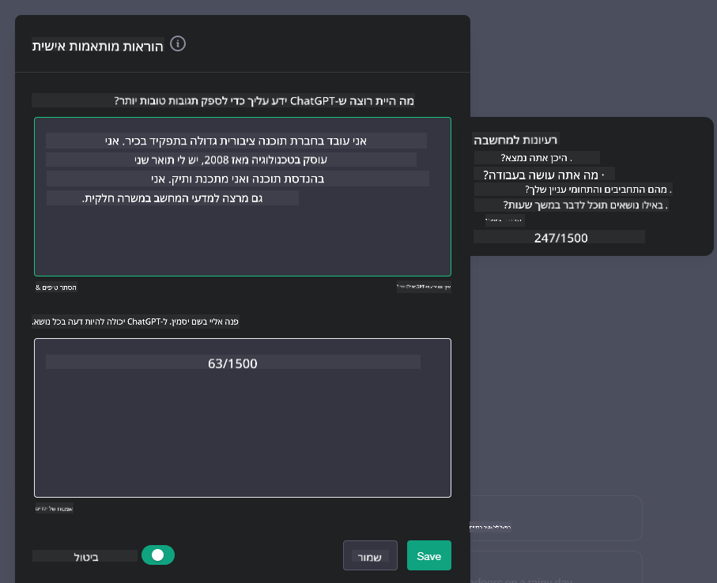

<!--
CO_OP_TRANSLATOR_METADATA:
{
  "original_hash": "ea4bbe640847aafbbba14dae4625e9af",
  "translation_date": "2025-07-09T12:33:45+00:00",
  "source_file": "07-building-chat-applications/README.md",
  "language_code": "he"
}
-->
# בניית אפליקציות צ'אט מבוססות בינה מלאכותית גנרטיבית

[](https://aka.ms/gen-ai-lessons7-gh?WT.mc_id=academic-105485-koreyst)

> _(לחצו על התמונה למעלה לצפייה בסרטון של השיעור)_

כעת, לאחר שראינו כיצד ניתן לבנות אפליקציות ליצירת טקסט, נבחן את עולם אפליקציות הצ'אט.

אפליקציות צ'אט הפכו לחלק בלתי נפרד מחיי היומיום שלנו, ומציעות הרבה מעבר לשיחה יומיומית פשוטה. הן מהוות חלק מרכזי בשירות לקוחות, תמיכה טכנית ואפילו במערכות ייעוץ מתקדמות. סביר להניח שקיבלתם עזרה מאפליקציית צ'אט לא מזמן. ככל שאנו משלבים טכנולוגיות מתקדמות יותר כמו בינה מלאכותית גנרטיבית בפלטפורמות אלו, המורכבות והאתגרים גדלים.

כמה שאלות שחשוב לענות עליהן הן:

- **בניית האפליקציה**. איך נבנה ונשלב בצורה יעילה ואינטגרטיבית אפליקציות מבוססות AI למקרים ספציפיים?
- **ניטור**. לאחר הפריסה, איך נוכל לעקוב ולוודא שהאפליקציות פועלות ברמה הגבוהה ביותר מבחינת פונקציונליות ועמידה ב[ששת עקרונות ה-AI האחראי](https://www.microsoft.com/ai/responsible-ai?WT.mc_id=academic-105485-koreyst)?

בעידן שבו האוטומציה והאינטראקציה החלקה בין אדם למכונה מגדירות את המציאות, הבנת האופן שבו בינה מלאכותית גנרטיבית משנה את היקף, עומק וגמישות אפליקציות הצ'אט היא חיונית. שיעור זה יבחן את ההיבטים הארכיטקטוניים התומכים במערכות מורכבות אלו, יעמיק בשיטות לכוונון מדויק למשימות תחומיות, ויעריך מדדים ושיקולים להבטחת פריסה אחראית של AI.

## מבוא

בשיעור זה נלמד על:

- טכניקות לבניית ואינטגרציה יעילה של אפליקציות צ'אט.
- כיצד ליישם התאמה אישית וכוונון מדויק לאפליקציות.
- אסטרטגיות ושיקולים לניטור אפקטיבי של אפליקציות צ'אט.

## מטרות הלמידה

בסיום השיעור תוכל/י:

- לתאר שיקולים בבניית ואינטגרציה של אפליקציות צ'אט במערכות קיימות.
- להתאים אישית אפליקציות צ'אט למקרי שימוש ספציפיים.
- לזהות מדדים מרכזיים ושיקולים לניטור ותחזוקה יעילה של איכות אפליקציות צ'אט מבוססות AI.
- להבטיח שימוש אחראי בבינה מלאכותית באפליקציות צ'אט.

## שילוב בינה מלאכותית גנרטיבית באפליקציות צ'אט

שדרוג אפליקציות צ'אט באמצעות בינה מלאכותית גנרטיבית אינו רק להפוך אותן לחכמות יותר; מדובר באופטימיזציה של הארכיטקטורה, הביצועים וממשק המשתמש כדי לספק חוויית משתמש איכותית. זה כולל בחינה של יסודות הארכיטקטורה, אינטגרציות API ושיקולים בממשק המשתמש. חלק זה נועד להעניק לך מפת דרכים מקיפה להתמודדות עם הנושאים המורכבים הללו, בין אם אתה מחבר אותן למערכות קיימות או בונה פלטפורמות עצמאיות.

בסיום חלק זה, תהיה לך המומחיות הדרושה לבניית ואינטגרציה יעילה של אפליקציות צ'אט.

### צ'אטבוט או אפליקציית צ'אט?

לפני שנצלול לבניית אפליקציות צ'אט, נשווה בין 'צ'אטבוטים' ל'אפליקציות צ'אט מבוססות AI', שלכל אחד מהם תפקידים ופונקציות מובחנות. מטרתו העיקרית של צ'אטבוט היא לאוטומציה של משימות שיחה ספציפיות, כמו מענה על שאלות נפוצות או מעקב אחר חבילה. הוא בדרך כלל נשלט על ידי לוגיקה מבוססת חוקים או אלגוריתמים מורכבים של AI. לעומת זאת, אפליקציית צ'אט מבוססת AI היא סביבה רחבה יותר שמטרתה לאפשר צורות שונות של תקשורת דיגיטלית, כגון שיחות טקסט, קול ווידאו בין משתמשים אנושיים. התכונה המבדילה שלה היא שילוב של מודל בינה מלאכותית גנרטיבי המדמה שיחות מורכבות בדומה לאדם, ומייצר תגובות בהתבסס על מגוון רחב של קלט ורמזים הקשריים. אפליקציית צ'אט מבוססת AI גנרטיבי יכולה לנהל שיחות פתוחות, להסתגל להקשרים משתנים ואפילו ליצור דיאלוג יצירתי או מורכב.

הטבלה הבאה מפרטת את ההבדלים והדמיון המרכזיים כדי לעזור לנו להבין את תפקידיהם הייחודיים בתקשורת דיגיטלית.

| צ'אטבוט                              | אפליקציית צ'אט מבוססת בינה מלאכותית גנרטיבית |
| ------------------------------------ | ----------------------------------------------- |
| ממוקד משימה ומבוסס חוקים            | מודע להקשר                                      |
| משולב לעיתים במערכות גדולות יותר    | עשוי לארח צ'אטבוט אחד או יותר                   |
| מוגבל לפונקציות מתוכנתות מראש       | כולל מודלים גנרטיביים של AI                      |
| אינטראקציות מתמחות ומובנות          | מסוגל לנהל שיחות פתוחות                          |

### ניצול פונקציות מוכנות מראש עם SDKs ו-APIs

כאשר בונים אפליקציית צ'אט, צעד ראשון טוב הוא לבדוק מה כבר קיים. שימוש ב-SDKs ו-APIs לבניית אפליקציות צ'אט הוא אסטרטגיה מומלצת ממספר סיבות. באמצעות אינטגרציה של SDKs ו-APIs מתועדים היטב, אתה מציב את האפליקציה שלך בעמדה אסטרטגית להצלחה ארוכת טווח, תוך התייחסות לנושאי סקלאביליות ותחזוקה.

- **מאיץ את תהליך הפיתוח ומפחית עומס**: הסתמכות על פונקציות מוכנות מראש במקום לבנות אותן בעצמך חוסכת זמן ומאפשרת להתמקד בהיבטים אחרים של האפליקציה, כמו לוגיקת עסק.
- **ביצועים טובים יותר**: כשבונים פונקציונליות מאפס, תתמודד עם שאלות כמו "איך זה מתמודד עם עומס משתמשים פתאומי?" SDKs ו-APIs מתוחזקים היטב כוללים לעיתים פתרונות מובנים לנושאים אלו.
- **תחזוקה קלה יותר**: עדכונים ושיפורים מנוהלים בקלות, בדרך כלל באמצעות עדכון ספרייה כשגרסה חדשה יוצאת.
- **גישה לטכנולוגיה מתקדמת**: שימוש במודלים שעברו כוונון ואימון על מאגרי נתונים נרחבים מעניק לאפליקציה יכולות שפה טבעית מתקדמות.

גישה לפונקציונליות של SDK או API כוללת בדרך כלל קבלת הרשאה לשימוש בשירותים, לרוב באמצעות מפתח ייחודי או אסימון אימות. נשתמש בספריית OpenAI לפייתון כדי להדגים זאת. ניתן גם לנסות זאת בעצמכם ב[מחברת OpenAI](../../../07-building-chat-applications/python/oai-assignment.ipynb) או ב[מחברת Azure OpenAI Services](../../../07-building-chat-applications/python/aoai-assignment.ipynb) לשיעור זה.

```python
import os
from openai import OpenAI

API_KEY = os.getenv("OPENAI_API_KEY","")

client = OpenAI(
    api_key=API_KEY
    )

chat_completion = client.chat.completions.create(model="gpt-3.5-turbo", messages=[{"role": "user", "content": "Suggest two titles for an instructional lesson on chat applications for generative AI."}])
```

בדוגמה שלמעלה נעשה שימוש במודל GPT-3.5 Turbo להשלמת הפקודה, אך שימו לב שמפתח ה-API מוגדר מראש. תקבלו שגיאה אם לא תגדירו את המפתח.

## חוויית משתמש (UX)

עקרונות UX כלליים חלים על אפליקציות צ'אט, אך ישנם שיקולים נוספים שחשובים במיוחד בשל רכיבי הלמידה המכונה המעורבים.

- **מנגנון לטיפול באי-בהירות**: מודלים גנרטיביים לפעמים מייצרים תשובות לא ברורות. תכונה שמאפשרת למשתמשים לבקש הבהרה יכולה להיות מועילה במקרים כאלה.
- **שימור הקשר**: מודלים מתקדמים מסוגלים לזכור הקשר בתוך שיחה, מה שיכול לשפר את חוויית המשתמש. מתן אפשרות למשתמשים לנהל את ההקשר משפר את החוויה, אך מעלה סיכונים לשמירת מידע רגיש. שיקולים לגבי משך השמירה, כמו מדיניות שימור, יכולים לאזן בין הצורך בהקשר לפרטיות.
- **התאמה אישית**: עם היכולת ללמוד ולהסתגל, מודלים מציעים חוויה מותאמת אישית. התאמת חוויית המשתמש באמצעות פרופילי משתמש לא רק גורמת למשתמש להרגיש מובן, אלא גם מסייעת לו למצוא תשובות מדויקות יותר, ליצירת אינטראקציה יעילה ומספקת.

דוגמה להתאמה אישית היא הגדרות "הוראות מותאמות" ב-ChatGPT של OpenAI. הן מאפשרות לספק מידע על עצמך שעשוי להיות הקשר חשוב לפקודות שלך. הנה דוגמה להוראה מותאמת.



"פרופיל" זה מנחה את ChatGPT ליצור תוכנית שיעור על רשימות מקושרות. שימו לב ש-ChatGPT מתחשב בכך שהמשתמש עשוי לרצות תוכנית שיעור מעמיקה יותר בהתבסס על ניסיונה.


### מסגרת הודעות מערכת של מיקרוסופט למודלים לשוניים גדולים

[מיקרוסופט סיפקה הנחיות](https://learn.microsoft.com/azure/ai-services/openai/concepts/system-message#define-the-models-output-format?WT.mc_id=academic-105485-koreyst) לכתיבת הודעות מערכת יעילות בעת יצירת תגובות מ-LLMs, המחולקות ל-4 תחומים:

1. הגדרת קהל היעד של המודל, יכולותיו ומגבלותיו.
2. הגדרת פורמט הפלט של המודל.
3. מתן דוגמאות ספציפיות המדגימות את ההתנהגות הרצויה של המודל.
4. מתן כללי התנהגות נוספים.

### נגישות

בין אם למשתמש יש לקויות ראייה, שמיעה, תנועה או קוגניטיביות, אפליקציית צ'אט מתוכננת היטב צריכה להיות נגישה לכולם. הרשימה הבאה מפרטת תכונות שמטרתן לשפר את הנגישות למגוון לקויות.

- **תכונות ללקויי ראייה**: נושאים בקונטרסט גבוה, טקסט שניתן לשינוי גודל, תאימות לקוראי מסך.
- **תכונות ללקויי שמיעה**: פונקציות טקסט לדיבור ודיבור לטקסט, רמזים ויזואליים להודעות קוליות.
- **תכונות ללקויי תנועה**: תמיכה בניווט באמצעות מקלדת, פקודות קוליות.
- **תכונות ללקויי קוגניציה**: אפשרויות שפה מפושטת.

## התאמה אישית וכוונון מדויק למודלים לשוניים תחומיים

דמיינו אפליקציית צ'אט שמבינה את המונחים הייחודיים של החברה שלכם ומנבאת את השאלות הספציפיות שהמשתמשים שלה שואלים לעיתים קרובות. קיימות כמה גישות שכדאי להזכיר:

- **שימוש במודלים לשוניים תחומיים (DSL)**. DSL הוא מודל לשוני המותאם לתחום ספציפי, שמבין את המושגים והתסריטים שלו.
- **יישום כוונון מדויק**. כוונון מדויק הוא תהליך של אימון נוסף של המודל עם נתונים ספציפיים.

## התאמה אישית: שימוש ב-DSL

שימוש במודלים לשוניים תחומיים (DSL Models) יכול לשפר את מעורבות המשתמש על ידי מתן אינטראקציות מותאמות וממוקדות הקשר. זהו מודל שאומן או כוונן להבין וליצור טקסט הקשור לתחום, תעשייה או נושא מסוים. אפשרויות השימוש במודל DSL משתנות בין אימון מאפס, שימוש במודלים קיימים דרך SDKs ו-APIs, או כוונון מדויק של מודל מאומן מראש.

## התאמה אישית: יישום כוונון מדויק

כוונון מדויק נבחן לעיתים כאשר מודל מאומן מראש אינו מספק בתחום מיוחד או במשימה ספציפית.

לדוגמה, שאלות רפואיות הן מורכבות ודורשות הקשר רב. כאשר רופא מאבחן מטופל, הוא מתבסס על גורמים שונים כמו אורח חיים או מחלות רקע, ואפילו על מאמרים רפואיים עדכניים לאימות האבחנה. במצבים מורכבים כאלה, אפליקציית צ'אט מבוססת AI כללית אינה יכולה לשמש מקור אמין.

### תרחיש: אפליקציה רפואית

נניח אפליקציית צ'אט שנועדה לסייע לרופאים על ידי מתן הפניות מהירות להנחיות טיפול, אינטראקציות בין תרופות או ממצאים מחקריים עדכניים.

מודל כללי עשוי להספיק למענה על שאלות רפואיות בסיסיות או מתן ייעוץ כללי, אך יתקשה ב:

- **מקרים ספציפיים או מורכבים מאוד**. לדוגמה, נוירולוג עשוי לשאול: "מהן השיטות הטובות ביותר כיום לניהול אפילפסיה עמידה לתרופות בילדים?"
- **חוסר בידע על התפתחויות עדכניות**. מודל כללי עלול להתקשות לספק תשובה עדכנית שמשלבת את ההתקדמות האחרונה בנוירולוגיה ופרמקולוגיה.

במקרים כאלה, כוונון מדויק של המודל עם מאגר נתונים רפואי מיוחד יכול לשפר משמעותית את היכולת להתמודד עם שאלות רפואיות מורכבות בצורה מדויקת ואמינה יותר. זה דורש גישה למאגר נתונים גדול ורלוונטי שמייצג את האתגרים והשאלות התחומיות שיש לטפל בהן.

## שיקולים לחוויית צ'אט איכותית מבוססת AI

חלק זה מפרט את הקריטריונים לאפליקציות צ'אט "איכותיות", הכוללים איסוף מדדים ניתנים לפעולה ועמידה במסגרת שמנצל את טכנולוגיית ה-AI באחריות.

### מדדים מרכזיים

כדי לשמור על ביצועים איכותיים של האפליקציה, חשוב לעקוב אחר מדדים ושיקולים מרכזיים. מדדים אלו לא רק מבטיחים את תפקוד האפליקציה, אלא גם מעריכים את איכות מודל ה-AI וחוויית המשתמש. להלן רשימה המכסה מדדים בסיסיים, AI וחוויית משתמש שיש לקחת בחשבון.

| מדד                          | הגדרה                                                                                                                | שיקולים למפתח הצ'אט                                                  |
| ---------------------------- | --------------------------------------------------------------------------------------------------------------------- | -------------------------------------------------------------------- |
| **זמינות (Uptime)**          | מודד את הזמן שבו האפליקציה פעילה ונגישה למשתמשים.                                                                   | איך תצמצם את זמני ההשבתה?                                           |
| **זמן תגובה**                | הזמן שלוקח לאפליקציה להשיב לשאילתת משתמש.                                                                           | איך תייעל את עיבוד השאילתות לשיפור זמן התגובה?                      |
| **דיוק (Precision)**          | היחס בין תחזיות חיוביות נכונות לסך כל התחזיות החיוביות.                                                             | איך תאמת את הדיוק של המודל שלך?                                     |
| **זכירה (Recall / Sensitivity)** | היחס בין תחזיות חיוביות נכונות למספר האמיתי של חיוביים.                                                              | איך תמדוד ותשפר את הזכירה?                                          |
| **ציון F1**                  | הממוצע ההרמוני של דיוק וזכירה, שמאזן בין השניים.                                                                      | מהו ציון ה-F1 היעד שלך? איך תאזן בין דיוק לזכירה?                   |
| **פרפלקסיטי (Perplexity)**   | מודד עד כמה התפלגות ההסתברויות שחזה המודל תואמת להתפלגות האמיתית של הנתונים.                                         | איך תצמצם את הפרפלקסיטי?                                           |
| **מדדי שביעות רצון משתמש**  | מודד את תפיסת המשתמש לגבי האפליקציה. לרוב נאסף באמצעות סקרים.                                                        | באיזו תדירות תאסוף משוב משתמש? איך תתאים את האפליקציה בהתאם?       |
| **שיעור שגיאות**             | שיעור הטעויות שהמודל עושה בהבנה או ביציאה.                                                                            | אילו אסטרט
| **זיהוי חריגות**           | כלים וטכניקות לזיהוי דפוסים לא שגרתיים שאינם תואמים להתנהגות הצפויה.                          | איך תגיב לחריגות?                                                        |

### יישום עקרונות AI אחראי באפליקציות צ'אט

הגישה של Microsoft ל-AI אחראי זיהתה שישה עקרונות שמנחים את פיתוח ושימוש ה-AI. להלן העקרונות, ההגדרה שלהם, והנקודות שמפתח צ'אט צריך לקחת בחשבון ולמה חשוב להתייחס אליהן ברצינות.

| עקרונות               | ההגדרה של Microsoft                                  | שיקולים למפתח צ'אט                                                  | למה זה חשוב                                                                       |
| ---------------------- | ----------------------------------------------------- | ------------------------------------------------------------------- | --------------------------------------------------------------------------------- |
| הוגנות                 | מערכות AI צריכות להתייחס לכל האנשים בהוגנות.          | לוודא שאפליקציית הצ'אט לא מפלה על בסיס נתוני משתמש.               | לבנות אמון וכלילה בקרב המשתמשים; למנוע השלכות משפטיות.                         |
| אמינות ובטיחות        | מערכות AI צריכות לפעול באמינות ובבטיחות.              | ליישם בדיקות ומנגנוני כשל בטוחים כדי למזער שגיאות וסיכונים.        | מבטיח שביעות רצון משתמש ומונע נזק פוטנציאלי.                                   |
| פרטיות ואבטחה         | מערכות AI צריכות להיות מאובטחות ולכבד פרטיות.         | ליישם הצפנה חזקה ואמצעי הגנה על נתונים.                            | לשמור על נתוני משתמש רגישים ולעמוד בחוקי פרטיות.                               |
| הכללה                  | מערכות AI צריכות להעצים את כולם ולכלול אנשים.         | לעצב ממשק משתמש נגיש וקל לשימוש לקהלים מגוונים.                   | מבטיח טווח רחב יותר של אנשים שיכולים להשתמש באפליקציה ביעילות.                |
| שקיפות                 | מערכות AI צריכות להיות מובנות.                         | לספק תיעוד ברור והסברים לתגובות ה-AI.                            | משתמשים נוטים יותר לסמוך על מערכת אם הם מבינים כיצד מתקבלות ההחלטות.           |
| אחריות                 | אנשים צריכים להיות אחראים למערכות AI.                  | לקבוע תהליך ברור לביקורת ושיפור החלטות ה-AI.                     | מאפשר שיפור מתמשך ופעולות מתקנות במקרה של טעויות.                             |

## משימה

עיין ב-[assignment](../../../07-building-chat-applications/python) שייקח אותך דרך סדרת תרגילים, מהפעלת הפקודות הראשונות בצ'אט, דרך סיווג וסיכום טקסטים ועוד. שים לב שהמשימות זמינות בשפות תכנות שונות!

## עבודה מצוינת! המשך את המסע

לאחר שסיימת את השיעור, בדוק את [אוסף הלמידה של Generative AI](https://aka.ms/genai-collection?WT.mc_id=academic-105485-koreyst) כדי להמשיך להעמיק את הידע שלך ב-Generative AI!

עבור לשיעור 8 כדי לראות איך אפשר להתחיל [לבנות אפליקציות חיפוש](../08-building-search-applications/README.md?WT.mc_id=academic-105485-koreyst)!

**כתב ויתור**:  
מסמך זה תורגם באמצעות שירות תרגום מבוסס בינה מלאכותית [Co-op Translator](https://github.com/Azure/co-op-translator). למרות שאנו שואפים לדיוק, יש לקחת בחשבון כי תרגומים אוטומטיים עלולים להכיל שגיאות או אי-דיוקים. המסמך המקורי בשפת המקור שלו נחשב למקור הסמכותי. למידע קריטי מומלץ להשתמש בתרגום מקצועי על ידי מתרגם אנושי. אנו לא נושאים באחריות לכל אי-הבנה או פרשנות שגויה הנובעת משימוש בתרגום זה.